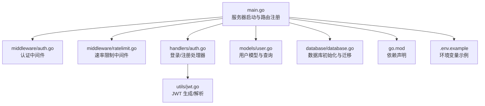
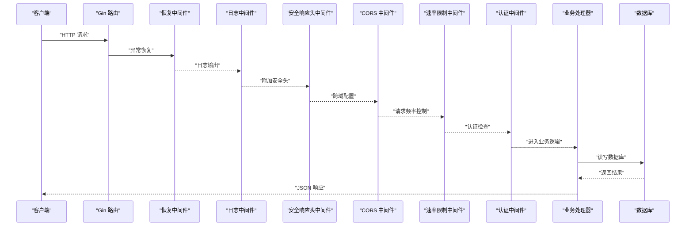
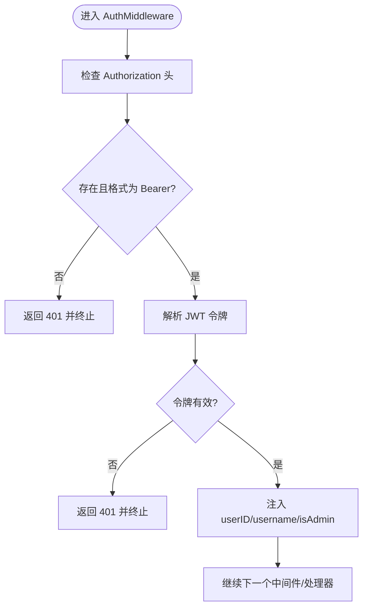
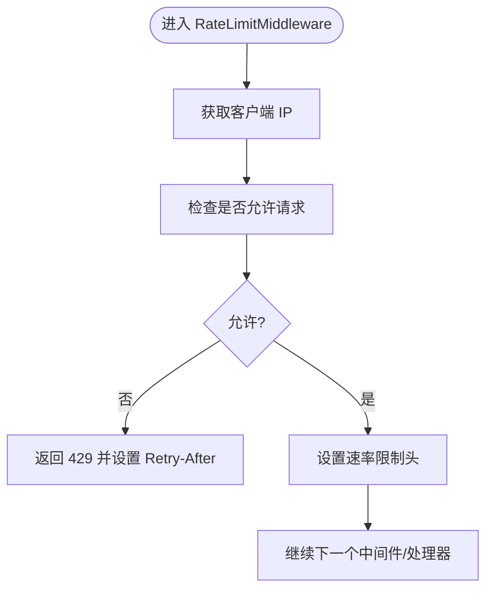
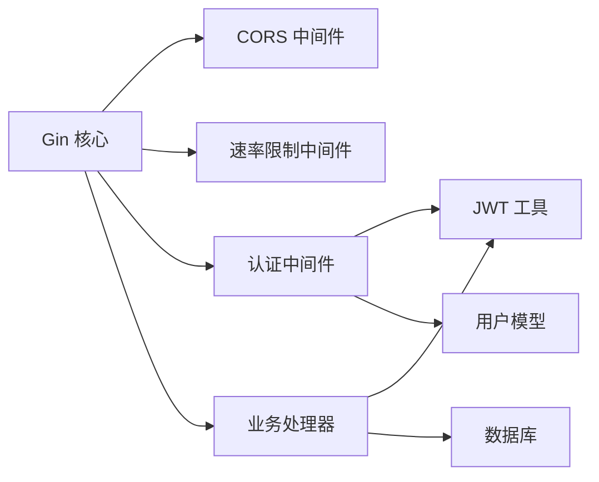

# 核心服务

<cite>
**本文引用的文件**
- [backend/main.go](file://backend/main.go)
- [backend/middleware/auth.go](file://backend/middleware/auth.go)
- [backend/middleware/ratelimit.go](file://backend/middleware/ratelimit.go)
- [backend/utils/jwt.go](file://backend/utils/jwt.go)
- [backend/handlers/auth.go](file://backend/handlers/auth.go)
- [backend/models/user.go](file://backend/models/user.go)
- [backend/database/database.go](file://backend/database/database.go)
- [backend/go.mod](file://backend/go.mod)
- [.env.example](file://.env.example)
</cite>

## 目录
1. [简介](#简介)
2. [项目结构](#项目结构)
3. [核心组件](#核心组件)
4. [架构总览](#架构总览)
5. [组件详解](#组件详解)
6. [依赖关系分析](#依赖关系分析)
7. [性能与扩展性](#性能与扩展性)
8. [故障排查指南](#故障排查指南)
9. [结论](#结论)
10. [附录](#附录)

## 简介
本文件面向 Memo Studio 后端核心服务模块，聚焦于基于 Gin 的 Web 服务配置与使用，涵盖路由系统设计、中间件机制（认证、速率限制、CORS）、服务器启动流程、健康检查端点、以及 JWT 认证与权限控制的实现细节。文档旨在帮助开发者快速理解服务架构、正确配置与扩展功能。

## 项目结构
后端采用 Go 语言与 Gin 框架，配合 SQLite 数据库存储，提供 REST API 与静态资源托管能力。核心入口为 main.go，路由在其中集中定义；认证与速率限制通过中间件实现；JWT 工具负责令牌签发与解析；用户模型与数据库初始化位于 models 与 database 包中。

图表来源
- [backend/main.go](file://backend/main.go#L28-L352)
- [backend/middleware/auth.go](file://backend/middleware/auth.go#L12-L71)
- [backend/middleware/ratelimit.go](file://backend/middleware/ratelimit.go#L96-L143)
- [backend/handlers/auth.go](file://backend/handlers/auth.go#L27-L111)
- [backend/utils/jwt.go](file://backend/utils/jwt.go#L29-L76)
- [backend/models/user.go](file://backend/models/user.go#L13-L110)
- [backend/database/database.go](file://backend/database/database.go#L20-L60)
- [backend/go.mod](file://backend/go.mod#L1-L45)
- [.env.example](file://.env.example#L1-L16)

章节来源
- [backend/main.go](file://backend/main.go#L28-L352)
- [backend/go.mod](file://backend/go.mod#L1-L45)

## 核心组件
- Gin 服务器与中间件栈：包含恢复、日志、安全响应头、CORS、速率限制、认证等中间件。
- 路由分组：/api/v1 与 /api（兼容层）两条路径，前者为推荐使用，后者保留旧接口。
- 认证中间件：从 Authorization 头提取 Bearer Token，解析 JWT 并注入用户上下文。
- 速率限制中间件：基于内存的滑动窗口计数，支持全局与严格模式。
- CORS 中间件：根据环境变量动态配置 AllowOrigins，生产环境建议显式设置。
- 健康检查端点：/health 返回服务状态与版本信息。
- 数据库初始化：SQLite 连接、PRAGMA 设置与多版本迁移。
- JWT 工具：生成与解析，支持自定义过期时间与刷新。

章节来源
- [backend/main.go](file://backend/main.go#L39-L85)
- [backend/middleware/auth.go](file://backend/middleware/auth.go#L12-L71)
- [backend/middleware/ratelimit.go](file://backend/middleware/ratelimit.go#L96-L143)
- [backend/utils/jwt.go](file://backend/utils/jwt.go#L29-L76)
- [backend/database/database.go](file://backend/database/database.go#L20-L60)

## 架构总览
下图展示从客户端请求到响应返回的关键路径，包括中间件链路与关键处理步骤。

图表来源
- [backend/main.go](file://backend/main.go#L39-L85)
- [backend/middleware/ratelimit.go](file://backend/middleware/ratelimit.go#L96-L121)
- [backend/middleware/auth.go](file://backend/middleware/auth.go#L12-L52)
- [backend/handlers/auth.go](file://backend/handlers/auth.go#L27-L53)
- [backend/database/database.go](file://backend/database/database.go#L20-L60)

## 组件详解

### Gin 服务器与路由系统
- 服务器初始化：根据环境变量设置模式（开发/生产），初始化数据库，创建 Gin 实例并挂载中间件。
- 中间件顺序：Recovery → Logger（非 release）→ 安全响应头 → CORS → 路由分组。
- 路由分组：
  - /api/v1：推荐 API 前缀，公开登录/注册（带速率限制），其余接口需认证。
  - /api（兼容层）：保留旧接口，行为与 /api/v1 类似。
- 静态资源与 SPA 回退：嵌入式静态文件与 NoRoute 回退逻辑，支持前端单页应用。
- 服务器启动：监听 PORT（默认 9000），生产环境检查必要配置（如 JWT 密钥）。

章节来源
- [backend/main.go](file://backend/main.go#L28-L352)

### 认证中间件与权限控制
- 认证流程：
  - 从 Authorization 头提取 Bearer Token。
  - 使用 JWT 工具解析并校验签名。
  - 将用户 ID、用户名、是否管理员注入到上下文。
  - 管理员权限检查通过 AdminOnly 中间件实现。
- 权限控制：
  - 非法或缺失令牌返回 401。
  - 管理员专用接口仅对 isAdmin=true 的用户开放。
  - 旧令牌兼容：若 claim 缺失 is_admin，则回查数据库补全。

图表来源
- [backend/middleware/auth.go](file://backend/middleware/auth.go#L12-L52)
- [backend/utils/jwt.go](file://backend/utils/jwt.go#L51-L66)

章节来源
- [backend/middleware/auth.go](file://backend/middleware/auth.go#L12-L71)
- [backend/utils/jwt.go](file://backend/utils/jwt.go#L29-L76)
- [backend/models/user.go](file://backend/models/user.go#L63-L76)

### 速率限制中间件
- 设计要点：
  - 基于内存的滑动窗口计数，每个客户端 IP 一个桶。
  - 默认全局限制：每分钟最多 50 次请求；严格模式每分钟 30 次。
  - 超限时返回 429，并设置 Retry-After 与速率限制头。
- 配置参数：
  - 限制次数（limit）与时间窗口（window）可通过 NewRateLimiter 自定义。
  - 全局限制器通过单例懒加载创建。
- 扩展建议：
  - 生产环境可替换为基于 Redis 的分布式限流。
  - 支持按用户 ID 或 API 路径细分限流策略。

图表来源
- [backend/middleware/ratelimit.go](file://backend/middleware/ratelimit.go#L96-L121)

章节来源
- [backend/middleware/ratelimit.go](file://backend/middleware/ratelimit.go#L11-L143)

### CORS 配置策略
- 动态配置：
  - 通过 MEMO_CORS_ORIGINS 环境变量设置允许的源，多个源以逗号分隔。
  - 若未设置，开发环境默认放开，生产环境建议明确配置以提升安全性。
- 默认允许的方法与头部：
  - 方法：GET、POST、PUT、DELETE、OPTIONS
  - 头部：Origin、Content-Type、Accept、Authorization
- 安全建议：
  - 生产环境务必设置 MEMO_CORS_ORIGINS，避免使用通配符。
  - 如需携带 Cookie，需在前端正确设置 withCredentials。

章节来源
- [backend/main.go](file://backend/main.go#L55-L80)
- [.env.example](file://.env.example#L11-L12)

### 健康检查端点
- 端点：GET /health
- 响应：返回服务状态、服务名与版本信息。
- 特性：公开访问，不进行速率限制，便于监控与容器探针使用。

章节来源
- [backend/main.go](file://backend/main.go#L82-L85)

### 服务器启动流程
- 初始化：
  - 设置 Gin 模式（生产默认 release）。
  - 初始化数据库（连接、PRAGMA、迁移）。
- 中间件：
  - 恢复、日志（非 release）、安全响应头、CORS。
- 路由注册：
  - /api/v1 与 /api（兼容层），公开登录/注册（带速率限制），其余接口需认证。
- 静态资源与 SPA：
  - 嵌入式静态文件与 NoRoute 回退。
- 启动与优雅关闭：
  - 监听 PORT（默认 9000）。
  - 生产环境检查 JWT 密钥。
  - 信号量触发优雅关闭（超时 10 秒）。

章节来源
- [backend/main.go](file://backend/main.go#L28-L352)
- [backend/database/database.go](file://backend/database/database.go#L20-L60)

### JWT 令牌实现
- 令牌结构：
  - 包含 user_id、username、is_admin 以及标准声明（过期、签发、生效时间）。
- 生成：
  - 默认有效期 24 小时；支持自定义过期时间。
- 解析：
  - 使用 MEMO_JWT_SECRET 进行签名验证。
- 刷新：
  - 通过解析旧令牌并生成新的带有效期的令牌。
- 安全要求：
  - 生产环境必须设置 MEMO_JWT_SECRET，否则启动即失败。

章节来源
- [backend/utils/jwt.go](file://backend/utils/jwt.go#L29-L76)
- [backend/handlers/auth.go](file://backend/handlers/auth.go#L27-L53)

### 登录与注册处理器
- 登录：
  - 校验用户名与密码，成功后生成 JWT 令牌并返回用户信息。
- 注册：
  - 校验用户名与密码长度，创建用户并返回令牌。
- 错误处理：
  - 参数绑定失败返回 400。
  - 认证失败返回 401。
  - 用户名已存在返回 400。
  - 生成令牌失败返回 500。

章节来源
- [backend/handlers/auth.go](file://backend/handlers/auth.go#L27-L93)
- [backend/models/user.go](file://backend/models/user.go#L22-L44)
- [backend/models/user.go](file://backend/models/user.go#L78-L110)

### 数据库初始化与迁移
- 初始化：
  - 读取 MEMO_DB_PATH（默认 ./notes.db），确保目录存在并打开连接。
  - 设置 PRAGMA（外键、WAL、busy_timeout）。
- 迁移：
  - 通过 user_version 控制版本演进，逐版本执行 schema 变更与数据迁移。
  - 支持多用户隔离、笔记本、位置字段等特性。
- 安全与兼容：
  - 使用单连接执行 DDL，避免连接池导致的 schema 可见性问题。
  - FTS5 需要特定构建标签，未启用时会报错。

章节来源
- [backend/database/database.go](file://backend/database/database.go#L20-L60)
- [backend/database/database.go](file://backend/database/database.go#L62-L178)

## 依赖关系分析
- Gin 与中间件：
  - Gin 作为核心框架，中间件以洋葱模型串联。
- 认证链路：
  - handlers.auth.go 依赖 utils.jwt.go 生成/解析令牌；middleware.auth.go 依赖 utils.jwt.go 与 models.user.go（兼容旧令牌）。
- 速率限制：
  - middleware.ratelimit.go 为独立中间件，内部维护全局限流器。
- CORS：
  - 使用 gin-contrib/cors，默认配置可被环境变量覆盖。
- 数据库：
  - database.database.go 负责连接与迁移；models.user.go 提供用户操作。

图表来源
- [backend/go.mod](file://backend/go.mod#L5-L11)
- [backend/middleware/auth.go](file://backend/middleware/auth.go#L12-L52)
- [backend/middleware/ratelimit.go](file://backend/middleware/ratelimit.go#L96-L121)
- [backend/utils/jwt.go](file://backend/utils/jwt.go#L29-L76)
- [backend/models/user.go](file://backend/models/user.go#L63-L76)
- [backend/database/database.go](file://backend/database/database.go#L20-L60)

章节来源
- [backend/go.mod](file://backend/go.mod#L1-L45)

## 性能与扩展性
- 中间件顺序与开销：
  - Recovery 与 Logger 在开发环境开启，生产环境关闭日志可降低开销。
  - 安全响应头与 CORS 为常量开销，建议在反向代理层统一处理以减少重复计算。
- 速率限制：
  - 当前实现为内存计数，适合单实例部署；多实例需引入分布式缓存（如 Redis）。
- 数据库：
  - WAL 模式与 PRAGMA 已优化并发与锁等待；注意 SQLite 的并发写入限制。
- 建议：
  - 生产环境使用反向代理（Nginx/Traefik）统一处理 CORS、压缩与缓存。
  - 对热点接口增加缓存层（如 Redis）以减轻数据库压力。

[本节为通用建议，不直接分析具体文件]

## 故障排查指南
- 启动失败（数据库初始化）：
  - 检查 MEMO_DB_PATH 权限与磁盘空间。
  - 查看迁移过程中的错误日志，确认 SQLite 版本与构建标签。
- 认证失败：
  - 确认 Authorization 头格式为 Bearer <token>。
  - 检查 MEMO_JWT_SECRET 是否正确设置（生产环境必须）。
  - 验证令牌未过期，必要时重新登录。
- 跨域问题：
  - 生产环境必须设置 MEMO_CORS_ORIGINS。
  - 确认前端请求的 Origin 在允许列表内。
- 速率限制触发：
  - 检查客户端 IP 是否被限流，等待窗口结束或降低请求频率。
  - 如需调整阈值，可在中间件中修改 limit 与 window。
- 健康检查：
  - 访问 /health 确认服务状态与版本信息，若返回非 200，查看服务器日志。

章节来源
- [backend/main.go](file://backend/main.go#L34-L37)
- [backend/utils/jwt.go](file://backend/utils/jwt.go#L13-L20)
- [backend/middleware/ratelimit.go](file://backend/middleware/ratelimit.go#L96-L121)
- [backend/database/database.go](file://backend/database/database.go#L20-L60)

## 结论
Memo Studio 后端以 Gin 为核心，结合中间件实现了认证、速率限制、CORS 与安全响应头等关键能力；通过 JWT 完成用户身份识别与权限控制；数据库迁移机制保障了 Schema 的演进与兼容。生产环境建议明确配置 CORS 与 JWT 密钥，并考虑在反向代理层统一处理跨域与缓存，以获得更好的性能与可观测性。

[本节为总结，不直接分析具体文件]

## 附录

### 环境变量与配置
- MEMO_JWT_SECRET：JWT 密钥（生产必须设置）。
- MEMO_ADMIN_PASSWORD：管理员密码（可选，未设置时首次启动随机生成）。
- MEMO_CORS_ORIGINS：允许的前端域名（逗号分隔），生产环境建议显式设置。
- MEMO_ENV：环境模式（production 时默认 release）。
- PORT：服务器监听端口（默认 9000）。
- MEMO_DB_PATH：SQLite 文件路径（默认 ./notes.db）。
- MEMO_STORAGE_DIR：上传资源目录（默认 ./storage）。

章节来源
- [.env.example](file://.env.example#L4-L15)
- [backend/main.go](file://backend/main.go#L324-L329)
- [backend/main.go](file://backend/main.go#L87-L92)
- [backend/database/database.go](file://backend/database/database.go#L23-L26)

### 依赖清单
- Gin：Web 框架与路由。
- gin-contrib/cors：CORS 中间件。
- golang-jwt/jwt/v5：JWT 生成与解析。
- mattn/go-sqlite3：SQLite 驱动。
- x/crypto/bcrypt：密码加密与校验。

章节来源
- [backend/go.mod](file://backend/go.mod#L5-L11)