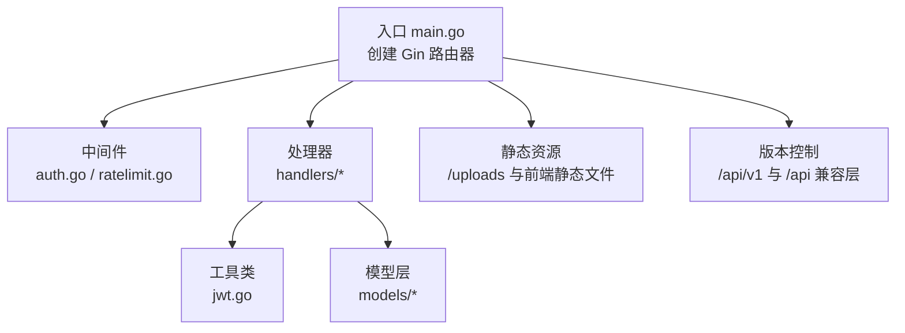
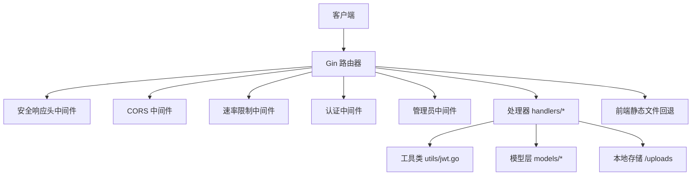
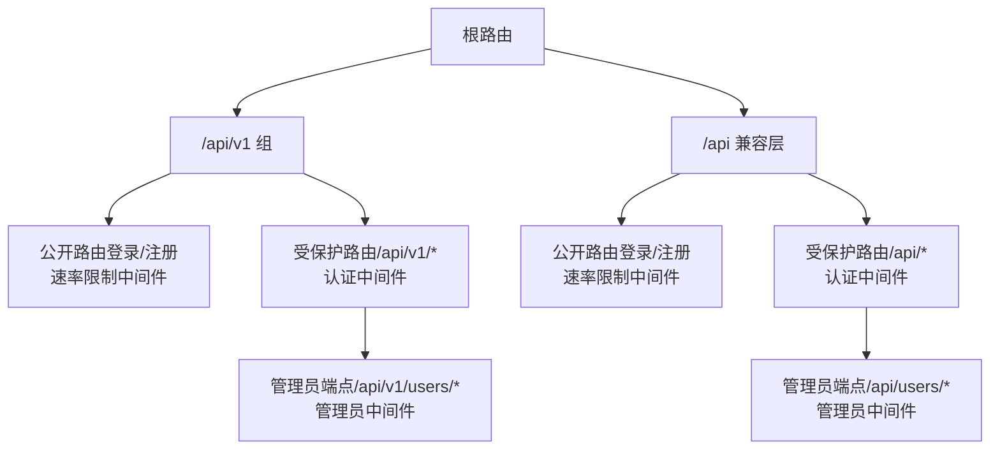
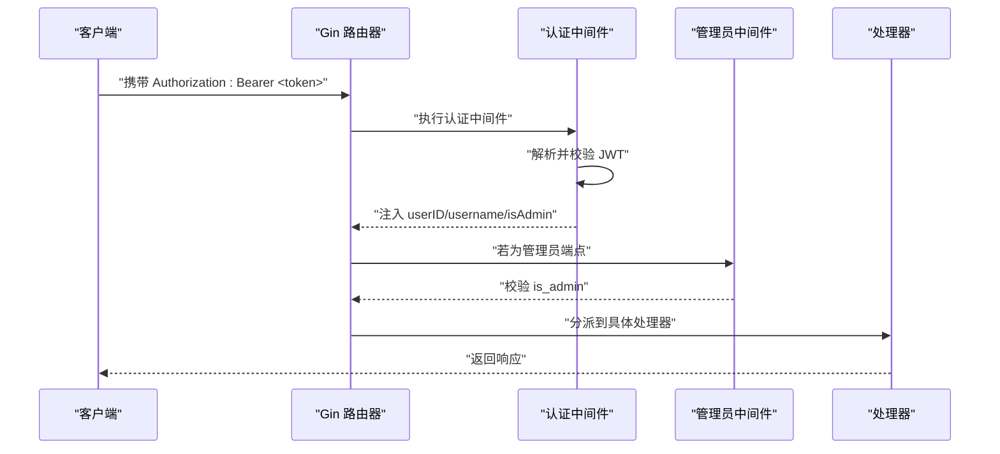
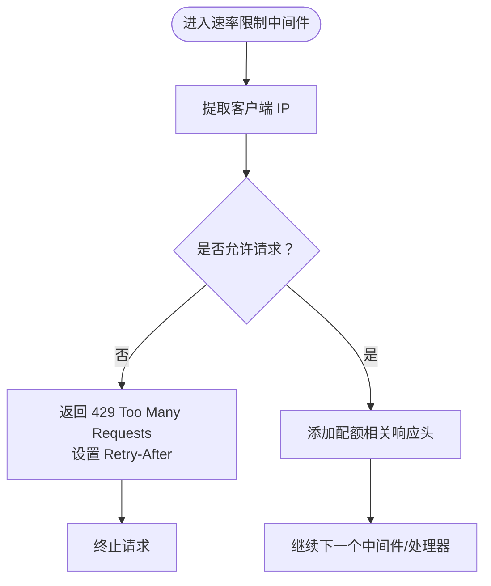
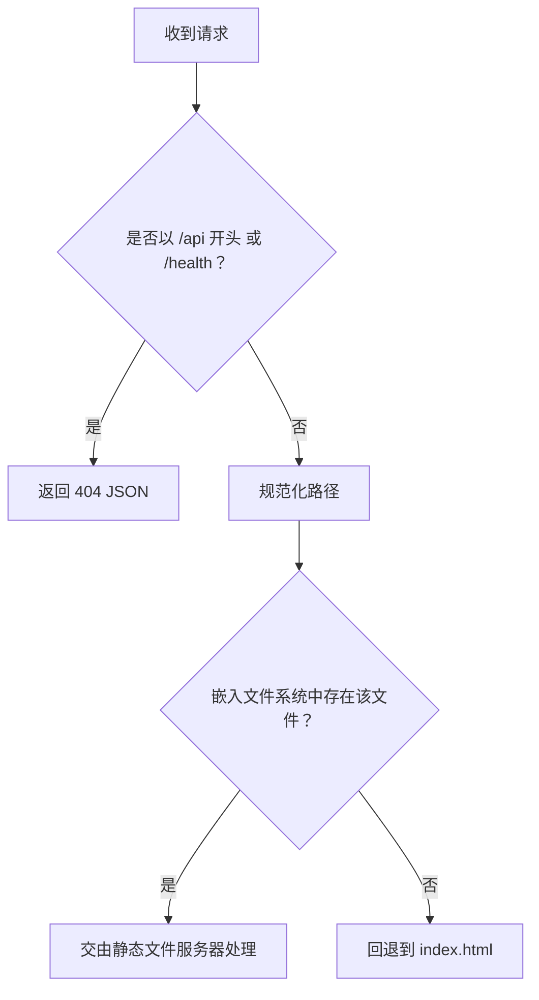
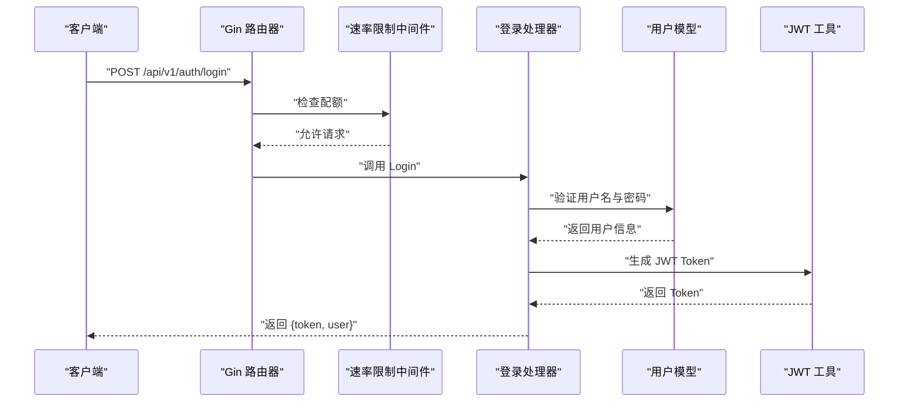
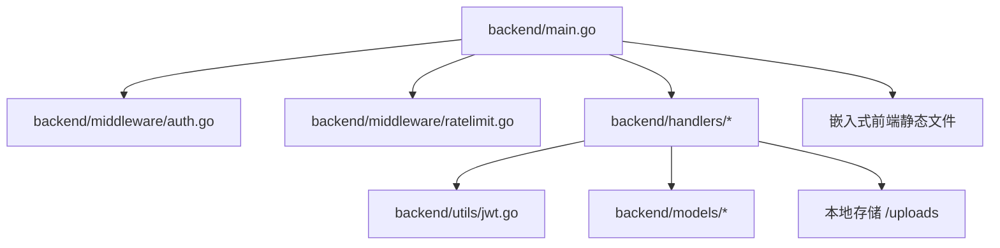

# 路由系统设计

<cite>
**本文档引用的文件**
- [backend/main.go](file://backend/main.go)
- [backend/middleware/auth.go](file://backend/middleware/auth.go)
- [backend/middleware/ratelimit.go](file://backend/middleware/ratelimit.go)
- [backend/utils/jwt.go](file://backend/utils/jwt.go)
- [backend/handlers/auth.go](file://backend/handlers/auth.go)
- [backend/handlers/memos.go](file://backend/handlers/memos.go)
- [backend/handlers/notes.go](file://backend/handlers/notes.go)
- [backend/handlers/notebooks.go](file://backend/handlers/notebooks.go)
- [backend/handlers/resources.go](file://backend/handlers/resources.go)
- [backend/handlers/search.go](file://backend/handlers/search.go)
- [backend/handlers/stats.go](file://backend/handlers/stats.go)
- [backend/handlers/users.go](file://backend/handlers/users.go)
- [backend/handlers/models.go](file://backend/handlers/models.go)
- [backend/models/user.go](file://backend/models/user.go)
- [backend/models/note.go](file://backend/models/note.go)
</cite>

## 目录
1. [简介](#简介)
2. [项目结构](#项目结构)
3. [核心组件](#核心组件)
4. [架构总览](#架构总览)
5. [详细组件分析](#详细组件分析)
6. [依赖关系分析](#依赖关系分析)
7. [性能考虑](#性能考虑)
8. [故障排查指南](#故障排查指南)
9. [结论](#结论)
10. [附录](#附录)

## 简介
本文件面向 Memo Studio 的后端路由系统，基于 Gin 框架实现。重点涵盖以下方面：
- Gin 路由器的配置与使用，包括路由组的创建与管理、中间件应用顺序
- API 版本控制策略：/api/v1 与 /api（兼容层）的设计
- 公开路由与受保护路由的区分及认证中间件的应用
- 静态资源路由配置：/uploads 附件服务与前端静态文件托管
- SPA 路由回退机制的实现原理与配置方法
- 路由设计最佳实践与扩展指南

## 项目结构
后端采用模块化组织，路由集中在入口文件中集中配置，中间件与处理器分别位于 middleware 与 handlers 目录，工具类与模型位于 utils 与 models 目录。

图表来源
- [backend/main.go](file://backend/main.go#L28-L353)
- [backend/middleware/auth.go](file://backend/middleware/auth.go#L12-L71)
- [backend/middleware/ratelimit.go](file://backend/middleware/ratelimit.go#L96-L143)
- [backend/utils/jwt.go](file://backend/utils/jwt.go#L22-L76)

章节来源
- [backend/main.go](file://backend/main.go#L28-L353)

## 核心组件
- 路由器与中间件栈
  - 使用 Gin.New() 创建路由器，内置 Recovery 中间件用于异常恢复；开发模式下启用 Logger 中间件。
  - 安全响应头中间件统一注入安全相关头部。
  - CORS 中间件支持动态配置 AllowOrigins，生产环境建议显式设置以提升安全性。
- 路由组与版本控制
  - /api/v1：主版本 API，包含公开路由（登录/注册）与受保护路由（认证中间件），并细分子组（如 /users 管理员端点）。
  - /api：兼容层，保留旧版 API，同样分为公开与受保护两部分。
- 静态资源
  - /uploads：绑定本地存储目录，提供附件下载。
  - 嵌入式前端静态文件：通过 go:embed 将 SvelteKit 产物嵌入，NoRoute 回退逻辑实现 SPA 路由兜底。
- 中间件
  - 认证中间件：解析 Authorization 头中的 Bearer Token，校验有效性并将用户上下文注入到请求上下文。
  - 速率限制中间件：基于内存的滑动窗口限流，对公开路由（登录/注册）与通用路由进行限流控制。
  - 管理员中间件：在认证基础上进一步校验管理员权限。

章节来源
- [backend/main.go](file://backend/main.go#L39-L196)
- [backend/middleware/auth.go](file://backend/middleware/auth.go#L12-L71)
- [backend/middleware/ratelimit.go](file://backend/middleware/ratelimit.go#L96-L143)

## 架构总览
下图展示路由系统的整体交互：客户端请求进入路由器，依次经过中间件栈，再分派到对应处理器，处理器调用模型层完成业务逻辑，并返回响应。

图表来源
- [backend/main.go](file://backend/main.go#L47-L316)
- [backend/middleware/auth.go](file://backend/middleware/auth.go#L12-L71)
- [backend/middleware/ratelimit.go](file://backend/middleware/ratelimit.go#L96-L143)
- [backend/utils/jwt.go](file://backend/utils/jwt.go#L22-L76)

## 详细组件分析

### 路由组与版本控制
- /api/v1
  - 公开路由（登录/注册）：在 v1 组上挂载速率限制中间件，避免暴力破解风险。
  - 受保护路由：在 v1 下再创建 api 子组，挂载认证中间件，覆盖所有需要鉴权的端点。
  - 管理员端点：在 api 子组下创建 /users 子组，挂载管理员中间件，确保仅管理员可访问。
- /api（兼容层）
  - 与 /api/v1 类似的结构，但路径前缀为 /api，便于旧前端迁移过渡。

图表来源
- [backend/main.go](file://backend/main.go#L94-L196)
- [backend/main.go](file://backend/main.go#L198-L283)

章节来源
- [backend/main.go](file://backend/main.go#L94-L196)
- [backend/main.go](file://backend/main.go#L198-L283)

### 认证中间件与管理员中间件
- 认证中间件
  - 从 Authorization 头提取 Bearer Token，解析 JWT 并校验签名。
  - 将用户标识（userID、username）以及管理员标记（isAdmin）注入到请求上下文，供后续处理器使用。
  - 若旧版 token 缺失 is_admin 字段，会回退到数据库查询用户信息进行补全。
- 管理员中间件
  - 在认证基础上进一步校验 isAdmin 标记，非管理员直接拒绝。

图表来源
- [backend/middleware/auth.go](file://backend/middleware/auth.go#L12-L71)
- [backend/utils/jwt.go](file://backend/utils/jwt.go#L51-L76)

章节来源
- [backend/middleware/auth.go](file://backend/middleware/auth.go#L12-L71)
- [backend/utils/jwt.go](file://backend/utils/jwt.go#L22-L76)

### 速率限制中间件
- 实现机制
  - 基于内存的滑动窗口限流器，按客户端 IP 作为键。
  - 默认全局限流：每分钟最多 50 次请求；严格限流（30 次/分钟）可用于更敏感端点。
- 头部信息
  - 在响应头中返回 X-RateLimit-Limit 与 X-RateLimit-Remaining，便于客户端感知配额。
- 应用范围
  - 公开路由（登录/注册）与通用路由均受此中间件保护。

图表来源
- [backend/middleware/ratelimit.go](file://backend/middleware/ratelimit.go#L96-L143)

章节来源
- [backend/middleware/ratelimit.go](file://backend/middleware/ratelimit.go#L96-L143)

### 静态资源与 SPA 回退
- /uploads 附件服务
  - 通过 r.Static("/uploads", storageDir) 将本地存储目录映射为静态资源路径，支持直接下载附件。
- 前端静态文件与 SPA 回退
  - 使用 go:embed 将构建产物嵌入二进制，NoRoute 中实现回退逻辑：
    - 忽略 /api 前缀与 /health 端点。
    - 对于非 API 请求，尝试定位嵌入文件系统中的静态文件；若不存在则回退到 index.html，实现 SPA 单页应用的前端路由回退。

图表来源
- [backend/main.go](file://backend/main.go#L87-L93)
- [backend/main.go](file://backend/main.go#L285-L316)

章节来源
- [backend/main.go](file://backend/main.go#L87-L93)
- [backend/main.go](file://backend/main.go#L285-L316)

### 典型 API 工作流（以登录为例）

图表来源
- [backend/main.go](file://backend/main.go#L97-L102)
- [backend/handlers/auth.go](file://backend/handlers/auth.go#L27-L53)
- [backend/models/user.go](file://backend/models/user.go#L78-L110)
- [backend/utils/jwt.go](file://backend/utils/jwt.go#L29-L49)

章节来源
- [backend/main.go](file://backend/main.go#L97-L102)
- [backend/handlers/auth.go](file://backend/handlers/auth.go#L27-L53)
- [backend/models/user.go](file://backend/models/user.go#L78-L110)
- [backend/utils/jwt.go](file://backend/utils/jwt.go#L29-L49)

## 依赖关系分析
- 路由器依赖中间件栈，中间件依赖工具类（JWT）与模型层（用户信息）。
- 处理器依赖工具类（JWT）、模型层（用户/笔记/标签/资源等）与本地存储。
- 静态资源与 SPA 回退依赖嵌入式文件系统。

图表来源
- [backend/main.go](file://backend/main.go#L28-L353)
- [backend/middleware/auth.go](file://backend/middleware/auth.go#L12-L71)
- [backend/middleware/ratelimit.go](file://backend/middleware/ratelimit.go#L96-L143)
- [backend/utils/jwt.go](file://backend/utils/jwt.go#L22-L76)

章节来源
- [backend/main.go](file://backend/main.go#L28-L353)

## 性能考虑
- 中间件顺序
  - Recovery 与 Logger 应尽早加入，确保异常与日志覆盖所有路由。
  - CORS 与安全响应头中间件应置于路由注册之前，保证跨域与安全头在所有响应中生效。
- 速率限制
  - 公开路由（登录/注册）与通用路由均受全局限流保护，建议对高风险端点单独配置更严格的限流策略。
- 静态资源
  - 嵌入式静态文件适合小规模部署；大规模流量建议使用 CDN 或反向代理缓存。
- 数据库与查询
  - 处理器中涉及多表关联与全文检索，建议在数据库层面建立索引（如 FTS5），并控制分页大小，避免大查询阻塞。

## 故障排查指南
- 认证失败
  - 检查 Authorization 头格式是否为 Bearer Token，确认 MEMO_JWT_SECRET 是否正确配置（生产环境必须设置）。
  - 若旧版 token 缺失 is_admin 字段，认证中间件会回退到数据库查询，确认用户表中 is_admin 字段正确。
- 403 Forbidden
  - 管理员端点访问被拒，确认用户具备管理员权限。
- 429 Too Many Requests
  - 触发速率限制，检查客户端是否频繁请求；可调整限流阈值或在网关层做分布式限流。
- 404 Not Found
  - SPA 回退逻辑会忽略 /api 与 /health，若前端路由未命中静态文件，将回退到 index.html；检查前端构建产物是否正确嵌入。
- /uploads 无法访问
  - 确认 MEMO_STORAGE_DIR 环境变量指向有效目录，且文件权限允许读取。

章节来源
- [backend/middleware/auth.go](file://backend/middleware/auth.go#L12-L71)
- [backend/utils/jwt.go](file://backend/utils/jwt.go#L11-L20)
- [backend/main.go](file://backend/main.go#L292-L316)
- [backend/middleware/ratelimit.go](file://backend/middleware/ratelimit.go#L96-L143)

## 结论
Memo Studio 的路由系统以 Gin 为核心，通过清晰的路由组与中间件栈实现了版本化 API、认证与权限控制、速率限制与安全头注入，并结合嵌入式静态资源与 SPA 回退机制，满足前后端一体化部署的需求。遵循本文档的最佳实践与扩展指南，可在保证安全与性能的前提下快速迭代 API。

## 附录

### API 版本控制与迁移建议
- 推荐优先使用 /api/v1，/api 作为兼容层仅用于过渡期。
- 迁移策略：先在 /api/v1 上提供新接口，逐步引导前端切换；到期后停用 /api 兼容层。

章节来源
- [backend/main.go](file://backend/main.go#L94-L196)
- [backend/main.go](file://backend/main.go#L198-L283)

### 中间件应用顺序最佳实践
- 安全与可观测性中间件（安全响应头、CORS、Logger、Recovery）置于路由注册之前。
- 限流与认证中间件按需挂载到路由组，公开路由优先挂载限流，受保护路由挂载认证。
- 管理员中间件仅作用于需要管理员权限的端点。

章节来源
- [backend/main.go](file://backend/main.go#L46-L80)
- [backend/middleware/ratelimit.go](file://backend/middleware/ratelimit.go#L96-L143)
- [backend/middleware/auth.go](file://backend/middleware/auth.go#L12-L71)

### 静态资源与 SPA 回退配置要点
- /uploads：确保 MEMO_STORAGE_DIR 正确配置，避免路径错误导致 404。
- 嵌入式静态文件：构建完成后将产物同步至 backend/public，确保 NoRoute 能正确回退到 index.html。
- 生产环境建议配合 CDN 或反向代理缓存静态资源，降低服务器压力。

章节来源
- [backend/main.go](file://backend/main.go#L87-L93)
- [backend/main.go](file://backend/main.go#L285-L316)