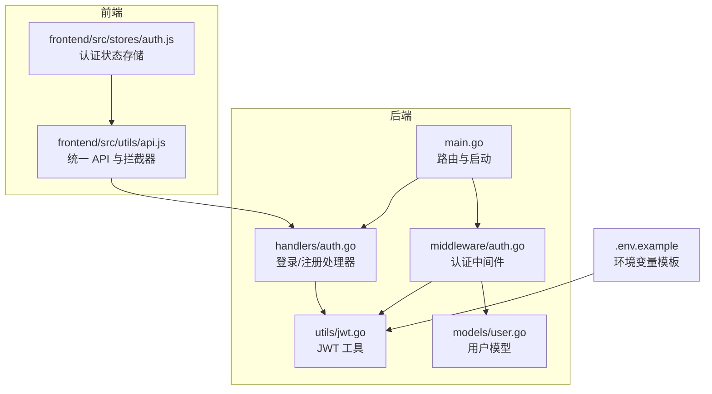
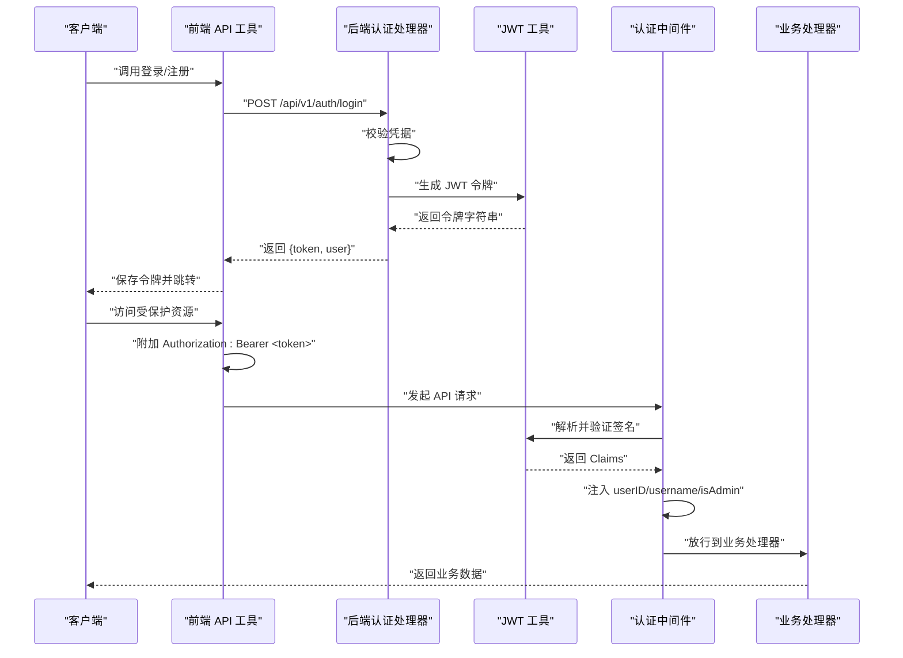
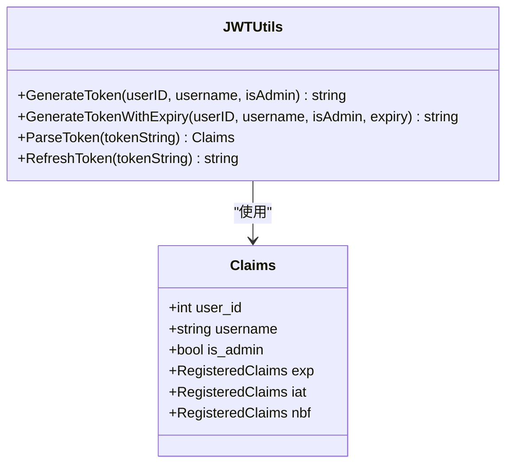
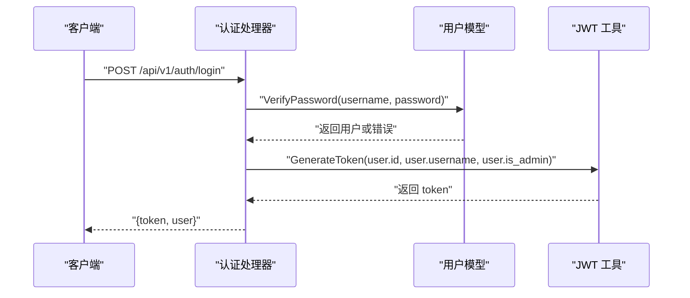
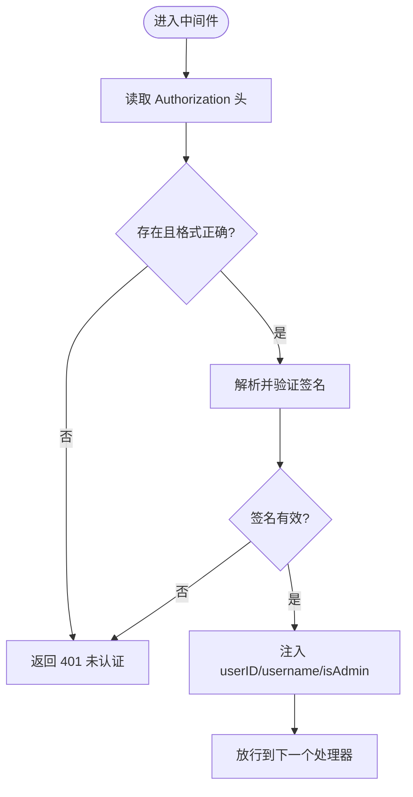
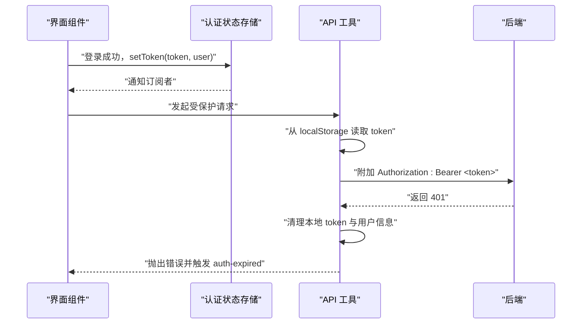
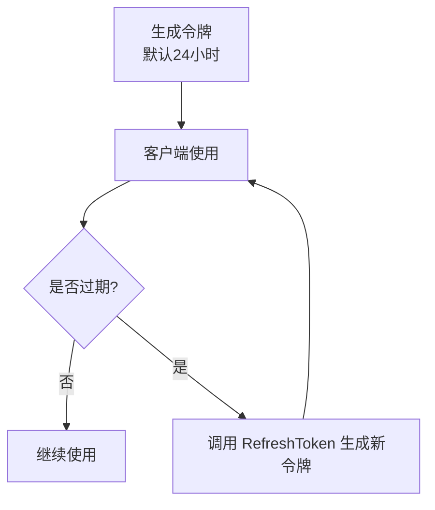
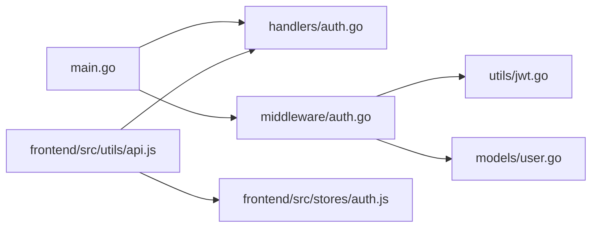

# JWT 认证机制

<cite>
**本文引用的文件**
- [backend/utils/jwt.go](file://backend/utils/jwt.go)
- [backend/handlers/auth.go](file://backend/handlers/auth.go)
- [backend/middleware/auth.go](file://backend/middleware/auth.go)
- [backend/models/user.go](file://backend/models/user.go)
- [backend/main.go](file://backend/main.go)
- [frontend/src/stores/auth.js](file://frontend/src/stores/auth.js)
- [frontend/src/utils/api.js](file://frontend/src/utils/api.js)
- [.env.example](file://.env.example)
- [backend/handlers/api_test.go](file://backend/handlers/api_test.go)
</cite>

## 目录
1. [简介](#简介)
2. [项目结构](#项目结构)
3. [核心组件](#核心组件)
4. [架构总览](#架构总览)
5. [详细组件分析](#详细组件分析)
6. [依赖关系分析](#依赖关系分析)
7. [性能考量](#性能考量)
8. [故障排查指南](#故障排查指南)
9. [结论](#结论)
10. [附录](#附录)

## 简介
本文件系统化梳理 Memo Studio 的 JWT 认证机制，覆盖令牌生成与签名、Claims 结构、有效期管理、刷新流程、解析与校验、API 请求中的使用方式，以及生产环境的安全配置与最佳实践。目标是帮助开发者与运维人员准确理解并安全地部署与扩展该机制。

## 项目结构
JWT 认证涉及后端工具模块、处理器、中间件、模型与前端存储与 API 工具。关键文件如下图所示：

图表来源
- [backend/utils/jwt.go](file://backend/utils/jwt.go#L1-L76)
- [backend/handlers/auth.go](file://backend/handlers/auth.go#L1-L111)
- [backend/middleware/auth.go](file://backend/middleware/auth.go#L1-L71)
- [backend/models/user.go](file://backend/models/user.go#L1-L233)
- [backend/main.go](file://backend/main.go#L94-L196)
- [frontend/src/stores/auth.js](file://frontend/src/stores/auth.js#L1-L80)
- [frontend/src/utils/api.js](file://frontend/src/utils/api.js#L1-L316)
- [.env.example](file://.env.example#L1-L16)

章节来源
- [backend/utils/jwt.go](file://backend/utils/jwt.go#L1-L76)
- [backend/handlers/auth.go](file://backend/handlers/auth.go#L1-L111)
- [backend/middleware/auth.go](file://backend/middleware/auth.go#L1-L71)
- [backend/models/user.go](file://backend/models/user.go#L1-L233)
- [backend/main.go](file://backend/main.go#L94-L196)
- [frontend/src/stores/auth.js](file://frontend/src/stores/auth.js#L1-L80)
- [frontend/src/utils/api.js](file://frontend/src/utils/api.js#L1-L316)
- [.env.example](file://.env.example#L1-L16)

## 核心组件
- JWT 工具模块：负责密钥加载、Claims 结构、令牌生成、解析与刷新。
- 认证处理器：登录/注册成功后生成令牌并返回给客户端。
- 认证中间件：从 Authorization 头解析 Bearer 令牌，进行签名验证与权限注入。
- 用户模型：提供用户查询与权限判定能力，兼容旧版 token 的 is_admin 回退。
- 前端认证状态与 API 工具：负责本地存储令牌、统一添加 Authorization 头、处理 401 错误。

章节来源
- [backend/utils/jwt.go](file://backend/utils/jwt.go#L22-L76)
- [backend/handlers/auth.go](file://backend/handlers/auth.go#L27-L93)
- [backend/middleware/auth.go](file://backend/middleware/auth.go#L12-L71)
- [backend/models/user.go](file://backend/models/user.go#L13-L110)
- [frontend/src/stores/auth.js](file://frontend/src/stores/auth.js#L1-L80)
- [frontend/src/utils/api.js](file://frontend/src/utils/api.js#L53-L76)

## 架构总览
下图展示从登录到请求受保护资源的整体流程，包括令牌生成、中间件解析与权限注入、前端携带令牌访问 API 的关键步骤。

图表来源
- [backend/handlers/auth.go](file://backend/handlers/auth.go#L27-L53)
- [backend/utils/jwt.go](file://backend/utils/jwt.go#L29-L49)
- [backend/middleware/auth.go](file://backend/middleware/auth.go#L12-L51)
- [frontend/src/utils/api.js](file://frontend/src/utils/api.js#L53-L76)

## 详细组件分析

### JWT 工具模块（生成、解析、刷新）
- 密钥管理
  - 默认密钥在开发环境使用；生产环境必须通过环境变量设置，否则启动即终止。
  - 环境变量：MEMO_JWT_SECRET；建议使用足够强度的随机字符串。
- Claims 结构
  - 包含用户标识字段：user_id、username、is_admin。
  - 包含标准声明：exp（过期时间）、iat（签发时间）、nbf（生效时间）。
- 令牌生成
  - 默认有效期 24 小时；支持传入自定义有效期。
  - 使用 HS256 签名算法，密钥来自环境变量。
- 令牌解析
  - 使用相同密钥进行签名验证；若签名无效或过期，返回相应错误。
- 刷新机制
  - 通过解析现有令牌，提取用户信息，再生成新的 24 小时有效期令牌。

图表来源
- [backend/utils/jwt.go](file://backend/utils/jwt.go#L22-L76)

章节来源
- [backend/utils/jwt.go](file://backend/utils/jwt.go#L11-L76)
- [.env.example](file://.env.example#L4-L6)

### 认证处理器（登录/注册）
- 登录
  - 校验用户名与密码；成功后调用 JWT 工具生成令牌，并连同用户信息返回。
- 注册
  - 校验用户名与密码长度；创建用户后同样生成令牌返回。
- 当前用户
  - 从上下文中读取 userID，查询用户信息返回。

图表来源
- [backend/handlers/auth.go](file://backend/handlers/auth.go#L27-L53)
- [backend/models/user.go](file://backend/models/user.go#L78-L110)
- [backend/utils/jwt.go](file://backend/utils/jwt.go#L29-L49)

章节来源
- [backend/handlers/auth.go](file://backend/handlers/auth.go#L27-L93)
- [backend/models/user.go](file://backend/models/user.go#L78-L110)

### 认证中间件（令牌解析与权限注入）
- 从 Authorization 头提取 Bearer 令牌。
- 调用 JWT 工具解析并验证签名。
- 成功后将 userID、username、isAdmin 注入到上下文，供后续处理器使用。
- 兼容旧 token：当 Claims 中未包含 is_admin 时，回退到数据库查询用户权限。

图表来源
- [backend/middleware/auth.go](file://backend/middleware/auth.go#L12-L51)
- [backend/utils/jwt.go](file://backend/utils/jwt.go#L51-L66)

章节来源
- [backend/middleware/auth.go](file://backend/middleware/auth.go#L12-L71)
- [backend/models/user.go](file://backend/models/user.go#L63-L76)

### 前端认证状态与 API 工具
- 认证状态存储
  - 从 localStorage 读取 token 与用户信息；登录成功后写入；登出时清除。
- API 工具
  - 统一为请求添加 Authorization: Bearer <token>。
  - 处理 401 错误：清理本地存储并触发认证过期事件，便于页面跳转至登录。

图表来源
- [frontend/src/stores/auth.js](file://frontend/src/stores/auth.js#L26-L75)
- [frontend/src/utils/api.js](file://frontend/src/utils/api.js#L53-L76)

章节来源
- [frontend/src/stores/auth.js](file://frontend/src/stores/auth.js#L1-L80)
- [frontend/src/utils/api.js](file://frontend/src/utils/api.js#L1-L316)

### 令牌有效期与刷新机制
- 默认有效期
  - 生成令牌时默认 24 小时；可通过自定义有效期函数传入不同时长。
- 刷新流程
  - 通过 RefreshToken 解析旧令牌并基于其用户信息生成新的 24 小时令牌。
- 前端刷新
  - 当前前端未直接暴露刷新接口；可在业务层自行实现刷新逻辑并更新本地存储。

图表来源
- [backend/utils/jwt.go](file://backend/utils/jwt.go#L29-L49)
- [backend/utils/jwt.go](file://backend/utils/jwt.go#L68-L75)

章节来源
- [backend/utils/jwt.go](file://backend/utils/jwt.go#L29-L75)

### 管理员权限标识与兼容策略
- Claims 中包含 is_admin 字段；若旧 token 缺失该字段，中间件会回退到数据库查询用户权限。
- 管理员专用路由组在中间件链路中进一步通过 AdminOnly 中间件校验 isAdmin。

章节来源
- [backend/middleware/auth.go](file://backend/middleware/auth.go#L42-L48)
- [backend/middleware/auth.go](file://backend/middleware/auth.go#L54-L70)
- [backend/models/user.go](file://backend/models/user.go#L63-L76)

## 依赖关系分析
- 后端路由绑定
  - 登录/注册公开路由；其余 API 均经认证中间件保护。
  - 管理员路由组在认证基础上再加 AdminOnly 中间件。
- 中间件依赖
  - 认证中间件依赖 JWT 工具进行解析与验证。
  - 认证中间件依赖用户模型进行权限回退。
- 前端依赖
  - API 工具依赖认证状态存储；认证状态存储依赖浏览器 localStorage。

图表来源
- [backend/main.go](file://backend/main.go#L94-L196)
- [backend/handlers/auth.go](file://backend/handlers/auth.go#L1-L111)
- [backend/middleware/auth.go](file://backend/middleware/auth.go#L1-L71)
- [backend/utils/jwt.go](file://backend/utils/jwt.go#L1-L76)
- [backend/models/user.go](file://backend/models/user.go#L1-L233)
- [frontend/src/utils/api.js](file://frontend/src/utils/api.js#L1-L316)
- [frontend/src/stores/auth.js](file://frontend/src/stores/auth.js#L1-L80)

章节来源
- [backend/main.go](file://backend/main.go#L94-L196)

## 性能考量
- HS256 签名与解析开销极低，对吞吐影响可忽略。
- 建议避免频繁刷新令牌；在前端实现合理的令牌复用策略，仅在接近过期时刷新。
- 对于高频请求，可考虑在中间件层缓存少量用户权限信息（谨慎使用，确保一致性）。

## 故障排查指南
- 启动报错：生产环境未设置 MEMO_JWT_SECRET
  - 现象：启动即终止并输出致命错误。
  - 处理：设置 MEMO_JWT_SECRET 环境变量并重启服务。
- 401 未认证/无效令牌
  - 现象：前端收到 401，本地存储被清理并触发 auth-expired。
  - 处理：确认 Authorization 头格式为 Bearer <token>；检查令牌是否过期；核对密钥一致性。
- 权限不足
  - 现象：访问管理员路由返回 403。
  - 处理：确认用户 is_admin 标识；若为旧 token，等待中间件回退查询完成。
- 测试用例参考
  - 可通过测试工具构造 Bearer 认证头，验证路由行为与权限控制。

章节来源
- [backend/utils/jwt.go](file://backend/utils/jwt.go#L13-L20)
- [frontend/src/utils/api.js](file://frontend/src/utils/api.js#L16-L23)
- [backend/middleware/auth.go](file://backend/middleware/auth.go#L12-L36)
- [backend/handlers/api_test.go](file://backend/handlers/api_test.go#L86-L93)

## 结论
Memo Studio 的 JWT 认证机制简洁可靠：以 HS256 算法与环境变量密钥为核心，结合标准化 Claims 与中间件解析，实现了从登录到受保护资源访问的完整闭环。默认 24 小时有效期与刷新机制满足大多数场景需求；生产环境务必配置强密钥与严格的 CORS 策略，确保安全边界。

## 附录

### JWT Claims 字段定义
- user_id：整型，用户唯一标识。
- username：字符串，用户名。
- is_admin：布尔值，管理员标识。
- exp/iat/nbf：标准声明，分别表示过期、签发与生效时间。

章节来源
- [backend/utils/jwt.go](file://backend/utils/jwt.go#L22-L27)

### API 请求头设置与令牌传递
- 前端统一在请求头添加 Authorization: Bearer <token>。
- 登录/注册接口无需认证；其余 API 均需携带有效令牌。

章节来源
- [frontend/src/utils/api.js](file://frontend/src/utils/api.js#L53-L76)
- [backend/main.go](file://backend/main.go#L94-L102)

### 生产环境安全配置要点
- 密钥管理
  - 设置 MEMO_JWT_SECRET；建议使用足够强度的随机字符串。
- 环境变量
  - 建议设置 MEMO_ENV=production；根据需要设置 MEMO_CORS_ORIGINS。
- 令牌存储
  - 前端使用 localStorage 存储 token；生产环境建议结合 HttpOnly Cookie 与 SameSite 策略（当前实现未采用）。
- 密钥轮换
  - 建议在部署新密钥后，逐步引导用户重新登录以发放新密钥签发的令牌，避免旧令牌失效造成大面积影响。

章节来源
- [.env.example](file://.env.example#L4-L15)
- [backend/main.go](file://backend/main.go#L324-L329)
- [frontend/src/stores/auth.js](file://frontend/src/stores/auth.js#L26-L46)