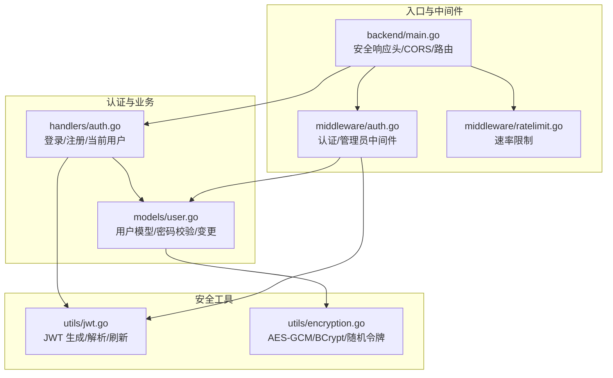
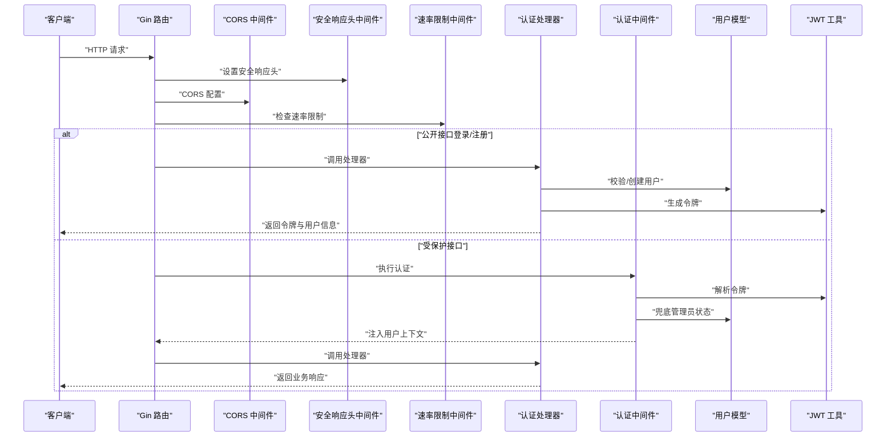
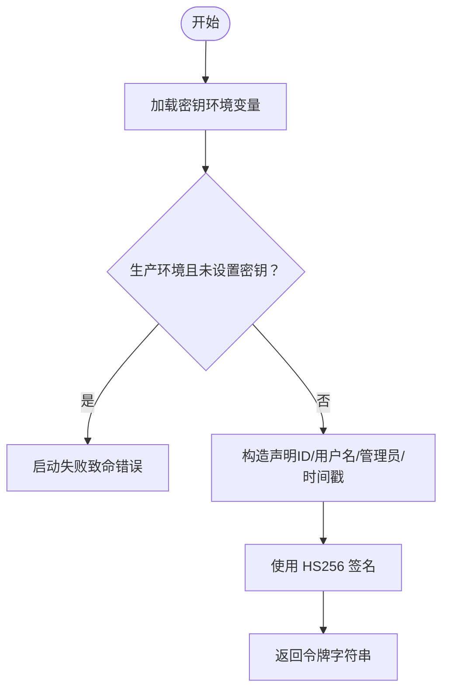
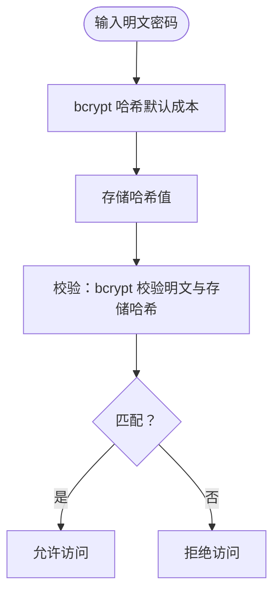
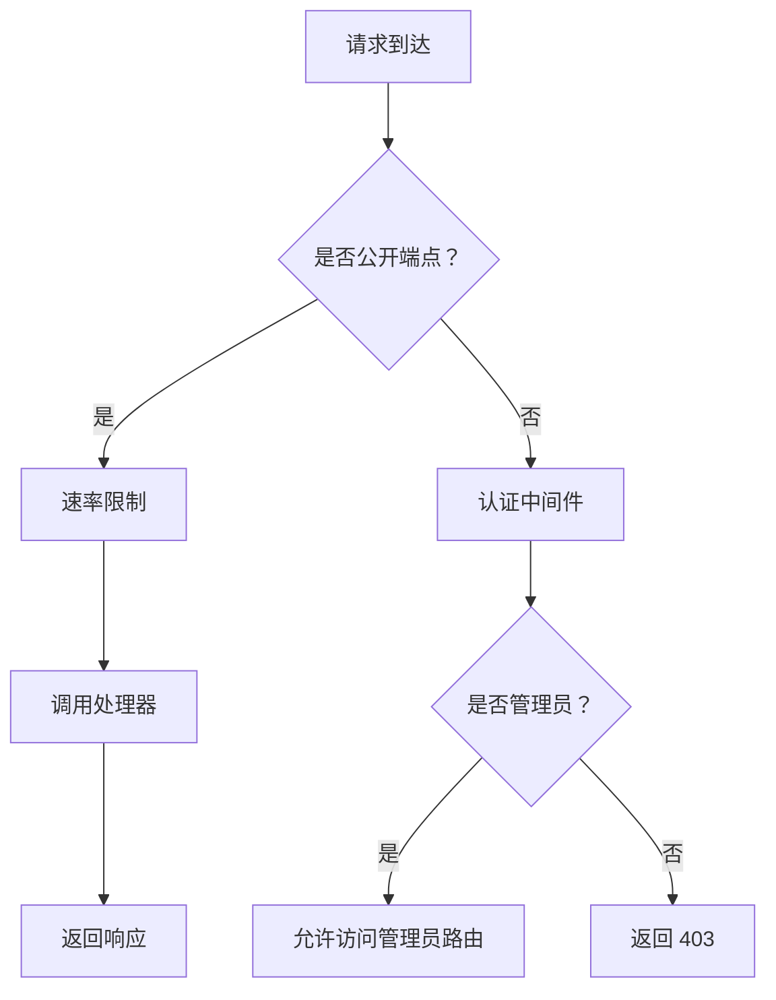
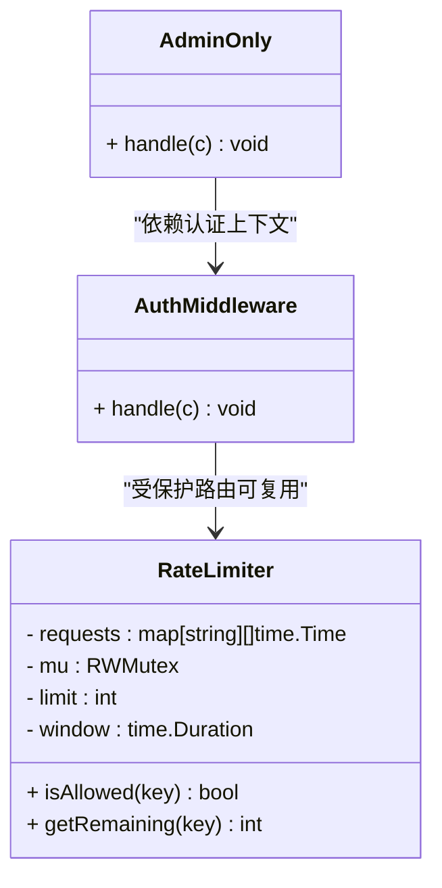
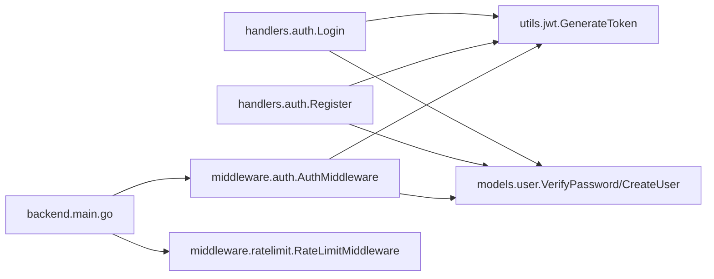

# 安全与认证

<cite>
**本文引用的文件**
- [backend/main.go](file://backend/main.go)
- [backend/utils/jwt.go](file://backend/utils/jwt.go)
- [backend/utils/encryption.go](file://backend/utils/encryption.go)
- [backend/middleware/auth.go](file://backend/middleware/auth.go)
- [backend/middleware/ratelimit.go](file://backend/middleware/ratelimit.go)
- [backend/handlers/auth.go](file://backend/handlers/auth.go)
- [backend/models/user.go](file://backend/models/user.go)
- [.env.example](file://.env.example)
- [docs/security-optimization.md](file://docs/security-optimization.md)
- [backend/handlers/api_test.go](file://backend/handlers/api_test.go)
</cite>

## 目录
1. [简介](#简介)
2. [项目结构](#项目结构)
3. [核心组件](#核心组件)
4. [架构总览](#架构总览)
5. [组件详解](#组件详解)
6. [依赖关系分析](#依赖关系分析)
7. [性能考量](#性能考量)
8. [故障排查指南](#故障排查指南)
9. [结论](#结论)
10. [附录](#附录)

## 简介
本文件面向 Memo Studio 的安全与认证体系，系统化梳理 JWT 认证机制（生成、解析、刷新）、密码加密策略（bcrypt、盐值与安全存储）、权限控制（用户角色、访问控制、资源保护）、安全中间件（认证、速率限制、CORS）、以及 CSRF/XSS/SQL 注入等常见威胁的缓解策略。同时给出密钥管理、会话与日志审计的最佳实践，并提供漏洞预防与应急响应建议。

## 项目结构
后端采用 Gin 框架，安全相关能力主要分布在以下模块：
- 认证与授权：handlers/auth.go、middleware/auth.go、models/user.go
- JWT 工具：utils/jwt.go
- 加解密与密码哈希：utils/encryption.go
- 速率限制：middleware/ratelimit.go
- 全局安全响应头与 CORS：backend/main.go
- 环境变量与示例：.env.example
- 安全优化参考：docs/security-optimization.md
- 测试覆盖：backend/handlers/api_test.go

图表来源
- [backend/main.go](file://backend/main.go#L46-L80)
- [backend/middleware/auth.go](file://backend/middleware/auth.go#L12-L52)
- [backend/middleware/ratelimit.go](file://backend/middleware/ratelimit.go#L96-L142)
- [backend/handlers/auth.go](file://backend/handlers/auth.go#L27-L53)
- [backend/models/user.go](file://backend/models/user.go#L22-L44)
- [backend/utils/jwt.go](file://backend/utils/jwt.go#L29-L66)
- [backend/utils/encryption.go](file://backend/utils/encryption.go#L16-L106)

章节来源
- [backend/main.go](file://backend/main.go#L28-L353)
- [backend/middleware/auth.go](file://backend/middleware/auth.go#L12-L71)
- [backend/middleware/ratelimit.go](file://backend/middleware/ratelimit.go#L11-L143)
- [backend/handlers/auth.go](file://backend/handlers/auth.go#L11-L111)
- [backend/models/user.go](file://backend/models/user.go#L13-L233)
- [backend/utils/jwt.go](file://backend/utils/jwt.go#L11-L76)
- [backend/utils/encryption.go](file://backend/utils/encryption.go#L16-L106)
- [.env.example](file://.env.example#L1-L16)
- [docs/security-optimization.md](file://docs/security-optimization.md#L1-L88)
- [backend/handlers/api_test.go](file://backend/handlers/api_test.go#L86-L93)

## 核心组件
- JWT 工具：负责密钥初始化、声明结构、令牌生成、解析与刷新。
- 认证处理器：处理登录、注册、获取当前用户信息；生成 JWT 令牌。
- 认证中间件：从 Authorization 头提取 Bearer Token，解析并注入用户上下文；管理员权限校验。
- 速率限制中间件：基于内存的滑动窗口限流，支持全局与严格策略。
- 用户模型：密码哈希与校验、用户信息读写、管理员 CRUD。
- 加解密工具：AES-GCM 对称加解密、BCrypt 密码哈希、安全随机令牌生成。
- 安全响应头与 CORS：统一设置安全响应头，动态配置允许来源。

章节来源
- [backend/utils/jwt.go](file://backend/utils/jwt.go#L22-L76)
- [backend/handlers/auth.go](file://backend/handlers/auth.go#L27-L111)
- [backend/middleware/auth.go](file://backend/middleware/auth.go#L12-L71)
- [backend/middleware/ratelimit.go](file://backend/middleware/ratelimit.go#L11-L143)
- [backend/models/user.go](file://backend/models/user.go#L22-L149)
- [backend/utils/encryption.go](file://backend/utils/encryption.go#L16-L106)
- [backend/main.go](file://backend/main.go#L46-L80)

## 架构总览
下图展示从客户端到服务端的关键交互路径，重点标注认证、授权、速率限制与安全响应头的生效顺序。

图表来源
- [backend/main.go](file://backend/main.go#L46-L80)
- [backend/middleware/ratelimit.go](file://backend/middleware/ratelimit.go#L96-L142)
- [backend/handlers/auth.go](file://backend/handlers/auth.go#L27-L111)
- [backend/middleware/auth.go](file://backend/middleware/auth.go#L12-L71)
- [backend/utils/jwt.go](file://backend/utils/jwt.go#L51-L66)
- [backend/models/user.go](file://backend/models/user.go#L78-L110)

## 组件详解

### JWT 认证机制
- 密钥管理
  - 通过环境变量加载密钥；生产环境必须显式设置，否则启动即终止。
  - 默认密钥仅用于开发，避免在生产暴露。
- 声明结构
  - 包含用户 ID、用户名、是否管理员、标准声明（签发时间、生效时间、过期时间）。
- 令牌生成
  - 默认有效期 24 小时；支持自定义有效期。
- 令牌解析
  - 使用相同密钥进行签名验证；失败返回无效令牌。
- 令牌刷新
  - 基于原令牌解析出声明，重新生成新令牌（保持用户身份不变）。

图表来源
- [backend/utils/jwt.go](file://backend/utils/jwt.go#L13-L20)
- [backend/utils/jwt.go](file://backend/utils/jwt.go#L35-L49)

章节来源
- [backend/utils/jwt.go](file://backend/utils/jwt.go#L11-L76)
- [.env.example](file://.env.example#L4-L6)

### 密码加密策略
- bcrypt 哈希
  - 注册与密码变更均使用 bcrypt，默认成本；存储哈希值，不保存明文。
- 数据库一致性
  - 查询用户时仅返回非敏感字段；密码字段不回传。
- 安全存储
  - 项目未对“用户密码”做额外对称加密存储，依赖 bcrypt 与数据库访问控制；如需更强隔离，可在应用层引入主密钥派生的对称加密（参考 AES-GCM 工具）。

图表来源
- [backend/models/user.go](file://backend/models/user.go#L24-L28)
- [backend/models/user.go](file://backend/models/user.go#L96-L100)
- [backend/utils/encryption.go](file://backend/utils/encryption.go#L93-L106)

章节来源
- [backend/models/user.go](file://backend/models/user.go#L22-L149)
- [backend/utils/encryption.go](file://backend/utils/encryption.go#L93-L106)

### 权限控制系统
- 角色与访问控制
  - 用户结构包含管理员标记；认证中间件优先使用令牌中的管理员标记，若缺失则从数据库兜底。
  - 管理员专用路由组使用 AdminOnly 中间件进行二次校验。
- 资源保护
  - 受保护路由组统一挂载认证中间件；公开路由（登录/注册）单独挂载速率限制中间件。
  - 管理员操作端点仅管理员可访问。

图表来源
- [backend/middleware/auth.go](file://backend/middleware/auth.go#L12-L71)
- [backend/main.go](file://backend/main.go#L94-L196)

章节来源
- [backend/middleware/auth.go](file://backend/middleware/auth.go#L12-L71)
- [backend/main.go](file://backend/main.go#L94-L196)

### 安全中间件实现
- 认证中间件
  - 从 Authorization 头提取 Bearer 令牌；解析失败返回 401。
  - 将用户 ID、用户名、管理员标记注入上下文，供后续处理器使用。
- 管理员中间件
  - 从上下文读取管理员标记，非管理员直接返回 403。
- 速率限制中间件
  - 基于滑动窗口的并发安全计数器；默认全局每分钟 50 次，严格模式每分钟 30 次。
  - 设置 Retry-After 与 X-RateLimit-* 响应头，便于客户端自适应重试。

图表来源
- [backend/middleware/ratelimit.go](file://backend/middleware/ratelimit.go#L11-L81)
- [backend/middleware/auth.go](file://backend/middleware/auth.go#L12-L71)

章节来源
- [backend/middleware/auth.go](file://backend/middleware/auth.go#L12-L71)
- [backend/middleware/ratelimit.go](file://backend/middleware/ratelimit.go#L11-L143)

### CORS 与安全响应头
- CORS
  - 支持通过环境变量配置允许来源；未配置时生产环境发出警告，开发环境默认放行。
  - 允许方法与头部包含 Authorization，满足前端携带令牌跨域访问。
- 安全响应头
  - 设置 X-Content-Type-Options、X-Frame-Options、X-XSS-Protection、X-Robots-Tag 等，降低浏览器侧风险。

章节来源
- [backend/main.go](file://backend/main.go#L55-L80)

### CSRF、XSS、SQL 注入防护
- CSRF
  - 后端未实现 CSRF 令牌或 SameSite Cookie 策略；建议在前端或网关层增加 CSRF 保护（例如 SameSite 严格、CSRF 令牌），并在生产环境启用 HTTPS。
- XSS
  - 后端设置了 X-XSS-Protection；前端渲染需确保对用户输入进行 HTML 转义与内容安全策略（CSP）配置（项目前端具备 CSP 生成逻辑，建议在生产启用）。
- SQL 注入
  - 用户模型与处理器使用参数化查询（如 Prepare/Exec/QueryRow），有效防止 SQL 注入。

章节来源
- [backend/main.go](file://backend/main.go#L46-L53)
- [backend/models/user.go](file://backend/models/user.go#L30-L36)
- [backend/handlers/auth.go](file://backend/handlers/auth.go#L36-L40)

### 安全配置最佳实践
- 密钥管理
  - 必须设置 MEMO_JWT_SECRET；使用足够熵的随机值；在 CI/CD 中通过密钥管理服务注入。
- 会话与令牌
  - 令牌有效期默认 24 小时；建议根据业务场景缩短；考虑刷新令牌与黑名单机制（当前未实现）。
- 日志与审计
  - 生产环境开启日志；对认证失败、权限拒绝、速率限制触发等事件进行审计记录。
- 环境变量
  - 参考 .env.example 设置必需项；生产环境务必配置 CORS 允许来源与 JWT 密钥。

章节来源
- [.env.example](file://.env.example#L4-L12)
- [backend/main.go](file://backend/main.go#L324-L329)

### 安全漏洞预防与应对
- Docker 镜像安全
  - 文档提供了镜像升级、多阶段构建、distroless 基础镜像等优化建议，有助于降低运行时漏洞面。
- 应急响应
  - 发现漏洞时优先更新基础镜像与依赖；对关键密钥进行轮换；临时收紧速率限制与访问来源。

章节来源
- [docs/security-optimization.md](file://docs/security-optimization.md#L1-L88)

## 依赖关系分析
- 认证链路
  - handlers.auth.Login/Register 依赖 models.user（密码校验/创建）与 utils.jwt（生成令牌）。
  - middleware.auth.AuthMiddleware 依赖 utils.jwt（解析令牌）与 models.user（管理员兜底）。
- 速率限制
  - 全局限流器通过单例懒加载共享；不同路由可选择使用通用或严格策略。
- 安全响应头与 CORS
  - 在路由组挂载，影响所有子路由。

图表来源
- [backend/handlers/auth.go](file://backend/handlers/auth.go#L27-L93)
- [backend/models/user.go](file://backend/models/user.go#L22-L110)
- [backend/utils/jwt.go](file://backend/utils/jwt.go#L29-L49)
- [backend/middleware/auth.go](file://backend/middleware/auth.go#L12-L52)
- [backend/middleware/ratelimit.go](file://backend/middleware/ratelimit.go#L88-L94)
- [backend/main.go](file://backend/main.go#L94-L196)

章节来源
- [backend/handlers/auth.go](file://backend/handlers/auth.go#L27-L93)
- [backend/models/user.go](file://backend/models/user.go#L22-L110)
- [backend/utils/jwt.go](file://backend/utils/jwt.go#L29-L49)
- [backend/middleware/auth.go](file://backend/middleware/auth.go#L12-L52)
- [backend/middleware/ratelimit.go](file://backend/middleware/ratelimit.go#L88-L94)
- [backend/main.go](file://backend/main.go#L94-L196)

## 性能考量
- 令牌生成/解析为 CPU 密集型，建议在高并发场景下：
  - 缓存近期活跃用户的管理员状态（当前中间件已做兜底，可结合缓存进一步优化）。
  - 控制令牌有效期，减少频繁刷新。
- 速率限制
  - 默认全局每分钟 50 次，严格模式 30 次；可根据业务峰值调整。
  - 建议结合分布式缓存（如 Redis）实现跨实例共享的限流状态。

## 故障排查指南
- 启动报错：生产环境未设置 JWT 密钥
  - 现象：启动即终止并输出致命错误。
  - 处理：设置 MEMO_JWT_SECRET。
- 认证失败
  - 现象：401 未提供/无效令牌。
  - 处理：确认 Authorization 头格式为 Bearer <token>；检查令牌是否过期；核对密钥一致性。
- 权限不足
  - 现象：403 无权限。
  - 处理：确认用户管理员标记；检查 AdminOnly 中间件是否正确挂载。
- 速率限制触发
  - 现象：429 请求过于频繁。
  - 处理：查看 Retry-After 与 X-RateLimit-* 响应头；降低请求频率或切换严格模式路由。
- CORS 错误
  - 现象：浏览器跨域失败。
  - 处理：设置 MEMO_CORS_ORIGINS；生产环境务必明确允许来源。

章节来源
- [backend/utils/jwt.go](file://backend/utils/jwt.go#L17-L19)
- [backend/middleware/auth.go](file://backend/middleware/auth.go#L16-L28)
- [backend/middleware/auth.go](file://backend/middleware/auth.go#L54-L70)
- [backend/middleware/ratelimit.go](file://backend/middleware/ratelimit.go#L104-L112)
- [backend/main.go](file://backend/main.go#L73-L77)

## 结论
Memo Studio 的安全与认证体系以 JWT 为核心，配合 bcrypt 密码哈希、速率限制与统一的安全响应头/CORS 策略，形成了基础完备的防护框架。建议在生产环境中强化 CSRF 与 XSS 防护、完善日志审计、轮换密钥与加固容器镜像，并根据业务流量调整限流策略与令牌有效期，持续提升整体安全性。

## 附录
- 端到端测试覆盖
  - 测试包含注册/登录、密码变更、管理员 CRUD、用户隔离等场景，验证认证与权限控制链路。
- 环境变量模板
  - 提供 JWT 密钥、管理员密码、CORS 允许来源等关键配置项。

章节来源
- [backend/handlers/api_test.go](file://backend/handlers/api_test.go#L288-L361)
- [backend/handlers/api_test.go](file://backend/handlers/api_test.go#L363-L415)
- [.env.example](file://.env.example#L1-L16)