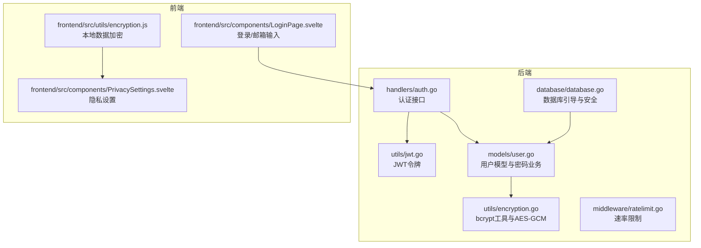
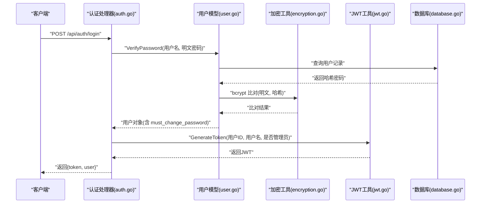
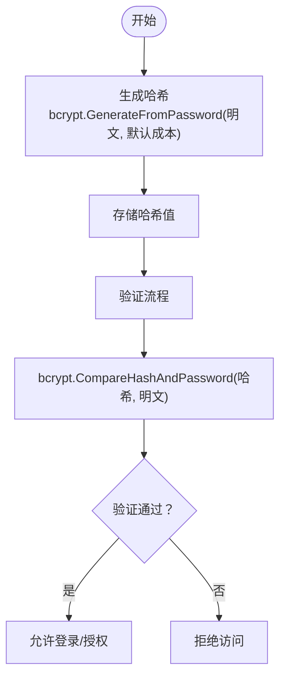
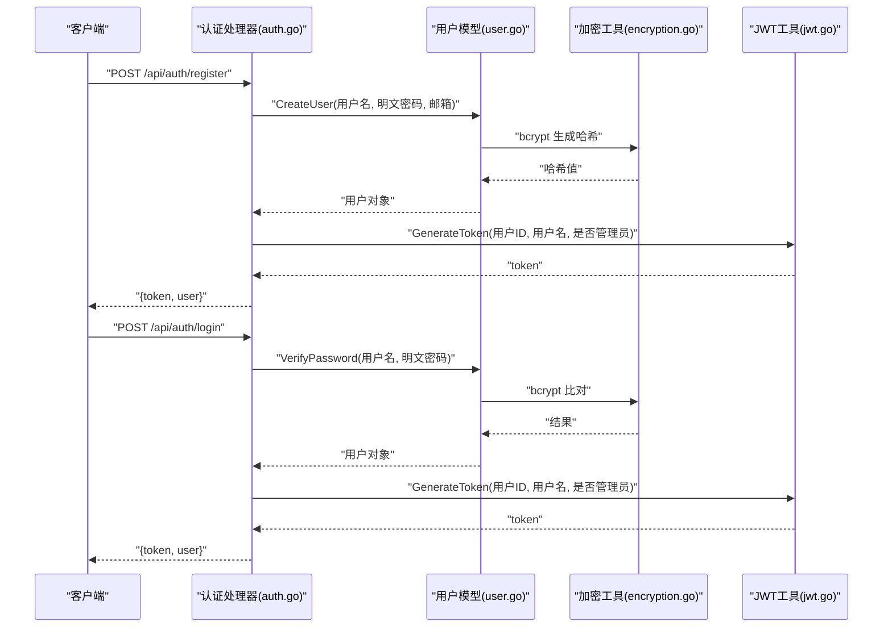
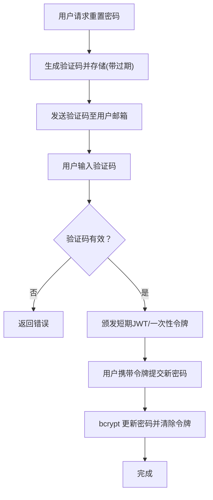
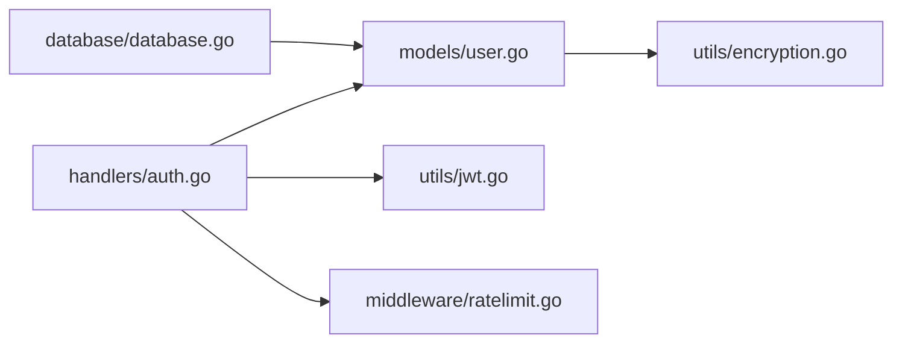

# 密码加密策略

<cite>
**本文引用的文件**
- [backend/utils/encryption.go](file://backend/utils/encryption.go)
- [backend/models/user.go](file://backend/models/user.go)
- [backend/handlers/auth.go](file://backend/handlers/auth.go)
- [backend/utils/jwt.go](file://backend/utils/jwt.go)
- [backend/middleware/ratelimit.go](file://backend/middleware/ratelimit.go)
- [backend/database/database.go](file://backend/database/database.go)
- [frontend/src/utils/encryption.js](file://frontend/src/utils/encryption.js)
- [frontend/src/components/PrivacySettings.svelte](file://frontend/src/components/PrivacySettings.svelte)
- [frontend/src/components/LoginPage.svelte](file://frontend/src/components/LoginPage.svelte)
</cite>

## 目录
1. [简介](#简介)
2. [项目结构](#项目结构)
3. [核心组件](#核心组件)
4. [架构总览](#架构总览)
5. [详细组件分析](#详细组件分析)
6. [依赖关系分析](#依赖关系分析)
7. [性能考量](#性能考量)
8. [故障排查指南](#故障排查指南)
9. [结论](#结论)
10. [附录](#附录)

## 简介
本文件系统性梳理 Memo Studio 的密码加密与安全策略，重点覆盖以下方面：
- bcrypt 密码哈希的使用方式、成本因子、盐值生成机制与哈希计算过程
- 登录与注册流程中的密码验证、哈希校验与安全存储
- 密码安全要求（最小长度、复杂度建议、历史密码检查思路）
- 加密工具函数实现（EncryptPassword、VerifyPassword 的对应实现路径）
- 密码重置流程（验证码生成、临时令牌、安全更新机制）
- 安全最佳实践（定期轮换、防暴力破解、日志审计）

## 项目结构
围绕密码与安全相关的核心代码分布如下：
- 后端通用加密与令牌工具：backend/utils/encryption.go、backend/utils/jwt.go
- 用户模型与密码业务逻辑：backend/models/user.go
- 认证接口与安全中间件：backend/handlers/auth.go、backend/middleware/ratelimit.go
- 数据库初始化与安全引导：backend/database/database.go
- 前端本地加密与隐私设置：frontend/src/utils/encryption.js、frontend/src/components/PrivacySettings.svelte、frontend/src/components/LoginPage.svelte

图表来源
- [backend/utils/encryption.go](file://backend/utils/encryption.go#L1-L106)
- [backend/utils/jwt.go](file://backend/utils/jwt.go#L1-L75)
- [backend/models/user.go](file://backend/models/user.go#L1-L233)
- [backend/handlers/auth.go](file://backend/handlers/auth.go#L1-L111)
- [backend/middleware/ratelimit.go](file://backend/middleware/ratelimit.go#L1-L143)
- [backend/database/database.go](file://backend/database/database.go#L440-L574)
- [frontend/src/utils/encryption.js](file://frontend/src/utils/encryption.js#L48-L155)
- [frontend/src/components/PrivacySettings.svelte](file://frontend/src/components/PrivacySettings.svelte#L112-L198)
- [frontend/src/components/LoginPage.svelte](file://frontend/src/components/LoginPage.svelte#L172-L245)

章节来源
- [backend/utils/encryption.go](file://backend/utils/encryption.go#L1-L106)
- [backend/models/user.go](file://backend/models/user.go#L1-L233)
- [backend/handlers/auth.go](file://backend/handlers/auth.go#L1-L111)
- [backend/utils/jwt.go](file://backend/utils/jwt.go#L1-L75)
- [backend/middleware/ratelimit.go](file://backend/middleware/ratelimit.go#L1-L143)
- [backend/database/database.go](file://backend/database/database.go#L440-L574)
- [frontend/src/utils/encryption.js](file://frontend/src/utils/encryption.js#L48-L155)
- [frontend/src/components/PrivacySettings.svelte](file://frontend/src/components/PrivacySettings.svelte#L112-L198)
- [frontend/src/components/LoginPage.svelte](file://frontend/src/components/LoginPage.svelte#L172-L245)

## 核心组件
- bcrypt 密码哈希与验证：后端通过 bcrypt 对密码进行哈希处理与比对，确保密码不以明文形式存储与传输。
- JWT 令牌签发与解析：登录成功后签发短期有效令牌，用于后续接口鉴权。
- 速率限制中间件：对登录等敏感接口进行频率限制，降低暴力破解风险。
- 数据库引导与安全策略：自动注入 must_change_password 字段、引导管理员账户、生成随机初始密码等。
- 前端本地数据加密：基于 Web Crypto API 的 AES-GCM 实现本地笔记内容加密，配合隐私设置界面。

章节来源
- [backend/utils/encryption.go](file://backend/utils/encryption.go#L93-L106)
- [backend/utils/jwt.go](file://backend/utils/jwt.go#L29-L75)
- [backend/middleware/ratelimit.go](file://backend/middleware/ratelimit.go#L96-L142)
- [backend/database/database.go](file://backend/database/database.go#L454-L539)
- [frontend/src/utils/encryption.js](file://frontend/src/utils/encryption.js#L48-L155)

## 架构总览
下图展示从登录到令牌签发、再到受保护资源访问的整体流程，以及与密码哈希、速率限制的关系。

图表来源
- [backend/handlers/auth.go](file://backend/handlers/auth.go#L27-L53)
- [backend/models/user.go](file://backend/models/user.go#L78-L110)
- [backend/utils/encryption.go](file://backend/utils/encryption.go#L102-L106)
- [backend/utils/jwt.go](file://backend/utils/jwt.go#L29-L49)
- [backend/database/database.go](file://backend/database/database.go#L472-L539)

## 详细组件分析

### bcrypt 密码哈希与验证
- 哈希生成：使用 bcrypt 默认成本因子对明文密码进行哈希，返回字符串形式的哈希值。
- 密码验证：将明文密码与数据库中存储的哈希进行比对，返回布尔结果。
- 存储策略：仅存储哈希值，不存储明文密码；登录时进行在线比对，不缓存明文。

图表来源
- [backend/utils/encryption.go](file://backend/utils/encryption.go#L93-L106)
- [backend/models/user.go](file://backend/models/user.go#L24-L28)
- [backend/models/user.go](file://backend/models/user.go#L96-L100)

章节来源
- [backend/utils/encryption.go](file://backend/utils/encryption.go#L93-L106)
- [backend/models/user.go](file://backend/models/user.go#L24-L28)
- [backend/models/user.go](file://backend/models/user.go#L78-L110)

### 登录与注册流程
- 注册：校验用户名与密码长度，使用 bcrypt 生成哈希并写入数据库，随后签发 JWT。
- 登录：根据用户名查询用户，使用 bcrypt 对比哈希，成功后签发 JWT。

图表来源
- [backend/handlers/auth.go](file://backend/handlers/auth.go#L55-L93)
- [backend/models/user.go](file://backend/models/user.go#L22-L44)
- [backend/models/user.go](file://backend/models/user.go#L78-L110)
- [backend/utils/encryption.go](file://backend/utils/encryption.go#L93-L106)
- [backend/utils/jwt.go](file://backend/utils/jwt.go#L29-L49)

章节来源
- [backend/handlers/auth.go](file://backend/handlers/auth.go#L55-L93)
- [backend/models/user.go](file://backend/models/user.go#L22-L44)
- [backend/models/user.go](file://backend/models/user.go#L78-L110)

### 密码安全要求
- 最小长度：注册与管理员创建用户时，密码长度不得少于 6 位；用户名长度不得少于 3 位。
- 复杂度：当前代码未强制复杂度规则（如必须包含大小写字母、数字、特殊字符），可在业务层扩展。
- 历史密码检查：未实现历史密码哈希比对；可通过在数据库增加“历史密码哈希列表”字段并在变更时检查来增强。

章节来源
- [backend/handlers/auth.go](file://backend/handlers/auth.go#L63-L73)
- [backend/models/user.go](file://backend/models/user.go#L158-L167)

### 加密工具函数实现
- EncryptData：使用 AES-256-GCM 对数据进行加密，随机生成 nonce，返回 base64 编码密文。
- DecryptData：对 base64 密文进行解密，校验长度与 nonce，返回明文。
- HashPassword：使用 bcrypt 对密码进行哈希（默认成本）。
- VerifyPassword：使用 bcrypt 对比明文与哈希。
- GenerateSecureToken：使用 crypto/rand 生成安全随机字节并编码为十六进制字符串。

章节来源
- [backend/utils/encryption.go](file://backend/utils/encryption.go#L16-L91)

### 密码重置流程（建议）
当前仓库未提供密码重置接口与验证码/临时令牌机制。建议流程如下：
- 验证码生成：服务端生成一次性验证码并安全存储（如内存/缓存+过期时间）。
- 发送通知：通过邮件/站内信发送验证码（前端页面已预留邮箱输入框）。
- 临时令牌：用户提交验证码后颁发短期 JWT 或一次性令牌，用于后续重置。
- 安全更新：使用 bcrypt 更新用户密码，清除验证码与临时令牌。

说明：以上为概念性流程图，用于指导实现；当前仓库未包含具体实现文件。

### 前端本地数据加密与隐私设置
- 基于 Web Crypto API 的 AES-GCM 加密，支持生成/导入导出加密密钥、安全保存与读取、清理本地数据。
- 隐私设置界面支持开启/关闭本地数据加密、自动锁定超时、清除剪贴板等。

章节来源
- [frontend/src/utils/encryption.js](file://frontend/src/utils/encryption.js#L48-L155)
- [frontend/src/components/PrivacySettings.svelte](file://frontend/src/components/PrivacySettings.svelte#L112-L198)

## 依赖关系分析
- 认证处理器依赖用户模型进行密码验证与用户查询，依赖 JWT 工具签发令牌。
- 用户模型依赖 bcrypt 进行哈希与比对，依赖数据库执行查询与更新。
- 速率限制中间件对登录等敏感接口进行频率控制，降低暴力破解风险。
- 数据库引导负责注入 must_change_password 字段、引导管理员账户与随机密码生成。

图表来源
- [backend/handlers/auth.go](file://backend/handlers/auth.go#L1-L111)
- [backend/models/user.go](file://backend/models/user.go#L1-L233)
- [backend/utils/encryption.go](file://backend/utils/encryption.go#L1-L106)
- [backend/utils/jwt.go](file://backend/utils/jwt.go#L1-L75)
- [backend/middleware/ratelimit.go](file://backend/middleware/ratelimit.go#L1-L143)
- [backend/database/database.go](file://backend/database/database.go#L440-L574)

章节来源
- [backend/handlers/auth.go](file://backend/handlers/auth.go#L1-L111)
- [backend/models/user.go](file://backend/models/user.go#L1-L233)
- [backend/utils/encryption.go](file://backend/utils/encryption.go#L1-L106)
- [backend/utils/jwt.go](file://backend/utils/jwt.go#L1-L75)
- [backend/middleware/ratelimit.go](file://backend/middleware/ratelimit.go#L1-L143)
- [backend/database/database.go](file://backend/database/database.go#L440-L574)

## 性能考量
- bcrypt 成本因子：默认成本在安全性与性能间取得平衡；若服务器负载较高，可评估提升成本以增强抗攻击能力，但需权衡登录延迟。
- AES-GCM：加密/解密开销较小，适合本地数据加密场景；注意密钥管理与 nonce 唯一性。
- 速率限制：全局与严格限流策略可有效抑制暴力破解，建议结合 IP 与用户维度进行更细粒度控制。

## 故障排查指南
- 登录失败：确认用户名是否存在、密码是否正确（bcrypt 比对）、must_change_password 标记是否需要强制修改。
- 令牌无效：检查 MEMO_JWT_SECRET 环境变量是否设置、签名算法与过期时间。
- 速率受限：查看响应头 X-RateLimit-Remaining 与 Retry-After，适当降低请求频率。
- 数据库引导问题：确认 must_change_password 字段存在、管理员账户状态正常、随机密码生成日志输出。

章节来源
- [backend/models/user.go](file://backend/models/user.go#L78-L110)
- [backend/utils/jwt.go](file://backend/utils/jwt.go#L13-L20)
- [backend/middleware/ratelimit.go](file://backend/middleware/ratelimit.go#L104-L111)
- [backend/database/database.go](file://backend/database/database.go#L454-L539)

## 结论
Memo Studio 在后端采用 bcrypt 进行密码哈希与验证，在前端提供本地数据加密能力，并通过 JWT 实现短期会话管理。整体安全策略较为完善，建议在现有基础上补充密码重置流程、历史密码检查与更严格的复杂度规则，并持续优化成本因子与限流策略以应对不同部署规模的安全需求。

## 附录
- 加密工具函数实现路径参考：
  - [HashPassword](file://backend/utils/encryption.go#L93-L100)
  - [VerifyPassword](file://backend/utils/encryption.go#L102-L106)
  - [EncryptData](file://backend/utils/encryption.go#L16-L40)
  - [DecryptData](file://backend/utils/encryption.go#L42-L76)
  - [GenerateSecureToken](file://backend/utils/encryption.go#L84-L91)
- 前端本地加密与隐私设置：
  - [前端加密工具](file://frontend/src/utils/encryption.js#L48-L155)
  - [隐私设置组件](file://frontend/src/components/PrivacySettings.svelte#L112-L198)
  - [登录页邮箱输入](file://frontend/src/components/LoginPage.svelte#L236-L245)