# 认证中间件

<cite>
**本文档引用的文件**
- [backend/middleware/auth.go](file://backend/middleware/auth.go)
- [backend/utils/jwt.go](file://backend/utils/jwt.go)
- [backend/models/user.go](file://backend/models/user.go)
- [backend/handlers/auth.go](file://backend/handlers/auth.go)
- [backend/middleware/ratelimit.go](file://backend/middleware/ratelimit.go)
- [backend/main.go](file://backend/main.go)
- [.env.example](file://.env.example)
- [backend/go.mod](file://backend/go.mod)
</cite>

## 目录
1. [简介](#简介)
2. [项目结构](#项目结构)
3. [核心组件](#核心组件)
4. [架构概览](#架构概览)
5. [详细组件分析](#详细组件分析)
6. [依赖关系分析](#依赖关系分析)
7. [性能考虑](#性能考虑)
8. [故障排除指南](#故障排除指南)
9. [结论](#结论)

## 简介

Memo Studio 的认证中间件是整个系统安全架构的核心组件，负责处理所有 API 请求的身份验证和授权。该中间件基于 JWT（JSON Web Token）技术实现，提供了完整的用户身份验证、权限检查和安全防护功能。

认证中间件采用中间件链式调用的设计模式，与 Gin 框架深度集成，能够优雅地处理各种认证场景，包括正常用户认证、管理员权限验证以及异常情况的错误处理。

## 项目结构

认证中间件在整个项目中的位置和组织方式如下：

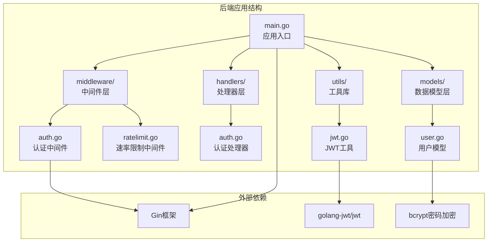

**图表来源**
- [backend/main.go](file://backend/main.go#L1-L353)
- [backend/middleware/auth.go](file://backend/middleware/auth.go#L1-L71)
- [backend/utils/jwt.go](file://backend/utils/jwt.go#L1-L76)

**章节来源**
- [backend/main.go](file://backend/main.go#L1-L353)
- [backend/middleware/auth.go](file://backend/middleware/auth.go#L1-L71)

## 核心组件

认证中间件系统包含以下核心组件：

### 主要中间件组件

1. **AuthMiddleware** - 主认证中间件，负责令牌提取和用户身份验证
2. **AdminOnly** - 管理员权限中间件，提供额外的权限检查
3. **JWT 工具类** - 提供令牌生成、解析和验证功能
4. **用户模型** - 提供用户信息查询和权限验证支持

### 关键数据结构

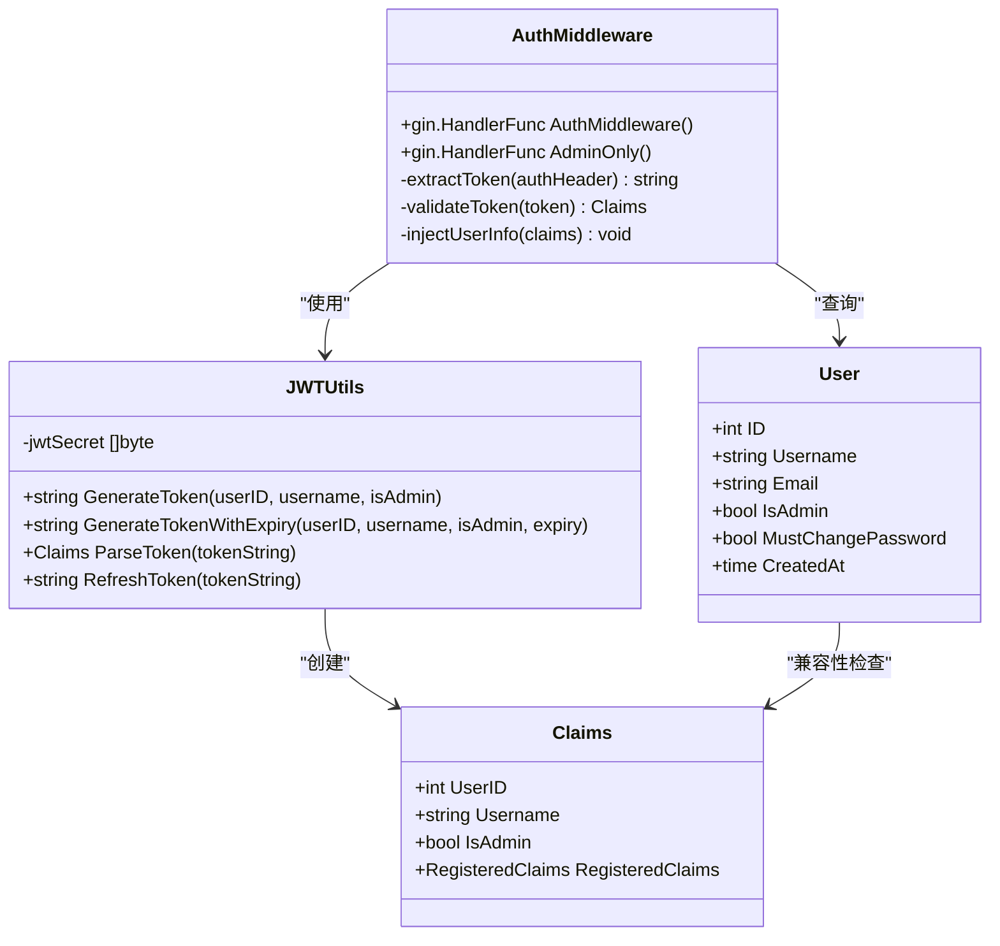

**图表来源**
- [backend/middleware/auth.go](file://backend/middleware/auth.go#L12-L71)
- [backend/utils/jwt.go](file://backend/utils/jwt.go#L22-L76)
- [backend/models/user.go](file://backend/models/user.go#L13-L20)

**章节来源**
- [backend/middleware/auth.go](file://backend/middleware/auth.go#L12-L71)
- [backend/utils/jwt.go](file://backend/utils/jwt.go#L22-L76)
- [backend/models/user.go](file://backend/models/user.go#L13-L20)

## 架构概览

认证中间件的整体架构采用分层设计，确保了良好的模块化和可维护性：

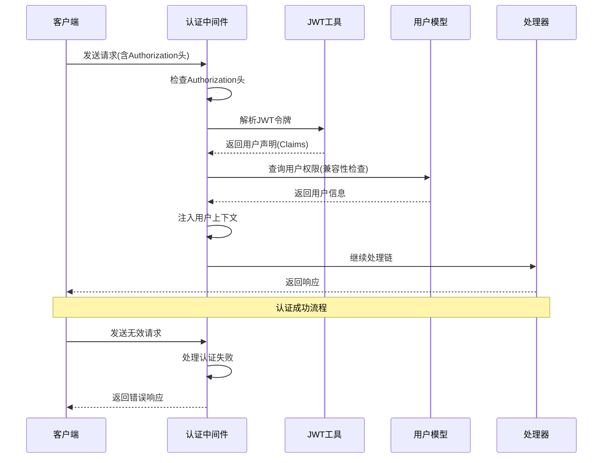

**图表来源**
- [backend/middleware/auth.go](file://backend/middleware/auth.go#L13-L51)
- [backend/utils/jwt.go](file://backend/utils/jwt.go#L51-L66)
- [backend/models/user.go](file://backend/models/user.go#L64-L76)

## 详细组件分析

### 认证中间件实现

#### AuthMiddleware 核心逻辑

AuthMiddleware 是认证系统的核心组件，负责处理所有传入请求的身份验证：

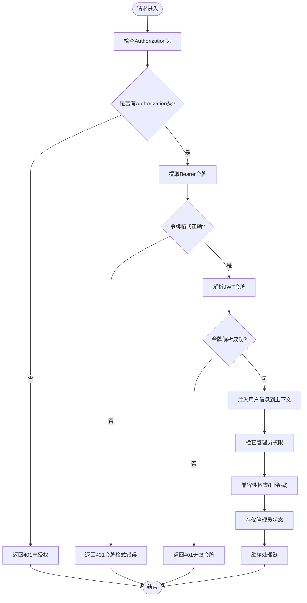

**图表来源**
- [backend/middleware/auth.go](file://backend/middleware/auth.go#L13-L51)

#### 管理员权限中间件

AdminOnly 中间件提供额外的权限检查，确保只有管理员用户才能访问特定资源：

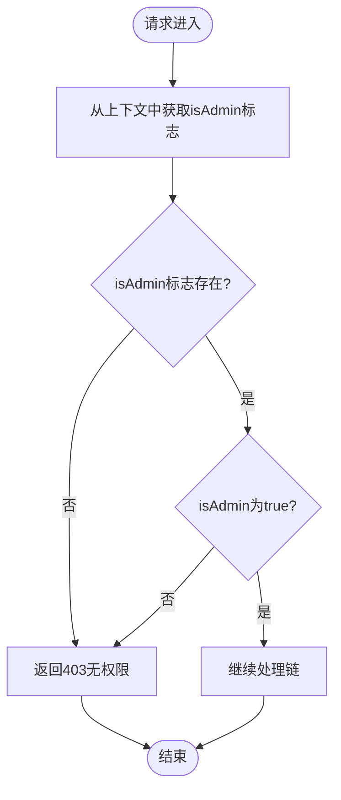

**图表来源**
- [backend/middleware/auth.go](file://backend/middleware/auth.go#L55-L70)

**章节来源**
- [backend/middleware/auth.go](file://backend/middleware/auth.go#L13-L71)

### JWT 工具类实现

JWT 工具类提供了完整的令牌生命周期管理功能：

#### 令牌生成流程

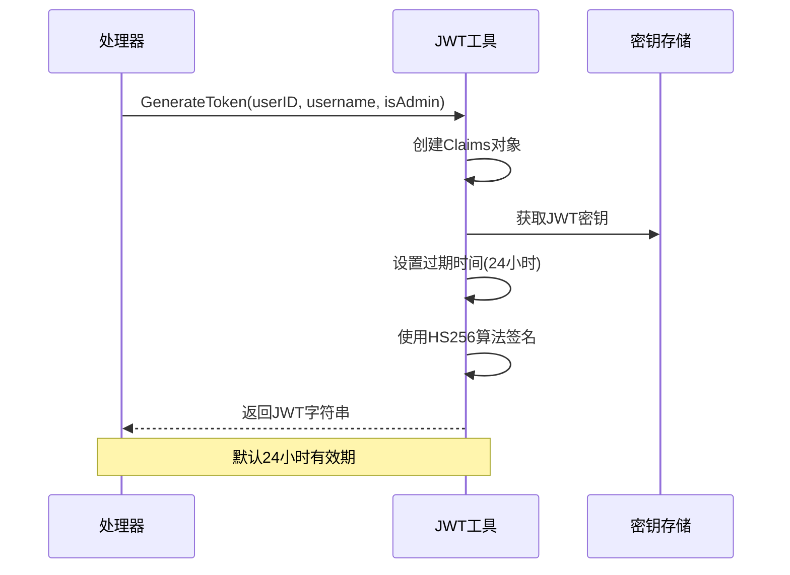

**图表来源**
- [backend/utils/jwt.go](file://backend/utils/jwt.go#L29-L49)

#### 令牌解析流程

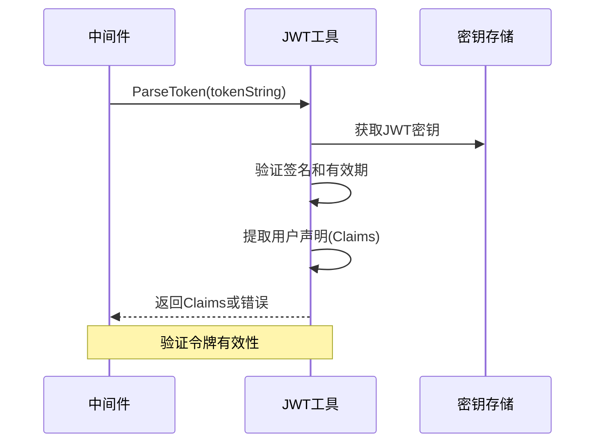

**图表来源**
- [backend/utils/jwt.go](file://backend/utils/jwt.go#L51-L66)

**章节来源**
- [backend/utils/jwt.go](file://backend/utils/jwt.go#L29-L76)

### 用户模型集成

用户模型提供了认证中间件所需的用户信息查询功能：

#### 用户信息查询

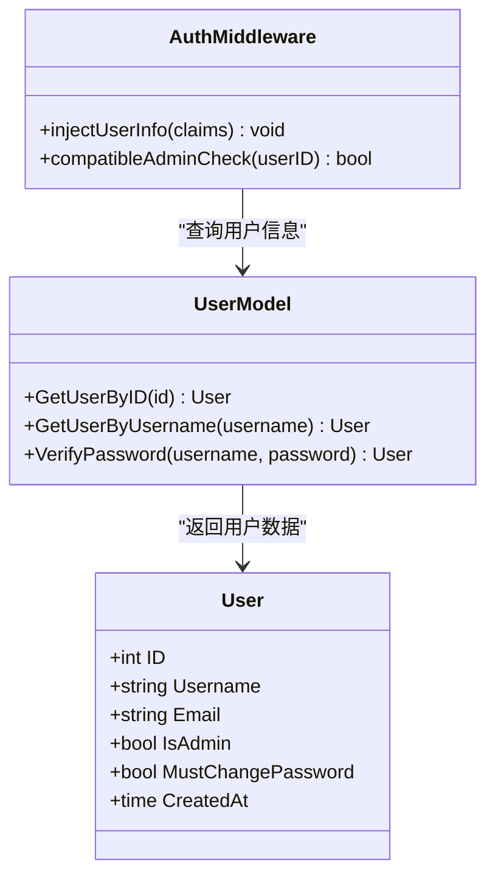

**图表来源**
- [backend/models/user.go](file://backend/models/user.go#L64-L110)
- [backend/middleware/auth.go](file://backend/middleware/auth.go#L42-L48)

**章节来源**
- [backend/models/user.go](file://backend/models/user.go#L64-L110)

## 依赖关系分析

认证中间件的依赖关系体现了清晰的分层架构：

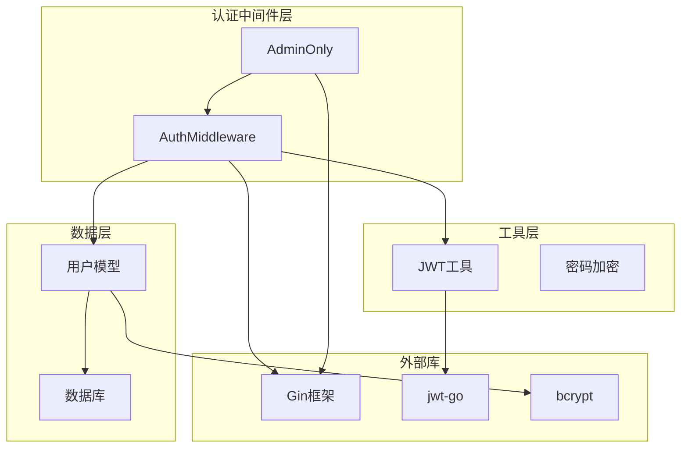

**图表来源**
- [backend/middleware/auth.go](file://backend/middleware/auth.go#L3-L10)
- [backend/utils/jwt.go](file://backend/utils/jwt.go#L3-L9)
- [backend/models/user.go](file://backend/models/user.go#L3-L11)

### 外部依赖分析

认证中间件主要依赖以下外部库：

| 依赖库 | 版本 | 用途 | 安全性 |
|--------|------|------|--------|
| github.com/gin-gonic/gin | v1.11.0 | Web框架 | ✅ 已更新 |
| github.com/golang-jwt/jwt/v5 | v5.3.1 | JWT令牌 | ✅ 已更新 |
| golang.org/x/crypto/bcrypt | v0.47.0 | 密码哈希 | ✅ 已更新 |

**章节来源**
- [backend/go.mod](file://backend/go.mod#L5-L11)

## 性能考虑

### 认证性能优化

认证中间件在设计时充分考虑了性能因素：

#### 缓存策略
- **令牌解析缓存**：JWT 解析结果可以在内存中缓存，减少重复计算
- **用户权限缓存**：管理员权限检查结果可以短期缓存
- **数据库连接池**：用户信息查询使用连接池优化

#### 内存管理
- **零拷贝字符串处理**：使用 Go 的字符串优化技术
- **对象复用**：避免频繁分配临时对象
- **并发安全**：使用互斥锁保护共享状态

#### 网络优化
- **异步数据库操作**：使用异步查询减少阻塞
- **连接复用**：重用数据库连接
- **超时控制**：设置合理的查询超时时间

### 速率限制集成

认证中间件与速率限制中间件协同工作：

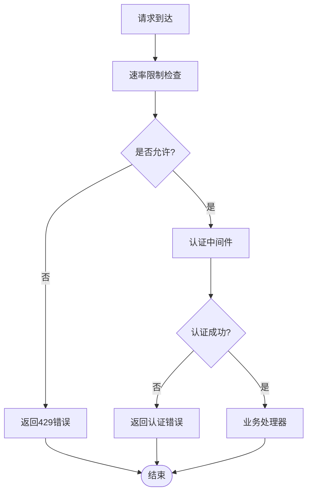

**图表来源**
- [backend/middleware/ratelimit.go](file://backend/middleware/ratelimit.go#L97-L121)

**章节来源**
- [backend/middleware/ratelimit.go](file://backend/middleware/ratelimit.go#L97-L143)

## 故障排除指南

### 常见认证问题及解决方案

#### 未提供认证令牌

**问题描述**：客户端发送请求时未包含 Authorization 头

**错误响应**：
```json
{
  "error": "未提供认证令牌"
}
```

**解决方案**：
1. 确保客户端正确设置 Authorization 头
2. 验证令牌格式：`Bearer <token>`
3. 检查网络请求是否被代理或中间件拦截

#### 令牌格式错误

**问题描述**：Authorization 头格式不正确

**错误响应**：
```json
{
  "error": "认证令牌格式错误"
}
```

**解决方案**：
1. 确保使用正确的 Bearer 令牌格式
2. 检查令牌字符串是否包含空格
3. 验证令牌编码是否正确

#### 无效的认证令牌

**问题描述**：JWT 令牌签名无效或已过期

**错误响应**：
```json
{
  "error": "无效的认证令牌"
}
```

**解决方案**：
1. 检查 JWT 密钥配置
2. 验证令牌是否过期
3. 确认令牌签名算法一致
4. 检查系统时间同步

#### 无权限访问

**问题描述**：用户尝试访问管理员专用功能

**错误响应**：
```json
{
  "error": "无权限"
}
```

**解决方案**：
1. 确认用户具有管理员权限
2. 检查用户角色状态
3. 验证管理员权限继承机制

#### 用户不存在

**问题描述**：令牌对应的用户在数据库中不存在

**错误响应**：
```json
{
  "error": "用户不存在"
}
```

**解决方案**：
1. 检查用户数据库连接
2. 验证用户表结构
3. 确认用户 ID 一致性

### 调试技巧

#### 日志记录

认证中间件支持详细的日志记录：

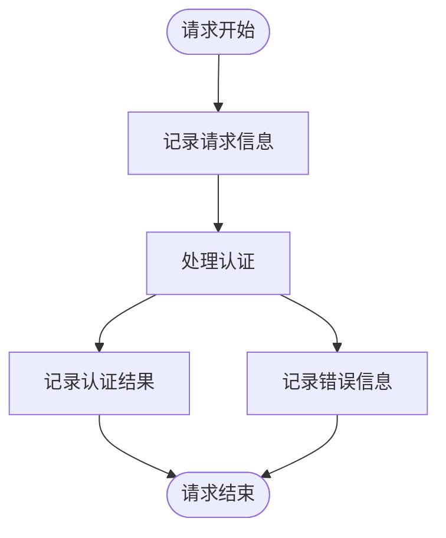

#### 性能监控

建议添加以下监控指标：
- 认证成功率
- 令牌解析时间
- 数据库查询延迟
- 错误率统计

**章节来源**
- [backend/middleware/auth.go](file://backend/middleware/auth.go#L16-L36)
- [backend/middleware/auth.go](file://backend/middleware/auth.go#L58-L67)

## 结论

Memo Studio 的认证中间件是一个设计精良、功能完整的安全组件。它采用了现代的 JWT 技术，结合了 Gin 框架的最佳实践，提供了可靠的身份验证和授权功能。

### 主要优势

1. **安全性**：基于标准 JWT 协议，支持多种安全特性
2. **可扩展性**：模块化设计，易于扩展新功能
3. **性能**：优化的算法和缓存策略，保证高并发性能
4. **易用性**：简洁的 API 设计，便于集成和使用

### 最佳实践建议

1. **配置管理**：确保 JWT 密钥的安全存储和轮换
2. **监控告警**：建立完善的监控和告警机制
3. **定期审计**：定期审查认证日志和访问模式
4. **安全更新**：及时更新依赖库和安全补丁

认证中间件为 Memo Studio 提供了坚实的安全基础，支持系统的长期稳定发展。