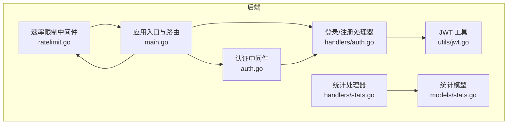
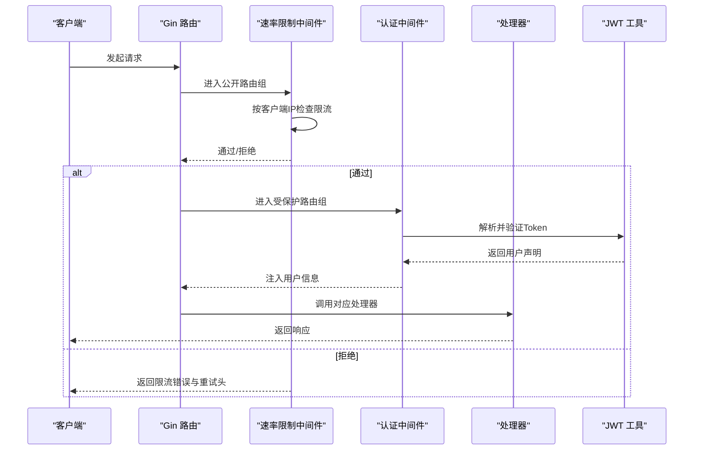
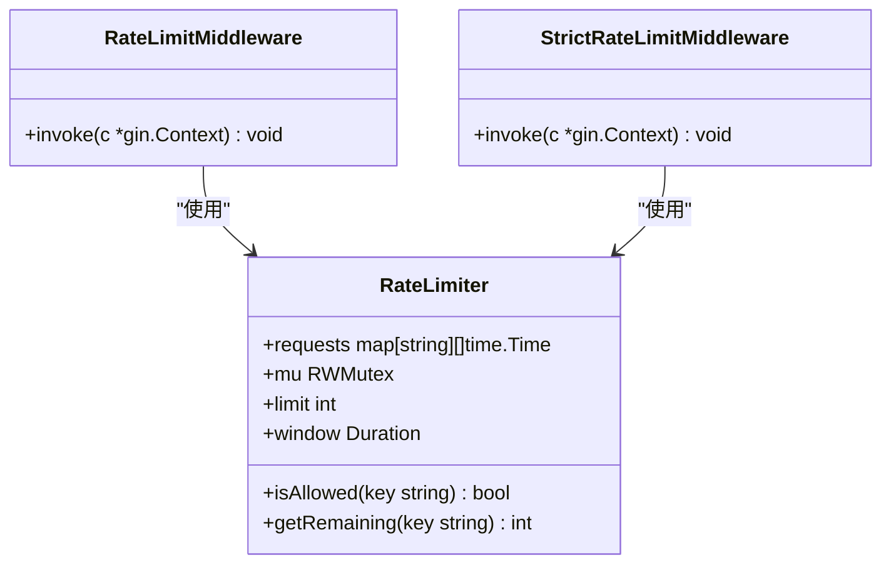
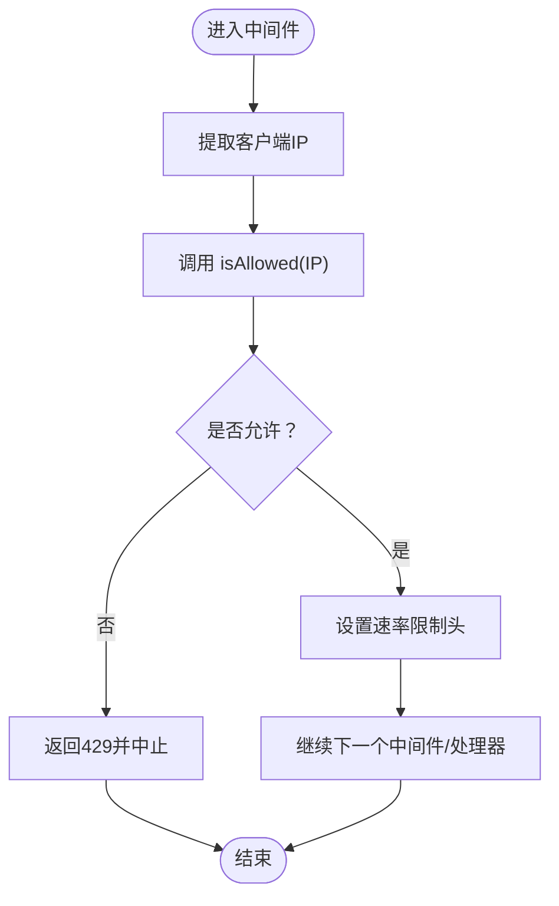
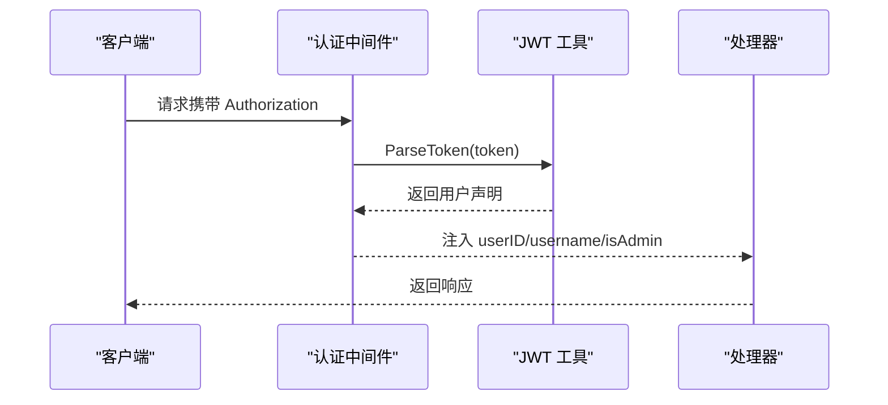
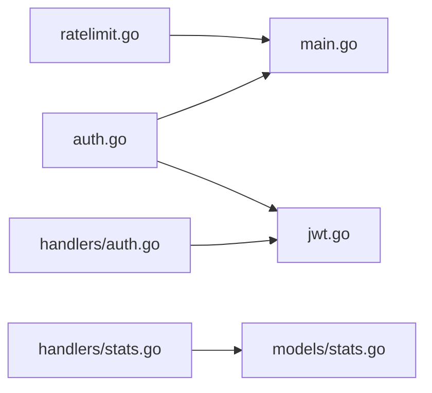

# 速率限制与防护

<cite>
**本文引用的文件列表**
- [backend/middleware/ratelimit.go](file://backend/middleware/ratelimit.go)
- [backend/main.go](file://backend/main.go)
- [backend/middleware/auth.go](file://backend/middleware/auth.go)
- [backend/handlers/auth.go](file://backend/handlers/auth.go)
- [backend/utils/jwt.go](file://backend/utils/jwt.go)
- [.env.example](file://.env.example)
- [backend/handlers/stats.go](file://backend/handlers/stats.go)
- [backend/models/stats.go](file://backend/models/stats.go)
</cite>

## 目录
1. [简介](#简介)
2. [项目结构](#项目结构)
3. [核心组件](#核心组件)
4. [架构总览](#架构总览)
5. [组件详解](#组件详解)
6. [依赖关系分析](#依赖关系分析)
7. [性能考量](#性能考量)
8. [故障排查指南](#故障排查指南)
9. [结论](#结论)
10. [附录](#附录)

## 简介
本技术文档聚焦 Memo Studio 的“速率限制与安全防护”体系，围绕后端 Gin 中间件实现的速率限制器展开，系统性阐述其工作原理、策略类型、阈值配置、安全防护、动态配置与运行时调整、监控与分析、以及与业务逻辑的平衡。当前实现采用基于内存的滑动窗口计数法，对公开接口进行统一限流，并结合认证中间件与 JWT 实现基础的身份验证与授权，辅以安全响应头与 CORS 配置提升整体安全性。

## 项目结构
与速率限制及安全相关的关键文件分布如下：
- 速率限制中间件：backend/middleware/ratelimit.go
- 应用入口与路由挂载：backend/main.go
- 认证中间件与管理员校验：backend/middleware/auth.go
- 登录/注册处理器：backend/handlers/auth.go
- JWT 生成与解析：backend/utils/jwt.go
- 环境变量模板：.env.example
- 统计接口与模型：backend/handlers/stats.go、backend/models/stats.go

图表来源
- [backend/middleware/ratelimit.go](file://backend/middleware/ratelimit.go#L1-L143)
- [backend/main.go](file://backend/main.go#L94-L120)
- [backend/middleware/auth.go](file://backend/middleware/auth.go#L12-L52)
- [backend/handlers/auth.go](file://backend/handlers/auth.go#L27-L53)
- [backend/utils/jwt.go](file://backend/utils/jwt.go#L11-L49)
- [backend/handlers/stats.go](file://backend/handlers/stats.go#L11-L23)
- [backend/models/stats.go](file://backend/models/stats.go#L18-L65)

章节来源
- [backend/middleware/ratelimit.go](file://backend/middleware/ratelimit.go#L1-L143)
- [backend/main.go](file://backend/main.go#L94-L120)

## 核心组件
- 速率限制器（RateLimiter）：基于内存的滑动窗口计数器，支持全局限流与严格限流两种策略，默认全局限流为每分钟 50 次，严格限流为每分钟 30 次。
- 速率限制中间件（RateLimitMiddleware/StrictRateLimitMiddleware）：在公开路由组上挂载，按客户端 IP 进行限流，并返回速率限制相关头部。
- 认证中间件（AuthMiddleware/AdminOnly）：负责提取 Authorization 头中的 Bearer Token，解析 JWT 并将用户信息注入上下文；管理员专用路由组进一步校验管理员权限。
- 登录/注册处理器：对用户名与密码长度进行基础校验，并在成功后签发 JWT。
- JWT 工具：负责生成与加载密钥，生产环境要求设置 MEMO_JWT_SECRET。
- 环境变量：提供 MEMO_JWT_SECRET、MEMO_CORS_ORIGINS、MEMO_ENV 等关键配置项。
- 统计接口：提供用户维度的统计查询，可用于评估限流对业务的影响。

章节来源
- [backend/middleware/ratelimit.go](file://backend/middleware/ratelimit.go#L11-L94)
- [backend/middleware/ratelimit.go](file://backend/middleware/ratelimit.go#L96-L142)
- [backend/middleware/auth.go](file://backend/middleware/auth.go#L12-L70)
- [backend/handlers/auth.go](file://backend/handlers/auth.go#L11-L53)
- [backend/utils/jwt.go](file://backend/utils/jwt.go#L11-L49)
- [.env.example](file://.env.example#L1-L16)
- [backend/handlers/stats.go](file://backend/handlers/stats.go#L11-L23)
- [backend/models/stats.go](file://backend/models/stats.go#L18-L65)

## 架构总览
下图展示了速率限制与安全防护在请求生命周期中的作用路径，以及与认证、JWT、路由的关系。

图表来源
- [backend/main.go](file://backend/main.go#L94-L120)
- [backend/middleware/ratelimit.go](file://backend/middleware/ratelimit.go#L96-L121)
- [backend/middleware/auth.go](file://backend/middleware/auth.go#L12-L52)
- [backend/handlers/auth.go](file://backend/handlers/auth.go#L27-L53)
- [backend/utils/jwt.go](file://backend/utils/jwt.go#L29-L49)

## 组件详解

### 速率限制器（RateLimiter）
- 数据结构与字段
  - requests：以键（如客户端 IP）映射到该键在当前时间窗口内的请求时间戳切片。
  - mu：读写锁，保证并发安全。
  - limit：时间窗口内的最大请求数。
  - window：时间窗口长度。
- 关键方法
  - NewRateLimiter：构造新的限流器实例。
  - isAllowed：在写锁下清理过期记录，判断是否超过限制，若未超限则记录当前请求时间。
  - getRemaining：在读锁下计算剩余配额。
- 全局与严格策略
  - GetGlobalLimiter：全局单例限流器，默认每分钟 50 次。
  - StrictRateLimitMiddleware：为特定场景提供更严格的每分钟 30 次限流。
- 请求头输出
  - 在通过限流时设置 X-RateLimit-Limit 与 X-RateLimit-Remaining，便于客户端感知剩余配额。

图表来源
- [backend/middleware/ratelimit.go](file://backend/middleware/ratelimit.go#L11-L94)
- [backend/middleware/ratelimit.go](file://backend/middleware/ratelimit.go#L96-L142)

章节来源
- [backend/middleware/ratelimit.go](file://backend/middleware/ratelimit.go#L11-L94)
- [backend/middleware/ratelimit.go](file://backend/middleware/ratelimit.go#L96-L142)

### 速率限制中间件（按 IP 限流）
- 作用范围
  - 在公开路由组（如登录/注册）挂载，按客户端 IP 作为键进行限流。
- 行为特征
  - 若超过阈值，返回状态码 429（Too Many Requests），包含 Retry-After 头与错误码。
  - 通过时设置速率限制相关响应头，便于前端感知剩余配额。
- 与路由的关系
  - 在 main.go 中，公开路由组 v1 与旧版 /api 组均挂载了速率限制中间件。

图表来源
- [backend/middleware/ratelimit.go](file://backend/middleware/ratelimit.go#L96-L121)
- [backend/main.go](file://backend/main.go#L97-L102)

章节来源
- [backend/middleware/ratelimit.go](file://backend/middleware/ratelimit.go#L96-L121)
- [backend/main.go](file://backend/main.go#L97-L102)

### 认证与管理员权限
- 认证中间件
  - 从 Authorization 头提取 Bearer Token，调用 JWT 工具解析并校验。
  - 将用户 ID、用户名、管理员标记注入上下文，供后续处理器使用。
- 管理员专用路由
  - AdminOnly 中间件校验上下文中是否存在管理员标记，缺失或非管理员直接拒绝。
- 登录/注册处理器
  - 对用户名与密码长度进行基础校验。
  - 成功后调用 JWT 工具生成 Token 并返回。

图表来源
- [backend/middleware/auth.go](file://backend/middleware/auth.go#L12-L52)
- [backend/utils/jwt.go](file://backend/utils/jwt.go#L29-L49)
- [backend/handlers/auth.go](file://backend/handlers/auth.go#L27-L53)

章节来源
- [backend/middleware/auth.go](file://backend/middleware/auth.go#L12-L70)
- [backend/handlers/auth.go](file://backend/handlers/auth.go#L27-L53)
- [backend/utils/jwt.go](file://backend/utils/jwt.go#L11-L49)

### 安全响应头与 CORS
- 安全响应头
  - 在 main.go 中统一设置 X-Content-Type-Options、X-Frame-Options、X-XSS-Protection、X-Robots-Tag，降低常见 Web 攻击风险。
- CORS 配置
  - 支持通过 MEMO_CORS_ORIGINS 环境变量配置允许的源；生产环境建议显式设置以增强安全性。

章节来源
- [backend/main.go](file://backend/main.go#L46-L80)

### 限流策略与阈值配置
- 全局限流
  - GetGlobalLimiter 默认每分钟 50 次，适用于大多数公开接口。
- 严格限流
  - StrictRateLimitMiddleware 默认每分钟 30 次，可针对高风险端点或特定场景启用。
- IP 限流
  - 当前实现按客户端 IP 作为键进行限流，属于 IP 级别的限流策略。
- 用户限流与 API 特定限流
  - 当前代码未实现用户级限流与 API 级限流。若需扩展，可在中间件中引入用户 ID 或 API 路径作为复合键，并维护多维限流表。

章节来源
- [backend/middleware/ratelimit.go](file://backend/middleware/ratelimit.go#L88-L94)
- [backend/middleware/ratelimit.go](file://backend/middleware/ratelimit.go#L123-L142)

### 动态配置与运行时调整
- 环境变量
  - MEMO_JWT_SECRET：生产环境必须设置，用于 JWT 签名与验证。
  - MEMO_CORS_ORIGINS：配置允许跨域的源列表。
  - MEMO_ENV：生产模式提示与安全检查。
- 运行时调整
  - 当前限流阈值与窗口在编译期固定，可通过重构 RateLimiter 构造函数参数或引入外部配置中心实现运行时调整。
- 监控与告警
  - 当前未实现内置监控与告警。建议在中间件中增加计数器与指标导出（如 Prometheus），并在达到阈值时触发告警。

章节来源
- [.env.example](file://.env.example#L1-L16)
- [backend/main.go](file://backend/main.go#L324-L329)
- [backend/middleware/ratelimit.go](file://backend/middleware/ratelimit.go#L19-L26)

### 限流效果的监控与分析
- 统计接口
  - 提供用户维度的统计查询，可用于评估限流对业务的影响（如近 7 日笔记创建/更新数量）。
- 性能影响评估
  - 基于 X-RateLimit-Limit 与 X-RateLimit-Remaining 头部，前端可优化重试策略与用户体验。
- 用户体验优化
  - 结合前端退避重试、节流与缓存策略，减少重复请求，提升稳定性。

章节来源
- [backend/handlers/stats.go](file://backend/handlers/stats.go#L11-L23)
- [backend/models/stats.go](file://backend/models/stats.go#L18-L65)

### 与业务逻辑的平衡
- 关键 API 的优先级保护
  - 可通过在路由层区分公开与私有端点，对关键端点采用更严格的限流策略或单独的限流器。
- 缓存策略
  - 对高频只读接口（如统计、资源列表）引入缓存，降低后端压力。
- 降级机制
  - 当系统负载过高时，可临时放宽限流阈值或返回降级响应，保障核心功能可用。

## 依赖关系分析
- 速率限制中间件依赖 Gin 上下文提取客户端 IP，并在通过时设置响应头。
- 认证中间件依赖 JWT 工具进行 Token 解析与校验，并将用户信息注入上下文。
- 登录/注册处理器依赖模型层进行用户校验与创建，并依赖 JWT 工具生成 Token。
- 应用入口在公开路由组挂载速率限制中间件，在受保护路由组挂载认证中间件。

图表来源
- [backend/middleware/ratelimit.go](file://backend/middleware/ratelimit.go#L96-L121)
- [backend/main.go](file://backend/main.go#L94-L120)
- [backend/middleware/auth.go](file://backend/middleware/auth.go#L12-L52)
- [backend/handlers/auth.go](file://backend/handlers/auth.go#L27-L53)
- [backend/utils/jwt.go](file://backend/utils/jwt.go#L29-L49)
- [backend/handlers/stats.go](file://backend/handlers/stats.go#L11-L23)
- [backend/models/stats.go](file://backend/models/stats.go#L18-L65)

章节来源
- [backend/middleware/ratelimit.go](file://backend/middleware/ratelimit.go#L96-L121)
- [backend/main.go](file://backend/main.go#L94-L120)
- [backend/middleware/auth.go](file://backend/middleware/auth.go#L12-L52)
- [backend/handlers/auth.go](file://backend/handlers/auth.go#L27-L53)
- [backend/utils/jwt.go](file://backend/utils/jwt.go#L29-L49)
- [backend/handlers/stats.go](file://backend/handlers/stats.go#L11-L23)
- [backend/models/stats.go](file://backend/models/stats.go#L18-L65)

## 性能考量
- 内存占用
  - requests 映射随并发与时间窗口增长而增长，建议在高并发场景下考虑分布式限流或持久化存储。
- 锁竞争
  - 读写锁在高并发下可能成为瓶颈，可考虑分桶或无锁队列优化。
- 响应头开销
  - 设置速率限制头对性能影响极小，但应避免在高频短周期内重复计算剩余配额。
- 缓存与降级
  - 引入只读接口缓存与降级策略，有助于缓解限流带来的瞬时压力。

## 故障排查指南
- 429 Too Many Requests
  - 检查客户端 IP 是否被限流；查看 Retry-After 与 X-RateLimit-Remaining 头部。
  - 调整限流阈值或窗口，或在路由层区分公开与私有端点。
- 认证失败
  - 确认 Authorization 头格式是否为 Bearer Token；检查 MEMO_JWT_SECRET 是否正确设置。
- CORS 问题
  - 检查 MEMO_CORS_ORIGINS 是否正确配置；生产环境建议明确允许的源。
- 生产环境安全提示
  - 确保 MEMO_ENV=production 且 MEMO_JWT_SECRET 已设置；否则会触发警告或致命错误。

章节来源
- [backend/middleware/ratelimit.go](file://backend/middleware/ratelimit.go#L104-L112)
- [backend/middleware/auth.go](file://backend/middleware/auth.go#L15-L36)
- [backend/main.go](file://backend/main.go#L324-L329)
- [backend/main.go](file://backend/main.go#L56-L80)

## 结论
Memo Studio 的速率限制与安全防护体系以 Gin 中间件为核心，采用基于内存的滑动窗口计数法实现 IP 级限流，并结合认证中间件与 JWT 实现基础身份验证。当前实现简洁可靠，适合中小规模部署；对于更高要求的场景，建议引入分布式限流、指标监控与告警、动态阈值配置与缓存/降级策略，以实现更稳健的速率限制与安全防护。

## 附录
- 环境变量参考
  - MEMO_JWT_SECRET：JWT 密钥（生产环境必填）
  - MEMO_CORS_ORIGINS：允许的前端域名（逗号分隔）
  - MEMO_ENV：生产模式提示与安全检查
- 相关端点
  - 公开路由组（v1）：登录/注册等公开接口
  - 受保护路由组：需要认证的 API
  - 健康检查端点：/health（公开，无速率限制）

章节来源
- [.env.example](file://.env.example#L1-L16)
- [backend/main.go](file://backend/main.go#L82-L85)
- [backend/main.go](file://backend/main.go#L94-L196)