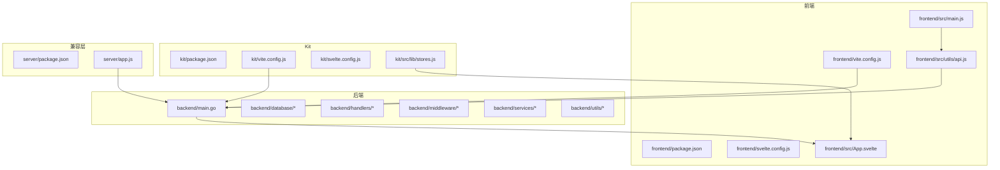
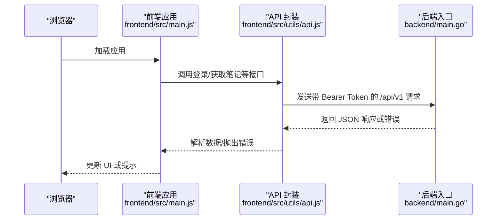
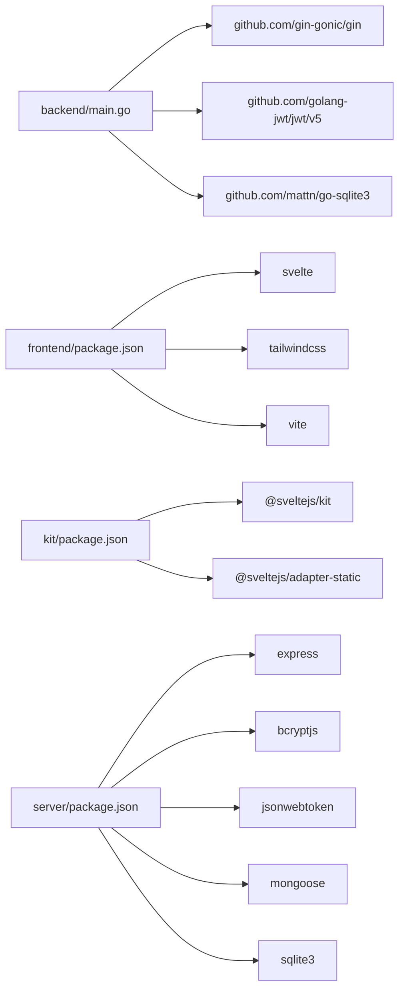

# 代码规范与约定

<cite>
**本文引用的文件**
- [backend/main.go](file://backend/main.go)
- [backend/go.mod](file://backend/go.mod)
- [backend/.air.toml](file://backend/.air.toml)
- [frontend/package.json](file://frontend/package.json)
- [frontend/svelte.config.js](file://frontend/svelte.config.js)
- [frontend/tailwind.config.js](file://frontend/tailwind.config.js)
- [frontend/vite.config.js](file://frontend/vite.config.js)
- [frontend/src/main.js](file://frontend/src/main.js)
- [frontend/src/utils/api.js](file://frontend/src/utils/api.js)
- [kit/package.json](file://kit/package.json)
- [kit/svelte.config.js](file://kit/svelte.config.js)
- [kit/vite.config.js](file://kit/vite.config.js)
- [kit/src/lib/stores.js](file://kit/src/lib/stores.js)
- [server/package.json](file://server/package.json)
- [server/app.js](file://server/app.js)
</cite>

## 目录
1. [引言](#引言)
2. [项目结构](#项目结构)
3. [核心组件](#核心组件)
4. [架构总览](#架构总览)
5. [详细组件分析](#详细组件分析)
6. [依赖关系分析](#依赖关系分析)
7. [性能考虑](#性能考虑)
8. [故障排查指南](#故障排查指南)
9. [结论](#结论)
10. [附录](#附录)

## 引言
本文件为 Memo Studio 的代码规范与约定文档，面向 Go 与 JavaScript/Svelte 双栈团队，系统性地给出编码风格、命名约定、目录与文件组织、格式化工具配置、注释与文档标准、代码审查清单与质量检查项，帮助提升一致性、可维护性与协作效率。

## 项目结构
项目采用多包/多子项目的分层组织：
- backend：Go 后端主服务，内置前端静态资源并提供统一 API v1；包含数据库、中间件、处理器、服务、工具等模块。
- frontend：基于 Svelte 5 的前端应用，使用 Vite 构建，TailwindCSS 提供样式基础。
- kit：基于 SvelteKit 的独立路由与页面集合，适配静态部署并回退到 SPA。
- server：Express 兼容层（历史遗留），提供部分路由与测试脚本。
- docs：项目文档与设计说明。

图表来源
- [backend/main.go](file://backend/main.go#L28-L352)
- [frontend/src/main.js](file://frontend/src/main.js#L1-L20)
- [frontend/src/utils/api.js](file://frontend/src/utils/api.js#L1-L316)
- [kit/src/lib/stores.js](file://kit/src/lib/stores.js#L1-L32)
- [server/app.js](file://server/app.js#L1-L26)

章节来源
- [backend/main.go](file://backend/main.go#L1-L353)
- [frontend/package.json](file://frontend/package.json#L1-L25)
- [kit/package.json](file://kit/package.json#L1-L20)
- [server/package.json](file://server/package.json#L1-L25)

## 核心组件
- 后端入口与路由：统一在后端入口集中初始化日志、CORS、安全头、静态资源与 SPA 回退，按版本划分 API v1 与旧版兼容路由。
- 前端应用与 API 封装：统一的 fetchWithAuth、认证拦截器、错误处理与内容清洗工具，集中于 api.js。
- Kit 状态与 UI：基于 Svelte Store 的全局状态与 Toast 工具，便于跨页面共享。
- 构建与开发：Vite + Svelte 插件，TailwindCSS 配置，SvelteKit 静态适配器。

章节来源
- [backend/main.go](file://backend/main.go#L28-L352)
- [frontend/src/utils/api.js](file://frontend/src/utils/api.js#L1-L316)
- [kit/src/lib/stores.js](file://kit/src/lib/stores.js#L1-L32)
- [frontend/vite.config.js](file://frontend/vite.config.js#L1-L25)
- [kit/vite.config.js](file://kit/vite.config.js#L1-L16)

## 架构总览
后端作为统一网关，提供 API v1 并内置前端静态资源；前端通过 /api/v1 发起请求；Kit 作为独立路由集合，最终产物与后端静态资源一致，便于统一部署。

图表来源
- [frontend/src/main.js](file://frontend/src/main.js#L1-L20)
- [frontend/src/utils/api.js](file://frontend/src/utils/api.js#L115-L310)
- [backend/main.go](file://backend/main.go#L94-L196)

## 详细组件分析

### 后端：Go 语言编码规范与约定
- 包结构与职责
  - database：数据库初始化与迁移。
  - handlers：业务路由处理器，按领域拆分（auth、memos、notes、tags、insights、stats、stocks、location、users 等）。
  - middleware：鉴权与限流中间件。
  - services：外部能力封装（LLM、股票、位置等）。
  - utils：通用工具（加密、JWT）。
- 命名约定
  - 包名小写、简短且语义明确；类型与导出函数首字母大写；常量与私有变量小写。
  - 文件名与包名一致，处理器与模型对应文件清晰分离。
- 错误处理模式
  - 统一返回 JSON 错误体，401 触发认证失效流程，429 限流提示，4xx/5xx 捕获并返回错误信息。
  - 关键初始化失败直接 log.Fatal，确保问题早发现。
- 配置与安全
  - 生产模式下设置 Gin ReleaseMode；注入安全响应头；CORS 可通过环境变量精确配置。
  - JWT 密钥与存储目录通过环境变量注入，生产环境需校验必填项。
- 日志与健康检查
  - 开发模式启用 Logger；提供 /health 健康检查端点。
- 静态资源与 SPA 回退
  - 内嵌前端静态资源；NoRoute 对非 /api 路径回退至 index.html，支持 SPA。

章节来源
- [backend/main.go](file://backend/main.go#L28-L352)
- [backend/go.mod](file://backend/go.mod#L1-L45)
- [backend/.air.toml](file://backend/.air.toml#L1-L48)

### 前端：JavaScript/Svelte 编码标准
- 组件命名与组织
  - 组件文件以 PascalCase 命名（如 LoginPage.svelte），位于 src/components 下；公共库组件置于 src/lib/components。
- 状态管理
  - 使用 Svelte writable store 管理全局状态；提供 showToast/removeToast/clearToasts 工具方法。
- 事件处理与交互
  - 在 main.js 中监听 auth-expired 自定义事件，触发重新登录逻辑。
- 样式规范
  - TailwindCSS 主题扩展：颜色、圆角、阴影、动画；darkMode 支持 class 切换；content 路径覆盖 src 下所有 Svelte/JS/HTML。
- API 封装与错误处理
  - 统一 fetchWithAuth：自动注入 Authorization 头、执行拦截器链、处理 401/404/429 等错误并触发认证失效事件。
  - 内容清洗：cleanContent/cleanNote 处理异常字符串与 JSON 化对象，保证渲染安全。
- 构建与开发
  - Vite + @sveltejs/vite-plugin-svelte；开发代理到后端 9000；别名 $lib 指向 src/lib。

章节来源
- [frontend/src/main.js](file://frontend/src/main.js#L1-L20)
- [frontend/src/utils/api.js](file://frontend/src/utils/api.js#L1-L316)
- [frontend/tailwind.config.js](file://frontend/tailwind.config.js#L1-L100)
- [frontend/svelte.config.js](file://frontend/svelte.config.js#L1-L11)
- [frontend/vite.config.js](file://frontend/vite.config.js#L1-L25)

### Kit：SvelteKit 页面与状态
- 页面路由：基于 +page.svelte、+layout.svelte 组织页面；静态适配器输出纯静态站点并回退到 index.html。
- 状态与工具：stores.js 提供 notes/tags/toast 等全局状态与 Toast 工具，便于 Kit 页面复用。

章节来源
- [kit/svelte.config.js](file://kit/svelte.config.js#L1-L22)
- [kit/vite.config.js](file://kit/vite.config.js#L1-L16)
- [kit/src/lib/stores.js](file://kit/src/lib/stores.js#L1-L32)

### 兼容层：Express 服务
- 路由：/api/auth 与 /api/notes；CORS 与 JSON 解析中间件；可单独运行用于测试。
- 适用场景：历史接口兼容或独立测试。

章节来源
- [server/app.js](file://server/app.js#L1-L26)
- [server/package.json](file://server/package.json#L1-L25)

### 文件与目录命名约定
- Go
  - 包名小写；文件名与包名一致；handlers/models/utils 等目录按职责划分。
- 前端
  - 组件：PascalCase.svelte；工具：camelCase.js；样式：global.css；页面：src/routes 下 +page.svelte。
- Kit
  - 页面：+page.svelte；布局：+layout.svelte；工具：src/lib/*。
- 兼容层
  - 路由：routes/*；模型：models/*。

章节来源
- [backend/main.go](file://backend/main.go#L1-L353)
- [frontend/src/utils/api.js](file://frontend/src/utils/api.js#L1-L316)
- [kit/svelte.config.js](file://kit/svelte.config.js#L1-L22)

### 代码格式化工具配置
- Go
  - 使用 gofmt；热重载开发使用 air，构建命令包含 sqlite_fts5 标签。
- 前端
  - 使用 Vite + Svelte 插件；TailwindCSS 配置；未发现 eslint/prettier 配置文件，建议新增以统一格式。
- Kit
  - 使用 Vite + SvelteKit 插件；静态适配器；未发现 eslint/prettier 配置文件，建议新增以统一格式。
- 兼容层
  - Express 项目未发现 eslint/prettier 配置文件，建议新增以统一格式。

章节来源
- [backend/.air.toml](file://backend/.air.toml#L1-L48)
- [frontend/package.json](file://frontend/package.json#L1-L25)
- [kit/package.json](file://kit/package.json#L1-L20)
- [server/package.json](file://server/package.json#L1-L25)

### 注释规范与文档标准
- 函数注释
  - Go：导出函数建议添加简洁英文注释，说明用途、参数与返回值；错误处理分支需标注可能的错误场景。
  - 前端：复杂函数与工具方法建议添加 JSDoc 风格注释，说明入参、返回值与副作用。
- 模块注释
  - Go：包级注释说明职责与边界；handlers/models 等目录建议在包内提供 README 或注释说明。
  - 前端：src/utils、src/lib 等目录建议提供模块说明与使用示例。
- API 文档
  - 后端：统一在 main.go 中集中声明 API v1 路由，便于生成 OpenAPI/Swagger；建议补充注释描述每个端点的鉴权需求、请求/响应结构与错误码。
  - 前端：api.js 中的每个方法建议标注调用方、错误处理与返回值类型。

章节来源
- [backend/main.go](file://backend/main.go#L94-L196)
- [frontend/src/utils/api.js](file://frontend/src/utils/api.js#L115-L310)

### 代码审查清单与质量检查
- 性能指标
  - 后端：关注路由层级与中间件顺序，避免重复解析与不必要的日志输出；静态资源命中与 SPA 回退路径正确性。
  - 前端：避免在组件中进行重型计算；合理使用 store 与响应式更新；Tailwind 动画与阴影避免过度使用导致渲染压力。
- 安全检查
  - 后端：生产模式必须设置 CORS 白名单与 JWT 密钥；严格校验输入参数与鉴权头；对上传资源进行类型与大小限制。
  - 前端：禁止在 localStorage 存储敏感信息；统一错误处理，避免泄露内部细节；对用户输入进行最小化清洗。
- 兼容性验证
  - 后端：确保 /api 与 /api/v1 兼容性；CORS 配置在不同环境下的行为一致。
  - 前端：确认代理配置与后端端口一致；Kit 与前端静态资源产物一致；Tailwind 主题在深色模式下表现一致。

章节来源
- [backend/main.go](file://backend/main.go#L46-L80)
- [frontend/vite.config.js](file://frontend/vite.config.js#L17-L22)
- [kit/vite.config.js](file://kit/vite.config.js#L7-L13)

## 依赖关系分析
- 后端依赖
  - Gin、JWT、SQLite 驱动、CORS、加密库等；通过 go.mod 管理版本与间接依赖。
- 前端依赖
  - Svelte 5、TailwindCSS、Vite；Kit 依赖 SvelteKit 与静态适配器。
- 兼容层依赖
  - Express、bcryptjs、jsonwebtoken、mongoose、sqlite3 等。

图表来源
- [backend/go.mod](file://backend/go.mod#L5-L44)
- [frontend/package.json](file://frontend/package.json#L11-L23)
- [kit/package.json](file://kit/package.json#L11-L17)
- [server/package.json](file://server/package.json#L11-L19)

章节来源
- [backend/go.mod](file://backend/go.mod#L1-L45)
- [frontend/package.json](file://frontend/package.json#L1-L25)
- [kit/package.json](file://kit/package.json#L1-L20)
- [server/package.json](file://server/package.json#L1-L25)

## 性能考虑
- 后端
  - 使用 Gin ReleaseMode 降低日志开销；静态资源内嵌减少磁盘 IO；NoRoute 回退避免不必要的后端计算。
  - 限流中间件保护敏感端点；CORS 精确配置减少跨域预检。
- 前端
  - Tailwind 动画与阴影适度使用；组件按需加载；store 状态粒度适中，避免过度响应式更新。
- Kit
  - 静态适配器输出纯静态站点，利于 CDN 分发与缓存。

## 故障排查指南
- 后端
  - 无法访问 /health：检查端口与环境变量；确认生产模式下安全头与 CORS 配置。
  - 401/403：检查 Authorization 头与 JWT 密钥；确认中间件顺序与路由分组。
  - 静态资源 404：确认 public 内嵌资源与 SPA 回退逻辑。
- 前端
  - 代理失败：确认 /api 代理目标与端口；检查 fetchWithAuth 是否正确注入 Authorization。
  - 认证过期：监听 auth-expired 事件并跳转登录页。
- Kit
  - 页面空白：检查静态适配器 fallback 与路由 +page.svelte 是否存在。
- 兼容层
  - 路由 404：确认路由挂载路径与模块导出。

章节来源
- [backend/main.go](file://backend/main.go#L82-L316)
- [frontend/src/main.js](file://frontend/src/main.js#L8-L17)
- [frontend/src/utils/api.js](file://frontend/src/utils/api.js#L33-L76)
- [kit/svelte.config.js](file://kit/svelte.config.js#L12-L17)
- [server/app.js](file://server/app.js#L14-L23)

## 结论
本规范围绕 Go 与 Svelte 生态，从包结构、命名、错误处理、格式化、注释与文档、审查清单等方面形成统一约定。建议后续补充 ESLint/Prettier 配置，完善 API 注释与自动化文档生成，持续优化性能与安全实践。

## 附录
- 开发与构建建议
  - Go：使用 air 进行热重载开发，构建时启用 sqlite_fts5 标签。
  - 前端：在根目录新增 .eslintrc 与 prettierrc，统一 JS/TS/Svelte 格式。
  - Kit：同前端，补充 lint 与格式化配置。
  - 兼容层：Express 项目建议统一 lint 与格式化配置。