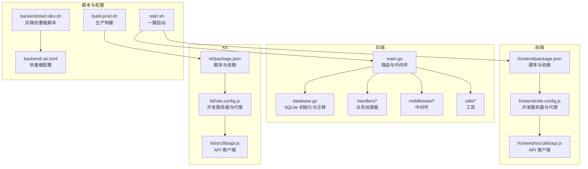
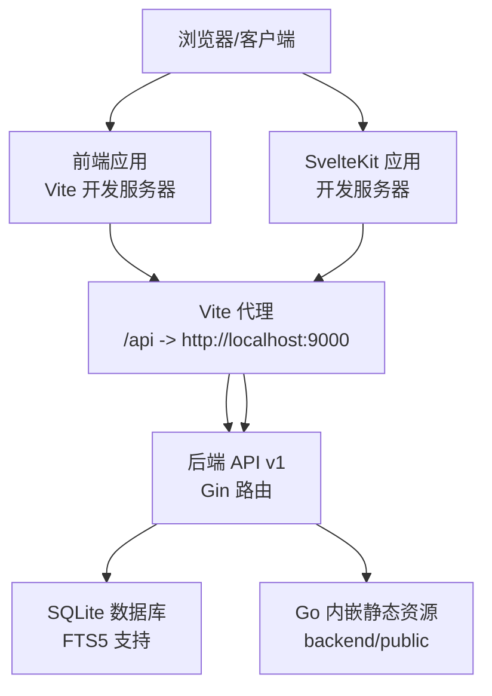
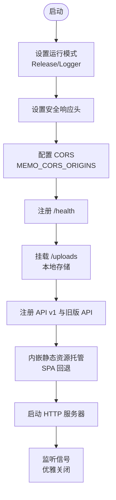
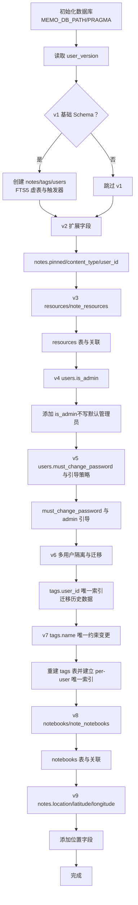
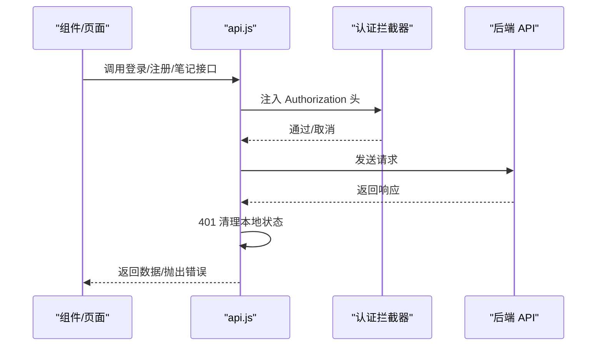
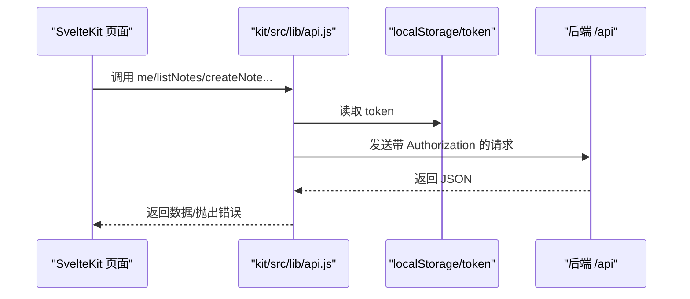
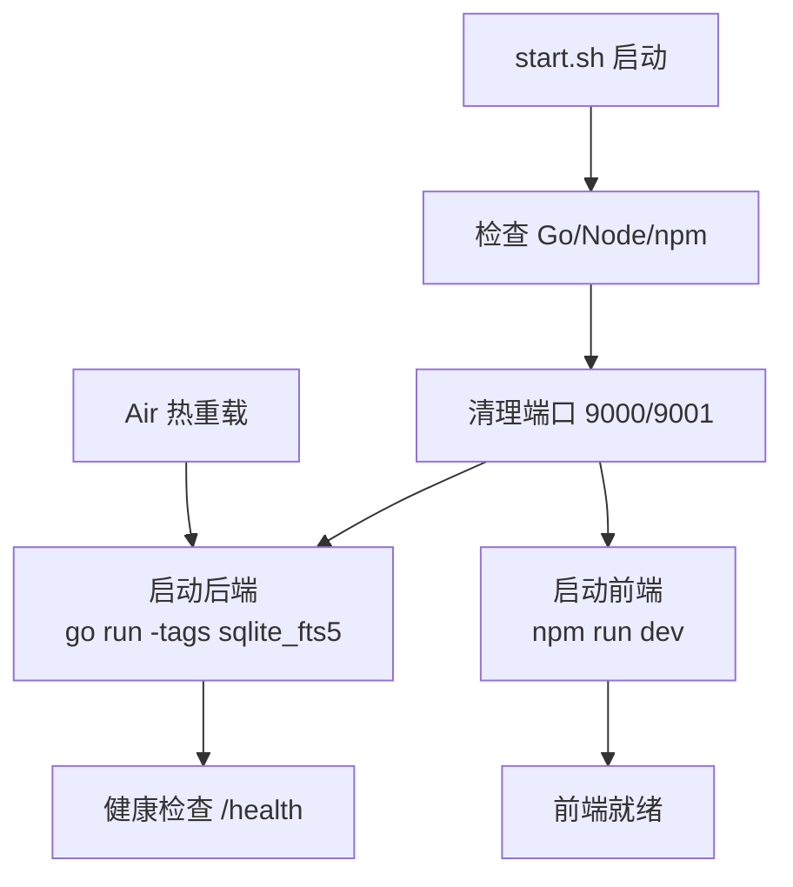
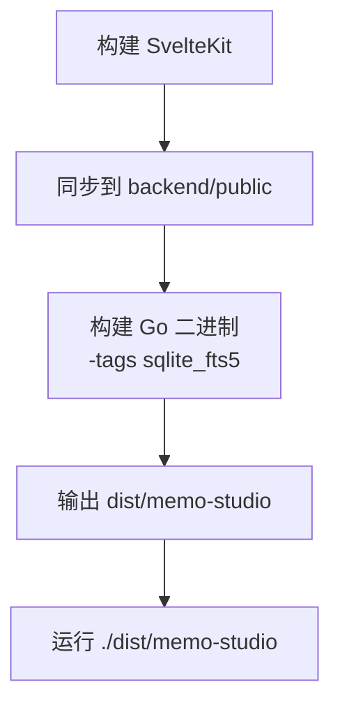
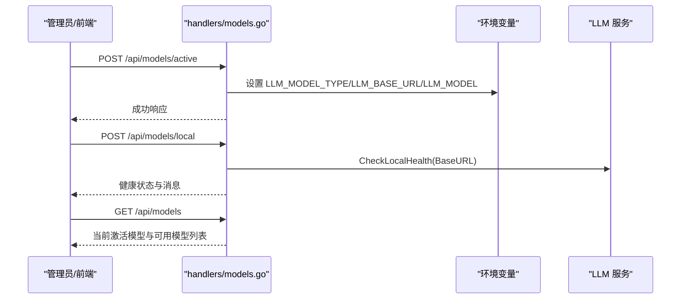
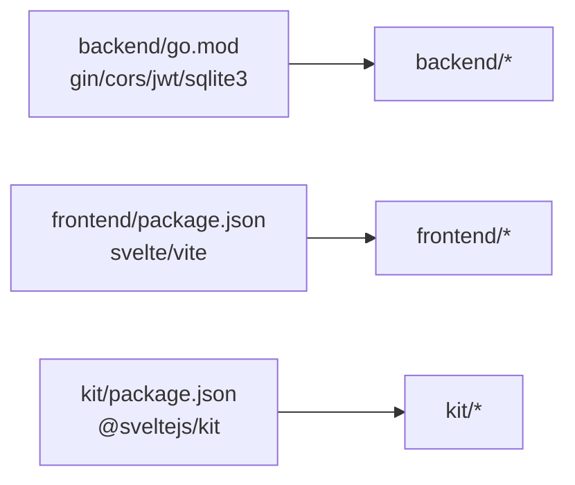

# 开发指南

<cite>
**本文引用的文件**
- [README.md](file://README.md)
- [backend/main.go](file://backend/main.go)
- [backend/database/database.go](file://backend/database/database.go)
- [backend/.air.toml](file://backend/.air.toml)
- [backend/start-dev.sh](file://backend/start-dev.sh)
- [backend/go.mod](file://backend/go.mod)
- [frontend/package.json](file://frontend/package.json)
- [frontend/vite.config.js](file://frontend/vite.config.js)
- [frontend/src/utils/api.js](file://frontend/src/utils/api.js)
- [kit/package.json](file://kit/package.json)
- [kit/vite.config.js](file://kit/vite.config.js)
- [kit/src/lib/api.js](file://kit/src/lib/api.js)
- [build-prod.sh](file://build-prod.sh)
- [start.sh](file://start.sh)
- [backend/handlers/models.go](file://backend/handlers/models.go)
</cite>

## 目录
1. [简介](#简介)
2. [项目结构](#项目结构)
3. [核心组件](#核心组件)
4. [架构总览](#架构总览)
5. [详细组件分析](#详细组件分析)
6. [依赖关系分析](#依赖关系分析)
7. [性能考虑](#性能考虑)
8. [故障排查指南](#故障排查指南)
9. [结论](#结论)
10. [附录](#附录)

## 简介
Memo Studio 是一款前后端分离的笔记应用，采用 Go + Gin + SQLite 作为后端，Svelte + Vite 作为前端，支持响应式设计、明暗主题、标签系统、用户认证、全文检索（FTS5）、AI 洞察与总结、语音转文本、股票分析、位置识别等能力。项目提供一键启动脚本、热重载开发体验、Docker 发布与多架构镜像支持。

## 项目结构
- 后端 backend：Go 应用，包含数据库初始化、路由注册、中间件、处理器与服务集成。
- 前端 frontend：基于 Svelte + Vite 的传统前端应用。
- Kit：新一代 SvelteKit 应用，适配 SPA 架构与静态产物托管。
- 脚本与配置：一键启动、热重载、构建与发布脚本，以及各层配置文件。

**图表来源**
- [backend/main.go](file://backend/main.go#L28-L353)
- [backend/database/database.go](file://backend/database/database.go#L20-L60)
- [frontend/package.json](file://frontend/package.json#L5-L10)
- [frontend/vite.config.js](file://frontend/vite.config.js#L12-L23)
- [kit/package.json](file://kit/package.json#L5-L10)
- [kit/vite.config.js](file://kit/vite.config.js#L6-L14)
- [start.sh](file://start.sh#L92-L210)
- [backend/.air.toml](file://backend/.air.toml#L8-L30)
- [backend/start-dev.sh](file://backend/start-dev.sh#L39-L44)
- [build-prod.sh](file://build-prod.sh#L13-L32)

**章节来源**
- [README.md](file://README.md#L254-L273)
- [start.sh](file://start.sh#L92-L210)

## 核心组件
- 后端入口与路由：负责初始化数据库、配置中间件（CORS、日志、恢复、安全头）、注册 API v1 与旧版 API、静态文件托管与 SPA 回退。
- 数据库模块：集中式初始化、PRAGMA 优化、版本化迁移（含 FTS5、多用户隔离、笔记本、位置字段等）。
- 前端 API 客户端：统一认证头注入、拦截器、错误处理、内容清洗与笔记对象标准化。
- SvelteKit API 客户端：与旧版 API 兼容，提供用户、笔记、标签、资源、统计、导入导出等接口封装。
- 热重载与开发工具：Air 后端热重载、Vite 前端 HMR、开发服务器代理到后端。
- 构建与发布：SvelteKit 构建产物同步至 backend/public，Go 二进制构建并启用 sqlite_fts5。

**章节来源**
- [backend/main.go](file://backend/main.go#L28-L353)
- [backend/database/database.go](file://backend/database/database.go#L20-L60)
- [frontend/src/utils/api.js](file://frontend/src/utils/api.js#L53-L76)
- [kit/src/lib/api.js](file://kit/src/lib/api.js#L17-L33)
- [backend/.air.toml](file://backend/.air.toml#L8-L30)
- [frontend/vite.config.js](file://frontend/vite.config.js#L12-L23)
- [kit/vite.config.js](file://kit/vite.config.js#L6-L14)
- [build-prod.sh](file://build-prod.sh#L13-L32)

## 架构总览
后端采用 Gin 框架，中间件链路包括安全头、CORS、速率限制、鉴权与管理员权限控制；路由分为公开健康检查、公开认证接口与受保护的 v1 API；静态文件通过 Go 内嵌 FS 托管并提供 SPA 回退。前端与 Kit 分别提供不同的开发体验与产物结构，最终通过构建脚本整合为单一 Go 二进制。

**图表来源**
- [frontend/vite.config.js](file://frontend/vite.config.js#L17-L22)
- [kit/vite.config.js](file://kit/vite.config.js#L8-L13)
- [backend/main.go](file://backend/main.go#L82-L196)
- [backend/main.go](file://backend/main.go#L285-L316)

## 详细组件分析

### 后端入口与路由（Gin）
- 初始化模式与日志：生产模式下设置 Release，非 release 模式启用 Logger。
- 安全响应头：X-Content-Type-Options、X-Frame-Options、X-XSS-Protection、X-Robots-Tag。
- CORS：支持 MEMO_CORS_ORIGINS 环境变量白名单，开发默认放开，生产建议配置。
- 静态文件与附件：/uploads 挂载本地存储目录；SPA 回退至 index.html。
- 健康检查：/health。
- API v1：公开认证、用户、笔记、标签、资源、笔记本、统计、导入导出、AI 洞察与总结、位置、股票、管理员等接口。
- 旧版 API 兼容：/api 前缀，逐步迁移至 /api/v1。
- 优雅关闭：信号监听与超时关闭。

**图表来源**
- [backend/main.go](file://backend/main.go#L28-L353)

**章节来源**
- [backend/main.go](file://backend/main.go#L28-L353)

### 数据库初始化与迁移
- 初始化：解析 MEMO_DB_PATH，创建目录，打开 SQLite，设置 PRAGMA（外键、WAL、busy_timeout）。
- 迁移：版本化 schema（v1-v9），包含 notes/tags/users/FTS5、notes 扩展字段、resources/note_resources、users.admin/must_change_password、多用户隔离、tags 唯一约束变更、notebooks/note_notebooks、notes.location/latitude/longitude。
- FTS5：notes_fts 虚表与触发器维护一致性，需构建标签 sqlite_fts5。

**图表来源**
- [backend/database/database.go](file://backend/database/database.go#L20-L60)
- [backend/database/database.go](file://backend/database/database.go#L62-L178)
- [backend/database/database.go](file://backend/database/database.go#L243-L374)
- [backend/database/database.go](file://backend/database/database.go#L376-L406)
- [backend/database/database.go](file://backend/database/database.go#L408-L438)
- [backend/database/database.go](file://backend/database/database.go#L440-L452)
- [backend/database/database.go](file://backend/database/database.go#L454-L540)
- [backend/database/database.go](file://backend/database/database.go#L564-L591)
- [backend/database/database.go](file://backend/database/database.go#L593-L647)
- [backend/database/database.go](file://backend/database/database.go#L180-L209)
- [backend/database/database.go](file://backend/database/database.go#L211-L241)

**章节来源**
- [backend/database/database.go](file://backend/database/database.go#L20-L60)
- [backend/database/database.go](file://backend/database/database.go#L62-L178)

### 前端 API 客户端（fetch 封装）
- 认证拦截器：统一注入 Authorization Bearer，支持拦截器链取消请求。
- 错误处理：401 清理本地 token 与用户信息并触发 auth-expired；404/429/4xx 统一错误消息。
- 内容清洗：cleanContent/cleanNote 规范化 content/title，避免对象字符串化残留。
- API 方法：登录/注册、当前用户、笔记 CRUD、标签 CRUD、合并、搜索等。

**图表来源**
- [frontend/src/utils/api.js](file://frontend/src/utils/api.js#L53-L76)
- [frontend/src/utils/api.js](file://frontend/src/utils/api.js#L115-L310)

**章节来源**
- [frontend/src/utils/api.js](file://frontend/src/utils/api.js#L5-L316)

### SvelteKit API 客户端（兼容旧版 API）
- 统一 fetch：jsonFetch 自动注入 Authorization，处理非 OK 状态与错误。
- 权限控制：requireToken 校验登录状态。
- 接口覆盖：用户、笔记（memos）、标签、资源、笔记本、统计、导入导出、随机复习等。

**图表来源**
- [kit/src/lib/api.js](file://kit/src/lib/api.js#L17-L33)
- [kit/src/lib/api.js](file://kit/src/lib/api.js#L35-L271)

**章节来源**
- [kit/src/lib/api.js](file://kit/src/lib/api.js#L1-L271)

### 热重载与开发工具
- Air 后端热重载：自动安装 Air，构建时启用 sqlite_fts5 标签，排除测试与临时目录，延迟与日志配置。
- Vite 前端 HMR：默认开启，代理 /api 到后端，端口 9001。
- 一键启动：检查环境、安装依赖、启动后端与前端、等待健康检查、自动打开浏览器。

**图表来源**
- [start.sh](file://start.sh#L29-L210)
- [backend/.air.toml](file://backend/.air.toml#L8-L30)
- [backend/start-dev.sh](file://backend/start-dev.sh#L15-L44)
- [frontend/vite.config.js](file://frontend/vite.config.js#L12-L23)
- [kit/vite.config.js](file://kit/vite.config.js#L6-L14)

**章节来源**
- [backend/.air.toml](file://backend/.air.toml#L1-L48)
- [backend/start-dev.sh](file://backend/start-dev.sh#L1-L45)
- [frontend/vite.config.js](file://frontend/vite.config.js#L1-L25)
- [kit/vite.config.js](file://kit/vite.config.js#L1-L16)
- [start.sh](file://start.sh#L1-L238)

### 构建与发布流程
- SvelteKit 构建：在 kit 目录执行 npm install 与 npm run build。
- 同步静态资源：将 kit/build 同步到 backend/public（rsync 或 cp）。
- Go 二进制构建：启用 sqlite_fts5 标签，输出 dist/memo-studio。
- 一键启动生产：./dist/memo-studio，前端静态资源由后端内嵌托管。

**图表来源**
- [build-prod.sh](file://build-prod.sh#L13-L32)
- [backend/main.go](file://backend/main.go#L23-L26)
- [backend/main.go](file://backend/main.go#L285-L316)

**章节来源**
- [build-prod.sh](file://build-prod.sh#L1-L33)
- [backend/main.go](file://backend/main.go#L23-L26)
- [backend/main.go](file://backend/main.go#L285-L316)

### 模型管理与 AI 集成
- 模型配置：支持云端（OpenAI/Claude/DeepSeek/GLM 等）与本地模型（Ollama/LMStudio/LocalAI 等）。
- 环境变量：LLM_MODEL_TYPE、LLM_BASE_URL、LLM_MODEL、LLM_API_KEY、OPENAI_API_KEY 等。
- 接口：获取模型列表、设置当前模型、添加本地模型、健康检查、可用模型检测、连接测试。

**图表来源**
- [backend/handlers/models.go](file://backend/handlers/models.go#L60-L104)
- [backend/handlers/models.go](file://backend/handlers/models.go#L106-L138)
- [backend/handlers/models.go](file://backend/handlers/models.go#L140-L162)
- [backend/handlers/models.go](file://backend/handlers/models.go#L164-L233)

**章节来源**
- [backend/handlers/models.go](file://backend/handlers/models.go#L1-L371)

## 依赖关系分析
- 后端依赖：gin、cors、jwt、sqlite3（含 FTS5）、bcrypt 等。
- 前端依赖：svelte、tailwindcss、vite 插件等。
- Kit 依赖：@sveltejs/kit、@sveltejs/adapter-static、vite 等。

**图表来源**
- [backend/go.mod](file://backend/go.mod#L5-L11)
- [frontend/package.json](file://frontend/package.json#L11-L23)
- [kit/package.json](file://kit/package.json#L11-L17)

**章节来源**
- [backend/go.mod](file://backend/go.mod#L1-L45)
- [frontend/package.json](file://frontend/package.json#L1-L25)
- [kit/package.json](file://kit/package.json#L1-L20)

## 性能考虑
- 数据库优化
  - WAL 模式与 busy_timeout：提升并发写入稳定性。
  - 外键约束：保证引用完整性。
  - FTS5：全文检索加速，注意构建标签 sqlite_fts5。
  - 索引：迁移阶段创建 notebook 与 tag 唯一索引。
- API 层优化
  - 速率限制中间件：防止滥用。
  - 安全头：降低常见攻击面。
  - 静态资源内嵌：减少文件系统 IO，SPA 回退避免 404。
- 前端优化
  - Vite HMR：快速迭代，保持应用状态。
  - 代理 /api：避免跨域与反向代理复杂度。
- 构建优化
  - 生产构建启用 sqlite_fts5，确保全文检索可用。
  - 静态资源同步到 backend/public，Go 运行时直接托管。

**章节来源**
- [backend/database/database.go](file://backend/database/database.go#L45-L52)
- [backend/main.go](file://backend/main.go#L97-L102)
- [backend/main.go](file://backend/main.go#L46-L53)
- [frontend/vite.config.js](file://frontend/vite.config.js#L12-L23)
- [kit/vite.config.js](file://kit/vite.config.js#L6-L14)
- [build-prod.sh](file://build-prod.sh#L26-L28)

## 故障排查指南
- 端口占用
  - 9000/9001 被占用时，启动脚本尝试清理；若失败，使用 lsof/kill 手动处理。
- 依赖安装失败
  - 后端：go mod download 与 go mod tidy；必要时切换 GOPROXY。
  - 前端：删除 node_modules 与 lock 文件后重新安装。
- 数据库问题
  - 删除 notes.db 后重启，数据库会自动重建；检查目录权限。
- 热重载不工作
  - 前端：检查浏览器控制台与 Vite 日志，硬刷新。
  - 后端：确认 Air 安装与 .air.toml 配置，查看构建日志。

**章节来源**
- [start.sh](file://start.sh#L71-L90)
- [start.sh](file://start.sh#L102-L117)
- [start.sh](file://start.sh#L179-L186)
- [backend/start-dev.sh](file://backend/start-dev.sh#L15-L25)
- [backend/.air.toml](file://backend/.air.toml#L38-L48)

## 结论
Memo Studio 提供了清晰的前后端分层、完善的开发与发布工具链、可扩展的数据库迁移机制与安全的 API 设计。通过 Air 热重载与 Vite HMR，开发者可获得高效的迭代体验；通过 sqlite_fts5 与 WAL 模式，系统具备良好的性能与可靠性。建议在生产环境中严格配置 CORS、JWT 与安全头，并定期进行数据库备份与版本迁移验证。

## 附录
- 一键启动与开发
  - macOS/Linux：./start.sh；Windows：start.bat。
  - 开发模式（SvelteKit）：./dev-kit.sh。
  - 后端热重载：backend/start-dev.sh 或 air。
- 生产构建与启动
  - ./build-prod.sh；./start-prod.sh。
- 环境变量与配置
  - MEMO_DB_PATH、MEMO_STORAGE_DIR、MEMO_CORS_ORIGINS、MEMO_JWT_SECRET、GIN_MODE、PORT 等。
  - LLM_* 与 AI 相关环境变量用于模型配置与功能启用。

**章节来源**
- [README.md](file://README.md#L11-L56)
- [README.md](file://README.md#L61-L128)
- [README.md](file://README.md#L129-L144)
- [README.md](file://README.md#L226-L246)
- [build-prod.sh](file://build-prod.sh#L1-L33)
- [start.sh](file://start.sh#L1-L238)