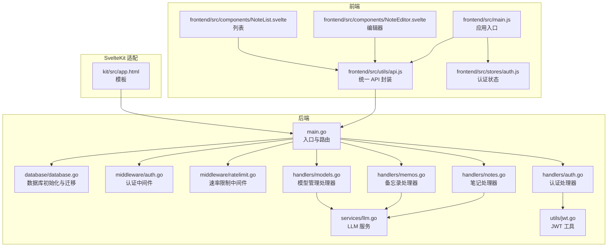
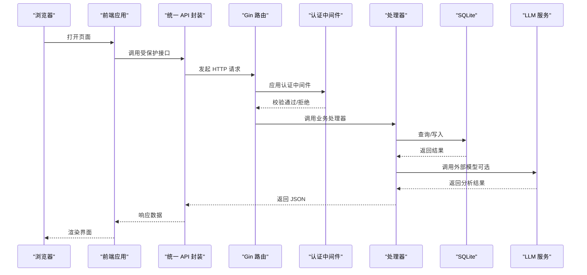
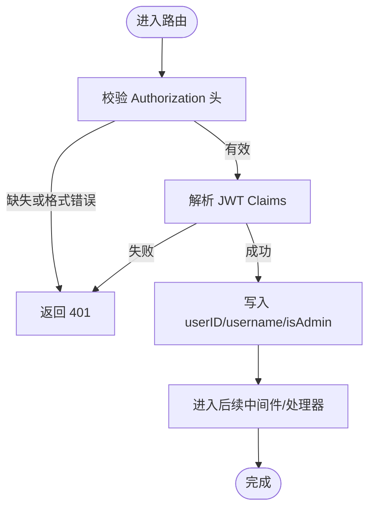
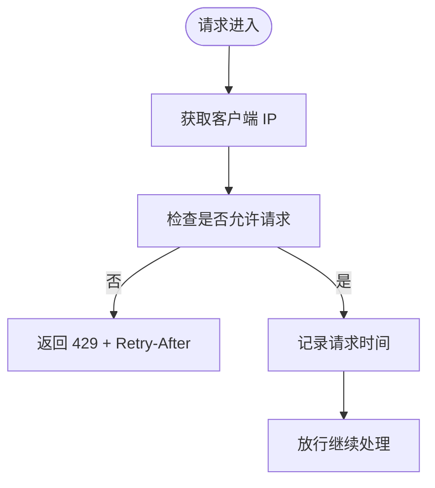
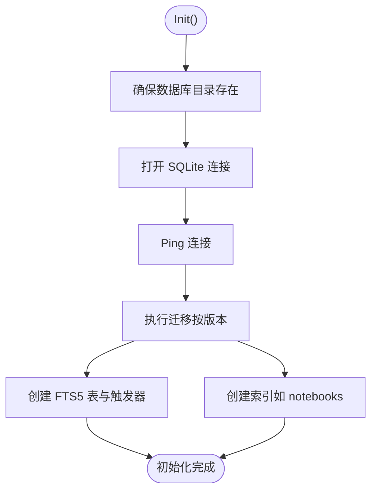
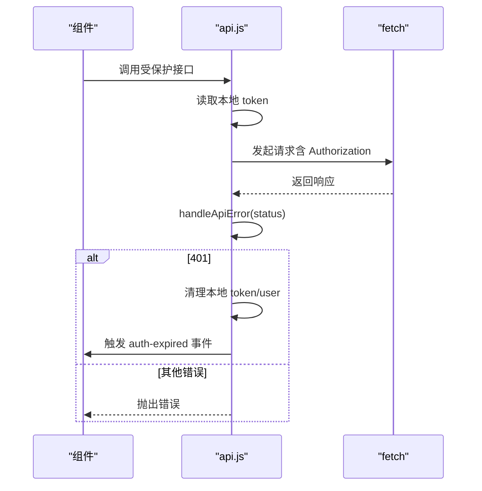
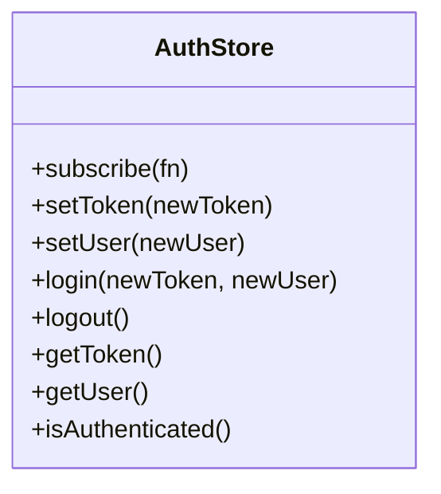
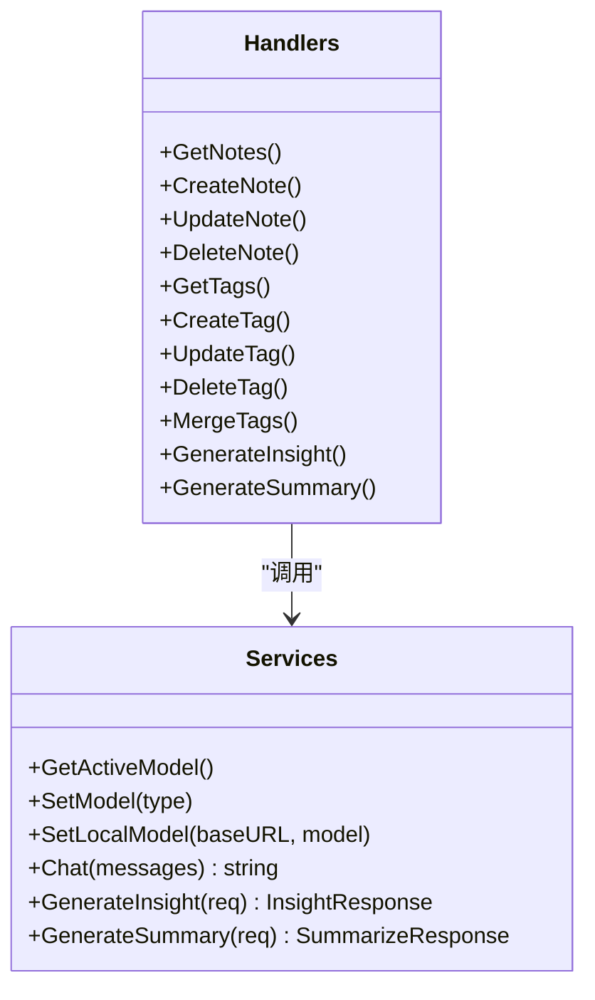
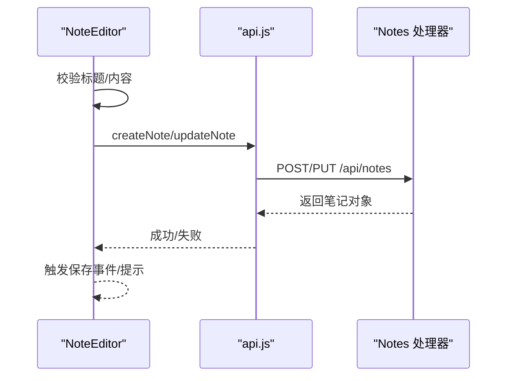
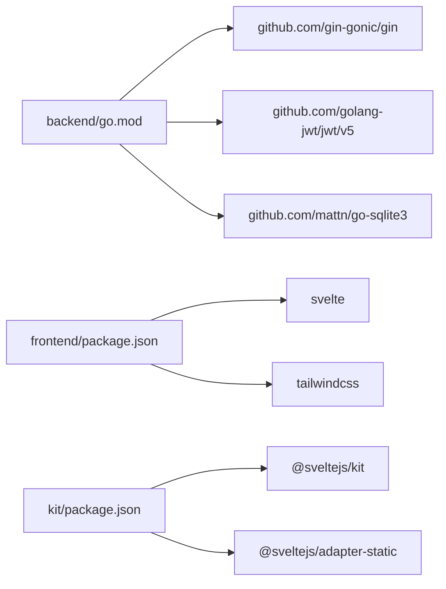

# 开发最佳实践

<cite>
**本文引用的文件**
- [README.md](file://README.md)
- [backend/main.go](file://backend/main.go)
- [backend/go.mod](file://backend/go.mod)
- [backend/database/database.go](file://backend/database/database.go)
- [backend/middleware/auth.go](file://backend/middleware/auth.go)
- [backend/middleware/ratelimit.go](file://backend/middleware/ratelimit.go)
- [backend/utils/jwt.go](file://backend/utils/jwt.go)
- [backend/handlers/auth.go](file://backend/handlers/auth.go)
- [backend/handlers/memos.go](file://backend/handlers/memos.go)
- [backend/handlers/notes.go](file://backend/handlers/notes.go)
- [backend/handlers/models.go](file://backend/handlers/models.go)
- [backend/services/llm.go](file://backend/services/llm.go)
- [frontend/src/main.js](file://frontend/src/main.js)
- [frontend/src/utils/api.js](file://frontend/src/utils/api.js)
- [frontend/src/stores/auth.js](file://frontend/src/stores/auth.js)
- [frontend/src/components/NoteEditor.svelte](file://frontend/src/components/NoteEditor.svelte)
- [frontend/src/components/NoteList.svelte](file://frontend/src/components/NoteList.svelte)
- [kit/src/app.html](file://kit/src/app.html)
- [frontend/package.json](file://frontend/package.json)
- [kit/package.json](file://kit/package.json)
</cite>

## 目录
1. [简介](#简介)
2. [项目结构](#项目结构)
3. [核心组件](#核心组件)
4. [架构总览](#架构总览)
5. [详细组件分析](#详细组件分析)
6. [依赖关系分析](#依赖关系分析)
7. [性能考虑](#性能考虑)
8. [故障排查指南](#故障排查指南)
9. [结论](#结论)
10. [附录](#附录)

## 简介
Memo Studio 是一个前后端分离的笔记应用，采用 Go + Gin + SQLite 作为后端，Svelte + Vite 作为前端，支持响应式设计、明暗主题、标签系统、全文检索、AI 洞察与总结、语音转文本、股票分析等能力。本文档面向开发团队，系统性梳理模块化设计、错误处理、性能优化、测试实践、代码复用与抽象、重构与演进策略以及可维护性设计原则，帮助在迭代过程中保持高质量与可扩展性。

## 项目结构
项目采用多模块组织方式：
- backend：Go 后端服务，包含路由、中间件、处理器、服务层、数据库与工具函数
- frontend：基于 Svelte 的前端应用
- kit：SvelteKit 适配层（静态构建产物由 Go 运行时托管）
- docs：文档与设计说明
- server：遗留 Node.js 服务（兼容旧版本）

图表来源
- [backend/main.go](file://backend/main.go#L28-L353)
- [backend/database/database.go](file://backend/database/database.go#L20-L60)
- [backend/middleware/auth.go](file://backend/middleware/auth.go#L12-L52)
- [backend/middleware/ratelimit.go](file://backend/middleware/ratelimit.go#L11-L121)
- [backend/handlers/auth.go](file://backend/handlers/auth.go#L27-L53)
- [backend/handlers/notes.go](file://backend/handlers/notes.go#L131-L150)
- [backend/handlers/memos.go](file://backend/handlers/memos.go#L78-L137)
- [backend/handlers/models.go](file://backend/handlers/models.go#L164-L233)
- [backend/services/llm.go](file://backend/services/llm.go#L377-L435)
- [backend/utils/jwt.go](file://backend/utils/jwt.go#L29-L49)
- [frontend/src/main.js](file://frontend/src/main.js#L1-L20)
- [frontend/src/utils/api.js](file://frontend/src/utils/api.js#L115-L152)
- [frontend/src/stores/auth.js](file://frontend/src/stores/auth.js#L20-L75)
- [frontend/src/components/NoteEditor.svelte](file://frontend/src/components/NoteEditor.svelte#L66-L109)
- [frontend/src/components/NoteList.svelte](file://frontend/src/components/NoteList.svelte#L39-L57)
- [kit/src/app.html](file://kit/src/app.html#L1-L17)

章节来源
- [README.md](file://README.md#L254-L273)
- [backend/main.go](file://backend/main.go#L28-L353)

## 核心组件
- 路由与中间件：统一健康检查、CORS、安全头、速率限制、认证与鉴权
- 数据层：SQLite 初始化、迁移、索引与 FTS5 全文检索
- 处理器层：认证、笔记、备忘录、标签、资源、AI 洞察与总结、模型管理
- 服务层：LLM 服务抽象，支持云端与本地模型，统一请求构建与响应解析
- 前端：统一 API 封装、认证状态管理、编辑器与列表组件

章节来源
- [backend/main.go](file://backend/main.go#L82-L196)
- [backend/database/database.go](file://backend/database/database.go#L20-L178)
- [backend/middleware/ratelimit.go](file://backend/middleware/ratelimit.go#L96-L121)
- [backend/middleware/auth.go](file://backend/middleware/auth.go#L12-L71)
- [backend/handlers/auth.go](file://backend/handlers/auth.go#L27-L53)
- [backend/handlers/notes.go](file://backend/handlers/notes.go#L131-L150)
- [backend/handlers/memos.go](file://backend/handlers/memos.go#L78-L137)
- [backend/handlers/models.go](file://backend/handlers/models.go#L164-L233)
- [backend/services/llm.go](file://backend/services/llm.go#L377-L435)
- [frontend/src/utils/api.js](file://frontend/src/utils/api.js#L115-L152)
- [frontend/src/stores/auth.js](file://frontend/src/stores/auth.js#L20-L75)

## 架构总览
后端采用 MVC 分层与中间件机制，前端通过统一 API 封装与状态管理与后端交互。SvelteKit 适配层负责静态构建产物托管与 SPA 回退。

图表来源
- [backend/main.go](file://backend/main.go#L94-L196)
- [backend/middleware/auth.go](file://backend/middleware/auth.go#L12-L52)
- [backend/handlers/notes.go](file://backend/handlers/notes.go#L131-L150)
- [backend/database/database.go](file://backend/database/database.go#L20-L60)
- [backend/services/llm.go](file://backend/services/llm.go#L418-L435)
- [frontend/src/utils/api.js](file://frontend/src/utils/api.js#L115-L152)

## 详细组件分析

### 认证与授权中间件
- 认证中间件从 Authorization 头解析 Bearer Token，解析失败直接终止并返回 401
- 管理员权限通过上下文传递并在需要时进行二次校验
- 速率限制中间件按客户端 IP 维度进行限流，超限返回 429 并设置 Retry-After

图表来源
- [backend/middleware/auth.go](file://backend/middleware/auth.go#L12-L52)
- [backend/utils/jwt.go](file://backend/utils/jwt.go#L51-L66)

章节来源
- [backend/middleware/auth.go](file://backend/middleware/auth.go#L12-L71)
- [backend/utils/jwt.go](file://backend/utils/jwt.go#L11-L76)

### 速率限制中间件
- 全局限流器按分钟统计请求次数，超过阈值返回 429
- 通过响应头暴露 X-RateLimit-Limit 与 X-RateLimit-Remaining
- 提供严格限流变体用于更敏感端点

图表来源
- [backend/middleware/ratelimit.go](file://backend/middleware/ratelimit.go#L96-L121)

章节来源
- [backend/middleware/ratelimit.go](file://backend/middleware/ratelimit.go#L83-L143)

### 数据库初始化与迁移
- 初始化时创建数据库目录、打开连接、设置 PRAGMA（外键、WAL、busy_timeout）
- 通过 user_version 控制迁移版本，逐版本升级并维护 FTS5 虚表与触发器
- 支持多用户隔离、标签唯一性变更、笔记本与位置字段等演进

图表来源
- [backend/database/database.go](file://backend/database/database.go#L20-L60)
- [backend/database/database.go](file://backend/database/database.go#L62-L178)

章节来源
- [backend/database/database.go](file://backend/database/database.go#L20-L178)

### 统一 API 封装与错误处理
- 统一封装 fetchWithAuth，自动附加 Authorization 头与拦截器链
- handleApiError 统一处理 401/404/429 与一般错误，401 触发本地认证过期清理与事件
- 提供认证拦截器 add/removeAuthInterceptor 便于扩展

图表来源
- [frontend/src/utils/api.js](file://frontend/src/utils/api.js#L52-L76)
- [frontend/src/utils/api.js](file://frontend/src/utils/api.js#L33-L50)
- [frontend/src/main.js](file://frontend/src/main.js#L8-L17)

章节来源
- [frontend/src/utils/api.js](file://frontend/src/utils/api.js#L1-L316)
- [frontend/src/main.js](file://frontend/src/main.js#L1-L20)

### 前端状态管理与认证
- 认证状态存储于 localStorage，提供订阅机制通知组件更新
- 登录/登出/设置 token/setUser 等原子操作，确保状态与本地存储一致

图表来源
- [frontend/src/stores/auth.js](file://frontend/src/stores/auth.js#L20-L75)

章节来源
- [frontend/src/stores/auth.js](file://frontend/src/stores/auth.js#L1-L80)

### 处理器与服务解耦
- 处理器仅负责参数绑定、校验与调用服务层，返回标准化响应
- 服务层封装外部模型调用细节，统一请求体构建、头部设置与响应解析
- 示例：模型管理处理器与 LLM 服务协作，支持云端与本地模型切换

图表来源
- [backend/handlers/notes.go](file://backend/handlers/notes.go#L131-L150)
- [backend/handlers/models.go](file://backend/handlers/models.go#L164-L233)
- [backend/services/llm.go](file://backend/services/llm.go#L377-L435)

章节来源
- [backend/handlers/notes.go](file://backend/handlers/notes.go#L1-L513)
- [backend/handlers/models.go](file://backend/handlers/models.go#L1-L371)
- [backend/services/llm.go](file://backend/services/llm.go#L1-L641)

### 前端组件与交互
- 编辑器组件负责标题、标签与富文本内容的收集与保存，调用统一 API
- 列表组件支持搜索、标签筛选、视图切换、批量选择与删除，具备加载、错误与空状态处理

图表来源
- [frontend/src/components/NoteEditor.svelte](file://frontend/src/components/NoteEditor.svelte#L66-L109)
- [frontend/src/utils/api.js](file://frontend/src/utils/api.js#L176-L203)
- [backend/handlers/notes.go](file://backend/handlers/notes.go#L175-L230)

章节来源
- [frontend/src/components/NoteEditor.svelte](file://frontend/src/components/NoteEditor.svelte#L1-L280)
- [frontend/src/components/NoteList.svelte](file://frontend/src/components/NoteList.svelte#L1-L507)
- [frontend/src/utils/api.js](file://frontend/src/utils/api.js#L115-L316)
- [backend/handlers/notes.go](file://backend/handlers/notes.go#L131-L296)

## 依赖关系分析
- 后端依赖 Gin、JWT、SQLite 驱动与相关工具库，版本在 go.mod 中声明
- 前端与 SvelteKit 通过 package.json 管理依赖，Vite 提供开发与构建
- SvelteKit 适配层负责静态资源托管与 SPA 回退

图表来源
- [backend/go.mod](file://backend/go.mod#L5-L11)
- [frontend/package.json](file://frontend/package.json#L11-L24)
- [kit/package.json](file://kit/package.json#L11-L17)

章节来源
- [backend/go.mod](file://backend/go.mod#L1-L45)
- [frontend/package.json](file://frontend/package.json#L1-L25)
- [kit/package.json](file://kit/package.json#L1-L20)

## 性能考虑
- 数据库层面
  - 使用 WAL 模式与 busy_timeout 提升并发与锁等待表现
  - 通过 FTS5 虚表与触发器实现全文检索，配合索引提升查询效率
  - 迁移阶段按版本逐步增加索引与列，避免一次性大变更
- 服务层面
  - 速率限制中间件防止突发流量压垮后端
  - LLM 服务设置合理超时（如 120s），避免阻塞请求
- 前端层面
  - 列表组件按需渲染与分组，减少 DOM 重排
  - 统一 API 封装避免重复请求与缓存缺失
  - 本地状态与 localStorage 同步，降低重复网络请求

章节来源
- [backend/database/database.go](file://backend/database/database.go#L45-L52)
- [backend/middleware/ratelimit.go](file://backend/middleware/ratelimit.go#L96-L121)
- [backend/services/llm.go](file://backend/services/llm.go#L469-L470)
- [frontend/src/components/NoteList.svelte](file://frontend/src/components/NoteList.svelte#L414-L502)
- [frontend/src/utils/api.js](file://frontend/src/utils/api.js#L115-L152)

## 故障排查指南
- 端口占用：启动脚本会尝试清理，若失败可通过 lsof/kill 处理
- 依赖安装失败：后端执行 go mod download/tidy，前端清理 node_modules 后重新安装
- 数据库问题：删除 notes.db 后重启服务自动重建
- 热更新不工作：前端检查 Vite 日志与浏览器控制台，后端确认 Air 安装与配置
- 认证过期：前端统一 401 处理逻辑会清理本地 token 并触发 auth-expired 事件

章节来源
- [README.md](file://README.md#L446-L498)
- [frontend/src/utils/api.js](file://frontend/src/utils/api.js#L33-L50)
- [frontend/src/main.js](file://frontend/src/main.js#L8-L17)

## 结论
本项目在架构上实现了清晰的分层与职责分离，通过中间件统一处理安全与限流，通过服务层抽象外部能力，通过统一 API 封装与状态管理提升前端可维护性。建议在后续迭代中持续完善测试覆盖、增强可观测性与监控告警，并保持接口版本化与向后兼容策略，以支撑长期演进。

## 附录
- 开发与部署参考：一键启动脚本、Docker 部署、SvelteKit 静态构建与回退
- API 文档：认证、笔记、标签、AI 洞察与总结、模型管理等端点说明

章节来源
- [README.md](file://README.md#L11-L128)
- [README.md](file://README.md#L297-L368)
- [backend/main.go](file://backend/main.go#L285-L316)