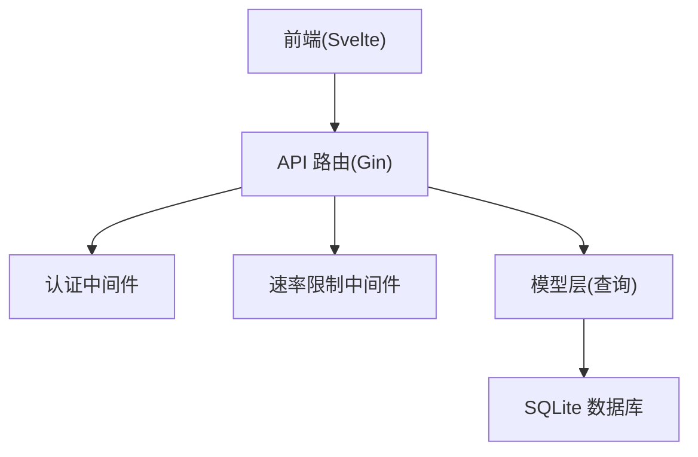
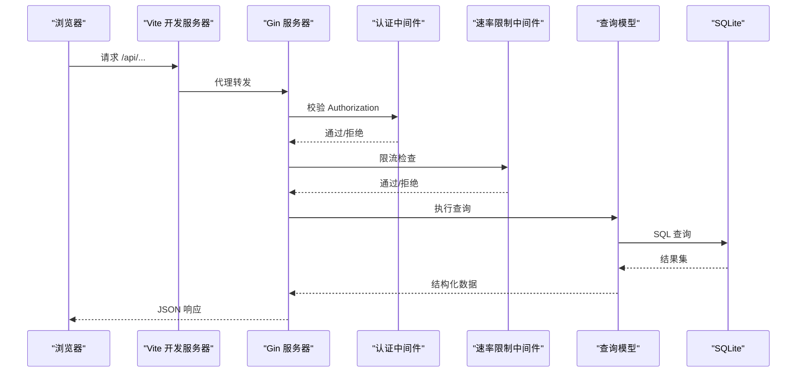
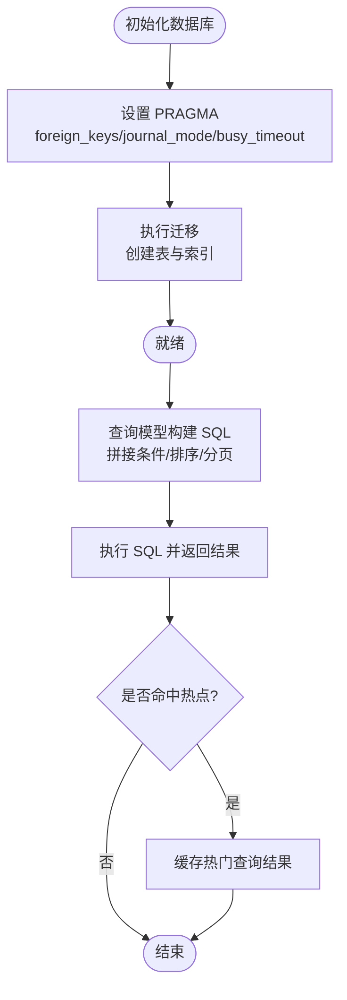
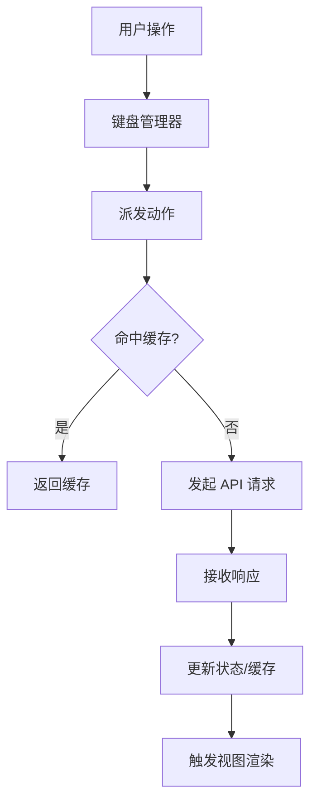
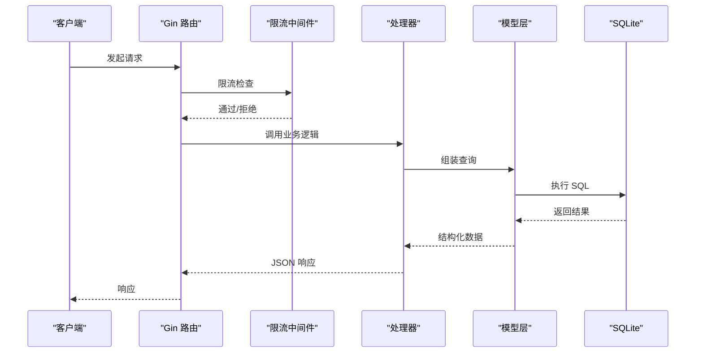
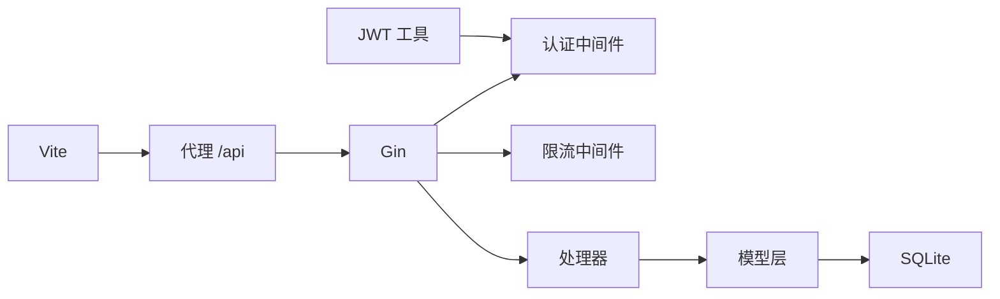

# 性能优化

<cite>
**本文引用的文件**
- [backend/main.go](file://backend/main.go)
- [backend/database/database.go](file://backend/database/database.go)
- [backend/models/memo_query.go](file://backend/models/memo_query.go)
- [backend/handlers/memos.go](file://backend/handlers/memos.go)
- [backend/handlers/search.go](file://backend/handlers/search.go)
- [backend/middleware/ratelimit.go](file://backend/middleware/ratelimit.go)
- [backend/middleware/auth.go](file://backend/middleware/auth.go)
- [backend/utils/jwt.go](file://backend/utils/jwt.go)
- [frontend/src/utils/api.js](file://frontend/src/utils/api.js)
- [frontend/src/stores/auth.js](file://frontend/src/stores/auth.js)
- [frontend/src/App.svelte](file://frontend/src/App.svelte)
- [frontend/vite.config.js](file://frontend/vite.config.js)
- [backend/go.mod](file://backend/go.mod)
</cite>

## 目录
1. [简介](#简介)
2. [项目结构](#项目结构)
3. [核心组件](#核心组件)
4. [架构总览](#架构总览)
5. [详细组件分析](#详细组件分析)
6. [依赖关系分析](#依赖关系分析)
7. [性能考量](#性能考量)
8. [故障排查指南](#故障排查指南)
9. [结论](#结论)
10. [附录](#附录)

## 简介
本指南面向 Memo Studio 的性能优化，围绕数据库、前端、API、缓存、并发与异步处理、内存管理与监控等方面，结合现有代码实现，给出可落地的优化策略与最佳实践。目标是在不牺牲功能与安全性的前提下，提升系统吞吐、降低延迟、改善用户体验。

## 项目结构
- 后端采用 Go + Gin，SQLite 作为持久化存储，提供 REST API。
- 前端采用 Svelte + Vite，开发时通过代理转发 /api 到后端。
- 中间件负责认证、速率限制等横切能力。
- 模型层封装查询逻辑，支持分页、全文检索、标签过滤等。

图表来源
- [backend/main.go](file://backend/main.go#L94-L196)
- [backend/middleware/auth.go](file://backend/middleware/auth.go#L12-L52)
- [backend/middleware/ratelimit.go](file://backend/middleware/ratelimit.go#L96-L121)
- [backend/models/memo_query.go](file://backend/models/memo_query.go#L24-L152)
- [backend/database/database.go](file://backend/database/database.go#L35-L60)

章节来源
- [backend/main.go](file://backend/main.go#L28-L353)
- [frontend/vite.config.js](file://frontend/vite.config.js#L17-L23)

## 核心组件
- 服务器与路由：Gin 路由、CORS、静态文件托管、SPA 回退。
- 数据库：SQLite 初始化、PRAGMA 设置、迁移与索引。
- 查询模型：分页、全文检索、标签过滤、排序与去重。
- 中间件：认证、管理员权限、速率限制。
- 前端 API：统一 fetch、鉴权头注入、错误处理、限流提示。
- 构建与开发：Vite 代理、端口与热更新。

章节来源
- [backend/main.go](file://backend/main.go#L94-L196)
- [backend/database/database.go](file://backend/database/database.go#L21-L60)
- [backend/models/memo_query.go](file://backend/models/memo_query.go#L24-L152)
- [backend/middleware/auth.go](file://backend/middleware/auth.go#L12-L71)
- [backend/middleware/ratelimit.go](file://backend/middleware/ratelimit.go#L96-L143)
- [frontend/src/utils/api.js](file://frontend/src/utils/api.js#L53-L76)
- [frontend/vite.config.js](file://frontend/vite.config.js#L17-L23)

## 架构总览
后端以 Gin 为核心，通过中间件链路完成认证与限流，模型层负责复杂查询，数据库采用 SQLite 并启用 WAL、超时与外键约束。前端通过 Vite 代理访问后端 API，统一处理鉴权与错误。

图表来源
- [backend/main.go](file://backend/main.go#L94-L196)
- [backend/middleware/auth.go](file://backend/middleware/auth.go#L12-L52)
- [backend/middleware/ratelimit.go](file://backend/middleware/ratelimit.go#L96-L143)
- [backend/models/memo_query.go](file://backend/models/memo_query.go#L24-L152)
- [backend/database/database.go](file://backend/database/database.go#L35-L60)

## 详细组件分析

### 数据库性能优化
- 连接与模式
  - 初始化时启用外键约束、WAL 模式、忙等待超时，有助于并发写入与一致性。
  - 建议：在生产环境固定数据库路径与权限，确保 WAL 文件与共享内存区域可写。
- 索引与查询
  - 迁移中为 notebooks.user_id 与 note_notebooks.notebook_id 建立索引，有利于按用户与笔记本查询。
  - 查询模型对标签、时间范围、置顶、类型进行条件拼接，注意避免全表扫描。
  - 建议：为 notes.user_id、notes.created_at、tags.name、note_tags(tag_id) 等常用过滤列建立复合索引；对全文检索使用 FTS5 并在高并发场景考虑预热与缓存热门查询结果。
- 连接池配置
  - 当前使用 sql.DB 默认池大小与生命周期；建议根据 QPS 与并发写入量调优最大连接数、空闲连接数与连接生命周期。
- 事务管理
  - 对批量写入（如导入、标签合并）使用事务包裹，减少提交次数；对只读查询尽量短事务，避免长事务阻塞。

图表来源
- [backend/database/database.go](file://backend/database/database.go#L45-L60)
- [backend/database/database.go](file://backend/database/database.go#L180-L209)
- [backend/models/memo_query.go](file://backend/models/memo_query.go#L24-L152)

章节来源
- [backend/database/database.go](file://backend/database/database.go#L21-L60)
- [backend/database/database.go](file://backend/database/database.go#L180-L209)
- [backend/models/memo_query.go](file://backend/models/memo_query.go#L24-L152)

### 前端性能优化策略
- 组件懒加载与按需渲染
  - 列表与详情视图通过 Svelte 的条件渲染与 key 变化驱动重渲染，减少不必要的组件重建。
  - 建议：对重型组件（如富文本编辑器）采用动态 import 懒加载，仅在需要时加载。
- 虚拟滚动
  - 列表组件可通过虚拟滚动减少 DOM 节点数量，提升长列表滚动性能。
- 图片优化
  - 上传资源建议在后端生成缩略图与多尺寸版本，前端按设备像素比选择合适尺寸。
- 缓存策略
  - 前端 API 层已具备统一错误处理与 429 限流提示；建议在应用层增加 GET 请求的内存缓存与失效策略，避免重复请求相同查询。
- 交互与键盘管理
  - 键盘管理器集中处理快捷键，减少重复事件监听与 DOM 查询。

图表来源
- [frontend/src/App.svelte](file://frontend/src/App.svelte#L109-L175)
- [frontend/src/utils/api.js](file://frontend/src/utils/api.js#L33-L50)

章节来源
- [frontend/src/App.svelte](file://frontend/src/App.svelte#L1-L328)
- [frontend/src/utils/api.js](file://frontend/src/utils/api.js#L1-L316)
- [frontend/vite.config.js](file://frontend/vite.config.js#L17-L23)

### 内存管理最佳实践
- 垃圾回收与资源释放
  - 后端：确保数据库连接与 rows 正确 Close；避免在循环中累积大对象；对高频字符串拼接使用 bytes.Buffer。
  - 前端：及时清理事件监听、定时器与订阅；对大列表使用虚拟滚动与分页；避免在组件销毁后仍持有引用。
- 内存泄漏检测
  - 后端：使用 pprof 分析 CPU 与内存热点；对长时间运行的任务进行周期性 GC 触发与堆快照对比。
  - 前端：使用浏览器性能面板与内存快照定位泄漏；对动态组件与事件监听进行生命周期管理。

章节来源
- [backend/models/memo_query.go](file://backend/models/memo_query.go#L113-L114)
- [backend/database/database.go](file://backend/database/database.go#L35-L38)

### API 性能优化
- 请求合并与批处理
  - 批量删除接口支持数组参数，减少往返次数；建议对写操作（创建/更新/删除）提供批量端点。
- 响应缓存
  - 对只读列表与搜索结果增加内存缓存；为不同用户与标签组合设置独立缓存键；设置 TTL 与失效策略。
- 限流策略
  - 全局速率限制器按 IP 维度计数，建议区分登录与匿名用户、不同端点的配额；对管理员与白名单放行。
- 超时处理
  - 为数据库查询设置合理超时；对上游服务（如语音转写）设置独立超时与重试。

图表来源
- [backend/middleware/ratelimit.go](file://backend/middleware/ratelimit.go#L96-L143)
- [backend/handlers/memos.go](file://backend/handlers/memos.go#L78-L137)
- [backend/models/memo_query.go](file://backend/models/memo_query.go#L24-L152)

章节来源
- [backend/middleware/ratelimit.go](file://backend/middleware/ratelimit.go#L1-L143)
- [backend/handlers/memos.go](file://backend/handlers/memos.go#L78-L137)
- [backend/handlers/search.go](file://backend/handlers/search.go#L13-L45)

### 缓存策略设计
- 多级缓存
  - 应用内缓存：短期热点数据（最近查询、热门标签、用户信息）。
  - 前端缓存：GET 请求结果缓存与失效；离线场景可考虑 Service Worker。
- 缓存失效
  - 基于时间（TTL）与基于事件（写操作后主动失效）结合；对标签与笔记本变更触发相关缓存清理。
- 一致性保证
  - 读写分离：写操作直达数据库并更新缓存；读操作优先命中缓存，未命中回源并回填缓存。

章节来源
- [frontend/src/utils/api.js](file://frontend/src/utils/api.js#L33-L50)
- [frontend/src/stores/auth.js](file://frontend/src/stores/auth.js#L1-L80)

### 并发与异步处理优化
- Goroutine 管理
  - 使用带缓冲 channel 控制并发度；对耗时任务（导入、转录）使用 worker 池与队列。
- Channel 使用
  - 以 channel 传递任务与结果，避免共享可变状态；对批量任务使用 fan-in/fan-out 模式。
- 锁优化
  - 减少全局锁粒度，使用 RWMutex；对热点数据采用无锁结构（如原子计数）或读写分离。

章节来源
- [backend/middleware/ratelimit.go](file://backend/middleware/ratelimit.go#L11-L17)

## 依赖关系分析
- 后端模块依赖
  - Gin、JWT、SQLite3、bcrypt 等第三方库。
  - 中间件依赖模型与工具模块；处理器依赖中间件与模型。
- 前端依赖
  - Svelte、Vite、浏览器原生 fetch；通过代理访问后端 API。

图表来源
- [backend/go.mod](file://backend/go.mod#L5-L11)
- [backend/main.go](file://backend/main.go#L94-L196)
- [backend/middleware/auth.go](file://backend/middleware/auth.go#L12-L52)
- [backend/middleware/ratelimit.go](file://backend/middleware/ratelimit.go#L96-L143)
- [frontend/vite.config.js](file://frontend/vite.config.js#L17-L23)

章节来源
- [backend/go.mod](file://backend/go.mod#L1-L45)
- [backend/main.go](file://backend/main.go#L94-L196)

## 性能考量
- 数据库
  - WAL 模式提升并发写入；busy_timeout 避免“database is locked”；外键约束保障一致性。
  - 建议：为高频过滤列建立复合索引；对全文检索使用 FTS5 并配合 bm25 排序。
- 查询与分页
  - 限制每页最大条数（当前默认 50，上限 200）；避免一次性拉取大量数据。
  - 标签过滤时使用 DISTINCT 避免重复行。
- 中间件
  - 认证与限流在路由层统一生效，减少重复逻辑；严格限流可防止突发流量击垮后端。
- 前端
  - 统一错误处理与限流提示；建议引入请求去抖与节流；对长列表使用虚拟滚动。
- API
  - 批量端点减少往返；对只读接口增加缓存；为写操作设置幂等键与重试策略。

章节来源
- [backend/database/database.go](file://backend/database/database.go#L45-L60)
- [backend/models/memo_query.go](file://backend/models/memo_query.go#L24-L152)
- [backend/middleware/ratelimit.go](file://backend/middleware/ratelimit.go#L96-L143)
- [frontend/src/utils/api.js](file://frontend/src/utils/api.js#L33-L50)

## 故障排查指南
- 速率限制
  - 检查 X-RateLimit-* 响应头与 Retry-After；确认限流阈值与时间窗口是否合理。
- 认证失败
  - 核对 Authorization 头格式与 JWT 有效性；确认密钥一致与过期时间。
- 数据库连接
  - 检查 busy_timeout 与 WAL 配置；避免长时间事务与未关闭的 rows。
- 前端错误
  - 401 自动登出；429 提示限流；检查本地存储 token 与用户信息。

章节来源
- [backend/middleware/ratelimit.go](file://backend/middleware/ratelimit.go#L104-L120)
- [backend/middleware/auth.go](file://backend/middleware/auth.go#L12-L52)
- [backend/utils/jwt.go](file://backend/utils/jwt.go#L52-L66)
- [frontend/src/utils/api.js](file://frontend/src/utils/api.js#L33-L50)

## 结论
通过合理的数据库索引与查询优化、中间件限流与认证、前端缓存与懒加载、以及并发与异步处理的改进，Memo Studio 可在保证功能与安全的前提下显著提升性能与稳定性。建议在生产环境中持续监控关键指标，迭代优化热点路径与缓存策略。

## 附录
- 环境变量与配置要点
  - JWT 密钥、CORS 白名单、数据库路径、存储目录、端口等。
- 监控与基准
  - 建议采集 QPS、P95/P99 延迟、数据库锁等待、内存与 GC 指标、前端首屏与交互延迟。