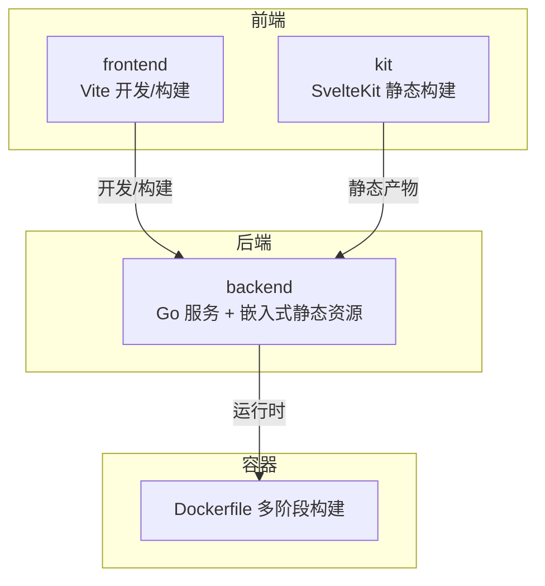
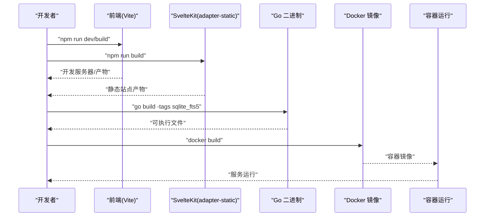
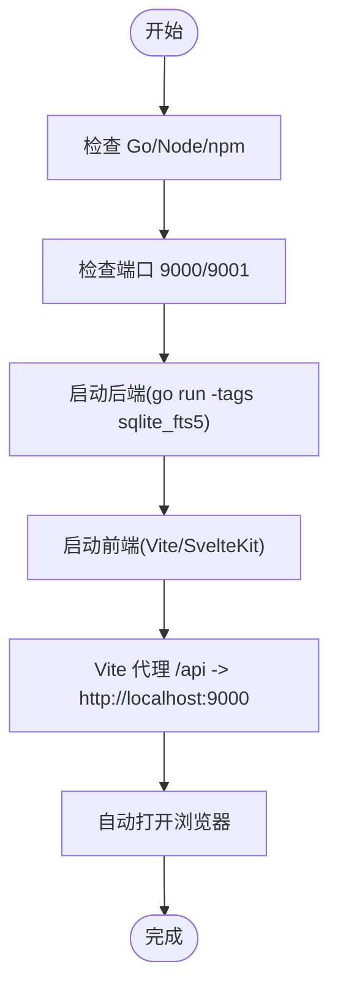
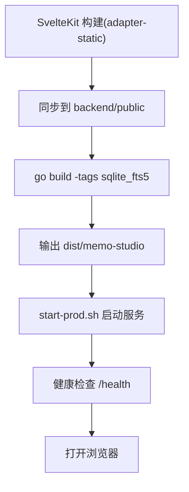
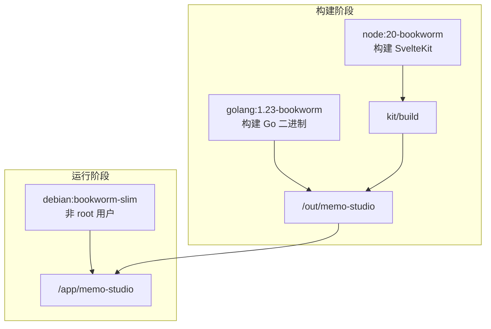
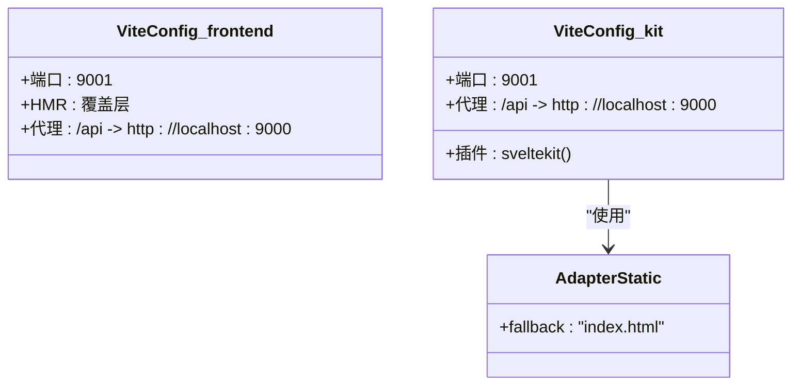
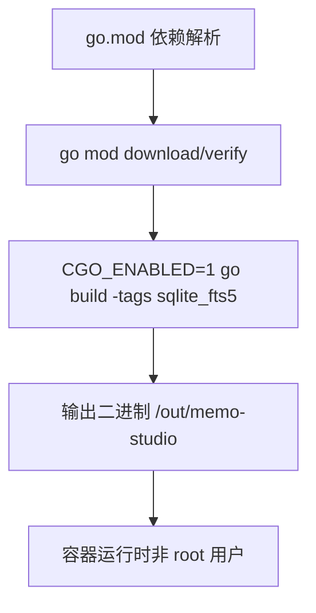
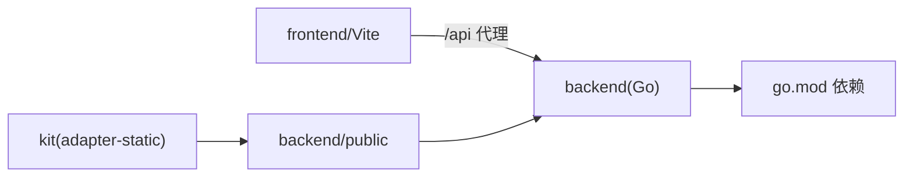

# 构建与打包

<cite>
**本文引用的文件**
- [package.json](file://package.json)
- [frontend/package.json](file://frontend/package.json)
- [kit/package.json](file://kit/package.json)
- [backend/go.mod](file://backend/go.mod)
- [Dockerfile](file://Dockerfile)
- [docker-compose.yml](file://docker-compose.yml)
- [build-prod.sh](file://build-prod.sh)
- [start-prod.sh](file://start-prod.sh)
- [frontend/vite.config.js](file://frontend/vite.config.js)
- [kit/vite.config.js](file://kit/vite.config.js)
- [frontend/svelte.config.js](file://frontend/svelte.config.js)
- [kit/svelte.config.js](file://kit/svelte.config.js)
- [backend/main.go](file://backend/main.go)
- [backend/.air.toml](file://backend/.air.toml)
- [start.sh](file://start.sh)
- [dev-kit.sh](file://dev-kit.sh)
</cite>

## 目录
1. [简介](#简介)
2. [项目结构](#项目结构)
3. [核心组件](#核心组件)
4. [架构总览](#架构总览)
5. [详细组件分析](#详细组件分析)
6. [依赖关系分析](#依赖关系分析)
7. [性能考量](#性能考量)
8. [故障排查指南](#故障排查指南)
9. [结论](#结论)
10. [附录](#附录)

## 简介
本文件面向 Memo Studio 的构建与打包流程，覆盖以下主题：
- 开发环境构建：依赖安装、环境变量配置、开发服务器启动
- 生产环境构建：代码压缩、资源优化、静态文件生成
- Docker 容器化：多阶段构建、镜像优化、安全配置
- 前端构建配置：Vite 配置、代码分割、资源加载
- 后端构建流程：Go 构建参数、CGO 设置、交叉编译
- 构建产物分析：体积分析、依赖检查、安全扫描
- 持续集成构建：自动化测试、构建流水线、发布策略

## 项目结构
项目采用前后端分离与容器化部署的组织方式：
- 前端（传统 Svelte 应用）位于 frontend 目录，使用 Vite 进行开发与构建
- 前端（SvelteKit 静态站点）位于 kit 目录，使用 adapter-static 输出纯静态站点
- 后端位于 backend 目录，使用 Go 编写，内置嵌入式静态资源并提供 API
- 容器化通过 Dockerfile 多阶段构建，将 SvelteKit 静态产物注入后端二进制

图表来源
- [frontend/vite.config.js](file://frontend/vite.config.js#L1-L25)
- [kit/vite.config.js](file://kit/vite.config.js#L1-L16)
- [backend/main.go](file://backend/main.go#L23-L27)
- [Dockerfile](file://Dockerfile#L1-L81)

章节来源
- [frontend/package.json](file://frontend/package.json#L1-L25)
- [kit/package.json](file://kit/package.json#L1-L20)
- [backend/go.mod](file://backend/go.mod#L1-L45)

## 核心组件
- 前端（传统 Svelte）：使用 Vite 开发服务器与构建，支持热更新与代理后端 API
- 前端（SvelteKit）：使用 adapter-static 输出纯静态站点，便于 Go 内嵌与回退
- 后端（Go）：内置 Gin 路由、SQLite 访问、JWT 鉴权、CORS、健康检查与静态文件回退
- 容器（Docker）：多阶段构建，包含安全加固与非 root 用户运行

章节来源
- [frontend/vite.config.js](file://frontend/vite.config.js#L1-L25)
- [kit/svelte.config.js](file://kit/svelte.config.js#L1-L22)
- [backend/main.go](file://backend/main.go#L28-L353)
- [Dockerfile](file://Dockerfile#L1-L81)

## 架构总览
下图展示从开发到生产的整体流程：前端构建 → 同步静态资源 → Go 二进制构建 → 容器镜像构建与运行。

图表来源
- [frontend/vite.config.js](file://frontend/vite.config.js#L1-L25)
- [kit/svelte.config.js](file://kit/svelte.config.js#L1-L22)
- [build-prod.sh](file://build-prod.sh#L13-L28)
- [Dockerfile](file://Dockerfile#L1-L81)

## 详细组件分析

### 开发环境构建
- 依赖安装
  - 前端：frontend 与 kit 目录分别安装依赖
  - 后端：backend 目录通过 go mod 管理依赖
- 环境变量配置
  - 后端：GIN_MODE、PORT、MEMO_DB_PATH、MEMO_STORAGE_DIR、MEMO_CORS_ORIGINS、MEMO_JWT_SECRET、MEMO_ENV
  - 前端：Vite 代理到后端 /api，端口 9001
- 开发服务器启动
  - 一键启动脚本 start.sh 同时启动后端与前端，并自动打开浏览器
  - SvelteKit 开发脚本 dev-kit.sh 启动后端与 SvelteKit 开发服务器

图表来源
- [start.sh](file://start.sh#L29-L47)
- [dev-kit.sh](file://dev-kit.sh#L39-L41)
- [frontend/vite.config.js](file://frontend/vite.config.js#L17-L22)
- [kit/vite.config.js](file://kit/vite.config.js#L8-L13)

章节来源
- [start.sh](file://start.sh#L29-L47)
- [dev-kit.sh](file://dev-kit.sh#L39-L41)
- [frontend/vite.config.js](file://frontend/vite.config.js#L1-L25)
- [kit/vite.config.js](file://kit/vite.config.js#L1-L16)

### 生产环境构建
- 前端静态产物生成
  - SvelteKit 使用 adapter-static 输出纯静态站点，回退至 index.html
  - 产物同步到 backend/public，供 Go 内嵌
- Go 二进制构建
  - 启用 sqlite_fts5 标签，CGO_ENABLED=1
  - 产物输出到 dist/memo-studio
- 启动与访问
  - start-prod.sh 自动检测并构建，随后启动服务并在健康检查通过后打开浏览器

图表来源
- [kit/svelte.config.js](file://kit/svelte.config.js#L13-L16)
- [build-prod.sh](file://build-prod.sh#L13-L28)
- [start-prod.sh](file://start-prod.sh#L13-L16)

章节来源
- [kit/svelte.config.js](file://kit/svelte.config.js#L1-L22)
- [build-prod.sh](file://build-prod.sh#L1-L33)
- [start-prod.sh](file://start-prod.sh#L1-L63)

### Docker 容器化构建
- 多阶段构建
  - 第一阶段：Node 构建 SvelteKit 静态站点
  - 第二阶段：Go 构建二进制，复制静态产物到 backend/public
  - 第三阶段：Debian slim 运行时，非 root 用户，健康检查
- 镜像优化
  - 分层缓存：先复制 go.mod/go.sum 再复制源码
  - 安全加固：apt 升级、ca-certificates、tzdata、健康检查
- 安全配置
  - 非 root 用户运行（UID 10001）
  - 环境变量默认值（GIN_MODE、PORT、数据库与存储路径）
  - CORS 与安全响应头在后端实现

图表来源
- [Dockerfile](file://Dockerfile#L1-L81)
- [docker-compose.yml](file://docker-compose.yml#L1-L25)

章节来源
- [Dockerfile](file://Dockerfile#L1-L81)
- [docker-compose.yml](file://docker-compose.yml#L1-L25)

### 前端构建配置
- Vite 配置
  - frontend：端口 9001，HMR 覆盖层，/api 代理到后端
  - kit：SvelteKit 插件，端口 9001，/api 代理到后端
- 代码分割与资源加载
  - SvelteKit adapter-static 输出静态站点，SPA 回退至 index.html
  - 前端资源通过 Go 嵌入的 public 目录提供
- Svelte 编译选项
  - CSS 注入策略与 a11y 警告过滤

图表来源
- [frontend/vite.config.js](file://frontend/vite.config.js#L1-L25)
- [kit/vite.config.js](file://kit/vite.config.js#L1-L16)
- [kit/svelte.config.js](file://kit/svelte.config.js#L13-L16)

章节来源
- [frontend/vite.config.js](file://frontend/vite.config.js#L1-L25)
- [kit/vite.config.js](file://kit/vite.config.js#L1-L16)
- [frontend/svelte.config.js](file://frontend/svelte.config.js#L1-L11)
- [kit/svelte.config.js](file://kit/svelte.config.js#L1-L22)

### 后端构建流程
- Go 版本与模块
  - go.mod 指定 Go 版本与依赖，间接依赖较多（含加密、JSON、网络等）
- 构建参数
  - sqlite_fts5 标签启用 SQLite 全文搜索
  - CGO_ENABLED=1 支持 sqlite3 的 CGO 功能
- 交叉编译
  - Dockerfile 中使用 golang:1.23-bookworm 构建，可在不同平台通过 Docker 多阶段构建实现
- 运行时行为
  - Gin 模式根据 GIN_MODE 与 MEMO_ENV 设置
  - CORS 可按 MEMO_CORS_ORIGINS 动态配置
  - 静态文件通过 go:embed 嵌入，NoRoute 回退到 index.html

图表来源
- [backend/go.mod](file://backend/go.mod#L1-L45)
- [Dockerfile](file://Dockerfile#L44-L45)
- [Dockerfile](file://Dockerfile#L58-L66)

章节来源
- [backend/go.mod](file://backend/go.mod#L1-L45)
- [Dockerfile](file://Dockerfile#L14-L46)
- [backend/main.go](file://backend/main.go#L28-L353)

### 构建产物分析
- 体积分析
  - SvelteKit 静态产物位于 kit/build，通过同步脚本进入 backend/public
  - 生产构建脚本输出 dist/memo-studio
- 依赖检查
  - Go 依赖通过 go.mod/go.sum 管理，Docker 构建阶段进行下载与校验
- 安全扫描
  - Dockerfile 在构建与运行阶段均执行 apt 升级与安装 ca-certificates、tzdata
  - 建议在 CI 中增加 gosec、gosec、trivy 等扫描步骤（概念性建议）

章节来源
- [build-prod.sh](file://build-prod.sh#L13-L28)
- [Dockerfile](file://Dockerfile#L4-L8)
- [Dockerfile](file://Dockerfile#L50-L55)

### 持续集成构建流程
- 自动化测试
  - 前端与 kit 目录均提供 test 脚本（node --test），可在 CI 中执行
- 构建流水线
  - Docker 多阶段构建统一产物，便于在 CI 中缓存依赖层
- 发布策略
  - docker-compose.yml 提供本地与生产环境示例，建议在 CI 中输出镜像并推送仓库

章节来源
- [frontend/package.json](file://frontend/package.json#L8-L8)
- [kit/package.json](file://kit/package.json#L8-L8)
- [docker-compose.yml](file://docker-compose.yml#L1-L25)

## 依赖关系分析
- 前端到后端
  - 前端通过 /api 代理访问后端接口，开发与生产一致
- 前端到 Go
  - SvelteKit 静态产物注入 backend/public，Go 通过 go:embed 嵌入
- Go 依赖
  - Gin、JWT、SQLite、加密与网络相关库，间接依赖较多

图表来源
- [frontend/vite.config.js](file://frontend/vite.config.js#L17-L22)
- [kit/svelte.config.js](file://kit/svelte.config.js#L13-L16)
- [backend/main.go](file://backend/main.go#L23-L27)
- [backend/go.mod](file://backend/go.mod#L1-L45)

章节来源
- [frontend/vite.config.js](file://frontend/vite.config.js#L1-L25)
- [kit/svelte.config.js](file://kit/svelte.config.js#L1-L22)
- [backend/main.go](file://backend/main.go#L28-L353)
- [backend/go.mod](file://backend/go.mod#L1-L45)

## 性能考量
- 前端
  - 使用 adapter-static 输出纯静态站点，减少运行时渲染开销
  - 通过代理减少跨域与额外请求
- 后端
  - Gin Release 模式与安全响应头提升生产性能与安全性
  - SQLite FTS5 加速全文检索
- 容器
  - Debian slim 基础镜像与非 root 用户降低攻击面与资源占用

## 故障排查指南
- 后端启动失败
  - 检查端口占用与健康检查 /health
  - 查看 backend.log 与 docker 日志
- 前端启动失败
  - 检查 node_modules 安装与端口 9001
  - 查看 frontend.log 与 kit.log
- Docker 运行异常
  - 确认非 root 用户与数据卷权限
  - 检查健康检查与环境变量

章节来源
- [start.sh](file://start.sh#L134-L165)
- [dev-kit.sh](file://dev-kit.sh#L74-L95)
- [Dockerfile](file://Dockerfile#L58-L66)

## 结论
本项目提供了完整的开发与生产构建链路：前端使用 Vite 与 SvelteKit，后端基于 Go 并内嵌静态资源，最终通过 Docker 多阶段构建交付。建议在 CI 中补充安全扫描与测试，以进一步完善质量保障。

## 附录
- 环境变量清单
  - GIN_MODE、PORT、MEMO_DB_PATH、MEMO_STORAGE_DIR、MEMO_CORS_ORIGINS、MEMO_JWT_SECRET、MEMO_ENV
- 关键命令
  - 前端开发：frontend/npm run dev
  - 前端构建：kit/npm run build
  - 生产构建：build-prod.sh
  - 生产启动：start-prod.sh
  - 开发启动：start.sh 或 dev-kit.sh
  - 容器构建：docker build -t memo-studio .

章节来源
- [backend/main.go](file://backend/main.go#L324-L329)
- [Dockerfile](file://Dockerfile#L68-L71)
- [build-prod.sh](file://build-prod.sh#L13-L32)
- [start-prod.sh](file://start-prod.sh#L13-L16)
- [start.sh](file://start.sh#L175-L217)
- [dev-kit.sh](file://dev-kit.sh#L97-L119)
- [docker-compose.yml](file://docker-compose.yml#L7-L18)