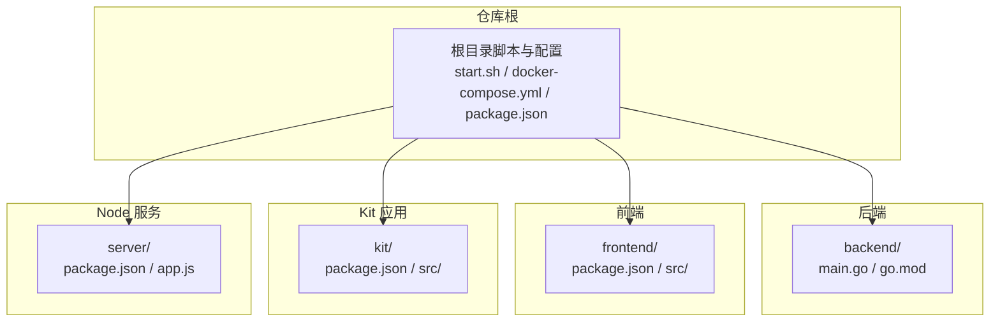
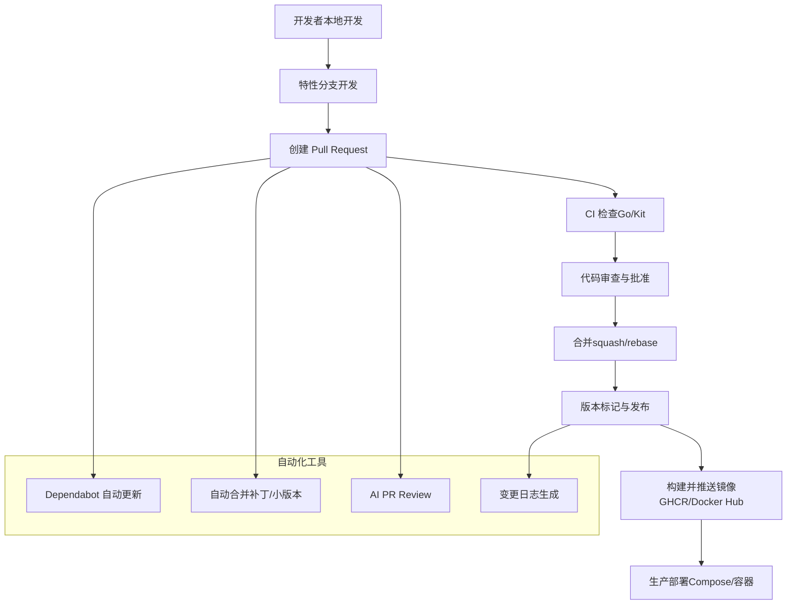
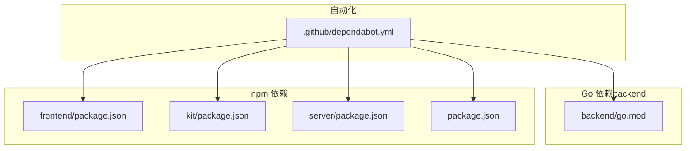

# 版本控制与协作

<cite>
**本文引用的文件**
- [README.md](file://README.md)
- [.github/dependabot.yml](file://.github/dependabot.yml)
- [.github/workflows/ci.yml](file://.github/workflows/ci.yml)
- [.github/workflows/docker-image.yml](file://.github/workflows/docker-image.yml)
- [.github/workflows/changelog.yml](file://.github/workflows/changelog.yml)
- [.github/workflows/dependabot-auto-merge.yml](file://.github/workflows/dependabot-auto-merge.yml)
- [.github/workflows/ai-pr-review.yml](file://.github/workflows/ai-pr-review.yml)
- [backend/go.mod](file://backend/go.mod)
- [backend/main.go](file://backend/main.go)
- [frontend/package.json](file://frontend/package.json)
- [kit/package.json](file://kit/package.json)
- [server/package.json](file://server/package.json)
- [package.json](file://package.json)
- [docker-compose.yml](file://docker-compose.yml)
</cite>

## 目录
1. [简介](#简介)
2. [项目结构](#项目结构)
3. [核心组件](#核心组件)
4. [架构总览](#架构总览)
5. [详细组件分析](#详细组件分析)
6. [依赖分析](#依赖分析)
7. [性能考虑](#性能考虑)
8. [故障排查指南](#故障排查指南)
9. [结论](#结论)
10. [附录](#附录)

## 简介
本文件面向 Memo Studio 团队，系统化梳理版本控制与协作流程，覆盖以下方面：
- Git 工作流：分支策略、提交规范、合并策略
- 代码审查：Pull Request 模板、审查清单、反馈处理
- 依赖管理：Go modules、npm packages、版本锁定
- 发布流程：版本标记、变更日志、回滚策略
- 团队协作：沟通渠道、任务分配、进度跟踪
- 自动化工具：Dependabot 自动更新、CI/CD 集成、代码质量检查
- 冲突解决与分支管理最佳实践：rebase 策略、squash 合并、历史清理

## 项目结构
Memo Studio 采用多模块并行的前后端混合架构，包含后端 Go 服务、前端 Svelte 应用、Kit SvelteKit 应用、Node.js 服务以及容器化部署。仓库根目录提供一键启动脚本与 Docker Compose 编排，便于本地开发与生产部署。

图表来源
- [README.md](file://README.md#L254-L273)
- [backend/main.go](file://backend/main.go#L1-L30)
- [frontend/package.json](file://frontend/package.json#L1-L25)
- [kit/package.json](file://kit/package.json#L1-L20)
- [server/package.json](file://server/package.json#L1-L25)
- [package.json](file://package.json#L1-L20)

章节来源
- [README.md](file://README.md#L254-L273)

## 核心组件
- 后端服务（Go + Gin + SQLite）：提供统一 API v1，包含认证、笔记、标签、资源、AI 洞察、股票分析等能力，并内置静态文件托管与 SPA fallback。
- 前端应用（Svelte + Vite）：提供笔记浏览、编辑、搜索、导出等功能。
- Kit 应用（SvelteKit）：作为新一代实现，构建产物同步至后端 public 目录，由后端统一托管。
- Node 服务：基于 Express 的辅助服务，配合数据库与中间件。
- 容器化与发布：Dockerfile 与 docker-compose.yml 支持生产部署；GitHub Actions 实现镜像构建与推送。

章节来源
- [backend/main.go](file://backend/main.go#L94-L196)
- [frontend/package.json](file://frontend/package.json#L1-L25)
- [kit/package.json](file://kit/package.json#L1-L20)
- [server/package.json](file://server/package.json#L1-L25)
- [docker-compose.yml](file://docker-compose.yml#L1-L25)

## 架构总览
下图展示从本地开发到生产发布的整体流程，以及自动化工具如何贯穿其中。

图表来源
- [.github/workflows/ci.yml](file://.github/workflows/ci.yml#L1-L60)
- [.github/workflows/dependabot-auto-merge.yml](file://.github/workflows/dependabot-auto-merge.yml#L1-L36)
- [.github/workflows/ai-pr-review.yml](file://.github/workflows/ai-pr-review.yml#L1-L82)
- [.github/workflows/changelog.yml](file://.github/workflows/changelog.yml#L1-L40)
- [.github/workflows/docker-image.yml](file://.github/workflows/docker-image.yml#L1-L103)
- [.github/dependabot.yml](file://.github/dependabot.yml#L1-L106)

## 详细组件分析

### Git 工作流与分支策略
- 分支命名与职责
  - main：稳定主干，仅接受受控合并。
  - feature/*：功能开发分支，命名语义化，描述性短语。
  - hotfix/*：紧急修复分支，快速回归修复。
  - release/*：预发布分支，进行最终验证与版本标记。
- 提交规范
  - 类型限定：feat、fix、docs、style、refactor、test、chore、perf、ci、revert。
  - 标题格式：类型(作用域): 描述（不超过 50 字）。
  - 正文：解释动机与对比，必要时提供链接或上下文。
  - 闭合 Issue：在提交信息末尾引用关联 Issue。
- 合并策略
  - 补丁/小版本：优先使用 squash 合并，保持主干整洁。
  - 大改动：建议 rebase 合并，保留清晰历史。
  - 依赖更新：Dependabot PR 自动满足条件时可自动合并（见自动合并策略）。

章节来源
- [.github/dependabot.yml](file://.github/dependabot.yml#L1-L106)
- [.github/workflows/dependabot-auto-merge.yml](file://.github/workflows/dependabot-auto-merge.yml#L1-L36)

### 代码审查流程
- Pull Request 模板
  - 建议模板字段：标题、摘要、变更内容、影响范围、测试方法、风险评估、回滚方案、相关 Issue。
- 审查清单
  - 代码质量：命名规范、复杂度、重复逻辑、注释与文档。
  - 安全性：输入校验、鉴权与授权、敏感信息处理。
  - 兼容性：API 变更、数据库迁移、前端兼容。
  - 性能：缓存策略、查询优化、资源占用。
  - 测试：新增/修改用例、边界场景、回归测试。
- 反馈处理
  - 使用线程化评论逐项回复，明确责任人与截止时间。
  - 修改后重新触发 CI，确保通过后再行合并。

章节来源
- [.github/workflows/ai-pr-review.yml](file://.github/workflows/ai-pr-review.yml#L1-L82)

### 依赖管理策略
- Go modules
  - 使用 go.mod 锁定依赖版本，间接依赖通过 go.sum 管控。
  - 建议定期运行 go mod tidy 与 go mod vendor（如需）。
- npm packages
  - 各子项目维护独立 package.json，使用 package-lock.json 锁定版本。
  - 依赖更新由 Dependabot 触发 PR，按 semver 策略自动合并补丁/小版本。
- 版本锁定
  - Go：go.mod / go.sum。
  - npm：package-lock.json（CI 使用 npm ci）。
  - Docker：镜像使用语义化标签与 latest，结合 CI 元数据。

章节来源
- [backend/go.mod](file://backend/go.mod#L1-L45)
- [frontend/package.json](file://frontend/package.json#L1-L25)
- [kit/package.json](file://kit/package.json#L1-L20)
- [server/package.json](file://server/package.json#L1-L25)
- [.github/dependabot.yml](file://.github/dependabot.yml#L1-L106)
- [.github/workflows/ci.yml](file://.github/workflows/ci.yml#L48-L54)

### 发布流程管理
- 版本标记
  - 使用语义化版本：vMAJOR.MINOR.PATCH。
  - 推送标签触发镜像构建与发布。
- 变更日志
  - 发布时自动生成并提交 CHANGELOG.md。
- 回滚策略
  - 回滚到上一个稳定标签；若涉及数据库结构变更，准备降级迁移脚本。
  - 通过容器编排回滚到上一个镜像版本。

章节来源
- [README.md](file://README.md#L158-L176)
- [.github/workflows/changelog.yml](file://.github/workflows/changelog.yml#L1-L40)
- [.github/workflows/docker-image.yml](file://.github/workflows/docker-image.yml#L1-L103)

### 团队协作规范
- 沟通渠道
  - 问题与讨论：Issue/PR 讨论区。
  - 实时沟通：企业微信/钉钉/Slack（团队自定）。
- 任务分配
  - 使用 Issue 标签（enhancement、bug、help wanted、good first issue）与里程碑规划。
  - 每个 PR 对应一个 Issue，避免“孤儿”改动。
- 进度跟踪
  - 采用看板（Backlog → In Progress → Review → Done）追踪迭代。
  - 每日站会同步阻塞项与风险。

（本节为通用协作建议，不直接分析具体文件）

### 自动化工具配置
- Dependabot
  - 针对 backend/gomod 与各 npm 子项目配置每周扫描、自动 rebase、补丁/小版本自动合并。
- CI/CD
  - CI：Go/Kit 分别进行测试与构建。
  - Docker：推送 v* 标签时自动构建并推送到 GHCR 与 Docker Hub（可选）。
- 代码质量检查
  - AI PR Review：针对 Dependabot PR 自动触发，其他 PR 可通过标签触发。
  - 变更日志：发布时自动生成并提交。

章节来源
- [.github/dependabot.yml](file://.github/dependabot.yml#L1-L106)
- [.github/workflows/ci.yml](file://.github/workflows/ci.yml#L1-L60)
- [.github/workflows/docker-image.yml](file://.github/workflows/docker-image.yml#L1-L103)
- [.github/workflows/ai-pr-review.yml](file://.github/workflows/ai-pr-review.yml#L1-L82)
- [.github/workflows/changelog.yml](file://.github/workflows/changelog.yml#L1-L40)

### 冲突解决与分支管理最佳实践
- rebase 策略
  - 在 feature 分支上定期 rebase main，保持线性历史与最新基线。
- squash 合并
  - 将多个提交压缩为单个提交，便于主干整洁与审阅。
- 历史清理
  - 避免在公共分支上 force push；必要时通过新 PR 替换。
  - 使用交互式 rebase 清理不必要的提交草稿。

（本节为通用最佳实践，不直接分析具体文件）

## 依赖分析
下图展示仓库关键依赖与版本锁定关系，帮助理解各子系统的依赖来源与更新路径。

图表来源
- [backend/go.mod](file://backend/go.mod#L1-L45)
- [frontend/package.json](file://frontend/package.json#L1-L25)
- [kit/package.json](file://kit/package.json#L1-L20)
- [server/package.json](file://server/package.json#L1-L25)
- [package.json](file://package.json#L1-L20)
- [.github/dependabot.yml](file://.github/dependabot.yml#L1-L106)

章节来源
- [backend/go.mod](file://backend/go.mod#L1-L45)
- [frontend/package.json](file://frontend/package.json#L1-L25)
- [kit/package.json](file://kit/package.json#L1-L20)
- [server/package.json](file://server/package.json#L1-L25)
- [package.json](file://package.json#L1-L20)
- [.github/dependabot.yml](file://.github/dependabot.yml#L1-L106)

## 性能考虑
- 依赖更新频率与合并策略：高频补丁/小版本更新可降低安全风险，但需平衡合并成本。
- CI 并行化：Go 与 Kit 并行执行，缩短流水线时长。
- 镜像构建：多平台构建与缓存利用，减少重复构建时间。

（本节提供一般性指导，不直接分析具体文件）

## 故障排查指南
- 端口占用
  - 启动脚本会尝试清理，若失败可通过 lsof/kill 定位并终止进程。
- 依赖安装失败
  - Go：进入 backend 执行 go mod download 与 go mod tidy。
  - npm：清理 node_modules 与 lock 文件后重新安装。
- 数据库问题
  - 删除 notes.db 后重启服务，数据库将自动重建。
- 热更新不工作
  - 前端：检查浏览器控制台与 Vite 日志；后端：确认 Air 工具可用与配置存在。

章节来源
- [README.md](file://README.md#L446-L498)

## 结论
通过明确的分支与提交规范、完善的代码审查流程、严格的依赖管理与版本锁定、自动化 CI/CD 与发布机制，Memo Studio 能够在保证质量的同时提升交付效率。建议团队持续优化自动化工具配置，完善审查清单与回滚预案，确保版本演进的稳定性与可追溯性。

## 附录
- 关键入口与职责
  - 后端入口：backend/main.go，定义路由组、中间件与静态文件托管。
  - 一键启动：start.sh 与 docker-compose.yml，统一本地开发体验。
  - 发布入口：README 中的版本标记与镜像发布说明。

章节来源
- [backend/main.go](file://backend/main.go#L28-L196)
- [README.md](file://README.md#L15-L56)
- [docker-compose.yml](file://docker-compose.yml#L1-L25)