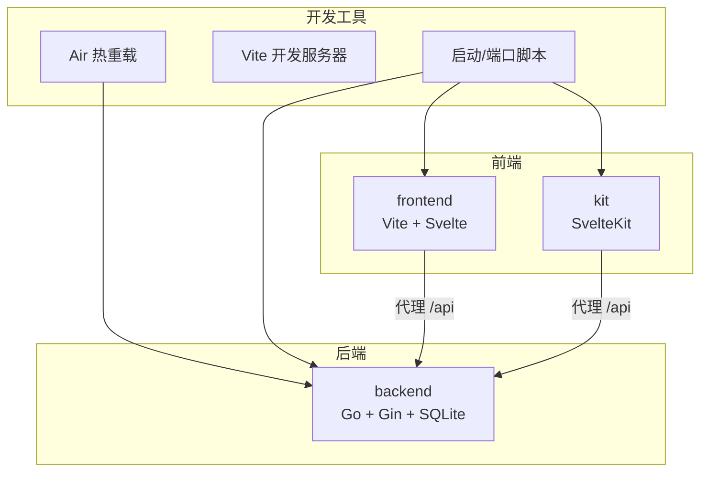
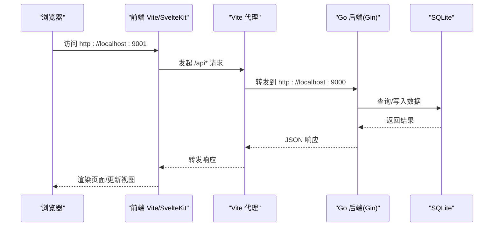
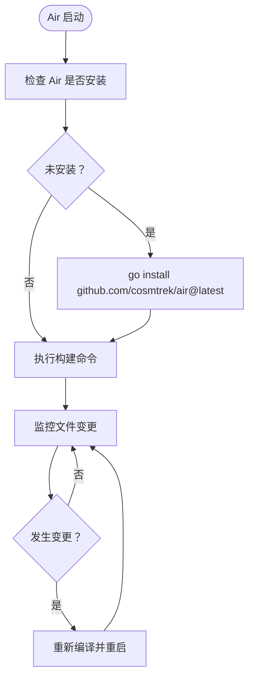
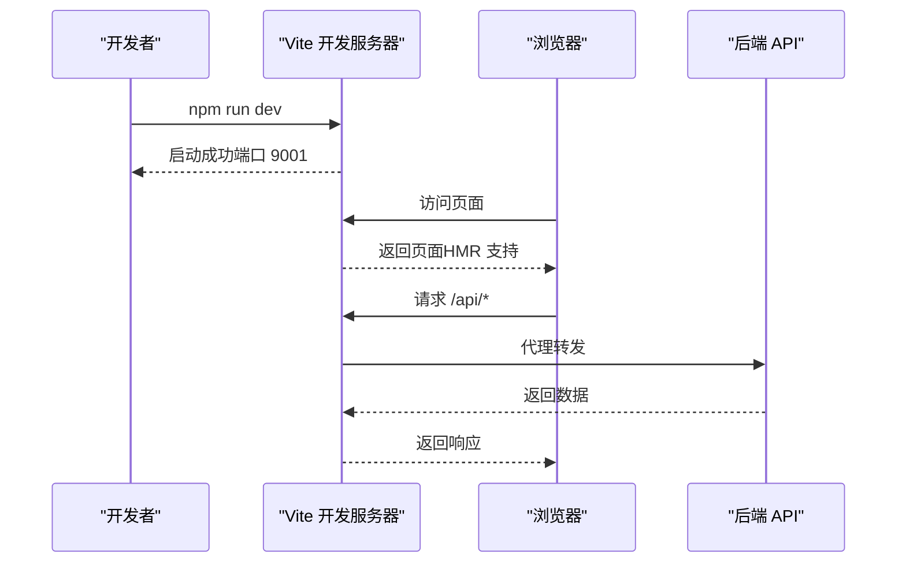
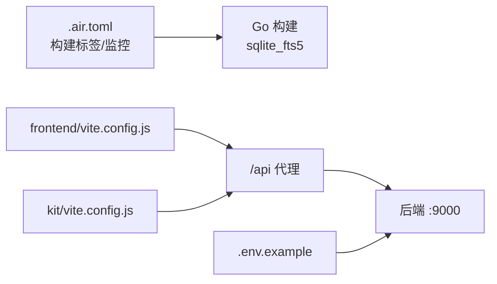
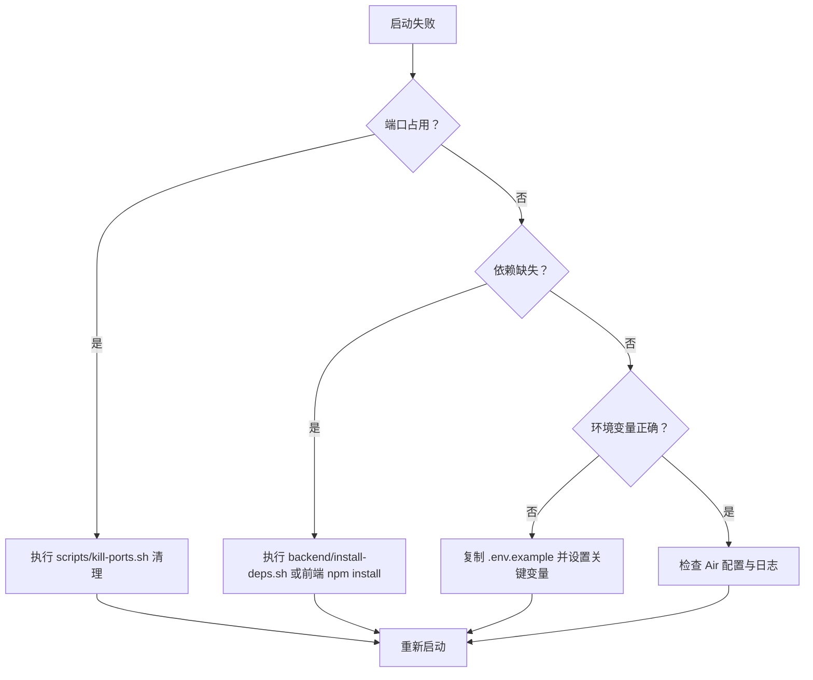

# 调试与工具

<cite>
**本文引用的文件**
- [backend/.air.toml](file://backend/.air.toml)
- [backend/start-dev.sh](file://backend/start-dev.sh)
- [frontend/vite.config.js](file://frontend/vite.config.js)
- [kit/vite.config.js](file://kit/vite.config.js)
- [frontend/package.json](file://frontend/package.json)
- [kit/package.json](file://kit/package.json)
- [scripts/kill-ports.sh](file://scripts/kill-ports.sh)
- [.env.example](file://.env.example)
- [backend/main.go](file://backend/main.go)
- [backend/go.mod](file://backend/go.mod)
- [README.md](file://README.md)
- [dev-kit.sh](file://dev-kit.sh)
- [start.sh](file://start.sh)
- [backend/install-deps.sh](file://backend/install-deps.sh)
</cite>

## 目录
1. [简介](#简介)
2. [项目结构](#项目结构)
3. [核心组件](#核心组件)
4. [架构总览](#架构总览)
5. [详细组件分析](#详细组件分析)
6. [依赖关系分析](#依赖关系分析)
7. [性能考虑](#性能考虑)
8. [故障排查指南](#故障排查指南)
9. [结论](#结论)
10. [附录](#附录)

## 简介
本指南面向 Memo Studio 的开发者与调试人员，围绕以下主题提供系统化的使用与排障方法：
- Air 热重载工具的配置与使用（配置项、监控文件、重启策略）
- Vite 开发服务器调试技巧（代理、HMR、性能分析）
- Go 开发工具链（Delve 调试器、pprof 性能分析、race detector）
- 浏览器开发者工具使用（网络面板、性能面板、源码映射）
- 日志分析方法（结构化日志、错误追踪、性能监控）
- 常见问题诊断流程（端口冲突、依赖缺失、环境配置）
- IDE 配置与插件推荐（VS Code 设置、Go 插件、Svelte 插件）

## 项目结构
Memo Studio 采用前后端分离与一体化开发模式：
- 前端（Vite + Svelte/SvelteKit）：分别位于 frontend 与 kit 目录，前者为传统 Vite 应用，后者为 SvelteKit 应用
- 后端（Go + Gin + SQLite）：位于 backend 目录，提供统一 API 与静态资源托管
- 开发脚本与工具：start.sh、dev-kit.sh、scripts/kill-ports.sh 等
- 配置文件：.env.example、frontend/vite.config.js、kit/vite.config.js、backend/.air.toml

图表来源
- [frontend/vite.config.js](file://frontend/vite.config.js#L12-L23)
- [kit/vite.config.js](file://kit/vite.config.js#L6-L14)
- [backend/.air.toml](file://backend/.air.toml#L8-L30)
- [dev-kit.sh](file://dev-kit.sh#L56-L103)
- [start.sh](file://start.sh#L92-L209)

章节来源
- [README.md](file://README.md#L1-L502)

## 核心组件
- Air 热重载（Go）：通过 .air.toml 配置监控范围、排除规则、重启行为等，配合 backend/start-dev.sh 实现自动编译与重启
- Vite 开发服务器（前端）：frontend/vite.config.js 与 kit/vite.config.js 提供端口、HMR、代理配置
- Go 开发工具链：Delve（dlv）、pprof、race detector（-race）等
- 浏览器开发者工具：Network、Performance、Sources（源码映射）
- 日志与脚本：backend.log、frontend.log、kit.log，以及端口占用清理脚本
- 环境变量：.env.example 提供 JWT、CORS、环境模式等关键配置

章节来源
- [backend/.air.toml](file://backend/.air.toml#L1-L48)
- [backend/start-dev.sh](file://backend/start-dev.sh#L1-L45)
- [frontend/vite.config.js](file://frontend/vite.config.js#L1-L25)
- [kit/vite.config.js](file://kit/vite.config.js#L1-L16)
- [.env.example](file://.env.example#L1-L16)

## 架构总览
下图展示了开发阶段的请求流向与组件交互。

图表来源
- [frontend/vite.config.js](file://frontend/vite.config.js#L17-L22)
- [kit/vite.config.js](file://kit/vite.config.js#L8-L13)
- [backend/main.go](file://backend/main.go#L319-L334)

## 详细组件分析

### Air 热重载工具（Go）
- 安装与启动
  - 支持自动安装：backend/start-dev.sh 会在未安装时执行安装并启动
  - 启动后自动编译并运行，修改 Go 代码后自动重建与重启
- 关键配置项（来自 .air.toml）
  - 监控范围：include_ext 包含 go、tpl、tmpl、html；exclude_dir 排除 assets、tmp、vendor、testdata；排除测试文件 _test.go
  - 编译命令：使用 go build -tags sqlite_fts5 -o ./tmp/main .
  - 重启策略：delay、rerun_delay 控制重建节奏；stop_on_error、send_interrupt 等影响重启行为
  - 输出与日志：build-errors.log 记录构建错误；屏幕滚动与颜色配置便于观察
- 与开发脚本联动
  - dev-kit.sh 与 start.sh 在启动后端时均使用 sqlite_fts5 构建标签，Air 与脚本共同保证一致的构建环境

图表来源
- [backend/start-dev.sh](file://backend/start-dev.sh#L15-L44)
- [backend/.air.toml](file://backend/.air.toml#L8-L30)

章节来源
- [backend/.air.toml](file://backend/.air.toml#L1-L48)
- [backend/start-dev.sh](file://backend/start-dev.sh#L1-L45)
- [dev-kit.sh](file://dev-kit.sh#L70-L71)
- [start.sh](file://start.sh#L127-L128)

### Vite 开发服务器调试（前端）
- 端口与 HMR
  - 前端默认端口 9001；frontend/vite.config.js 开启 overlay 错误覆盖层，便于快速定位错误
  - kit/vite.config.js 同样使用 9001 端口，确保一致性
- 代理配置
  - frontend/vite.config.js 将 /api 代理到 http://localhost:9000，便于联调后端
  - kit/vite.config.js 亦将 /api 代理到 http://localhost:9000
- 性能分析
  - 使用浏览器 Performance 面板录制加载与交互过程，结合 Network 面板观察请求耗时与缓存命中
  - 结合源码映射（Source Maps）在 Sources 面板定位到原始 Svelte/SvelteKit 源码
- 脚本与依赖
  - frontend/package.json 与 kit/package.json 提供 dev/build/test/preview 脚本，便于快速启动与验证

图表来源
- [frontend/vite.config.js](file://frontend/vite.config.js#L12-L23)
- [kit/vite.config.js](file://kit/vite.config.js#L6-L14)
- [frontend/package.json](file://frontend/package.json#L5-L10)
- [kit/package.json](file://kit/package.json#L5-L10)

章节来源
- [frontend/vite.config.js](file://frontend/vite.config.js#L1-L25)
- [kit/vite.config.js](file://kit/vite.config.js#L1-L16)
- [frontend/package.json](file://frontend/package.json#L1-L25)
- [kit/package.json](file://kit/package.json#L1-L20)

### Go 开发工具链（Delve、pprof、race detector）
- Delve（dlv）调试器
  - 使用 dlv debug 或 dlv attach 进行断点调试，适合定位复杂逻辑与并发问题
- pprof 性能分析
  - 在后端启用 pprof（net/http/pprof），通过 /debug/pprof 接口采集 CPU/内存/阻塞等分析数据
  - 使用 go tool pprof 本地或远程分析火焰图与热点函数
- Race Detector（-race）
  - 构建时添加 -race 标记，运行时捕获数据竞争，有助于发现并发安全问题
- 与 Air/脚本协同
  - Air 与 dev-kit.sh/start.sh 均使用 sqlite_fts5 构建标签，确保 pprof/race 等分析与运行环境一致

章节来源
- [backend/go.mod](file://backend/go.mod#L1-L45)
- [backend/main.go](file://backend/main.go#L1-L353)
- [backend/.air.toml](file://backend/.air.toml#L11-L11)
- [dev-kit.sh](file://dev-kit.sh#L70-L70)
- [start.sh](file://start.sh#L127-L127)

### 浏览器开发者工具使用
- 网络面板（Network）
  - 观察 /api* 请求的响应时间、状态码、请求头与响应体，定位接口异常
- 性能面板（Performance）
  - 录制页面加载与交互过程，查看主线程耗时、重绘与回流、长任务
- 源码映射（Sources）
  - 确保开启 Source Maps，以便在 Sources 面板中看到原始 Svelte/SvelteKit 源码，提升调试效率

章节来源
- [frontend/vite.config.js](file://frontend/vite.config.js#L12-L23)
- [kit/vite.config.js](file://kit/vite.config.js#L6-L14)

### 日志分析方法
- 后端日志
  - backend/main.go 在非 release 模式下启用 gin.Logger，输出请求日志；错误通过 log.Fatal 或 gin.Context 报告
  - 日志文件：backend.log（start.sh/dev-kit.sh 启动时输出）
- 前端日志
  - frontend/package.json/kit/package.json 的 dev 脚本将输出重定向至 frontend.log/kit.log
- 结构化日志与错误追踪
  - 建议在后端引入结构化日志（如 JSON），包含时间戳、级别、请求 ID、路径、参数摘要、错误堆栈等
  - 在浏览器控制台与网络面板中结合日志进行端到端追踪

章节来源
- [backend/main.go](file://backend/main.go#L42-L44)
- [start.sh](file://start.sh#L127-L127)
- [dev-kit.sh](file://dev-kit.sh#L102-L102)

## 依赖关系分析
- Air 与 Go 构建标签
  - Air 通过 .air.toml 的 cmd 字段指定构建标签 sqlite_fts5，与 dev-kit.sh/start.sh 保持一致
- Vite 与后端代理
  - 前端两套配置均将 /api 代理到后端 9000 端口，确保开发联调稳定
- 环境变量与 CORS
  - .env.example 提供 JWT、CORS、环境模式等关键变量；后端根据 MEMO_CORS_ORIGINS 动态配置跨域白名单

图表来源
- [backend/.air.toml](file://backend/.air.toml#L11-L11)
- [frontend/vite.config.js](file://frontend/vite.config.js#L17-L22)
- [kit/vite.config.js](file://kit/vite.config.js#L8-L13)
- [.env.example](file://.env.example#L4-L15)

章节来源
- [backend/.air.toml](file://backend/.air.toml#L1-L48)
- [frontend/vite.config.js](file://frontend/vite.config.js#L1-L25)
- [kit/vite.config.js](file://kit/vite.config.js#L1-L16)
- [.env.example](file://.env.example#L1-L16)

## 性能考虑
- 前端性能
  - 使用 Vite 的 HMR 与按需加载，减少全量刷新；利用 Performance 面板优化首屏与交互延迟
- 后端性能
  - 启用 pprof 采集 CPU/内存/阻塞数据，结合火焰图定位热点函数；在并发场景使用 -race 检测数据竞争
- 构建与运行一致性
  - Air 与脚本统一使用 sqlite_fts5 构建标签，避免因构建差异导致的性能偏差

章节来源
- [backend/.air.toml](file://backend/.air.toml#L11-L11)
- [dev-kit.sh](file://dev-kit.sh#L70-L70)
- [start.sh](file://start.sh#L127-L127)

## 故障排查指南
- 端口冲突
  - 使用 scripts/kill-ports.sh 检查并清理 9000/9001 端口占用；start.sh/dev-kit.sh 内置端口检查与清理逻辑
- 依赖缺失
  - Go 依赖：backend/install-deps.sh 提供 GOPROXY 自动设置与重试机制；start.sh/dev-kit.sh 在首次启动时自动下载与整理
  - 前端依赖：frontend/package.json/kit/package.json 的 dev 脚本负责安装与运行
- 环境配置
  - 复制 .env.example 为 .env，设置 MEMO_JWT_SECRET、MEMO_CORS_ORIGINS、GIN_MODE 等关键变量
- 热重载不工作
  - 确认 Air 已安装；检查 .air.toml 配置；查看 build-errors.log 与 Air 输出日志

图表来源
- [scripts/kill-ports.sh](file://scripts/kill-ports.sh#L7-L33)
- [backend/install-deps.sh](file://backend/install-deps.sh#L9-L42)
- [.env.example](file://.env.example#L4-L15)
- [backend/start-dev.sh](file://backend/start-dev.sh#L15-L25)
- [backend/.air.toml](file://backend/.air.toml#L23-L23)

章节来源
- [scripts/kill-ports.sh](file://scripts/kill-ports.sh#L1-L34)
- [backend/install-deps.sh](file://backend/install-deps.sh#L1-L43)
- [.env.example](file://.env.example#L1-L16)
- [README.md](file://README.md#L446-L498)

## 结论
通过 Air 热重载、Vite 开发服务器与 Go 工具链的组合，Memo Studio 提供了高效的开发与调试体验。配合浏览器开发者工具与完善的日志体系，能够快速定位问题并优化性能。建议在团队内统一环境变量与构建标签，确保开发与生产的一致性。

## 附录
- IDE 配置与插件推荐（VS Code）
  - Go 插件：提供语法高亮、格式化、导入管理、测试与调试（dlv）
  - Svelte 插件：提供 Svelte 语法高亮、SvelteKit 支持、HMR 辅助
  - 建议启用 EditorConfig、Prettier、ESLint（如需）以统一代码风格
- 常用命令索引
  - 后端热重载：backend/start-dev.sh 或 air
  - 一体化开发：dev-kit.sh
  - 传统双端开发：start.sh
  - 前端开发：frontend/package.json/kit/package.json 的 dev 脚本
  - 端口清理：scripts/kill-ports.sh

章节来源
- [backend/start-dev.sh](file://backend/start-dev.sh#L1-L45)
- [dev-kit.sh](file://dev-kit.sh#L1-L133)
- [start.sh](file://start.sh#L1-L238)
- [frontend/package.json](file://frontend/package.json#L5-L10)
- [kit/package.json](file://kit/package.json#L5-L10)
- [scripts/kill-ports.sh](file://scripts/kill-ports.sh#L1-L34)