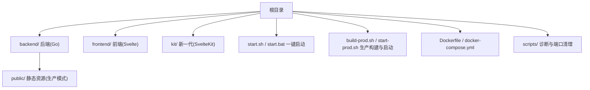
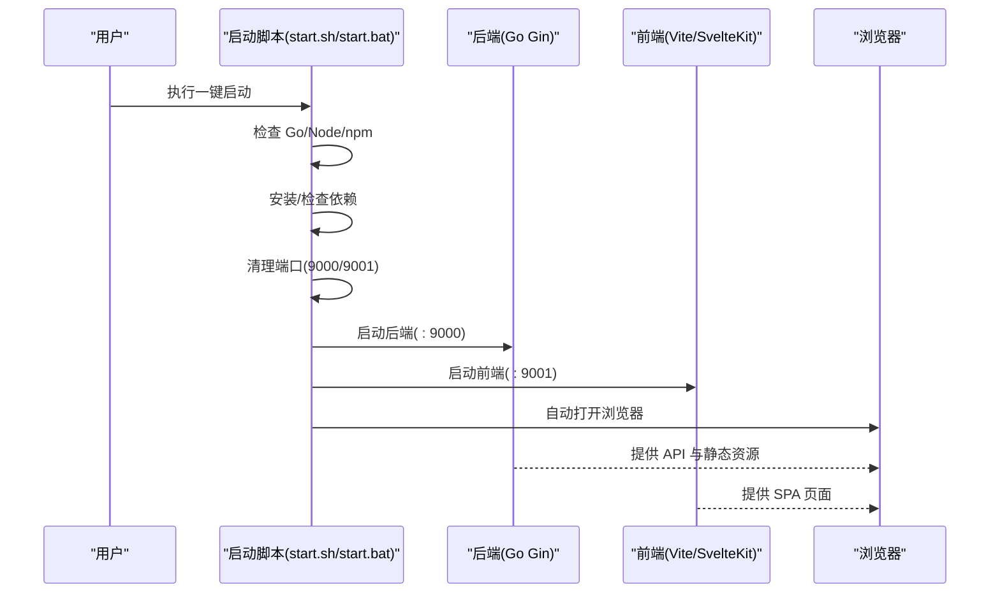
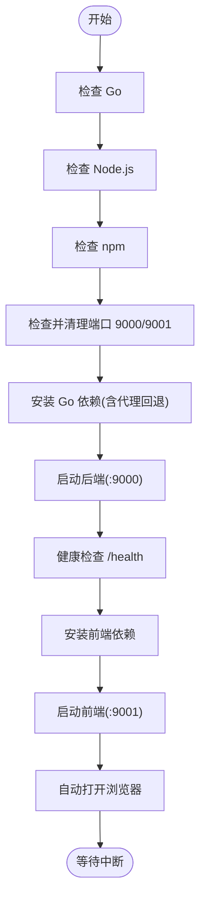
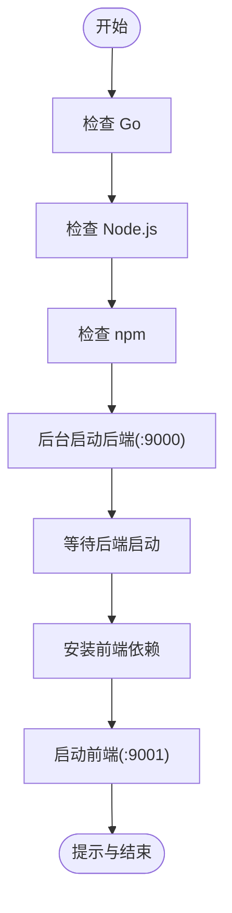
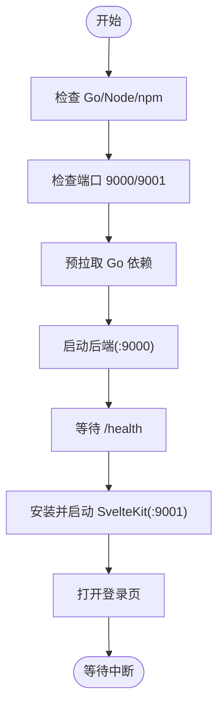
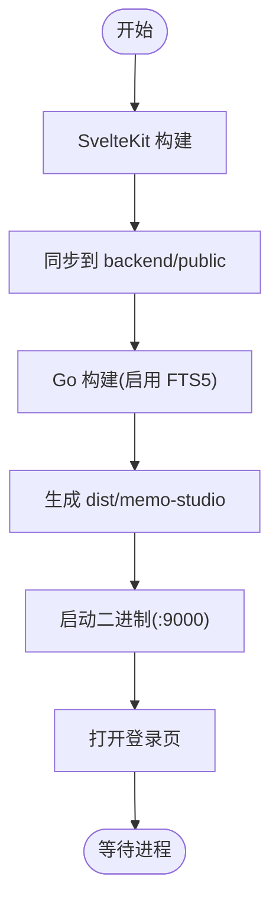
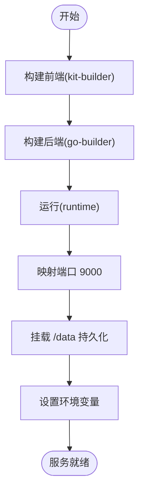
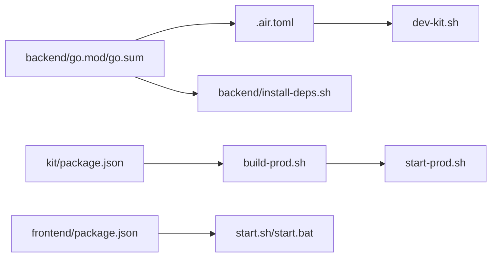

# 快速开始

<cite>
**本文引用的文件**
- [README.md](file://README.md)
- [start.sh](file://start.sh)
- [start.bat](file://start.bat)
- [dev-kit.sh](file://dev-kit.sh)
- [start-prod.sh](file://start-prod.sh)
- [build-prod.sh](file://build-prod.sh)
- [check.sh](file://check.sh)
- [scripts/kill-ports.sh](file://scripts/kill-ports.sh)
- [backend/install-deps.sh](file://backend/install-deps.sh)
- [backend/main.go](file://backend/main.go)
- [backend/.air.toml](file://backend/.air.toml)
- [frontend/package.json](file://frontend/package.json)
- [kit/package.json](file://kit/package.json)
- [docker-compose.yml](file://docker-compose.yml)
- [Dockerfile](file://Dockerfile)
</cite>

## 目录
1. [简介](#简介)
2. [项目结构](#项目结构)
3. [核心组件](#核心组件)
4. [架构总览](#架构总览)
5. [详细组件分析](#详细组件分析)
6. [依赖关系分析](#依赖关系分析)
7. [性能注意事项](#性能注意事项)
8. [故障排查指南](#故障排查指南)
9. [结论](#结论)
10. [附录](#附录)

## 简介
本指南面向首次接触 Memo Studio 的用户与开发者，帮助你在最短时间内完成环境准备、依赖安装与一键启动，随后进入“首次使用”的引导流程，从注册账号到创建第一条笔记，快速上手应用。

Memo Studio 是一款前后端分离的笔记应用，采用 Go + Gin + SQLite 作为后端技术栈，前端使用 Svelte/Vite 或 SvelteKit，支持响应式设计、明暗主题、标签系统、用户认证、AI 语音转写与洞察分析等特性。

## 项目结构
- 后端（Go + Gin + SQLite）位于 backend/，提供 REST API 与静态资源托管。
- 前端（Svelte + Vite）位于 frontend/，用于传统开发模式。
- 新一代实现（SvelteKit）位于 kit/，用于新一代开发与生产构建。
- 一键启动脚本位于根目录：start.sh（macOS/Linux）、start.bat（Windows）。
- 生产模式构建与启动：build-prod.sh、start-prod.sh。
- Docker 支持：Dockerfile、docker-compose.yml。
- 诊断与端口清理：check.sh、scripts/kill-ports.sh、backend/install-deps.sh。

图表来源
- [backend/main.go](file://backend/main.go#L23-L27)
- [kit/package.json](file://kit/package.json#L1-L18)
- [frontend/package.json](file://frontend/package.json#L1-L25)
- [Dockerfile](file://Dockerfile#L1-L81)
- [docker-compose.yml](file://docker-compose.yml#L1-L25)

章节来源
- [README.md](file://README.md#L254-L273)

## 核心组件
- 一键启动脚本
  - macOS/Linux：start.sh，自动检查 Go/Node/npm、安装依赖、清理端口、启动后端(:9000)与前端(:9001)，并自动打开浏览器。
  - Windows：start.bat，逻辑类似，启动后端与前端并显示访问地址。
- 开发模式
  - dev-kit.sh：启动后端(:9000)与 SvelteKit 前端(:9001)，适合新一代实现的热更新开发。
- 生产模式
  - build-prod.sh：构建 SvelteKit 静态产物并同步至 backend/public，再构建 Go 二进制。
  - start-prod.sh：直接运行 Go 二进制，前端静态资源由 Go 内嵌托管。
- Docker 发布
  - Dockerfile：多阶段构建，前端构建产物注入后端 public，最终运行 Go 二进制。
  - docker-compose.yml：一键启动服务，挂载数据卷，设置环境变量。

章节来源
- [README.md](file://README.md#L11-L60)
- [start.sh](file://start.sh#L1-L238)
- [start.bat](file://start.bat#L1-L77)
- [dev-kit.sh](file://dev-kit.sh#L1-L133)
- [build-prod.sh](file://build-prod.sh#L1-L33)
- [start-prod.sh](file://start-prod.sh#L1-L63)
- [Dockerfile](file://Dockerfile#L1-L81)
- [docker-compose.yml](file://docker-compose.yml#L1-L25)

## 架构总览
下图展示了“一键启动”在不同模式下的组件交互与数据流。

图表来源
- [start.sh](file://start.sh#L29-L90)
- [start.bat](file://start.bat#L7-L32)
- [backend/main.go](file://backend/main.go#L319-L334)

章节来源
- [README.md](file://README.md#L11-L36)
- [backend/main.go](file://backend/main.go#L319-L334)

## 详细组件分析

### 一键启动脚本（macOS/Linux）
- 功能概览
  - 环境检查：验证 Go、Node.js、npm 是否安装。
  - 依赖安装：Go 模块与 npm 包自动安装；Go 依赖支持国内代理回退。
  - 端口清理：自动检测并终止占用 9000/9001 的进程。
  - 启动顺序：先启动后端，等待健康检查；再启动前端，等待页面可用。
  - 自动打开浏览器：访问前端地址。
- 启动流程图

图表来源
- [start.sh](file://start.sh#L29-L90)
- [start.sh](file://start.sh#L102-L117)
- [start.sh](file://start.sh#L124-L165)
- [start.sh](file://start.sh#L178-L186)
- [start.sh](file://start.sh#L188-L209)

章节来源
- [start.sh](file://start.sh#L1-L238)

### 一键启动脚本（Windows）
- 功能概览
  - 环境检查：Go、Node.js、npm。
  - 后端：后台启动，输出到 backend.log。
  - 前端：安装依赖后启动，输出到前端日志。
  - 提示：关闭窗口即停止服务。
- 启动流程图

图表来源
- [start.bat](file://start.bat#L7-L32)
- [start.bat](file://start.bat#L36-L48)
- [start.bat](file://start.bat#L54-L73)

章节来源
- [start.bat](file://start.bat#L1-L77)

### 开发模式（dev-kit.sh）
- 适用场景：新一代实现（Go + SvelteKit），热更新开发。
- 启动内容：后端(:9000)与 SvelteKit 前端(:9001)，自动打开登录页。
- 依赖预拉取：Go 依赖预下载，提升首次启动速度。
- 启动流程图

图表来源
- [dev-kit.sh](file://dev-kit.sh#L39-L42)
- [dev-kit.sh](file://dev-kit.sh#L52-L54)
- [dev-kit.sh](file://dev-kit.sh#L63-L68)
- [dev-kit.sh](file://dev-kit.sh#L70-L95)
- [dev-kit.sh](file://dev-kit.sh#L97-L103)
- [dev-kit.sh](file://dev-kit.sh#L105-L119)
- [dev-kit.sh](file://dev-kit.sh#L128-L129)

章节来源
- [dev-kit.sh](file://dev-kit.sh#L1-L133)

### 生产模式（build-prod.sh + start-prod.sh）
- 构建流程
  - SvelteKit 前端构建并同步到 backend/public。
  - Go 后端启用 sqlite_fts5 构建标签，打包为二进制。
- 启动流程
  - 直接运行二进制，前端静态资源由 Go 内嵌托管。
  - 自动打开登录页或首页。
- 流程图

图表来源
- [build-prod.sh](file://build-prod.sh#L13-L28)
- [start-prod.sh](file://start-prod.sh#L13-L16)
- [start-prod.sh](file://start-prod.sh#L43-L59)

章节来源
- [build-prod.sh](file://build-prod.sh#L1-L33)
- [start-prod.sh](file://start-prod.sh#L1-L63)

### Docker 发布（Dockerfile + docker-compose.yml）
- 多阶段构建
  - kit-builder：安装并构建 SvelteKit 前端。
  - go-builder：下载 Go 依赖、复制源码、构建带 sqlite_fts5 的二进制。
  - runtime：非 root 用户运行，暴露 9000，挂载 /data。
- docker-compose
  - 映射 9000:9000，设置 MEMO_JWT_SECRET、MEMO_ADMIN_PASSWORD、MEMO_CORS_ORIGINS、数据卷等。
- 流程图

图表来源
- [Dockerfile](file://Dockerfile#L1-L81)
- [docker-compose.yml](file://docker-compose.yml#L1-L25)

章节来源
- [Dockerfile](file://Dockerfile#L1-L81)
- [docker-compose.yml](file://docker-compose.yml#L1-L25)

## 依赖关系分析
- 后端（Go）依赖管理
  - go.mod/go.sum：模块与校验文件。
  - .air.toml：Air 热重载配置，支持 sqlite_fts5 标签。
  - install-deps.sh：Go 依赖安装脚本，支持代理回退。
- 前端依赖
  - frontend/package.json：Vite + Svelte 生态。
  - kit/package.json：SvelteKit 生态。
- 一键启动与生产构建
  - start.sh/start.bat：自动化安装与启动。
  - build-prod.sh：前端构建与同步、后端构建。
  - start-prod.sh：运行生产二进制。

图表来源
- [backend/install-deps.sh](file://backend/install-deps.sh#L1-L43)
- [backend/.air.toml](file://backend/.air.toml#L1-L48)
- [frontend/package.json](file://frontend/package.json#L1-L25)
- [kit/package.json](file://kit/package.json#L1-L20)
- [build-prod.sh](file://build-prod.sh#L1-L33)
- [start.sh](file://start.sh#L1-L238)
- [start.bat](file://start.bat#L1-L77)
- [dev-kit.sh](file://dev-kit.sh#L1-L133)
- [start-prod.sh](file://start-prod.sh#L1-L63)

章节来源
- [backend/install-deps.sh](file://backend/install-deps.sh#L1-L43)
- [backend/.air.toml](file://backend/.air.toml#L1-L48)
- [frontend/package.json](file://frontend/package.json#L1-L25)
- [kit/package.json](file://kit/package.json#L1-L20)

## 性能注意事项
- 国内代理：一键启动脚本与依赖安装脚本均内置国内代理回退，网络不佳时可手动设置 GOPROXY。
- 首次构建：SvelteKit 构建与 Go 依赖下载可能耗时较长，建议使用 dev-kit.sh 的预拉取能力。
- 端口占用：启动前自动清理 9000/9001，若失败可使用 scripts/kill-ports.sh 交互式清理。
- 生产模式：启用 sqlite_fts5 与 release 模式，减少运行时开销。

## 故障排查指南
- 端口被占用
  - 自动清理：start.sh/start.bat 会在启动前尝试清理。
  - 交互清理：使用 scripts/kill-ports.sh。
  - 手动排查：使用 lsof 查看并 kill 占用进程。
- 依赖安装失败
  - Go：执行 backend/install-deps.sh 或在 backend 目录手动 go mod download && go mod tidy。
  - npm：在 frontend/ 目录删除 node_modules 与 package-lock.json 后重新安装。
- 后端启动失败
  - 查看 backend.log，关注健康检查 /health 是否可达。
  - 确认数据库文件权限与路径。
- 前端启动失败
  - 查看 frontend.log 或 kit.log，确认端口 9001 可达。
- 热更新不工作
  - 前端：检查浏览器控制台、硬刷新、确认 Vite 开发服务器运行。
  - 后端：安装 Air 并使用 .air.toml 配置，或使用手动重启方式。

章节来源
- [start.sh](file://start.sh#L71-L90)
- [scripts/kill-ports.sh](file://scripts/kill-ports.sh#L1-L34)
- [backend/install-deps.sh](file://backend/install-deps.sh#L18-L34)
- [README.md](file://README.md#L446-L498)

## 结论
通过一键启动脚本与新一代开发/生产流程，你可以快速完成环境准备与服务启动。首次使用只需注册账号并创建第一条笔记，即可体验应用的核心功能。遇到问题时，可借助诊断脚本与端口清理脚本进行定位与修复。

## 附录

### 首次使用引导流程
- 启动服务后，打开浏览器访问前端地址。
- 点击“立即注册”创建账号，注册成功后自动登录。
- 进入应用后，点击“新建笔记”，输入标题与内容，添加标签，保存即完成第一条笔记。

章节来源
- [README.md](file://README.md#L248-L253)

### 开发模式与生产模式对比
- 开发模式
  - 优点：热更新、开发效率高。
  - 适用：日常开发与调试。
- 生产模式
  - 优点：运行稳定、体积小、易于部署。
  - 适用：上线部署与容器化发布。

章节来源
- [README.md](file://README.md#L37-L60)
- [dev-kit.sh](file://dev-kit.sh#L1-L133)
- [start-prod.sh](file://start-prod.sh#L1-L63)