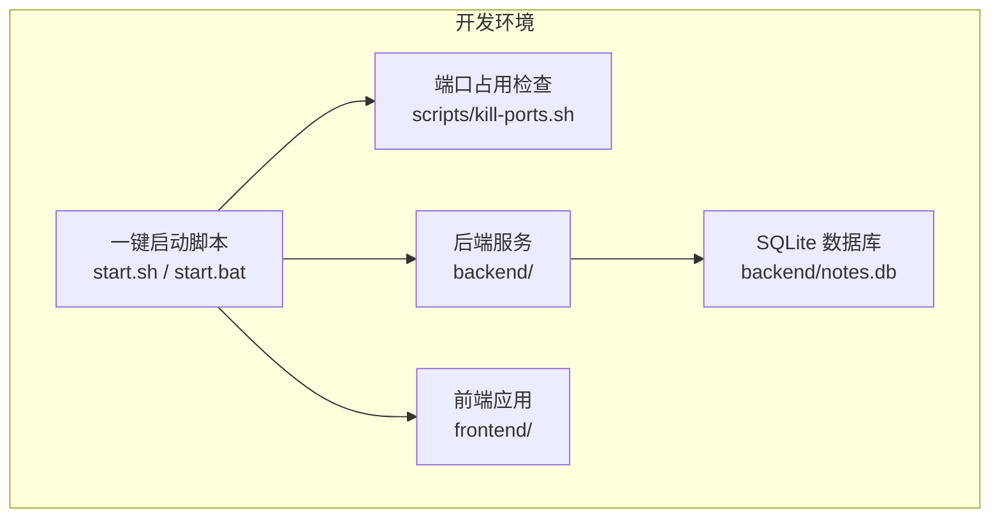
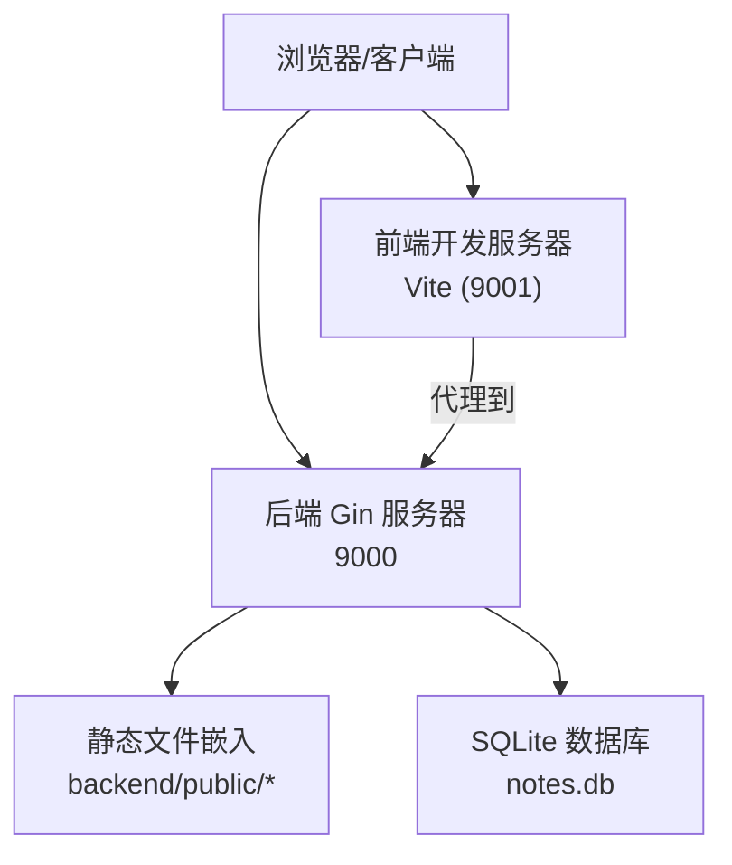
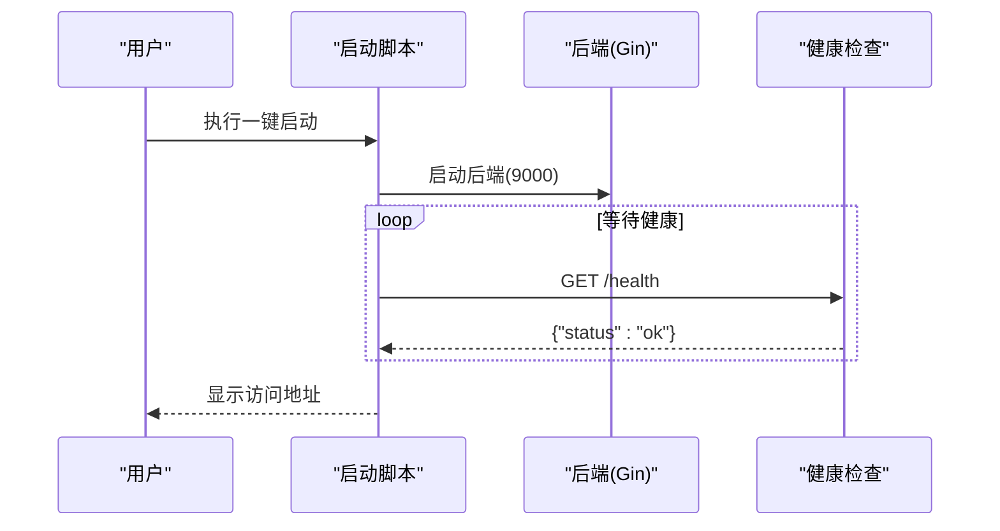
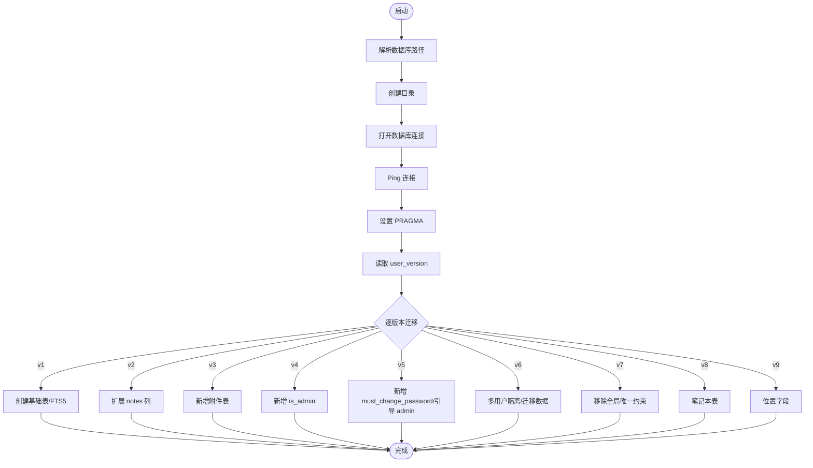
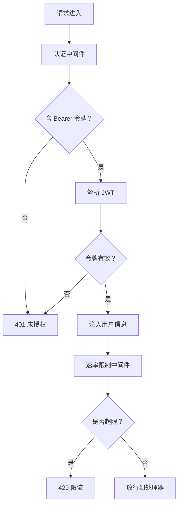
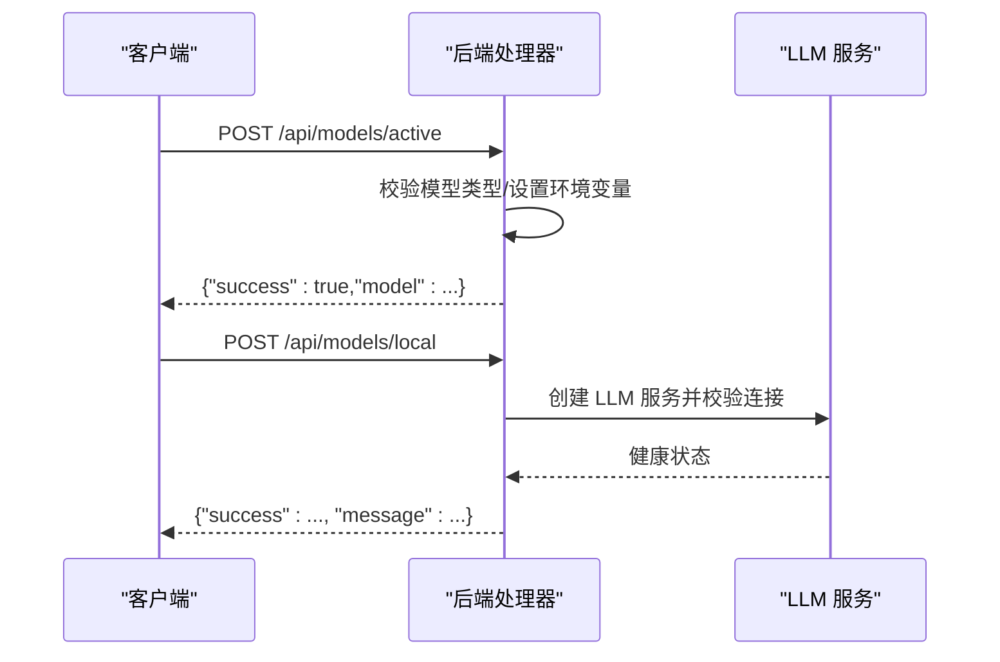
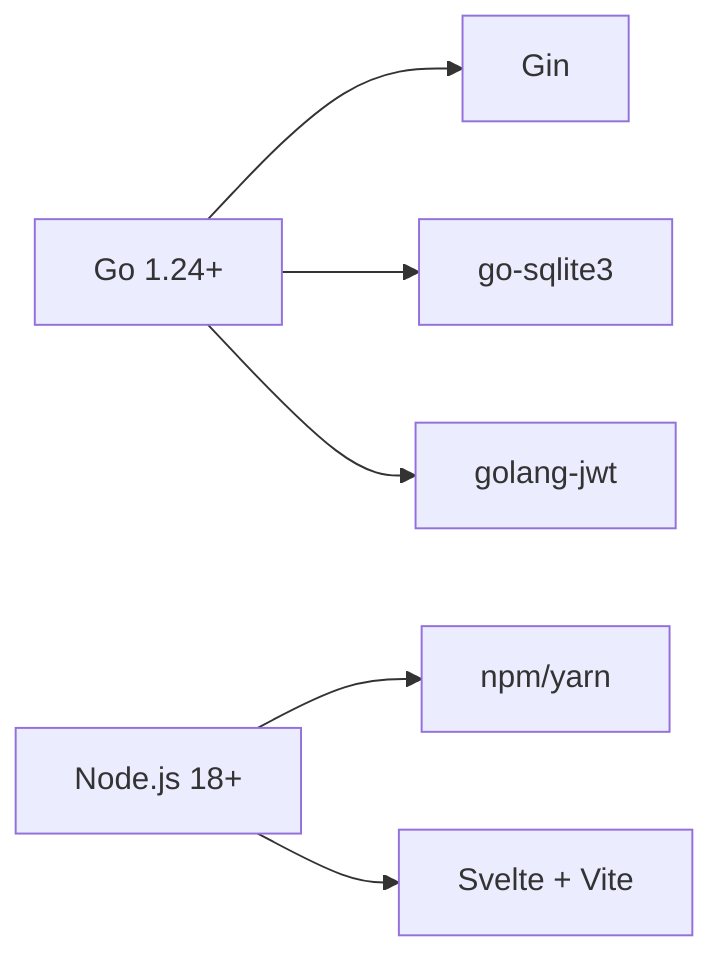
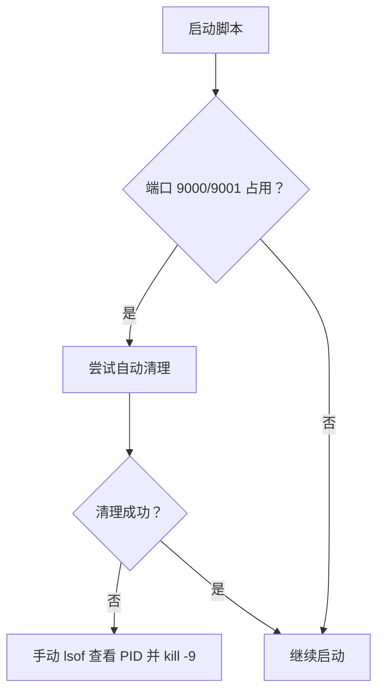

# 故障排除

<cite>
**本文引用的文件**
- [README.md](file://README.md)
- [start.sh](file://start.sh)
- [start.bat](file://start.bat)
- [scripts/kill-ports.sh](file://scripts/kill-ports.sh)
- [backend/install-deps.sh](file://backend/install-deps.sh)
- [backend/start-dev.sh](file://backend/start-dev.sh)
- [backend/.air.toml](file://backend/.air.toml)
- [backend/main.go](file://backend/main.go)
- [backend/database/database.go](file://backend/database/database.go)
- [backend/middleware/auth.go](file://backend/middleware/auth.go)
- [backend/middleware/ratelimit.go](file://backend/middleware/ratelimit.go)
- [backend/utils/jwt.go](file://backend/utils/jwt.go)
- [backend/utils/encryption.go](file://backend/utils/encryption.go)
- [backend/handlers/models.go](file://backend/handlers/models.go)
- [frontend/package.json](file://frontend/package.json)
</cite>

## 目录
1. [简介](#简介)
2. [项目结构](#项目结构)
3. [核心组件](#核心组件)
4. [架构总览](#架构总览)
5. [详细组件分析](#详细组件分析)
6. [依赖关系分析](#依赖关系分析)
7. [性能考虑](#性能考虑)
8. [故障排除指南](#故障排除指南)
9. [结论](#结论)
10. [附录](#附录)

## 简介
本指南面向 Memo Studio 的运维与开发人员，提供系统化的故障排除方法，覆盖端口占用、依赖安装失败、数据库问题、日志分析、性能诊断、环境问题排查、预防性维护以及紧急情况处理流程。文档结合项目实际代码与脚本，给出可操作的定位与修复步骤。

## 项目结构
Memo Studio 采用前后端分离架构：后端使用 Go + Gin + SQLite，前端使用 Svelte + Vite。一键启动脚本负责环境检查、依赖安装、端口清理、服务启动与健康检查，并分别输出后端与前端日志文件，便于快速定位问题。

图表来源
- [start.sh](file://start.sh#L71-L90)
- [scripts/kill-ports.sh](file://scripts/kill-ports.sh#L7-L19)
- [backend/main.go](file://backend/main.go#L319-L322)
- [backend/database/database.go](file://backend/database/database.go#L23-L33)

章节来源
- [README.md](file://README.md#L11-L56)
- [start.sh](file://start.sh#L29-L47)
- [frontend/package.json](file://frontend/package.json#L1-L25)

## 核心组件
- 后端服务（Go + Gin）：负责 API 路由、认证、限流、静态资源托管、健康检查与优雅关闭。
- 数据库（SQLite + FTS5）：自动初始化与迁移，支持多用户隔离、笔记本、位置等扩展字段。
- 前端应用（Svelte + Vite）：开发模式热更新，生产构建产物由后端托管。
- 一键启动脚本：自动化环境检查、依赖安装、端口清理、服务启动与健康检查。
- 中间件：认证与管理员权限、速率限制。
- 工具模块：JWT 令牌、加密与哈希、模型管理接口。

章节来源
- [backend/main.go](file://backend/main.go#L28-L353)
- [backend/database/database.go](file://backend/database/database.go#L20-L178)
- [backend/middleware/auth.go](file://backend/middleware/auth.go#L12-L71)
- [backend/middleware/ratelimit.go](file://backend/middleware/ratelimit.go#L11-L143)
- [backend/utils/jwt.go](file://backend/utils/jwt.go#L11-L76)
- [backend/utils/encryption.go](file://backend/utils/encryption.go#L16-L107)
- [backend/handlers/models.go](file://backend/handlers/models.go#L12-L371)
- [start.sh](file://start.sh#L124-L217)

## 架构总览
后端启动后，通过 Gin 注册路由组与中间件，静态文件由嵌入资源提供，SPA 回退至 index.html。前端通过 Vite 开发服务器提供热更新，生产模式下由后端托管构建产物。

图表来源
- [backend/main.go](file://backend/main.go#L25-L26)
- [backend/main.go](file://backend/main.go#L285-L316)
- [backend/main.go](file://backend/main.go#L319-L322)
- [backend/database/database.go](file://backend/database/database.go#L23-L33)

## 详细组件分析

### 后端启动与健康检查
- 端口与模式：默认监听 9000，生产模式可通过环境变量控制。
- 健康检查：公开端点返回服务状态。
- 优雅关闭：捕获信号，10 秒超时优雅停机。
- 日志：生产模式可开启恢复中间件与可选日志中间件。

图表来源
- [start.sh](file://start.sh#L134-L165)
- [backend/main.go](file://backend/main.go#L82-L85)
- [backend/main.go](file://backend/main.go#L319-L351)

章节来源
- [backend/main.go](file://backend/main.go#L28-L353)
- [start.sh](file://start.sh#L134-L165)

### 数据库初始化与迁移
- 初始化：解析数据库路径、创建目录、打开连接、Ping、设置 PRAGMA。
- 迁移：按版本逐步执行，包含 FTS5、扩展列、附件、管理员、多用户隔离、笔记本、位置等。
- FTS5：需构建标签启用，否则迁移阶段会报错。

图表来源
- [backend/database/database.go](file://backend/database/database.go#L20-L60)
- [backend/database/database.go](file://backend/database/database.go#L62-L178)
- [backend/database/database.go](file://backend/database/database.go#L243-L374)
- [backend/database/database.go](file://backend/database/database.go#L376-L406)
- [backend/database/database.go](file://backend/database/database.go#L408-L438)
- [backend/database/database.go](file://backend/database/database.go#L440-L452)
- [backend/database/database.go](file://backend/database/database.go#L454-L540)
- [backend/database/database.go](file://backend/database/database.go#L564-L591)
- [backend/database/database.go](file://backend/database/database.go#L593-L647)
- [backend/database/database.go](file://backend/database/database.go#L180-L209)
- [backend/database/database.go](file://backend/database/database.go#L211-L241)

章节来源
- [backend/database/database.go](file://backend/database/database.go#L20-L178)

### 认证与速率限制
- 认证中间件：从 Authorization 头解析 Bearer 令牌，解析失败或无效则拒绝。
- 管理员权限：基于上下文 isAdmin 判断。
- 速率限制：基于客户端 IP 的滑动窗口计数，默认每分钟 50 次，超限返回 429。

图表来源
- [backend/middleware/auth.go](file://backend/middleware/auth.go#L12-L52)
- [backend/middleware/ratelimit.go](file://backend/middleware/ratelimit.go#L96-L121)
- [backend/utils/jwt.go](file://backend/utils/jwt.go#L51-L66)

章节来源
- [backend/middleware/auth.go](file://backend/middleware/auth.go#L12-L71)
- [backend/middleware/ratelimit.go](file://backend/middleware/ratelimit.go#L11-L143)
- [backend/utils/jwt.go](file://backend/utils/jwt.go#L11-L76)

### 模型管理与本地服务健康检查
- 模型切换：设置环境变量并返回当前激活模型。
- 本地模型：添加自定义本地模型并进行健康检查。
- 可用模型：根据环境变量判断云端模型可用性。

图表来源
- [backend/handlers/models.go](file://backend/handlers/models.go#L60-L104)
- [backend/handlers/models.go](file://backend/handlers/models.go#L106-L138)
- [backend/handlers/models.go](file://backend/handlers/models.go#L140-L162)

章节来源
- [backend/handlers/models.go](file://backend/handlers/models.go#L12-L371)

## 依赖关系分析
- 后端依赖：Gin、CORS、JWT、SQLite 驱动、bcrypt。
- 前端依赖：Svelte、TailwindCSS、Vite 插件等。
- 一键启动脚本依赖：Go、Node.js、npm、lsof、curl。

图表来源
- [backend/go.mod](file://backend/go.mod#L5-L11)
- [frontend/package.json](file://frontend/package.json#L11-L23)
- [start.sh](file://start.sh#L29-L47)

章节来源
- [backend/go.mod](file://backend/go.mod#L1-L45)
- [frontend/package.json](file://frontend/package.json#L1-L25)
- [start.sh](file://start.sh#L29-L47)

## 性能考虑
- 数据库参数：启用外键、WAL 模式、busy_timeout，有助于并发与锁等待。
- FTS5：全文检索需构建标签启用，迁移阶段若失败会影响搜索性能。
- 速率限制：默认每分钟 50 次，可根据业务调整。
- 静态资源：生产模式由后端托管，减少跨域与额外请求。
- 热重载：后端使用 Air，前端 Vite HMR，提升开发效率。

章节来源
- [backend/database/database.go](file://backend/database/database.go#L45-L52)
- [backend/.air.toml](file://backend/.air.toml#L8-L11)
- [backend/middleware/ratelimit.go](file://backend/middleware/ratelimit.go#L96-L121)
- [backend/main.go](file://backend/main.go#L285-L316)

## 故障排除指南

### 一、端口占用
- 现象：启动后端或前端时报端口被占用。
- 快速清理：使用一键启动脚本内置的端口检查逻辑，或执行专用脚本。
- 手动排查：使用 lsof 查看占用进程，确认 PID 后终止。

图表来源
- [start.sh](file://start.sh#L71-L90)
- [scripts/kill-ports.sh](file://scripts/kill-ports.sh#L7-L33)

章节来源
- [start.sh](file://start.sh#L71-L90)
- [scripts/kill-ports.sh](file://scripts/kill-ports.sh#L1-L34)

### 二、依赖安装失败
- Go 依赖：
  - 设置国内代理后重试，若仍失败，使用备用代理或手动设置 GOPROXY。
  - 清理缓存后重新 go mod download 与 go mod tidy。
- 前端依赖：
  - 删除 node_modules 与 lock 文件后重新安装。
  - 确认 npm/yarn 可用。

章节来源
- [backend/install-deps.sh](file://backend/install-deps.sh#L18-L42)
- [start.sh](file://start.sh#L179-L186)

### 三、数据库问题
- 症状：启动失败、迁移异常、FTS5 相关错误。
- 排查步骤：
  - 检查数据库路径与权限，确认目录存在且可写。
  - 查看 notes.db、wal、shm 文件是否存在与权限正确。
  - 若迁移失败，检查 user_version 与各版本迁移逻辑。
  - 若启用 FTS5，确认构建标签已启用；否则迁移阶段会报错。
- 修复建议：
  - 删除数据库文件后重启，系统会在首次运行自动重建。
  - 确保 SQLite 版本与驱动兼容。

章节来源
- [backend/database/database.go](file://backend/database/database.go#L20-L60)
- [backend/database/database.go](file://backend/database/database.go#L62-L178)
- [README.md](file://README.md#L477-L485)

### 四、日志分析方法
- 后端日志：一键启动脚本将后端输出重定向到 backend.log，启动超时会打印最后若干行。
- 前端日志：一键启动脚本将前端输出重定向到 frontend.log，启动超时会打印最后若干行。
- 日志查看：
  - 使用 tail -f 实时跟踪日志。
  - 关注启动阶段的 panic、panic: interface conversion、database initialization failed 等关键字。
- 建议：
  - 生产环境建议开启 Gin Logger（非 release 模式）以便更详细日志。
  - 出现 429 限流时，检查客户端行为与速率限制配置。

章节来源
- [start.sh](file://start.sh#L124-L173)
- [start.sh](file://start.sh#L188-L217)
- [backend/main.go](file://backend/main.go#L39-L44)

### 五、性能诊断工具与方法
- 端到端健康检查：调用 /health 确认服务可用。
- 速率限制：关注 429 返回与 Retry-After 头，评估客户端并发策略。
- 数据库健康：
  - 检查 PRAGMA 设置是否生效（foreign_keys、journal_mode、busy_timeout）。
  - 观察迁移过程中的错误，尤其是 FTS5 相关。
- 前端性能：
  - 开发模式下 Vite HMR 应即时生效；若不生效，检查浏览器控制台与网络面板。
  - 生产构建后，检查静态资源加载与回退逻辑。

章节来源
- [backend/main.go](file://backend/main.go#L82-L85)
- [backend/middleware/ratelimit.go](file://backend/middleware/ratelimit.go#L96-L121)
- [backend/database/database.go](file://backend/database/database.go#L45-L52)

### 六、环境问题排查
- 环境变量：
  - 生产必须设置 MEMO_JWT_SECRET；未设置会导致启动失败。
  - CORS 白名单 MEMO_CORS_ORIGINS 建议在生产设置。
  - 数据库路径 MEMO_DB_PATH、存储目录 MEMO_STORAGE_DIR。
- 权限问题：
  - 确保 notes.db 与 storage 目录具备读写权限。
  - 后端进程用户对数据库文件与目录有足够权限。
- 版本冲突：
  - Go 1.24+、Node.js 18+；npm/yarn 可用。
  - 构建标签 sqlite_fts5 与 SQLite 驱动版本匹配。

章节来源
- [backend/utils/jwt.go](file://backend/utils/jwt.go#L13-L20)
- [backend/main.go](file://backend/main.go#L55-L80)
- [backend/main.go](file://backend/main.go#L324-L329)
- [README.md](file://README.md#L121-L128)

### 七、系统性问题排查流程
- 复现问题：记录现象、时间、操作步骤。
- 收集证据：截图、日志片段、环境变量快照。
- 分类定位：
  - 端口/依赖：使用端口脚本与安装脚本辅助。
  - 数据库：检查路径、权限、迁移日志。
  - 认证/限流：核对 Authorization 头、速率限制阈值。
  - 模型：检查环境变量与本地服务连通性。
- 修复验证：最小化变更逐一验证，记录结果。
- 文档化：更新知识库，形成标准流程。

章节来源
- [scripts/kill-ports.sh](file://scripts/kill-ports.sh#L1-L34)
- [backend/install-deps.sh](file://backend/install-deps.sh#L1-L43)
- [backend/database/database.go](file://backend/database/database.go#L20-L60)
- [backend/middleware/auth.go](file://backend/middleware/auth.go#L12-L52)
- [backend/middleware/ratelimit.go](file://backend/middleware/ratelimit.go#L96-L121)
- [backend/handlers/models.go](file://backend/handlers/models.go#L60-L104)

### 八、预防性维护措施
- 定期检查：
  - 数据库文件完整性与容量增长趋势。
  - 日志轮转与磁盘空间。
- 健康监控：
  - 定时调用 /health，记录可用性。
  - 监控 429 与错误率。
- 备份策略：
  - 备份 notes.db 与 storage 目录。
  - 备份配置文件与环境变量清单。

章节来源
- [backend/main.go](file://backend/main.go#L82-L85)

### 九、紧急情况处理流程
- 服务中断：
  - 快速检查后端进程与端口占用，必要时重启。
  - 查看 backend.log 与系统日志，定位崩溃原因。
- 数据丢失：
  - 立即停止写入，检查 notes.db 与 wal/ shm。
  - 从最近备份恢复，核对数据一致性。
- 安全事件：
  - 立即轮换 MEMO_JWT_SECRET。
  - 检查认证中间件与速率限制是否生效。
  - 审计日志与访问记录，阻断可疑来源。

章节来源
- [backend/utils/jwt.go](file://backend/utils/jwt.go#L13-L20)
- [backend/middleware/auth.go](file://backend/middleware/auth.go#L12-L52)
- [backend/middleware/ratelimit.go](file://backend/middleware/ratelimit.go#L96-L121)

## 结论
通过一键启动脚本、完善的日志输出、明确的环境变量与中间件机制，Memo Studio 提供了清晰的故障定位路径。遵循本文提供的系统化排查流程与预防性维护建议，可显著降低故障影响面并提升系统稳定性。

## 附录
- 常用命令参考：
  - lsof -i :9000/9001
  - go mod download / tidy
  - npm install
  - tail -f backend.log / frontend.log
- 常见错误提示定位：
  - 数据库初始化失败、panic: interface conversion、FTS5 相关错误、429 Too Many Requests、401/403 权限错误。