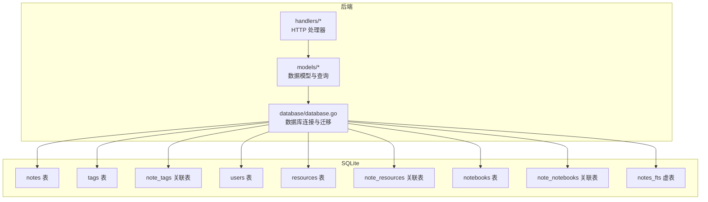
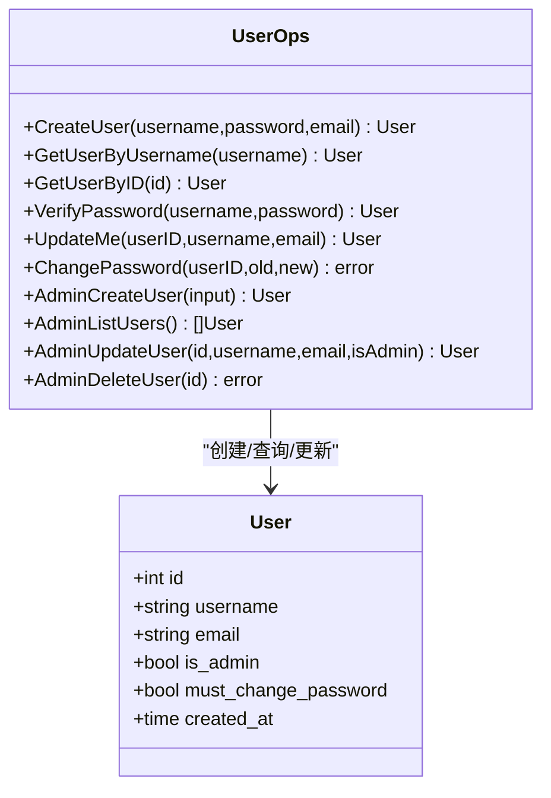
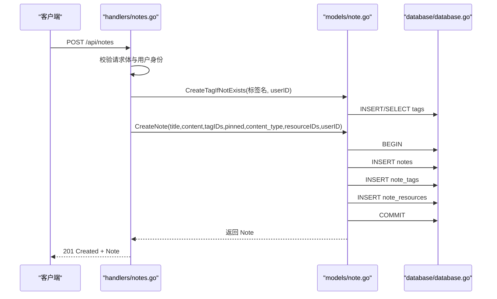
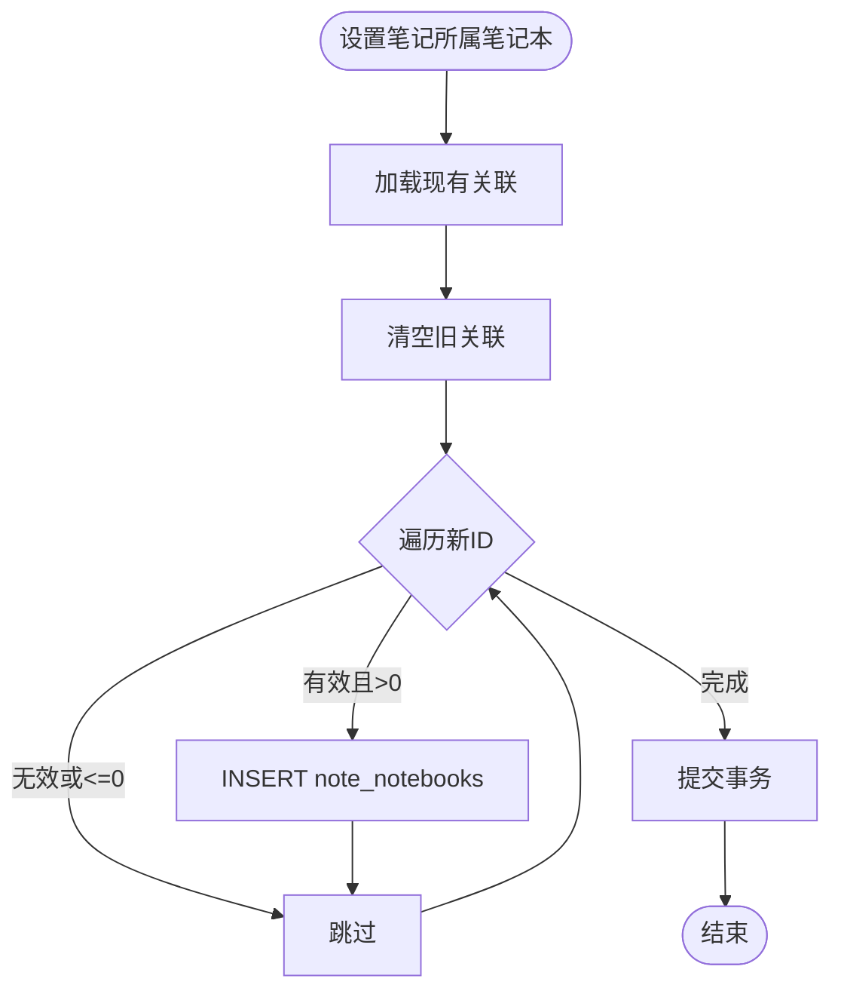
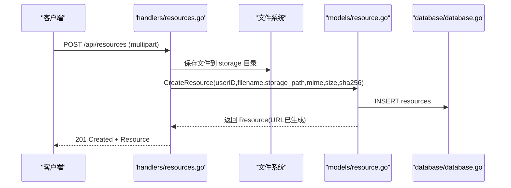
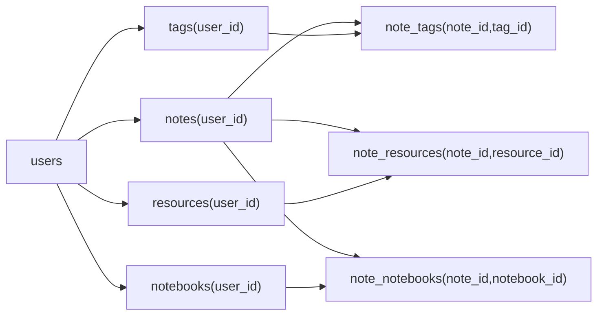

# 数据模型设计

<cite>
**本文档引用的文件**
- [backend/models/user.go](file://backend/models/user.go)
- [backend/models/note.go](file://backend/models/note.go)
- [backend/models/notebook.go](file://backend/models/notebook.go)
- [backend/models/resource.go](file://backend/models/resource.go)
- [backend/models/stats.go](file://backend/models/stats.go)
- [backend/models/memo_query.go](file://backend/models/memo_query.go)
- [backend/database/database.go](file://backend/database/database.go)
- [backend/handlers/notes.go](file://backend/handlers/notes.go)
- [backend/handlers/notebooks.go](file://backend/handlers/notebooks.go)
- [backend/handlers/resources.go](file://backend/handlers/resources.go)
- [backend/handlers/users.go](file://backend/handlers/users.go)
- [backend/handlers/stats.go](file://backend/handlers/stats.go)
- [server/db/init.sql](file://server/db/init.sql)
</cite>

## 目录
1. [简介](#简介)
2. [项目结构](#项目结构)
3. [核心组件](#核心组件)
4. [架构总览](#架构总览)
5. [详细组件分析](#详细组件分析)
6. [依赖关系分析](#依赖关系分析)
7. [性能考量](#性能考量)
8. [故障排查指南](#故障排查指南)
9. [结论](#结论)
10. [附录](#附录)

## 简介
本文件系统性梳理 Memo Studio 的数据模型设计，覆盖用户、笔记、笔记本、资源、统计等核心实体，阐明实体间关系（一对一、一对多、多对多）、字段定义与数据类型选择、索引与约束策略、数据验证与业务规则、数据库迁移路径与版本管理，以及数据访问模式与性能优化建议。文档旨在帮助开发者快速理解并高效扩展数据层。

## 项目结构
- 数据层位于 backend/database，负责数据库连接、初始化与迁移。
- 模型层位于 backend/models，封装数据实体与 CRUD、查询逻辑。
- 处理器层位于 backend/handlers，暴露 REST API 并调用模型层。
- 服务器端早期初始化脚本位于 server/db/init.sql（兼容旧版本）。



图表来源
- [backend/database/database.go](file://backend/database/database.go#L20-L178)
- [backend/models/note.go](file://backend/models/note.go#L1-L105)
- [backend/models/notebook.go](file://backend/models/notebook.go#L1-L206)
- [backend/models/resource.go](file://backend/models/resource.go#L1-L187)
- [backend/models/user.go](file://backend/models/user.go#L1-L233)

章节来源
- [backend/database/database.go](file://backend/database/database.go#L20-L178)
- [backend/models/note.go](file://backend/models/note.go#L1-L105)
- [backend/models/notebook.go](file://backend/models/notebook.go#L1-L206)
- [backend/models/resource.go](file://backend/models/resource.go#L1-L187)
- [backend/models/user.go](file://backend/models/user.go#L1-L233)

## 核心组件
- 用户模型（User）：身份认证、权限控制、密码加密与变更。
- 笔记模型（Note）：笔记正文、标题、内容类型、置顶、位置信息、标签与资源关联。
- 笔记本模型（Notebook）：用户私有笔记本容器，支持排序与计数。
- 资源模型（Resource）：附件元数据与 URL 生成，支持用户隔离。
- 统计模型（UserStats）：用户维度的统计指标。
- 查询模型（MemoQuery）：统一的笔记查询构建器，支持全文检索、标签过滤、时间范围、置顶优先等。

章节来源
- [backend/models/user.go](file://backend/models/user.go#L13-L20)
- [backend/models/note.go](file://backend/models/note.go#L11-L27)
- [backend/models/notebook.go](file://backend/models/notebook.go#L10-L19)
- [backend/models/resource.go](file://backend/models/resource.go#L10-L20)
- [backend/models/stats.go](file://backend/models/stats.go#L7-L16)
- [backend/models/memo_query.go](file://backend/models/memo_query.go#L12-L22)

## 架构总览
- 数据库采用 SQLite，通过迁移机制逐步演进 schema 版本。
- FTS5 全文检索通过虚拟表与触发器维护一致性。
- 多用户隔离通过 user_id 字段与 per-user 唯一索引实现。
- 笔记与标签、笔记与资源、笔记与笔记本之间通过关联表实现多对多。

```mermaid
erDiagram
USERS {
integer id PK
text username UK
text password
text email
boolean is_admin
boolean must_change_password
datetime created_at
}
NOTES {
integer id PK
integer user_id FK
text title
text content
boolean pinned
text content_type
text location
real latitude
real longitude
datetime created_at
datetime updated_at
}
TAGS {
integer id PK
integer user_id FK
text name
text color
datetime created_at
}
NOTE_TAGS {
integer note_id FK
integer tag_id FK
primary key (note_id, tag_id)
}
RESOURCES {
integer id PK
integer user_id FK
text filename
text storage_path
text mime_type
integer size
text sha256
datetime created_at
}
NOTE_RESOURCES {
integer note_id FK
integer resource_id FK
primary key (note_id, resource_id)
}
NOTEBOOKS {
integer id PK
integer user_id FK
text name
text color
integer sort_order
datetime created_at
datetime updated_at
}
NOTE_NOTEBOOKS {
integer note_id FK
integer notebook_id FK
primary key (note_id, notebook_id)
}
NOTES }o--|| USERS : "属于"
NOTES }o--o{ TAGS : "通过 note_tags 关联"
NOTES }o--o{ RESOURCES : "通过 note_resources 关联"
NOTES }o--o{ NOTEBOOKS : "通过 note_notebooks 关联"
TAGS }o--|| USERS : "属于"
RESOURCES }o--|| USERS : "属于"
NOTEBOOKS }o--|| USERS : "属于"
```

图表来源
- [backend/database/database.go](file://backend/database/database.go#L243-L374)
- [backend/database/database.go](file://backend/database/database.go#L408-L438)
- [backend/database/database.go](file://backend/database/database.go#L180-L209)
- [backend/database/database.go](file://backend/database/database.go#L212-L241)

## 详细组件分析

### 用户模型（User）
- 字段设计
  - 主键：自增整数 id
  - 唯一约束：username
  - 扩展字段：email、is_admin、must_change_password、created_at
- 认证与授权
  - 登录验证：bcrypt 校验密码
  - 权限：is_admin 控制管理员能力
  - 安全：must_change_password 强制首次登录修改密码
- 数据访问
  - 创建用户：密码加密后入库
  - 更新个人信息：用户名非空校验
  - 修改密码：旧密码校验、新密码长度校验
  - 管理员操作：创建/更新/删除用户（防误删默认管理员）



图表来源
- [backend/models/user.go](file://backend/models/user.go#L13-L20)
- [backend/models/user.go](file://backend/models/user.go#L22-L233)

章节来源
- [backend/models/user.go](file://backend/models/user.go#L13-L20)
- [backend/models/user.go](file://backend/models/user.go#L22-L233)

### 笔记模型（Note）
- 字段设计
  - 主键：自增整数 id
  - 外键：user_id（可空，兼容历史数据）
  - 内容：title、content、content_type（默认 markdown）
  - 行为：pinned（置顶）
  - 位置：location、latitude、longitude
  - 时间：created_at、updated_at
- 关联关系
  - 标签：多对多（note_tags）
  - 资源：多对多（note_resources）
  - 笔记本：多对多（note_notebooks）
- 查询与操作
  - 创建/更新/删除：事务保证标签与资源关联的一致性
  - 搜索：FTS5 全文检索（notes_fts），支持 bm25 排序
  - 随机回顾：按用户隔离、可按标签与时间窗口过滤
  - 标签聚合：统计标签使用次数



图表来源
- [backend/handlers/notes.go](file://backend/handlers/notes.go#L175-L230)
- [backend/models/note.go](file://backend/models/note.go#L46-L105)
- [backend/database/database.go](file://backend/database/database.go#L63-L178)

章节来源
- [backend/models/note.go](file://backend/models/note.go#L11-L27)
- [backend/models/note.go](file://backend/models/note.go#L46-L105)
- [backend/models/note.go](file://backend/models/note.go#L107-L168)
- [backend/models/note.go](file://backend/models/note.go#L329-L392)
- [backend/models/note.go](file://backend/models/note.go#L439-L516)

### 笔记本模型（Notebook）
- 字段设计
  - 主键：自增整数 id
  - 外键：user_id（用户隔离）
  - 属性：name、color、sort_order
  - 时间：created_at、updated_at
  - 统计：NoteCount（通过 JOIN 计算）
- 关联关系
  - 多对多：与笔记通过 note_notebooks 关联
- 数据访问
  - 列表：按 sort_order 与 id 升序
  - 获取：支持计算笔记数量
  - 创建/更新/删除：事务保证关联一致性
  - 批量设置：SetNoteNotebooks 支持批量重排



图表来源
- [backend/models/notebook.go](file://backend/models/notebook.go#L130-L150)

章节来源
- [backend/models/notebook.go](file://backend/models/notebook.go#L10-L19)
- [backend/models/notebook.go](file://backend/models/notebook.go#L21-L46)
- [backend/models/notebook.go](file://backend/models/notebook.go#L48-L65)
- [backend/models/notebook.go](file://backend/models/notebook.go#L67-L83)
- [backend/models/notebook.go](file://backend/models/notebook.go#L85-L106)
- [backend/models/notebook.go](file://backend/models/notebook.go#L108-L111)
- [backend/models/notebook.go](file://backend/models/notebook.go#L113-L128)
- [backend/models/notebook.go](file://backend/models/notebook.go#L130-L150)
- [backend/models/notebook.go](file://backend/models/notebook.go#L152-L194)
- [backend/models/notebook.go](file://backend/models/notebook.go#L196-L206)

### 资源模型（Resource）
- 字段设计
  - 主键：自增整数 id
  - 外键：user_id（可空，兼容历史数据）
  - 元数据：filename、storage_path、mime_type、size、sha256
  - URL：基于 storage_path 生成 /uploads/... 路径
- 数据访问
  - 上传：生成安全文件名与随机后缀，SHA256 校验，入库
  - 列表：按用户分页查询
  - 删除：仅删除记录，物理文件由定时任务清理



图表来源
- [backend/handlers/resources.go](file://backend/handlers/resources.go#L91-L155)
- [backend/models/resource.go](file://backend/models/resource.go#L36-L56)
- [backend/database/database.go](file://backend/database/database.go#L63-L178)

章节来源
- [backend/models/resource.go](file://backend/models/resource.go#L10-L20)
- [backend/models/resource.go](file://backend/models/resource.go#L36-L56)
- [backend/models/resource.go](file://backend/models/resource.go#L58-L76)
- [backend/models/resource.go](file://backend/models/resource.go#L78-L109)
- [backend/models/resource.go](file://backend/models/resource.go#L117-L169)
- [backend/models/resource.go](file://backend/models/resource.go#L171-L187)
- [backend/handlers/resources.go](file://backend/handlers/resources.go#L91-L155)

### 统计模型（UserStats）
- 指标
  - 笔记总数、标签总数、资源总数、笔记本总数
  - 置顶笔记数
  - 近7天创建/更新笔记数
- 实现
  - 基于 user_id 进行聚合统计
  - 历史数据兼容：notes.user_id 可为空

章节来源
- [backend/models/stats.go](file://backend/models/stats.go#L7-L16)
- [backend/models/stats.go](file://backend/models/stats.go#L18-L65)

### 查询模型（MemoQuery）
- 功能
  - 统一构建笔记查询：支持全文检索、标签过滤、时间范围、置顶优先、分页
  - FTS5：当存在搜索词时自动切换到 notes_fts JOIN
  - 标签去重：多标签查询时使用 DISTINCT
- 参数
  - Limit/Offset、Q（全文检索）、Tags、From/To、Pinned、ContentType、UserID

章节来源
- [backend/models/memo_query.go](file://backend/models/memo_query.go#L12-L22)
- [backend/models/memo_query.go](file://backend/models/memo_query.go#L24-L152)
- [backend/models/memo_query.go](file://backend/models/memo_query.go#L154-L217)

## 依赖关系分析
- 模块耦合
  - models 层依赖 database 层提供的 DB 连接与迁移
  - handlers 层依赖 models 层进行业务操作
- 外键与约束
  - notes.user_id、tags.user_id、resources.user_id、notebooks.user_id 支持用户隔离
  - note_tags、note_resources、note_notebooks 三张关联表均定义主键与外键，CASCADE 删除保证级联清理
- 索引策略
  - notebooks(user_id)、note_notebooks(notebook_id) 用于高效查询笔记本下的笔记
  - tags 增加 per-user 唯一索引 (user_id, name)，避免全局唯一带来的冲突
  - notes_fts 虚表配合触发器维护全文检索一致性



图表来源
- [backend/database/database.go](file://backend/database/database.go#L243-L374)
- [backend/database/database.go](file://backend/database/database.go#L408-L438)
- [backend/database/database.go](file://backend/database/database.go#L180-L209)
- [backend/database/database.go](file://backend/database/database.go#L212-L241)

章节来源
- [backend/database/database.go](file://backend/database/database.go#L243-L374)
- [backend/database/database.go](file://backend/database/database.go#L408-L438)
- [backend/database/database.go](file://backend/database/database.go#L180-L209)
- [backend/database/database.go](file://backend/database/database.go#L212-L241)

## 性能考量
- SQLite 优化
  - 开启外键约束、WAL 日志模式、busy_timeout
  - 使用 PRAGMA user_version 管理迁移版本，避免并发 schema 可见性问题
- 查询优化
  - FTS5 虚表 + 触发器：全文检索与数据一致性
  - 分页限制：默认 50，最大 200，避免大偏移
  - 标签多表 JOIN：使用 DISTINCT 避免重复行
- 写入优化
  - 事务包裹：创建/更新笔记时批量写入 note_tags 与 note_resources
  - 批量删除：IN 子句 + 参数绑定，减少多次往返
- 缓存策略
  - 当前未实现应用层缓存；建议对热点查询（如标签聚合、笔记本计数）引入短期缓存
- I/O 优化
  - 附件上传采用流式写入与 SHA256 校验，避免重复存储

章节来源
- [backend/database/database.go](file://backend/database/database.go#L45-L52)
- [backend/models/memo_query.go](file://backend/models/memo_query.go#L24-L96)
- [backend/models/note.go](file://backend/models/note.go#L46-L105)
- [backend/handlers/notes.go](file://backend/handlers/notes.go#L322-L353)

## 故障排查指南
- 用户相关
  - 用户名重复：更新/创建用户时报 UNIQUE 冲突，提示用户名已存在
  - 旧默认密码：检测 admin 使用 admin123，强制 must_change_password=1
- 笔记相关
  - 标题与内容同时为空：创建/更新笔记时拒绝
  - 笔记不存在或无权访问：校验 user_id 与笔记归属
- 资源相关
  - 文件大小超限：上传接口限制 20MB
  - 删除失败：若返回 sql.ErrNoRows，表示资源不存在或无权删除
- 数据库相关
  - FTS5 未启用：编译时需 sqlite_fts5 标签；迁移中会尝试创建 notes_fts，失败时需启用相应构建标签

章节来源
- [backend/handlers/users.go](file://backend/handlers/users.go#L64-L70)
- [backend/database/database.go](file://backend/database/database.go#L454-L540)
- [backend/handlers/notes.go](file://backend/handlers/notes.go#L191-L194)
- [backend/handlers/notes.go](file://backend/handlers/notes.go#L113-L129)
- [backend/handlers/resources.go](file://backend/handlers/resources.go#L95-L101)
- [backend/handlers/resources.go](file://backend/handlers/resources.go#L186-L193)
- [backend/database/database.go](file://backend/database/database.go#L254-L276)

## 结论
Memo Studio 的数据模型以 SQLite 为基础，通过多版本迁移与外键约束实现了清晰的用户隔离与实体关系。笔记、标签、资源、笔记本四类核心实体通过关联表形成灵活的多对多关系，配合 FTS5 提供高效的全文检索。整体设计兼顾易用性与扩展性，建议在生产环境中关注 FTS5 编译支持、缓存策略与大分页性能优化。

## 附录

### 数据库迁移与版本管理
- 迁移流程
  - 读取 PRAGMA user_version，按版本顺序执行迁移
  - 每个版本负责创建/变更表结构与索引
  - 成功后设置 user_version 到目标版本
- 版本演进要点
  - v1：基础 notes/tags/users + FTS5 虚表与触发器
  - v2：notes 扩展 pinned/content_type/user_id
  - v3：resources 与 note_resources 关联表
  - v4：users 增加 is_admin
  - v5：users 增加 must_change_password，并引导默认管理员初始化
  - v6：tags 增加 user_id 并迁移历史数据
  - v7：移除 tags.name 全局唯一，改为 (user_id,name) 唯一
  - v8：notebooks 与 note_notebooks
  - v9：notes 增加 location/latitude/longitude

章节来源
- [backend/database/database.go](file://backend/database/database.go#L63-L178)
- [backend/database/database.go](file://backend/database/database.go#L243-L374)
- [backend/database/database.go](file://backend/database/database.go#L376-L406)
- [backend/database/database.go](file://backend/database/database.go#L408-L438)
- [backend/database/database.go](file://backend/database/database.go#L440-L452)
- [backend/database/database.go](file://backend/database/database.go#L454-L540)
- [backend/database/database.go](file://backend/database/database.go#L564-L591)
- [backend/database/database.go](file://backend/database/database.go#L593-L647)
- [backend/database/database.go](file://backend/database/database.go#L180-L209)
- [backend/database/database.go](file://backend/database/database.go#L212-L241)

### 早期初始化脚本（兼容）
- server/db/init.sql 提供早期 users 表示例，便于理解历史演进

章节来源
- [server/db/init.sql](file://server/db/init.sql#L1-L19)