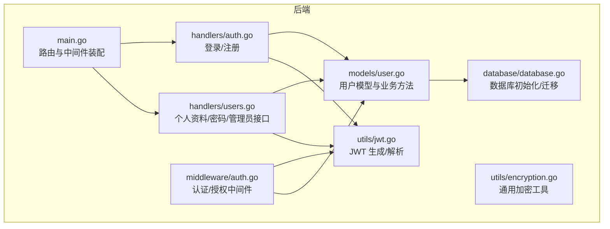
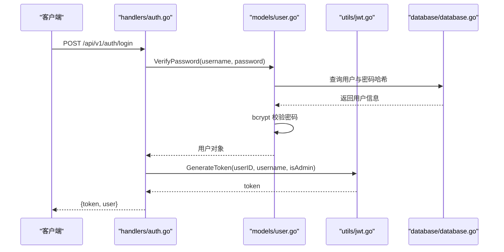
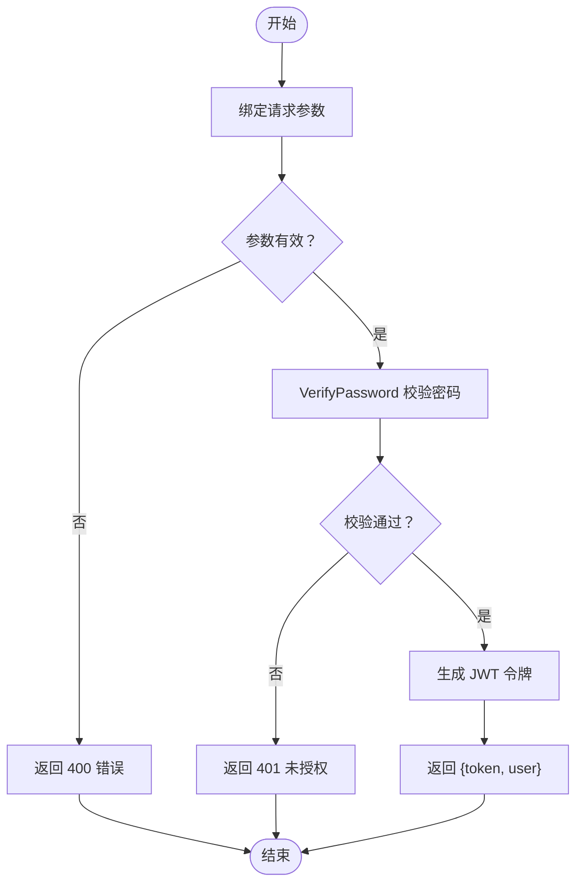
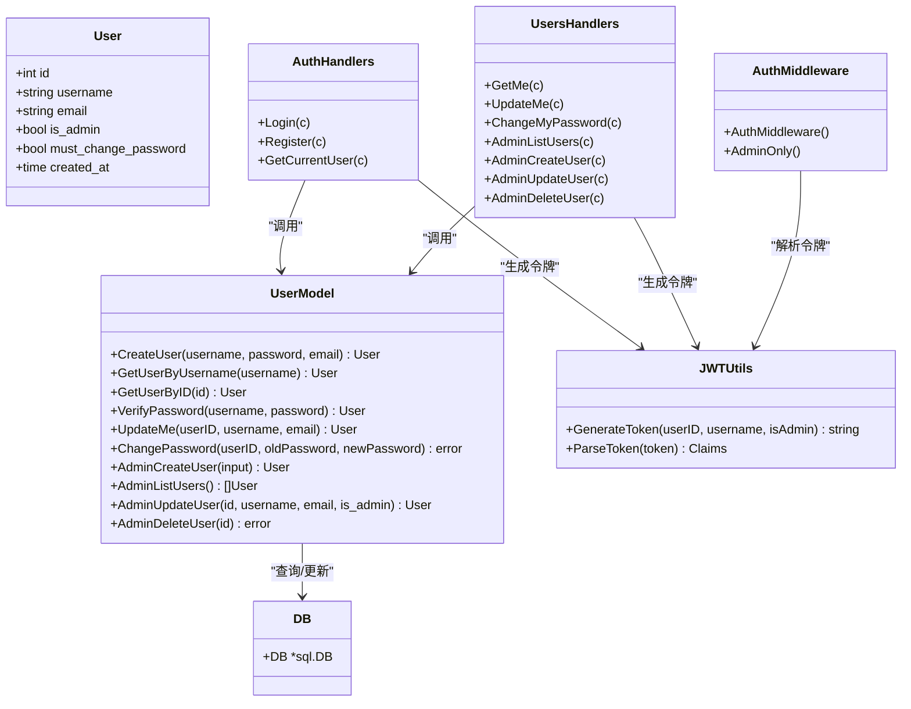

# 用户模型

<cite>
**本文引用的文件**
- [backend/models/user.go](file://backend/models/user.go)
- [backend/handlers/users.go](file://backend/handlers/users.go)
- [backend/handlers/auth.go](file://backend/handlers/auth.go)
- [backend/middleware/auth.go](file://backend/middleware/auth.go)
- [backend/utils/jwt.go](file://backend/utils/jwt.go)
- [backend/utils/encryption.go](file://backend/utils/encryption.go)
- [backend/database/database.go](file://backend/database/database.go)
- [backend/main.go](file://backend/main.go)
</cite>

## 目录
1. [简介](#简介)
2. [项目结构](#项目结构)
3. [核心组件](#核心组件)
4. [架构总览](#架构总览)
5. [详细组件分析](#详细组件分析)
6. [依赖关系分析](#依赖关系分析)
7. [性能考量](#性能考量)
8. [故障排查指南](#故障排查指南)
9. [结论](#结论)
10. [附录](#附录)

## 简介
本文件系统化梳理后端用户模型的设计与实现，覆盖以下方面：
- 用户实体字段与数据类型选择
- 用户认证流程（登录、注册、密码修改）
- 管理员能力（用户列表、新增、更新、删除）
- 数据验证规则、安全考虑与性能优化建议
- 使用示例与最佳实践

## 项目结构
用户模型位于后端 Go 代码中，采用分层架构：
- handlers 层：HTTP 请求处理与参数绑定
- models 层：领域模型与数据库交互
- middleware 层：认证与授权中间件
- utils 层：JWT 令牌生成与解析、通用加密工具
- database 层：数据库初始化与迁移

图表来源
- [backend/main.go](file://backend/main.go#L94-L196)
- [backend/handlers/auth.go](file://backend/handlers/auth.go#L27-L93)
- [backend/handlers/users.go](file://backend/handlers/users.go#L37-L171)
- [backend/models/user.go](file://backend/models/user.go#L22-L232)
- [backend/middleware/auth.go](file://backend/middleware/auth.go#L12-L70)
- [backend/utils/jwt.go](file://backend/utils/jwt.go#L29-L66)
- [backend/utils/encryption.go](file://backend/utils/encryption.go#L16-L106)
- [backend/database/database.go](file://backend/database/database.go#L20-L178)

章节来源
- [backend/main.go](file://backend/main.go#L94-L196)

## 核心组件
- 用户实体 User：包含标识、凭证信息、权限与创建时间等字段
- 认证与授权：基于 JWT 的认证中间件与管理员权限控制
- 数据访问：封装了用户查询、创建、密码校验、更新与删除等方法
- 安全工具：bcrypt 密码哈希、JWT 令牌签发与解析

章节来源
- [backend/models/user.go](file://backend/models/user.go#L13-L20)
- [backend/handlers/auth.go](file://backend/handlers/auth.go#L27-L93)
- [backend/middleware/auth.go](file://backend/middleware/auth.go#L12-L70)
- [backend/utils/jwt.go](file://backend/utils/jwt.go#L22-L66)

## 架构总览
用户相关的关键调用链如下：

图表来源
- [backend/handlers/auth.go](file://backend/handlers/auth.go#L27-L53)
- [backend/models/user.go](file://backend/models/user.go#L78-L110)
- [backend/utils/jwt.go](file://backend/utils/jwt.go#L29-L49)
- [backend/database/database.go](file://backend/database/database.go#L440-L540)

## 详细组件分析

### 用户实体与字段设计
- 字段与类型
  - ID：整型，唯一标识
  - Username：字符串，唯一约束
  - Email：字符串，非唯一
  - IsAdmin：布尔值，管理员标志
  - MustChangePassword：布尔值，是否需要修改密码
  - CreatedAt：时间戳，记录创建时间
- 设计要点
  - 使用 SQLite 主键自增 ID，配合唯一索引保证用户名唯一
  - is_admin 与 must_change_password 作为权限与安全策略的开关
  - CreatedAt 便于审计与统计

章节来源
- [backend/models/user.go](file://backend/models/user.go#L13-L20)
- [backend/database/database.go](file://backend/database/database.go#L299-L307)

### 认证与登录流程
- 登录
  - 参数绑定与基本校验
  - 调用 VerifyPassword 校验用户名与密码
  - 成功后生成 JWT 令牌并返回用户信息
- 注册
  - 参数校验用户名与密码长度
  - 调用 CreateUser 插入用户并返回用户信息
  - 生成 JWT 令牌

图表来源
- [backend/handlers/auth.go](file://backend/handlers/auth.go#L27-L53)
- [backend/models/user.go](file://backend/models/user.go#L78-L110)
- [backend/utils/jwt.go](file://backend/utils/jwt.go#L29-L49)

章节来源
- [backend/handlers/auth.go](file://backend/handlers/auth.go#L27-L93)

### 密码加密与校验
- 密码加密
  - 使用 bcrypt 对明文密码进行哈希，成本参数为默认值
  - 注册与管理员创建用户时均进行哈希
- 密码校验
  - 登录时从数据库读取哈希值并使用 bcrypt 校验
  - 修改密码时先校验旧密码，再生成新哈希并更新

章节来源
- [backend/models/user.go](file://backend/models/user.go#L23-L44)
- [backend/models/user.go](file://backend/models/user.go#L78-L110)
- [backend/models/user.go](file://backend/models/user.go#L128-L149)
- [backend/utils/encryption.go](file://backend/utils/encryption.go#L93-L106)

### 用户创建与更新
- 用户创建
  - 注册：CreateUser 插入用户并返回最新用户
  - 管理员创建：AdminCreateUser 支持指定是否管理员
- 个人资料更新
  - UpdateMe：更新用户名与邮箱，去除前后空白
- 密码修改
  - ChangePassword：校验旧密码长度与哈希匹配，生成新哈希并更新；成功后关闭 must_change_password 标志

章节来源
- [backend/models/user.go](file://backend/models/user.go#L22-L44)
- [backend/models/user.go](file://backend/models/user.go#L112-L126)
- [backend/models/user.go](file://backend/models/user.go#L128-L149)
- [backend/handlers/users.go](file://backend/handlers/users.go#L51-L96)

### 管理员功能
- 用户列表：AdminListUsers
- 新增用户：AdminCreateUser（支持指定 is_admin）
- 更新用户：AdminUpdateUser（支持修改 is_admin）
- 删除用户：AdminDeleteUser（保护默认管理员）

章节来源
- [backend/models/user.go](file://backend/models/user.go#L189-L232)
- [backend/handlers/users.go](file://backend/handlers/users.go#L98-L171)

### 认证与授权中间件
- AuthMiddleware
  - 从 Authorization 头提取 Bearer Token
  - 解析 JWT 并将 userID、username、isAdmin 写入上下文
  - 兼容旧 token：若 claim 中未携带 is_admin，则回补数据库查询结果
- AdminOnly
  - 仅允许管理员访问

章节来源
- [backend/middleware/auth.go](file://backend/middleware/auth.go#L12-L70)

### 路由与权限装配
- 公开路由：登录/注册
- 需认证路由：个人资料、密码修改
- 管理员路由：用户列表、新增、更新、删除

章节来源
- [backend/main.go](file://backend/main.go#L94-L196)

## 依赖关系分析

图表来源
- [backend/models/user.go](file://backend/models/user.go#L13-L232)
- [backend/handlers/auth.go](file://backend/handlers/auth.go#L27-L110)
- [backend/handlers/users.go](file://backend/handlers/users.go#L37-L171)
- [backend/middleware/auth.go](file://backend/middleware/auth.go#L12-L70)
- [backend/utils/jwt.go](file://backend/utils/jwt.go#L22-L66)
- [backend/database/database.go](file://backend/database/database.go#L18-L18)

## 性能考量
- 密码哈希成本
  - bcrypt 默认成本适中，可在高并发场景下根据 CPU 能力调整，避免登录延迟过高
- 数据库连接与事务
  - 使用单连接执行迁移，避免 schema 可见性问题；日常查询使用连接池
- 索引与查询
  - 用户名唯一索引；可按需为常用查询字段建立索引（如按 ID 查询）
- 令牌有效期
  - JWT 默认有效期 24 小时，可根据业务需求调整或提供刷新机制

章节来源
- [backend/utils/jwt.go](file://backend/utils/jwt.go#L29-L49)
- [backend/database/database.go](file://backend/database/database.go#L45-L52)

## 故障排查指南
- 登录失败
  - 检查用户名与密码是否正确；确认 bcrypt 哈希一致
  - 查看中间件是否正确解析 Authorization 头
- 注册失败
  - 检查用户名长度与唯一性；确认数据库唯一约束生效
- 密码修改失败
  - 确认旧密码校验通过；检查新密码长度与哈希生成是否成功
- 管理员操作受限
  - 确认 token 中 is_admin 标志；若为旧 token，中间件会兜底查询数据库
- 默认管理员保护
  - 删除用户时若为目标为默认管理员将被拒绝

章节来源
- [backend/handlers/auth.go](file://backend/handlers/auth.go#L36-L40)
- [backend/handlers/users.go](file://backend/handlers/users.go#L64-L72)
- [backend/models/user.go](file://backend/models/user.go#L128-L149)
- [backend/middleware/auth.go](file://backend/middleware/auth.go#L42-L48)
- [backend/models/user.go](file://backend/models/user.go#L223-L232)

## 结论
用户模型围绕 bcrypt 密码哈希、JWT 令牌与 SQLite 数据库存储构建，提供了完整的认证与授权能力，并通过管理员接口实现了用户生命周期管理。整体设计清晰、职责分离明确，具备良好的扩展性与安全性基础。

## 附录

### 字段定义与数据类型选择
- ID：整型，自增主键
- Username：字符串，唯一约束
- Email：字符串，非唯一
- IsAdmin：布尔值，管理员标志
- MustChangePassword：布尔值，强制修改密码
- CreatedAt：时间戳，自动记录创建时间

章节来源
- [backend/models/user.go](file://backend/models/user.go#L13-L20)
- [backend/database/database.go](file://backend/database/database.go#L299-L307)

### 使用示例与最佳实践
- 登录/注册
  - 使用 /api/v1/auth/login 与 /api/v1/auth/register
  - 建议在生产环境设置 MEMO_JWT_SECRET 与 CORS 白名单
- 个人资料与密码
  - 使用 /api/v1/users/me 与 /api/v1/users/me/password
  - 输入参数应满足 handlers 中的绑定规则
- 管理员操作
  - 使用 /api/v1/users 下的管理员接口，需管理员权限
  - 新增用户时可指定 is_admin；更新用户时可切换管理员状态
- 安全建议
  - 生产环境务必设置强口令与 HTTPS
  - 定期轮换 JWT 密钥，避免硬编码
  - 对敏感操作增加二次确认与审计日志
- 性能建议
  - 合理设置 bcrypt 成本，平衡安全与性能
  - 为高频查询字段建立索引
  - 使用连接池与合理的超时配置

章节来源
- [backend/main.go](file://backend/main.go#L94-L196)
- [backend/handlers/auth.go](file://backend/handlers/auth.go#L27-L93)
- [backend/handlers/users.go](file://backend/handlers/users.go#L37-L171)
- [backend/utils/jwt.go](file://backend/utils/jwt.go#L13-L20)