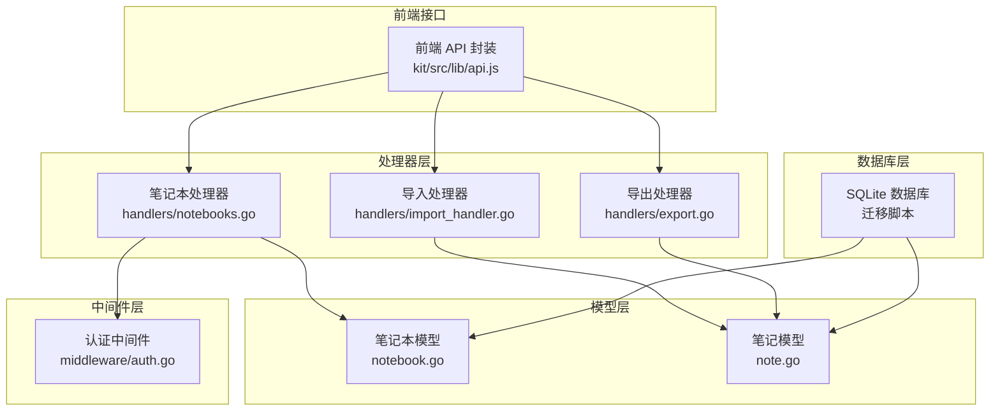
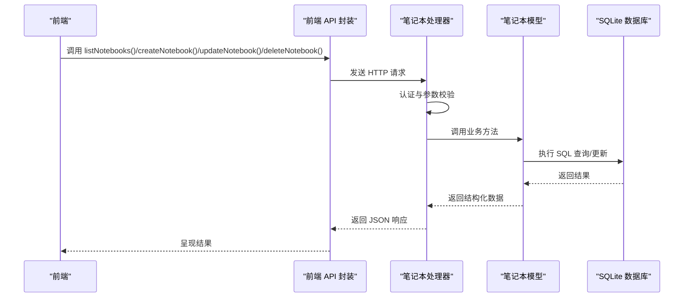
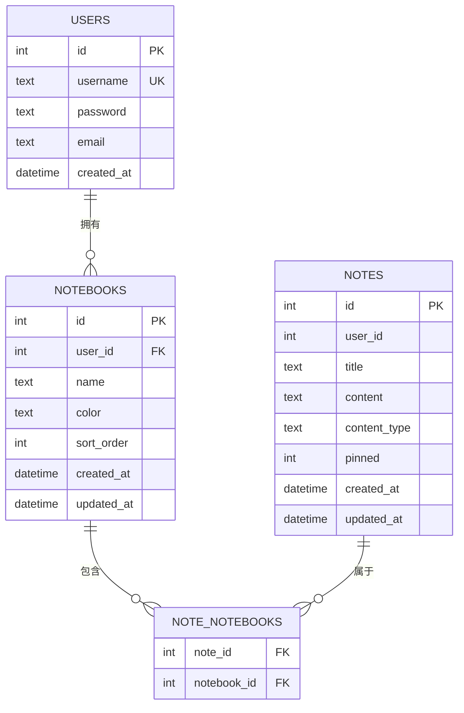
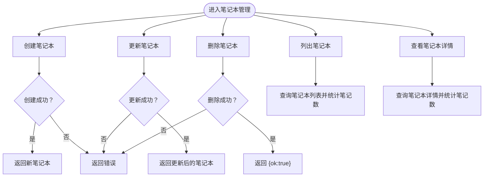
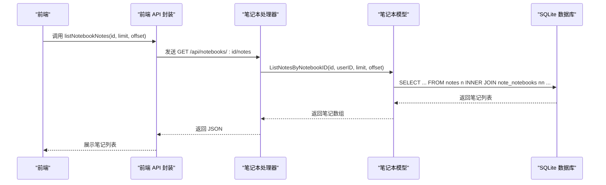
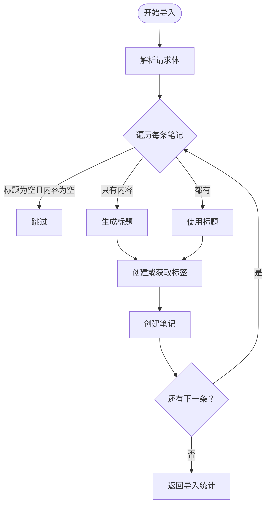
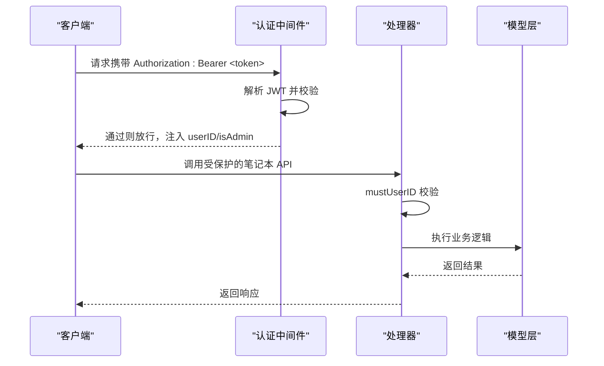
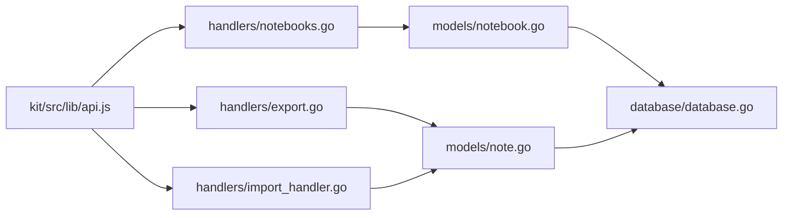

# 笔记本模型

<cite>
**本文档引用的文件**
- [backend/models/notebook.go](file://backend/models/notebook.go)
- [backend/handlers/notebooks.go](file://backend/handlers/notebooks.go)
- [backend/database/database.go](file://backend/database/database.go)
- [backend/models/note.go](file://backend/models/note.go)
- [backend/handlers/export.go](file://backend/handlers/export.go)
- [backend/handlers/import_handler.go](file://backend/handlers/import_handler.go)
- [backend/middleware/auth.go](file://backend/middleware/auth.go)
- [kit/src/lib/api.js](file://kit/src/lib/api.js)
</cite>

## 目录
1. [简介](#简介)
2. [项目结构](#项目结构)
3. [核心组件](#核心组件)
4. [架构总览](#架构总览)
5. [详细组件分析](#详细组件分析)
6. [依赖关系分析](#依赖关系分析)
7. [性能考虑](#性能考虑)
8. [故障排除指南](#故障排除指南)
9. [结论](#结论)
10. [附录](#附录)

## 简介
本文件系统性地阐述“笔记本模型”的设计与实现，覆盖以下方面：
- 笔记本实体的字段与语义（名称、描述、创建时间、排序字段等）
- 笔记本与笔记之间的一对多关系及外键约束
- 笔记本的管理功能（创建、编辑、删除、排序）
- 笔记本的组织结构与分类逻辑（支持多笔记本挂载同一笔记）
- 使用示例（批量操作、导入导出、权限控制）

## 项目结构
围绕笔记本模型的关键文件分布如下：
- 数据库层：负责表结构与迁移（含笔记本与笔记关联表）
- 模型层：封装笔记本与笔记的数据访问与业务逻辑
- 处理器层：提供 REST API，处理笔记本与笔记的增删改查
- 中间件层：提供认证与权限控制
- 前端接口：提供笔记本与笔记的调用封装

**图表来源**
- [backend/database/database.go](file://backend/database/database.go#L180-L209)
- [backend/models/notebook.go](file://backend/models/notebook.go#L1-L206)
- [backend/models/note.go](file://backend/models/note.go#L1-L846)
- [backend/handlers/notebooks.go](file://backend/handlers/notebooks.go#L1-L161)
- [backend/handlers/export.go](file://backend/handlers/export.go#L1-L86)
- [backend/handlers/import_handler.go](file://backend/handlers/import_handler.go#L1-L85)
- [backend/middleware/auth.go](file://backend/middleware/auth.go#L1-L71)
- [kit/src/lib/api.js](file://kit/src/lib/api.js#L191-L270)

**章节来源**
- [backend/database/database.go](file://backend/database/database.go#L180-L209)
- [backend/models/notebook.go](file://backend/models/notebook.go#L1-L206)
- [backend/models/note.go](file://backend/models/note.go#L1-L846)
- [backend/handlers/notebooks.go](file://backend/handlers/notebooks.go#L1-L161)
- [backend/handlers/export.go](file://backend/handlers/export.go#L1-L86)
- [backend/handlers/import_handler.go](file://backend/handlers/import_handler.go#L1-L85)
- [backend/middleware/auth.go](file://backend/middleware/auth.go#L1-L71)
- [kit/src/lib/api.js](file://kit/src/lib/api.js#L191-L270)

## 核心组件
- 笔记本实体 Notebook：包含标识、用户归属、名称、颜色、排序、创建与更新时间、以及笔记数量统计
- 笔记实体 Note：包含标题、内容、类型、置顶、标签、资源、所属笔记本 ID 列表等
- 笔记本与笔记的关系：通过 note_notebooks 关系表实现多对多（一个笔记可属于多个笔记本）

关键字段与含义：
- Notebook
  - id：笔记本唯一标识
  - user_id：所属用户
  - name：笔记本名称（默认空则回退为“未命名笔记本”）
  - color：颜色（用于界面展示）
  - sort_order：排序权重（升序排列）
  - created_at / updated_at：创建与更新时间
  - note_count：该笔记本下笔记数量（通过聚合查询计算）
- Note
  - id：笔记唯一标识
  - user_id：笔记所属用户（可为空，兼容旧数据）
  - title / content / content_type：标题、内容与内容类型
  - pinned：是否置顶
  - tags / resources：标签与资源列表
  - notebook_ids：该笔记所属的笔记本 ID 列表
  - location / latitude / longitude：位置信息（可选）

**章节来源**
- [backend/models/notebook.go](file://backend/models/notebook.go#L10-L19)
- [backend/models/note.go](file://backend/models/note.go#L11-L27)

## 架构总览
笔记本模型的典型工作流：
- 前端通过 kit/src/lib/api.js 调用后端接口
- 处理器层进行鉴权与参数解析
- 模型层执行数据库操作（查询、插入、更新、删除）
- 数据库层通过迁移脚本确保表结构与索引存在

**图表来源**
- [kit/src/lib/api.js](file://kit/src/lib/api.js#L191-L270)
- [backend/handlers/notebooks.go](file://backend/handlers/notebooks.go#L12-L161)
- [backend/models/notebook.go](file://backend/models/notebook.go#L21-L111)
- [backend/database/database.go](file://backend/database/database.go#L180-L209)

## 详细组件分析

### 笔记本实体与关系设计
- 表结构与外键约束
  - notebooks：包含 user_id 外键，删除用户时级联删除笔记本
  - note_notebooks：多对多关系表，主键为 (note_id, notebook_id)，分别引用 notes 与 notebooks，删除笔记或笔记本均级联删除关系
  - 索引：对 notebooks(user_id) 与 note_notebooks(notebook_id) 建立索引，提升查询效率
- 关系映射
  - 一个笔记本可包含多条笔记（一对多）
  - 一条笔记可属于多个笔记本（多对多）
  - 通过 note_notebooks 实现“标签式”分类与复用

**图表来源**
- [backend/database/database.go](file://backend/database/database.go#L180-L209)

**章节来源**
- [backend/database/database.go](file://backend/database/database.go#L180-L209)

### 笔记本管理功能
- 列表与详情
  - ListNotebooks：按 sort_order 升序、id 升序返回笔记本列表，并附带 note_count
  - GetNotebook：按 id 与 user_id 查询笔记本及其笔记数量
- 创建、更新、删除
  - CreateNotebook：规范化名称（空则默认“未命名笔记本”），插入 notebooks 并返回最新记录
  - UpdateNotebook：支持部分字段更新（名称、颜色、排序），更新 updated_at
  - DeleteNotebook：删除指定笔记本
- 笔记本内笔记查询
  - ListNotesByNotebookID：基于 note_notebooks 连接查询，按 pinned 降序、updated_at 降序分页返回笔记
  - CountNotesByNotebookID：统计某笔记本下的笔记数量

**图表来源**
- [backend/handlers/notebooks.go](file://backend/handlers/notebooks.go#L12-L161)
- [backend/models/notebook.go](file://backend/models/notebook.go#L21-L111)

**章节来源**
- [backend/handlers/notebooks.go](file://backend/handlers/notebooks.go#L12-L161)
- [backend/models/notebook.go](file://backend/models/notebook.go#L21-L111)

### 笔记与笔记本的多对多挂载
- SetNoteNotebooks：为某笔记设置所属笔记本集合。事务中先清空旧关系，再插入新关系（忽略非正整数 ID）
- GetNotebookIDsByNoteID：查询某笔记所属的所有笔记本 ID
- ListNotesByNotebookID：通过 note_notebooks 连接查询，实现“多笔记本挂载同一笔记”的能力

**图表来源**
- [backend/handlers/notebooks.go](file://backend/handlers/notebooks.go#L129-L161)
- [backend/models/notebook.go](file://backend/models/notebook.go#L152-L194)

**章节来源**
- [backend/models/notebook.go](file://backend/models/notebook.go#L130-L150)
- [backend/models/notebook.go](file://backend/models/notebook.go#L113-L128)
- [backend/models/notebook.go](file://backend/models/notebook.go#L152-L194)

### 导入导出与批量操作
- 导出
  - ExportNotes：支持 JSON 与 Markdown 两种格式，限制最大导出条数，返回带时间戳的文件名
- 导入
  - ImportNotes：接收笔记数组，逐条创建，自动创建缺失的标签，支持批量导入上限
- 批量删除（笔记层面）
  - DeleteNotes：构建占位符批量删除，避免 N 次往返

**图表来源**
- [backend/handlers/import_handler.go](file://backend/handlers/import_handler.go#L24-L85)
- [backend/handlers/export.go](file://backend/handlers/export.go#L15-L86)
- [backend/models/note.go](file://backend/models/note.go#L176-L199)

**章节来源**
- [backend/handlers/export.go](file://backend/handlers/export.go#L15-L86)
- [backend/handlers/import_handler.go](file://backend/handlers/import_handler.go#L24-L85)
- [backend/models/note.go](file://backend/models/note.go#L176-L199)

### 权限控制与鉴权
- 认证中间件：从 Authorization 头提取 Bearer Token，解析用户信息并注入上下文
- 管理员权限：AdminOnly 中间件校验 isAdmin 标记
- 处理器侧：所有笔记本 API 均依赖 mustUserID 提取并校验当前用户

**图表来源**
- [backend/middleware/auth.go](file://backend/middleware/auth.go#L12-L71)
- [backend/handlers/notebooks.go](file://backend/handlers/notebooks.go#L13-L27)

**章节来源**
- [backend/middleware/auth.go](file://backend/middleware/auth.go#L12-L71)
- [backend/handlers/notebooks.go](file://backend/handlers/notebooks.go#L13-L27)

## 依赖关系分析
- 处理器依赖模型：所有笔记本 API 均调用 models 包中的函数
- 模型依赖数据库：通过 database.DB 执行 SQL
- 数据库迁移：确保 notebooks 与 note_notebooks 表存在并建立索引
- 前端封装：kit/src/lib/api.js 统一封装笔记本相关请求

**图表来源**
- [backend/handlers/notebooks.go](file://backend/handlers/notebooks.go#L1-L161)
- [backend/models/notebook.go](file://backend/models/notebook.go#L1-L206)
- [backend/database/database.go](file://backend/database/database.go#L180-L209)
- [backend/handlers/export.go](file://backend/handlers/export.go#L1-L86)
- [backend/handlers/import_handler.go](file://backend/handlers/import_handler.go#L1-L85)
- [backend/models/note.go](file://backend/models/note.go#L1-L846)
- [kit/src/lib/api.js](file://kit/src/lib/api.js#L191-L270)

**章节来源**
- [backend/handlers/notebooks.go](file://backend/handlers/notebooks.go#L1-L161)
- [backend/models/notebook.go](file://backend/models/notebook.go#L1-L206)
- [backend/database/database.go](file://backend/database/database.go#L180-L209)
- [backend/handlers/export.go](file://backend/handlers/export.go#L1-L86)
- [backend/handlers/import_handler.go](file://backend/handlers/import_handler.go#L1-L85)
- [backend/models/note.go](file://backend/models/note.go#L1-L846)
- [kit/src/lib/api.js](file://kit/src/lib/api.js#L191-L270)

## 性能考虑
- 查询优化
  - notebooks(user_id) 与 note_notebooks(notebook_id) 索引用于加速分组与连接查询
  - 列表查询按 sort_order 与 id 升序，减少排序成本
- 写入优化
  - SetNoteNotebooks 使用事务一次性清空并插入，避免多次往返
  - CreateNotebook/UpdateNotebook 使用参数化 SQL，防止注入
- 批量操作
  - DeleteNotes 使用 IN 占位符批量删除，减少网络往返
- 全文检索
  - 导出与导入不涉及全文检索，但笔记搜索使用 FTS5（与笔记本无直接关系）

[本节为通用性能讨论，无需特定文件来源]

## 故障排除指南
- 常见错误与定位
  - 无效的笔记本 ID：处理器对路径参数进行解析，若失败返回错误
  - 未提供或无效的认证令牌：中间件返回 401
  - 无权限：AdminOnly 中间件返回 403
  - 数据库错误：模型层捕获并向上抛出，处理器返回 500
- 建议排查步骤
  - 确认 Authorization 头格式为 Bearer <token>
  - 确认用户身份与资源归属一致（按 user_id 过滤）
  - 检查数据库迁移是否完成（notebooks 与 note_notebooks 表存在）
  - 导入时注意单次上限与标题/内容规范

**章节来源**
- [backend/handlers/notebooks.go](file://backend/handlers/notebooks.go#L29-L50)
- [backend/middleware/auth.go](file://backend/middleware/auth.go#L12-L71)
- [backend/database/database.go](file://backend/database/database.go#L180-L209)

## 结论
笔记本模型通过 notebooks 与 note_notebooks 的设计，实现了“多笔记本挂载同一笔记”的灵活分类能力；配合排序字段与索引，兼顾了易用性与性能。处理器层提供完善的 CRUD 与查询接口，结合认证与权限中间件，满足多用户隔离与安全需求。导入导出与批量操作进一步完善了数据生命周期管理。

## 附录
- 使用示例（路径指引）
  - 列出笔记本：调用前端封装的 listNotebooks
    - [kit/src/lib/api.js](file://kit/src/lib/api.js#L192-L194)
  - 创建笔记本：调用 createNotebook
    - [kit/src/lib/api.js](file://kit/src/lib/api.js#L200-L210)
  - 更新笔记本：调用 updateNotebook
    - [kit/src/lib/api.js](file://kit/src/lib/api.js#L211-L217)
  - 删除笔记本：调用 deleteNotebook
    - [kit/src/lib/api.js](file://kit/src/lib/api.js#L218-L221)
  - 查看笔记本内笔记：调用 listNotebookNotes
    - [kit/src/lib/api.js](file://kit/src/lib/api.js#L222-L231)
  - 导出笔记：调用 exportNotes
    - [kit/src/lib/api.js](file://kit/src/lib/api.js#L238-L261)
  - 导入笔记：调用 importNotes
    - [kit/src/lib/api.js](file://kit/src/lib/api.js#L263-L269)