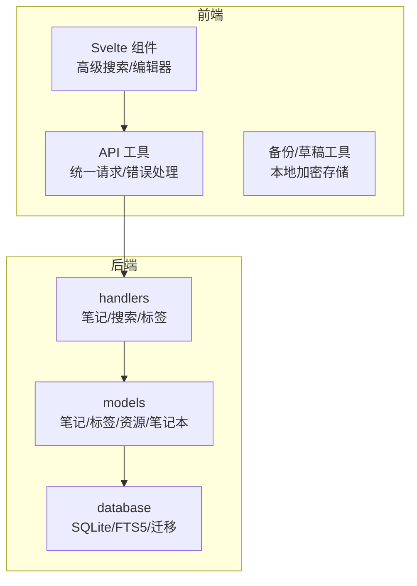
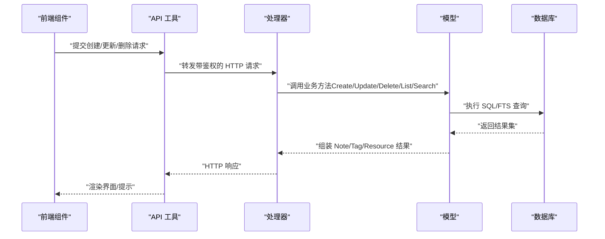
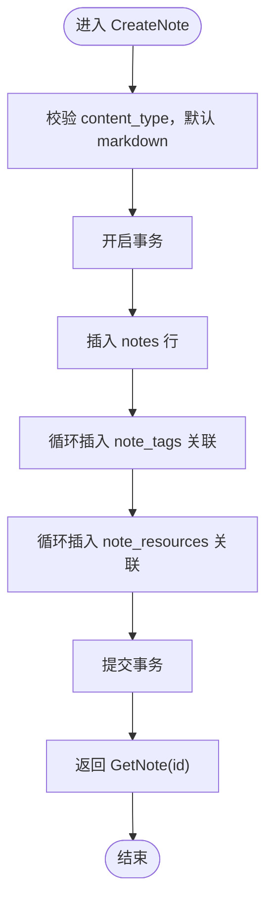
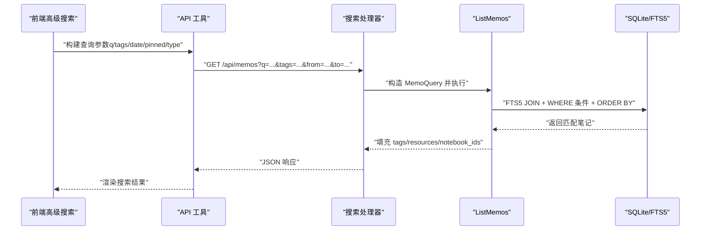
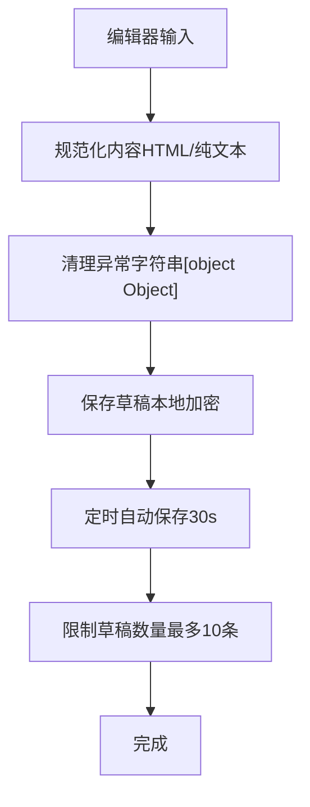
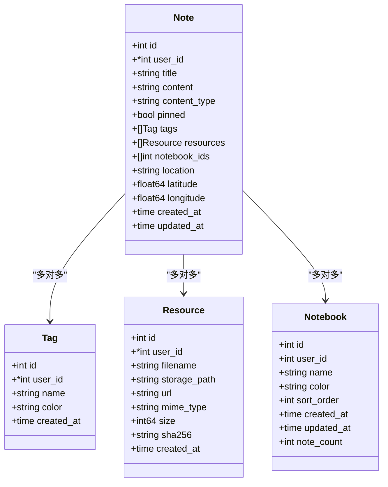

# 笔记模型

<cite>
**本文引用的文件**
- [note.go](file://backend/models/note.go)
- [notes.go](file://backend/handlers/notes.go)
- [search.go](file://backend/handlers/search.go)
- [memo_query.go](file://backend/models/memo_query.go)
- [resource.go](file://backend/models/resource.go)
- [notebook.go](file://backend/models/notebook.go)
- [database.go](file://backend/database/database.go)
- [AdvancedSearch.svelte](file://frontend/src/components/AdvancedSearch.svelte)
- [api.js](file://frontend/src/utils/api.js)
- [backup.js](file://frontend/src/utils/backup.js)
- [NoteEditor.svelte](file://frontend/src/components/NoteEditor.svelte)
</cite>

## 目录
1. [简介](#简介)
2. [项目结构](#项目结构)
3. [核心组件](#核心组件)
4. [架构总览](#架构总览)
5. [详细组件分析](#详细组件分析)
6. [依赖分析](#依赖分析)
7. [性能考虑](#性能考虑)
8. [故障排查指南](#故障排查指南)
9. [结论](#结论)
10. [附录](#附录)

## 简介
本文件系统性地梳理了笔记模型的设计与实现，覆盖字段定义、数据类型、实体关系、CRUD 操作、搜索能力以及富文本处理、草稿保存、批量操作等使用示例。读者无需深入代码即可理解如何使用与扩展笔记模型。

## 项目结构
笔记模型位于后端 Go 语言模块中，采用分层架构：
- 数据访问层：models 包封装 Note、Tag、Resource、Notebook 等实体及查询逻辑
- 控制器层：handlers 包负责 HTTP 请求解析、鉴权与响应
- 前端交互：Svelte 组件与工具函数负责富文本编辑、草稿与搜索体验
- 数据库：SQLite + FTS5 全文检索，配合多版本迁移脚本

图表来源
- [note.go](file://backend/models/note.go#L1-L846)
- [notes.go](file://backend/handlers/notes.go#L1-L513)
- [search.go](file://backend/handlers/search.go#L1-L45)
- [database.go](file://backend/database/database.go#L1-L677)
- [AdvancedSearch.svelte](file://frontend/src/components/AdvancedSearch.svelte#L1-L181)
- [api.js](file://frontend/src/utils/api.js#L1-L316)
- [backup.js](file://frontend/src/utils/backup.js#L1-L95)
- [NoteEditor.svelte](file://frontend/src/components/NoteEditor.svelte#L16-L75)

章节来源
- [note.go](file://backend/models/note.go#L1-L846)
- [notes.go](file://backend/handlers/notes.go#L1-L513)
- [search.go](file://backend/handlers/search.go#L1-L45)
- [database.go](file://backend/database/database.go#L1-L677)

## 核心组件
- Note 实体：包含笔记标识、用户归属、标题、内容、类型、置顶、标签、资源、笔记本、位置信息、时间戳等字段
- Tag 实体：标签标识、用户归属、名称、颜色、创建时间
- Resource 实体：资源标识、用户归属、文件名、存储路径、URL、MIME 类型、大小、哈希、创建时间
- Notebook 实体：笔记本标识、用户归属、名称、颜色、排序、时间戳、笔记计数
- MemoQuery 查询：支持关键词、标签、时间范围、置顶、内容类型、用户隔离等条件组合

章节来源
- [note.go](file://backend/models/note.go#L11-L27)
- [note.go](file://backend/models/note.go#L29-L35)
- [resource.go](file://backend/models/resource.go#L10-L20)
- [notebook.go](file://backend/models/notebook.go#L10-L19)
- [memo_query.go](file://backend/models/memo_query.go#L12-L22)

## 架构总览
笔记模型围绕 SQLite 数据库存储，使用 FTS5 进行全文检索，并通过多版本迁移脚本演进 schema。后端提供 REST 接口，前端通过 Svelte 组件与 API 工具完成富文本编辑、草稿与搜索体验。

图表来源
- [notes.go](file://backend/handlers/notes.go#L175-L230)
- [notes.go](file://backend/handlers/notes.go#L232-L296)
- [notes.go](file://backend/handlers/notes.go#L298-L320)
- [note.go](file://backend/models/note.go#L46-L105)
- [note.go](file://backend/models/note.go#L107-L168)
- [note.go](file://backend/models/note.go#L170-L199)
- [memo_query.go](file://backend/models/memo_query.go#L24-L152)

## 详细组件分析

### Note 实体与字段定义
- 标识与归属：id、user_id（可空，兼容旧数据）
- 内容与类型：title、content、content_type（默认 markdown）
- 状态与时间：pinned、created_at、updated_at
- 关联集合：tags（Tag 列表）、resources（Resource 列表）、notebook_ids（笔记本 ID 列表）
- 位置信息：location、latitude、longitude
- 内容清理：对 content 与 title 中的 "[object Object]" 字符串进行清理

章节来源
- [note.go](file://backend/models/note.go#L11-L27)
- [note.go](file://backend/models/note.go#L201-L210)

### 关系设计
- 多对多：Note ↔ Tag（note_tags 关联表）
- 多对多：Note ↔ Resource（note_resources 关联表）
- 多对多：Note ↔ Notebook（note_notebooks 关联表）
- 用户隔离：Tag、Resource、Notebook、Notes 均支持 user_id 字段，迁移脚本将历史数据归档至主用户

章节来源
- [note.go](file://backend/models/note.go#L518-L548)
- [resource.go](file://backend/models/resource.go#L78-L109)
- [notebook.go](file://backend/models/notebook.go#L113-L128)
- [database.go](file://backend/database/database.go#L564-L591)

### CRUD 操作实现
- 创建笔记：CreateNote 支持标题、内容、标签、置顶、内容类型、资源、用户 ID；事务内插入笔记、建立标签与资源关联
- 更新笔记：UpdateNote 支持标题、内容、标签、置顶、内容类型、资源；事务内先更新笔记，再重建标签与资源关联
- 删除笔记：DeleteNote 单条删除；DeleteNotes 批量删除（空数组安全）
- 读取笔记：GetNote 获取单条；GetAllNotes 获取全部（列表页）

图表来源
- [note.go](file://backend/models/note.go#L46-L105)

章节来源
- [note.go](file://backend/models/note.go#L46-L105)
- [note.go](file://backend/models/note.go#L107-L168)
- [note.go](file://backend/models/note.go#L170-L199)
- [note.go](file://backend/models/note.go#L212-L266)

### 搜索功能实现
- 全文搜索：ListMemos 支持关键词（FTS5），按 bm25 排序；支持标签过滤、时间范围、置顶、内容类型、用户隔离
- 兼容接口：/api/search 仍可使用，内部委托给 ListMemos
- 前端高级搜索：AdvancedSearch.svelte 提供关键词、日期范围、排序方式与顺序的 UI 交互

图表来源
- [memo_query.go](file://backend/models/memo_query.go#L24-L152)
- [search.go](file://backend/handlers/search.go#L13-L43)
- [AdvancedSearch.svelte](file://frontend/src/components/AdvancedSearch.svelte#L43-L53)

章节来源
- [memo_query.go](file://backend/models/memo_query.go#L24-L152)
- [search.go](file://backend/handlers/search.go#L13-L43)
- [AdvancedSearch.svelte](file://frontend/src/components/AdvancedSearch.svelte#L1-L181)

### 富文本处理与草稿保存
- 富文本编辑：NoteEditor.svelte 将 HTML 内容与纯文本互转，支持标签输入与保存校验
- 内容清理：前端与后端均对 "[object Object]" 进行清理，防止异常内容污染
- 草稿保存：backup.js 提供本地加密草稿存储，定时自动保存、数量上限与删除清理

图表来源
- [NoteEditor.svelte](file://frontend/src/components/NoteEditor.svelte#L62-L75)
- [api.js](file://frontend/src/utils/api.js#L78-L112)
- [backup.js](file://frontend/src/utils/backup.js#L11-L43)

章节来源
- [NoteEditor.svelte](file://frontend/src/components/NoteEditor.svelte#L16-L75)
- [api.js](file://frontend/src/utils/api.js#L78-L112)
- [backup.js](file://frontend/src/utils/backup.js#L1-L95)

### 批量操作
- 批量删除：/api/notes/batch 接收 ids 数组，后端按用户隔离条件删除
- 前端批量：api.js 提供 deleteNotes(ids) 方法，统一错误处理与拦截器

章节来源
- [notes.go](file://backend/handlers/notes.go#L322-L353)
- [api.js](file://frontend/src/utils/api.js#L216-L229)

### 标签与笔记本管理
- 标签：CreateTagIfNotExists、GetAllTags、UpdateTag、DeleteTag、MergeTags；支持按名称唯一约束（per-user）
- 笔记本：ListNotebooks、GetNotebook、CreateNotebook、UpdateNotebook、DeleteNotebook；支持笔记计数与排序

章节来源
- [note.go](file://backend/models/note.go#L594-L729)
- [notebook.go](file://backend/models/notebook.go#L21-L206)

## 依赖分析
- 数据库层：SQLite + FTS5；通过迁移脚本逐步增加列与表，确保向后兼容
- 关系耦合：Note 依赖 Tag、Resource、Notebook 的查询方法；ListMemos 统一承载搜索条件
- 前后端契约：前端通过 api.js 统一请求，后端 handlers 解析参数并调用 models

图表来源
- [note.go](file://backend/models/note.go#L11-L27)
- [note.go](file://backend/models/note.go#L29-L35)
- [resource.go](file://backend/models/resource.go#L10-L20)
- [notebook.go](file://backend/models/notebook.go#L10-L19)

章节来源
- [note.go](file://backend/models/note.go#L11-L27)
- [resource.go](file://backend/models/resource.go#L10-L20)
- [notebook.go](file://backend/models/notebook.go#L10-L19)

## 性能考虑
- FTS5 全文检索：使用 notes_fts 虚表与触发器维护一致性，查询按 bm25 排序，提升相关性
- 查询优化：ListMemos 动态拼接 WHERE 条件，必要时使用 DISTINCT 避免标签过滤导致的重复行
- 索引策略：迁移脚本创建索引（如 notebooks.user_id、note_notebooks.notebook_id），减少 JOIN 代价
- N+1 问题：GetAllNotes 在列表场景下逐条查询标签与资源，当前规模可接受；建议后续聚合优化

章节来源
- [database.go](file://backend/database/database.go#L254-L276)
- [database.go](file://backend/database/database.go#L180-L209)
- [memo_query.go](file://backend/models/memo_query.go#L97-L107)
- [note.go](file://backend/models/note.go#L316-L324)

## 故障排查指南
- 未认证/权限不足：handlers 中通过 mustUserID 与 ensureNoteOwned 校验，返回 401/404
- 参数校验失败：CreateNote/UpdateNote 对标题与内容进行非空校验，返回 400
- FTS5 未启用：数据库初始化时需 sqlite_fts5 编译标签，否则创建 notes_fts 会报错
- 资源表缺失：旧库可能无 resources 表，GetResourcesByNoteID 会报错，上层返回 500
- 标签唯一冲突：迁移后 tags.name 唯一约束改为 (user_id, name)，避免全局冲突

章节来源
- [notes.go](file://backend/handlers/notes.go#L104-L129)
- [notes.go](file://backend/handlers/notes.go#L175-L230)
- [database.go](file://backend/database/database.go#L254-L276)
- [resource.go](file://backend/models/resource.go#L78-L109)
- [database.go](file://backend/database/database.go#L594-L647)

## 结论
笔记模型以 SQLite 为核心，结合 FTS5 实现高效全文检索；通过多版本迁移保障向后兼容；前后端协作提供富文本编辑、草稿与搜索体验。建议在大规模场景下引入资源聚合查询与缓存策略，持续优化查询性能与用户体验。

## 附录
- 使用示例（路径指引）
  - 创建笔记：[CreateNote](file://backend/models/note.go#L46-L105)、[CreateNote 处理器](file://backend/handlers/notes.go#L175-L230)
  - 更新笔记：[UpdateNote](file://backend/models/note.go#L107-L168)、[UpdateNote 处理器](file://backend/handlers/notes.go#L232-L296)
  - 删除笔记：[DeleteNote](file://backend/models/note.go#L170-L174)、[DeleteNotes 批量](file://backend/models/note.go#L176-L199)、[批量删除处理器](file://backend/handlers/notes.go#L322-L353)
  - 搜索笔记：[ListMemos](file://backend/models/memo_query.go#L24-L152)、[搜索处理器](file://backend/handlers/search.go#L13-L43)
  - 富文本处理：[NoteEditor](file://frontend/src/components/NoteEditor.svelte#L62-L75)、[内容清理](file://frontend/src/utils/api.js#L78-L112)
  - 草稿保存：[backup.js](file://frontend/src/utils/backup.js#L11-L43)
  - 高级搜索 UI：[AdvancedSearch.svelte](file://frontend/src/components/AdvancedSearch.svelte#L43-L53)