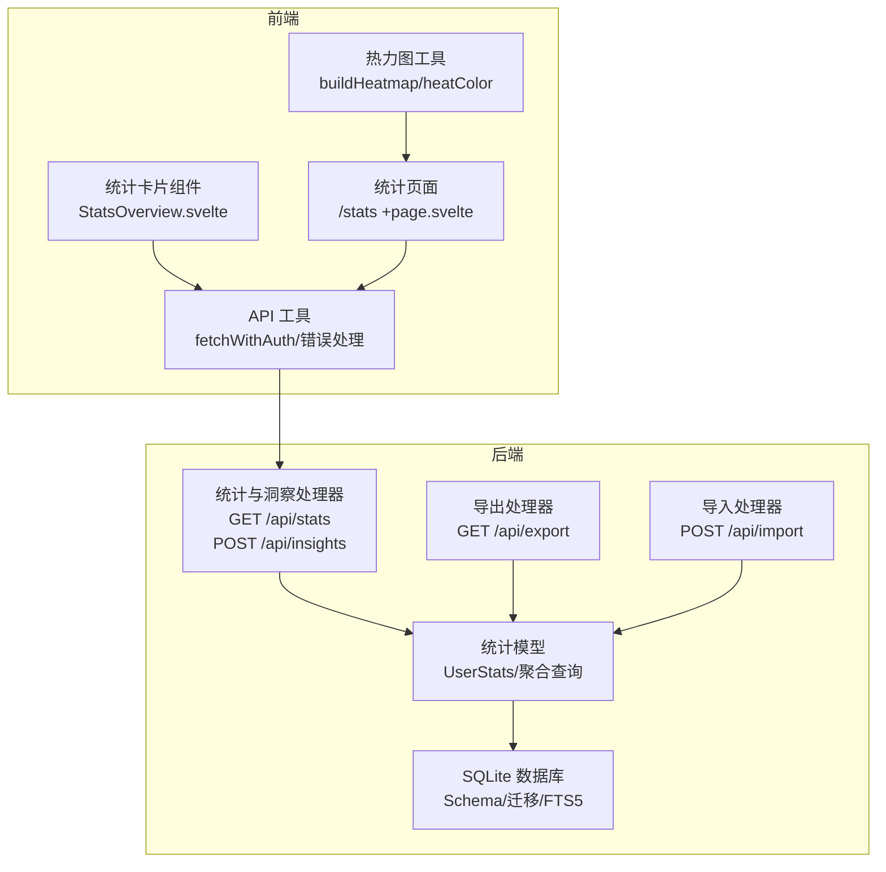
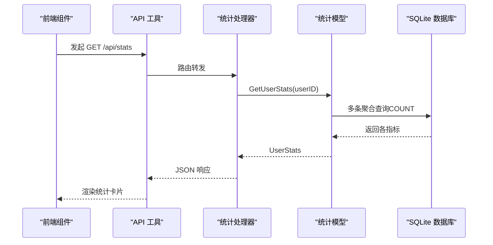
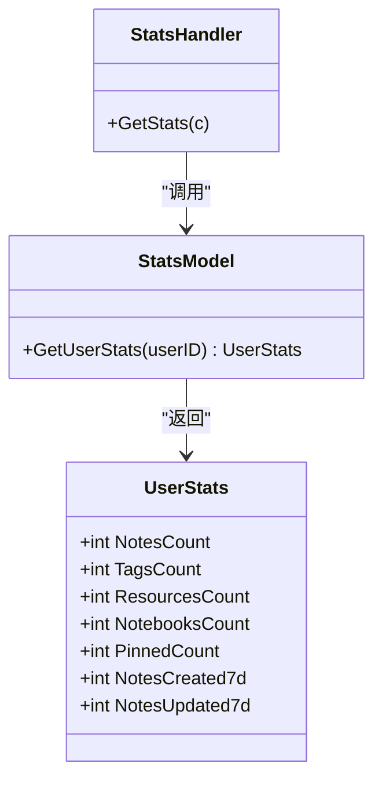
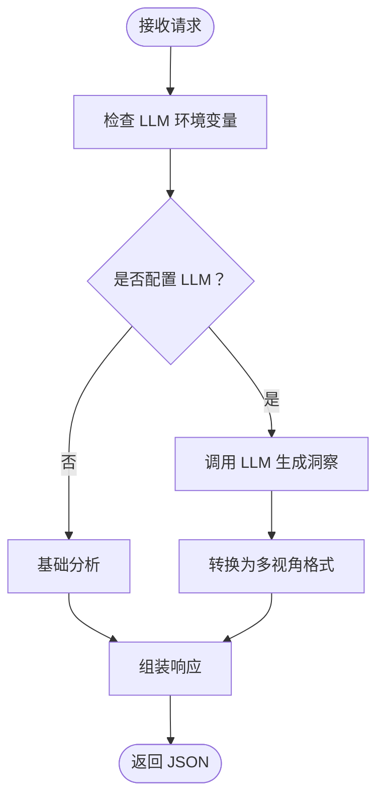
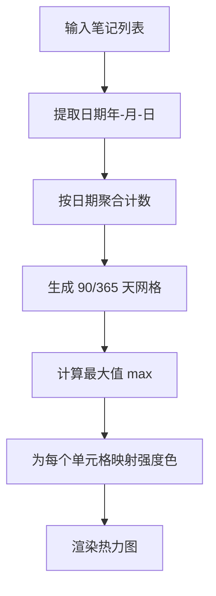
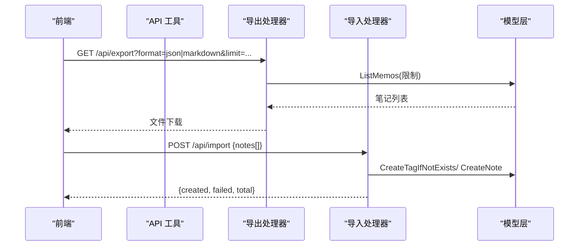
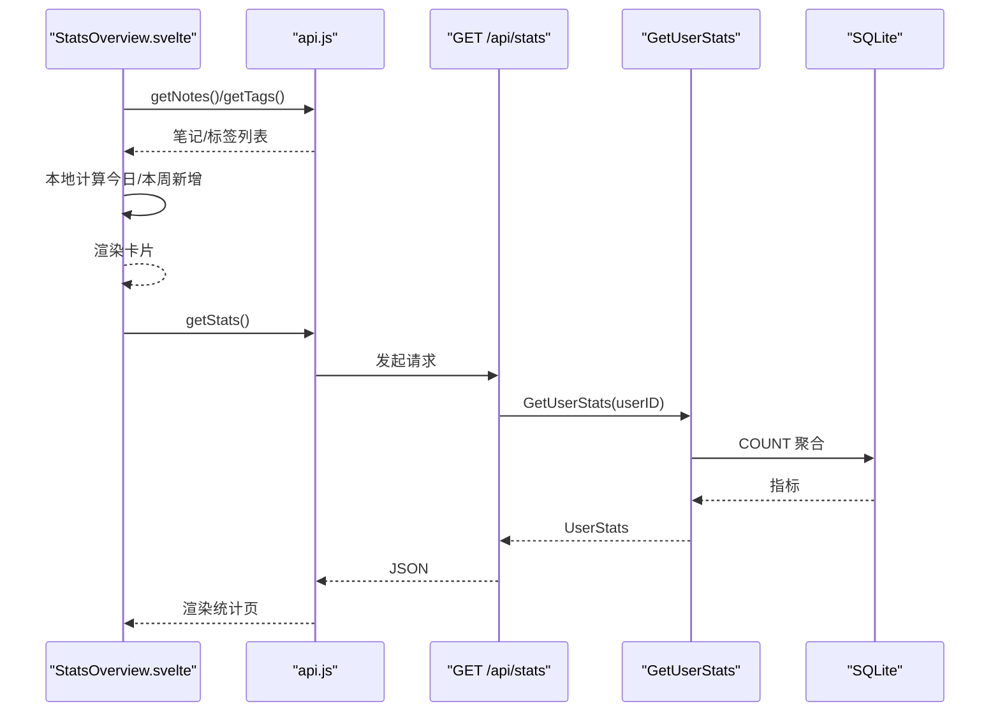
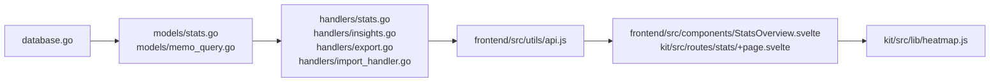

# 统计模型

<cite>
**本文引用的文件**
- [backend/models/stats.go](file://backend/models/stats.go)
- [backend/handlers/stats.go](file://backend/handlers/stats.go)
- [backend/handlers/insights.go](file://backend/handlers/insights.go)
- [backend/models/memo_query.go](file://backend/models/memo_query.go)
- [backend/models/note.go](file://backend/models/note.go)
- [backend/database/database.go](file://backend/database/database.go)
- [frontend/src/components/StatsOverview.svelte](file://frontend/src/components/StatsOverview.svelte)
- [frontend/src/utils/api.js](file://frontend/src/utils/api.js)
- [kit/src/lib/heatmap.js](file://kit/src/lib/heatmap.js)
- [kit/src/routes/stats/+page.svelte](file://kit/src/routes/stats/+page.svelte)
- [backend/handlers/export.go](file://backend/handlers/export.go)
- [backend/handlers/import_handler.go](file://backend/handlers/import_handler.go)
</cite>

## 目录
1. [简介](#简介)
2. [项目结构](#项目结构)
3. [核心组件](#核心组件)
4. [架构总览](#架构总览)
5. [详细组件分析](#详细组件分析)
6. [依赖关系分析](#依赖关系分析)
7. [性能考量](#性能考量)
8. [故障排查指南](#故障排查指南)
9. [结论](#结论)
10. [附录](#附录)

## 简介
本文件系统化梳理并文档化“统计模型”的设计与实现，覆盖以下方面：
- 统计实体与数据模型：用户维度的笔记、标签、资源、笔记本数量及近七天新增/更新统计
- 数据采集与存储：SQLite 数据库 Schema、迁移策略、FTS5 全文检索触发器
- 统计计算逻辑：后端聚合查询、前端本地聚合、时间分布热力图
- 指标定义与计算方法：笔记数量、使用频率、时间分布、主题/情感/行动分析
- 聚合算法与性能优化：SQL 聚合、索引与触发器、前端缓存与懒加载
- 可视化支持：统计卡片、热力图、数据导出与导入
- 使用示例：实时统计更新、历史数据分析、趋势预测思路

## 项目结构
统计能力由后端模型与处理器、前端组件与工具库协同实现，数据库层负责持久化与全文检索。

**图表来源**
- [backend/models/stats.go](file://backend/models/stats.go#L1-L66)
- [backend/handlers/stats.go](file://backend/handlers/stats.go#L1-L24)
- [backend/handlers/insights.go](file://backend/handlers/insights.go#L1-L527)
- [backend/models/memo_query.go](file://backend/models/memo_query.go#L1-L217)
- [backend/database/database.go](file://backend/database/database.go#L1-L677)
- [frontend/src/utils/api.js](file://frontend/src/utils/api.js#L1-L316)
- [frontend/src/components/StatsOverview.svelte](file://frontend/src/components/StatsOverview.svelte#L1-L134)
- [kit/src/routes/stats/+page.svelte](file://kit/src/routes/stats/+page.svelte#L1-L155)
- [kit/src/lib/heatmap.js](file://kit/src/lib/heatmap.js#L1-L38)
- [backend/handlers/export.go](file://backend/handlers/export.go#L1-L86)
- [backend/handlers/import_handler.go](file://backend/handlers/import_handler.go#L1-L85)

**章节来源**
- [backend/models/stats.go](file://backend/models/stats.go#L1-L66)
- [backend/handlers/stats.go](file://backend/handlers/stats.go#L1-L24)
- [backend/handlers/insights.go](file://backend/handlers/insights.go#L1-L527)
- [backend/models/memo_query.go](file://backend/models/memo_query.go#L1-L217)
- [backend/database/database.go](file://backend/database/database.go#L1-L677)
- [frontend/src/utils/api.js](file://frontend/src/utils/api.js#L1-L316)
- [frontend/src/components/StatsOverview.svelte](file://frontend/src/components/StatsOverview.svelte#L1-L134)
- [kit/src/routes/stats/+page.svelte](file://kit/src/routes/stats/+page.svelte#L1-L155)
- [kit/src/lib/heatmap.js](file://kit/src/lib/heatmap.js#L1-L38)
- [backend/handlers/export.go](file://backend/handlers/export.go#L1-L86)
- [backend/handlers/import_handler.go](file://backend/handlers/import_handler.go#L1-L85)

## 核心组件
- 用户统计模型：UserStats 结构体封装笔记总数、标签数、资源数、笔记本数、置顶数以及近七天新建/更新数
- 统计处理器：GET /api/stats 返回当前登录用户的统计快照
- 洞察分析：多视角（概览、主题、情感、行动）的文本分析与 AI 洞察生成
- 时间分布热力图：基于笔记创建日期构建日粒度热力图
- 导出与导入：支持 JSON/Markdown 导出与批量导入
- 前端统计卡片：展示总笔记、今日新增、本周新增、标签数等

**章节来源**
- [backend/models/stats.go](file://backend/models/stats.go#L7-L16)
- [backend/handlers/stats.go](file://backend/handlers/stats.go#L11-L23)
- [backend/handlers/insights.go](file://backend/handlers/insights.go#L27-L66)
- [kit/src/lib/heatmap.js](file://kit/src/lib/heatmap.js#L1-L38)
- [backend/handlers/export.go](file://backend/handlers/export.go#L15-L81)
- [backend/handlers/import_handler.go](file://backend/handlers/import_handler.go#L24-L84)
- [frontend/src/components/StatsOverview.svelte](file://frontend/src/components/StatsOverview.svelte#L1-L134)

## 架构总览
后端采用分层设计：Handler 接收请求，调用 Models 层进行数据聚合，Models 层通过 database.DB 访问 SQLite。前端通过统一 API 工具发起请求，渲染统计卡片与热力图。

**图表来源**
- [backend/handlers/stats.go](file://backend/handlers/stats.go#L11-L23)
- [backend/models/stats.go](file://backend/models/stats.go#L18-L65)
- [backend/database/database.go](file://backend/database/database.go#L18-L60)

**章节来源**
- [backend/handlers/stats.go](file://backend/handlers/stats.go#L1-L24)
- [backend/models/stats.go](file://backend/models/stats.go#L1-L66)
- [frontend/src/utils/api.js](file://frontend/src/utils/api.js#L53-L76)

## 详细组件分析

### 用户统计模型与处理器
- UserStats 字段涵盖：笔记总数、标签数、资源数、笔记本数、置顶数、近七天新建数、近七天更新数
- GetUserStats 通过多条 SQL COUNT 聚合查询实现，兼容历史笔记（user_id 为空）与当前用户隔离
- Handler GetStats 校验用户身份后调用模型并返回 JSON

**图表来源**
- [backend/models/stats.go](file://backend/models/stats.go#L7-L16)
- [backend/models/stats.go](file://backend/models/stats.go#L18-L65)
- [backend/handlers/stats.go](file://backend/handlers/stats.go#L11-L23)

**章节来源**
- [backend/models/stats.go](file://backend/models/stats.go#L7-L16)
- [backend/models/stats.go](file://backend/models/stats.go#L18-L65)
- [backend/handlers/stats.go](file://backend/handlers/stats.go#L11-L23)

### 洞察分析与多视角统计
- 支持多视角：概览、主题、情感、行动、连接、频率、全部
- 请求体包含笔记内容数组、时间范围、视角列表；若配置 LLM，则优先使用 AI 生成洞察，否则回退基础分析
- 基础分析包含：主题词频统计、情感倾向判断、行动完成率等

**图表来源**
- [backend/handlers/insights.go](file://backend/handlers/insights.go#L68-L119)
- [backend/handlers/insights.go](file://backend/handlers/insights.go#L297-L314)
- [backend/handlers/insights.go](file://backend/handlers/insights.go#L316-L360)

**章节来源**
- [backend/handlers/insights.go](file://backend/handlers/insights.go#L13-L66)
- [backend/handlers/insights.go](file://backend/handlers/insights.go#L68-L119)
- [backend/handlers/insights.go](file://backend/handlers/insights.go#L297-L360)

### 时间分布统计与热力图
- 前端热力图工具基于笔记创建时间，按自然日聚合，输出 cells 与 max
- 组件根据 max 动态着色，展示过去一年的记录密度
- 页面路由组件从后端获取统计，同时前端也可基于笔记列表计算本地统计

**图表来源**
- [kit/src/lib/heatmap.js](file://kit/src/lib/heatmap.js#L1-L38)
- [frontend/src/components/StatsOverview.svelte](file://frontend/src/components/StatsOverview.svelte#L17-L42)

**章节来源**
- [kit/src/lib/heatmap.js](file://kit/src/lib/heatmap.js#L1-L38)
- [frontend/src/components/StatsOverview.svelte](file://frontend/src/components/StatsOverview.svelte#L1-L134)
- [kit/src/routes/stats/+page.svelte](file://kit/src/routes/stats/+page.svelte#L1-L155)

### 数据导出与导入
- 导出：支持 JSON/Markdown 两种格式，限制最大导出条数，生成带时间戳的文件名
- 导入：支持批量导入，自动去重标签、补全标题、限制单次导入条数

**图表来源**
- [backend/handlers/export.go](file://backend/handlers/export.go#L15-L81)
- [backend/handlers/import_handler.go](file://backend/handlers/import_handler.go#L24-L84)
- [backend/models/memo_query.go](file://backend/models/memo_query.go#L24-L152)

**章节来源**
- [backend/handlers/export.go](file://backend/handlers/export.go#L15-L81)
- [backend/handlers/import_handler.go](file://backend/handlers/import_handler.go#L24-L84)
- [backend/models/memo_query.go](file://backend/models/memo_query.go#L24-L152)

### 前端统计卡片与 API 封装
- 统一 fetchWithAuth 自动注入 Token、拦截认证错误、统一错误处理
- 统计卡片组件在挂载时拉取笔记与标签，计算今日/本周新增，渲染统计卡片
- 统计页面路由组件调用后端 /api/stats 获取聚合指标

**图表来源**
- [frontend/src/components/StatsOverview.svelte](file://frontend/src/components/StatsOverview.svelte#L13-L42)
- [frontend/src/utils/api.js](file://frontend/src/utils/api.js#L53-L76)
- [backend/handlers/stats.go](file://backend/handlers/stats.go#L11-L23)
- [backend/models/stats.go](file://backend/models/stats.go#L18-L65)

**章节来源**
- [frontend/src/components/StatsOverview.svelte](file://frontend/src/components/StatsOverview.svelte#L1-L134)
- [frontend/src/utils/api.js](file://frontend/src/utils/api.js#L1-L316)
- [kit/src/routes/stats/+page.svelte](file://kit/src/routes/stats/+page.svelte#L1-L155)

## 依赖关系分析
- 数据库层：SQLite + FTS5 全文检索，迁移脚本管理 Schema 版本与索引
- 模型层：UserStats 聚合、MemoQuery 列表查询（支持时间范围、标签、置顶、内容类型等）
- 处理器层：统计与洞察接口、导出/导入接口
- 前端层：API 工具、统计卡片与热力图组件

**图表来源**
- [backend/database/database.go](file://backend/database/database.go#L62-L178)
- [backend/models/stats.go](file://backend/models/stats.go#L1-L66)
- [backend/models/memo_query.go](file://backend/models/memo_query.go#L1-L217)
- [backend/handlers/stats.go](file://backend/handlers/stats.go#L1-L24)
- [backend/handlers/insights.go](file://backend/handlers/insights.go#L1-L527)
- [backend/handlers/export.go](file://backend/handlers/export.go#L1-L86)
- [backend/handlers/import_handler.go](file://backend/handlers/import_handler.go#L1-L85)
- [frontend/src/utils/api.js](file://frontend/src/utils/api.js#L1-L316)
- [frontend/src/components/StatsOverview.svelte](file://frontend/src/components/StatsOverview.svelte#L1-L134)
- [kit/src/routes/stats/+page.svelte](file://kit/src/routes/stats/+page.svelte#L1-L155)
- [kit/src/lib/heatmap.js](file://kit/src/lib/heatmap.js#L1-L38)

**章节来源**
- [backend/database/database.go](file://backend/database/database.go#L1-L677)
- [backend/models/stats.go](file://backend/models/stats.go#L1-L66)
- [backend/models/memo_query.go](file://backend/models/memo_query.go#L1-L217)
- [backend/handlers/stats.go](file://backend/handlers/stats.go#L1-L24)
- [backend/handlers/insights.go](file://backend/handlers/insights.go#L1-L527)
- [backend/handlers/export.go](file://backend/handlers/export.go#L1-L86)
- [backend/handlers/import_handler.go](file://backend/handlers/import_handler.go#L1-L85)
- [frontend/src/utils/api.js](file://frontend/src/utils/api.js#L1-L316)
- [frontend/src/components/StatsOverview.svelte](file://frontend/src/components/StatsOverview.svelte#L1-L134)
- [kit/src/routes/stats/+page.svelte](file://kit/src/routes/stats/+page.svelte#L1-L155)
- [kit/src/lib/heatmap.js](file://kit/src/lib/heatmap.js#L1-L38)

## 性能考量
- 数据库层
  - WAL 模式、超时设置、外键约束开启，提升并发与一致性
  - FTS5 虚表配合触发器维护全文索引，查询时按 bm25 排序
  - 迁移脚本按版本逐步演进，避免一次性大变更
- 模型层
  - UserStats 使用多条 COUNT 聚合，适合小规模数据快速返回
  - ListMemos 支持 LIMIT/OFFSET、标签过滤、时间范围、FTS 搜索，注意 DISTINCT 去重成本
- 前端层
  - 统计卡片组件在本地计算今日/本周新增，减少后端压力
  - 热力图按天聚合，复杂度 O(N)，N 为笔记数
- 建议
  - 大规模数据时，考虑在数据库侧预聚合（物化视图/定时任务）并缓存热点指标
  - 对频繁查询的指标增加索引（如 created_at、user_id、pinned），并评估 FTS5 开启的成本
  - 前端对导出/导入操作进行节流与进度提示，避免阻塞 UI

[本节为通用性能指导，无需具体文件分析]

## 故障排查指南
- 统计接口 401/403
  - 检查前端是否携带有效 Token，统一错误处理会清除本地存储并触发重新登录
- 统计为空或异常
  - 确认用户隔离：历史笔记 user_id 为空会被视为公共可见，当前用户仅能看到自身数据
  - 检查数据库连接与迁移是否成功
- 导出/导入失败
  - 导出 limit 超限会降级至最大值；导入单次上限 500 条
  - 导入时标题为空会自动截断内容作为标题，标签名为空会被忽略
- 热力图显示异常
  - 确认笔记 created_at 字段存在且格式正确；工具会按日期聚合并计算最大值

**章节来源**
- [frontend/src/utils/api.js](file://frontend/src/utils/api.js#L34-L50)
- [backend/handlers/export.go](file://backend/handlers/export.go#L25-L31)
- [backend/handlers/import_handler.go](file://backend/handlers/import_handler.go#L38-L41)
- [kit/src/lib/heatmap.js](file://kit/src/lib/heatmap.js#L8-L13)

## 结论
统计模型以简洁的 SQL 聚合与前端本地计算为核心，结合热力图与洞察分析，形成从“指标—分布—语义”的完整视图。通过数据库迁移与 FTS5 支撑，系统具备良好的扩展性与可维护性。建议在生产环境中引入预聚合与缓存策略，进一步提升大规模数据下的响应性能。

[本节为总结性内容，无需具体文件分析]

## 附录

### 统计指标定义与计算方法
- 笔记数量统计
  - 总数：COUNT(notes)（兼容 user_id 为空的历史数据）
  - 置顶数：COUNT(notes WHERE pinned=1)
  - 近七天新建/更新：COUNT(notes WHERE created_at/updated_at >= now()-7d)
- 使用频率分析
  - 日均笔记数：总笔记数 / 用户活跃天数
  - 标签使用频率：按标签分组统计出现次数
- 时间分布统计
  - 热力图：按自然日聚合，映射到网格单元格，颜色强度与当日计数成正比
- 主题/情感/行动分析
  - 主题：关键词匹配计数，输出最高主题与详情
  - 情感：正负向词汇计数，输出整体倾向与高亮提示
  - 行动：待办/完成词汇计数，输出完成率与详情

**章节来源**
- [backend/models/stats.go](file://backend/models/stats.go#L18-L65)
- [backend/handlers/insights.go](file://backend/handlers/insights.go#L386-L428)
- [backend/handlers/insights.go](file://backend/handlers/insights.go#L443-L478)
- [backend/handlers/insights.go](file://backend/handlers/insights.go#L480-L520)
- [kit/src/lib/heatmap.js](file://kit/src/lib/heatmap.js#L1-L38)

### 数据库 Schema 与迁移要点
- v1：notes/tags/users + FTS5 虚表与触发器
- v2：notes 增加 pinned/content_type/user_id
- v3：resources + note_resources 关联表
- v4：users 增加 is_admin
- v5：users 增加 must_change_password
- v6：tags 增加 user_id 并迁移历史数据
- v7：tags.name 全局唯一改为 (user_id,name) 唯一
- v8：notebooks + note_notebooks 关联表
- v9：notes 增加 location/latitude/longitude

**章节来源**
- [backend/database/database.go](file://backend/database/database.go#L62-L178)
- [backend/database/database.go](file://backend/database/database.go#L180-L241)

### 使用示例
- 实时统计更新
  - 前端挂载时拉取笔记/标签，本地计算今日/本周新增；或调用 /api/stats 获取后端聚合结果
- 历史数据分析
  - 使用 ListMemos 的 From/To 限定时间范围，结合标签过滤与 FTS 搜索，导出历史笔记进行离线分析
- 趋势预测
  - 基于热力图的每日计数序列，可采用简单移动平均或指数平滑法进行短期趋势预测（概念性建议）

**章节来源**
- [frontend/src/components/StatsOverview.svelte](file://frontend/src/components/StatsOverview.svelte#L13-L42)
- [kit/src/routes/stats/+page.svelte](file://kit/src/routes/stats/+page.svelte#L10-L25)
- [backend/models/memo_query.go](file://backend/models/memo_query.go#L70-L78)
- [backend/handlers/export.go](file://backend/handlers/export.go#L15-L81)