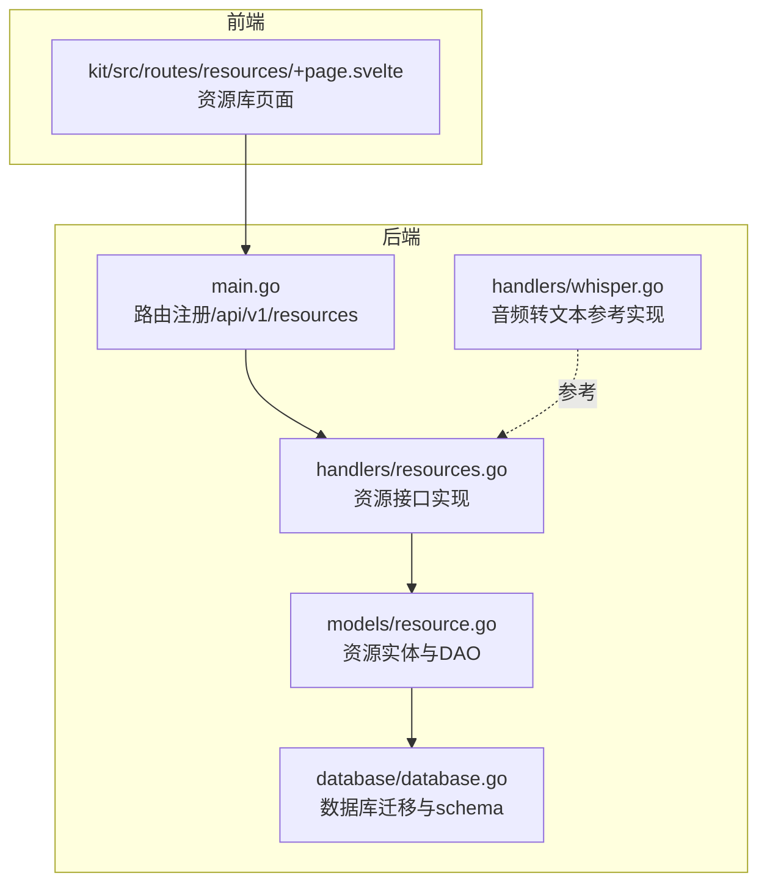
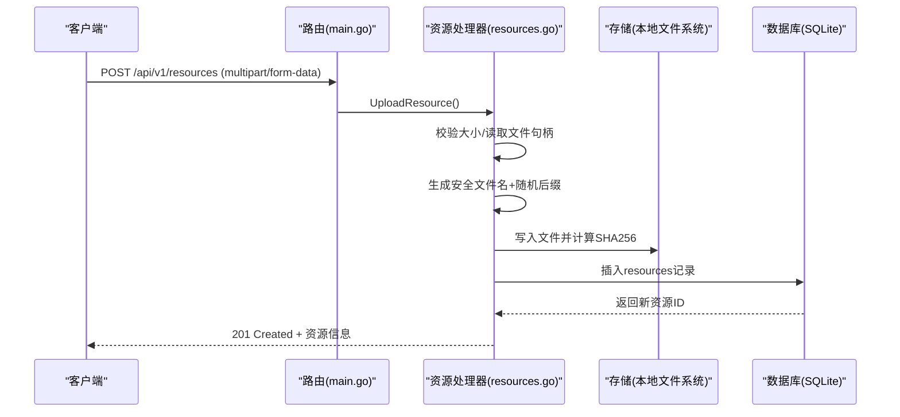
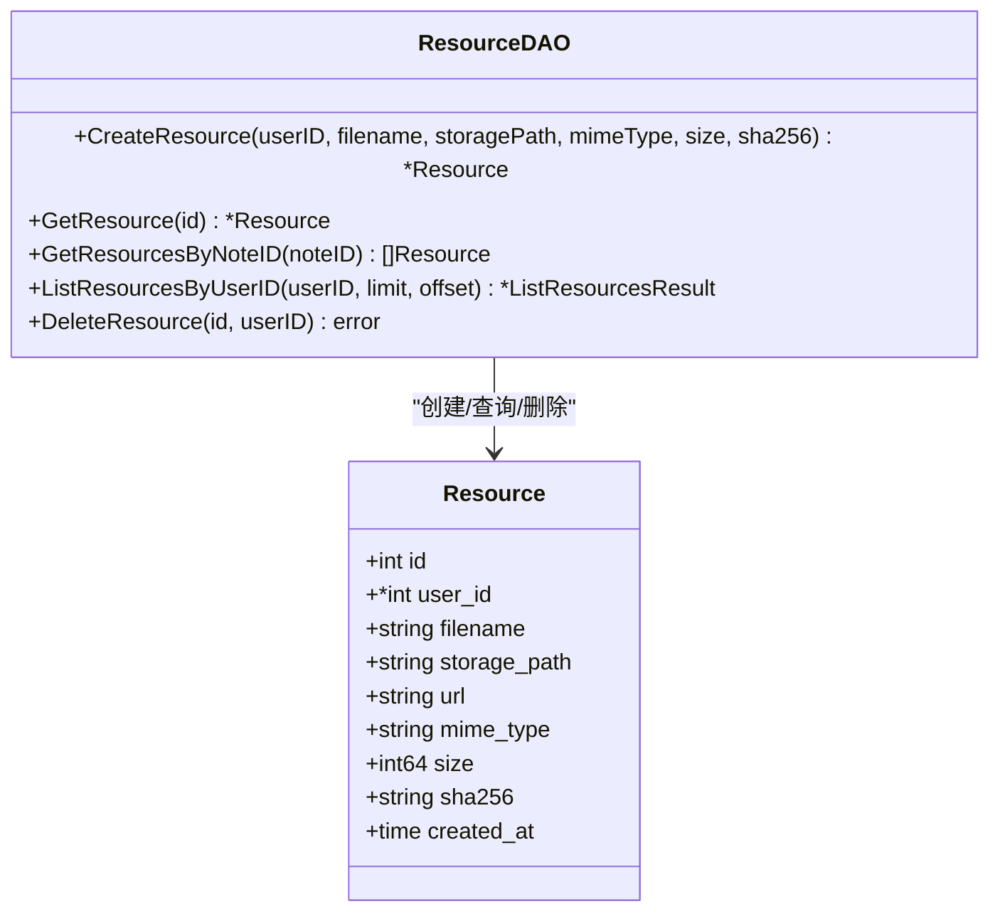
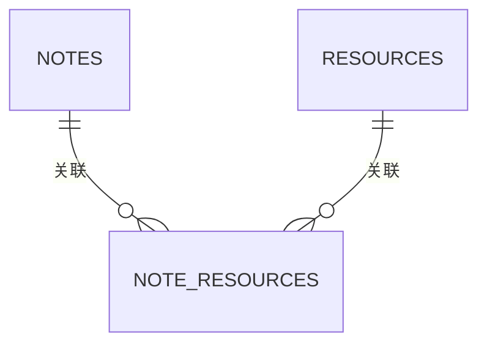
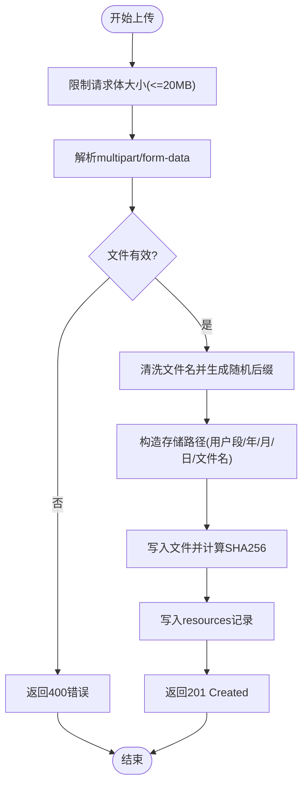
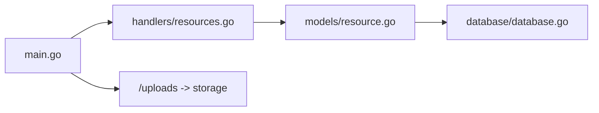

# 资源模型

<cite>
**本文引用的文件**
- [backend/models/resource.go](file://backend/models/resource.go)
- [backend/handlers/resources.go](file://backend/handlers/resources.go)
- [backend/database/database.go](file://backend/database/database.go)
- [backend/main.go](file://backend/main.go)
- [kit/src/routes/resources/+page.svelte](file://kit/src/routes/resources/+page.svelte)
- [backend/handlers/whisper.go](file://backend/handlers/whisper.go)
</cite>

## 目录
1. [简介](#简介)
2. [项目结构](#项目结构)
3. [核心组件](#核心组件)
4. [架构总览](#架构总览)
5. [详细组件分析](#详细组件分析)
6. [依赖关系分析](#依赖关系分析)
7. [性能考量](#性能考量)
8. [故障排查指南](#故障排查指南)
9. [结论](#结论)
10. [附录](#附录)

## 简介
本文件系统性地梳理了资源模型的设计与实现，覆盖以下方面：
- 资源实体的数据结构与字段语义（文件名、存储路径、文件类型、大小、上传时间等）
- 资源与笔记之间的多对多关联关系及其实现方式
- 文件上传与存储机制（类型验证、存储路径管理、安全与容量限制）
- 多媒体处理现状与扩展建议（图片缩略图、音视频转码）
- 资源管理的使用示例（上传、下载、删除、预览）与最佳实践

## 项目结构
资源相关能力主要分布在后端模型层、处理器层、数据库迁移脚本以及前端页面组件中：
- 后端模型层：定义资源实体与数据库访问方法
- 后端处理器层：实现资源上传、列表、删除等接口
- 数据库迁移：创建资源表与笔记-资源关联表
- 前端页面：资源库页面展示与交互
- 音频处理：语音转文本（Whisper）作为多媒体处理的参考实现

图表来源
- [backend/models/resource.go](file://backend/models/resource.go#L10-L20)
- [backend/handlers/resources.go](file://backend/handlers/resources.go#L91-L155)
- [backend/database/database.go](file://backend/database/database.go#L408-L438)
- [backend/main.go](file://backend/main.go#L134-L137)
- [kit/src/routes/resources/+page.svelte](file://kit/src/routes/resources/+page.svelte#L1-L200)
- [backend/handlers/whisper.go](file://backend/handlers/whisper.go#L177-L208)

章节来源
- [backend/models/resource.go](file://backend/models/resource.go#L10-L20)
- [backend/handlers/resources.go](file://backend/handlers/resources.go#L91-L155)
- [backend/database/database.go](file://backend/database/database.go#L408-L438)
- [backend/main.go](file://backend/main.go#L134-L137)
- [kit/src/routes/resources/+page.svelte](file://kit/src/routes/resources/+page.svelte#L1-L200)

## 核心组件
- 资源实体（Resource）
  - 字段：id、user_id、filename、storage_path、url、mime_type、size、sha256、created_at
  - URL由storage_path标准化后拼接“/uploads/”得到
- 资源DAO
  - 创建、查询、分页列表、按笔记查询、删除
- 资源处理器
  - 上传（multipart/form-data）、列表、删除
  - 上传流程包含：大小限制、文件名清洗、随机后缀、SHA256计算、持久化、数据库记录写入
- 数据库迁移
  - resources表与note_resources关联表，支持多对多关系
- 前端资源库页面
  - 支持上传、分页列表、打开/删除操作，图片资源预览

章节来源
- [backend/models/resource.go](file://backend/models/resource.go#L10-L20)
- [backend/models/resource.go](file://backend/models/resource.go#L36-L56)
- [backend/models/resource.go](file://backend/models/resource.go#L58-L76)
- [backend/models/resource.go](file://backend/models/resource.go#L78-L109)
- [backend/models/resource.go](file://backend/models/resource.go#L118-L169)
- [backend/models/resource.go](file://backend/models/resource.go#L171-L186)
- [backend/handlers/resources.go](file://backend/handlers/resources.go#L91-L155)
- [backend/handlers/resources.go](file://backend/handlers/resources.go#L157-L172)
- [backend/handlers/resources.go](file://backend/handlers/resources.go#L174-L195)
- [backend/database/database.go](file://backend/database/database.go#L408-L438)
- [kit/src/routes/resources/+page.svelte](file://kit/src/routes/resources/+page.svelte#L1-L200)

## 架构总览
资源模块遵循“控制器-服务-数据访问-存储”的分层架构：
- 控制器：接收HTTP请求，进行鉴权与参数校验，调用服务层
- 服务层：封装业务逻辑（如上传、转存、哈希计算）
- 数据访问：通过SQL与SQLite交互，维护资源与笔记的关联
- 存储：静态文件服务映射到本地存储目录，URL通过“/uploads”前缀暴露

图表来源
- [backend/main.go](file://backend/main.go#L134-L137)
- [backend/handlers/resources.go](file://backend/handlers/resources.go#L91-L155)
- [backend/models/resource.go](file://backend/models/resource.go#L36-L56)

## 详细组件分析

### 资源实体与数据模型
- 字段语义
  - filename：原始文件名（经清洗后）
  - storage_path：相对存储根目录的路径（标准化处理）
  - url：对外访问URL（/uploads + storage_path）
  - mime_type：文件MIME类型
  - size：字节数
  - sha256：文件内容SHA256摘要
  - created_at：创建时间
- URL生成规则
  - storage_path首尾空白去除，去除前导斜杠，拼接“/uploads/”
- 查询与分页
  - 支持按用户ID分页查询，支持按笔记ID查询资源列表

图表来源
- [backend/models/resource.go](file://backend/models/resource.go#L10-L20)
- [backend/models/resource.go](file://backend/models/resource.go#L36-L56)
- [backend/models/resource.go](file://backend/models/resource.go#L58-L76)
- [backend/models/resource.go](file://backend/models/resource.go#L78-L109)
- [backend/models/resource.go](file://backend/models/resource.go#L118-L169)
- [backend/models/resource.go](file://backend/models/resource.go#L171-L186)

章节来源
- [backend/models/resource.go](file://backend/models/resource.go#L10-L20)
- [backend/models/resource.go](file://backend/models/resource.go#L22-L34)
- [backend/models/resource.go](file://backend/models/resource.go#L118-L169)

### 资源与笔记的多对多关系
- 关系表：note_resources（note_id, resource_id）
- 查询路径
  - 通过note_id查询资源列表：JOIN resources
  - 通过resource_id查询笔记列表：JOIN notes
- 外键约束
  - note_id、resource_id均设置外键，删除时采用CASCADE

图表来源
- [backend/database/database.go](file://backend/database/database.go#L422-L429)

章节来源
- [backend/database/database.go](file://backend/database/database.go#L422-L429)
- [backend/models/resource.go](file://backend/models/resource.go#L78-L109)

### 文件上传与存储机制
- 接口
  - POST /api/v1/resources
  - 参数：multipart/form-data，字段名为file
- 上传流程
  - 限制最大上传大小（20MB）
  - 读取上传文件句柄，校验非空
  - 生成目标路径：用户段（public或u{userID}）+ 年/月/日 + 安全文件名 + 随机后缀 + 原扩展名
  - 写入文件并计算SHA256
  - 写入数据库resources记录
  - 返回201 Created与资源对象
- 安全与合规
  - 文件名清洗：仅保留字母、数字、中文、连字符、下划线、点号，其余替换为下划线
  - 随机后缀：降低冲突与可预测性
  - 存储目录：可通过环境变量MEMO_STORAGE_DIR指定，默认./storage
  - 静态服务：/uploads -> 存储目录，便于直接访问
- 错误处理
  - 未认证、参数缺失、文件为空、写入失败、数据库写入失败（回滚文件）

图表来源
- [backend/handlers/resources.go](file://backend/handlers/resources.go#L91-L155)
- [backend/handlers/resources.go](file://backend/handlers/resources.go#L197-L223)
- [backend/main.go](file://backend/main.go#L87-L92)

章节来源
- [backend/handlers/resources.go](file://backend/handlers/resources.go#L36-L55)
- [backend/handlers/resources.go](file://backend/handlers/resources.go#L91-L155)
- [backend/handlers/resources.go](file://backend/handlers/resources.go#L197-L223)
- [backend/main.go](file://backend/main.go#L87-L92)

### 文件类型验证与存储路径管理
- 类型验证
  - 上传接口未对MIME类型进行严格白名单校验，仅记录Content-Type头部值
  - 建议：在业务层增加MIME白名单与扩展名匹配校验
- 存储路径
  - 用户私有资源：u{userID}/年/月/日/文件名
  - 公共资源：public/年/月/日/文件名
  - 路径标准化：去除首尾空白、去除前导斜杠
- URL生成
  - /uploads/{storage_path}

章节来源
- [backend/handlers/resources.go](file://backend/handlers/resources.go#L145-L146)
- [backend/models/resource.go](file://backend/models/resource.go#L22-L34)
- [backend/models/resource.go](file://backend/models/resource.go#L28-L34)

### 多媒体处理现状与扩展建议
- 现状
  - 图片：前端直接以展示，未生成缩略图
  - 音频：提供Whisper转文本接口（/api/v1/resources/transcribe），可作为音视频处理的参考实现
- 建议
  - 图片：在上传后异步生成缩略图（如64x64），存储于同目录或子目录，提供缩略图URL
  - 音视频：在上传后异步转码（如生成WebM/H.264音频），并记录转码状态与目标路径
  - 安全：对多媒体文件进行二次校验（MIME探测、魔数检查）

章节来源
- [kit/src/routes/resources/+page.svelte](file://kit/src/routes/resources/+page.svelte#L136-L147)
- [backend/handlers/whisper.go](file://backend/handlers/whisper.go#L177-L208)

### 资源管理使用示例与最佳实践
- 上传
  - 方法：POST /api/v1/resources
  - 参数：multipart/form-data，字段file
  - 最佳实践：前端限制文件大小与类型；后端记录mime_type与size；生成随机后缀避免冲突
- 下载
  - 方法：GET /uploads/{storage_path}
  - 前端：直接使用资源URL或在页面中以<a>或打开
- 删除
  - 方法：DELETE /api/v1/resources/:id
  - 注意：仅删除数据库记录，物理文件可由定时任务清理
- 预览
  - 图片：前端检测mime_type以显示缩略图或原图
  - 其他类型：显示占位图标

章节来源
- [backend/main.go](file://backend/main.go#L134-L137)
- [backend/handlers/resources.go](file://backend/handlers/resources.go#L157-L172)
- [backend/handlers/resources.go](file://backend/handlers/resources.go#L174-L195)
- [backend/models/resource.go](file://backend/models/resource.go#L28-L34)
- [kit/src/routes/resources/+page.svelte](file://kit/src/routes/resources/+page.svelte#L136-L147)

## 依赖关系分析
- 组件耦合
  - handlers依赖models与database
  - models依赖database.DB
  - main.go注册路由并挂载静态文件服务
- 外部依赖
  - Gin框架、SQLite驱动、CORS中间件
- 潜在风险
  - 上传接口未做MIME白名单校验，存在类型混淆风险
  - 物理文件删除与数据库记录删除解耦，需定期清理

图表来源
- [backend/handlers/resources.go](file://backend/handlers/resources.go#L17-L20)
- [backend/models/resource.go](file://backend/models/resource.go#L3-L8)
- [backend/database/database.go](file://backend/database/database.go#L18-L20)
- [backend/main.go](file://backend/main.go#L87-L92)

章节来源
- [backend/handlers/resources.go](file://backend/handlers/resources.go#L17-L20)
- [backend/models/resource.go](file://backend/models/resource.go#L3-L8)
- [backend/database/database.go](file://backend/database/database.go#L18-L20)
- [backend/main.go](file://backend/main.go#L87-L92)

## 性能考量
- 上传性能
  - 20MB上限限制可减少大文件带来的内存压力
  - SHA256边读边算，避免额外IO
- 查询性能
  - resources表按user_id、created_at排序，适合分页
  - note_resources为联合主键，支持高效关联查询
- 存储性能
  - 按日期分层组织，避免单目录文件过多
  - 建议：对热点资源启用缓存（CDN/反向代理）

## 故障排查指南
- 上传失败
  - 检查是否使用multipart/form-data且包含file字段
  - 确认文件大小未超过20MB
  - 检查存储目录权限与磁盘空间
- 访问404
  - 确认storage目录已通过Static挂载
  - 检查storage_path是否正确（标准化处理）
- 删除异常
  - 确认删除接口传入的资源ID与用户ID匹配
  - 若物理文件未被删除，检查定时任务配置

章节来源
- [backend/handlers/resources.go](file://backend/handlers/resources.go#L91-L155)
- [backend/main.go](file://backend/main.go#L87-L92)
- [backend/models/resource.go](file://backend/models/resource.go#L171-L186)

## 结论
资源模型以简洁的实体与DAO设计实现了文件上传、存储与查询功能，并通过note_resources表天然支持资源与笔记的多对多关系。当前实现注重易用性与可扩展性，建议在后续版本中补充MIME白名单校验、多媒体缩略图与转码能力，以进一步提升安全性与用户体验。

## 附录
- 路由与端点
  - GET /api/v1/resources
  - POST /api/v1/resources
  - DELETE /api/v1/resources/:id
  - POST /api/v1/resources/transcribe（音频转文本）
- 环境变量
  - MEMO_STORAGE_DIR：存储根目录
  - MEMO_CORS_ORIGINS：CORS允许的来源
  - MEMO_DB_PATH：数据库文件路径
  - MEMO_ADMIN_PASSWORD：默认管理员密码（迁移阶段）
  - OPENAI_API_KEY、OPENAI_BASE_URL、WHISPER_MODEL：音频转文本配置

章节来源
- [backend/main.go](file://backend/main.go#L134-L137)
- [backend/handlers/whisper.go](file://backend/handlers/whisper.go#L210-L216)
- [backend/database/database.go](file://backend/database/database.go#L23-L26)