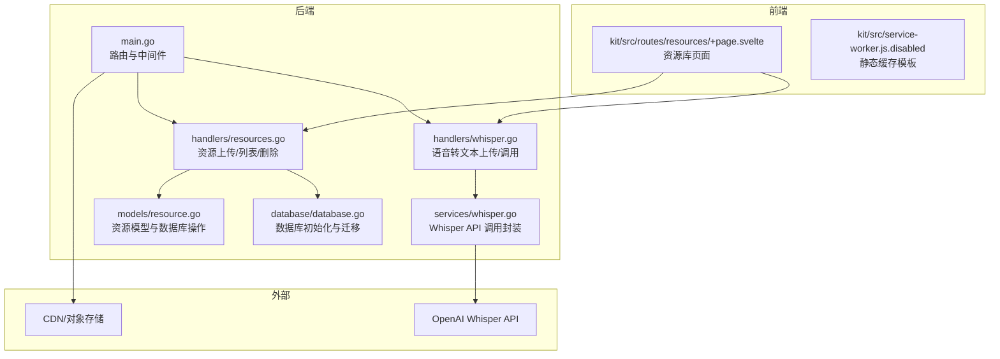
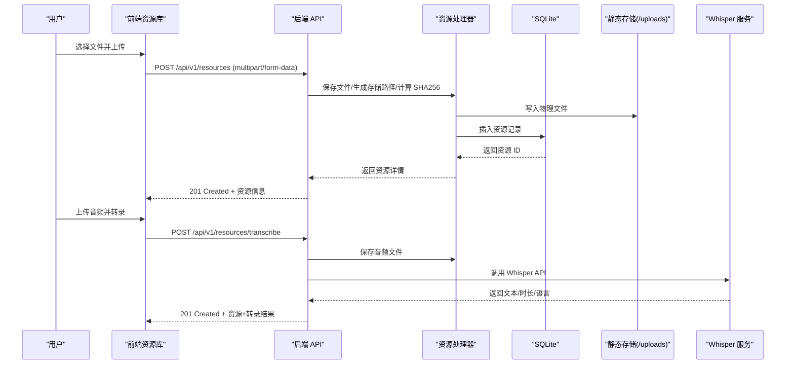
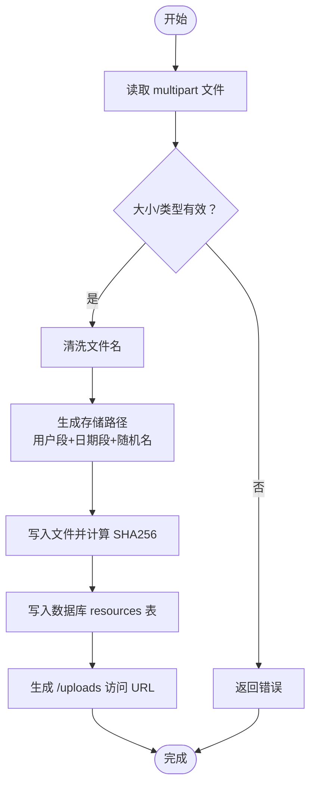
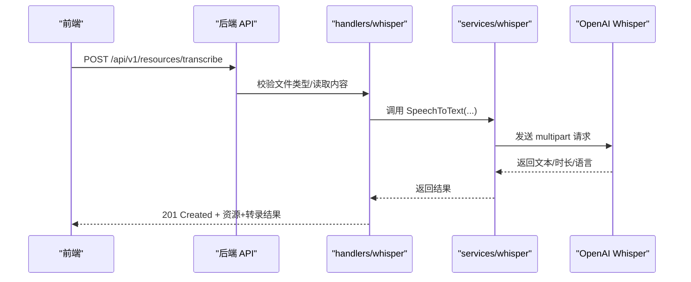
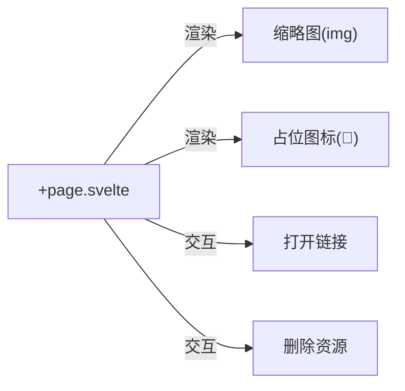
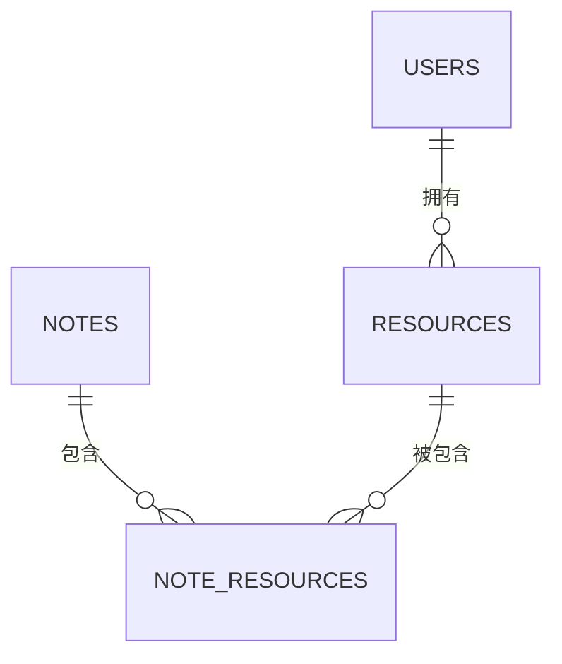
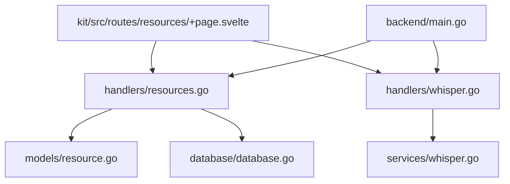

# 多媒体处理

<cite>
**本文引用的文件**
- [backend/main.go](file://backend/main.go)
- [backend/handlers/resources.go](file://backend/handlers/resources.go)
- [backend/handlers/whisper.go](file://backend/handlers/whisper.go)
- [backend/services/whisper.go](file://backend/services/whisper.go)
- [backend/models/resource.go](file://backend/models/resource.go)
- [backend/database/database.go](file://backend/database/database.go)
- [kit/src/routes/resources/+page.svelte](file://kit/src/routes/resources/+page.svelte)
- [kit/src/service-worker.js.disabled](file://kit/src/service-worker.js.disabled)
- [docker-compose.yml](file://docker-compose.yml)
- [README.md](file://README.md)
</cite>

## 目录
1. [简介](#简介)
2. [项目结构](#项目结构)
3. [核心组件](#核心组件)
4. [架构总览](#架构总览)
5. [详细组件分析](#详细组件分析)
6. [依赖关系分析](#依赖关系分析)
7. [性能考虑](#性能考虑)
8. [故障排查指南](#故障排查指南)
9. [结论](#结论)
10. [附录](#附录)

## 简介
本文件面向 Memo Studio 的多媒体处理能力，聚焦以下目标：
- 图片处理：格式支持（JPEG、PNG、WebP）、尺寸压缩、质量调整、EXIF 元数据处理现状与扩展建议
- 音频处理：格式转换（MP3、AAC、FLAC）、采样率/比特率控制、音频元数据提取现状与扩展建议
- 视频处理：转码、分辨率适配、编码格式选择、封面提取现状与扩展建议
- 缓存与 CDN：静态资源缓存、CDN 集成现状与建议
- 预览与播放：缩略图生成、在线播放现状与扩展建议
- 性能优化与存储管理：吞吐与延迟优化、存储空间治理策略

当前仓库已具备：
- 通用资源上传与列表接口
- 静态文件托管（/uploads）
- 语音转文本（Whisper）集成
- 基础前端资源库页面与图片预览
- SQLite 数据库存储资源元信息
- Service Worker 静态缓存模板

尚未实现：
- 图片/音频/视频的后端转码与缩略图生成
- CDN 集成与缓存策略
- EXIF 读取与编辑
- 音频采样率/比特率控制
- 视频转码与封面提取

## 项目结构
后端采用 Go Gin 框架，按职责拆分为 handlers、services、models、database 层；前端使用 SvelteKit，资源库页面负责展示与上传。

**图表来源**
- [backend/main.go](file://backend/main.go#L87-L92)
- [backend/handlers/resources.go](file://backend/handlers/resources.go#L91-L155)
- [backend/handlers/whisper.go](file://backend/handlers/whisper.go#L31-L104)
- [backend/services/whisper.go](file://backend/services/whisper.go#L45-L138)
- [backend/models/resource.go](file://backend/models/resource.go#L36-L76)
- [backend/database/database.go](file://backend/database/database.go#L408-L438)
- [kit/src/routes/resources/+page.svelte](file://kit/src/routes/resources/+page.svelte#L130-L195)
- [kit/src/service-worker.js.disabled](file://kit/src/service-worker.js.disabled#L1-L55)

**章节来源**
- [backend/main.go](file://backend/main.go#L87-L92)
- [backend/handlers/resources.go](file://backend/handlers/resources.go#L91-L155)
- [backend/handlers/whisper.go](file://backend/handlers/whisper.go#L31-L104)
- [backend/services/whisper.go](file://backend/services/whisper.go#L45-L138)
- [backend/models/resource.go](file://backend/models/resource.go#L36-L76)
- [backend/database/database.go](file://backend/database/database.go#L408-L438)
- [kit/src/routes/resources/+page.svelte](file://kit/src/routes/resources/+page.svelte#L130-L195)
- [kit/src/service-worker.js.disabled](file://kit/src/service-worker.js.disabled#L1-L55)

## 核心组件
- 资源上传与管理
  - 上传接口：multipart/form-data，限制最大 20MB，保存至 /uploads 目录，记录资源元信息（文件名、存储路径、MIME、大小、SHA256、创建时间）
  - 列表接口：按用户分页查询资源
  - 删除接口：删除数据库记录（物理文件可由定时任务清理）

- 语音转文本（Whisper）
  - 支持 MP3、WAV、M4A、OGG、WEBM、FLAC、MP4 等音频格式
  - 可选语言、提示词、温度参数
  - 可直接上传并转录，或仅转录不保存

- 前端资源库
  - 上传按钮、分页、列表卡片、缩略图预览（图片类型）
  - 打开/删除操作

- 数据存储
  - SQLite resources 表与 note_resources 关联表
  - 支持多用户隔离与资源与笔记的关联

**章节来源**
- [backend/handlers/resources.go](file://backend/handlers/resources.go#L36-L155)
- [backend/models/resource.go](file://backend/models/resource.go#L36-L169)
- [backend/handlers/whisper.go](file://backend/handlers/whisper.go#L31-L104)
- [backend/services/whisper.go](file://backend/services/whisper.go#L45-L138)
- [kit/src/routes/resources/+page.svelte](file://kit/src/routes/resources/+page.svelte#L130-L195)
- [backend/database/database.go](file://backend/database/database.go#L408-L438)

## 架构总览
后端通过 Gin 路由暴露资源与语音转文本接口，静态资源通过 /uploads 暴露；前端资源库页面通过 API 获取资源并渲染。Whisper 服务封装了 OpenAI Whisper API 的调用流程。

**图表来源**
- [backend/main.go](file://backend/main.go#L134-L140)
- [backend/handlers/resources.go](file://backend/handlers/resources.go#L91-L155)
- [backend/handlers/whisper.go](file://backend/handlers/whisper.go#L31-L104)
- [backend/services/whisper.go](file://backend/services/whisper.go#L45-L138)
- [backend/models/resource.go](file://backend/models/resource.go#L36-L76)

## 详细组件分析

### 资源上传与存储
- 输入验证与安全
  - 限制上传大小（20MB）
  - 文件名清洗（仅保留安全字符）
  - 存储路径按用户与日期组织（u{id}/YYYY/MM/DD/）
- 保存流程
  - 保存到 MEMO_STORAGE_DIR（默认 ./storage）
  - 计算 SHA256，入库 resources 表
  - 生成 /uploads/{storage_path} 访问 URL
- 列表与删除
  - 分页查询资源并返回总数
  - 删除资源记录（物理文件可异步清理）

**图表来源**
- [backend/handlers/resources.go](file://backend/handlers/resources.go#L91-L155)
- [backend/models/resource.go](file://backend/models/resource.go#L36-L76)

**章节来源**
- [backend/handlers/resources.go](file://backend/handlers/resources.go#L36-L155)
- [backend/models/resource.go](file://backend/models/resource.go#L36-L76)
- [backend/database/database.go](file://backend/database/database.go#L408-L438)

### 语音转文本（Whisper）
- 支持格式与参数
  - 支持 MP3、WAV、M4A、OGG、WEBM、FLAC、MP4
  - 参数：language、prompt、temperature
- 调用流程
  - 上传音频并转录：保存文件 + 调用 Whisper API + 返回文本/时长/语言
  - 仅转录：不保存文件，直接返回结果
- 配置
  - OPENAI_API_KEY、OPENAI_BASE_URL、WHISPER_MODEL
  - 默认超时 60 秒

**图表来源**
- [backend/handlers/whisper.go](file://backend/handlers/whisper.go#L31-L104)
- [backend/services/whisper.go](file://backend/services/whisper.go#L45-L138)

**章节来源**
- [backend/handlers/whisper.go](file://backend/handlers/whisper.go#L31-L104)
- [backend/services/whisper.go](file://backend/services/whisper.go#L45-L138)
- [README.md](file://README.md#L129-L144)

### 前端资源库与预览
- 上传与列表
  - 上传按钮触发文件选择，提交 multipart/form-data
  - 列表按分页展示，支持打开与删除
- 图片预览
  - 当 mime_type 以 image/ 开头时，渲染缩略图
  - 否则显示占位图标

**图表来源**
- [kit/src/routes/resources/+page.svelte](file://kit/src/routes/resources/+page.svelte#L130-L195)

**章节来源**
- [kit/src/routes/resources/+page.svelte](file://kit/src/routes/resources/+page.svelte#L130-L195)

### 数据模型与数据库
- 资源模型
  - 字段：id、user_id、filename、storage_path、mime_type、size、sha256、created_at
  - URL 由 storage_path 组装为 /uploads/{storage_path}
- 资源表与关联表
  - resources：资源元信息
  - note_resources：资源与笔记的多对多关联
- 迁移
  - v3：resources 与 note_resources 表

**图表来源**
- [backend/database/database.go](file://backend/database/database.go#L408-L438)
- [backend/models/resource.go](file://backend/models/resource.go#L10-L20)

**章节来源**
- [backend/models/resource.go](file://backend/models/resource.go#L10-L76)
- [backend/database/database.go](file://backend/database/database.go#L408-L438)

## 依赖关系分析
- 组件耦合
  - handlers 依赖 models 与数据库
  - whisper handlers 依赖 whisper services
  - 前端依赖后端 API
- 外部依赖
  - OpenAI Whisper API（可替换为自建/私有部署）
  - SQLite（可替换为 MySQL/PostgreSQL，需迁移）
- 潜在风险
  - /uploads 直接暴露，需配合鉴权与访问控制
  - 未实现 CDN，静态资源访问可能成为瓶颈

**图表来源**
- [backend/handlers/resources.go](file://backend/handlers/resources.go#L91-L155)
- [backend/handlers/whisper.go](file://backend/handlers/whisper.go#L31-L104)
- [backend/services/whisper.go](file://backend/services/whisper.go#L45-L138)
- [backend/models/resource.go](file://backend/models/resource.go#L36-L76)
- [backend/database/database.go](file://backend/database/database.go#L408-L438)
- [kit/src/routes/resources/+page.svelte](file://kit/src/routes/resources/+page.svelte#L130-L195)
- [backend/main.go](file://backend/main.go#L134-L140)

**章节来源**
- [backend/handlers/resources.go](file://backend/handlers/resources.go#L91-L155)
- [backend/handlers/whisper.go](file://backend/handlers/whisper.go#L31-L104)
- [backend/services/whisper.go](file://backend/services/whisper.go#L45-L138)
- [backend/models/resource.go](file://backend/models/resource.go#L36-L76)
- [backend/database/database.go](file://backend/database/database.go#L408-L438)
- [kit/src/routes/resources/+page.svelte](file://kit/src/routes/resources/+page.svelte#L130-L195)
- [backend/main.go](file://backend/main.go#L134-L140)

## 性能考虑
- 上传与存储
  - 限制上传大小（20MB）避免内存压力
  - 使用 io.MultiWriter 同时写文件与计算 SHA256，减少一次 IO
- 数据库
  - SQLite WAL 模式与外键开启已启用
  - 建议为 resources.user_id、note_resources 建立索引（当前已存在）
- 静态资源
  - /uploads 直接映射到存储目录，避免额外中间层
  - 建议引入 CDN 与缓存头，减少回源压力
- 转录
  - Whisper API 调用超时默认 60 秒，建议根据网络环境调整
  - 对大文件可考虑分块上传或服务端转码

[本节为通用指导，不直接分析具体文件]

## 故障排查指南
- 上传失败
  - 检查 Content-Type 是否为 multipart/form-data
  - 确认文件大小未超过 20MB
  - 检查 MEMO_STORAGE_DIR 权限与磁盘空间
- 资源无法访问
  - 确认 /uploads 映射正确
  - 检查 storage_path 与 URL 组装逻辑
- 语音转文本失败
  - 检查 OPENAI_API_KEY 是否设置
  - 确认 Whisper API 可达与响应格式
- 前端无法显示缩略图
  - 检查 mime_type 是否以 image/ 开头
  - 确认 /uploads 下文件存在且可读

**章节来源**
- [backend/handlers/resources.go](file://backend/handlers/resources.go#L91-L155)
- [backend/handlers/whisper.go](file://backend/handlers/whisper.go#L106-L162)
- [kit/src/routes/resources/+page.svelte](file://kit/src/routes/resources/+page.svelte#L130-L195)

## 结论
- 现状总结
  - 已具备通用资源上传、列表、删除与静态托管能力
  - 已集成 Whisper 语音转文本，支持多种音频格式
  - 前端资源库具备基本预览与交互
- 待完善方向
  - 图片/音频/视频后端转码与缩略图生成
  - EXIF 元数据读取与编辑
  - CDN 集成与缓存策略
  - 存储空间治理与定期清理
  - 更丰富的预览与播放支持

[本节为总结性内容，不直接分析具体文件]

## 附录

### 环境变量与部署
- 关键环境变量
  - MEMO_STORAGE_DIR：静态资源存储目录（默认 ./storage）
  - OPENAI_API_KEY：启用 Whisper 功能
  - OPENAI_BASE_URL、WHISPER_MODEL：Whisper 服务配置
- 容器部署
  - 使用 docker-compose 将 /data/notes.db 与 /data/storage 挂载为持久卷

**章节来源**
- [docker-compose.yml](file://docker-compose.yml#L1-L24)
- [README.md](file://README.md#L121-L144)

### 前端静态缓存（Service Worker）
- 当前为禁用状态（.disabled），模板实现了基础静态资源缓存策略
- 建议启用并结合 CDN 与缓存头优化弱网体验

**章节来源**
- [kit/src/service-worker.js.disabled](file://kit/src/service-worker.js.disabled#L1-L55)