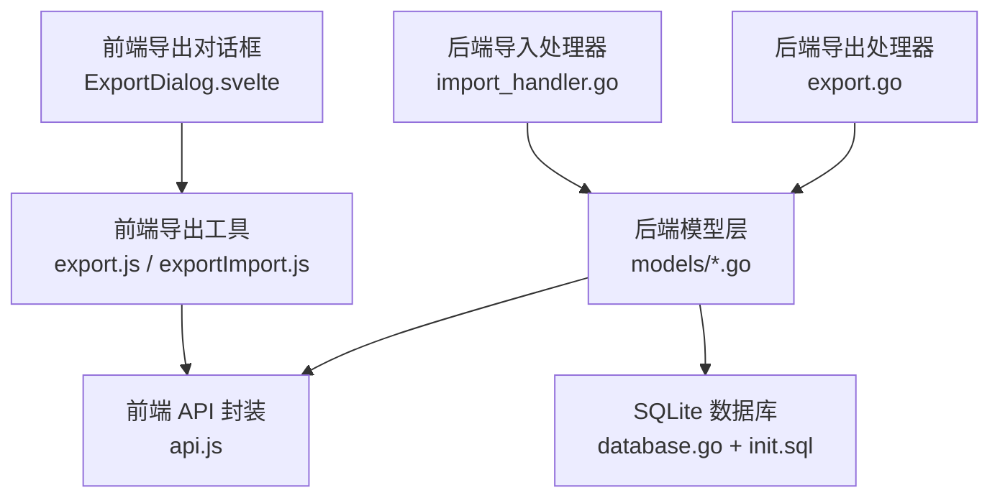
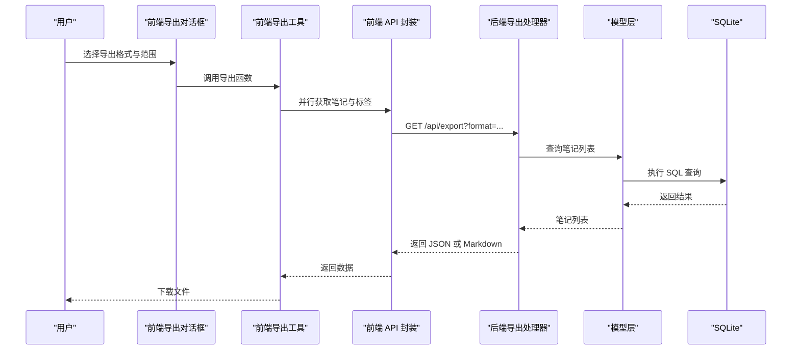
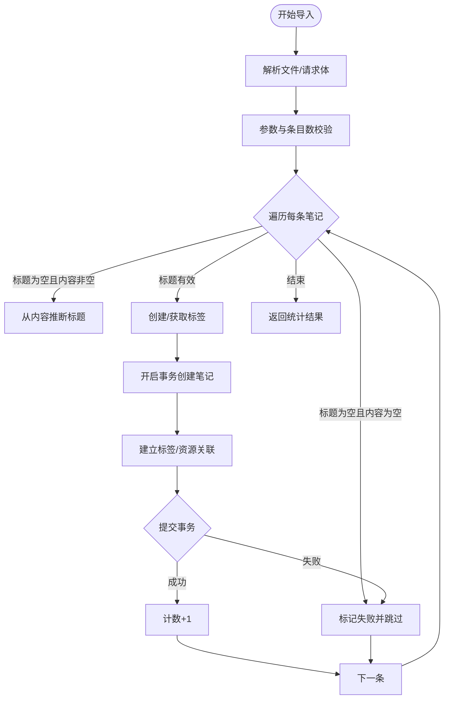
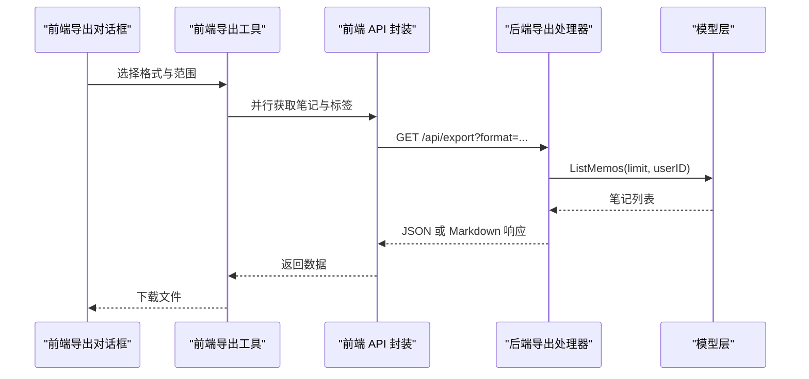
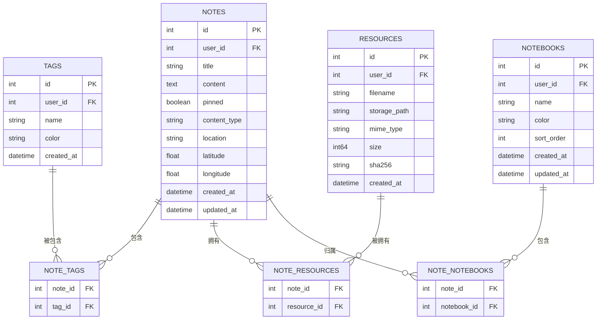
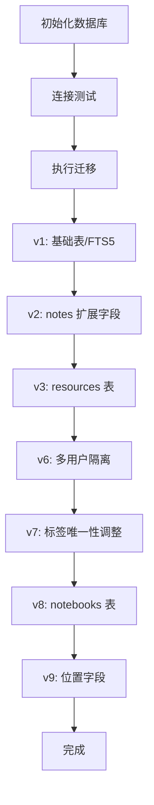
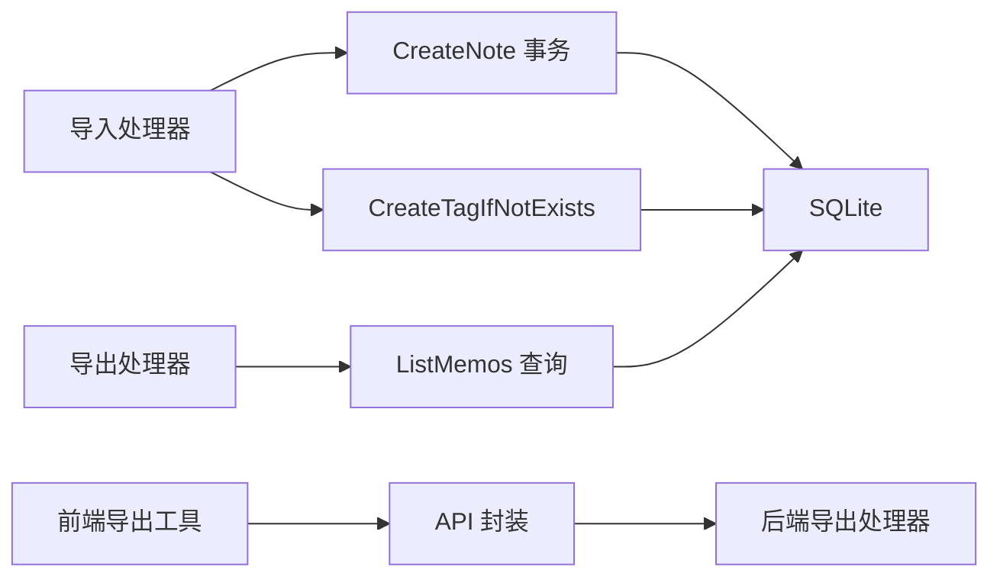

# 导入导出系统

<cite>
**本文引用的文件**
- [backend/handlers/import_handler.go](file://backend/handlers/import_handler.go)
- [backend/handlers/export.go](file://backend/handlers/export.go)
- [frontend/src/utils/exportImport.js](file://frontend/src/utils/exportImport.js)
- [frontend/src/utils/export.js](file://frontend/src/utils/export.js)
- [frontend/src/utils/api.js](file://frontend/src/utils/api.js)
- [frontend/src/components/ExportDialog.svelte](file://frontend/src/components/ExportDialog.svelte)
- [backend/models/note.go](file://backend/models/note.go)
- [backend/models/resource.go](file://backend/models/resource.go)
- [backend/models/notebook.go](file://backend/models/notebook.go)
- [backend/database/database.go](file://backend/database/database.go)
- [server/db/init.sql](file://server/db/init.sql)
</cite>

## 目录
1. [简介](#简介)
2. [项目结构](#项目结构)
3. [核心组件](#核心组件)
4. [架构总览](#架构总览)
5. [详细组件分析](#详细组件分析)
6. [依赖关系分析](#依赖关系分析)
7. [性能考量](#性能考量)
8. [故障排查指南](#故障排查指南)
9. [结论](#结论)
10. [附录](#附录)

## 简介
本文件面向 Memo Studio 的导入导出系统，提供从架构、数据流、处理逻辑到最佳实践的完整技术文档。重点覆盖：
- 导入：支持 JSON/Markdown/纯文本导入，批量写入与事务保障，字段映射与错误处理
- 导出：支持 JSON/Markdown/CSV/HTML/纯文本导出，元数据保留与格式选择
- 数据格式标准：文件类型、编码、版本兼容性
- 数据映射关系：字段对应、类型转换、错误处理策略
- 批量操作：进度跟踪、错误恢复、事务处理
- API 使用示例与最佳实践
- 数据迁移指南与常见问题解决方案

## 项目结构
导入导出涉及前后端多模块协作：
- 后端提供导入/导出 API，封装数据库事务与模型层调用
- 前端提供导出对话框与通用导出工具，支持多种格式
- 数据模型涵盖笔记、标签、资源、笔记本等实体及关联关系
- 数据库初始化与迁移脚本确保 schema 版本演进与兼容

**图表来源**
- [frontend/src/components/ExportDialog.svelte](file://frontend/src/components/ExportDialog.svelte#L1-L103)
- [frontend/src/utils/export.js](file://frontend/src/utils/export.js#L1-L103)
- [frontend/src/utils/exportImport.js](file://frontend/src/utils/exportImport.js#L1-L321)
- [frontend/src/utils/api.js](file://frontend/src/utils/api.js#L1-L316)
- [backend/handlers/import_handler.go](file://backend/handlers/import_handler.go#L1-L85)
- [backend/handlers/export.go](file://backend/handlers/export.go#L1-L86)
- [backend/models/note.go](file://backend/models/note.go#L1-L846)
- [backend/database/database.go](file://backend/database/database.go#L1-L677)
- [server/db/init.sql](file://server/db/init.sql#L1-L19)

**章节来源**
- [backend/handlers/import_handler.go](file://backend/handlers/import_handler.go#L1-L85)
- [backend/handlers/export.go](file://backend/handlers/export.go#L1-L86)
- [frontend/src/utils/export.js](file://frontend/src/utils/export.js#L1-L103)
- [frontend/src/utils/exportImport.js](file://frontend/src/utils/exportImport.js#L1-L321)
- [frontend/src/utils/api.js](file://frontend/src/utils/api.js#L1-L316)
- [backend/models/note.go](file://backend/models/note.go#L1-L846)
- [backend/models/resource.go](file://backend/models/resource.go#L1-L187)
- [backend/models/notebook.go](file://backend/models/notebook.go#L1-L206)
- [backend/database/database.go](file://backend/database/database.go#L1-L677)
- [server/db/init.sql](file://server/db/init.sql#L1-L19)

## 核心组件
- 后端导入处理器
  - 支持 JSON 请求体，限制单次最大条目数，逐条创建笔记并建立标签关联
  - 标题缺省时自动推断，空内容/标题保护，失败计数统计
- 后端导出处理器
  - 支持 JSON/Markdown 两种格式，带分页限制与时间戳元数据
  - Markdown 导出包含标题、标签、内容与分隔线
- 前端导出工具
  - 提供 Markdown/HTML/纯文本/CSV/JSON 多格式导出，支持分组与标签渲染
  - 通过 API 获取笔记与标签，统一下载
- 前端导入工具
  - 支持 JSON/Markdown/纯文本解析，提取笔记数组并逐条创建
- 数据模型与事务
  - 笔记创建/更新使用事务，标签与资源关联通过中间表维护
  - 数据库迁移确保多用户隔离、笔记本与资源表等演进

**章节来源**
- [backend/handlers/import_handler.go](file://backend/handlers/import_handler.go#L24-L84)
- [backend/handlers/export.go](file://backend/handlers/export.go#L15-L81)
- [frontend/src/utils/export.js](file://frontend/src/utils/export.js#L76-L102)
- [frontend/src/utils/exportImport.js](file://frontend/src/utils/exportImport.js#L180-L246)
- [backend/models/note.go](file://backend/models/note.go#L46-L105)

## 架构总览
导入导出系统采用前后端分离架构：
- 前端负责用户交互与数据展示，调用统一 API 封装
- 后端负责业务逻辑与数据持久化，提供 RESTful 接口
- 数据库通过迁移脚本管理版本演进，确保向后兼容

**图表来源**
- [frontend/src/components/ExportDialog.svelte](file://frontend/src/components/ExportDialog.svelte#L20-L42)
- [frontend/src/utils/export.js](file://frontend/src/utils/export.js#L76-L102)
- [frontend/src/utils/api.js](file://frontend/src/utils/api.js#L155-L163)
- [backend/handlers/export.go](file://backend/handlers/export.go#L16-L40)
- [backend/models/note.go](file://backend/models/note.go#L268-L327)
- [backend/database/database.go](file://backend/database/database.go#L21-L60)

## 详细组件分析

### 导入流程（JSON/Markdown/纯文本）
- 输入解析
  - JSON：直接解析为笔记数组
  - Markdown/纯文本：按约定格式解析为笔记数组（标题、标签、内容）
- 数据映射
  - 标题/内容/标签字段映射至模型层
  - 标签名去重并创建标签，建立笔记-标签关联
- 事务与批量
  - 单条创建使用事务，失败不影响其他条目
  - 单次最多 500 条，避免超大负载
- 错误处理
  - 参数校验失败返回 400
  - 导入条目为空或标题内容均为空则计入失败
  - 标题缺省时自动截取内容前 77 字作为标题，否则使用“未命名”

**图表来源**
- [backend/handlers/import_handler.go](file://backend/handlers/import_handler.go#L30-L84)
- [backend/models/note.go](file://backend/models/note.go#L46-L105)
- [backend/models/note.go](file://backend/models/note.go#L594-L629)

**章节来源**
- [backend/handlers/import_handler.go](file://backend/handlers/import_handler.go#L12-L84)
- [frontend/src/utils/exportImport.js](file://frontend/src/utils/exportImport.js#L250-L321)
- [backend/models/note.go](file://backend/models/note.go#L46-L105)

### 导出流程（JSON/Markdown/CSV/HTML/纯文本）
- 前端导出
  - 导出对话框支持选择导出全部或选中笔记，选择格式后统一调用导出工具
  - 导出工具根据格式生成内容并触发浏览器下载
- 后端导出
  - 支持 JSON/Markdown 两种格式，带 limit 参数控制导出数量
  - Markdown 导出包含标题、标签、内容与分隔线，附加导出时间戳
- 元数据保留
  - 笔记标题、内容、标签、创建/更新时间等字段保留
  - 资源与笔记本信息在前端导出工具中可扩展

**图表来源**
- [frontend/src/components/ExportDialog.svelte](file://frontend/src/components/ExportDialog.svelte#L20-L42)
- [frontend/src/utils/export.js](file://frontend/src/utils/export.js#L76-L102)
- [frontend/src/utils/api.js](file://frontend/src/utils/api.js#L155-L163)
- [backend/handlers/export.go](file://backend/handlers/export.go#L16-L40)
- [backend/models/note.go](file://backend/models/note.go#L268-L327)

**章节来源**
- [frontend/src/components/ExportDialog.svelte](file://frontend/src/components/ExportDialog.svelte#L1-L103)
- [frontend/src/utils/export.js](file://frontend/src/utils/export.js#L1-L103)
- [backend/handlers/export.go](file://backend/handlers/export.go#L15-L81)

### 数据模型与关系
- 笔记（Note）：标题、内容、内容类型、标签、资源、笔记本、位置信息等
- 标签（Tag）：名称、颜色、用户归属
- 资源（Resource）：文件名、存储路径、MIME 类型、大小、哈希
- 笔记-标签/笔记-资源/笔记-笔记本：通过中间表维护多对多关系
- 事务：创建/更新笔记时，标签与资源关联在单事务内完成

**图表来源**
- [backend/models/note.go](file://backend/models/note.go#L11-L27)
- [backend/models/note.go](file://backend/models/note.go#L518-L548)
- [backend/models/resource.go](file://backend/models/resource.go#L10-L20)
- [backend/models/notebook.go](file://backend/models/notebook.go#L10-L19)

**章节来源**
- [backend/models/note.go](file://backend/models/note.go#L11-L27)
- [backend/models/note.go](file://backend/models/note.go#L518-L548)
- [backend/models/resource.go](file://backend/models/resource.go#L10-L20)
- [backend/models/notebook.go](file://backend/models/notebook.go#L10-L19)

### 数据库初始化与迁移
- 初始化：SQLite 连接、PRAGMA 设置、表结构与 FTS5 触发器
- 迁移：版本化 schema 升级，支持多用户隔离、笔记本、资源、位置字段等
- 兼容性：通过 user_version 与条件判断确保幂等升级

**图表来源**
- [backend/database/database.go](file://backend/database/database.go#L21-L60)
- [backend/database/database.go](file://backend/database/database.go#L62-L178)
- [server/db/init.sql](file://server/db/init.sql#L12-L19)

**章节来源**
- [backend/database/database.go](file://backend/database/database.go#L21-L60)
- [backend/database/database.go](file://backend/database/database.go#L62-L178)
- [server/db/init.sql](file://server/db/init.sql#L12-L19)

## 依赖关系分析
- 导入依赖
  - 导入处理器依赖模型层的笔记创建与标签创建
  - 标签创建具备去重与颜色生成逻辑
- 导出依赖
  - 导出处理器依赖模型层的笔记列表查询
  - 前端导出工具依赖 API 封装获取笔记与标签
- 数据库依赖
  - 所有读写操作依赖 SQLite 连接与迁移后的 schema
  - FTS5 触发器与索引影响全文检索与查询性能

**图表来源**
- [backend/handlers/import_handler.go](file://backend/handlers/import_handler.go#L66-L72)
- [backend/models/note.go](file://backend/models/note.go#L46-L105)
- [backend/models/note.go](file://backend/models/note.go#L594-L629)
- [backend/handlers/export.go](file://backend/handlers/export.go#L32-L40)
- [frontend/src/utils/api.js](file://frontend/src/utils/api.js#L155-L163)

**章节来源**
- [backend/handlers/import_handler.go](file://backend/handlers/import_handler.go#L1-L85)
- [backend/handlers/export.go](file://backend/handlers/export.go#L1-L86)
- [frontend/src/utils/api.js](file://frontend/src/utils/api.js#L1-L316)
- [backend/models/note.go](file://backend/models/note.go#L1-L846)

## 性能考量
- 导入
  - 单次上限 500 条，避免一次性写入过大造成锁竞争
  - 逐条事务创建，失败不影响整体导入进度
- 导出
  - limit 参数默认 500，最大 2000，防止超大数据集导出阻塞
  - 前端并行获取笔记与标签，减少等待时间
- 数据库
  - WAL 模式、busy_timeout、外键约束提升并发与一致性
  - FTS5 触发器与索引优化全文检索，但需注意迁移与兼容性

[本节为通用性能讨论，无需具体文件分析]

## 故障排查指南
- 导入失败
  - 请求参数错误：检查 JSON 结构与字段类型
  - 单次导入超过上限：拆分为多次请求
  - 标题与内容均为空：补齐标题或内容
- 导出失败
  - 查询异常：检查 limit 参数与用户权限
  - 文件下载失败：确认浏览器允许下载与 MIME 类型
- 数据库问题
  - 迁移失败：检查 user_version 与迁移脚本执行顺序
  - FTS5 不可用：确认构建标签与触发器创建

**章节来源**
- [backend/handlers/import_handler.go](file://backend/handlers/import_handler.go#L30-L41)
- [backend/handlers/export.go](file://backend/handlers/export.go#L25-L31)
- [backend/database/database.go](file://backend/database/database.go#L45-L52)

## 结论
Memo Studio 的导入导出系统以简洁的前后端分工实现高可用的数据流转：
- 导入侧强调健壮性与事务保障，支持多种输入格式与批量写入
- 导出侧强调灵活性与元数据保留，支持多格式与范围控制
- 数据模型与数据库迁移确保长期演进与兼容性
建议在生产环境中结合限流、重试与监控完善导入导出的稳定性与可观测性。

[本节为总结性内容，无需具体文件分析]

## 附录

### 数据格式标准
- 支持的文件类型
  - 导入：JSON、Markdown、纯文本
  - 导出：JSON、Markdown、CSV、HTML、纯文本
- 编码方式
  - 文本类导出使用 UTF-8 编码
- 版本兼容性
  - 数据库通过 user_version 与迁移脚本实现向后兼容
  - 新增字段（如笔记本、资源、位置）在迁移中逐步引入

**章节来源**
- [backend/handlers/export.go](file://backend/handlers/export.go#L44-L71)
- [backend/database/database.go](file://backend/database/database.go#L62-L178)

### 导入导出 API 使用示例与最佳实践
- 导入
  - 使用 JSON 数组提交笔记，每条包含标题、内容、标签
  - 单次不超过 500 条，失败条目单独统计
- 导出
  - 前端通过导出对话框选择范围与格式
  - 后端导出接口支持 limit 控制导出数量
- 最佳实践
  - 大数据量分批导入/导出，避免长时间占用
  - 导入前清理重复标签，减少失败率
  - 导出时保留必要的元数据（时间戳、标签）

**章节来源**
- [frontend/src/components/ExportDialog.svelte](file://frontend/src/components/ExportDialog.svelte#L20-L42)
- [frontend/src/utils/export.js](file://frontend/src/utils/export.js#L76-L102)
- [backend/handlers/export.go](file://backend/handlers/export.go#L25-L31)

### 数据映射关系与类型转换
- 字段对应
  - 标题、内容、标签、创建/更新时间
- 类型转换
  - 标签名称去重并生成颜色
  - Markdown 内容去除 HTML 标签
  - 时间字段使用 ISO 格式
- 错误处理
  - 缺省标题自动推断
  - 空内容/标题保护，失败计数统计

**章节来源**
- [backend/handlers/import_handler.go](file://backend/handlers/import_handler.go#L44-L60)
- [frontend/src/utils/export.js](file://frontend/src/utils/export.js#L30-L45)
- [frontend/src/utils/exportImport.js](file://frontend/src/utils/exportImport.js#L267-L297)

### 批量操作实现
- 进度跟踪
  - 前端导出对话框显示加载状态
  - 后端导入返回 created/failed/total 统计
- 错误恢复
  - 单条失败不影响其他条目
  - 建议重试失败条目并记录日志
- 事务处理
  - 笔记创建与关联在单事务内完成，保证一致性

**章节来源**
- [backend/handlers/import_handler.go](file://backend/handlers/import_handler.go#L72-L84)
- [backend/models/note.go](file://backend/models/note.go#L51-L105)

### 数据迁移指南
- 从旧版本升级
  - 确保迁移脚本按版本顺序执行
  - 检查 user_version 与表结构一致性
- 多用户隔离
  - 迁移历史数据到主用户，避免共享数据
- 新功能启用
  - 笔记本、资源、位置字段在迁移中逐步引入
  - FTS5 触发器与索引需正确创建

**章节来源**
- [backend/database/database.go](file://backend/database/database.go#L62-L178)
- [backend/database/database.go](file://backend/database/database.go#L564-L591)