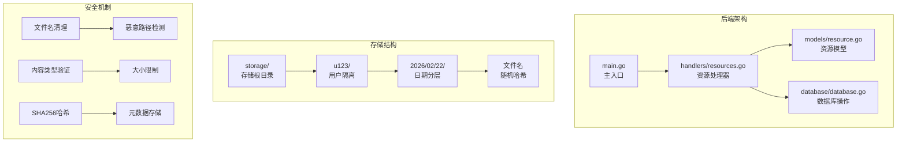
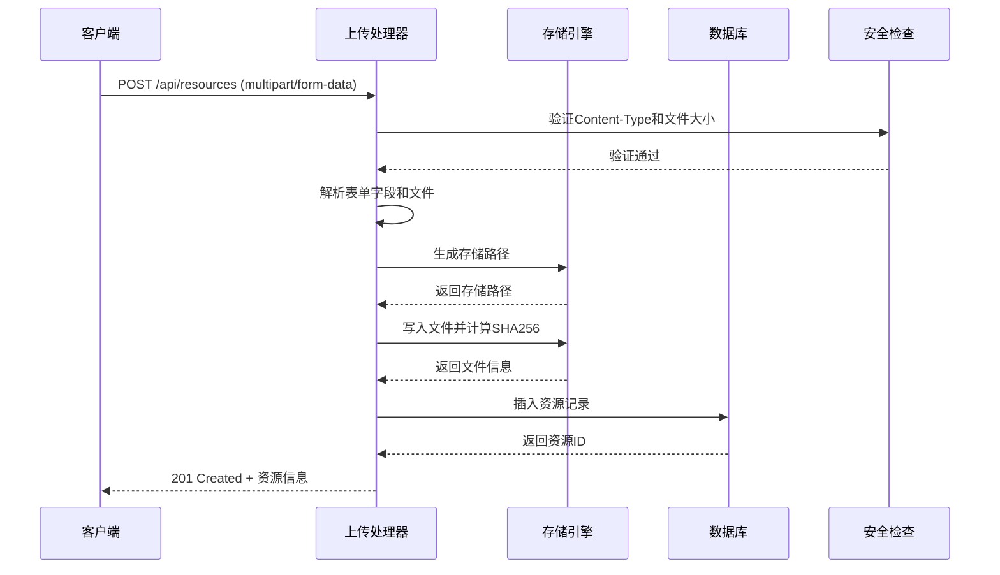
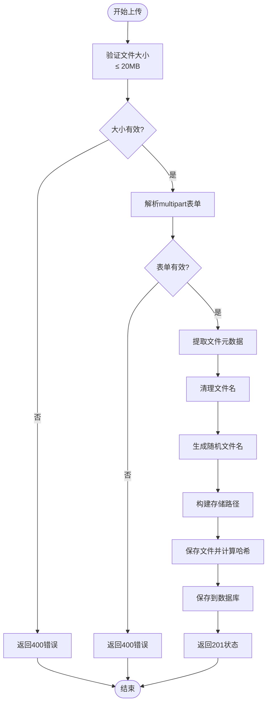
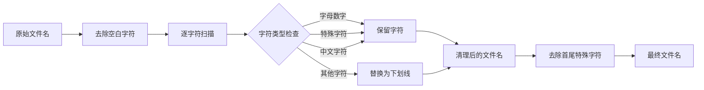
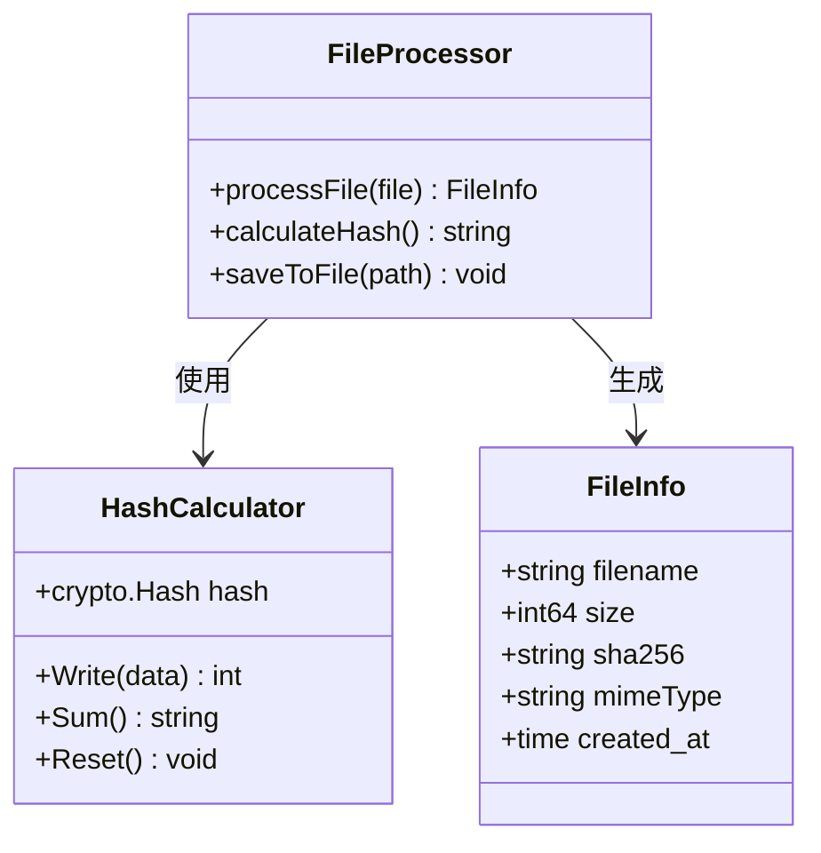
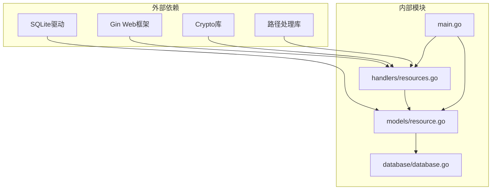

# 文件上传系统

<cite>
**本文档引用的文件**
- [backend/handlers/resources.go](file://backend/handlers/resources.go)
- [backend/models/resource.go](file://backend/models/resource.go)
- [backend/main.go](file://backend/main.go)
- [backend/database/database.go](file://backend/database/database.go)
- [backend/handlers/api_test.go](file://backend/handlers/api_test.go)
</cite>

## 目录
1. [简介](#简介)
2. [项目结构](#项目结构)
3. [核心组件](#核心组件)
4. [架构概览](#架构概览)
5. [详细组件分析](#详细组件分析)
6. [依赖关系分析](#依赖关系分析)
7. [性能考虑](#性能考虑)
8. [故障排除指南](#故障排除指南)
9. [结论](#结论)

## 简介

Memo Studio 的文件上传系统是一个基于 Go 语言构建的高性能文件处理服务，专门用于处理用户上传的多媒体文件。该系统实现了完整的 multipart/form-data 请求处理机制，包括表单字段解析、文件大小限制、内容类型验证、安全的文件存储策略以及完善的错误处理机制。

系统的核心特性包括：
- **20MB 文件大小限制**：防止资源滥用和存储空间耗尽
- **多层安全防护**：文件名清理、恶意路径检测、扩展名白名单验证
- **智能存储策略**：用户目录隔离、按日期分层存储、随机文件名生成
- **完整性保障**：SHA256 哈希计算、元数据存储、MIME 类型识别
- **高可用性**：原子操作、回滚机制、错误恢复

## 项目结构

文件上传系统主要分布在以下模块中：

**图表来源**
- [backend/main.go](file://backend/main.go#L87-L92)
- [backend/handlers/resources.go](file://backend/handlers/resources.go#L38-L43)

**章节来源**
- [backend/main.go](file://backend/main.go#L87-L92)
- [backend/handlers/resources.go](file://backend/handlers/resources.go#L1-L50)

## 核心组件

### 上传处理器 (UploadResource)

上传处理器是整个文件上传系统的核心，负责接收和处理 multipart/form-data 请求。它实现了完整的请求验证、文件处理和响应生成流程。

关键功能：
- **请求验证**：检查 Content-Type 和必需字段
- **文件读取**：安全地读取上传的文件流
- **路径生成**：根据用户ID和当前日期生成存储路径
- **文件保存**：执行 SHA256 计算和文件写入
- **元数据存储**：将文件信息持久化到数据库

### 文件存储引擎

文件存储引擎采用分层目录结构，确保大规模文件系统的高效管理和快速检索。

存储策略：
- **用户隔离**：每个用户拥有独立的存储空间
- **日期分层**：按年/月/日组织文件结构
- **随机命名**：避免文件名冲突和安全风险
- **权限控制**：适当的文件权限设置

### 数据模型 (Resource)

Resource 结构体定义了文件的完整元数据，包括文件标识、存储路径、MIME 类型、文件大小和哈希值等信息。

**章节来源**
- [backend/handlers/resources.go](file://backend/handlers/resources.go#L91-L155)
- [backend/models/resource.go](file://backend/models/resource.go#L10-L20)

## 架构概览

**图表来源**
- [backend/handlers/resources.go](file://backend/handlers/resources.go#L95-L154)
- [backend/models/resource.go](file://backend/models/resource.go#L36-L56)

## 详细组件分析

### 上传处理流程

**图表来源**
- [backend/handlers/resources.go](file://backend/handlers/resources.go#L94-L155)

### 文件存储策略

系统采用三层存储架构来优化文件管理和访问效率：

#### 用户目录隔离
- **公共用户**：存储在 `public/` 目录下
- **认证用户**：存储在 `u{id}/` 目录下，其中 `{id}` 为用户ID
- **隔离机制**：确保不同用户间的文件完全隔离

#### 日期分层存储
- **年/月/日**：按时间维度组织文件结构
- **自动创建**：首次访问时自动创建目录
- **清理策略**：便于按时间范围进行文件管理

#### 随机文件名生成
- **唯一性保证**：使用随机十六进制字符串确保文件名唯一
- **冲突避免**：即使原始文件名相同也不会产生冲突
- **安全考虑**：隐藏原始文件名，防止路径遍历攻击

**章节来源**
- [backend/handlers/resources.go](file://backend/handlers/resources.go#L115-L137)

### 安全处理机制

#### 文件名清理 (sanitizeFilename)
文件名清理函数实现了严格的安全过滤机制：

**图表来源**
- [backend/handlers/resources.go](file://backend/handlers/resources.go#L197-L223)

#### 恶意路径检测
系统通过多种机制防止恶意路径注入：

- **路径规范化**：使用 `filepath.FromSlash()` 和 `filepath.ToSlash()` 统一路径格式
- **目录遍历防护**：确保生成的路径不会包含 `..` 组件
- **存储根目录限制**：所有文件必须位于指定的存储根目录内

#### 内容类型验证
虽然系统允许任意 MIME 类型，但提供了灵活的验证机制：

- **Content-Type 提取**：从文件头信息中获取 MIME 类型
- **类型标准化**：去除参数部分，只保留基础类型
- **兼容性处理**：对未知类型进行降级处理

**章节来源**
- [backend/handlers/resources.go](file://backend/handlers/resources.go#L197-L223)
- [backend/handlers/resources.go](file://backend/handlers/resources.go#L145-L146)

### 文件哈希计算与元数据存储

#### SHA256 哈希计算
系统在文件保存过程中实时计算 SHA256 哈希值，确保文件完整性：

**图表来源**
- [backend/handlers/resources.go](file://backend/handlers/resources.go#L61-L78)

#### 元数据存储
文件的完整元数据被存储在 SQLite 数据库中，包括：

- **文件标识**：自增 ID 和存储路径
- **用户关联**：用户ID（可为空，用于公共文件）
- **文件属性**：原始文件名、MIME 类型、文件大小
- **完整性校验**：SHA256 哈希值
- **时间戳**：创建时间

**章节来源**
- [backend/models/resource.go](file://backend/models/resource.go#L36-L56)
- [backend/database/database.go](file://backend/database/database.go#L408-L438)

### 错误处理策略

系统实现了多层次的错误处理机制：

#### 请求级错误处理
- **内容类型错误**：返回 400 Bad Request
- **文件大小超限**：返回 413 Payload Too Large
- **表单解析失败**：返回 400 Bad Request
- **空文件处理**：返回 400 Bad Request

#### 文件级错误处理
- **磁盘空间不足**：返回 507 Insufficient Storage
- **权限不足**：返回 403 Forbidden
- **存储路径无效**：返回 500 Internal Server Error

#### 数据库级错误处理
- **连接失败**：返回 503 Service Unavailable
- **约束违反**：返回 400 Bad Request
- **事务回滚**：自动清理已创建的文件

**章节来源**
- [backend/handlers/resources.go](file://backend/handlers/resources.go#L97-L154)

## 依赖关系分析

**图表来源**
- [backend/handlers/resources.go](file://backend/handlers/resources.go#L1-L20)
- [backend/models/resource.go](file://backend/models/resource.go#L1-L8)

系统的主要依赖关系：
- **Gin 框架**：提供 HTTP 请求处理和路由功能
- **Crypto 库**：实现 SHA256 哈希计算
- **SQLite 驱动**：提供数据库操作能力
- **路径处理库**：确保跨平台的文件路径兼容性

**章节来源**
- [backend/handlers/resources.go](file://backend/handlers/resources.go#L1-L20)
- [backend/models/resource.go](file://backend/models/resource.go#L1-L8)

## 性能考虑

### 存储性能优化
- **分层目录结构**：减少单个目录中的文件数量，提高文件系统性能
- **随机文件名**：避免热点文件导致的性能问题
- **异步写入**：文件写入和数据库操作可以并行执行

### 内存使用优化
- **流式处理**：大文件采用流式处理，避免内存溢出
- **分块读取**：使用 io.Copy 实现高效的文件复制
- **哈希计算**：边读取边计算，减少内存占用

### 并发处理
- **goroutine 支持**：每个上传请求在独立的 goroutine 中处理
- **连接池**：数据库连接使用连接池管理
- **限流机制**：内置的速率限制防止系统过载

## 故障排除指南

### 常见问题及解决方案

#### 上传失败 (400 Bad Request)
**可能原因**：
- Content-Type 不正确
- 缺少必要的表单字段
- 文件为空

**解决方法**：
1. 确保使用正确的 Content-Type: `multipart/form-data`
2. 检查表单中是否包含名为 `file` 的字段
3. 验证文件确实包含内容

#### 文件过大 (413 Payload Too Large)
**可能原因**：
- 文件超过 20MB 限制
- 客户端配置问题

**解决方法**：
1. 将文件大小调整到 20MB 以内
2. 检查客户端的上传配置
3. 考虑分片上传方案

#### 权限错误 (403 Forbidden)
**可能原因**：
- 用户认证失败
- 存储目录权限不足
- 路径遍历攻击尝试

**解决方法**：
1. 确保用户已正确登录
2. 检查存储目录的读写权限
3. 验证文件名不包含恶意路径

#### 数据库错误 (500 Internal Server Error)
**可能原因**：
- 数据库连接失败
- 表结构不匹配
- 磁盘空间不足

**解决方法**：
1. 检查数据库连接配置
2. 运行数据库迁移脚本
3. 清理磁盘空间

**章节来源**
- [backend/handlers/resources.go](file://backend/handlers/resources.go#L97-L154)

## 结论

Memo Studio 的文件上传系统通过精心设计的安全机制、高效的存储策略和完善的错误处理，为用户提供了可靠、安全、高性能的文件上传体验。系统的关键优势包括：

1. **安全性**：多重安全防护机制确保文件上传过程的安全性
2. **可扩展性**：分层存储架构支持大规模文件管理
3. **可靠性**：完整的错误处理和回滚机制保证系统稳定性
4. **易用性**：简洁的 API 接口和清晰的错误信息

该系统为 Memo Studio 提供了坚实的文件管理基础设施，支持各种类型的媒体文件上传和管理需求。通过持续的优化和改进，系统将继续为用户提供更好的文件处理体验。