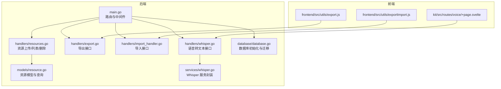
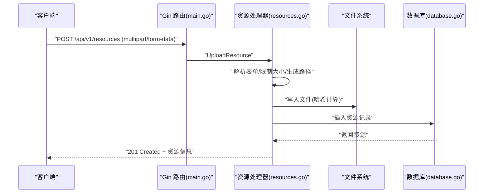
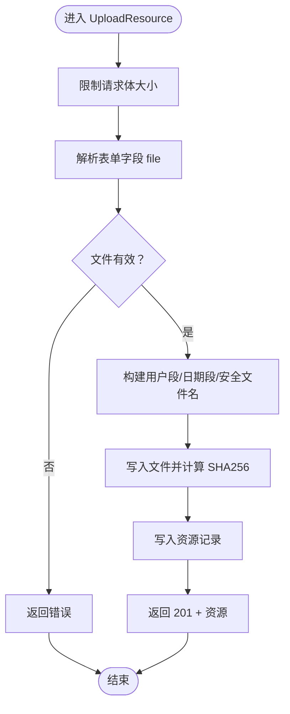
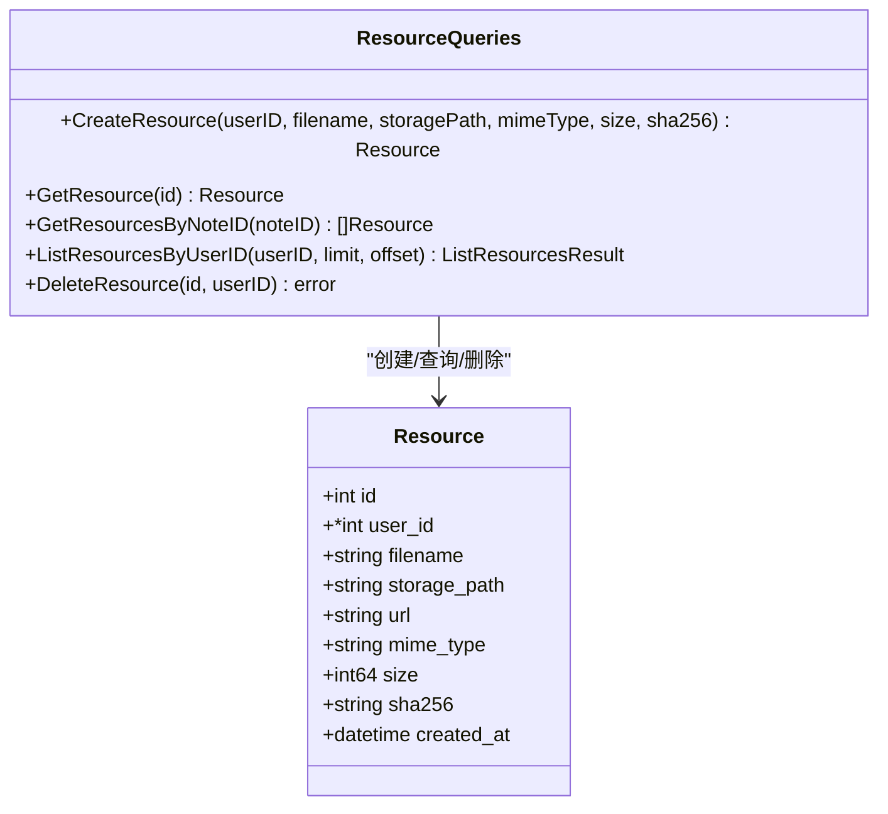
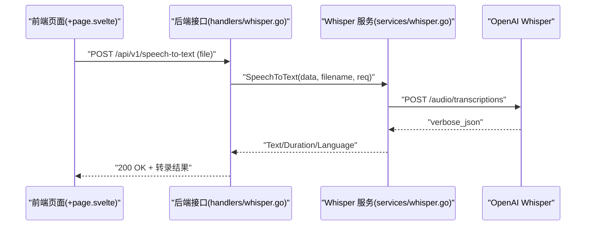
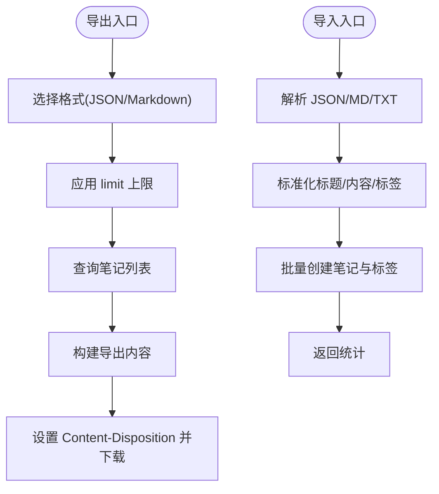
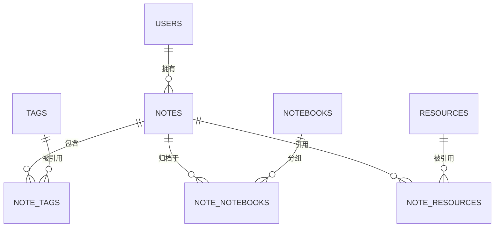
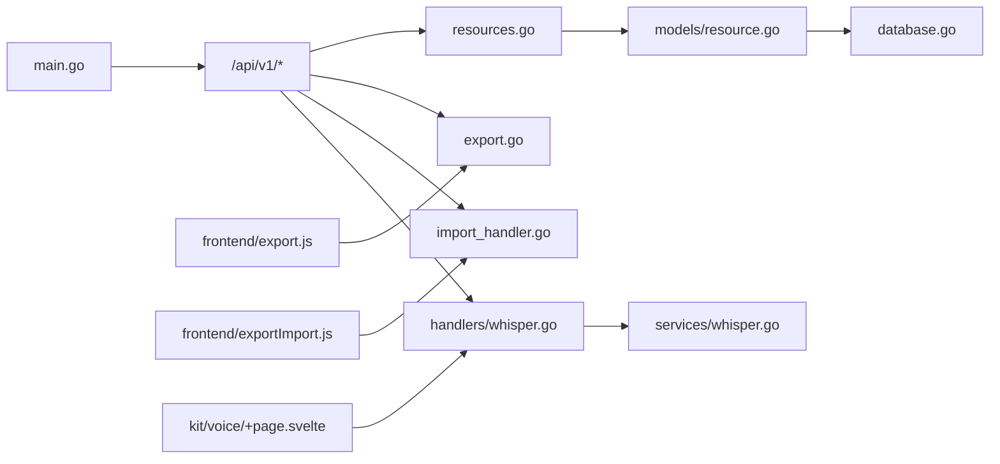

# 文件与资源管理

<cite>
**本文引用的文件**
- [backend/main.go](file://backend/main.go)
- [backend/handlers/resources.go](file://backend/handlers/resources.go)
- [backend/models/resource.go](file://backend/models/resource.go)
- [backend/handlers/export.go](file://backend/handlers/export.go)
- [backend/handlers/import_handler.go](file://backend/handlers/import_handler.go)
- [backend/services/whisper.go](file://backend/services/whisper.go)
- [backend/handlers/whisper.go](file://backend/handlers/whisper.go)
- [backend/database/database.go](file://backend/database/database.go)
- [frontend/src/utils/export.js](file://frontend/src/utils/export.js)
- [frontend/src/utils/exportImport.js](file://frontend/src/utils/exportImport.js)
- [kit/src/routes/voice/+page.svelte](file://kit/src/routes/voice/+page.svelte)
- [.env.example](file://.env.example)
</cite>

## 目录
1. [简介](#简介)
2. [项目结构](#项目结构)
3. [核心组件](#核心组件)
4. [架构总览](#架构总览)
5. [组件详解](#组件详解)
6. [依赖关系分析](#依赖关系分析)
7. [性能考量](#性能考量)
8. [故障排查指南](#故障排查指南)
9. [结论](#结论)
10. [附录](#附录)

## 简介
本章节面向 Memo Studio 的文件与资源管理子系统，围绕以下目标展开：文件上传处理（multipart/form-data 解析、类型与大小限制）、多媒体支持（图片、音频、视频的处理与转码边界）、语音识别服务集成（OpenAI Whisper 的调用与转录结果管理）、存储策略（命名规则、目录结构、备份建议）、导入导出（Markdown/JSON/CSV 支持）、最佳实践（安全、性能、空间管理）以及文件关联关系的维护与清理策略。

## 项目结构
- 后端采用 Go + Gin 框架，提供 REST API，负责资源上传、列表、删除、导出、导入、语音转文本等能力。
- 前端包含 SvelteKit 页面与工具函数，支持多种导出格式与导入解析。
- 数据库存储采用 SQLite，迁移脚本中包含资源表与笔记-资源关联表的定义。

**图表来源**
- [backend/main.go](file://backend/main.go#L87-L196)
- [backend/handlers/resources.go](file://backend/handlers/resources.go#L91-L172)
- [backend/models/resource.go](file://backend/models/resource.go#L36-L76)
- [backend/handlers/export.go](file://backend/handlers/export.go#L15-L81)
- [backend/handlers/import_handler.go](file://backend/handlers/import_handler.go#L24-L84)
- [backend/services/whisper.go](file://backend/services/whisper.go#L46-L138)
- [backend/handlers/whisper.go](file://backend/handlers/whisper.go#L67-L162)
- [backend/database/database.go](file://backend/database/database.go#L408-L438)
- [frontend/src/utils/export.js](file://frontend/src/utils/export.js#L1-L103)
- [frontend/src/utils/exportImport.js](file://frontend/src/utils/exportImport.js#L1-L321)
- [kit/src/routes/voice/+page.svelte](file://kit/src/routes/voice/+page.svelte#L1-L240)

**章节来源**
- [backend/main.go](file://backend/main.go#L87-L196)
- [backend/database/database.go](file://backend/database/database.go#L408-L438)

## 核心组件
- 资源上传处理器：解析 multipart/form-data，限制最大上传大小，生成安全文件名，写入磁盘并记录资源元数据。
- 资源模型与查询：资源实体、URL 生成、按用户分页查询、删除资源（仅删除记录，物理文件可定期清理）。
- 语音转文本服务：封装 Whisper API 调用，支持多种音频格式，返回文本、时长、语言等信息。
- 导出接口：支持 JSON 与 Markdown 格式导出，限制导出数量上限。
- 导入接口：接收 JSON 结构，批量创建笔记与标签。
- 数据库迁移：资源表与笔记-资源关联表，支持多用户隔离与唯一约束。

**章节来源**
- [backend/handlers/resources.go](file://backend/handlers/resources.go#L91-L155)
- [backend/models/resource.go](file://backend/models/resource.go#L36-L169)
- [backend/services/whisper.go](file://backend/services/whisper.go#L46-L138)
- [backend/handlers/export.go](file://backend/handlers/export.go#L15-L81)
- [backend/handlers/import_handler.go](file://backend/handlers/import_handler.go#L24-L84)
- [backend/database/database.go](file://backend/database/database.go#L408-L438)

## 架构总览
后端通过 Gin 路由暴露资源上传、导出、导入、语音转文本等接口；资源文件通过静态服务对外提供访问；数据库迁移确保资源表结构与多用户隔离；前端提供多种导出格式与导入解析工具。

**图表来源**
- [backend/main.go](file://backend/main.go#L134-L137)
- [backend/handlers/resources.go](file://backend/handlers/resources.go#L91-L155)
- [backend/database/database.go](file://backend/database/database.go#L408-L438)

## 组件详解

### 文件上传处理（multipart/form-data）
- 解析与限制
  - 使用 MaxBytesReader 限制请求体大小（默认 20MB）。
  - 读取 file 字段，校验文件大小与可读性。
- 文件命名与目录
  - 用户标识：公共目录或按用户 ID 分目录。
  - 日期分片：按年/月/日组织目录。
  - 安全命名：清洗文件名，追加随机十六进制串，避免冲突与注入。
- 存储与校验
  - 写入磁盘前确保目录存在。
  - 同时计算 SHA256，入库记录 size 与 sha256。
- 元数据与 URL
  - 数据库记录包含 filename、storage_path、mime_type、size、sha256。
  - URL 通过 /uploads/{storage_path} 访问。

**图表来源**
- [backend/handlers/resources.go](file://backend/handlers/resources.go#L91-L155)

**章节来源**
- [backend/handlers/resources.go](file://backend/handlers/resources.go#L36-L155)

### 资源模型与查询
- 资源实体包含 id、user_id、filename、storage_path、url、mime_type、size、sha256、created_at。
- URL 生成：normalizeStoragePath + "/uploads/"。
- 分页查询：按用户过滤、倒序排列、返回 items 与 total。
- 删除资源：仅删除记录，同时清理关联表；物理文件可定期清理。

**图表来源**
- [backend/models/resource.go](file://backend/models/resource.go#L10-L187)

**章节来源**
- [backend/models/resource.go](file://backend/models/resource.go#L36-L187)

### 语音识别服务集成（Whisper）
- 配置与调用
  - 从环境变量读取 API Key、BaseURL、Model，默认超时。
  - 构造 multipart/form-data，根据扩展名选择字段名（audio.mp3、audio.wav 等）。
  - 发送请求至 /audio/transcriptions，解析 verbose_json 响应。
- 前端页面
  - 支持浏览器内置语音识别（webkitSpeechRecognition/SpeechRecognition）与录音（MediaRecorder）两种模式。
  - 录音文件上传后可触发转录（需配置 OPENAI_API_KEY）。

**图表来源**
- [backend/handlers/whisper.go](file://backend/handlers/whisper.go#L67-L162)
- [backend/services/whisper.go](file://backend/services/whisper.go#L46-L138)
- [kit/src/routes/voice/+page.svelte](file://kit/src/routes/voice/+page.svelte#L29-L77)

**章节来源**
- [backend/services/whisper.go](file://backend/services/whisper.go#L46-L138)
- [backend/handlers/whisper.go](file://backend/handlers/whisper.go#L67-L162)
- [kit/src/routes/voice/+page.svelte](file://kit/src/routes/voice/+page.svelte#L1-L240)

### 导入导出功能
- 导出
  - 支持 format=json|markdown，limit 默认 500，上限 2000。
  - Markdown 导出：标题、标签、内容、分隔线与导出元信息。
  - JSON 导出：包含 exported_at、count、notes。
- 导入
  - 接收 notes 数组，每条包含 title、content、tags。
  - 标签名去空白并创建标签，批量创建笔记。
  - 单次最多 500 条，空标题自动截断 content 作为标题。
- 前端工具
  - 提供 Markdown/JSON/CSV 导出与下载工具。
  - 支持解析 Markdown 导入，提取标题、标签与内容。

**图表来源**
- [backend/handlers/export.go](file://backend/handlers/export.go#L15-L81)
- [backend/handlers/import_handler.go](file://backend/handlers/import_handler.go#L24-L84)
- [frontend/src/utils/export.js](file://frontend/src/utils/export.js#L1-L103)
- [frontend/src/utils/exportImport.js](file://frontend/src/utils/exportImport.js#L250-L321)

**章节来源**
- [backend/handlers/export.go](file://backend/handlers/export.go#L15-L81)
- [backend/handlers/import_handler.go](file://backend/handlers/import_handler.go#L24-L84)
- [frontend/src/utils/export.js](file://frontend/src/utils/export.js#L1-L103)
- [frontend/src/utils/exportImport.js](file://frontend/src/utils/exportImport.js#L1-L321)

### 存储策略与备份建议
- 存储根目录
  - 通过环境变量 MEMO_STORAGE_DIR 指定；未设置时默认 ./storage。
- 目录结构
  - 公共资源：public/年/月/日/文件
  - 用户资源：u{userID}/年/月/日/文件
- 命名规则
  - 清洗文件名，追加随机十六进制串，避免冲突与注入。
- 备份建议
  - 建议对 storage 目录与数据库文件进行周期性备份。
  - 对外通过 /uploads 提供静态访问，注意生产环境 CORS 与鉴权策略。

**章节来源**
- [backend/handlers/resources.go](file://backend/handlers/resources.go#L38-L137)
- [backend/main.go](file://backend/main.go#L87-L92)

### 数据库迁移与关联关系
- 资源表 resources：记录文件元数据，支持多用户隔离。
- 关联表 note_resources：笔记与资源的多对多关联。
- 迁移脚本确保表结构与索引存在，支持多用户标签唯一性与笔记本等扩展。

**图表来源**
- [backend/database/database.go](file://backend/database/database.go#L408-L438)

**章节来源**
- [backend/database/database.go](file://backend/database/database.go#L408-L438)

## 依赖关系分析
- 路由与中间件
  - main.go 注册 /uploads 静态服务与 /api/v1 路由组，挂载鉴权与限流中间件。
- 资源处理链路
  - handlers/resources.go 依赖 models/resource.go 与数据库迁移定义的表结构。
- 语音转文本链路
  - handlers/whisper.go 调用 services/whisper.go，后者封装 HTTP 请求与响应解析。
- 前端交互
  - 前端导出工具与导入解析通过 API 与后端对接；语音页面直接调用后端接口。

**图表来源**
- [backend/main.go](file://backend/main.go#L87-L196)
- [backend/handlers/resources.go](file://backend/handlers/resources.go#L91-L155)
- [backend/models/resource.go](file://backend/models/resource.go#L36-L76)
- [backend/handlers/export.go](file://backend/handlers/export.go#L15-L81)
- [backend/handlers/import_handler.go](file://backend/handlers/import_handler.go#L24-L84)
- [backend/services/whisper.go](file://backend/services/whisper.go#L46-L138)
- [backend/handlers/whisper.go](file://backend/handlers/whisper.go#L67-L162)
- [frontend/src/utils/export.js](file://frontend/src/utils/export.js#L1-L103)
- [frontend/src/utils/exportImport.js](file://frontend/src/utils/exportImport.js#L1-L321)
- [kit/src/routes/voice/+page.svelte](file://kit/src/routes/voice/+page.svelte#L1-L240)

**章节来源**
- [backend/main.go](file://backend/main.go#L87-L196)

## 性能考量
- 上传限制
  - 通过 MaxBytesReader 控制请求体大小，防止内存与磁盘压力过大。
- IO 与哈希
  - 写文件时同时计算 SHA256，避免二次扫描，提升完整性校验效率。
- 导出上限
  - 导出 limit 上限与默认值限制一次性数据量，避免大查询阻塞。
- 静态服务
  - /uploads 直接映射到存储目录，减少应用层处理开销。
- 数据库
  - WAL 模式、超时与外键开启提升并发与一致性。

**章节来源**
- [backend/handlers/resources.go](file://backend/handlers/resources.go#L36-L78)
- [backend/handlers/export.go](file://backend/handlers/export.go#L21-L31)
- [backend/main.go](file://backend/main.go#L87-L92)
- [backend/database/database.go](file://backend/database/database.go#L45-L52)

## 故障排查指南
- 上传失败
  - 检查是否使用 multipart/form-data 且包含 file 字段。
  - 确认文件大小未超过 20MB 限制。
  - 核对 MEMO_STORAGE_DIR 权限与磁盘空间。
- 资源访问 404
  - 确认 /uploads 映射的存储目录正确。
  - 检查 storage_path 是否与实际文件一致。
- 导出异常
  - 检查 format 参数与 limit 值范围。
  - 确认用户已登录并具备导出权限。
- 导入失败
  - 确认请求体结构符合 ImportRequest。
  - 检查单次导入条数不超过 500。
- 语音转文本
  - 确认已设置 OPENAI_API_KEY（若未设置，接口会返回未配置提示）。
  - 检查音频格式是否受支持（.mp3/.wav/.m4a/.ogg/.webm/.flac/.mp4）。
- 安全与配置
  - 生产环境务必设置 MEMO_JWT_SECRET 与 MEMO_CORS_ORIGINS。
  - 管理员密码可通过 MEMO_ADMIN_PASSWORD 设置或首次启动自动生成。

**章节来源**
- [backend/handlers/resources.go](file://backend/handlers/resources.go#L97-L113)
- [backend/handlers/export.go](file://backend/handlers/export.go#L21-L24)
- [backend/handlers/import_handler.go](file://backend/handlers/import_handler.go#L30-L41)
- [backend/handlers/whisper.go](file://backend/handlers/whisper.go#L133-L141)
- [.env.example](file://.env.example#L4-L15)

## 结论
Memo Studio 的文件与资源管理子系统以清晰的职责分离实现了上传、存储、查询、导出、导入与语音转文本的完整闭环。通过严格的上传限制、安全的文件命名与目录组织、完善的数据库迁移与关联关系，系统在易用性与可维护性之间取得平衡。建议在生产环境中强化安全配置与备份策略，并结合业务规模评估数据库与存储容量规划。

## 附录
- 环境变量参考
  - MEMO_STORAGE_DIR：存储根目录
  - MEMO_JWT_SECRET：JWT 密钥
  - MEMO_ADMIN_PASSWORD：管理员密码
  - MEMO_CORS_ORIGINS：允许的前端域名
  - OPENAI_API_KEY：Whisper API 密钥
  - OPENAI_BASE_URL：Whisper API 基础地址
  - WHISPER_MODEL：模型名称

**章节来源**
- [.env.example](file://.env.example#L4-L15)
- [backend/services/whisper.go](file://backend/services/whisper.go#L46-L62)
- [backend/handlers/whisper.go](file://backend/handlers/whisper.go#L210-L216)