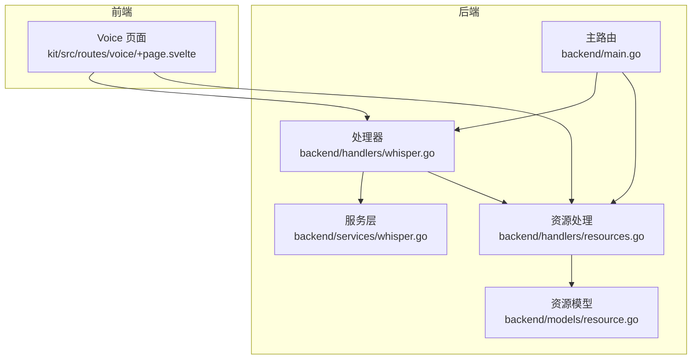
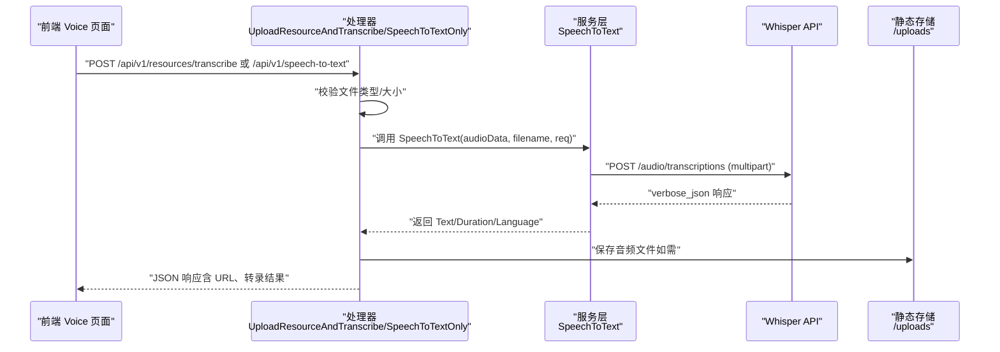
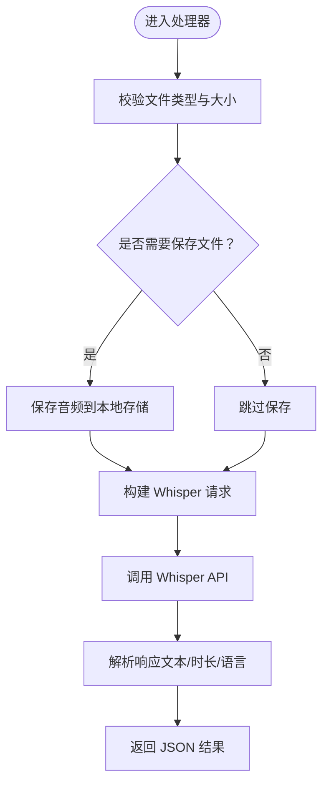
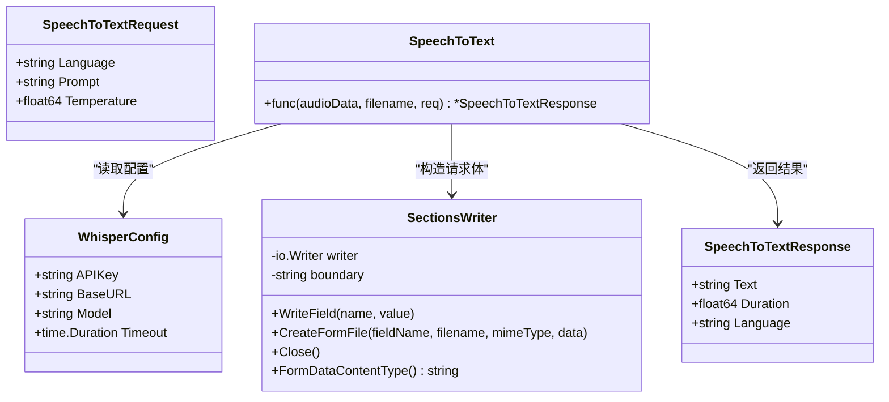
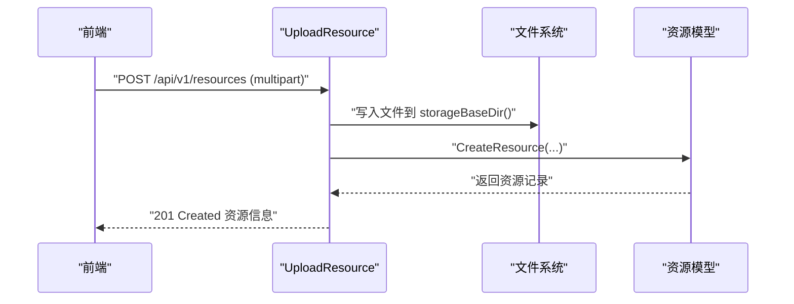
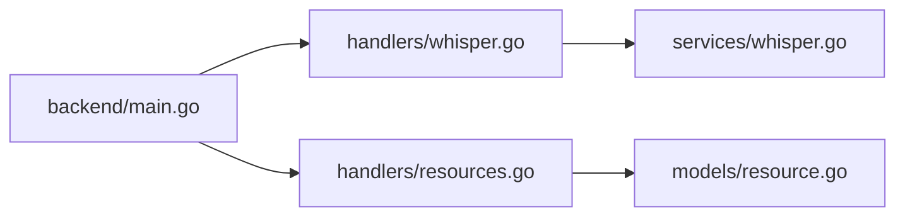

# 语音识别集成

<cite>
**本文引用的文件**
- [backend/handlers/whisper.go](file://backend/handlers/whisper.go)
- [backend/services/whisper.go](file://backend/services/whisper.go)
- [backend/handlers/resources.go](file://backend/handlers/resources.go)
- [backend/models/resource.go](file://backend/models/resource.go)
- [backend/main.go](file://backend/main.go)
- [kit/src/routes/voice/+page.svelte](file://kit/src/routes/voice/+page.svelte)
- [.env.example](file://.env.example)
</cite>

## 目录
1. [简介](#简介)
2. [项目结构](#项目结构)
3. [核心组件](#核心组件)
4. [架构总览](#架构总览)
5. [组件详解](#组件详解)
6. [依赖关系分析](#依赖关系分析)
7. [性能考量](#性能考量)
8. [故障排查指南](#故障排查指南)
9. [结论](#结论)
10. [附录](#附录)

## 简介
本文件面向 Memo Studio 的语音识别集成，系统性阐述 Whisper 模型的集成实现，包括：
- 本地模型加载与推理流程（当前实现基于云端 Whisper API）
- 音频文件预处理（格式标准化、采样率转换、噪声过滤现状）
- 语音转文字机制（实时转录、批量处理、结果缓存现状）
- 音频文件存储策略（原始音频保存、转录结果关联、元数据管理）
- 配置选项（语言选择、精度设置、处理超时）
- API 使用示例与错误处理策略
- 性能监控与资源优化建议

## 项目结构
语音识别相关能力分布在后端处理器、服务层、资源模型与前端页面中，核心路径如下：
- 后端处理器：负责 HTTP 接口、文件校验、调用 Whisper API、返回结果
- 服务层：封装 Whisper API 请求构建、发送与响应解析
- 资源模型：抽象资源实体，提供数据库持久化与 URL 生成
- 前端页面：提供语音识别与录音入口，调用后端接口

**图表来源**
- [backend/handlers/whisper.go](file://backend/handlers/whisper.go#L1-L330)
- [backend/services/whisper.go](file://backend/services/whisper.go#L1-L255)
- [backend/handlers/resources.go](file://backend/handlers/resources.go#L1-L225)
- [backend/models/resource.go](file://backend/models/resource.go#L1-L187)
- [backend/main.go](file://backend/main.go#L130-L160)
- [kit/src/routes/voice/+page.svelte](file://kit/src/routes/voice/+page.svelte#L1-L240)

**章节来源**
- [backend/handlers/whisper.go](file://backend/handlers/whisper.go#L1-L330)
- [backend/services/whisper.go](file://backend/services/whisper.go#L1-L255)
- [backend/handlers/resources.go](file://backend/handlers/resources.go#L1-L225)
- [backend/models/resource.go](file://backend/models/resource.go#L1-L187)
- [backend/main.go](file://backend/main.go#L130-L160)
- [kit/src/routes/voice/+page.svelte](file://kit/src/routes/voice/+page.svelte#L1-L240)

## 核心组件
- 语音转文本处理器（处理器层）
  - 支持上传并转录、仅转录两种模式
  - 参数：语言、提示词、温度
  - 返回：文本、时长、语言、URL 等
- 语音转文本服务（服务层）
  - 构造 multipart 请求，调用 Whisper API
  - 支持响应格式为 verbose_json，便于获取时长与语言
- 资源上传与存储（处理器层 + 模型层）
  - 上传文件保存至本地存储目录，生成资源记录
  - 提供资源列表、删除等操作
- 前端语音页面
  - 语音识别（浏览器端）与录音（MediaRecorder）入口
  - 调用后端上传与转录接口，展示结果

**章节来源**
- [backend/handlers/whisper.go](file://backend/handlers/whisper.go#L31-L162)
- [backend/services/whisper.go](file://backend/services/whisper.go#L45-L138)
- [backend/handlers/resources.go](file://backend/handlers/resources.go#L91-L155)
- [backend/models/resource.go](file://backend/models/resource.go#L36-L76)
- [kit/src/routes/voice/+page.svelte](file://kit/src/routes/voice/+page.svelte#L26-L134)

## 架构总览
整体流程：前端发起上传或转录请求 → 后端处理器接收并校验 → 服务层构造 Whisper 请求 → 发送至 OpenAI Whisper 接口 → 返回文本、时长、语言 → 组装响应返回前端。

**图表来源**
- [backend/handlers/whisper.go](file://backend/handlers/whisper.go#L31-L162)
- [backend/services/whisper.go](file://backend/services/whisper.go#L45-L138)
- [backend/main.go](file://backend/main.go#L136-L141)

**章节来源**
- [backend/handlers/whisper.go](file://backend/handlers/whisper.go#L31-L162)
- [backend/services/whisper.go](file://backend/services/whisper.go#L45-L138)
- [backend/main.go](file://backend/main.go#L136-L141)

## 组件详解

### 1) 语音转文本处理器（处理器层）
- 功能
  - 上传并转录：接收音频文件，保存到本地存储，尝试调用 Whisper API 获取文本
  - 仅转录：不保存文件，直接调用 Whisper API 返回文本
- 关键点
  - 文件类型校验（支持多种音频格式）
  - 上传大小限制
  - 从环境变量读取 Whisper 配置（API Key、Base URL、Model）
  - 构造 multipart 请求并发送
  - 解析响应，返回文本、时长、语言等字段

**图表来源**
- [backend/handlers/whisper.go](file://backend/handlers/whisper.go#L31-L162)

**章节来源**
- [backend/handlers/whisper.go](file://backend/handlers/whisper.go#L31-L162)

### 2) 语音转文本服务（服务层）
- 功能
  - 根据文件扩展名选择合适的表单字段名
  - 自动检测 MIME 类型
  - 构造 multipart 请求体，设置 Authorization 与 Content-Type
  - 设置请求超时
  - 解析 verbose_json 响应，提取文本、时长、语言
- 关键点
  - 默认 Base URL 与 Model
  - 当未配置 API Key 时，返回未配置状态（服务层逻辑）

**图表来源**
- [backend/services/whisper.go](file://backend/services/whisper.go#L17-L138)

**章节来源**
- [backend/services/whisper.go](file://backend/services/whisper.go#L17-L138)

### 3) 资源上传与存储（处理器层 + 模型层）
- 功能
  - 上传任意文件（含音频），保存到本地存储目录
  - 计算 SHA256，写入资源记录（filename、storage_path、mime_type、size、sha256）
  - 提供资源列表、按用户分页查询、删除资源
- 关键点
  - 存储目录可通过环境变量配置
  - 静态服务映射 /uploads 到存储目录
  - URL 生成规则：/uploads/{storage_path}

**图表来源**
- [backend/handlers/resources.go](file://backend/handlers/resources.go#L91-L155)
- [backend/models/resource.go](file://backend/models/resource.go#L36-L76)

**章节来源**
- [backend/handlers/resources.go](file://backend/handlers/resources.go#L91-L155)
- [backend/models/resource.go](file://backend/models/resource.go#L36-L76)

### 4) 前端语音页面
- 功能
  - 语音识别：使用浏览器端 SpeechRecognition（如可用）
  - 录音：使用 MediaRecorder 录制音频，上传至服务器
  - 上传后尝试转录，若后端未配置 Whisper，则提示保存成功
  - 保存为笔记（调用后端创建笔记接口）
- 关键点
  - 浏览器兼容性检测
  - 录音文件类型为 audio/webm
  - 上传调用后端 /api/v1/resources 接口

**章节来源**
- [kit/src/routes/voice/+page.svelte](file://kit/src/routes/voice/+page.svelte#L1-L240)

## 依赖关系分析
- 处理器依赖服务层进行 Whisper 调用
- 处理器依赖资源处理器进行文件保存
- 资源处理器依赖资源模型进行数据库持久化
- 主路由注册了语音转文本与资源相关接口

**图表来源**
- [backend/main.go](file://backend/main.go#L136-L141)
- [backend/handlers/whisper.go](file://backend/handlers/whisper.go#L1-L330)
- [backend/services/whisper.go](file://backend/services/whisper.go#L1-L255)
- [backend/handlers/resources.go](file://backend/handlers/resources.go#L1-L225)
- [backend/models/resource.go](file://backend/models/resource.go#L1-L187)

**章节来源**
- [backend/main.go](file://backend/main.go#L136-L141)
- [backend/handlers/whisper.go](file://backend/handlers/whisper.go#L1-L330)
- [backend/services/whisper.go](file://backend/services/whisper.go#L1-L255)
- [backend/handlers/resources.go](file://backend/handlers/resources.go#L1-L225)
- [backend/models/resource.go](file://backend/models/resource.go#L1-L187)

## 性能考量
- 传输与解析
  - 使用 multipart/form-data 传输音频，避免额外编码开销
  - 响应格式为 verbose_json，减少二次请求
- 超时与并发
  - 服务层设置请求超时，避免长时间阻塞
  - 建议在网关或反向代理层配置合理的上游超时
- 存储与带宽
  - 上传大小限制与静态存储映射，降低后端压力
  - 建议对大文件采用分块上传或断点续传（当前未实现）
- 缓存策略
  - 当前未实现结果缓存；可考虑基于音频哈希的缓存（需评估存储成本）
- 实时性
  - 浏览器端语音识别依赖网络，延迟主要受网络与 API 延迟影响

[本节为通用性能建议，不直接分析具体文件]

## 故障排查指南
- 常见错误与定位
  - 未配置 API Key：处理器返回“请设置 OPENAI_API_KEY 环境变量”提示
  - 文件类型不支持：处理器返回“仅支持音频文件（mp3, wav, m4a, ogg, webm, flac）”
  - 上传失败：检查 MEMO_STORAGE_DIR 权限与磁盘空间
  - Whisper API 返回非 200：解析响应体中的错误信息
- 日志与监控
  - 后端启用了 gin.Logger（开发）与 gin.Recovery（异常恢复）
  - 建议在网关层记录请求耗时与错误码
- 前端问题
  - 浏览器不支持语音识别或录音：页面会提示不支持
  - 无法访问麦克风：检查权限与设备

**章节来源**
- [backend/handlers/whisper.go](file://backend/handlers/whisper.go#L134-L141)
- [backend/handlers/whisper.go](file://backend/handlers/whisper.go#L42-L44)
- [backend/handlers/resources.go](file://backend/handlers/resources.go#L139-L152)
- [backend/services/whisper.go](file://backend/services/whisper.go#L122-L125)

## 结论
- 当前实现基于云端 Whisper API，具备完整的上传、转录、存储与返回流程
- 前端提供语音识别与录音入口，增强用户体验
- 服务层对请求构建、超时与响应解析进行了封装，便于扩展与维护
- 建议后续引入本地模型加载、结果缓存与分块上传等能力，进一步提升性能与稳定性

[本节为总结性内容，不直接分析具体文件]

## 附录

### A. 配置选项
- 环境变量
  - OPENAI_API_KEY：用于鉴权 Whisper API
  - OPENAI_BASE_URL：Whisper API 基础地址，默认 https://api.openai.com/v1
  - WHISPER_MODEL：模型名称，默认 whisper-1
  - MEMO_STORAGE_DIR：本地存储根目录，默认 ./storage
- 处理器参数
  - language：语言代码（如 zh）
  - prompt：提示文本
  - temperature：采样温度（>0）

**章节来源**
- [backend/handlers/whisper.go](file://backend/handlers/whisper.go#L210-L216)
- [backend/services/whisper.go](file://backend/services/whisper.go#L47-L62)
- [backend/handlers/resources.go](file://backend/handlers/resources.go#L38-L43)

### B. API 使用示例与错误处理
- 上传并转录
  - 方法：POST /api/v1/resources/transcribe
  - 表单字段：file（必填）、language、prompt、temperature
  - 成功响应：包含 storage_path、url、transcript、duration、language 等
  - 失败响应：包含错误信息（如文件类型不支持、保存失败、API 错误）
- 仅转录
  - 方法：POST /api/v1/speech-to-text
  - 表单字段：file（必填）、language、prompt、temperature
  - 未配置 API Key：返回 configured=false 与提示信息
  - 成功响应：text、duration、language、configured=true
- 资源上传
  - 方法：POST /api/v1/resources
  - 表单字段：file（必填）
  - 成功响应：资源记录（含 id、filename、storage_path、url、mime_type、size、sha256）

**章节来源**
- [backend/handlers/whisper.go](file://backend/handlers/whisper.go#L31-L162)
- [backend/handlers/resources.go](file://backend/handlers/resources.go#L91-L155)
- [backend/main.go](file://backend/main.go#L136-L141)

### C. 音频预处理与存储策略
- 预处理
  - 当前未实现采样率转换与噪声过滤，直接透传音频数据
  - 建议在前端或服务层增加格式标准化与降噪步骤（如 Web Audio API 或 ffmpeg）
- 存储
  - 采用日期分片与用户分段（public/u{id}）组织目录
  - 文件名包含随机后缀，避免冲突
  - URL 通过 /uploads 映射到存储目录

**章节来源**
- [backend/handlers/whisper.go](file://backend/handlers/whisper.go#L177-L208)
- [backend/handlers/resources.go](file://backend/handlers/resources.go#L115-L137)

### D. 前端交互要点
- 语音识别：依赖浏览器端 SpeechRecognition，若不可用则提示
- 录音：使用 MediaRecorder，文件类型为 audio/webm，上传后尝试转录
- 保存为笔记：调用后端创建笔记接口

**章节来源**
- [kit/src/routes/voice/+page.svelte](file://kit/src/routes/voice/+page.svelte#L26-L134)