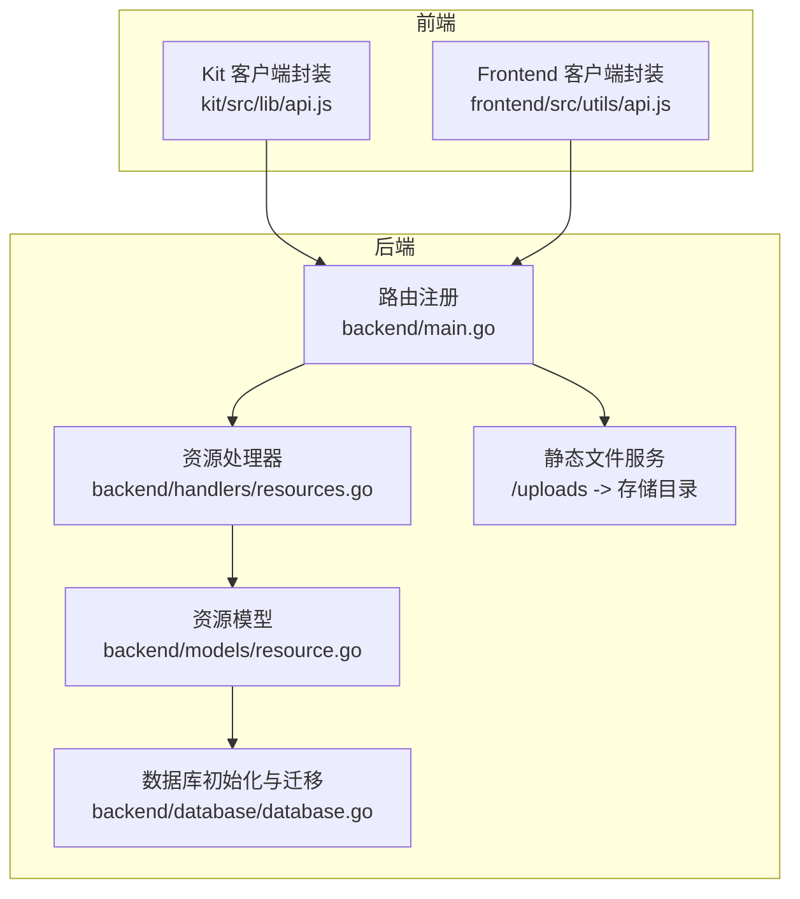
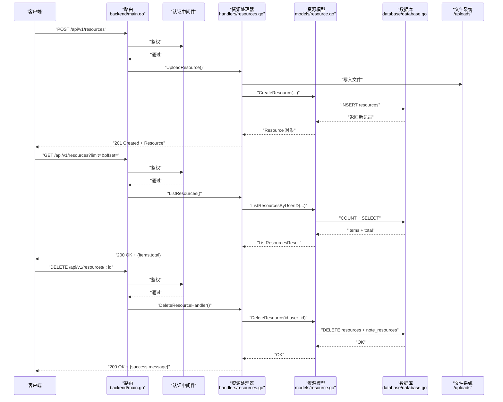
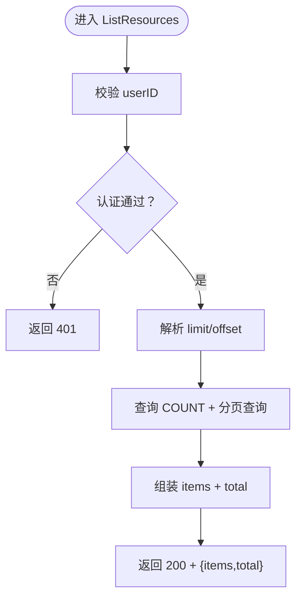
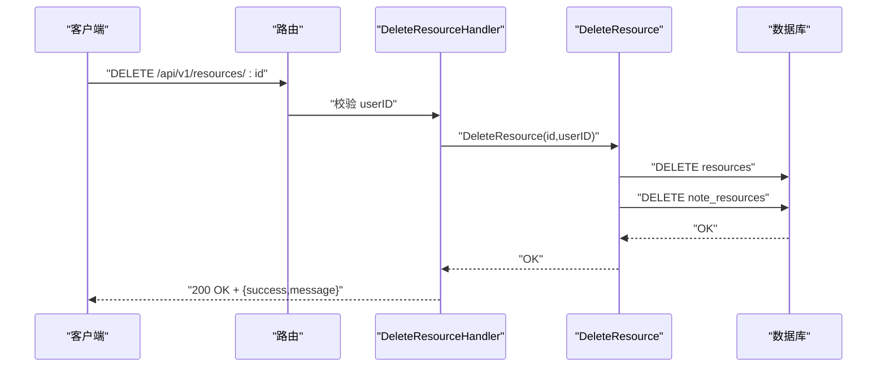
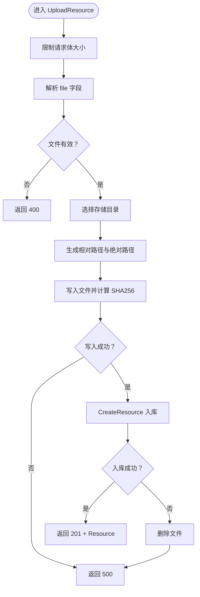
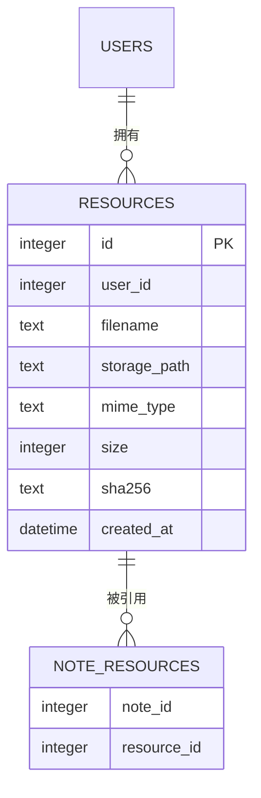
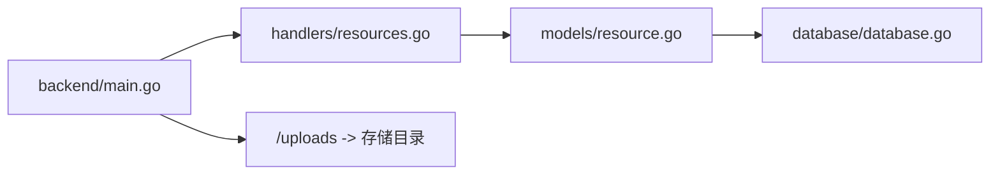

# 资源管理 API

<cite>
**本文引用的文件**
- [backend/main.go](file://backend/main.go)
- [backend/handlers/resources.go](file://backend/handlers/resources.go)
- [backend/models/resource.go](file://backend/models/resource.go)
- [backend/database/database.go](file://backend/database/database.go)
- [kit/src/lib/api.js](file://kit/src/lib/api.js)
- [frontend/src/utils/api.js](file://frontend/src/utils/api.js)
</cite>

## 目录
1. [简介](#简介)
2. [项目结构](#项目结构)
3. [核心组件](#核心组件)
4. [架构总览](#架构总览)
5. [详细组件分析](#详细组件分析)
6. [依赖关系分析](#依赖关系分析)
7. [性能考虑](#性能考虑)
8. [故障排查指南](#故障排查指南)
9. [结论](#结论)
10. [附录](#附录)

## 简介
本文件面向 Memo Studio 的资源管理 API，聚焦以下目标：
- 详述资源列表接口（GET /api/v1/resources）的分页参数、权限校验与数据格式
- 解释资源删除接口（DELETE /api/v1/resources/:id）的权限检查、删除策略与返回格式
- 描述资源创建与存储的完整流程：数据库记录创建、文件系统写入、错误回滚处理
- 提供 API 请求示例、响应格式、错误码说明
- 给出客户端集成指南与常见问题解决方案

## 项目结构
资源管理 API 的关键代码分布于后端 Go 服务与前端 JS 客户端：
- 后端路由与处理器：在主入口中注册资源相关路由，并在处理器模块中实现业务逻辑
- 数据模型与持久化：资源实体定义、数据库迁移与查询
- 文件存储：基于环境变量配置的本地存储目录，静态服务映射到 /uploads
- 前端封装：Kit 与 Frontend 两套客户端封装，提供上传、列表、删除等方法

图表来源
- [backend/main.go](file://backend/main.go#L94-L196)
- [backend/handlers/resources.go](file://backend/handlers/resources.go#L91-L195)
- [backend/models/resource.go](file://backend/models/resource.go#L36-L169)
- [backend/database/database.go](file://backend/database/database.go#L408-L438)
- [kit/src/lib/api.js](file://kit/src/lib/api.js#L154-L181)
- [frontend/src/utils/api.js](file://frontend/src/utils/api.js#L1-L316)

章节来源
- [backend/main.go](file://backend/main.go#L94-L196)
- [backend/handlers/resources.go](file://backend/handlers/resources.go#L91-L195)
- [backend/models/resource.go](file://backend/models/resource.go#L36-L169)
- [backend/database/database.go](file://backend/database/database.go#L408-L438)
- [kit/src/lib/api.js](file://kit/src/lib/api.js#L154-L181)
- [frontend/src/utils/api.js](file://frontend/src/utils/api.js#L1-L316)

## 核心组件
- 资源处理器（Handlers）
  - 权限校验：必须登录，从上下文提取 userID
  - 上传资源：解析 multipart/form-data，写入文件系统，入库，返回资源对象
  - 列表资源：按用户分页查询，返回 items 与 total
  - 删除资源：按用户与 ID 删除，返回成功消息
- 资源模型（Models）
  - 定义 Resource 结构体，包含 id、user_id、filename、storage_path、url、mime_type、size、sha256、created_at
  - 提供 CreateResource、ListResourcesByUserID、DeleteResource 等方法
  - URL 生成规则：/uploads/{storage_path}
- 数据库与迁移
  - resources 表与 note_resources 关联表
  - 自动迁移至最新版本
- 文件存储与静态服务
  - 通过环境变量 MEMO_STORAGE_DIR 指定存储根目录，默认 ./storage
  - /uploads 映射到存储目录，便于直接访问资源文件

章节来源
- [backend/handlers/resources.go](file://backend/handlers/resources.go#L22-L34)
- [backend/handlers/resources.go](file://backend/handlers/resources.go#L91-L155)
- [backend/handlers/resources.go](file://backend/handlers/resources.go#L157-L172)
- [backend/handlers/resources.go](file://backend/handlers/resources.go#L174-L195)
- [backend/models/resource.go](file://backend/models/resource.go#L10-L20)
- [backend/models/resource.go](file://backend/models/resource.go#L36-L56)
- [backend/models/resource.go](file://backend/models/resource.go#L111-L169)
- [backend/models/resource.go](file://backend/models/resource.go#L22-L34)
- [backend/database/database.go](file://backend/database/database.go#L408-L438)
- [backend/main.go](file://backend/main.go#L87-L92)

## 架构总览
资源管理 API 的调用链路如下：
- 客户端发起请求（上传/列表/删除）
- 路由中间件进行认证与权限校验
- 处理器执行业务逻辑：文件写入、数据库操作
- 模型层负责 SQL 查询与结果组装
- 文件系统与静态服务提供资源访问

图表来源
- [backend/main.go](file://backend/main.go#L94-L196)
- [backend/handlers/resources.go](file://backend/handlers/resources.go#L91-L195)
- [backend/models/resource.go](file://backend/models/resource.go#L36-L56)
- [backend/models/resource.go](file://backend/models/resource.go#L117-L169)
- [backend/models/resource.go](file://backend/models/resource.go#L171-L186)

## 详细组件分析

### 资源列表接口（GET /api/v1/resources）
- 功能概述
  - 仅认证用户可访问
  - 支持分页参数：limit、offset
  - 返回 items（资源数组）与 total（总数）
- 权限与参数
  - 必须携带有效 Bearer Token
  - limit 默认 20，最大 100；offset 默认 0
- 响应数据结构
  - items：Resource 数组
  - total：整数
- 错误码
  - 401 未认证
  - 500 服务器内部错误（查询失败）

图表来源
- [backend/handlers/resources.go](file://backend/handlers/resources.go#L157-L172)
- [backend/models/resource.go](file://backend/models/resource.go#L117-L169)

章节来源
- [backend/handlers/resources.go](file://backend/handlers/resources.go#L157-L172)
- [backend/models/resource.go](file://backend/models/resource.go#L111-L169)

### 资源删除接口（DELETE /api/v1/resources/:id）
- 功能概述
  - 仅资源所属用户可删除
  - 删除数据库记录；与笔记的关联也一并清理
  - 返回成功状态
- 权限与参数
  - 必须携带有效 Bearer Token
  - 资源 ID 必须为整数
- 删除策略
  - resources 表：DELETE WHERE id=user_id
  - note_resources 表：清理关联
- 响应
  - 200 OK + {success:true,message:"已删除"}
  - 400 无效 ID
  - 404 资源不存在或无权删除
  - 500 服务器内部错误

图表来源
- [backend/handlers/resources.go](file://backend/handlers/resources.go#L174-L195)
- [backend/models/resource.go](file://backend/models/resource.go#L171-L186)

章节来源
- [backend/handlers/resources.go](file://backend/handlers/resources.go#L174-L195)
- [backend/models/resource.go](file://backend/models/resource.go#L171-L186)

### 资源创建与存储流程（POST /api/v1/resources）
- 功能概述
  - 接收 multipart/form-data，字段 file
  - 生成安全文件名与存储路径
  - 写入文件系统并计算 SHA256
  - 入库 resources 表，返回资源对象
- 关键步骤
  - 读取上传文件句柄
  - 选择存储目录（公共或用户私有）
  - 生成相对存储路径与绝对文件路径
  - 写入文件并计算哈希
  - 入库 resources 表
  - 返回 201 Created + Resource
- 错误回滚
  - 入库失败时尝试删除已写入的文件
- 响应
  - 201 Created + Resource
  - 400 参数错误（缺少 file、空文件、非 multipart）
  - 500 服务器内部错误（文件写入或入库失败）

图表来源
- [backend/handlers/resources.go](file://backend/handlers/resources.go#L91-L155)
- [backend/models/resource.go](file://backend/models/resource.go#L36-L56)

章节来源
- [backend/handlers/resources.go](file://backend/handlers/resources.go#L91-L155)
- [backend/models/resource.go](file://backend/models/resource.go#L36-L56)

### 数据模型与数据库
- Resource 结构体字段
  - id、user_id、filename、storage_path、url、mime_type、size、sha256、created_at
- URL 生成规则
  - /uploads/{storage_path}
- 数据库迁移
  - resources 表与 note_resources 关联表
  - 自动迁移至最新版本

图表来源
- [backend/models/resource.go](file://backend/models/resource.go#L10-L20)
- [backend/models/resource.go](file://backend/models/resource.go#L22-L34)
- [backend/database/database.go](file://backend/database/database.go#L408-L438)

章节来源
- [backend/models/resource.go](file://backend/models/resource.go#L10-L20)
- [backend/models/resource.go](file://backend/models/resource.go#L22-L34)
- [backend/database/database.go](file://backend/database/database.go#L408-L438)

## 依赖关系分析
- 路由到处理器
  - /api/v1/resources -> handlers.UploadResource、handlers.ListResources、handlers.DeleteResourceHandler
- 处理器到模型
  - handlers.resources.go 依赖 models.resource.go 的 CreateResource、ListResourcesByUserID、DeleteResource
- 模型到数据库
  - models.resource.go 依赖 database.database.go 的 DB 连接与迁移
- 文件系统
  - /uploads -> 存储目录（MEMO_STORAGE_DIR 或 ./storage）

图表来源
- [backend/main.go](file://backend/main.go#L94-L196)
- [backend/handlers/resources.go](file://backend/handlers/resources.go#L91-L195)
- [backend/models/resource.go](file://backend/models/resource.go#L36-L169)
- [backend/database/database.go](file://backend/database/database.go#L408-L438)

章节来源
- [backend/main.go](file://backend/main.go#L94-L196)
- [backend/handlers/resources.go](file://backend/handlers/resources.go#L91-L195)
- [backend/models/resource.go](file://backend/models/resource.go#L36-L169)
- [backend/database/database.go](file://backend/database/database.go#L408-L438)

## 性能考虑
- 分页限制
  - limit 最大 100，避免一次性返回过多数据
- 文件大小限制
  - 请求体大小限制为 20MB，防止大文件占用带宽与磁盘
- 存储路径组织
  - 按年/月/日分目录，降低单目录文件数量
- URL 生成
  - 通过 /uploads 映射访问，减少路径拼接复杂度

章节来源
- [backend/handlers/resources.go](file://backend/handlers/resources.go#L36-L43)
- [backend/handlers/resources.go](file://backend/handlers/resources.go#L115-L137)
- [backend/models/resource.go](file://backend/models/resource.go#L117-L169)

## 故障排查指南
- 401 未认证
  - 检查 Authorization 头是否为 Bearer Token
  - 确认登录状态有效
- 400 参数错误
  - 上传时必须使用 multipart/form-data，且包含 file 字段
  - 确保文件非空
- 500 服务器内部错误
  - 文件写入失败：检查存储目录权限与磁盘空间
  - 入库失败：检查数据库连接与迁移是否完成
- 资源不可见
  - 确认 MEMO_STORAGE_DIR 配置正确
  - 确认 /uploads 静态映射生效

章节来源
- [backend/handlers/resources.go](file://backend/handlers/resources.go#L91-L155)
- [backend/handlers/resources.go](file://backend/handlers/resources.go#L157-L195)
- [backend/main.go](file://backend/main.go#L87-L92)

## 结论
资源管理 API 提供了完整的上传、列表与删除能力，具备清晰的权限控制、健壮的错误处理与合理的分页策略。通过数据库与文件系统的协同，实现了资源的可靠存储与快速访问。客户端封装提供了便捷的调用方式，便于集成到前端应用中。

## 附录

### API 请求与响应示例

- 列表资源（GET /api/v1/resources）
  - 请求
    - GET /api/v1/resources?limit=20&offset=0
    - Authorization: Bearer <token>
  - 响应
    - 200 OK
    - Body: { items: [...], total: number }

- 上传资源（POST /api/v1/resources）
  - 请求
    - POST /api/v1/resources
    - Content-Type: multipart/form-data
    - Body: file=<二进制文件>
    - Authorization: Bearer <token>
  - 响应
    - 201 Created
    - Body: Resource 对象

- 删除资源（DELETE /api/v1/resources/:id）
  - 请求
    - DELETE /api/v1/resources/:id
    - Authorization: Bearer <token>
  - 响应
    - 200 OK
    - Body: { success: true, message: "已删除" }

章节来源
- [backend/handlers/resources.go](file://backend/handlers/resources.go#L91-L195)
- [backend/models/resource.go](file://backend/models/resource.go#L111-L169)

### 客户端集成指南

- Kit 客户端
  - 列表资源：api.listResources(limit, offset)
  - 上传资源：api.uploadResource(file)
  - 删除资源：api.deleteResource(id)
- Frontend 客户端
  - 列表资源：api.getNotes() 中可参考分页参数传递方式
  - 上传资源：使用 FormData 与 Authorization 头
  - 删除资源：fetchWithAuth 包装的 DELETE 请求

章节来源
- [kit/src/lib/api.js](file://kit/src/lib/api.js#L154-L181)
- [frontend/src/utils/api.js](file://frontend/src/utils/api.js#L1-L316)