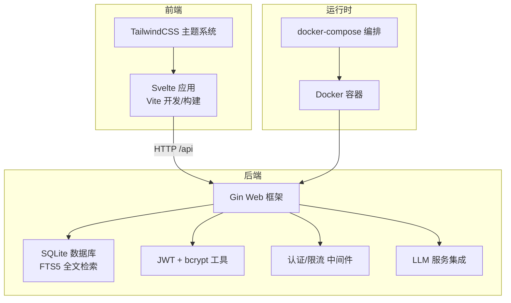
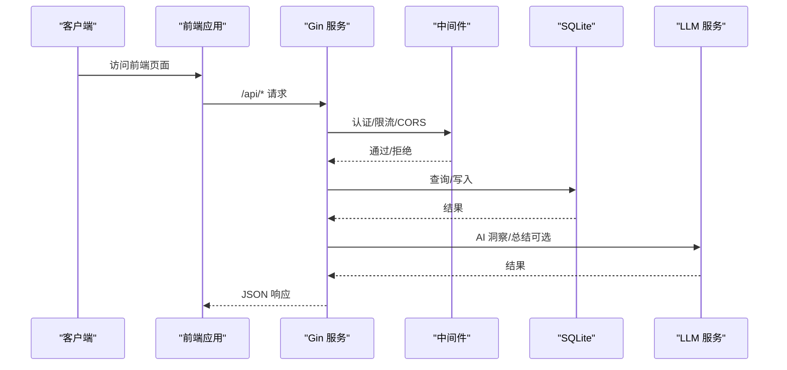
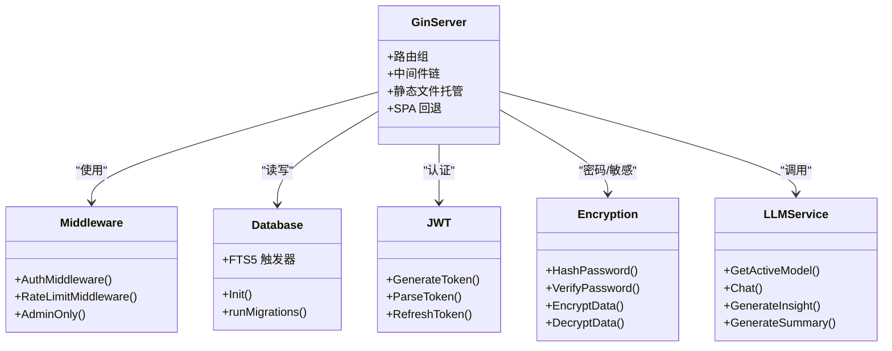
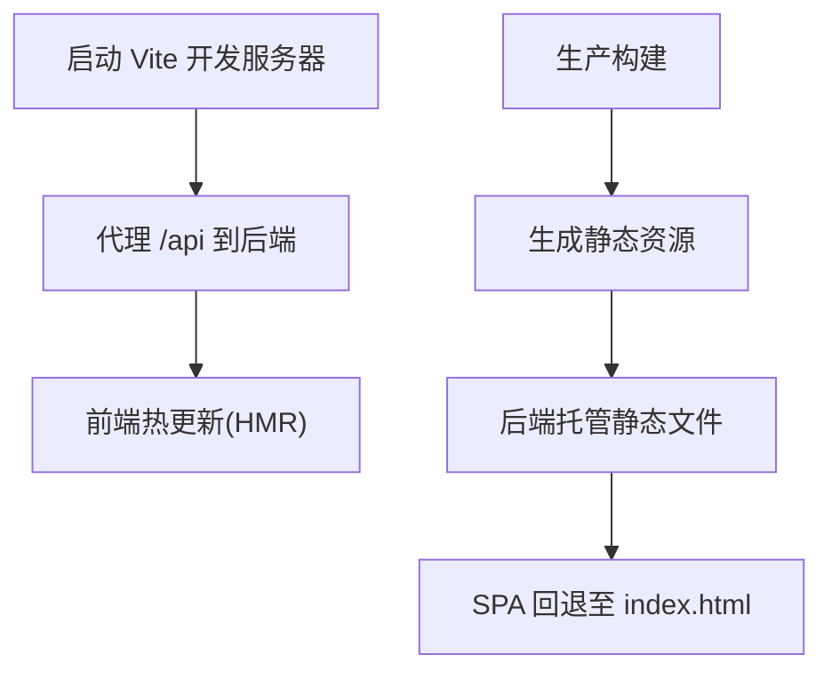
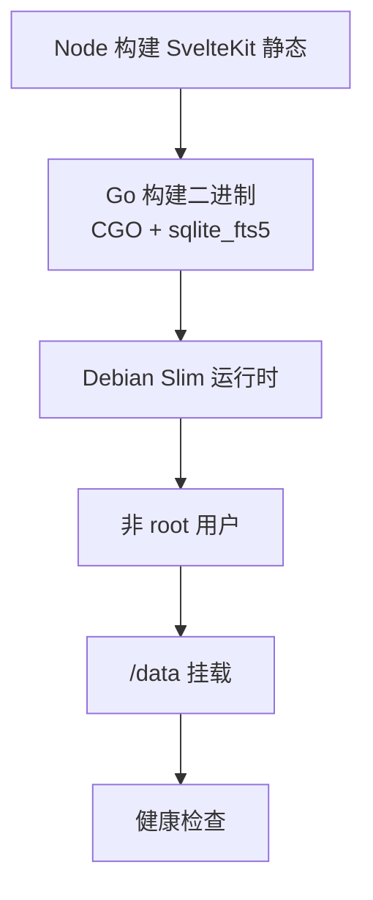
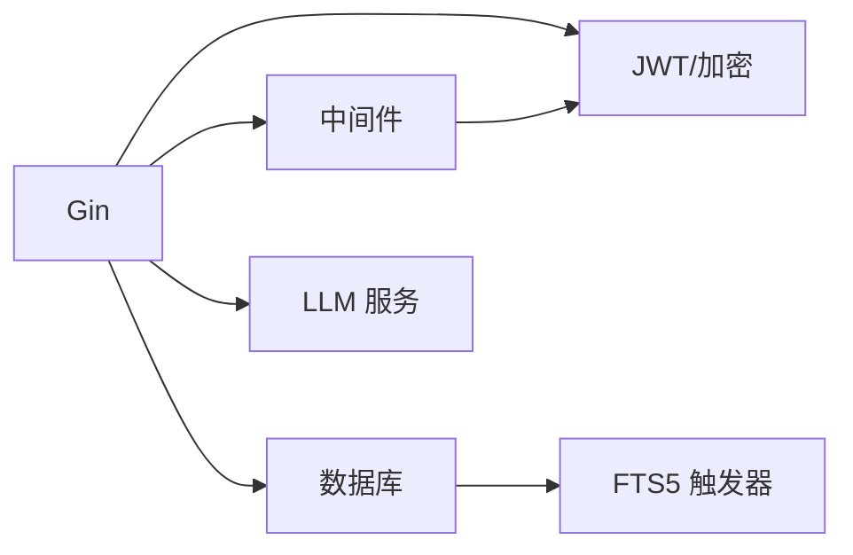

# 技术选型

<cite>
**本文引用的文件**
- [README.md](file://README.md)
- [backend/main.go](file://backend/main.go)
- [backend/go.mod](file://backend/go.mod)
- [backend/database/database.go](file://backend/database/database.go)
- [backend/utils/jwt.go](file://backend/utils/jwt.go)
- [backend/utils/encryption.go](file://backend/utils/encryption.go)
- [backend/middleware/auth.go](file://backend/middleware/auth.go)
- [backend/services/llm.go](file://backend/services/llm.go)
- [frontend/package.json](file://frontend/package.json)
- [frontend/vite.config.js](file://frontend/vite.config.js)
- [frontend/tailwind.config.js](file://frontend/tailwind.config.js)
- [kit/package.json](file://kit/package.json)
- [kit/vite.config.js](file://kit/vite.config.js)
- [Dockerfile](file://Dockerfile)
- [docker-compose.yml](file://docker-compose.yml)
</cite>

## 目录
1. [简介](#简介)
2. [项目结构](#项目结构)
3. [核心组件](#核心组件)
4. [架构总览](#架构总览)
5. [详细组件分析](#详细组件分析)
6. [依赖关系分析](#依赖关系分析)
7. [性能考量](#性能考量)
8. [故障排查指南](#故障排查指南)
9. [结论](#结论)
10. [附录](#附录)

## 简介
本技术选型文档面向 Memo Studio 的技术栈与架构决策，围绕后端 Go + Gin + SQLite、前端 Svelte + Vite + TailwindCSS、容器化与 CI/CD 工作流展开，解释各技术选型的原因、权衡与实践细节，并给出替代方案对比，帮助开发者快速理解并高效落地。

## 项目结构
项目采用前后端分离与一体化打包的混合架构：
- 后端：Go + Gin 提供 REST API，SQLite 作为数据存储，内置 JWT 认证与 bcrypt 密码哈希。
- 前端：Svelte 5 + Vite 开发体验，TailwindCSS 实现主题与样式体系。
- 容器化：Docker 多阶段构建，生产镜像精简、非 root 运行、健康检查与持久化卷。
- CI/CD：GitHub Actions 支持镜像构建与多架构推送，配合 Dependabot 自动化依赖更新。

图表来源
- [backend/main.go](file://backend/main.go#L28-L353)
- [backend/database/database.go](file://backend/database/database.go#L21-L60)
- [frontend/vite.config.js](file://frontend/vite.config.js#L1-L25)
- [Dockerfile](file://Dockerfile#L1-L81)
- [docker-compose.yml](file://docker-compose.yml#L1-L25)

章节来源
- [README.md](file://README.md#L5-L11)
- [backend/main.go](file://backend/main.go#L28-L353)
- [frontend/vite.config.js](file://frontend/vite.config.js#L1-L25)
- [Dockerfile](file://Dockerfile#L1-L81)
- [docker-compose.yml](file://docker-compose.yml#L1-L25)

## 核心组件
- 后端核心：Gin 路由、中间件、数据库初始化与迁移、JWT 认证、bcrypt 密码处理、LLM 服务抽象。
- 前端核心：Svelte 5 组件系统、Vite HMR、TailwindCSS 主题与动画。
- 数据库：SQLite + FTS5（通过构建标签启用），支持全文检索与多版本迁移。
- 容器化：多阶段构建、非 root 用户、健康检查、持久化卷、多架构镜像。
- CI/CD：Actions 自动化镜像构建与推送，支持 GHCR/GHCR 与 Docker Hub 双通道。

章节来源
- [backend/go.mod](file://backend/go.mod#L5-L11)
- [backend/database/database.go](file://backend/database/database.go#L21-L60)
- [backend/utils/jwt.go](file://backend/utils/jwt.go#L11-L20)
- [backend/utils/encryption.go](file://backend/utils/encryption.go#L93-L106)
- [backend/services/llm.go](file://backend/services/llm.go#L74-L192)
- [frontend/package.json](file://frontend/package.json#L11-L23)
- [frontend/tailwind.config.js](file://frontend/tailwind.config.js#L1-L100)
- [Dockerfile](file://Dockerfile#L1-L81)
- [docker-compose.yml](file://docker-compose.yml#L1-L25)

## 架构总览
后端以 Gin 为核心，统一处理认证、限流、CORS、静态资源与 API 路由；数据库采用 SQLite 并通过迁移机制演进；前端通过 Vite 提供开发体验，生产构建产物由后端以静态文件形式托管；容器化与编排确保部署一致性与可观测性。

图表来源
- [backend/main.go](file://backend/main.go#L94-L196)
- [backend/middleware/auth.go](file://backend/middleware/auth.go#L12-L52)
- [backend/database/database.go](file://backend/database/database.go#L21-L60)
- [backend/services/llm.go](file://backend/services/llm.go#L418-L435)

章节来源
- [backend/main.go](file://backend/main.go#L28-L353)
- [backend/middleware/auth.go](file://backend/middleware/auth.go#L12-L52)
- [backend/database/database.go](file://backend/database/database.go#L21-L60)
- [backend/services/llm.go](file://backend/services/llm.go#L418-L435)

## 详细组件分析

### 后端技术栈：Go + Gin + SQLite
- Go 语言优势
  - 高性能、并发友好、跨平台、生态成熟。
  - 与 SQLite 集成稳定，适合单机/轻量部署场景。
- Gin 框架特性
  - 路由清晰、中间件体系完善、性能优异。
  - 本项目使用 Recovery、Logger、CORS、安全响应头、静态文件托管与 SPA 回退。
- SQLite 选择理由
  - 零配置、文件即库、便于容器化与持久化卷。
  - 通过构建标签启用 FTS5，满足全文检索需求。
  - 迁移机制保障 Schema 演进与向后兼容。
- JWT 认证与 bcrypt
  - JWT 用于会话令牌，bcrypt 用于密码哈希与校验。
  - 环境变量驱动密钥注入，生产强制要求密钥配置。
- LLM 服务抽象
  - 支持云端与本地模型，统一请求封装与响应解析，便于扩展与替换。

图表来源
- [backend/main.go](file://backend/main.go#L28-L353)
- [backend/middleware/auth.go](file://backend/middleware/auth.go#L12-L71)
- [backend/database/database.go](file://backend/database/database.go#L21-L178)
- [backend/utils/jwt.go](file://backend/utils/jwt.go#L22-L76)
- [backend/utils/encryption.go](file://backend/utils/encryption.go#L93-L106)
- [backend/services/llm.go](file://backend/services/llm.go#L377-L416)

章节来源
- [backend/main.go](file://backend/main.go#L28-L353)
- [backend/database/database.go](file://backend/database/database.go#L21-L178)
- [backend/utils/jwt.go](file://backend/utils/jwt.go#L11-L20)
- [backend/utils/encryption.go](file://backend/utils/encryption.go#L93-L106)
- [backend/services/llm.go](file://backend/services/llm.go#L74-L192)

### 前端技术栈：Svelte 5 + Vite + TailwindCSS
- Svelte 5
  - 组件化开发，编译期优化，产物体积小，运行时开销低。
  - 与 Vite 协同提供热更新与快速构建。
- Vite
  - 开发服务器内置代理到后端 API，端口与代理规则明确。
  - 生产构建产物由后端托管，实现 SPA 与后端一体化。
- TailwindCSS
  - 原子化样式，支持深色主题与自定义动画，提升开发效率与一致性。

图表来源
- [frontend/vite.config.js](file://frontend/vite.config.js#L12-L23)
- [backend/main.go](file://backend/main.go#L285-L316)

章节来源
- [frontend/package.json](file://frontend/package.json#L11-L23)
- [frontend/vite.config.js](file://frontend/vite.config.js#L1-L25)
- [frontend/tailwind.config.js](file://frontend/tailwind.config.js#L1-L100)
- [backend/main.go](file://backend/main.go#L285-L316)

### 容器化与部署：Docker 与 docker-compose
- 多阶段构建
  - Node 阶段构建 SvelteKit 静态产物，Go 阶段构建二进制并启用 sqlite_fts5。
  - 运行时基于 Debian Slim，非 root 用户，设置健康检查与持久化卷。
- docker-compose
  - 端口映射、环境变量注入、数据卷挂载，一键启动生产服务。
- 多架构镜像
  - 建议同时构建 amd64 与 arm64，适配 NAS/服务器生态。

图表来源
- [Dockerfile](file://Dockerfile#L1-L81)
- [docker-compose.yml](file://docker-compose.yml#L1-L25)

章节来源
- [Dockerfile](file://Dockerfile#L1-L81)
- [docker-compose.yml](file://docker-compose.yml#L1-L25)

### CI/CD 工作流
- Actions 自动化
  - 推送 tag 触发镜像构建与多渠道推送（GHCR/GHCR 与 Docker Hub 双通道）。
  - 支持 Dependabot 自动化依赖更新 PR 的 AI Review。
- 安全与合规
  - 通过 Secrets 管理 API Key 与镜像仓库凭据。
  - 健康检查与非 root 运行增强容器安全性。

章节来源
- [README.md](file://README.md#L151-L225)
- [README.md](file://README.md#L201-L225)

## 依赖关系分析
后端依赖关系清晰，核心模块解耦良好：
- Gin 路由依赖中间件、数据库、工具模块与 LLM 服务。
- 数据库模块负责连接、迁移与 FTS5 触发器。
- JWT 与 bcrypt 提供认证与密码安全。
- LLM 服务抽象统一不同模型提供商与本地推理。

图表来源
- [backend/go.mod](file://backend/go.mod#L5-L11)
- [backend/main.go](file://backend/main.go#L28-L353)
- [backend/database/database.go](file://backend/database/database.go#L254-L276)
- [backend/utils/jwt.go](file://backend/utils/jwt.go#L22-L48)
- [backend/utils/encryption.go](file://backend/utils/encryption.go#L93-L106)
- [backend/services/llm.go](file://backend/services/llm.go#L377-L416)

章节来源
- [backend/go.mod](file://backend/go.mod#L5-L11)
- [backend/main.go](file://backend/main.go#L28-L353)

## 性能考量
- 后端
  - Gin 的中间件链与 Recovery/Logger 在开发/生产模式下的差异配置，有助于平衡可观测性与性能。
  - SQLite 的 WAL 模式与超时参数优化并发与稳定性。
  - FTS5 触发器保证全文检索一致性，注意在高并发写入场景下的触发成本。
- 前端
  - Svelte 5 编译期优化减少运行时开销；Vite HMR 提升开发效率。
  - Tailwind 原子化样式避免冗余 CSS，生产构建按需裁剪。
- 容器化
  - 非 root 运行与健康检查提升容器稳定性；多架构镜像适配不同硬件平台。

章节来源
- [backend/main.go](file://backend/main.go#L29-L53)
- [backend/database/database.go](file://backend/database/database.go#L45-L52)
- [Dockerfile](file://Dockerfile#L48-L79)

## 故障排查指南
- 端口占用
  - 启动脚本会尝试清理，若失败可通过 lsof/kill 定位并终止进程。
- 依赖安装失败
  - 后端：清理并重新下载 Go 模块；前端：清理 node_modules 并重新安装。
- 数据库问题
  - 删除数据库文件后重启，系统会自动重建表结构与迁移。
- 热更新不工作
  - 前端检查浏览器控制台与 Vite 日志；后端使用 Air 实现热重载。

章节来源
- [README.md](file://README.md#L446-L498)

## 结论
Memo Studio 的技术选型以“简单、可靠、易部署”为目标：后端采用 Go + Gin + SQLite，具备高性能与低运维成本；前端采用 Svelte 5 + Vite + TailwindCSS，兼顾开发体验与产物体积；容器化与 CI/CD 提升交付效率与可重复性。该组合适合个人与小团队的笔记应用场景，亦可平滑扩展至更复杂的业务形态。

## 附录

### 替代方案与权衡
- 后端框架
  - Echo/Fiber：更轻量或更高性能，但生态与社区活跃度不及 Gin。
  - Fasthttp：极致性能但学习曲线陡峭，不适合快速迭代。
- 数据库
  - PostgreSQL/MySQL：功能更强、生态丰富，但配置与运维复杂度上升。
  - Redis/MongoDB：适合特定场景（缓存/文档），但与现有 SQLite 方案差异较大。
- 前端框架
  - React/Vue：生态庞大，但构建与运行时开销相对较高。
  - SvelteKit：与本项目一致，静态导出与 SPA 回退天然契合。
- 容器化
  - Kubernetes：能力强大但复杂度高，本项目更适合 docker-compose。
  - Podman：替代方案，但生态与工具链差异较大。

章节来源
- [backend/go.mod](file://backend/go.mod#L5-L11)
- [frontend/package.json](file://frontend/package.json#L11-L23)
- [Dockerfile](file://Dockerfile#L1-L81)