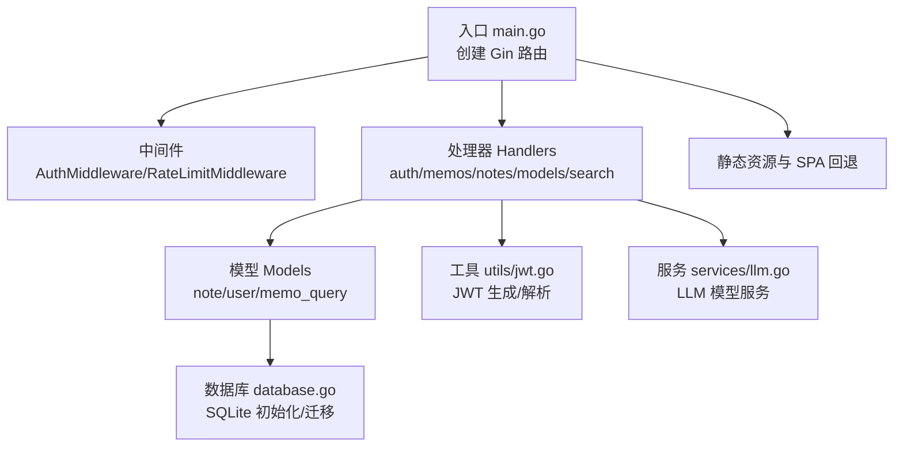
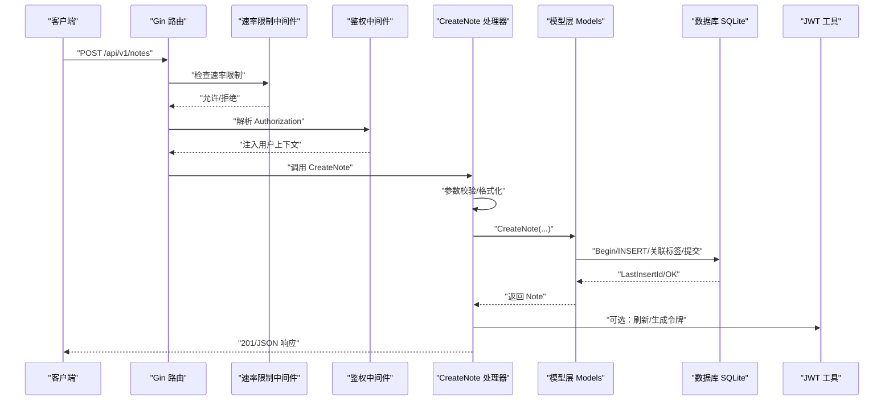
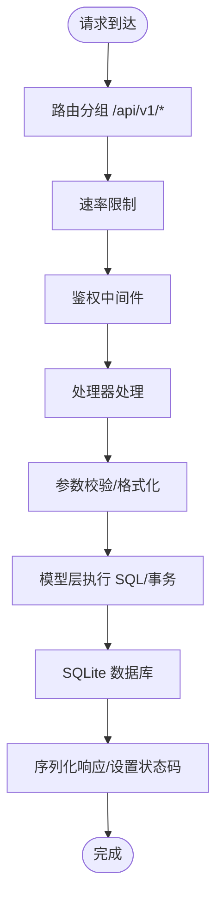
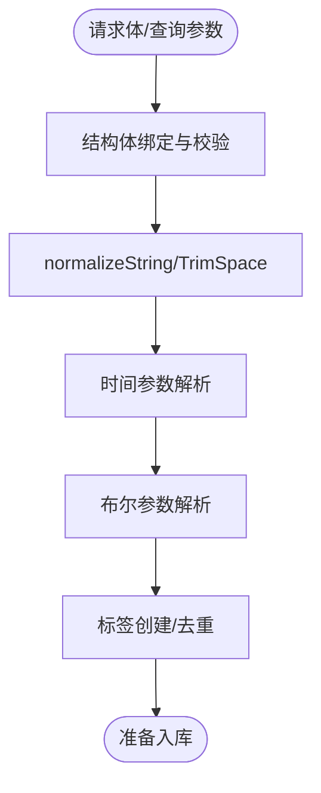
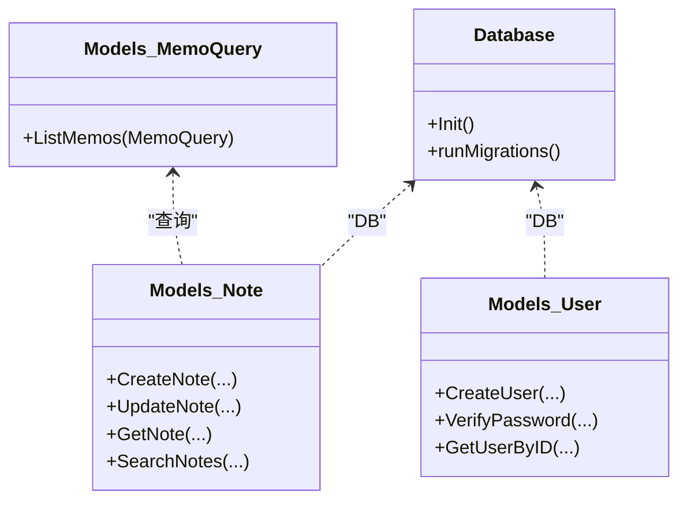
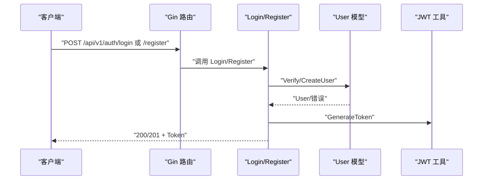
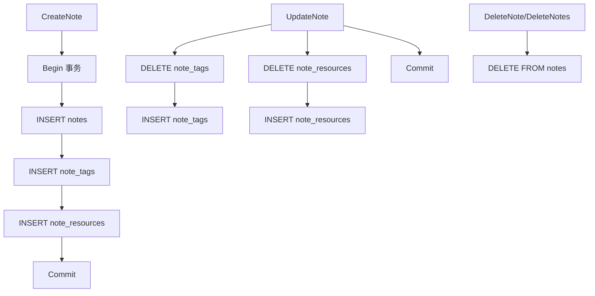
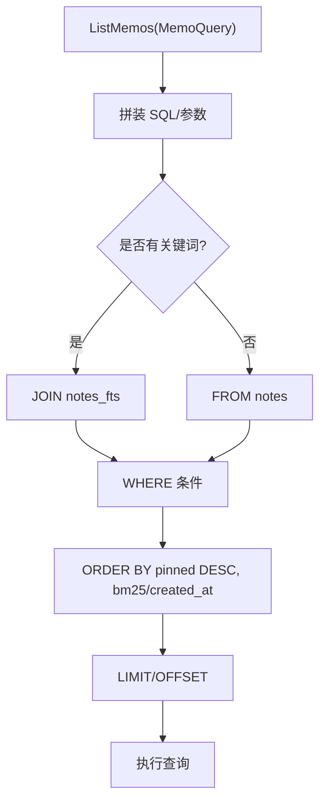
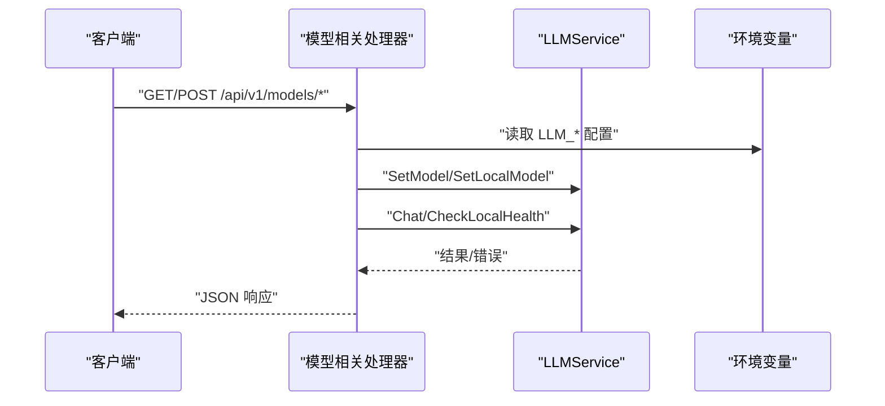
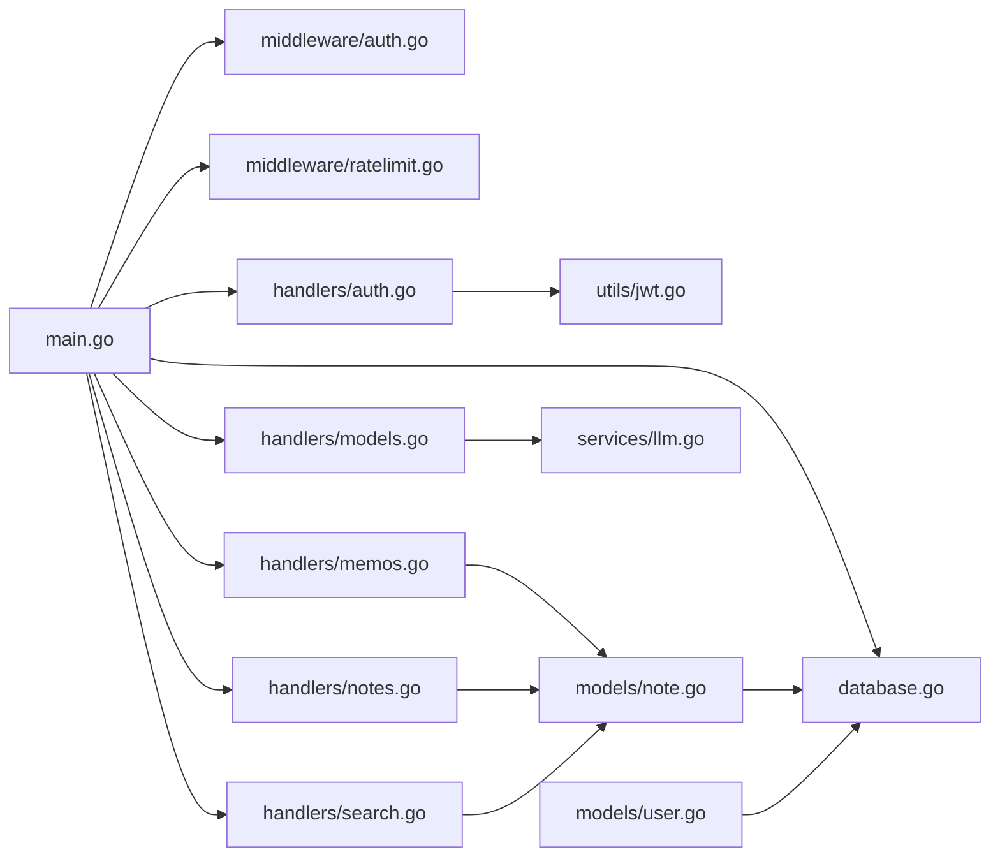

# 数据流设计

<cite>
**本文引用的文件**
- [main.go](file://backend/main.go)
- [database.go](file://backend/database/database.go)
- [auth.go](file://backend/handlers/auth.go)
- [memos.go](file://backend/handlers/memos.go)
- [notes.go](file://backend/handlers/notes.go)
- [models.go](file://backend/handlers/models.go)
- [search.go](file://backend/handlers/search.go)
- [auth.go](file://backend/middleware/auth.go)
- [ratelimit.go](file://backend/middleware/ratelimit.go)
- [jwt.go](file://backend/utils/jwt.go)
- [llm.go](file://backend/services/llm.go)
- [note.go](file://backend/models/note.go)
- [user.go](file://backend/models/user.go)
- [memo_query.go](file://backend/models/memo_query.go)
</cite>

## 目录
1. [简介](#简介)
2. [项目结构](#项目结构)
3. [核心组件](#核心组件)
4. [架构总览](#架构总览)
5. [详细组件分析](#详细组件分析)
6. [依赖关系分析](#依赖关系分析)
7. [性能考量](#性能考量)
8. [故障排查指南](#故障排查指南)
9. [结论](#结论)

## 简介
本文件面向 Memo Studio 后端，系统性梳理从“用户请求到数据持久化”的完整数据流路径，覆盖请求接收、路由分发、中间件处理、业务逻辑执行、数据库操作、响应生成、缓存与性能优化、并发处理机制等。文档旨在帮助开发者快速理解系统数据处理机制与关键路径。

## 项目结构
后端采用 Go + Gin 框架，模块化组织如下：
- 入口与路由：backend/main.go
- 中间件：鉴权、速率限制
- 处理器（Handlers）：各 API 的业务入口
- 模型（Models）：数据访问层与查询封装
- 数据库：SQLite 初始化、迁移与连接
- 工具与服务：JWT、LLM 服务
- 静态资源与 SPA 回退：嵌入式前端静态文件

图示来源
- [main.go](file://backend/main.go#L28-L353)
- [auth.go](file://backend/middleware/auth.go#L12-L71)
- [ratelimit.go](file://backend/middleware/ratelimit.go#L96-L143)
- [auth.go](file://backend/handlers/auth.go#L27-L111)
- [memos.go](file://backend/handlers/memos.go#L78-L280)
- [notes.go](file://backend/handlers/notes.go#L131-L513)
- [models.go](file://backend/handlers/models.go#L164-L371)
- [search.go](file://backend/handlers/search.go#L13-L45)
- [note.go](file://backend/models/note.go#L46-L175)
- [user.go](file://backend/models/user.go#L22-L110)
- [memo_query.go](file://backend/models/memo_query.go#L24-L152)
- [database.go](file://backend/database/database.go#L20-L60)
- [jwt.go](file://backend/utils/jwt.go#L29-L76)
- [llm.go](file://backend/services/llm.go#L289-L336)

章节来源
- [main.go](file://backend/main.go#L28-L353)

## 核心组件
- 路由与中间件：统一安全头、CORS、健康检查、静态资源、SPA 回退、速率限制、鉴权
- 处理器：认证、笔记/备忘录 CRUD、标签/笔记本管理、全文搜索、模型管理、导入导出、位置与股票等扩展功能
- 模型层：封装 SQL 查询、事务、全文检索、标签/资源关联、位置信息
- 数据库：SQLite 初始化、WAL 模式、外键约束、版本迁移、FTS5 触发器
- 工具与服务：JWT 令牌生成与解析、LLM 模型配置与调用

章节来源
- [main.go](file://backend/main.go#L94-L283)
- [auth.go](file://backend/handlers/auth.go#L27-L111)
- [memos.go](file://backend/handlers/memos.go#L78-L280)
- [notes.go](file://backend/handlers/notes.go#L131-L513)
- [models.go](file://backend/handlers/models.go#L164-L371)
- [note.go](file://backend/models/note.go#L46-L175)
- [database.go](file://backend/database/database.go#L20-L60)
- [jwt.go](file://backend/utils/jwt.go#L29-L76)
- [llm.go](file://backend/services/llm.go#L289-L336)

## 架构总览
下面以序列图展示一次典型“创建笔记”的端到端数据流。

图示来源
- [main.go](file://backend/main.go#L94-L196)
- [ratelimit.go](file://backend/middleware/ratelimit.go#L96-L143)
- [auth.go](file://backend/middleware/auth.go#L12-L71)
- [notes.go](file://backend/handlers/notes.go#L175-L230)
- [note.go](file://backend/models/note.go#L46-L105)
- [jwt.go](file://backend/utils/jwt.go#L29-L76)

## 详细组件分析

### 请求处理流程（从 HTTP 到数据库）
- HTTP 请求进入 Gin 路由组，按路径分发到对应处理器
- 速率限制中间件按客户端 IP 维度进行限流，防止滥用
- 鉴权中间件解析 Authorization 头，校验 JWT，注入用户上下文
- 处理器读取请求体/查询参数，进行参数校验与格式化
- 模型层执行 SQL 查询或事务，涉及多表关联与全文检索
- 数据库层使用 SQLite，开启 WAL、外键与 busy_timeout，保证一致性与并发友好
- 响应阶段：序列化为 JSON，设置状态码与必要的头部

图示来源
- [main.go](file://backend/main.go#L94-L196)
- [ratelimit.go](file://backend/middleware/ratelimit.go#L96-L143)
- [auth.go](file://backend/middleware/auth.go#L12-L71)
- [notes.go](file://backend/handlers/notes.go#L175-L230)
- [note.go](file://backend/models/note.go#L46-L105)
- [database.go](file://backend/database/database.go#L35-L60)

章节来源
- [main.go](file://backend/main.go#L94-L196)
- [ratelimit.go](file://backend/middleware/ratelimit.go#L96-L143)
- [auth.go](file://backend/middleware/auth.go#L12-L71)
- [notes.go](file://backend/handlers/notes.go#L175-L230)
- [note.go](file://backend/models/note.go#L46-L105)

### 数据验证与转换
- 处理器层使用结构体绑定与校验（如用户名/密码长度、标签数量、资源 ID 数量等）
- 时间参数支持多种格式解析，布尔参数支持多形态解析
- 文本内容标准化：将 interface{} 转为字符串，清理特定占位符
- 标签创建：去重、颜色生成、按用户隔离唯一性

图示来源
- [notes.go](file://backend/handlers/notes.go#L31-L83)
- [notes.go](file://backend/handlers/notes.go#L175-L230)
- [memos.go](file://backend/handlers/memos.go#L146-L188)
- [memo_query.go](file://backend/models/memo_query.go#L154-L217)

章节来源
- [notes.go](file://backend/handlers/notes.go#L31-L83)
- [notes.go](file://backend/handlers/notes.go#L175-L230)
- [memos.go](file://backend/handlers/memos.go#L146-L188)
- [memo_query.go](file://backend/models/memo_query.go#L154-L217)

### 数据库交互模式
- 连接与初始化：SQLite 文件路径可配置，WAL 模式、外键、busy_timeout
- 迁移：版本化迁移，DDL 在同一连接执行，避免 schema 可见性问题
- 事务：创建/更新笔记使用事务，确保标签与资源关联的一致性
- 查询：全文检索使用 FTS5 虚表与触发器，支持 bm25 排序；多条件组合查询，DISTINCT 避免重复
- 约束：用户隔离、标签 per-user 唯一、外键级联

图示来源
- [database.go](file://backend/database/database.go#L20-L60)
- [database.go](file://backend/database/database.go#L62-L178)
- [note.go](file://backend/models/note.go#L46-L175)
- [user.go](file://backend/models/user.go#L22-L110)
- [memo_query.go](file://backend/models/memo_query.go#L24-L152)

章节来源
- [database.go](file://backend/database/database.go#L20-L60)
- [database.go](file://backend/database/database.go#L62-L178)
- [note.go](file://backend/models/note.go#L46-L175)
- [user.go](file://backend/models/user.go#L22-L110)
- [memo_query.go](file://backend/models/memo_query.go#L24-L152)

### 响应生成与头部配置
- 统一设置安全响应头（X-Content-Type-Options、X-Frame-Options、X-XSS-Protection、X-Robots-Tag）
- CORS 配置可按环境变量动态设置 AllowOrigins
- 速率限制中间件返回 Retry-After 与 X-RateLimit-* 头
- 成功响应使用 200/201，错误响应返回 JSON 与相应状态码

章节来源
- [main.go](file://backend/main.go#L46-L81)
- [ratelimit.go](file://backend/middleware/ratelimit.go#L104-L121)

### 缓存策略与并发处理
- 缓存：当前实现未显式引入应用层缓存，主要依赖 SQLite 的 WAL 模式与合理的查询索引
- 并发：Gin 默认并发处理请求；速率限制器基于内存 map，按 IP 维度限流
- 数据一致性：事务包裹关键写操作，避免竞态；FTS5 触发器保证全文索引一致性

章节来源
- [main.go](file://backend/main.go#L94-L196)
- [ratelimit.go](file://backend/middleware/ratelimit.go#L11-L143)
- [database.go](file://backend/database/database.go#L45-L52)

### 关键路径分析

#### 登录与注册
- 登录：校验用户名/密码，生成 JWT
- 注册：校验长度，加密存储，生成 JWT

图示来源
- [auth.go](file://backend/handlers/auth.go#L27-L111)
- [user.go](file://backend/models/user.go#L78-L110)
- [jwt.go](file://backend/utils/jwt.go#L29-L76)

章节来源
- [auth.go](file://backend/handlers/auth.go#L27-L111)
- [user.go](file://backend/models/user.go#L78-L110)
- [jwt.go](file://backend/utils/jwt.go#L29-L76)

#### 创建/更新/删除笔记
- 创建：事务内插入笔记、标签与资源关联
- 更新：删除旧关联、插入新关联
- 删除：单条/批量删除

图示来源
- [note.go](file://backend/models/note.go#L46-L175)

章节来源
- [note.go](file://backend/models/note.go#L46-L175)

#### 全文搜索与标签过滤
- 支持 FTS5 全文检索，bm25 排序，支持标签、时间范围、置顶排序
- 标签过滤使用 IN 子句，注意 DISTINCT 避免重复

图示来源
- [memo_query.go](file://backend/models/memo_query.go#L24-L152)
- [note.go](file://backend/models/note.go#L329-L392)

章节来源
- [memo_query.go](file://backend/models/memo_query.go#L24-L152)
- [note.go](file://backend/models/note.go#L329-L392)

#### 模型管理与 LLM 交互
- 模型列表：云端/本地模型配置，按 API Key 可用性动态显示
- 模型切换：设置环境变量，重启生效
- LLM 服务：统一请求构建、头部设置、响应解析、健康检查

图示来源
- [models.go](file://backend/handlers/models.go#L164-L371)
- [llm.go](file://backend/services/llm.go#L289-L336)
- [llm.go](file://backend/services/llm.go#L418-L531)

章节来源
- [models.go](file://backend/handlers/models.go#L164-L371)
- [llm.go](file://backend/services/llm.go#L289-L336)
- [llm.go](file://backend/services/llm.go#L418-L531)

## 依赖关系分析
- 入口 main.go 依赖数据库初始化、中间件、处理器
- 处理器依赖模型层与工具/服务
- 模型层依赖数据库连接
- 中间件依赖工具（JWT）

图示来源
- [main.go](file://backend/main.go#L28-L353)
- [auth.go](file://backend/handlers/auth.go#L27-L111)
- [memos.go](file://backend/handlers/memos.go#L78-L280)
- [notes.go](file://backend/handlers/notes.go#L131-L513)
- [search.go](file://backend/handlers/search.go#L13-L45)
- [models.go](file://backend/handlers/models.go#L164-L371)
- [note.go](file://backend/models/note.go#L46-L175)
- [user.go](file://backend/models/user.go#L22-L110)
- [jwt.go](file://backend/utils/jwt.go#L29-L76)
- [llm.go](file://backend/services/llm.go#L289-L336)
- [database.go](file://backend/database/database.go#L20-L60)

章节来源
- [main.go](file://backend/main.go#L28-L353)

## 性能考量
- 数据库
  - WAL 模式提升并发读写性能
  - 外键与 busy_timeout 保障一致性与稳定性
  - FTS5 触发器维护全文索引，查询按 bm25 排序
- 查询
  - 限制分页大小（默认 50，最大 200）
  - 标签过滤使用 IN 子句，注意 DISTINCT
- 应用层
  - 速率限制防止突发流量
  - Gin Release 模式减少日志开销
- 建议
  - 大量标签/资源场景可考虑预聚合或二级索引
  - 批量删除使用占位符，避免 SQL 注入风险

[本节为通用指导，不直接分析具体文件]

## 故障排查指南
- 认证失败
  - 检查 Authorization 头格式（Bearer Token）
  - 校验 MEMO_JWT_SECRET 环境变量
- 数据库初始化失败
  - 检查 MEMO_DB_PATH 权限与路径
  - 确认 SQLite 文件可写
- 速率限制
  - 查看 X-RateLimit-* 头，确认限流阈值
- 模型不可用
  - 检查 LLM_* 环境变量与网络连通性
  - 使用健康检查端点验证本地服务

章节来源
- [auth.go](file://backend/middleware/auth.go#L12-L71)
- [jwt.go](file://backend/utils/jwt.go#L13-L20)
- [database.go](file://backend/database/database.go#L20-L60)
- [ratelimit.go](file://backend/middleware/ratelimit.go#L96-L143)
- [llm.go](file://backend/services/llm.go#L517-L531)

## 结论
Memo Studio 后端以清晰的分层与模块化设计实现了从请求到持久化的稳定数据流。通过 Gin 中间件统一安全与限流，模型层封装复杂查询与事务，数据库层采用 SQLite+WAL+FTS5 提升性能与体验。建议在高并发场景下结合外部缓存与连接池优化，并持续关注查询与索引的演进。