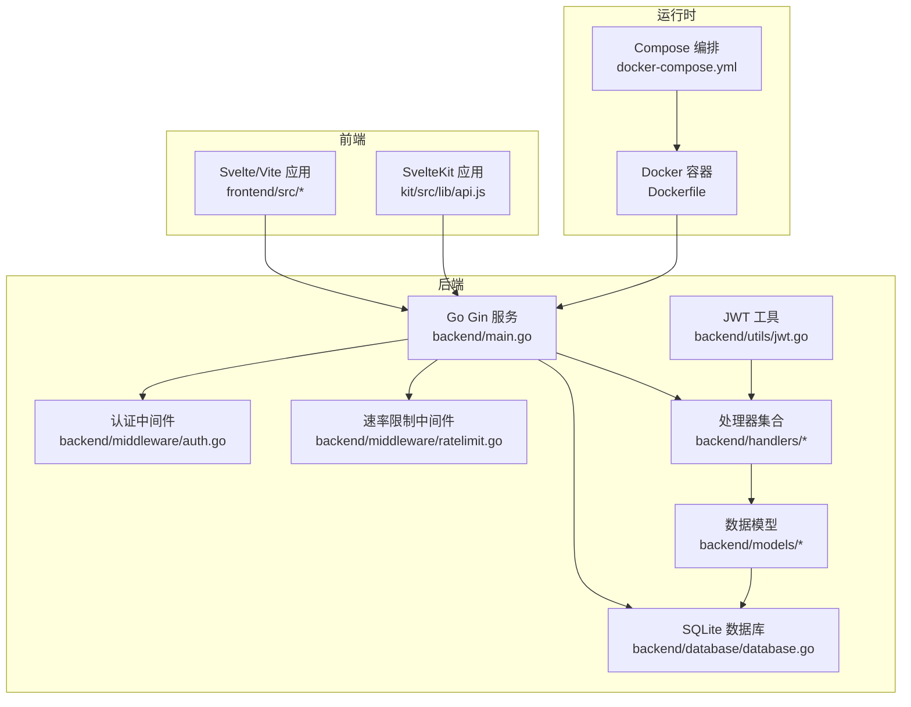
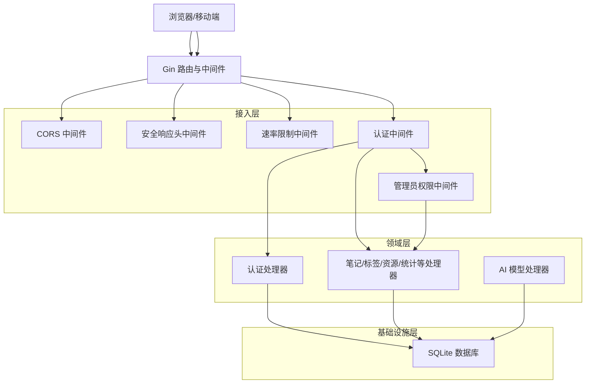
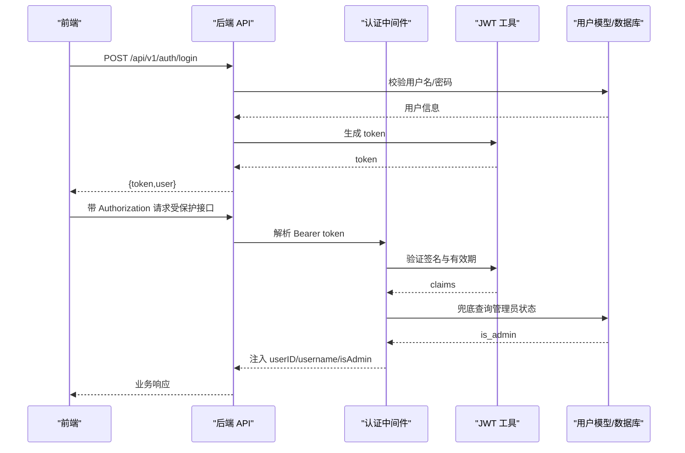
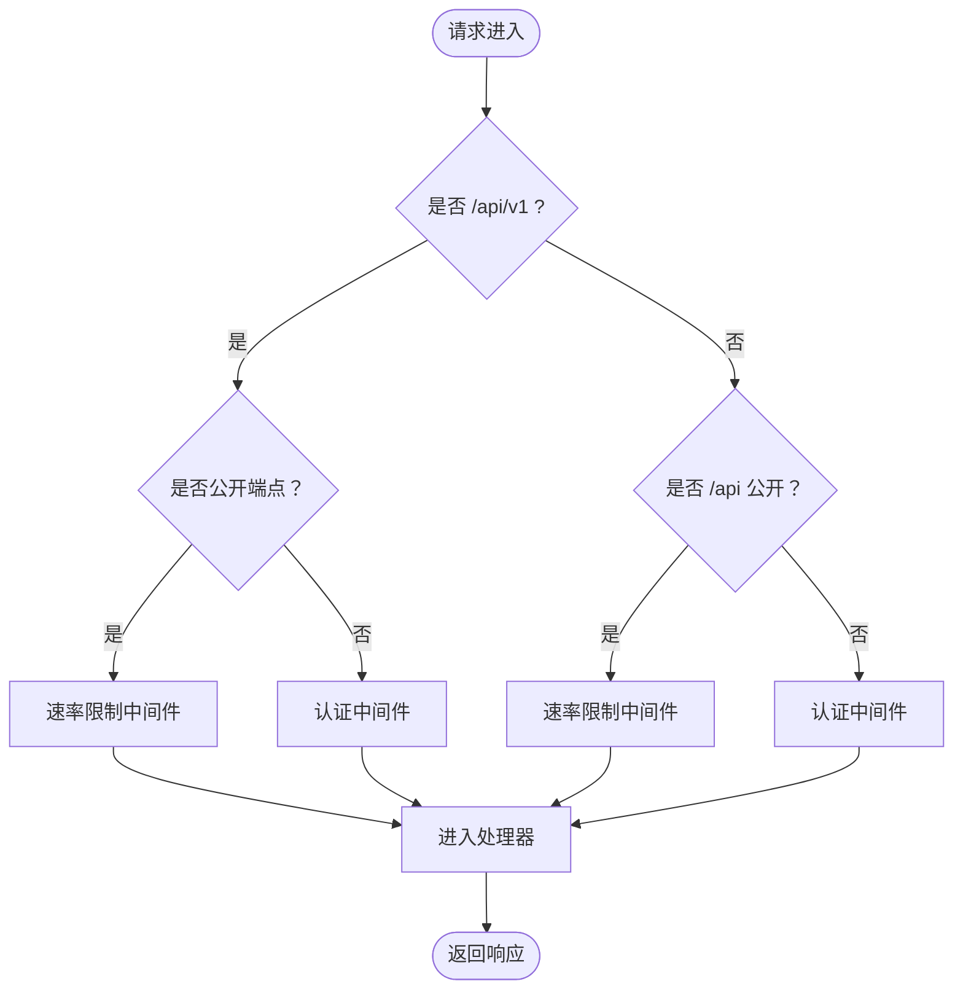
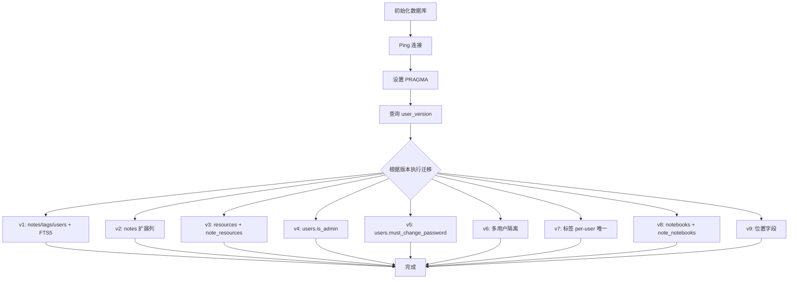
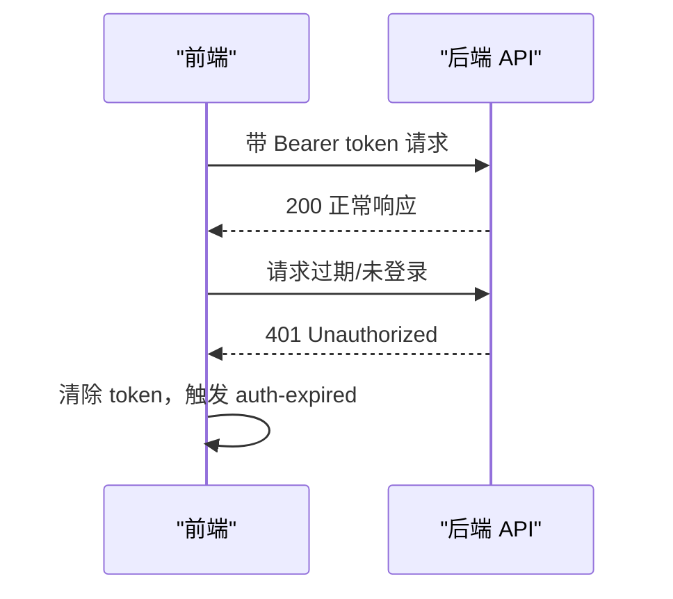
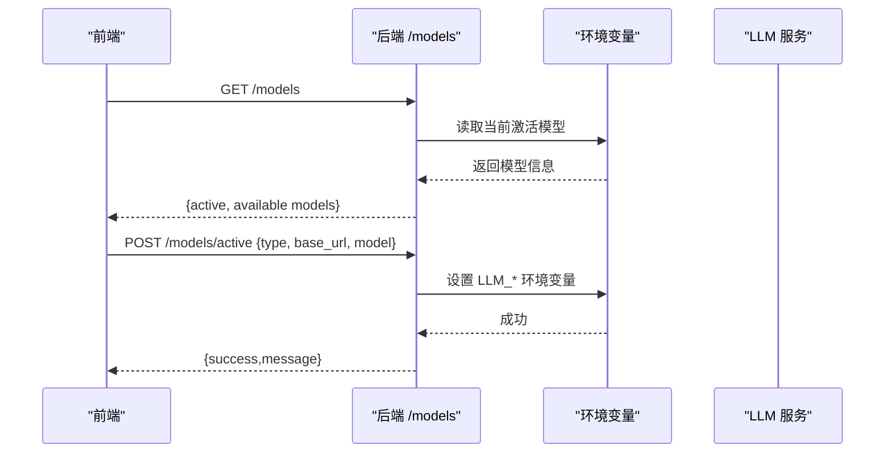
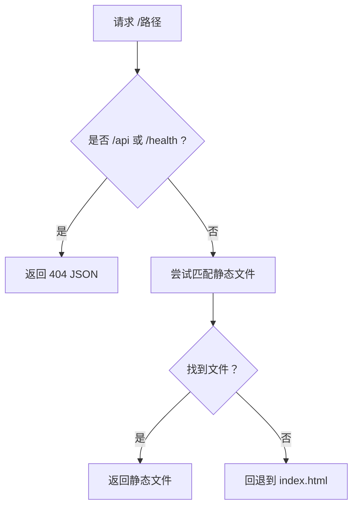
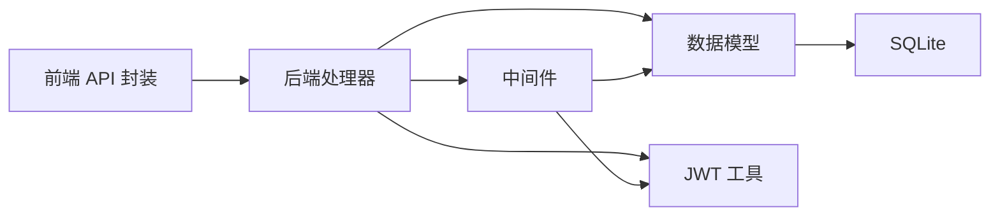

# 整体架构

<cite>
**本文引用的文件**
- [backend/main.go](file://backend/main.go)
- [backend/database/database.go](file://backend/database/database.go)
- [backend/middleware/auth.go](file://backend/middleware/auth.go)
- [backend/middleware/ratelimit.go](file://backend/middleware/ratelimit.go)
- [backend/handlers/auth.go](file://backend/handlers/auth.go)
- [backend/utils/jwt.go](file://backend/utils/jwt.go)
- [backend/models/user.go](file://backend/models/user.go)
- [backend/handlers/models.go](file://backend/handlers/models.go)
- [frontend/src/main.js](file://frontend/src/main.js)
- [frontend/src/utils/api.js](file://frontend/src/utils/api.js)
- [kit/src/lib/api.js](file://kit/src/lib/api.js)
- [server/app.js](file://server/app.js)
- [Dockerfile](file://Dockerfile)
- [docker-compose.yml](file://docker-compose.yml)
- [README.md](file://README.md)
</cite>

## 目录
1. [简介](#简介)
2. [项目结构](#项目结构)
3. [核心组件](#核心组件)
4. [架构总览](#架构总览)
5. [详细组件分析](#详细组件分析)
6. [依赖分析](#依赖分析)
7. [性能考量](#性能考量)
8. [故障排查指南](#故障排查指南)
9. [结论](#结论)
10. [附录](#附录)

## 简介
Memo Studio 是一个前后端分离的笔记应用，采用 Go + Gin + SQLite 的后端，Svelte/Vite 与 SvelteKit 的前端实现。系统通过嵌入式静态文件服务提供 SPA，结合 JWT 认证、速率限制、CORS 安全策略与 Docker 化部署，形成轻量、可扩展、易运维的整体架构。

## 项目结构
- 后端（Go + Gin + SQLite）
  - 入口与路由：backend/main.go
  - 数据库初始化与迁移：backend/database/database.go
  - 中间件：认证、速率限制
  - 处理器：认证、笔记、标签、资源、统计、导入导出、AI 模型等
  - 工具：JWT 生成与解析
  - 模型：用户、笔记、标签、资源、统计等
- 前端（Svelte/Vite）
  - 应用入口与事件监听：frontend/src/main.js
  - API 封装（v1）：frontend/src/utils/api.js
- 前端（SvelteKit，兼容旧 API）
  - API 封装（/api）：kit/src/lib/api.js
- 旧版 Node/Express 服务（server/app.js）
- 容器化与编排
  - Dockerfile（多阶段构建，嵌入 SvelteKit 静态产物）
  - docker-compose.yml（生产编排）

**图表来源**
- [backend/main.go](file://backend/main.go#L28-L353)
- [backend/database/database.go](file://backend/database/database.go#L20-L60)
- [backend/middleware/auth.go](file://backend/middleware/auth.go#L12-L52)
- [backend/middleware/ratelimit.go](file://backend/middleware/ratelimit.go#L96-L121)
- [backend/handlers/auth.go](file://backend/handlers/auth.go#L27-L53)
- [backend/utils/jwt.go](file://backend/utils/jwt.go#L29-L49)
- [backend/models/user.go](file://backend/models/user.go#L22-L44)
- [frontend/src/main.js](file://frontend/src/main.js#L1-L20)
- [frontend/src/utils/api.js](file://frontend/src/utils/api.js#L1-L316)
- [kit/src/lib/api.js](file://kit/src/lib/api.js#L1-L271)
- [Dockerfile](file://Dockerfile#L1-L81)
- [docker-compose.yml](file://docker-compose.yml#L1-L25)

**章节来源**
- [README.md](file://README.md#L254-L273)
- [backend/main.go](file://backend/main.go#L28-L353)
- [Dockerfile](file://Dockerfile#L1-L81)
- [docker-compose.yml](file://docker-compose.yml#L1-L25)

## 核心组件
- Go 后端服务（Gin）
  - 路由分组：/api/v1（新版）、/api（兼容旧版）
  - 中间件：CORS、安全响应头、速率限制、认证、管理员权限
  - 静态文件托管：嵌入式 SvelteKit 前端产物，SPA 回退至 index.html
  - 健康检查：/health
  - 附件静态服务：/uploads -> 本地存储目录
- SQLite 数据库
  - 初始化与迁移：按版本逐步创建表、索引与约束
  - 支持 FTS5（全文检索）虚拟表与触发器维护
- Svelte 前端（Vite）
  - 应用入口监听认证过期事件
  - API 封装：统一鉴权头、错误处理、拦截器
- SvelteKit 前端（兼容旧 API）
  - 通过 /api 前缀对接旧版后端接口
- 旧版 Node/Express 服务
  - 仅用于兼容，建议迁移至 /api/v1
- 容器化与编排
  - 多阶段构建：先构建 SvelteKit 静态产物，再构建 Go 二进制
  - 运行时非 root 用户、健康检查、持久化卷

**章节来源**
- [backend/main.go](file://backend/main.go#L94-L196)
- [backend/database/database.go](file://backend/database/database.go#L62-L178)
- [frontend/src/main.js](file://frontend/src/main.js#L8-L17)
- [frontend/src/utils/api.js](file://frontend/src/utils/api.js#L1-L316)
- [kit/src/lib/api.js](file://kit/src/lib/api.js#L1-L271)
- [server/app.js](file://server/app.js#L1-L26)
- [Dockerfile](file://Dockerfile#L1-L81)
- [docker-compose.yml](file://docker-compose.yml#L1-L25)

## 架构总览
系统采用前后端分离与微服务思想的轻量实现：
- API 网关角色：Go Gin 路由承担网关职责，统一接入、鉴权、限流、静态资源与健康检查
- 微服务思想：将认证、笔记、标签、资源、统计、AI 模型等业务拆分为独立处理器，便于演进与扩展
- 分层架构：表现层（前端）、接入层（Gin 路由/中间件）、领域层（处理器）、基础设施层（SQLite）

**图表来源**
- [backend/main.go](file://backend/main.go#L46-L80)
- [backend/middleware/auth.go](file://backend/middleware/auth.go#L12-L71)
- [backend/middleware/ratelimit.go](file://backend/middleware/ratelimit.go#L96-L121)
- [backend/handlers/auth.go](file://backend/handlers/auth.go#L27-L53)
- [backend/database/database.go](file://backend/database/database.go#L20-L60)

## 详细组件分析

### 认证与授权流程
- 前端登录/注册后获得 JWT，后续请求携带 Authorization: Bearer <token>
- 后端中间件解析 JWT，注入用户上下文；管理员接口进一步校验 is_admin
- 用户模型包含 must_change_password 字段，用于强制修改初始密码

**图表来源**
- [frontend/src/utils/api.js](file://frontend/src/utils/api.js#L117-L143)
- [backend/handlers/auth.go](file://backend/handlers/auth.go#L27-L53)
- [backend/middleware/auth.go](file://backend/middleware/auth.go#L12-L52)
- [backend/utils/jwt.go](file://backend/utils/jwt.go#L29-L66)
- [backend/models/user.go](file://backend/models/user.go#L78-L110)

**章节来源**
- [backend/handlers/auth.go](file://backend/handlers/auth.go#L27-L53)
- [backend/middleware/auth.go](file://backend/middleware/auth.go#L12-L71)
- [backend/utils/jwt.go](file://backend/utils/jwt.go#L29-L66)
- [backend/models/user.go](file://backend/models/user.go#L78-L110)
- [frontend/src/utils/api.js](file://frontend/src/utils/api.js#L117-L152)

### API 路由与中间件机制
- 路由分组
  - /api/v1：新版 API，公开登录/注册（带速率限制），其余接口需认证
  - /api：兼容旧版 API，行为与 /api/v1 类似
- 中间件链
  - CORS、安全响应头、速率限制（公开路由）、认证（受保护路由）、管理员权限（管理端）

**图表来源**
- [backend/main.go](file://backend/main.go#L94-L196)
- [backend/middleware/ratelimit.go](file://backend/middleware/ratelimit.go#L96-L121)
- [backend/middleware/auth.go](file://backend/middleware/auth.go#L12-L71)

**章节来源**
- [backend/main.go](file://backend/main.go#L94-L196)
- [backend/middleware/ratelimit.go](file://backend/middleware/ratelimit.go#L96-L121)
- [backend/middleware/auth.go](file://backend/middleware/auth.go#L12-L71)

### 数据库与迁移
- 初始化：创建目录、打开连接、设置 PRAGMA、执行迁移
- 迁移版本：v1 基础表与 FTS5；v2 扩展列；v3 资源表；v4/v5 用户管理增强；v6 多租户隔离；v7 标签唯一性变更；v8 笔记本；v9 位置字段
- FTS5：虚拟表 + 触发器维护，确保全文检索一致性

**图表来源**
- [backend/database/database.go](file://backend/database/database.go#L20-L60)
- [backend/database/database.go](file://backend/database/database.go#L62-L178)

**章节来源**
- [backend/database/database.go](file://backend/database/database.go#L20-L60)
- [backend/database/database.go](file://backend/database/database.go#L62-L178)

### 前端与后端交互
- Svelte/Vite 前端
  - 统一 API 基址 /api/v1
  - 自动附加 Authorization 头，拦截 401 并触发认证过期事件
- SvelteKit 前端
  - 统一 API 基址 /api，兼容旧版接口
- 错误处理
  - 401：清除本地 token，触发重新登录
  - 404：资源不存在
  - 429：请求过于频繁
  - 其他：解析后端错误消息

**图表来源**
- [frontend/src/utils/api.js](file://frontend/src/utils/api.js#L52-L76)
- [frontend/src/utils/api.js](file://frontend/src/utils/api.js#L33-L50)
- [frontend/src/main.js](file://frontend/src/main.js#L8-L17)

**章节来源**
- [frontend/src/utils/api.js](file://frontend/src/utils/api.js#L1-L316)
- [frontend/src/main.js](file://frontend/src/main.js#L1-L20)
- [kit/src/lib/api.js](file://kit/src/lib/api.js#L1-L271)

### AI 模型管理与大模型集成
- 模型配置
  - 通过 /api/v1/models 系列接口获取、切换、添加本地模型
  - 支持云模型（OpenAI/Claude 等）与本地模型（Ollama/LMStudio 等）
- 运行时环境变量
  - LLM_MODEL_TYPE、LLM_BASE_URL、LLM_MODEL、LLM_API_KEY 等
- 健康检查与可用性判断

**图表来源**
- [backend/handlers/models.go](file://backend/handlers/models.go#L164-L204)
- [backend/handlers/models.go](file://backend/handlers/models.go#L60-L104)

**章节来源**
- [backend/handlers/models.go](file://backend/handlers/models.go#L164-L204)
- [backend/handlers/models.go](file://backend/handlers/models.go#L60-L104)

### 静态文件服务与 SPA 回退
- Go 在运行时内嵌 SvelteKit 构建产物，通过 http.FileServer 提供静态文件
- SPA 回退：非 /api 且非 /health 的路径回退到 index.html，交由前端路由处理

**图表来源**
- [backend/main.go](file://backend/main.go#L285-L316)

**章节来源**
- [backend/main.go](file://backend/main.go#L285-L316)

## 依赖分析
- 组件耦合
  - Handlers 依赖 Models 与 Services（如 LLM），Models 依赖 database.DB
  - Middleware 依赖 utils（JWT）与 models（用户兜底）
  - 前端通过统一 API 封装与后端解耦
- 外部依赖
  - Gin、SQLite、bcrypt、JWT、CORS
- 潜在循环依赖
  - 未发现直接循环；中间件与工具通过函数调用解耦

**图表来源**
- [backend/handlers/auth.go](file://backend/handlers/auth.go#L27-L53)
- [backend/models/user.go](file://backend/models/user.go#L22-L44)
- [backend/utils/jwt.go](file://backend/utils/jwt.go#L29-L49)
- [backend/middleware/auth.go](file://backend/middleware/auth.go#L12-L52)

**章节来源**
- [backend/handlers/auth.go](file://backend/handlers/auth.go#L27-L53)
- [backend/models/user.go](file://backend/models/user.go#L22-L44)
- [backend/utils/jwt.go](file://backend/utils/jwt.go#L29-L49)
- [backend/middleware/auth.go](file://backend/middleware/auth.go#L12-L52)

## 性能考量
- 数据库
  - WAL 模式、外键开启、超时设置提升并发与一致性
  - FTS5 虚拟表 + 触发器维护，适合全文检索场景
- 速率限制
  - 全局每分钟 50 次，严格模式 30 次，防止滥用
- 前端
  - Vite HMR 提升开发体验；生产构建产物由 Go 直接托管，减少 Nginx 层级
- 容器化
  - 多阶段构建减少镜像体积；非 root 用户运行；健康检查保障可用性

**章节来源**
- [backend/database/database.go](file://backend/database/database.go#L45-L52)
- [backend/middleware/ratelimit.go](file://backend/middleware/ratelimit.go#L88-L94)
- [Dockerfile](file://Dockerfile#L47-L81)

## 故障排查指南
- 端口占用
  - 启动脚本会尝试清理；若失败，使用 lsof/kil l命令释放
- 依赖安装失败
  - Go：go mod download/tidy
  - npm：清理 node_modules 后重新安装
- 数据库问题
  - 删除 notes.db 后重启自动重建
- 热更新不工作
  - 前端：检查浏览器控制台与 Vite 日志
  - 后端：确认 Air 安装与 .air.toml 配置

**章节来源**
- [README.md](file://README.md#L446-L498)

## 结论
Memo Studio 通过 Go + Gin + SQLite 的轻量组合，结合 Svelte/Vite 与 SvelteKit 前端，实现了清晰的前后端分离与微服务化拆分。借助中间件体系（CORS、安全头、速率限制、认证、管理员权限）、JWT 认证、SQLite 迁移与 FTS5、容器化与健康检查，系统具备良好的可维护性、可扩展性与可运维性。建议在生产环境中严格配置 JWT 密钥、CORS 白名单与速率限制策略，并持续演进处理器与模型管理能力。

## 附录
- 环境变量与部署要点
  - MEMO_JWT_SECRET（生产必填）
  - MEMO_ADMIN_PASSWORD（初始化管理员）
  - MEMO_CORS_ORIGINS（生产建议配置）
  - MEMO_DB_PATH、MEMO_STORAGE_DIR（容器建议指向 /data）
- API 基址
  - 新版：/api/v1
  - 兼容：/api

**章节来源**
- [README.md](file://README.md#L61-L128)
- [frontend/src/utils/api.js](file://frontend/src/utils/api.js#L2-L4)
- [kit/src/lib/api.js](file://kit/src/lib/api.js#L1-L2)