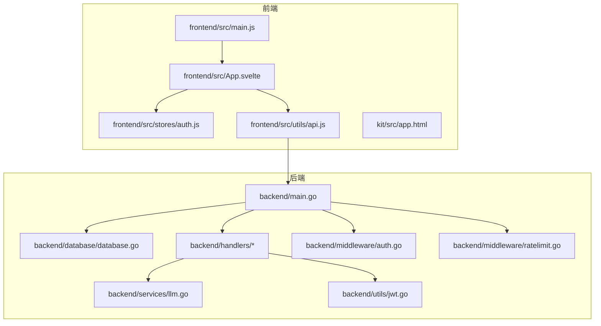
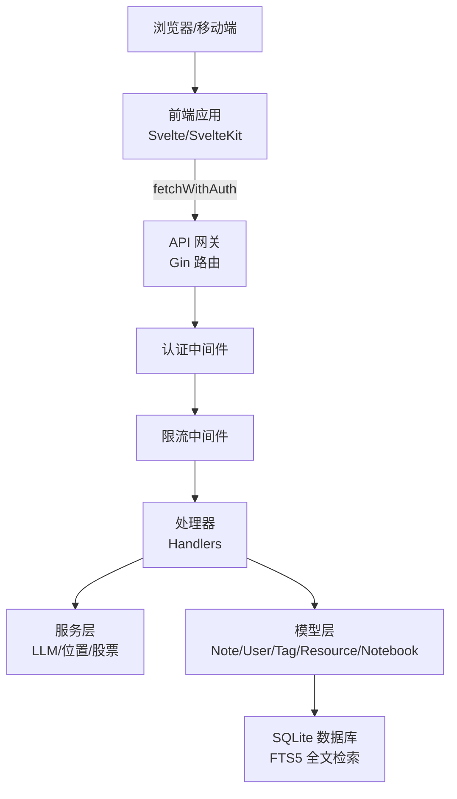
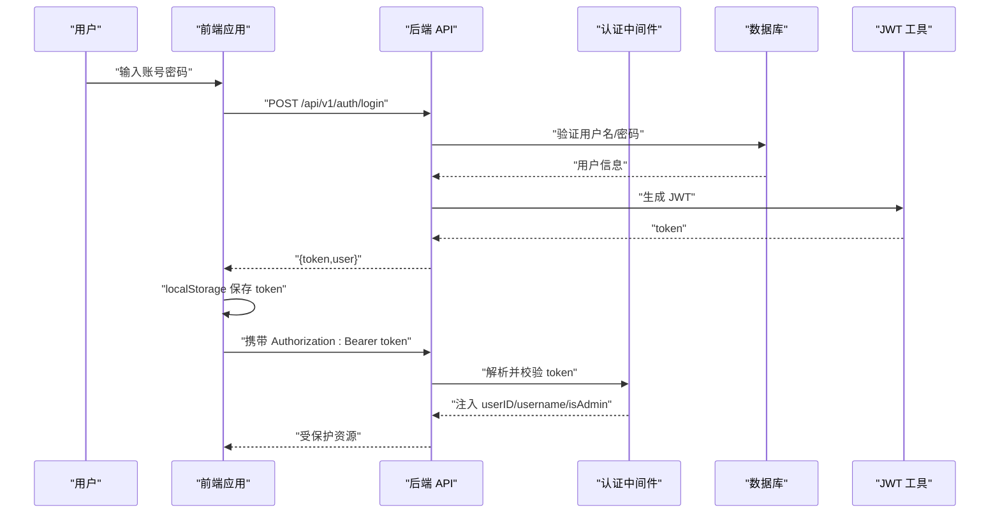
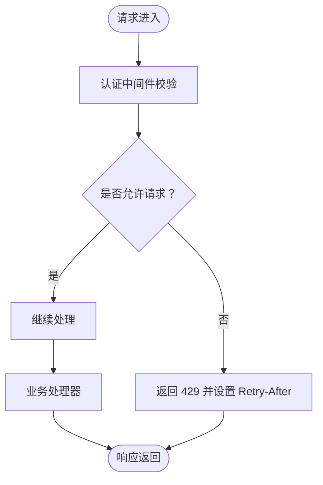
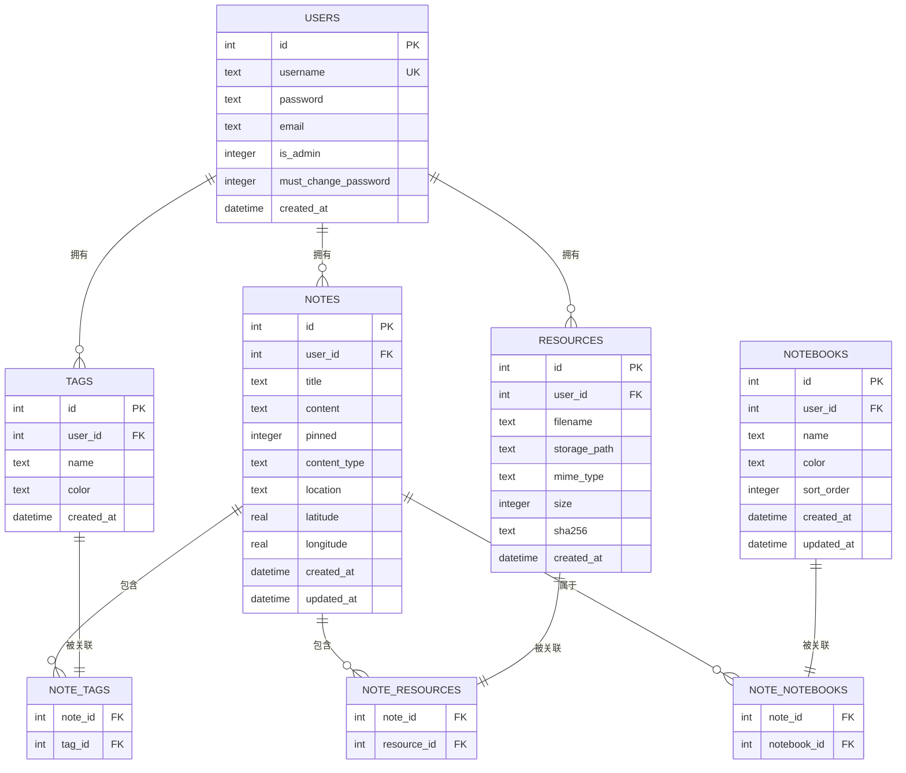
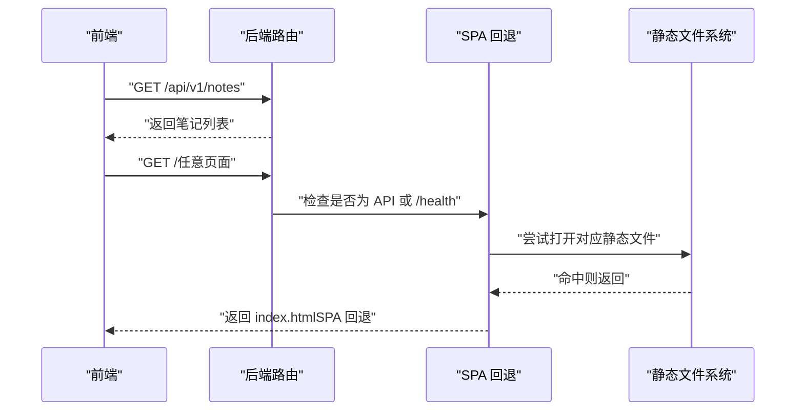
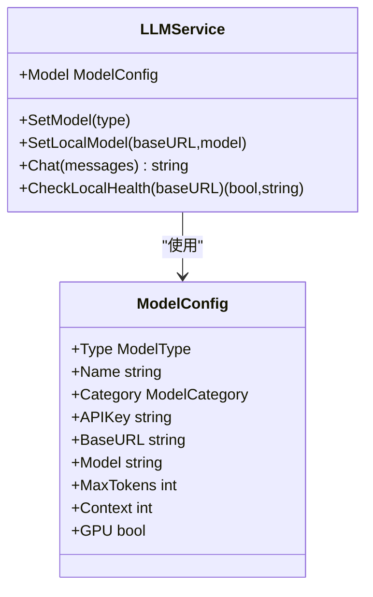
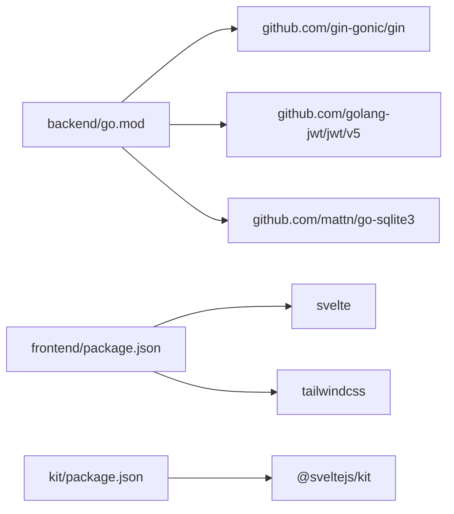

# 架构设计

<cite>
**本文引用的文件**
- [backend/main.go](file://backend/main.go)
- [backend/go.mod](file://backend/go.mod)
- [backend/database/database.go](file://backend/database/database.go)
- [backend/handlers/auth.go](file://backend/handlers/auth.go)
- [backend/handlers/models.go](file://backend/handlers/models.go)
- [backend/middleware/auth.go](file://backend/middleware/auth.go)
- [backend/middleware/ratelimit.go](file://backend/middleware/ratelimit.go)
- [backend/models/note.go](file://backend/models/note.go)
- [backend/models/user.go](file://backend/models/user.go)
- [backend/services/llm.go](file://backend/services/llm.go)
- [backend/utils/jwt.go](file://backend/utils/jwt.go)
- [frontend/src/main.js](file://frontend/src/main.js)
- [frontend/src/App.svelte](file://frontend/src/App.svelte)
- [frontend/src/stores/auth.js](file://frontend/src/stores/auth.js)
- [frontend/src/utils/api.js](file://frontend/src/utils/api.js)
- [kit/src/app.html](file://kit/src/app.html)
- [frontend/package.json](file://frontend/package.json)
- [kit/package.json](file://kit/package.json)
</cite>

## 目录
1. [简介](#简介)
2. [项目结构](#项目结构)
3. [核心组件](#核心组件)
4. [架构总览](#架构总览)
5. [详细组件分析](#详细组件分析)
6. [依赖分析](#依赖分析)
7. [性能考量](#性能考量)
8. [故障排查指南](#故障排查指南)
9. [结论](#结论)
10. [附录](#附录)

## 简介
Memo Studio 是一款前后端分离的极简笔记应用，采用 Go 语言构建后端服务，基于 Gin 框架提供 REST API；前端采用 Svelte/SvelteKit 构建，支持 Web 与移动端体验。系统以 SQLite 作为默认数据存储，结合 Gin 中间件实现认证授权与限流，后端通过模型抽象与服务层实现业务逻辑与数据访问的解耦。系统支持多用户隔离、标签与笔记本组织、全文检索、AI 洞察与总结、语音转文本、位置管理与股票分析等能力。

## 项目结构
项目采用前后端分离与模块化分层设计：
- 后端（Go）：入口程序、路由与中间件、处理器（Handlers）、模型（Models）、服务（Services）、工具（Utils）、数据库初始化与迁移（Database）
- 前端（Svelte/SvelteKit）：应用入口、页面组件、状态管理（Stores）、API 封装（Utils）、样式与构建配置
- 集成点：后端提供 /api/v1 REST API，前端通过 fetchWithAuth 注入认证头并统一错误处理；静态资源由后端嵌入并提供 SPA 回退

图示来源
- [backend/main.go](file://backend/main.go#L28-L353)
- [backend/database/database.go](file://backend/database/database.go#L20-L60)
- [backend/handlers/auth.go](file://backend/handlers/auth.go#L27-L53)
- [backend/middleware/auth.go](file://backend/middleware/auth.go#L12-L52)
- [backend/middleware/ratelimit.go](file://backend/middleware/ratelimit.go#L96-L121)
- [backend/services/llm.go](file://backend/services/llm.go#L289-L336)
- [backend/utils/jwt.go](file://backend/utils/jwt.go#L22-L66)
- [frontend/src/main.js](file://frontend/src/main.js#L1-L20)
- [frontend/src/App.svelte](file://frontend/src/App.svelte#L1-L328)
- [frontend/src/stores/auth.js](file://frontend/src/stores/auth.js#L1-L80)
- [frontend/src/utils/api.js](file://frontend/src/utils/api.js#L1-L316)
- [kit/src/app.html](file://kit/src/app.html#L1-L17)

章节来源
- [backend/main.go](file://backend/main.go#L28-L353)
- [frontend/src/main.js](file://frontend/src/main.js#L1-L20)
- [kit/src/app.html](file://kit/src/app.html#L1-L17)

## 核心组件
- 服务器入口与路由
  - Gin 服务器初始化、CORS、安全头、健康检查、静态资源与 SPA 回退、API v1 与旧版兼容路由
- 中间件体系
  - 认证中间件：提取 Authorization Bearer Token，解析 JWT 并注入用户上下文
  - 限流中间件：基于内存的滑动窗口限流，支持速率头与统一错误码
- 数据访问层
  - SQLite 连接、PRAGMA 优化、迁移脚本、FTS5 全文检索触发器、事务封装
- 业务模型与服务
  - 笔记、标签、用户、资源、笔记本等模型与 CRUD
  - LLM 服务：云端/本地模型抽象、健康检查、洞察与总结
- 工具与安全
  - JWT 生成与解析、密码加密（bcrypt）
- 前端应用
  - Svelte 组件化 UI、状态管理（localStorage）、API 封装（fetchWithAuth）、键盘快捷键、主题切换

章节来源
- [backend/main.go](file://backend/main.go#L28-L353)
- [backend/middleware/auth.go](file://backend/middleware/auth.go#L12-L71)
- [backend/middleware/ratelimit.go](file://backend/middleware/ratelimit.go#L11-L143)
- [backend/database/database.go](file://backend/database/database.go#L20-L178)
- [backend/models/note.go](file://backend/models/note.go#L46-L105)
- [backend/models/user.go](file://backend/models/user.go#L22-L110)
- [backend/services/llm.go](file://backend/services/llm.go#L289-L336)
- [backend/utils/jwt.go](file://backend/utils/jwt.go#L22-L76)
- [frontend/src/App.svelte](file://frontend/src/App.svelte#L1-L328)
- [frontend/src/stores/auth.js](file://frontend/src/stores/auth.js#L1-L80)
- [frontend/src/utils/api.js](file://frontend/src/utils/api.js#L1-L316)

## 架构总览
系统采用“网关 + 微服务思想”的单体后端架构：后端以路由组划分功能域（认证、笔记、标签、资源、统计、AI 等），通过中间件实现横切关注点（认证、限流、CORS、安全头）。前端通过统一 API 基础路径与认证拦截器访问后端，静态资源由后端嵌入并提供 SPA 回退，实现前后端一体化部署。

图示来源
- [backend/main.go](file://backend/main.go#L94-L196)
- [backend/middleware/auth.go](file://backend/middleware/auth.go#L12-L52)
- [backend/middleware/ratelimit.go](file://backend/middleware/ratelimit.go#L96-L121)
- [backend/database/database.go](file://backend/database/database.go#L243-L374)
- [backend/services/llm.go](file://backend/services/llm.go#L377-L416)

## 详细组件分析

### 认证与授权流程
- 前端登录/注册后，后端生成 JWT 并返回；前端持久化 token 并在后续请求中通过 Authorization Bearer 头发送
- 后端中间件解析 JWT，注入用户 ID、用户名与管理员标识到上下文；管理员专用接口使用 AdminOnly 中间件保护
- 前端统一错误处理在 401 时清除本地 token 并触发重新登录事件

图示来源
- [backend/handlers/auth.go](file://backend/handlers/auth.go#L27-L53)
- [backend/middleware/auth.go](file://backend/middleware/auth.go#L12-L52)
- [backend/utils/jwt.go](file://backend/utils/jwt.go#L29-L66)
- [frontend/src/utils/api.js](file://frontend/src/utils/api.js#L52-L76)
- [frontend/src/stores/auth.js](file://frontend/src/stores/auth.js#L26-L56)

章节来源
- [backend/handlers/auth.go](file://backend/handlers/auth.go#L27-L53)
- [backend/middleware/auth.go](file://backend/middleware/auth.go#L12-L71)
- [backend/utils/jwt.go](file://backend/utils/jwt.go#L29-L66)
- [frontend/src/utils/api.js](file://frontend/src/utils/api.js#L52-L76)
- [frontend/src/stores/auth.js](file://frontend/src/stores/auth.js#L26-L56)

### 速率限制与安全头
- 速率限制：基于内存的滑动窗口，每分钟默认 50 次；严格模式 30 次/分钟；返回 Retry-After 与速率头
- 安全头：X-Content-Type-Options、X-Frame-Options、X-XSS-Protection、X-Robots-Tag
- CORS：支持动态 AllowOrigins，开发默认放开，生产建议显式配置

图示来源
- [backend/middleware/ratelimit.go](file://backend/middleware/ratelimit.go#L96-L121)
- [backend/main.go](file://backend/main.go#L46-L80)

章节来源
- [backend/middleware/ratelimit.go](file://backend/middleware/ratelimit.go#L11-L143)
- [backend/main.go](file://backend/main.go#L46-L80)

### 数据流与数据库设计
- 初始化：打开 SQLite 文件、Ping 连接、启用外键、WAL、busy_timeout；执行迁移（Schema/V1-V9）
- FTS5：notes_fts 虚表与触发器维护一致性；全文检索通过 bm25 排序
- 事务：笔记创建/更新使用事务保证标签与资源关联的一致性
- 多用户隔离：迁移至 per-user tags 唯一索引；notes.user_id 迁移至主用户

图示来源
- [backend/database/database.go](file://backend/database/database.go#L243-L374)
- [backend/database/database.go](file://backend/database/database.go#L180-L209)
- [backend/database/database.go](file://backend/database/database.go#L211-L241)
- [backend/models/note.go](file://backend/models/note.go#L46-L105)

章节来源
- [backend/database/database.go](file://backend/database/database.go#L20-L178)
- [backend/models/note.go](file://backend/models/note.go#L46-L105)

### 前后端交互与 SPA 回退
- 前端通过统一 API 基础路径访问后端；认证拦截器自动附加 Authorization 头
- 后端嵌入前端静态资源并通过 NoRoute 实现 SPA 回退，仅对 /api 前缀与 /health 放行
- 前端在 401 时清除本地 token 并触发重新登录事件

图示来源
- [backend/main.go](file://backend/main.go#L285-L316)
- [frontend/src/utils/api.js](file://frontend/src/utils/api.js#L1-L316)

章节来源
- [backend/main.go](file://backend/main.go#L285-L316)
- [frontend/src/utils/api.js](file://frontend/src/utils/api.js#L1-L316)

### LLM 服务与 AI 能力
- 模型抽象：云端（OpenAI/Claude/GLM/Qwen 等）与本地（Ollama/LMStudio/LocalAI/AnythingLLM）统一接口
- 配置加载：优先 LLM_MODEL_TYPE 环境变量，其次云端 API Key，最后回退默认模型
- 健康检查：本地模型服务 /models 探活
- 洞察与总结：基于 Chat Completions 生成 JSON 结构化输出

图示来源
- [backend/services/llm.go](file://backend/services/llm.go#L377-L416)
- [backend/services/llm.go](file://backend/services/llm.go#L41-L71)

章节来源
- [backend/services/llm.go](file://backend/services/llm.go#L289-L336)
- [backend/handlers/models.go](file://backend/handlers/models.go#L164-L233)

## 依赖分析
- 后端依赖
  - Gin 核心框架、CORS、JWT、SQLite 驱动、bcrypt、JSON/YAML/反射等
- 前端依赖
  - Svelte 5、TailwindCSS、Vite、SvelteKit（kit）

图示来源
- [backend/go.mod](file://backend/go.mod#L5-L11)
- [frontend/package.json](file://frontend/package.json#L11-L23)
- [kit/package.json](file://kit/package.json#L11-L17)

章节来源
- [backend/go.mod](file://backend/go.mod#L5-L11)
- [frontend/package.json](file://frontend/package.json#L11-L23)
- [kit/package.json](file://kit/package.json#L11-L17)

## 性能考量
- 数据库
  - WAL 模式提升并发读写；busy_timeout 减少锁等待；FTS5 触发器维护全文索引一致性
  - 事务包裹标签与资源关联，减少碎片与一致性风险
- 服务端
  - Gin Release 模式与安全头减少开销；速率限制防止突发流量
- 前端
  - 组件化与懒加载（SvelteKit）降低首屏负担；本地状态缓存减少重复请求

## 故障排查指南
- 认证失败
  - 检查 MEMO_JWT_SECRET 是否设置；确认前端 Authorization 头是否正确传递
- 429 限流
  - 调整限流阈值或等待 Retry-After；区分严格与普通限流
- CORS 问题
  - 设置 MEMO_CORS_ORIGINS；生产环境务必显式配置
- 数据库迁移
  - 确认 user_version 升级；检查 PRAGMA 与触发器创建日志
- LLM 连接
  - 本地模型健康检查 /models；核对 BaseURL 与 API Key

章节来源
- [backend/utils/jwt.go](file://backend/utils/jwt.go#L13-L20)
- [backend/middleware/ratelimit.go](file://backend/middleware/ratelimit.go#L96-L121)
- [backend/main.go](file://backend/main.go#L55-L80)
- [backend/database/database.go](file://backend/database/database.go#L62-L178)
- [backend/services/llm.go](file://backend/services/llm.go#L517-L531)

## 结论
Memo Studio 通过前后端分离与模块化分层，实现了清晰的职责划分与良好的扩展性。后端以 Gin 为核心，结合中间件与服务层，提供稳定可靠的 API；数据库采用 SQLite 并配合 FTS5 实现全文检索；前端以 Svelte 组件化与状态管理提升开发效率与用户体验。整体架构兼顾易用性与可维护性，适合个人与小团队使用与二次开发。

## 附录
- 技术选型说明
  - Go：高性能、并发友好、生态完善，适合构建高吞吐 API 服务
  - Gin：轻量、中间件丰富、易于扩展
  - SQLite：零配置、跨平台、适合中小规模应用
  - Svelte/SvelteKit：组件化、编译期优化、SSR/静态导出支持
- 系统边界与集成点
  - 边界：前端通过 /api/v1 与后端交互；静态资源由后端统一托管
  - 集成点：LLM 服务（云端/本地）、位置服务、股票服务（可扩展）
- 扩展性建议
  - 引入连接池与读写分离（未来）
  - 增加缓存层（Redis/Memcached）
  - 日志与链路追踪（OpenTelemetry）
  - 多租户与权限细化（RBAC）