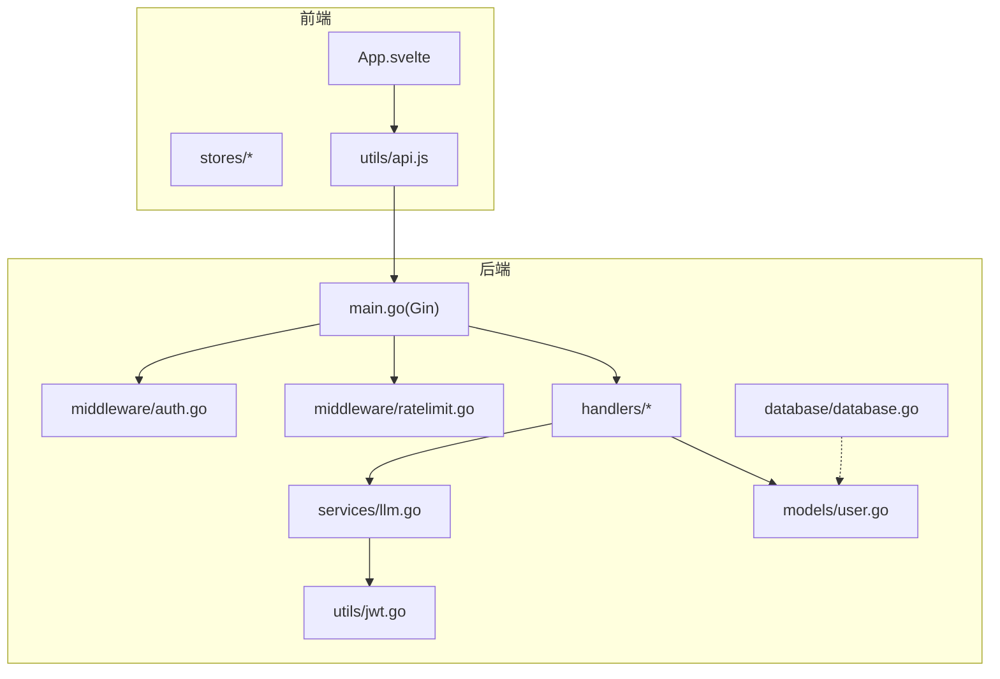
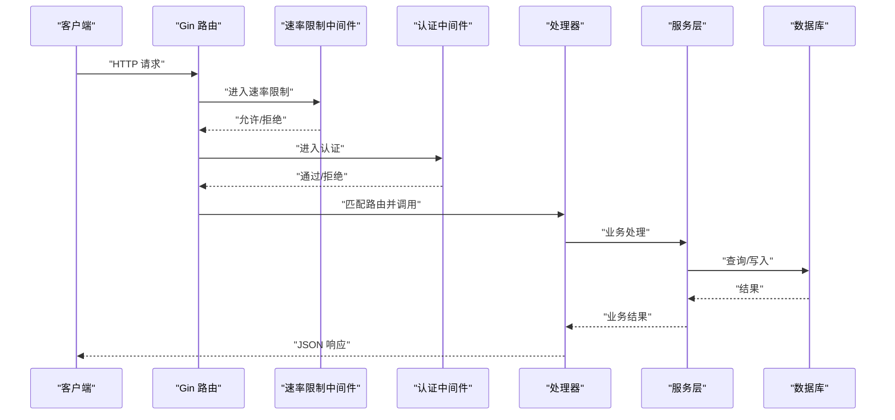
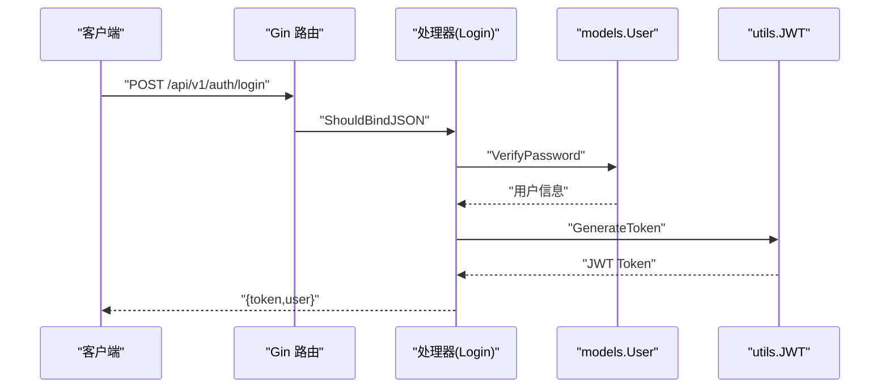
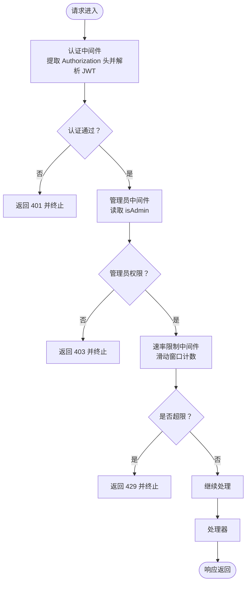
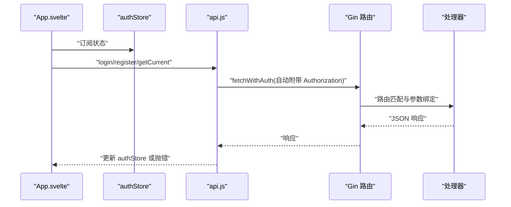
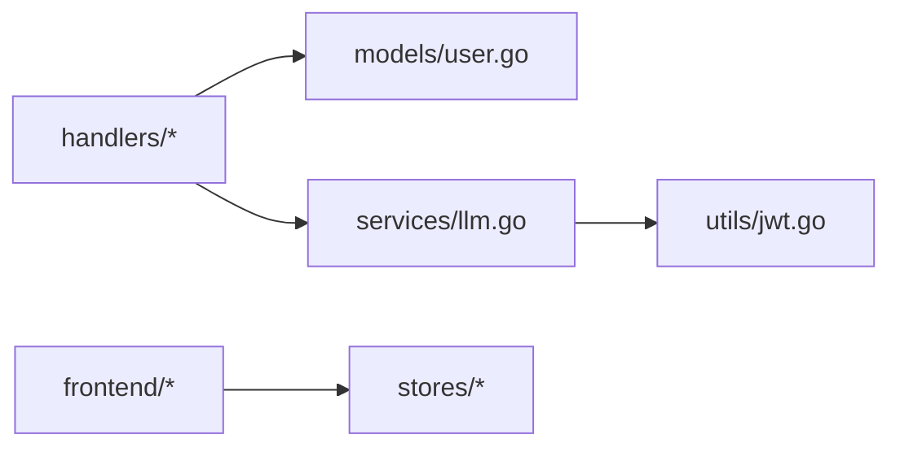

# 组件交互

<cite>
**本文引用的文件**
- [backend/main.go](file://backend/main.go)
- [backend/handlers/auth.go](file://backend/handlers/auth.go)
- [backend/handlers/models.go](file://backend/handlers/models.go)
- [backend/middleware/auth.go](file://backend/middleware/auth.go)
- [backend/middleware/ratelimit.go](file://backend/middleware/ratelimit.go)
- [backend/utils/jwt.go](file://backend/utils/jwt.go)
- [backend/models/user.go](file://backend/models/user.go)
- [backend/database/database.go](file://backend/database/database.go)
- [backend/services/llm.go](file://backend/services/llm.go)
- [frontend/src/utils/api.js](file://frontend/src/utils/api.js)
- [frontend/src/stores/auth.js](file://frontend/src/stores/auth.js)
- [frontend/src/stores/theme.js](file://frontend/src/stores/theme.js)
- [frontend/src/App.svelte](file://frontend/src/App.svelte)
</cite>

## 目录
1. [简介](#简介)
2. [项目结构](#项目结构)
3. [核心组件](#核心组件)
4. [架构总览](#架构总览)
5. [详细组件分析](#详细组件分析)
6. [依赖关系分析](#依赖关系分析)
7. [性能考量](#性能考量)
8. [故障排查指南](#故障排查指南)
9. [结论](#结论)

## 简介
本文件面向 Memo Studio 的开发者与运维人员，系统性梳理后端 API 网关、处理器、中间件、服务层与前端之间的组件交互关系与通信机制。重点覆盖：
- API 网关与处理器的路由匹配、参数传递、响应处理
- 中间件系统：认证、速率限制、CORS、安全头
- 前端与后端通信：API 调用、状态管理、错误处理
- 组件依赖链：handlers 依赖 models，services 依赖 utils，前端依赖 stores
- 事件驱动与异步处理、错误传播策略
- 组件交互图与通信协议说明

## 项目结构
Memo Studio 采用前后端分离架构：
- 后端基于 Go + Gin，提供 REST API 与静态资源托管
- 前端基于 Svelte（kit），通过 fetch 与后端交互
- 数据持久化使用 SQLite，配合迁移脚本与多版本 schema 升级
- 中间件负责认证、速率限制、CORS 与安全头注入
- 服务层封装 LLM 能力，支持云端与本地模型



图表来源
- [backend/main.go](file://backend/main.go#L28-L353)
- [backend/middleware/auth.go](file://backend/middleware/auth.go#L12-L71)
- [backend/middleware/ratelimit.go](file://backend/middleware/ratelimit.go#L96-L143)
- [backend/handlers/auth.go](file://backend/handlers/auth.go#L27-L111)
- [backend/services/llm.go](file://backend/services/llm.go#L289-L336)
- [backend/utils/jwt.go](file://backend/utils/jwt.go#L29-L76)
- [backend/models/user.go](file://backend/models/user.go#L46-L110)
- [backend/database/database.go](file://backend/database/database.go#L20-L60)
- [frontend/src/utils/api.js](file://frontend/src/utils/api.js#L115-L316)
- [frontend/src/stores/auth.js](file://frontend/src/stores/auth.js#L20-L80)
- [frontend/src/App.svelte](file://frontend/src/App.svelte#L1-L328)

章节来源
- [backend/main.go](file://backend/main.go#L28-L353)
- [frontend/src/App.svelte](file://frontend/src/App.svelte#L1-L328)

## 核心组件
- API 网关（Gin）：路由注册、CORS、安全头、静态资源托管、SPA 回退
- 中间件：认证、管理员鉴权、速率限制
- 处理器：业务入口，负责参数绑定、调用服务与返回响应
- 服务层：封装 LLM 能力、模型配置与健康检查
- 工具与模型：JWT 令牌、用户模型、数据库初始化与迁移
- 前端：API 客户端、状态管理、视图与交互

章节来源
- [backend/main.go](file://backend/main.go#L28-L353)
- [backend/middleware/auth.go](file://backend/middleware/auth.go#L12-L71)
- [backend/middleware/ratelimit.go](file://backend/middleware/ratelimit.go#L96-L143)
- [backend/handlers/auth.go](file://backend/handlers/auth.go#L27-L111)
- [backend/services/llm.go](file://backend/services/llm.go#L289-L336)
- [backend/utils/jwt.go](file://backend/utils/jwt.go#L29-L76)
- [backend/models/user.go](file://backend/models/user.go#L46-L110)
- [backend/database/database.go](file://backend/database/database.go#L20-L60)
- [frontend/src/utils/api.js](file://frontend/src/utils/api.js#L115-L316)
- [frontend/src/stores/auth.js](file://frontend/src/stores/auth.js#L20-L80)

## 架构总览
后端启动流程与中间件链路如下：
- 初始化数据库与迁移
- 注册路由组与中间件（CORS、安全头、速率限制、认证、管理员）
- 暴露 API v1 与兼容旧 API
- 静态资源与 SPA 回退
- 健康检查端点



图表来源
- [backend/main.go](file://backend/main.go#L95-L196)
- [backend/middleware/ratelimit.go](file://backend/middleware/ratelimit.go#L96-L143)
- [backend/middleware/auth.go](file://backend/middleware/auth.go#L12-L71)
- [backend/handlers/auth.go](file://backend/handlers/auth.go#L27-L111)
- [backend/services/llm.go](file://backend/services/llm.go#L289-L336)
- [backend/database/database.go](file://backend/database/database.go#L20-L60)

## 详细组件分析

### API 网关与处理器交互
- 路由匹配
  - v1 路由组：公开登录/注册（带速率限制）、认证路由组（含用户、笔记、标签、资源、统计、导出导入、AI 洞察等）
  - 兼容旧 API：/api 前缀下的旧接口
- 参数传递
  - Gin 使用 ShouldBindJSON 绑定请求体，错误时返回 400
  - 路径参数通过路由定义（如 :id）
  - 查询参数通过 c.Query
- 响应处理
  - 成功返回 JSON；错误返回统一结构（如错误信息）
  - 认证处理器返回 Token + User



图表来源
- [backend/main.go](file://backend/main.go#L95-L196)
- [backend/handlers/auth.go](file://backend/handlers/auth.go#L27-L53)
- [backend/models/user.go](file://backend/models/user.go#L78-L110)
- [backend/utils/jwt.go](file://backend/utils/jwt.go#L29-L49)

章节来源
- [backend/main.go](file://backend/main.go#L95-L196)
- [backend/handlers/auth.go](file://backend/handlers/auth.go#L27-L111)

### 中间件系统工作原理
- 认证中间件
  - 从 Authorization 头提取 Bearer Token
  - 解析 JWT，将用户信息注入上下文（userID、username、isAdmin）
  - 管理员中间件从上下文读取 isAdmin 并校验
- 速率限制
  - 基于客户端 IP 的滑动窗口计数
  - 全局限流默认 50 次/分钟，严格限流 30 次/分钟
  - 返回 Retry-After 与速率限制头
- CORS 配置
  - 支持自定义 AllowOrigins，开发默认放开，生产建议显式配置
  - 允许方法与头部可配置
- 安全头
  - 注入 X-Content-Type-Options、X-Frame-Options、X-XSS-Protection、X-Robots-Tag



图表来源
- [backend/middleware/auth.go](file://backend/middleware/auth.go#L12-L71)
- [backend/middleware/ratelimit.go](file://backend/middleware/ratelimit.go#L96-L143)
- [backend/main.go](file://backend/main.go#L46-L81)

章节来源
- [backend/middleware/auth.go](file://backend/middleware/auth.go#L12-L71)
- [backend/middleware/ratelimit.go](file://backend/middleware/ratelimit.go#L96-L143)
- [backend/main.go](file://backend/main.go#L46-L81)

### 前端与后端通信
- API 调用
  - 使用 fetchWithAuth 自动附加 Authorization 头
  - 统一错误处理：401 触发登出、404/429/4xx 统一抛错
  - 支持拦截器扩展（add/remove）
- 状态管理
  - authStore：token、user、订阅通知
  - themeStore：主题切换与 DOM 类名同步
- 错误处理
  - 登录/注册失败、笔记 CRUD 失败、速率限制、资源不存在等场景均有明确提示



图表来源
- [frontend/src/App.svelte](file://frontend/src/App.svelte#L29-L51)
- [frontend/src/stores/auth.js](file://frontend/src/stores/auth.js#L20-L80)
- [frontend/src/utils/api.js](file://frontend/src/utils/api.js#L53-L76)
- [backend/main.go](file://backend/main.go#L95-L196)
- [backend/handlers/auth.go](file://backend/handlers/auth.go#L27-L111)

章节来源
- [frontend/src/App.svelte](file://frontend/src/App.svelte#L1-L328)
- [frontend/src/stores/auth.js](file://frontend/src/stores/auth.js#L20-L80)
- [frontend/src/utils/api.js](file://frontend/src/utils/api.js#L115-L316)

### 组件依赖关系
- handlers 依赖 models（用户模型、密码验证、用户信息查询）
- handlers 依赖 services（LLM 模型管理、洞察与总结）
- services 依赖 utils（JWT 令牌生成与解析）
- 前端依赖 stores（状态管理）



图表来源
- [backend/handlers/auth.go](file://backend/handlers/auth.go#L27-L111)
- [backend/models/user.go](file://backend/models/user.go#L46-L110)
- [backend/services/llm.go](file://backend/services/llm.go#L289-L336)
- [backend/utils/jwt.go](file://backend/utils/jwt.go#L29-L76)
- [frontend/src/stores/auth.js](file://frontend/src/stores/auth.js#L20-L80)

章节来源
- [backend/handlers/auth.go](file://backend/handlers/auth.go#L27-L111)
- [backend/models/user.go](file://backend/models/user.go#L46-L110)
- [backend/services/llm.go](file://backend/services/llm.go#L289-L336)
- [backend/utils/jwt.go](file://backend/utils/jwt.go#L29-L76)
- [frontend/src/stores/auth.js](file://frontend/src/stores/auth.js#L20-L80)

### 事件驱动与异步处理
- 前端事件
  - 自定义事件：auth-success、键盘快捷键事件、视图切换事件
  - 异步操作：登录后验证 token、获取笔记详情、保存草稿
- 后端异步
  - Gin 服务器启动与优雅关闭
  - LLM 服务请求超时控制（120s）

章节来源
- [frontend/src/App.svelte](file://frontend/src/App.svelte#L33-L51)
- [backend/main.go](file://backend/main.go#L331-L351)
- [backend/services/llm.go](file://backend/services/llm.go#L469-L474)

### 错误传播策略
- 后端
  - 参数绑定失败：400
  - 认证失败：401
  - 权限不足：403
  - 资源不存在：404
  - 请求过于频繁：429（附带 Retry-After）
  - 其他错误：500
- 前端
  - 401：清除本地 token，触发 auth-expired 事件
  - 429：提示“请求过于频繁”
  - 404：提示“资源不存在”
  - 其他：解析响应体或回退提示

章节来源
- [backend/middleware/ratelimit.go](file://backend/middleware/ratelimit.go#L104-L112)
- [frontend/src/utils/api.js](file://frontend/src/utils/api.js#L34-L50)
- [backend/handlers/auth.go](file://backend/handlers/auth.go#L35-L40)

## 依赖关系分析

```mermaid
classDiagram
class GinMain {
+路由注册
+CORS
+安全头
+静态资源
+SPA回退
}
class AuthMW {
+AuthMiddleware()
+AdminOnly()
}
class RateMW {
+RateLimitMiddleware()
+StrictRateLimitMiddleware()
}
class Handlers {
+Login()
+Register()
+GetCurrentUser()
+模型管理接口...
}
class Services {
+LLMService
+GetActiveModel()
+CheckLocalHealth()
}
class Utils {
+GenerateToken()
+ParseToken()
}
class Models {
+VerifyPassword()
+GetUserByID()
+CreateUser()
}
class DB {
+Init()
+runMigrations()
}
GinMain --> AuthMW : "use"
GinMain --> RateMW : "use"
GinMain --> Handlers : "路由绑定"
Handlers --> Models : "依赖"
Handlers --> Services : "依赖"
Services --> Utils : "依赖"
DB -.-> Models : "提供数据"
```

图表来源
- [backend/main.go](file://backend/main.go#L28-L353)
- [backend/middleware/auth.go](file://backend/middleware/auth.go#L12-L71)
- [backend/middleware/ratelimit.go](file://backend/middleware/ratelimit.go#L96-L143)
- [backend/handlers/auth.go](file://backend/handlers/auth.go#L27-L111)
- [backend/services/llm.go](file://backend/services/llm.go#L289-L336)
- [backend/utils/jwt.go](file://backend/utils/jwt.go#L29-L76)
- [backend/models/user.go](file://backend/models/user.go#L46-L110)
- [backend/database/database.go](file://backend/database/database.go#L20-L60)

章节来源
- [backend/main.go](file://backend/main.go#L28-L353)
- [backend/middleware/auth.go](file://backend/middleware/auth.go#L12-L71)
- [backend/middleware/ratelimit.go](file://backend/middleware/ratelimit.go#L96-L143)
- [backend/handlers/auth.go](file://backend/handlers/auth.go#L27-L111)
- [backend/services/llm.go](file://backend/services/llm.go#L289-L336)
- [backend/utils/jwt.go](file://backend/utils/jwt.go#L29-L76)
- [backend/models/user.go](file://backend/models/user.go#L46-L110)
- [backend/database/database.go](file://backend/database/database.go#L20-L60)

## 性能考量
- 速率限制
  - 全局默认 50 次/分钟，严格限流 30 次/分钟，可通过中间件函数替换
  - 建议在高并发场景下结合上游负载均衡器或 CDN 限流
- 数据库
  - WAL 模式、外键约束开启、超时设置，提升并发与一致性
  - 建议在生产环境使用 SSD 与合适的连接池参数
- LLM 调用
  - 默认超时 120s，可根据网络环境调整
  - 本地模型健康检查 5s 超时，避免阻塞请求

章节来源
- [backend/middleware/ratelimit.go](file://backend/middleware/ratelimit.go#L88-L94)
- [backend/database/database.go](file://backend/database/database.go#L45-L52)
- [backend/services/llm.go](file://backend/services/llm.go#L469-L474)

## 故障排查指南
- 认证失败
  - 检查 Authorization 头格式（Bearer Token）
  - 确认 MEMO_JWT_SECRET 环境变量（生产必须）
- 速率限制
  - 查看 X-RateLimit-Remaining 头，确认是否命中 429
  - 调整限流阈值或使用严格限流
- CORS 问题
  - 生产环境务必设置 MEMO_CORS_ORIGINS
  - 检查 AllowMethods/AllowHeaders 是否包含前端请求
- LLM 连接
  - 使用 CheckLocalHealth 端点验证本地模型服务可达
  - 核对 BaseURL 与 API Key 配置
- 前端错误
  - 401：自动清空本地 token 并触发重新登录
  - 429：等待 Retry-After 后重试
  - 404：检查资源是否存在或路径是否正确

章节来源
- [backend/middleware/auth.go](file://backend/middleware/auth.go#L12-L71)
- [backend/middleware/ratelimit.go](file://backend/middleware/ratelimit.go#L104-L112)
- [backend/main.go](file://backend/main.go#L55-L81)
- [backend/services/llm.go](file://backend/services/llm.go#L517-L531)
- [frontend/src/utils/api.js](file://frontend/src/utils/api.js#L34-L50)

## 结论
Memo Studio 的组件交互清晰、职责分明：后端通过 Gin 提供稳定 API，中间件保障安全与稳定性，处理器与服务层解耦业务逻辑，前端通过统一 API 客户端与状态管理实现一致的用户体验。建议在生产环境中：
- 明确配置 CORS 与 JWT Secret
- 合理设置速率限制与 LLM 超时
- 使用数据库 WAL 模式与外键约束
- 前端做好错误兜底与用户提示