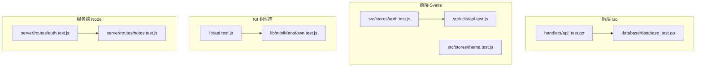
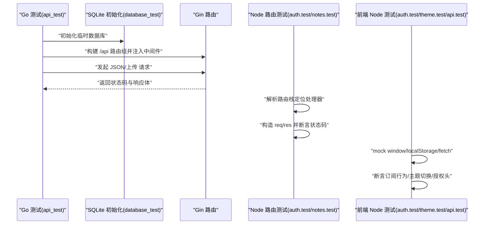
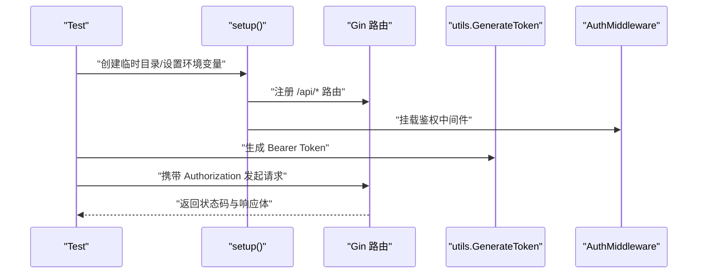
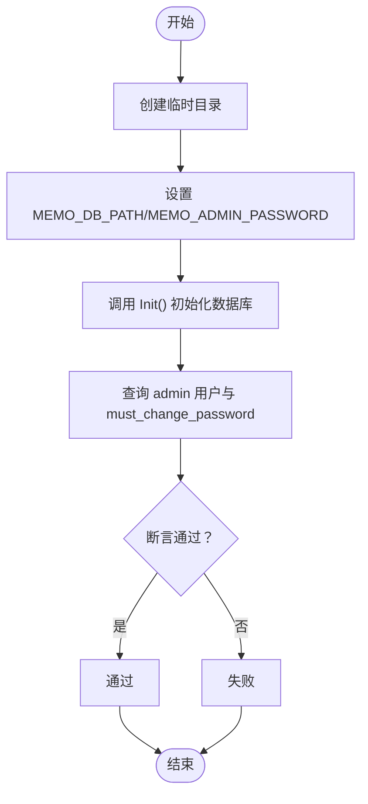
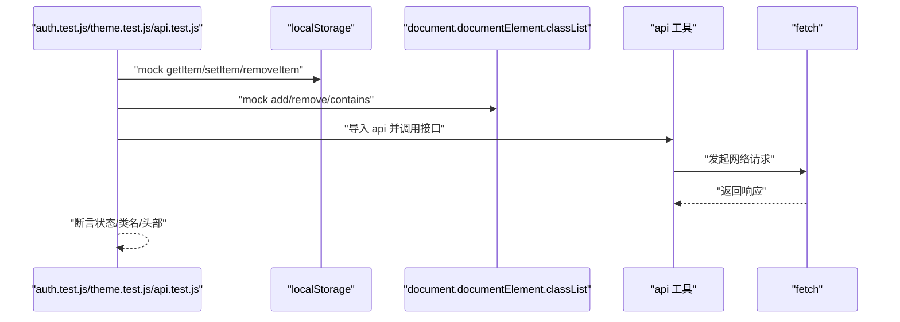
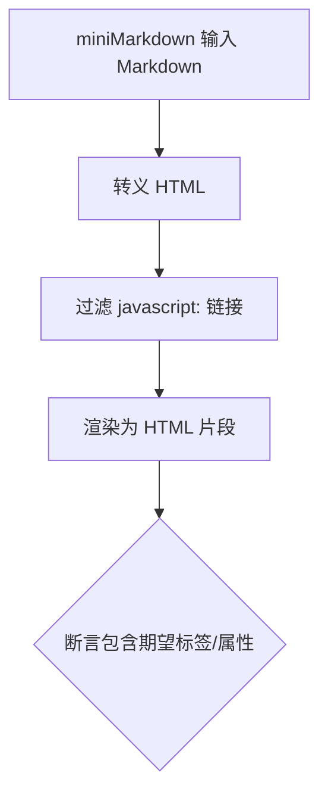
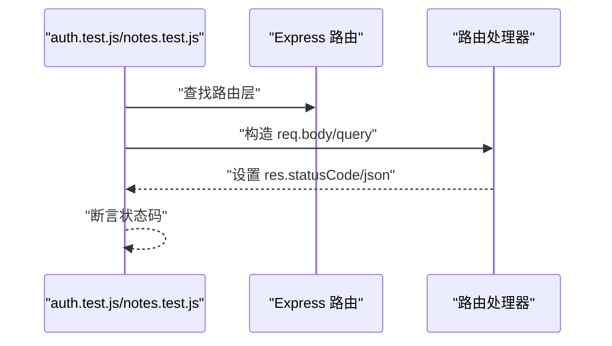
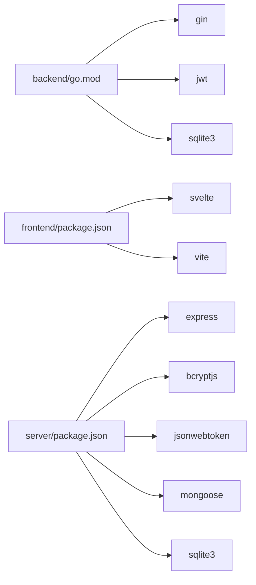

# 测试策略

<cite>
**本文引用的文件**
- [backend/database/database_test.go](file://backend/database/database_test.go)
- [backend/handlers/api_test.go](file://backend/handlers/api_test.go)
- [frontend/src/stores/auth.test.js](file://frontend/src/stores/auth.test.js)
- [frontend/src/stores/theme.test.js](file://frontend/src/stores/theme.test.js)
- [frontend/src/utils/api.test.js](file://frontend/src/utils/api.test.js)
- [server/routes/auth.test.js](file://server/routes/auth.test.js)
- [server/routes/notes.test.js](file://server/routes/notes.test.js)
- [kit/src/lib/api.test.js](file://kit/src/lib/api.test.js)
- [kit/src/lib/miniMarkdown.test.js](file://kit/src/lib/miniMarkdown.test.js)
- [backend/go.mod](file://backend/go.mod)
- [frontend/package.json](file://frontend/package.json)
- [server/package.json](file://server/package.json)
</cite>

## 目录
1. [引言](#引言)
2. [项目结构](#项目结构)
3. [核心组件](#核心组件)
4. [架构总览](#架构总览)
5. [详细组件分析](#详细组件分析)
6. [依赖分析](#依赖分析)
7. [性能考虑](#性能考虑)
8. [故障排查指南](#故障排查指南)
9. [结论](#结论)
10. [附录](#附录)

## 引言
本文件系统化梳理 Memo Studio 的测试策略与实现现状，覆盖后端 Go 单元测试、前端 Node 测试（含 SvelteKit 组件库测试）、服务端 Node 路由测试、以及集成测试与测试数据管理的建议方案。文档同时给出持续集成中的测试自动化落地建议、测试最佳实践、以及性能与压力测试的实施路径。

## 项目结构
项目采用多模块结构：后端 Go（Gin + SQLite）、前端 Svelte（Vite）与 Kit（SvelteKit），以及独立的 Node 服务层（Express）。测试分布在各模块目录中，分别使用 Go testing、Node 内置测试（--test）与 Node 原生断言。

图表来源
- [backend/handlers/api_test.go](file://backend/handlers/api_test.go#L1-L440)
- [backend/database/database_test.go](file://backend/database/database_test.go#L1-L35)
- [frontend/src/stores/auth.test.js](file://frontend/src/stores/auth.test.js#L1-L42)
- [frontend/src/stores/theme.test.js](file://frontend/src/stores/theme.test.js#L1-L50)
- [frontend/src/utils/api.test.js](file://frontend/src/utils/api.test.js#L1-L38)
- [kit/src/lib/api.test.js](file://kit/src/lib/api.test.js#L1-L39)
- [kit/src/lib/miniMarkdown.test.js](file://kit/src/lib/miniMarkdown.test.js#L1-L31)
- [server/routes/auth.test.js](file://server/routes/auth.test.js#L1-L43)
- [server/routes/notes.test.js](file://server/routes/notes.test.js#L1-L43)

章节来源
- [backend/handlers/api_test.go](file://backend/handlers/api_test.go#L1-L440)
- [backend/database/database_test.go](file://backend/database/database_test.go#L1-L35)
- [frontend/src/stores/auth.test.js](file://frontend/src/stores/auth.test.js#L1-L42)
- [frontend/src/stores/theme.test.js](file://frontend/src/stores/theme.test.js#L1-L50)
- [frontend/src/utils/api.test.js](file://frontend/src/utils/api.test.js#L1-L38)
- [kit/src/lib/api.test.js](file://kit/src/lib/api.test.js#L1-L39)
- [kit/src/lib/miniMarkdown.test.js](file://kit/src/lib/miniMarkdown.test.js#L1-L31)
- [server/routes/auth.test.js](file://server/routes/auth.test.js#L1-L43)
- [server/routes/notes.test.js](file://server/routes/notes.test.js#L1-L43)

## 核心组件
- 后端 API 集成测试：通过 Gin 测试模式搭建路由组，使用 httptest 发起请求，验证鉴权、资源上传、备忘录 CRUD、标签隔离、管理员用户管理等场景。
- 数据库初始化测试：在临时目录初始化 SQLite，校验管理员用户创建与“必须修改密码”标志。
- 前端状态与工具测试：Node 测试验证 authStore、themeStore 的订阅与本地存储同步；api 工具自动附加 Authorization 头；miniMarkdown 渲染与安全防护。
- 服务端 Node 路由测试：对 Express 路由进行最小化断言，验证缺失字段时返回 400。

章节来源
- [backend/handlers/api_test.go](file://backend/handlers/api_test.go#L24-L84)
- [backend/database/database_test.go](file://backend/database/database_test.go#L9-L33)
- [frontend/src/stores/auth.test.js](file://frontend/src/stores/auth.test.js#L21-L40)
- [frontend/src/stores/theme.test.js](file://frontend/src/stores/theme.test.js#L37-L48)
- [frontend/src/utils/api.test.js](file://frontend/src/utils/api.test.js#L19-L36)
- [kit/src/lib/miniMarkdown.test.js](file://kit/src/lib/miniMarkdown.test.js#L6-L29)
- [server/routes/auth.test.js](file://server/routes/auth.test.js#L27-L33)
- [server/routes/notes.test.js](file://server/routes/notes.test.js#L27-L33)

## 架构总览
下图展示测试执行的关键流程：Go 测试驱动数据库初始化与 Gin 路由，Node 测试驱动 Express 路由与 SvelteKit 组件库逻辑，前端 Node 测试驱动状态与工具函数。

图表来源
- [backend/handlers/api_test.go](file://backend/handlers/api_test.go#L24-L84)
- [backend/database/database_test.go](file://backend/database/database_test.go#L9-L33)
- [server/routes/auth.test.js](file://server/routes/auth.test.js#L6-L33)
- [server/routes/notes.test.js](file://server/routes/notes.test.js#L6-L33)
- [frontend/src/stores/auth.test.js](file://frontend/src/stores/auth.test.js#L4-L19)
- [frontend/src/stores/theme.test.js](file://frontend/src/stores/theme.test.js#L4-L35)
- [frontend/src/utils/api.test.js](file://frontend/src/utils/api.test.js#L7-L17)

## 详细组件分析

### 后端 API 集成测试（Gin）
- 设计要点
  - 使用测试模式与临时目录隔离数据库与存储。
  - 通过中间件链路验证鉴权、管理员权限、资源上传、备忘录 CRUD、标签隔离与用户管理。
  - 封装通用请求发送器，统一 Content-Type 与 Authorization 处理。
- 关键流程
  - 初始化 -> 创建管理员 -> 注册/登录 -> 资源上传 -> 备忘录创建/列表/更新/删除 -> 管理员用户 CRUD。
- 断言策略
  - 状态码断言（201/200/400/403）。
  - 响应体字段校验（ID、标题、内容类型、标签、资源路径）。
  - 文件落盘校验（资源存储路径存在性）。
- 安全与隔离
  - 每个测试使用独立临时目录，避免跨用例污染。
  - 用户隔离：不同用户创建同名标签应生成不同 ID。

图表来源
- [backend/handlers/api_test.go](file://backend/handlers/api_test.go#L24-L93)

章节来源
- [backend/handlers/api_test.go](file://backend/handlers/api_test.go#L24-L440)

### 数据库初始化测试（SQLite）
- 设计要点
  - 在临时目录初始化 SQLite，设置管理员用户名与“必须修改密码”标志。
  - 查询计数与标志位，确保初始化正确。
- 断言策略
  - 计数断言与布尔标志断言。
- 环境隔离
  - 通过环境变量指定数据库路径，避免污染主库。

图表来源
- [backend/database/database_test.go](file://backend/database/database_test.go#L9-L33)

章节来源
- [backend/database/database_test.go](file://backend/database/database_test.go#L1-L35)

### 前端状态与工具测试（Node）
- authStore 测试
  - 通过 mock localStorage 验证登录/登出对 token 与 user 的持久化与订阅回调次数。
- themeStore 测试
  - 通过 mock document.documentElement.classList 验证主题切换对类名的影响。
- api 工具测试
  - 通过 mock fetch 验证在存在 token 时自动附加 Authorization 头，并调用正确的后端接口。
- 断言策略
  - localStorage 键值断言、DOM 类名断言、fetch 调用参数断言。

图表来源
- [frontend/src/stores/auth.test.js](file://frontend/src/stores/auth.test.js#L4-L19)
- [frontend/src/stores/theme.test.js](file://frontend/src/stores/theme.test.js#L4-L35)
- [frontend/src/utils/api.test.js](file://frontend/src/utils/api.test.js#L7-L17)

章节来源
- [frontend/src/stores/auth.test.js](file://frontend/src/stores/auth.test.js#L1-L42)
- [frontend/src/stores/theme.test.js](file://frontend/src/stores/theme.test.js#L1-L50)
- [frontend/src/utils/api.test.js](file://frontend/src/utils/api.test.js#L1-L38)

### Kit 组件库测试（SvelteKit）
- api 测试
  - 未登录抛错、已登录调用 /api/memos 并附加 Authorization。
- miniMarkdown 测试
  - XSS 转义、阻止 javascript: 链接、渲染粗体/列表/链接/代码块。

图表来源
- [kit/src/lib/miniMarkdown.test.js](file://kit/src/lib/miniMarkdown.test.js#L6-L29)

章节来源
- [kit/src/lib/api.test.js](file://kit/src/lib/api.test.js#L1-L39)
- [kit/src/lib/miniMarkdown.test.js](file://kit/src/lib/miniMarkdown.test.js#L1-L31)

### 服务端 Node 路由测试（Express）
- 设计要点
  - 通过遍历 router.stack 定位具体路由处理器，构造最小化 req/res 进行断言。
- 断言策略
  - 缺少必填字段时返回 400。

图表来源
- [server/routes/auth.test.js](file://server/routes/auth.test.js#L6-L33)
- [server/routes/notes.test.js](file://server/routes/notes.test.js#L6-L33)

章节来源
- [server/routes/auth.test.js](file://server/routes/auth.test.js#L1-L43)
- [server/routes/notes.test.js](file://server/routes/notes.test.js#L1-L43)

## 依赖分析
- Go 依赖
  - Gin、JWT、SQLite 驱动等用于 Web 服务与鉴权。
- 前端依赖
  - Svelte、Tailwind 生态，Node 测试脚本使用内置测试能力。
- 服务端 Node 依赖
  - Express、bcryptjs、jsonwebtoken、mongoose、sqlite3 等。

图表来源
- [backend/go.mod](file://backend/go.mod#L5-L11)
- [frontend/package.json](file://frontend/package.json#L11-L23)
- [server/package.json](file://server/package.json#L11-L19)

章节来源
- [backend/go.mod](file://backend/go.mod#L1-L45)
- [frontend/package.json](file://frontend/package.json#L1-L25)
- [server/package.json](file://server/package.json#L1-L25)

## 性能考虑
- 单元测试
  - 使用内存型存储或 SQLite 临时文件，避免磁盘 IO 开销。
  - 对热点函数（如 miniMarkdown）进行基准测试，确保渲染性能。
- 集成测试
  - 控制并发与批量操作，避免数据库锁竞争。
  - 对大文件上传与列表分页进行吞吐量与延迟评估。
- 前端测试
  - 对状态更新与订阅回调进行性能回归，避免不必要的重渲染。
- 压力测试
  - 使用压测工具对 /api/* 接口施加并发请求，观察响应时间与错误率。
  - 结合数据库慢查询日志与 GC 日志，定位瓶颈。

## 故障排查指南
- 常见问题
  - 令牌缺失导致 401/403：检查 authHeader 生成与 Authorization 头注入。
  - 资源上传失败：确认临时存储目录可写与 Content-Type 正确。
  - 标签重复：确认用户隔离逻辑与标签去重策略。
  - Node 测试断言失败：检查 mock 对象是否完整覆盖所需 API。
- 排查步骤
  - 打印关键状态码与响应体，核对业务逻辑分支。
  - 使用最小化用例复现，逐步缩小范围。
  - 查看数据库快照与日志，定位异常点。

## 结论
当前项目已在后端、前端与服务端分别建立了基础的单元与集成测试骨架，覆盖鉴权、资源上传、CRUD、标签隔离与路由校验等关键路径。建议进一步完善测试覆盖率统计、测试报告聚合与质量门禁，并补充性能与压力测试以保障生产稳定性。

## 附录

### 测试数据准备与管理
- 临时数据库与存储
  - 使用测试临时目录与环境变量隔离数据库与静态资源。
- 模拟数据
  - 使用内存 Map/Map 作为 localStorage 与 DOM classList 的最小化模拟。
- 环境隔离
  - 每个测试进程独立临时目录，避免共享状态。

章节来源
- [backend/handlers/api_test.go](file://backend/handlers/api_test.go#L24-L38)
- [frontend/src/stores/auth.test.js](file://frontend/src/stores/auth.test.js#L4-L19)
- [frontend/src/stores/theme.test.js](file://frontend/src/stores/theme.test.js#L4-L35)
- [frontend/src/utils/api.test.js](file://frontend/src/utils/api.test.js#L7-L17)

### 持续集成与自动化
- 测试命令
  - 前端与服务端均通过 Node 内置测试脚本运行。
- 建议
  - 在 CI 中收集覆盖率（如使用覆盖率工具），生成报告并设置质量门禁。
  - 对后端 Gin 测试与前端 Node 测试分别输出 junit/HTML 报告，便于审查。

章节来源
- [frontend/package.json](file://frontend/package.json#L5-L10)
- [server/package.json](file://server/package.json#L5-L7)

### 测试最佳实践
- 用例设计
  - 每个功能点至少覆盖正向、边界与异常三类场景。
- 断言策略
  - 明确状态码与响应体字段，必要时断言副作用（如文件落盘、DOM 变更）。
- 错误处理
  - 对缺失字段、权限不足、鉴权失败等进行显式断言。
- 可维护性
  - 将公共 setup/断言封装为工具函数，减少重复代码。