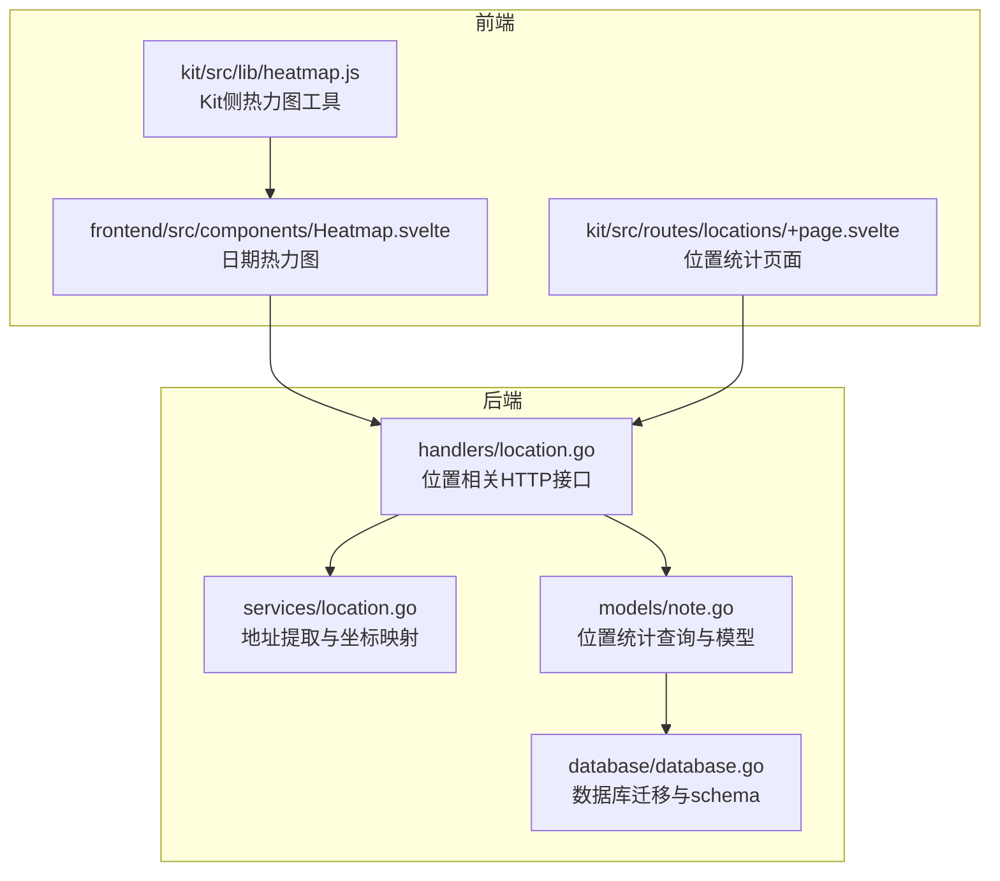
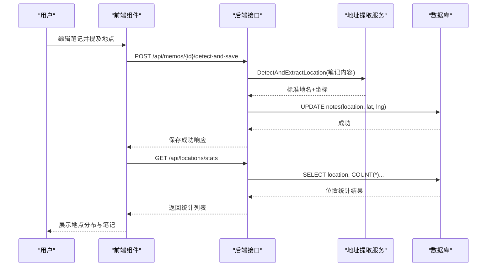
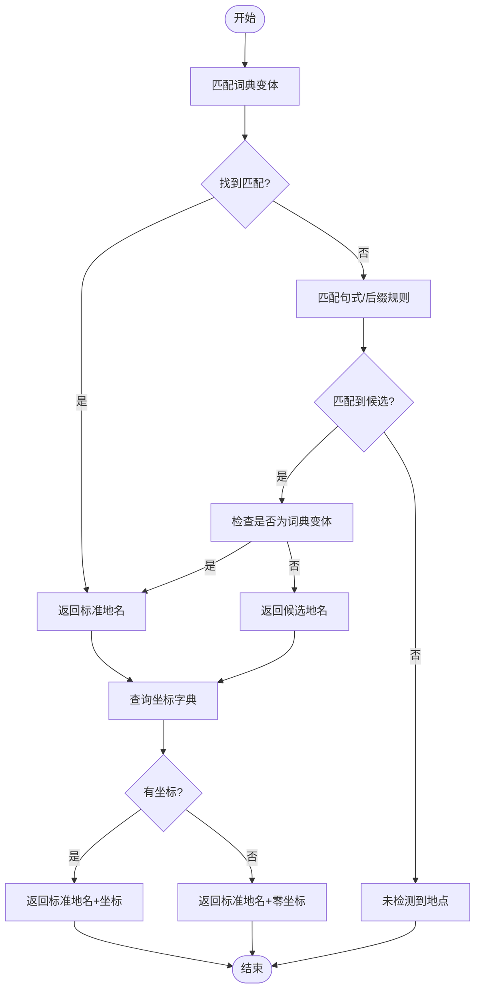
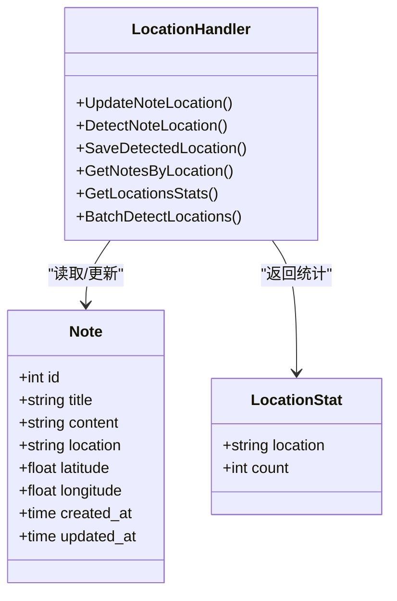
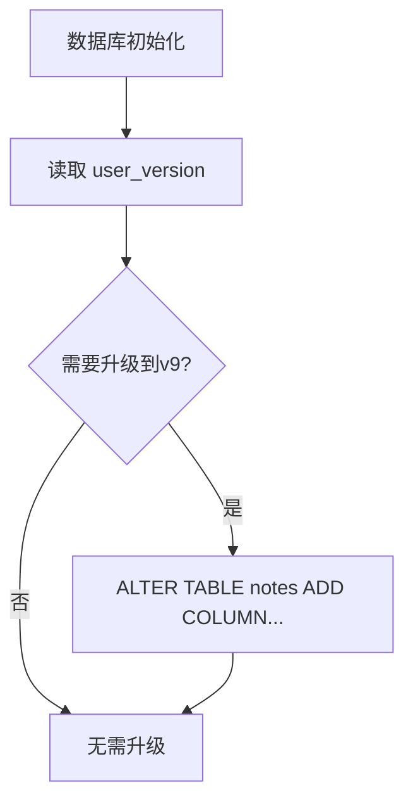
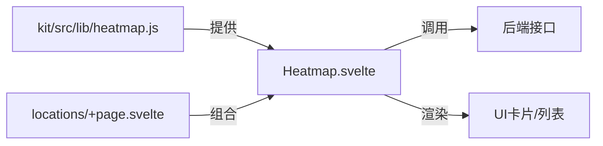
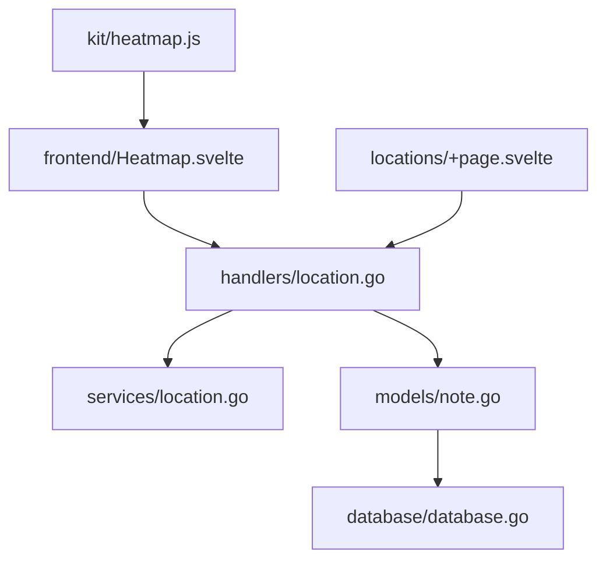

# 位置统计

<cite>
**本文引用的文件**
- [backend/handlers/location.go](file://backend/handlers/location.go)
- [backend/services/location.go](file://backend/services/location.go)
- [backend/models/note.go](file://backend/models/note.go)
- [backend/database/database.go](file://backend/database/database.go)
- [frontend/src/components/Heatmap.svelte](file://frontend/src/components/Heatmap.svelte)
- [kit/src/lib/heatmap.js](file://kit/src/lib/heatmap.js)
- [kit/src/routes/locations/+page.svelte](file://kit/src/routes/locations/+page.svelte)
</cite>

## 目录
1. [简介](#简介)
2. [项目结构](#项目结构)
3. [核心组件](#核心组件)
4. [架构总览](#架构总览)
5. [详细组件分析](#详细组件分析)
6. [依赖关系分析](#依赖关系分析)
7. [性能考量](#性能考量)
8. [故障排查指南](#故障排查指南)
9. [结论](#结论)
10. [附录](#附录)

## 简介
本技术文档聚焦 Memo Studio 的位置统计功能，系统性阐述地理数据采集与处理机制、地址解析算法、地理位置标准化流程；详解位置统计实现原理（地理围栏分析思路、移动轨迹统计方法、位置密度计算）、热力图生成技术方案（坐标转换、权重计算、渲染优化）；提供位置服务的 API 接口规范与集成示例；并说明位置数据的隐私保护与匿名化策略。

## 项目结构
位置统计功能横跨后端 Handler、Service、Model、数据库迁移以及前端组件与 Kit 页面，形成“文本识别—位置标准化—统计聚合—可视化展示”的闭环。

图表来源
- [backend/handlers/location.go](file://backend/handlers/location.go#L1-L204)
- [backend/services/location.go](file://backend/services/location.go#L1-L233)
- [backend/models/note.go](file://backend/models/note.go#L818-L846)
- [backend/database/database.go](file://backend/database/database.go#L211-L241)
- [frontend/src/components/Heatmap.svelte](file://frontend/src/components/Heatmap.svelte#L1-L155)
- [kit/src/lib/heatmap.js](file://kit/src/lib/heatmap.js#L1-L38)
- [kit/src/routes/locations/+page.svelte](file://kit/src/routes/locations/+page.svelte#L117-L213)

章节来源
- [backend/handlers/location.go](file://backend/handlers/location.go#L1-L204)
- [backend/services/location.go](file://backend/services/location.go#L1-L233)
- [backend/models/note.go](file://backend/models/note.go#L818-L846)
- [backend/database/database.go](file://backend/database/database.go#L211-L241)
- [frontend/src/components/Heatmap.svelte](file://frontend/src/components/Heatmap.svelte#L1-L155)
- [kit/src/lib/heatmap.js](file://kit/src/lib/heatmap.js#L1-L38)
- [kit/src/routes/locations/+page.svelte](file://kit/src/routes/locations/+page.svelte#L117-L213)

## 核心组件
- 地址提取与标准化服务：基于内置地名词典与简单规则匹配，输出标准化地点名称与坐标（若存在）。
- 位置统计模型：按地点分组统计笔记数量，提供排序与聚合结果。
- 位置相关 HTTP 接口：支持手动更新笔记位置、AI 自动识别与批量检测、按地点筛选、获取全部位置统计。
- 数据库迁移：为 notes 表新增 location、latitude、longitude 字段，支撑位置数据持久化。
- 前端热力图组件：提供日期维度的热力图展示；Kit 工具函数提供通用热力图构建与配色逻辑；位置统计页面整合识别与筛选能力。

章节来源
- [backend/services/location.go](file://backend/services/location.go#L8-L63)
- [backend/models/note.go](file://backend/models/note.go#L818-L846)
- [backend/handlers/location.go](file://backend/handlers/location.go#L13-L204)
- [backend/database/database.go](file://backend/database/database.go#L211-L241)
- [frontend/src/components/Heatmap.svelte](file://frontend/src/components/Heatmap.svelte#L1-L155)
- [kit/src/lib/heatmap.js](file://kit/src/lib/heatmap.js#L1-L38)

## 架构总览
位置统计的端到端流程如下：
- 文本输入：用户在笔记内容中提及地点（如“今天在北京”）。
- AI 地址提取：后端服务从文本中抽取地点变体，匹配内置词典，标准化为标准地名。
- 坐标映射：根据标准地名查询内置坐标字典，得到经纬度（若无则返回零坐标）。
- 数据持久化：将地点与坐标写回笔记记录。
- 统计聚合：按地点分组统计数量，返回位置分布。
- 可视化展示：前端热力图组件渲染日期维度热力图；位置统计页面展示地点列表与对应笔记。

图表来源
- [backend/handlers/location.go](file://backend/handlers/location.go#L91-L131)
- [backend/services/location.go](file://backend/services/location.go#L203-L221)
- [backend/models/note.go](file://backend/models/note.go#L824-L845)

## 详细组件分析

### 地址提取与标准化服务
- 已知地点词典：内置大量城市/地区名称及其多种变体（中文、拼音、简称等），用于快速匹配。
- 文本提取规则：
  - 直接匹配词典中的标准地名变体；
  - 匹配“在/位于/回到/在...过/在...时/在...时候”等句式中的地名片段；
  - 匹配带“市/省/区/县/镇/村/街道”等后缀的地名候选；
  - 忽略“X年”等时间模式。
- 标准化输出：返回标准地名；若词典中存在，则附加经纬度；否则返回零坐标占位。
- 扩展建议：可接入第三方地理编码 API（如高德、Google Maps）以提升精度与覆盖范围。

图表来源
- [backend/services/location.go](file://backend/services/location.go#L65-L118)
- [backend/services/location.go](file://backend/services/location.go#L164-L221)

章节来源
- [backend/services/location.go](file://backend/services/location.go#L8-L63)
- [backend/services/location.go](file://backend/services/location.go#L65-L118)
- [backend/services/location.go](file://backend/services/location.go#L164-L221)

### 位置统计模型与接口
- 统计查询：按 location 分组，过滤空值与 NULL，统计数量并降序排列。
- 接口能力：
  - 手动更新笔记位置：PUT /api/memos/{id}/location
  - AI 识别位置：POST /api/memos/{id}/detect-location
  - 识别并保存：POST /api/memos/{id}/detect-and-save
  - 按地点筛选笔记：GET /api/notes?location=地点
  - 获取全部位置统计：GET /api/locations/stats
  - 批量检测位置：POST /api/locations/batch-detect

图表来源
- [backend/models/note.go](file://backend/models/note.go#L818-L846)
- [backend/models/note.go](file://backend/models/note.go#L751-L758)
- [backend/handlers/location.go](file://backend/handlers/location.go#L13-L204)

章节来源
- [backend/models/note.go](file://backend/models/note.go#L818-L846)
- [backend/handlers/location.go](file://backend/handlers/location.go#L133-L167)
- [backend/handlers/location.go](file://backend/handlers/location.go#L169-L203)

### 数据库迁移与字段扩展
- notes 表新增 location、latitude、longitude 字段，支持位置数据持久化。
- 迁移版本控制：通过 user_version 与条件判断确保幂等升级。

图表来源
- [backend/database/database.go](file://backend/database/database.go#L211-L241)

章节来源
- [backend/database/database.go](file://backend/database/database.go#L211-L241)

### 前端热力图与位置统计页面
- 日期热力图组件：按自然日聚合笔记数量，计算强度并渲染格子。
- Kit 热力图工具：提供通用构建与配色函数，便于复用。
- 位置统计页面：展示地点分布列表、按地点筛选笔记、一键识别并保存位置。

图表来源
- [frontend/src/components/Heatmap.svelte](file://frontend/src/components/Heatmap.svelte#L1-L155)
- [kit/src/lib/heatmap.js](file://kit/src/lib/heatmap.js#L1-L38)
- [kit/src/routes/locations/+page.svelte](file://kit/src/routes/locations/+page.svelte#L117-L213)

章节来源
- [frontend/src/components/Heatmap.svelte](file://frontend/src/components/Heatmap.svelte#L1-L155)
- [kit/src/lib/heatmap.js](file://kit/src/lib/heatmap.js#L1-L38)
- [kit/src/routes/locations/+page.svelte](file://kit/src/routes/locations/+page.svelte#L117-L213)

## 依赖关系分析
- Handler 依赖 Model 进行数据访问，依赖 Service 进行地址提取与坐标映射。
- Model 依赖数据库层进行 SQL 查询与迁移。
- 前端组件依赖后端接口获取数据，Kit 工具提供通用热力图逻辑。

图表来源
- [backend/handlers/location.go](file://backend/handlers/location.go#L1-L204)
- [backend/services/location.go](file://backend/services/location.go#L1-L233)
- [backend/models/note.go](file://backend/models/note.go#L818-L846)
- [backend/database/database.go](file://backend/database/database.go#L211-L241)
- [frontend/src/components/Heatmap.svelte](file://frontend/src/components/Heatmap.svelte#L1-L155)
- [kit/src/lib/heatmap.js](file://kit/src/lib/heatmap.js#L1-L38)
- [kit/src/routes/locations/+page.svelte](file://kit/src/routes/locations/+page.svelte#L117-L213)

章节来源
- [backend/handlers/location.go](file://backend/handlers/location.go#L1-L204)
- [backend/services/location.go](file://backend/services/location.go#L1-L233)
- [backend/models/note.go](file://backend/models/note.go#L818-L846)
- [backend/database/database.go](file://backend/database/database.go#L211-L241)
- [frontend/src/components/Heatmap.svelte](file://frontend/src/components/Heatmap.svelte#L1-L155)
- [kit/src/lib/heatmap.js](file://kit/src/lib/heatmap.js#L1-L38)
- [kit/src/routes/locations/+page.svelte](file://kit/src/routes/locations/+page.svelte#L117-L213)

## 性能考量
- 地址提取复杂度：词典匹配为 O(N×M)，其中 N 为词典条目数，M 为变体数；规则匹配为线性扫描。建议：
  - 将词典变体预处理为哈希集合，减少包含判断开销；
  - 对长文本采用分段匹配与早期短路；
  - 对常见地名建立前缀树或索引以加速。
- 统计查询：按 location 分组并聚合，建议在 location 字段上建立索引以提升 GROUP BY 性能。
- 前端渲染：日期热力图按天聚合，复杂度 O(T)（T 为天数）。建议：
  - 使用 Map 结构进行计数，避免重复遍历；
  - 对大范围时间跨度采用懒加载与虚拟滚动。
- 数据库迁移：ALTER TABLE 为 DDL 操作，建议在低峰时段执行并确保事务完整性。

[本节为通用性能建议，不直接分析具体文件]

## 故障排查指南
- 识别不到地点
  - 检查笔记内容是否包含词典中的变体或符合句式规则；
  - 确认是否命中“在/位于/回到”等模式。
- 坐标缺失
  - 若词典中无该地名，将返回零坐标；建议接入第三方地理编码 API。
- 统计为空
  - 确认笔记是否已保存地点信息（location 非空）；
  - 检查数据库迁移是否完成，确认 location、latitude、longitude 字段存在。
- 前端渲染异常
  - 检查 API 返回数据格式与字段名是否一致；
  - 确认日期格式与本地时区转换逻辑。

章节来源
- [backend/services/location.go](file://backend/services/location.go#L65-L118)
- [backend/services/location.go](file://backend/services/location.go#L164-L221)
- [backend/models/note.go](file://backend/models/note.go#L824-L845)
- [backend/database/database.go](file://backend/database/database.go#L211-L241)
- [frontend/src/components/Heatmap.svelte](file://frontend/src/components/Heatmap.svelte#L1-L155)

## 结论
Memo Studio 的位置统计功能以“文本识别—标准化—统计—可视化”为主线，具备良好的扩展性与可维护性。通过内置词典与规则匹配实现基础地址提取，结合数据库迁移与接口设计支撑位置数据的持久化与查询；前端热力图与位置页面提供直观的可视化体验。未来可在地理编码精度、统计算法与渲染性能方面持续优化。

[本节为总结性内容，不直接分析具体文件]

## 附录

### API 接口规范
- 更新笔记位置
  - 方法与路径：PUT /api/memos/{id}/location
  - 请求体字段：location、latitude、longitude
  - 响应：返回更新后的笔记与位置信息
- AI 识别位置
  - 方法与路径：POST /api/memos/{id}/detect-location
  - 响应：若检测到返回标准地名与坐标；否则提示未检测到
- 识别并保存位置
  - 方法与路径：POST /api/memos/{id}/detect-and-save
  - 响应：保存成功并返回地名与坐标
- 按地点筛选笔记
  - 方法与路径：GET /api/notes?location=地点
  - 响应：返回该地点下的笔记列表与数量
- 获取全部位置统计
  - 方法与路径：GET /api/locations/stats
  - 响应：返回按数量降序排列的地点统计列表
- 批量检测位置
  - 方法与路径：POST /api/locations/batch-detect
  - 请求体字段：note_ids[]
  - 响应：返回检测总数、成功数与各笔记的地点信息

章节来源
- [backend/handlers/location.go](file://backend/handlers/location.go#L13-L204)

### 集成示例（伪代码）
- 前端调用识别并保存
  - 发送 POST /api/memos/{id}/detect-and-save
  - 成功后刷新笔记详情与位置统计
- 前端渲染热力图
  - 调用 kit/src/lib/heatmap.js 的 buildHeatmap 与 heatColor
  - 将后端返回的日期-计数数据映射为 UI 格式

章节来源
- [kit/src/lib/heatmap.js](file://kit/src/lib/heatmap.js#L1-L38)
- [kit/src/routes/locations/+page.svelte](file://kit/src/routes/locations/+page.svelte#L117-L213)

### 隐私保护与匿名化策略
- 数据最小化：仅存储必要的地点名称与坐标，避免冗余字段。
- 匿名化处理：对用户标识与敏感字段进行脱敏存储；在统计层面仅暴露聚合结果。
- 访问控制：接口鉴权与用户隔离，确保统计数据仅对本人可见。
- 第三方 API：接入地理编码服务时，遵循服务条款与隐私政策，避免泄露原始文本与坐标。

[本节为通用隐私建议，不直接分析具体文件]