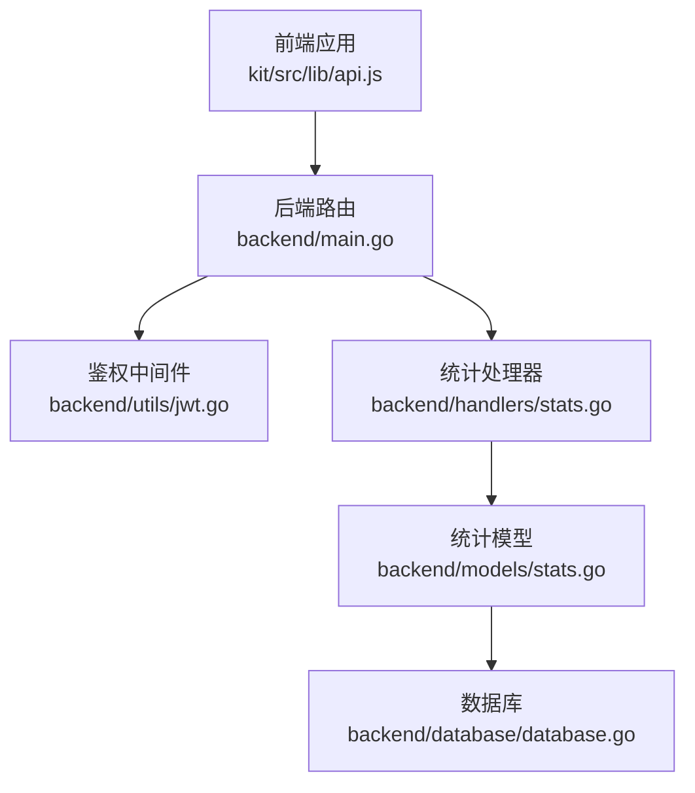
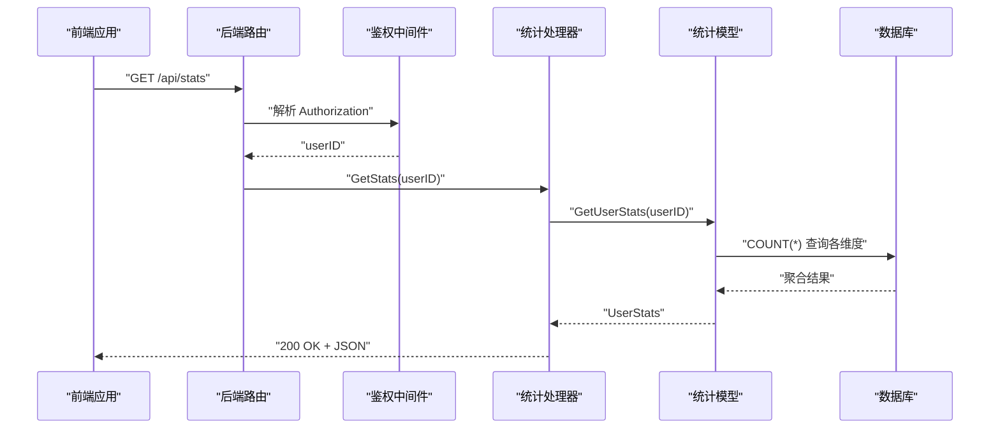
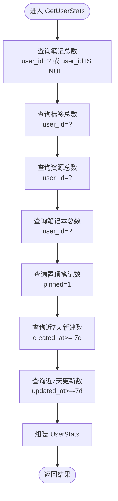
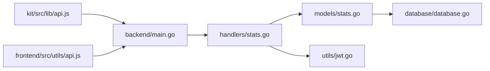

# 使用统计

<cite>
**本文引用的文件**
- [backend/main.go](file://backend/main.go)
- [backend/handlers/stats.go](file://backend/handlers/stats.go)
- [backend/models/stats.go](file://backend/models/stats.go)
- [backend/database/database.go](file://backend/database/database.go)
- [backend/utils/jwt.go](file://backend/utils/jwt.go)
- [backend/utils/encryption.go](file://backend/utils/encryption.go)
- [kit/src/lib/api.js](file://kit/src/lib/api.js)
- [kit/src/routes/stats/+page.svelte](file://kit/src/routes/stats/+page.svelte)
- [frontend/src/components/StatsOverview.svelte](file://frontend/src/components/StatsOverview.svelte)
- [frontend/src/utils/api.js](file://frontend/src/utils/api.js)
- [frontend/src/utils/encryption.js](file://frontend/src/utils/encryption.js)
</cite>

## 目录
1. [简介](#简介)
2. [项目结构](#项目结构)
3. [核心组件](#核心组件)
4. [架构总览](#架构总览)
5. [详细组件分析](#详细组件分析)
6. [依赖关系分析](#依赖关系分析)
7. [性能考量](#性能考量)
8. [故障排查指南](#故障排查指南)
9. [结论](#结论)
10. [附录](#附录)

## 简介
本章节面向 Memo Studio 的“使用统计”能力，系统化梳理后端统计接口、数据聚合策略、时间窗口划分、指标计算方法，以及前端集成与隐私保护措施。重点围绕以下目标展开：
- 明确 GetUserStats 的工作机制与数据来源
- 解释笔记创建频率统计、活跃度分析与趋势计算的实现思路
- 说明统计数据的存储结构、查询优化与扩展方向
- 提供统计 API 的接口规范与前端集成示例
- 阐述统计相关的隐私保护与数据脱敏实践

## 项目结构
统计功能涉及前后端协作：前端发起请求，后端通过鉴权中间件获取当前用户 ID，调用模型层聚合统计，最终返回 JSON 结果。

图表来源
- [backend/main.go](file://backend/main.go#L149-L149)
- [backend/handlers/stats.go](file://backend/handlers/stats.go#L11-L23)
- [backend/models/stats.go](file://backend/models/stats.go#L18-L65)
- [backend/database/database.go](file://backend/database/database.go#L18-L60)
- [backend/utils/jwt.go](file://backend/utils/jwt.go#L51-L66)
- [kit/src/lib/api.js](file://kit/src/lib/api.js#L232-L236)

章节来源
- [backend/main.go](file://backend/main.go#L149-L149)
- [backend/handlers/stats.go](file://backend/handlers/stats.go#L11-L23)
- [backend/models/stats.go](file://backend/models/stats.go#L18-L65)
- [backend/database/database.go](file://backend/database/database.go#L18-L60)
- [backend/utils/jwt.go](file://backend/utils/jwt.go#L51-L66)
- [kit/src/lib/api.js](file://kit/src/lib/api.js#L232-L236)

## 核心组件
- 后端路由与鉴权
  - 路由：/api/stats（GET），位于 v1 分组内，需登录态
  - 鉴权：通过 JWT 中间件解析 Authorization 头，提取用户标识
- 统计处理器
  - 从上下文中解析 userID，调用 GetUserStats 获取统计结果
- 统计模型
  - UserStats 结构体包含：笔记总数、标签数、资源数、笔记本数、置顶数、近7天新建数、近7天更新数
  - 通过多条 SQL 聚合查询一次性返回全部指标
- 数据库
  - SQLite，采用 WAL 模式、外键约束、多版本迁移
  - notes/tags/resources/notebooks 等表支撑统计维度
- 前端
  - kit 侧：/stats 页面通过 api.getStats() 拉取并展示
  - 前端通用：/api/v1 适配器提供统一 fetch 封装与错误处理

章节来源
- [backend/main.go](file://backend/main.go#L149-L149)
- [backend/handlers/stats.go](file://backend/handlers/stats.go#L11-L23)
- [backend/models/stats.go](file://backend/models/stats.go#L7-L16)
- [backend/models/stats.go](file://backend/models/stats.go#L18-L65)
- [backend/database/database.go](file://backend/database/database.go#L45-L52)
- [kit/src/lib/api.js](file://kit/src/lib/api.js#L232-L236)
- [kit/src/routes/stats/+page.svelte](file://kit/src/routes/stats/+page.svelte#L10-L25)

## 架构总览
下面的序列图展示了“获取统计”的端到端流程。

图表来源
- [backend/main.go](file://backend/main.go#L149-L149)
- [backend/handlers/stats.go](file://backend/handlers/stats.go#L11-L23)
- [backend/models/stats.go](file://backend/models/stats.go#L18-L65)
- [backend/database/database.go](file://backend/database/database.go#L18-L60)
- [backend/utils/jwt.go](file://backend/utils/jwt.go#L51-L66)

## 详细组件分析

### 统计接口与数据模型
- 接口定义
  - 方法：GET
  - 路径：/api/stats
  - 鉴权：需要 Bearer Token
  - 成功响应：UserStats 对象
  - 错误响应：500 包含错误信息
- 数据模型
  - UserStats 字段：notes_count、tags_count、resources_count、notebooks_count、pinned_count、notes_created_7d、notes_updated_7d
  - 字段含义：当前用户维度下的总量与近7天增量

章节来源
- [backend/handlers/stats.go](file://backend/handlers/stats.go#L11-L23)
- [backend/models/stats.go](file://backend/models/stats.go#L7-L16)

### GetUserStats 的工作机制
- 输入：当前登录用户 ID
- 数据来源：notes/tags/resources/notebooks 表
- 聚合策略：一次请求内并行执行多条 COUNT(*) 查询，减少往返
- 时间窗口：使用 SQLite 的 datetime('now', '-7 days') 计算近7天边界
- 返回：UserStats 结构体，包含总量与增量指标

图表来源
- [backend/models/stats.go](file://backend/models/stats.go#L18-L65)

章节来源
- [backend/models/stats.go](file://backend/models/stats.go#L18-L65)

### 数据存储结构与查询优化
- 表结构要点
  - notes：包含 user_id（可为空以兼容历史）、created_at、updated_at、pinned 等
  - tags：按用户隔离，唯一索引 (user_id, name)
  - resources：按用户隔离
  - notebooks：按用户隔离
- 查询优化建议
  - 为 notes.user_id、tags.user_id、resources.user_id、notebooks.user_id 建立索引（数据库迁移中已对 notebooks.user_id 建索引）
  - 为 notes.created_at、updated_at 建索引，加速近7天统计
  - 使用 EXPLAIN QUERY PLAN 分析慢查询
  - 对高频统计场景考虑物化视图或汇总表（按天/周聚合）

章节来源
- [backend/database/database.go](file://backend/database/database.go#L180-L209)
- [backend/database/database.go](file://backend/database/database.go#L564-L591)
- [backend/database/database.go](file://backend/database/database.go#L594-L647)

### 前端集成与页面展示
- kit 侧 /stats 页面
  - 通过 api.getStats() 拉取统计，处理 401 自动跳转登录
  - 展示笔记、标签、资源、笔记本、置顶、近7天新建/更新等卡片
- 前端通用 /api/v1 适配器
  - 统一封装 fetch，自动附加 Authorization
  - 统一错误处理与拦截器机制
- 前端组件示例
  - StatsOverview.svelte 展示“总笔记/今日/本周/标签”等指标，适合轻量统计面板

章节来源
- [kit/src/routes/stats/+page.svelte](file://kit/src/routes/stats/+page.svelte#L10-L25)
- [kit/src/lib/api.js](file://kit/src/lib/api.js#L232-L236)
- [frontend/src/utils/api.js](file://frontend/src/utils/api.js#L53-L76)
- [frontend/src/components/StatsOverview.svelte](file://frontend/src/components/StatsOverview.svelte#L13-L42)

### 使用统计 API 规范
- 基础信息
  - 基础路径：/api/stats（GET）
  - 鉴权：Bearer Token（Authorization 头）
- 请求参数
  - 无查询参数
- 成功响应
  - 状态码：200
  - 示例字段：notes_count、tags_count、resources_count、notebooks_count、pinned_count、notes_created_7d、notes_updated_7d
- 错误响应
  - 401：未登录或 Token 失效
  - 500：内部错误，包含错误信息

章节来源
- [backend/handlers/stats.go](file://backend/handlers/stats.go#L11-L23)
- [backend/models/stats.go](file://backend/models/stats.go#L7-L16)
- [backend/main.go](file://backend/main.go#L149-L149)
- [kit/src/lib/api.js](file://kit/src/lib/api.js#L232-L236)

### 活跃度分析与趋势计算思路
- 活跃度指标
  - 近7天新建/更新数：反映近期创作活跃程度
  - 笔记总数、置顶数：衡量积累与重要性标记
- 趋势计算
  - 可在后端按日期分桶（如按日）进行 COUNT(*) 聚合，形成时间序列
  - 前端可基于时间序列绘制折线图或热力图
- 注意事项
  - SQLite 的日期函数支持有限，建议在应用层进行日期分桶或引入更强大的时序数据库（如 InfluxDB）
  - 对于大数据量，应结合索引与物化视图提升查询性能

（本节为概念性说明，不直接分析具体文件）

### 隐私保护与数据脱敏
- 后端
  - JWT 密钥：生产环境必须设置 MEMO_JWT_SECRET，避免默认密钥泄露
  - 密码哈希：bcrypt 存储用户凭据
- 前端
  - 本地敏感数据脱敏：maskSensitiveData 对常见字段进行掩码处理
  - 加密存储：secureSave/secureLoad 基于 AES-GCM 的本地加密
  - 私密浏览检测：isPrivateBrowsing 提示潜在风险
- 统计层面
  - 仅暴露聚合指标，不回传原始笔记内容
  - 若需导出/导入，建议在传输层启用 HTTPS 并在应用层进行二次脱敏

章节来源
- [backend/utils/jwt.go](file://backend/utils/jwt.go#L13-L20)
- [backend/utils/jwt.go](file://backend/utils/jwt.go#L51-L66)
- [backend/utils/encryption.go](file://backend/utils/encryption.go#L16-L82)
- [frontend/src/utils/encryption.js](file://frontend/src/utils/encryption.js#L140-L155)

## 依赖关系分析
- 组件耦合
  - 路由 -> 鉴权中间件 -> 统计处理器 -> 统计模型 -> 数据库
  - 前端 -> 后端 API -> 数据库
- 外部依赖
  - Gin（Web 框架）、SQLite（数据库）、bcrypt/JWT（安全）
- 潜在风险
  - 高并发下 COUNT(*) 查询可能成为瓶颈，建议引入缓存或汇总表
  - 前端直接拉取大量笔记进行前端统计并非最优，kit 侧已提供 /api/stats

图表来源
- [backend/main.go](file://backend/main.go#L149-L149)
- [backend/handlers/stats.go](file://backend/handlers/stats.go#L11-L23)
- [backend/models/stats.go](file://backend/models/stats.go#L18-L65)
- [backend/database/database.go](file://backend/database/database.go#L18-L60)
- [backend/utils/jwt.go](file://backend/utils/jwt.go#L51-L66)
- [kit/src/lib/api.js](file://kit/src/lib/api.js#L232-L236)
- [frontend/src/utils/api.js](file://frontend/src/utils/api.js#L53-L76)

## 性能考量
- 查询性能
  - 为 notes.created_at、updated_at、user_id 建立索引
  - 使用 EXPLAIN QUERY PLAN 分析 COUNT(*) 聚合
- 缓存策略
  - 对 UserStats 设计短期缓存（如 5 分钟），降低数据库压力
  - 缓存失效策略：笔记/标签/资源/笔记本变更时主动失效
- 大数据量处理
  - 引入物化视图或汇总表，按天/周聚合近7天统计
  - 分页与限流：前端批量拉取笔记时注意节流与分页
- 数据库优化
  - WAL 模式、foreign_keys、busy_timeout 已开启
  - 建议定期 VACUUM/ANALYZE（SQLite）

（本节提供通用建议，不直接分析具体文件）

## 故障排查指南
- 401 未登录
  - 确认 Authorization 头是否正确携带 Bearer Token
  - kit 侧会在 401 时自动跳转登录页
- 500 获取统计失败
  - 检查数据库连接与迁移是否完成
  - 确认用户 ID 是否有效
- 前端统计异常
  - 前端通用适配器会抛出统一错误，检查网络与跨域配置
  - kit 侧 /stats 页面对错误进行友好提示

章节来源
- [kit/src/routes/stats/+page.svelte](file://kit/src/routes/stats/+page.svelte#L14-L22)
- [frontend/src/utils/api.js](file://frontend/src/utils/api.js#L33-L50)
- [backend/handlers/stats.go](file://backend/handlers/stats.go#L18-L20)

## 结论
Memo Studio 的使用统计以简洁高效为核心：后端通过单一接口聚合多维指标，前端以卡片形式直观呈现。当前实现满足日常使用需求，建议在高并发与大数据量场景下引入缓存、物化视图与索引优化，进一步提升稳定性与性能。同时，强化隐私保护与数据脱敏，确保用户数据安全。

## 附录
- 快速集成步骤（kit 侧）
  - 在 /stats 页面调用 api.getStats()
  - 处理 loading/error 状态
  - 展示 cards：笔记、标签、资源、笔记本、置顶、近7天新建/更新
- 快速集成步骤（前端通用）
  - 使用 api.getNotes()/getTags() 在组件内自行统计
  - 注意性能与体验平衡，kit 侧推荐直接使用 /api/stats

章节来源
- [kit/src/routes/stats/+page.svelte](file://kit/src/routes/stats/+page.svelte#L10-L25)
- [frontend/src/components/StatsOverview.svelte](file://frontend/src/components/StatsOverview.svelte#L13-L42)
- [kit/src/lib/api.js](file://kit/src/lib/api.js#L232-L236)