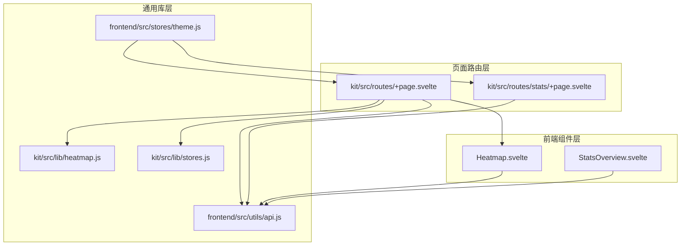
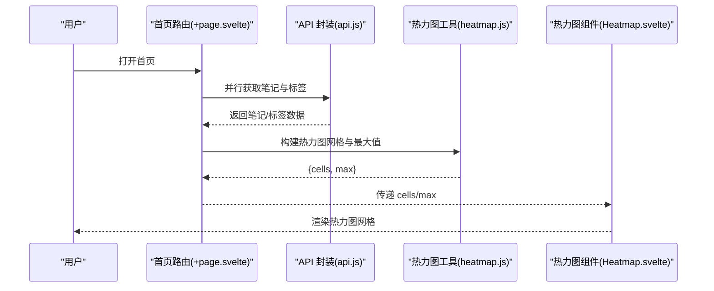
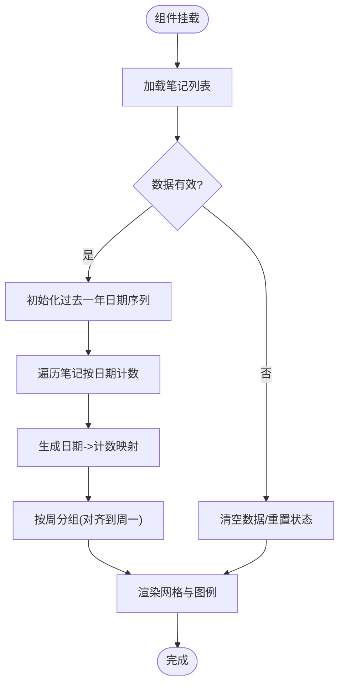
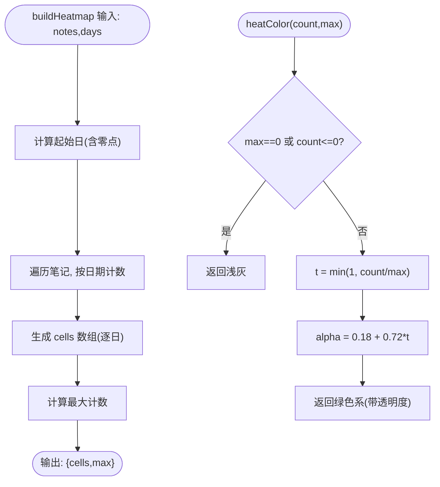
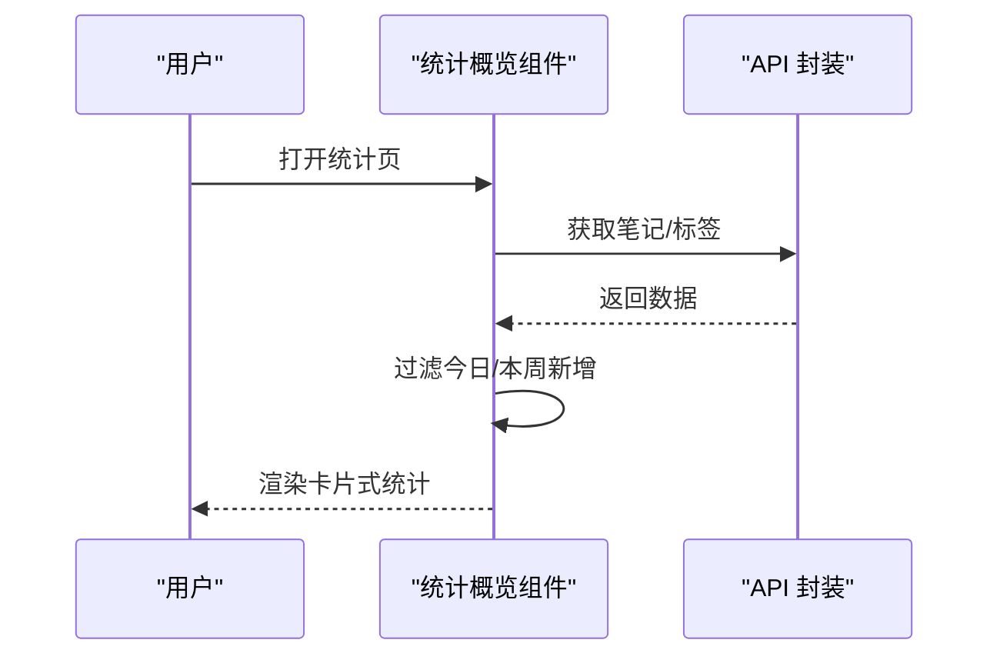
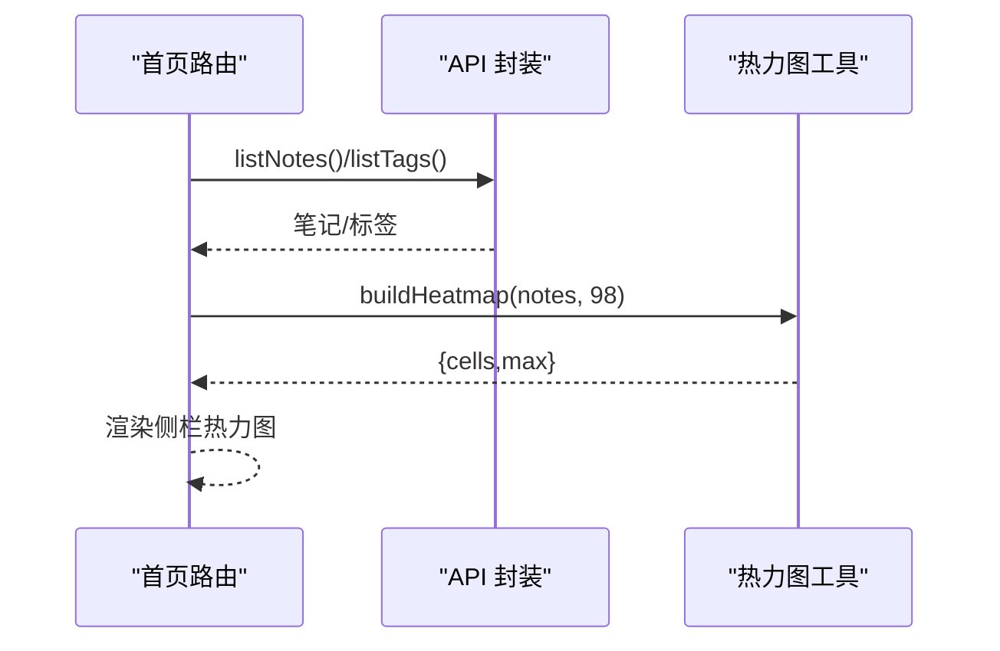
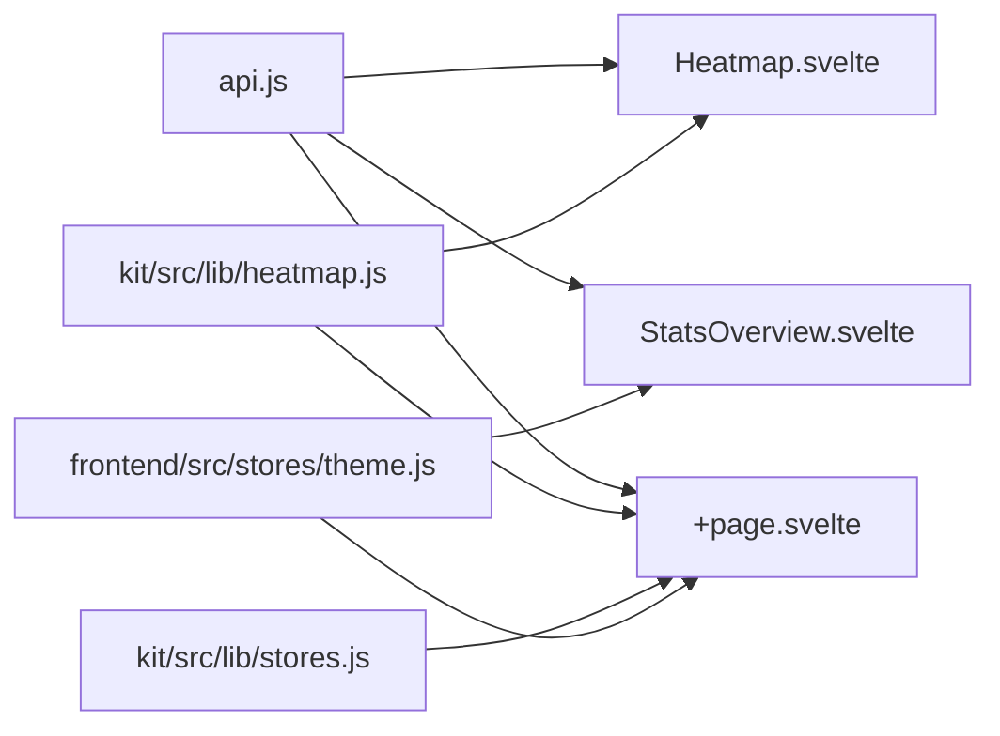

# 数据可视化

<cite>
**本文引用的文件**
- [frontend/src/components/Heatmap.svelte](file://frontend/src/components/Heatmap.svelte)
- [frontend/src/components/StatsOverview.svelte](file://frontend/src/components/StatsOverview.svelte)
- [kit/src/lib/heatmap.js](file://kit/src/lib/heatmap.js)
- [kit/src/routes/+page.svelte](file://kit/src/routes/+page.svelte)
- [kit/src/routes/stats/+page.svelte](file://kit/src/routes/stats/+page.svelte)
- [frontend/src/utils/api.js](file://frontend/src/utils/api.js)
- [frontend/src/stores/theme.js](file://frontend/src/stores/theme.js)
- [kit/src/lib/stores.js](file://kit/src/lib/stores.js)
- [kit/.svelte-kit/output/server/entries/pages/_page.svelte.js](file://kit/.svelte-kit/output/server/entries/pages/_page.svelte.js)
</cite>

## 目录
1. [引言](#引言)
2. [项目结构](#项目结构)
3. [核心组件](#核心组件)
4. [架构总览](#架构总览)
5. [详细组件分析](#详细组件分析)
6. [依赖关系分析](#依赖关系分析)
7. [性能考量](#性能考量)
8. [故障排查指南](#故障排查指南)
9. [结论](#结论)
10. [附录](#附录)

## 引言
本文件面向 Memo Studio 的数据可视化能力，聚焦两类组件：
- 热力图组件：用于展示用户笔记按自然日的创作密度，包含坐标映射、颜色渐变、交互与渲染优化。
- 统计概览组件：用于展示笔记总量、今日新增、本周新增、标签总数等关键指标，包含图表类型选择、数据绑定、响应式布局与主题适配。

文档将从系统架构、数据流、组件通信、状态同步、错误处理、性能优化与定制化方案等方面进行系统性说明，并提供流程与时序图以帮助理解。

## 项目结构
可视化相关代码主要分布在前端与 Kit 两部分：
- 前端组件层：Heatmap.svelte、StatsOverview.svelte 提供基础 UI 与交互。
- 通用库层：kit/src/lib/heatmap.js 提供热力图数据构建与颜色计算；kit/src/lib/stores.js 提供全局状态；frontend/src/utils/api.js 提供统一 API 封装。
- 页面路由层：kit/src/routes/+page.svelte 展示首页侧栏热力图；kit/src/routes/stats/+page.svelte 展示统计页。

**图表来源**
- [kit/src/routes/+page.svelte](file://kit/src/routes/+page.svelte#L1-L120)
- [kit/src/routes/stats/+page.svelte](file://kit/src/routes/stats/+page.svelte#L1-L40)
- [kit/src/lib/heatmap.js](file://kit/src/lib/heatmap.js#L1-L38)
- [kit/src/lib/stores.js](file://kit/src/lib/stores.js#L1-L32)
- [frontend/src/stores/theme.js](file://frontend/src/stores/theme.js#L1-L40)
- [frontend/src/utils/api.js](file://frontend/src/utils/api.js#L1-L60)

**章节来源**
- [kit/src/routes/+page.svelte](file://kit/src/routes/+page.svelte#L1-L120)
- [kit/src/routes/stats/+page.svelte](file://kit/src/routes/stats/+page.svelte#L1-L40)
- [kit/src/lib/heatmap.js](file://kit/src/lib/heatmap.js#L1-L38)
- [frontend/src/utils/api.js](file://frontend/src/utils/api.js#L1-L60)

## 核心组件
- 热力图组件（Heatmap.svelte）：负责加载笔记、生成日期序列与计数映射、按周分组渲染方块并显示图例。
- 通用热力图工具（kit/src/lib/heatmap.js）：提供构建固定天数网格与颜色映射函数，便于服务端/客户端复用。
- 统计概览组件（StatsOverview.svelte）：负责加载笔记与标签，计算今日/本周新增，渲染卡片式统计。
- 主题与状态（frontend/src/stores/theme.js、kit/src/lib/stores.js）：提供主题切换与全局 toast 状态，影响组件外观与交互反馈。
- API 封装（frontend/src/utils/api.js）：统一封装认证、错误处理、内容清洗与各业务接口调用。

**章节来源**
- [frontend/src/components/Heatmap.svelte](file://frontend/src/components/Heatmap.svelte#L1-L155)
- [kit/src/lib/heatmap.js](file://kit/src/lib/heatmap.js#L1-L38)
- [frontend/src/components/StatsOverview.svelte](file://frontend/src/components/StatsOverview.svelte#L1-L134)
- [frontend/src/stores/theme.js](file://frontend/src/stores/theme.js#L1-L40)
- [kit/src/lib/stores.js](file://kit/src/lib/stores.js#L1-L32)
- [frontend/src/utils/api.js](file://frontend/src/utils/api.js#L1-L120)

## 架构总览
整体采用“页面路由 + 组件 + 工具库 + API”的分层架构：
- 页面路由负责聚合数据与状态，驱动组件渲染。
- 组件负责 UI 与交互，必要时调用工具库或 API。
- 工具库提供可复用的算法与状态管理。
- API 封装统一处理认证、拦截与错误。

**图表来源**
- [kit/src/routes/+page.svelte](file://kit/src/routes/+page.svelte#L48-L64)
- [frontend/src/utils/api.js](file://frontend/src/utils/api.js#L115-L163)
- [kit/src/lib/heatmap.js](file://kit/src/lib/heatmap.js#L1-L38)
- [frontend/src/components/Heatmap.svelte](file://frontend/src/components/Heatmap.svelte#L1-L108)

## 详细组件分析

### 热力图组件（Heatmap.svelte）
- 数据准备
  - 加载笔记列表，确保返回为数组；若非数组则警告并清空数据。
  - 生成过去一年的日期序列，初始化计数字典。
  - 遍历笔记，按创建日期归并计数，仅保留有效日期范围内的数据。
- 周分组与渲染
  - 将连续日期对齐到最近的周一，形成若干周，每周 7 天。
  - 每日单元格根据强度映射不同透明度的背景色，今日高亮边框。
- 交互与提示
  - 单元格 title 展示日期与计数；图例标注“较少/较多”。

**图表来源**
- [frontend/src/components/Heatmap.svelte](file://frontend/src/components/Heatmap.svelte#L13-L104)

**章节来源**
- [frontend/src/components/Heatmap.svelte](file://frontend/src/components/Heatmap.svelte#L1-L155)

### 通用热力图工具（kit/src/lib/heatmap.js）
- 构建热力图网格
  - 接收笔记数组与天数参数，默认 90 天。
  - 归一化每个笔记的日期至当日零点，统计每日计数。
  - 生成从起始日到结束日的 cells 数组，填充缺失日期计数为 0。
  - 计算最大值，供颜色映射使用。
- 颜色映射
  - 当 max 为 0 或计数为 0 时返回浅灰；否则按比例计算透明度，使用绿色系渐变。

**图表来源**
- [kit/src/lib/heatmap.js](file://kit/src/lib/heatmap.js#L1-L38)

**章节来源**
- [kit/src/lib/heatmap.js](file://kit/src/lib/heatmap.js#L1-L38)

### 统计概览组件（StatsOverview.svelte）
- 数据加载
  - 并行获取笔记与标签列表，异常时回退为空数组。
  - 计算今日与近一周新增条目数量。
- 渲染
  - 使用卡片网格布局，分别展示“总笔记”“今日新增”“本周新增”“标签总数”，并配合图标与渐变背景。
  - 加载态使用脉冲动画占位。
- 主题适配
  - 通过 CSS 变量与容器类实现明暗主题一致的视觉效果。

**图表来源**
- [frontend/src/components/StatsOverview.svelte](file://frontend/src/components/StatsOverview.svelte#L17-L42)
- [frontend/src/utils/api.js](file://frontend/src/utils/api.js#L232-L240)

**章节来源**
- [frontend/src/components/StatsOverview.svelte](file://frontend/src/components/StatsOverview.svelte#L1-L134)
- [frontend/src/utils/api.js](file://frontend/src/utils/api.js#L232-L240)

### 首页侧栏热力图（kit/src/routes/+page.svelte）
- 数据流
  - onMount 中并行加载笔记与标签，设置基础数据与标签存储。
  - 调用工具函数构建热力图网格与最大值，注入到模板变量 heat。
- 渲染
  - 使用 CSS Grid 固定列数，每个 cell 设置背景色（由 heatColor 计算）。
  - 移动端提供折叠侧栏与标签芯片导航。

**图表来源**
- [kit/src/routes/+page.svelte](file://kit/src/routes/+page.svelte#L48-L64)
- [kit/src/lib/heatmap.js](file://kit/src/lib/heatmap.js#L1-L38)

**章节来源**
- [kit/src/routes/+page.svelte](file://kit/src/routes/+page.svelte#L27-L64)

### 服务端渲染中的热力图（kit/.svelte-kit/output/server/entries/pages/_page.svelte.js）
- 在服务端渲染阶段，直接遍历 heat.cells，为每个单元格设置 title 与背景色，保证首屏快速呈现。
- 该文件展示了热力图在 SSR 场景下的渲染路径，便于理解前后端一致性的实现方式。

**章节来源**
- [kit/.svelte-kit/output/server/entries/pages/_page.svelte.js](file://kit/.svelte-kit/output/server/entries/pages/_page.svelte.js#L113-L129)

## 依赖关系分析
- 组件与工具
  - Heatmap.svelte 依赖 API 封装进行数据拉取；也可结合 kit/src/lib/heatmap.js 进行服务端/共享逻辑。
  - StatsOverview.svelte 依赖 API 封装进行数据拉取。
- 页面与状态
  - 首页路由 +page.svelte 负责聚合数据并驱动热力图渲染；同时维护全局 notes/tags 存储。
- 主题与样式
  - theme.js 通过 DOM 类控制明暗主题；组件通过 CSS 变量与类名适配主题。

**图表来源**
- [frontend/src/utils/api.js](file://frontend/src/utils/api.js#L115-L163)
- [kit/src/lib/heatmap.js](file://kit/src/lib/heatmap.js#L1-L38)
- [kit/src/lib/stores.js](file://kit/src/lib/stores.js#L1-L32)
- [frontend/src/stores/theme.js](file://frontend/src/stores/theme.js#L1-L40)
- [kit/src/routes/+page.svelte](file://kit/src/routes/+page.svelte#L1-L60)

**章节来源**
- [frontend/src/utils/api.js](file://frontend/src/utils/api.js#L115-L163)
- [kit/src/lib/heatmap.js](file://kit/src/lib/heatmap.js#L1-L38)
- [kit/src/lib/stores.js](file://kit/src/lib/stores.js#L1-L32)
- [frontend/src/stores/theme.js](file://frontend/src/stores/theme.js#L1-L40)
- [kit/src/routes/+page.svelte](file://kit/src/routes/+page.svelte#L1-L60)

## 性能考量
- 数据预处理
  - 热力图工具对日期进行归一化与零点对齐，减少渲染时的日期解析成本。
  - 仅在必要范围内生成 cells，避免超大数组。
- 渲染优化
  - 首页侧栏热力图使用 CSS Grid 固定列数，避免动态列宽计算。
  - 单元格采用背景色而非复杂元素，降低 DOM 体积。
- 交互与状态
  - 组件内使用响应式语句计算周分组与最大值，避免重复计算。
  - 首屏 SSR 直接输出热力图 HTML，减少客户端计算与闪烁。
- 错误与降级
  - API 封装统一处理 401/404/429 等错误，组件捕获异常并降级为空数据，保证稳定性。

**章节来源**
- [kit/src/lib/heatmap.js](file://kit/src/lib/heatmap.js#L1-L38)
- [frontend/src/components/Heatmap.svelte](file://frontend/src/components/Heatmap.svelte#L1-L155)
- [kit/src/routes/+page.svelte](file://kit/src/routes/+page.svelte#L665-L719)
- [frontend/src/utils/api.js](file://frontend/src/utils/api.js#L34-L50)

## 故障排查指南
- 热力图不显示或颜色异常
  - 检查笔记数据是否为数组；若非数组，组件会清空数据并重置。
  - 确认日期字段格式正确且在一年范围内。
  - 若 max 为 0，颜色将显示为浅灰，属预期行为。
- 统计概览空白或报错
  - 确认网络请求成功；组件对 API 异常进行捕获并降级为空数据。
  - 若出现 401，路由会跳转登录页。
- 主题切换无效
  - 检查 theme.js 是否正确写入/读取 localStorage，并应用了 dark 类。
- SSR 渲染差异
  - 确认服务端渲染输出的热力图 HTML 与客户端一致，避免 hydration 不匹配。

**章节来源**
- [frontend/src/components/Heatmap.svelte](file://frontend/src/components/Heatmap.svelte#L13-L27)
- [frontend/src/components/StatsOverview.svelte](file://frontend/src/components/StatsOverview.svelte#L17-L42)
- [frontend/src/stores/theme.js](file://frontend/src/stores/theme.js#L1-L40)
- [kit/.svelte-kit/output/server/entries/pages/_page.svelte.js](file://kit/.svelte-kit/output/server/entries/pages/_page.svelte.js#L113-L129)

## 结论
Memo Studio 的可视化组件围绕“简单、稳定、可扩展”设计：
- 热力图通过工具函数与组件协作，实现跨端一致性与良好性能。
- 统计概览以卡片形式直观呈现关键指标，具备响应式与主题适配能力。
- 通过统一 API 封装与状态管理，组件间耦合低、职责清晰，便于后续扩展图表类型与交互。

## 附录

### 使用示例与定制化方案
- 自定义热力图维度
  - 修改天数参数以调整展示周期；在工具函数中传入不同 days 值。
  - 自定义颜色映射：替换 heatColor 的透明度与色相策略。
- 统计概览扩展
  - 新增指标：在组件中添加新的过滤/计算逻辑，并增加对应卡片。
  - 图表类型：如需柱状/折线图，可在现有数据基础上引入可视化库，保持数据绑定与主题适配。
- 交互增强
  - 为热力图单元格添加点击/悬停事件，联动详情面板或筛选器。
  - 为统计卡片添加跳转或导出功能。

**章节来源**
- [kit/src/lib/heatmap.js](file://kit/src/lib/heatmap.js#L1-L38)
- [frontend/src/components/StatsOverview.svelte](file://frontend/src/components/StatsOverview.svelte#L45-L122)