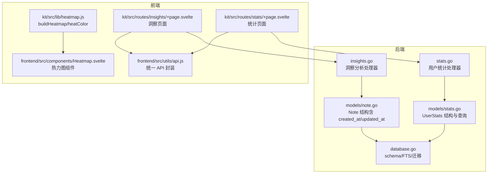
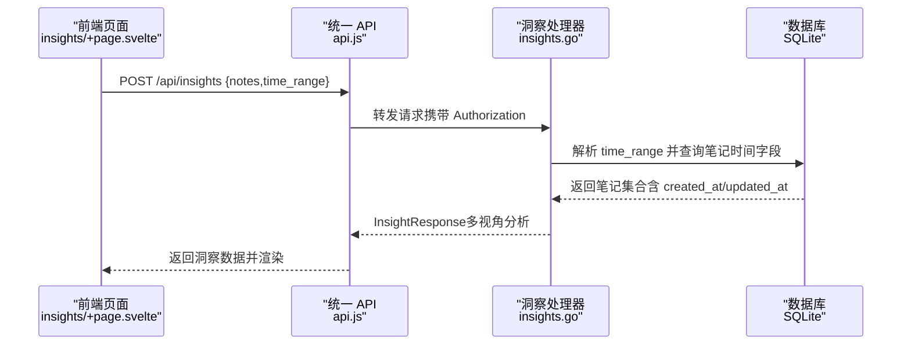
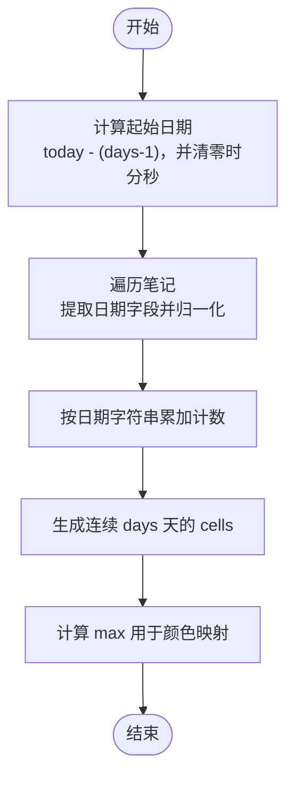
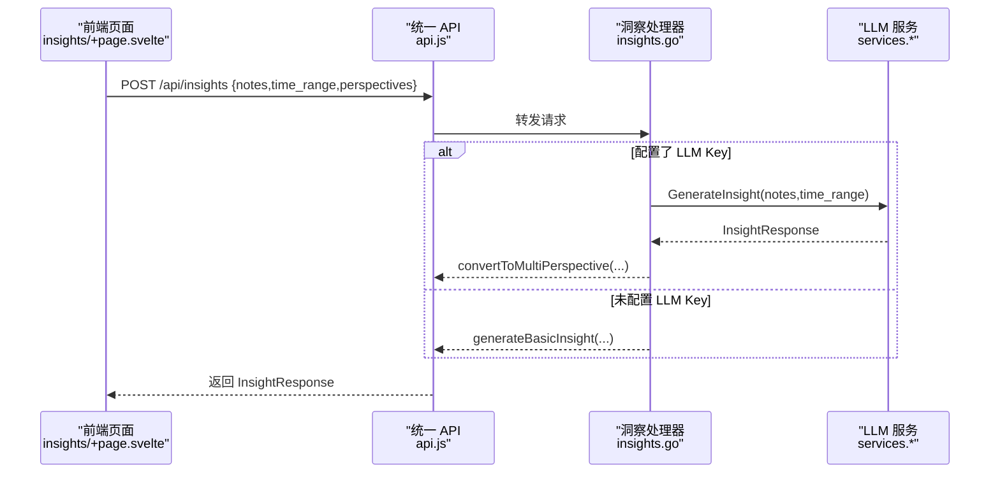
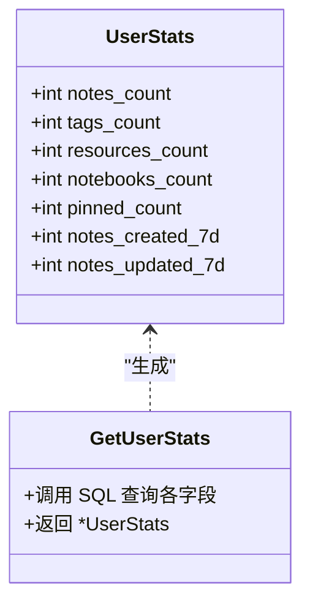
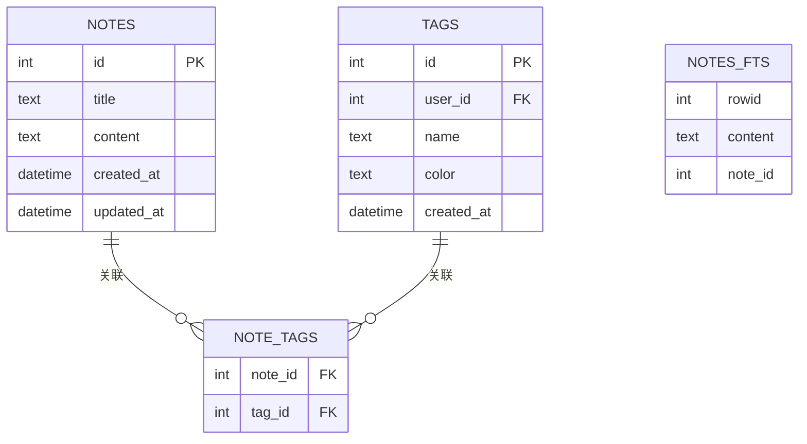
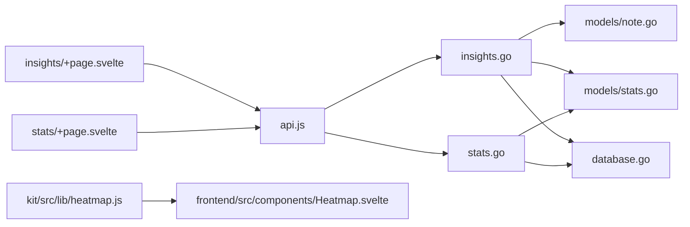

# 时间分析

<cite>
**本文引用的文件**
- [backend/handlers/insights.go](file://backend/handlers/insights.go)
- [backend/handlers/stats.go](file://backend/handlers/stats.go)
- [backend/models/stats.go](file://backend/models/stats.go)
- [backend/models/note.go](file://backend/models/note.go)
- [backend/database/database.go](file://backend/database/database.go)
- [kit/src/lib/heatmap.js](file://kit/src/lib/heatmap.js)
- [frontend/src/components/Heatmap.svelte](file://frontend/src/components/Heatmap.svelte)
- [kit/src/routes/insights/+page.svelte](file://kit/src/routes/insights/+page.svelte)
- [kit/src/routes/stats/+page.svelte](file://kit/src/routes/stats/+page.svelte)
- [frontend/src/utils/api.js](file://frontend/src/utils/api.js)
</cite>

## 目录
1. [简介](#简介)
2. [项目结构](#项目结构)
3. [核心组件](#核心组件)
4. [架构总览](#架构总览)
5. [详细组件分析](#详细组件分析)
6. [依赖关系分析](#依赖关系分析)
7. [性能考量](#性能考量)
8. [故障排查指南](#故障排查指南)
9. [结论](#结论)
10. [附录](#附录)

## 简介
本文件面向 Memo Studio 的“时间分析”能力，系统化梳理从数据采集、时间窗口划分、统计聚合、趋势与模式识别到前端可视化的全流程实现。重点覆盖以下方面：
- 时间分布统计：按日/周/月/年维度对笔记创建进行聚合与热力图展示
- 周期性与季节性模式：通过时间窗口聚合与对比分析识别周期性与趋势
- 数据结构与增量更新：笔记时间字段、SQLite 存储、前端热力图构建
- API 接口规范与前端集成：洞察分析与统计接口、前端可视化组件
- 时间偏移与时区处理：前端日期对齐与服务端时间范围查询

## 项目结构
围绕时间分析的关键模块与文件如下：
- 后端处理器与模型
  - 洞察分析处理器：负责多视角分析与时间范围参数解析
  - 用户统计处理器与模型：提供近 7 日创建/更新计数
  - 笔记模型：提供创建/更新时间字段
  - 数据库迁移：确保时间相关列与全文检索一致
- 前端可视化与交互
  - 热力图工具函数：构建日粒度时间序列与强度映射
  - Heatmap 组件：按自然周对齐、渲染格子与强度
  - Insights 页面：调用洞察 API 并展示多视角分析
  - Stats 页面：展示基础统计（含近 7 日创建/更新）

图表来源
- [backend/handlers/insights.go](file://backend/handlers/insights.go#L1-L120)
- [backend/handlers/stats.go](file://backend/handlers/stats.go#L1-L24)
- [backend/models/stats.go](file://backend/models/stats.go#L1-L66)
- [backend/models/note.go](file://backend/models/note.go#L11-L27)
- [backend/database/database.go](file://backend/database/database.go#L243-L374)
- [kit/src/lib/heatmap.js](file://kit/src/lib/heatmap.js#L1-L38)
- [frontend/src/components/Heatmap.svelte](file://frontend/src/components/Heatmap.svelte#L53-L108)
- [kit/src/routes/insights/+page.svelte](file://kit/src/routes/insights/+page.svelte#L1-L120)
- [kit/src/routes/stats/+page.svelte](file://kit/src/routes/stats/+page.svelte#L1-L79)
- [frontend/src/utils/api.js](file://frontend/src/utils/api.js#L1-L316)

章节来源
- [backend/handlers/insights.go](file://backend/handlers/insights.go#L1-L120)
- [backend/handlers/stats.go](file://backend/handlers/stats.go#L1-L24)
- [backend/models/stats.go](file://backend/models/stats.go#L1-L66)
- [backend/models/note.go](file://backend/models/note.go#L11-L27)
- [backend/database/database.go](file://backend/database/database.go#L243-L374)
- [kit/src/lib/heatmap.js](file://kit/src/lib/heatmap.js#L1-L38)
- [frontend/src/components/Heatmap.svelte](file://frontend/src/components/Heatmap.svelte#L53-L108)
- [kit/src/routes/insights/+page.svelte](file://kit/src/routes/insights/+page.svelte#L1-L120)
- [kit/src/routes/stats/+page.svelte](file://kit/src/routes/stats/+page.svelte#L1-L79)
- [frontend/src/utils/api.js](file://frontend/src/utils/api.js#L1-L316)

## 核心组件
- 时间分布统计与热力图
  - 前端热力图工具：按自然日聚合笔记数量，输出 cells 与 max，用于颜色映射
  - Heatmap 组件：将一年内的自然周对齐，渲染格子并标注今日
- 洞察分析中的时间视角
  - 支持 time_range 参数（7d/30d/90d/all），格式化显示文本
  - 提供多视角分析入口（overview/topic/sentiment/action/time/frequency/all）
- 用户统计中的近 7 日指标
  - 近 7 日新建/更新计数由 SQL 查询提供
- 数据模型与存储
  - Note 结构包含 created_at/updated_at
  - SQLite schema 与 FTS5 触发器保证内容与时间字段一致性

章节来源
- [kit/src/lib/heatmap.js](file://kit/src/lib/heatmap.js#L1-L38)
- [frontend/src/components/Heatmap.svelte](file://frontend/src/components/Heatmap.svelte#L53-L108)
- [backend/handlers/insights.go](file://backend/handlers/insights.go#L16-L32)
- [backend/handlers/insights.go](file://backend/handlers/insights.go#L362-L373)
- [backend/handlers/stats.go](file://backend/handlers/stats.go#L11-L23)
- [backend/models/stats.go](file://backend/models/stats.go#L18-L65)
- [backend/models/note.go](file://backend/models/note.go#L11-L27)
- [backend/database/database.go](file://backend/database/database.go#L243-L374)

## 架构总览
后端通过处理器接收请求，结合模型层查询数据库，返回结构化洞察或统计；前端页面通过统一 API 封装发起请求，渲染洞察与统计视图。

图表来源
- [kit/src/routes/insights/+page.svelte](file://kit/src/routes/insights/+page.svelte#L33-L58)
- [frontend/src/utils/api.js](file://frontend/src/utils/api.js#L53-L76)
- [backend/handlers/insights.go](file://backend/handlers/insights.go#L68-L119)
- [backend/models/note.go](file://backend/models/note.go#L11-L27)

## 详细组件分析

### 时间分布统计与热力图（前端）
- 算法流程
  - 以当前日期为基准，向前推 days-1 天，构造起始日期并清零时分秒
  - 遍历笔记数组，取 created_at 或 createdAt/updated_at 或 updatedAt，统一归一到日期字符串（YYYY-MM-DD）
  - 使用 Map 统计每个日期的出现次数
  - 生成连续 days 天的 cells 数组，填充对应日期计数；计算 max 用于颜色映射
- 可视化策略
  - Heatmap 组件将一年内日期对齐到自然周，逐周渲染格子
  - 根据 max 计算强度，映射到不同饱和度的颜色

图表来源
- [kit/src/lib/heatmap.js](file://kit/src/lib/heatmap.js#L1-L28)
- [frontend/src/components/Heatmap.svelte](file://frontend/src/components/Heatmap.svelte#L53-L108)

章节来源
- [kit/src/lib/heatmap.js](file://kit/src/lib/heatmap.js#L1-L38)
- [frontend/src/components/Heatmap.svelte](file://frontend/src/components/Heatmap.svelte#L53-L108)

### 洞察分析中的时间视角（后端）
- 请求与响应
  - 支持多视角：overview/topic/sentiment/action/time/frequency/all
  - time_range 支持 7d/30d/90d，默认 30d；格式化为中文显示文本
- 处理流程
  - 若配置了 LLM API Key，则优先调用 LLM 生成洞察；失败回退基础分析
  - 基础分析根据 notes 文本生成概览、主题、情感、行动等视角
  - 返回包含 summary、perspectives、highlights、action_items 与 update_time

图表来源
- [kit/src/routes/insights/+page.svelte](file://kit/src/routes/insights/+page.svelte#L33-L58)
- [frontend/src/utils/api.js](file://frontend/src/utils/api.js#L53-L76)
- [backend/handlers/insights.go](file://backend/handlers/insights.go#L68-L119)
- [backend/handlers/insights.go](file://backend/handlers/insights.go#L274-L295)
- [backend/handlers/insights.go](file://backend/handlers/insights.go#L297-L314)

章节来源
- [backend/handlers/insights.go](file://backend/handlers/insights.go#L16-L32)
- [backend/handlers/insights.go](file://backend/handlers/insights.go#L362-L373)
- [backend/handlers/insights.go](file://backend/handlers/insights.go#L274-L295)
- [backend/handlers/insights.go](file://backend/handlers/insights.go#L297-L314)
- [kit/src/routes/insights/+page.svelte](file://kit/src/routes/insights/+page.svelte#L14-L19)
- [kit/src/routes/insights/+page.svelte](file://kit/src/routes/insights/+page.svelte#L33-L58)
- [frontend/src/utils/api.js](file://frontend/src/utils/api.js#L53-L76)

### 用户统计中的近 7 日指标（后端）
- 查询逻辑
  - 统计 NotesCount、TagsCount、ResourcesCount、NotebooksCount、PinnedCount
  - NotesCreated7d 与 NotesUpdated7d 使用 created_at/updated_at 与 '-7 days' 条件过滤
- 响应结构
  - UserStats 结构体包含上述字段，便于前端直接渲染

图表来源
- [backend/models/stats.go](file://backend/models/stats.go#L7-L16)
- [backend/models/stats.go](file://backend/models/stats.go#L18-L65)
- [backend/handlers/stats.go](file://backend/handlers/stats.go#L11-L23)

章节来源
- [backend/models/stats.go](file://backend/models/stats.go#L7-L16)
- [backend/models/stats.go](file://backend/models/stats.go#L18-L65)
- [backend/handlers/stats.go](file://backend/handlers/stats.go#L11-L23)
- [kit/src/routes/stats/+page.svelte](file://kit/src/routes/stats/+page.svelte#L44-L74)

### 数据模型与存储（后端）
- Note 结构
  - 包含 created_at 与 updated_at，用于时间分析与排序
- SQLite Schema 与 FTS5
  - notes 表包含 created_at/updated_at
  - notes_fts 虚表与触发器保证全文检索与内容同步
  - 迁移脚本确保列存在与版本升级

图表来源
- [backend/models/note.go](file://backend/models/note.go#L11-L27)
- [backend/database/database.go](file://backend/database/database.go#L243-L374)

章节来源
- [backend/models/note.go](file://backend/models/note.go#L11-L27)
- [backend/database/database.go](file://backend/database/database.go#L243-L374)

### 前端可视化与交互
- 统一 API 封装
  - 自动注入 Authorization 头
  - 统一错误处理与拦截器机制
- Insights 页面
  - 支持 time_range 切换（7d/30d/90d/all）
  - 调用 /api/insights 获取多视角洞察并渲染
- Stats 页面
  - 展示基础统计卡片（含近 7 日新建/更新）

章节来源
- [frontend/src/utils/api.js](file://frontend/src/utils/api.js#L53-L76)
- [frontend/src/utils/api.js](file://frontend/src/utils/api.js#L115-L163)
- [kit/src/routes/insights/+page.svelte](file://kit/src/routes/insights/+page.svelte#L14-L19)
- [kit/src/routes/insights/+page.svelte](file://kit/src/routes/insights/+page.svelte#L33-L58)
- [kit/src/routes/stats/+page.svelte](file://kit/src/routes/stats/+page.svelte#L44-L74)

## 依赖关系分析
- 处理器依赖模型与数据库
  - insights.go 依赖 Note 结构与时间字段
  - stats.go 依赖 UserStats 查询
- 前端依赖后端接口
  - insights/+page.svelte 依赖 /api/insights
  - stats/+page.svelte 依赖 /api/stats
- 可视化依赖工具函数
  - heatmap.js 提供热力图构建与颜色映射
  - Heatmap.svelte 将数据对齐到自然周并渲染

图表来源
- [backend/handlers/insights.go](file://backend/handlers/insights.go#L1-L120)
- [backend/handlers/stats.go](file://backend/handlers/stats.go#L1-L24)
- [backend/models/note.go](file://backend/models/note.go#L11-L27)
- [backend/models/stats.go](file://backend/models/stats.go#L1-L66)
- [backend/database/database.go](file://backend/database/database.go#L243-L374)
- [kit/src/lib/heatmap.js](file://kit/src/lib/heatmap.js#L1-L38)
- [frontend/src/components/Heatmap.svelte](file://frontend/src/components/Heatmap.svelte#L53-L108)
- [kit/src/routes/insights/+page.svelte](file://kit/src/routes/insights/+page.svelte#L33-L58)
- [kit/src/routes/stats/+page.svelte](file://kit/src/routes/stats/+page.svelte#L10-L23)
- [frontend/src/utils/api.js](file://frontend/src/utils/api.js#L53-L76)

章节来源
- [backend/handlers/insights.go](file://backend/handlers/insights.go#L1-L120)
- [backend/handlers/stats.go](file://backend/handlers/stats.go#L1-L24)
- [backend/models/note.go](file://backend/models/note.go#L11-L27)
- [backend/models/stats.go](file://backend/models/stats.go#L1-L66)
- [backend/database/database.go](file://backend/database/database.go#L243-L374)
- [kit/src/lib/heatmap.js](file://kit/src/lib/heatmap.js#L1-L38)
- [frontend/src/components/Heatmap.svelte](file://frontend/src/components/Heatmap.svelte#L53-L108)
- [kit/src/routes/insights/+page.svelte](file://kit/src/routes/insights/+page.svelte#L33-L58)
- [kit/src/routes/stats/+page.svelte](file://kit/src/routes/stats/+page.svelte#L10-L23)
- [frontend/src/utils/api.js](file://frontend/src/utils/api.js#L53-L76)

## 性能考量
- 前端热力图
  - 时间复杂度 O(N)（N 为笔记数量），空间复杂度 O(D)（D 为天数窗口）
  - 建议限制 days 参数与批量数据长度，避免超大窗口导致内存与渲染压力
- 后端查询
  - 近 7 日统计使用 SQL 日期函数过滤，建议在 created_at/updated_at 上建立索引（若未建立，SQLite 会进行全表扫描）
  - 洞察分析中的文本处理为 O(N·K)（N 为笔记数，K 为主题/情感关键词集），建议缓存热点关键词与预处理
- I/O 与网络
  - 统一 API 封装集中处理鉴权与错误，减少重复逻辑
  - 前端分页与懒加载可降低一次性渲染压力

## 故障排查指南
- 401 未授权
  - 检查本地 token 是否存在与有效；统一 API 会在 401 时清除 token 并触发重新登录
- 404 资源不存在
  - 确认请求路径与资源 ID 正确；检查后端路由与数据库记录
- 429 请求过于频繁
  - 降低请求频率或增加节流；检查前端重试策略
- 洞察分析为空
  - 确认 time_range 参数合法（7d/30d/90d/all）
  - 若未配置 LLM Key，将回退基础分析；检查环境变量
- 热力图无数据
  - 确认笔记 created_at/updated_at 字段存在且格式正确
  - 检查 days 参数与日期对齐逻辑（自然周起始）

章节来源
- [frontend/src/utils/api.js](file://frontend/src/utils/api.js#L34-L50)
- [frontend/src/utils/api.js](file://frontend/src/utils/api.js#L117-L129)
- [backend/handlers/insights.go](file://backend/handlers/insights.go#L362-L373)
- [kit/src/lib/heatmap.js](file://kit/src/lib/heatmap.js#L1-L38)
- [frontend/src/components/Heatmap.svelte](file://frontend/src/components/Heatmap.svelte#L53-L108)

## 结论
Memo Studio 的时间分析以“前端热力图 + 后端洞察与统计”为核心，形成从数据采集、时间窗口划分、聚合统计到可视化呈现的闭环。当前实现具备良好的扩展性：可在现有处理器与工具函数基础上引入更复杂的周期性与季节性分析算法，并通过数据库索引与缓存进一步提升性能。

## 附录

### API 接口规范（时间分析相关）
- 获取洞察（多视角）
  - 方法与路径：POST /api/insights
  - 请求体字段
    - notes: 字符串数组（笔记内容）
    - time_range: 字符串（7d/30d/90d/all）
    - perspectives: 字符串数组（可选，如 ["all"]）
  - 响应字段
    - summary: 总结文本
    - perspectives: 多视角数组（包含 type/name/summary/details/highlights/score）
    - highlights: 高亮提示
    - action_items: 行动项
    - update_time: 更新时间
- 获取特定视角洞察
  - 方法与路径：POST /api/insights/:type
  - 路径参数：type ∈ {overview,topic,sentiment,action,time,frequency,all}
  - 请求体字段：notes、time_range
- 对比分析
  - 方法与路径：POST /api/insights/compare
  - 请求体字段：notes1、notes2
- 获取用户统计
  - 方法与路径：GET /api/stats
  - 响应字段：notes_count、tags_count、resources_count、notebooks_count、pinned_count、notes_created_7d、notes_updated_7d

章节来源
- [backend/handlers/insights.go](file://backend/handlers/insights.go#L68-L119)
- [backend/handlers/insights.go](file://backend/handlers/insights.go#L121-L142)
- [backend/handlers/insights.go](file://backend/handlers/insights.go#L144-L165)
- [backend/handlers/stats.go](file://backend/handlers/stats.go#L11-L23)

### 前端可视化方案
- 热力图
  - 工具函数：buildHeatmap(notes, days=90) → { cells, max }
  - 颜色映射：heatColor(count, max)
  - 组件：Heatmap.svelte 将一年内日期对齐到自然周并渲染
- 洞察页面
  - 支持 time_range 切换，调用 /api/insights 获取并渲染多视角洞察
- 统计页面
  - 展示基础统计卡片，包含近 7 日新建/更新

章节来源
- [kit/src/lib/heatmap.js](file://kit/src/lib/heatmap.js#L1-L38)
- [frontend/src/components/Heatmap.svelte](file://frontend/src/components/Heatmap.svelte#L53-L108)
- [kit/src/routes/insights/+page.svelte](file://kit/src/routes/insights/+page.svelte#L14-L19)
- [kit/src/routes/insights/+page.svelte](file://kit/src/routes/insights/+page.svelte#L33-L58)
- [kit/src/routes/stats/+page.svelte](file://kit/src/routes/stats/+page.svelte#L44-L74)

### 时间偏移与时间窗口策略
- 时间窗口
  - 日：按日期字符串（YYYY-MM-DD）聚合
  - 周：前端将日期对齐到自然周（周一为起点）
  - 月/年：可通过调整 days 参数与聚合逻辑扩展
- 时间偏移与时区
  - 前端在构建 cells 时将日期清零至当日 00:00:00，避免跨时区差异导致的日期漂移
  - 服务端查询使用 SQL 日期函数与相对时间（'-7 days'），不涉及显式时区转换

章节来源
- [kit/src/lib/heatmap.js](file://kit/src/lib/heatmap.js#L1-L28)
- [frontend/src/components/Heatmap.svelte](file://frontend/src/components/Heatmap.svelte#L68-L104)
- [backend/models/stats.go](file://backend/models/stats.go#L52-L60)