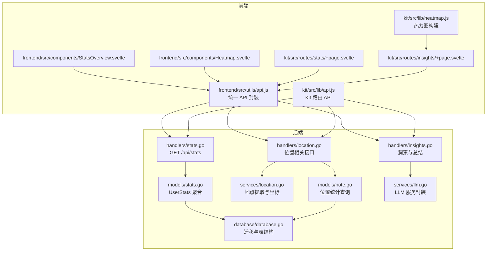
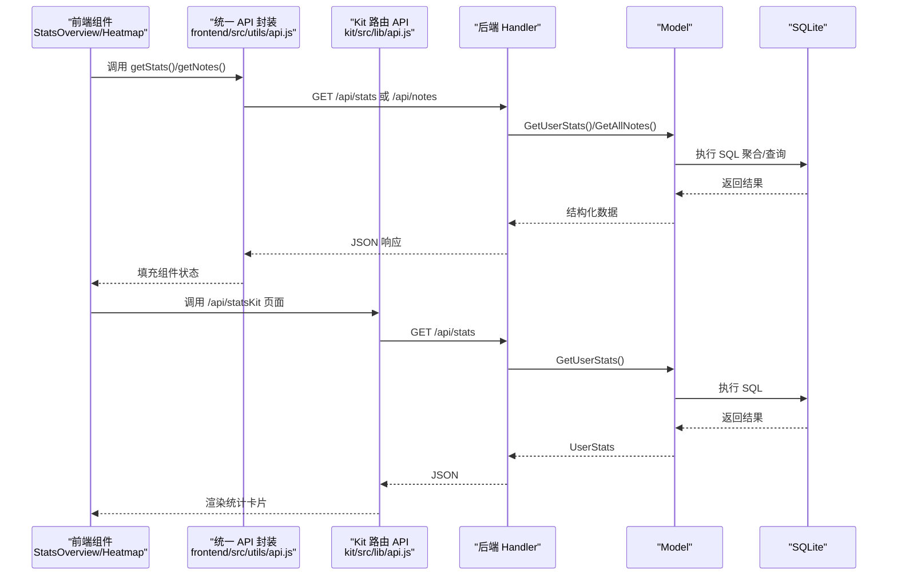
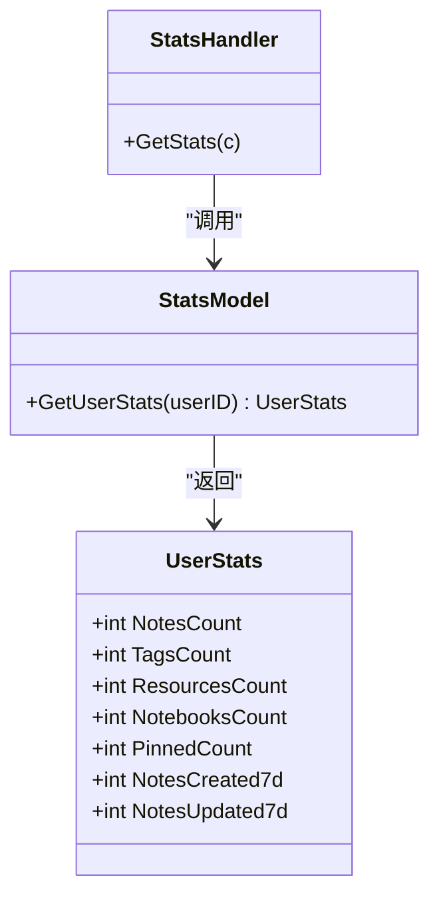
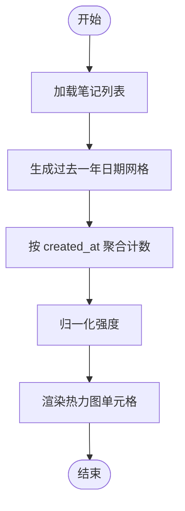
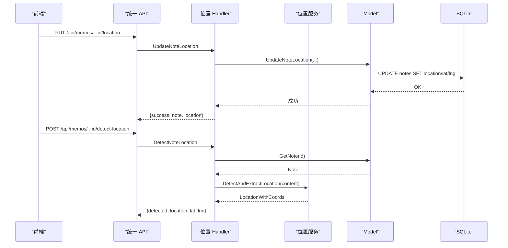
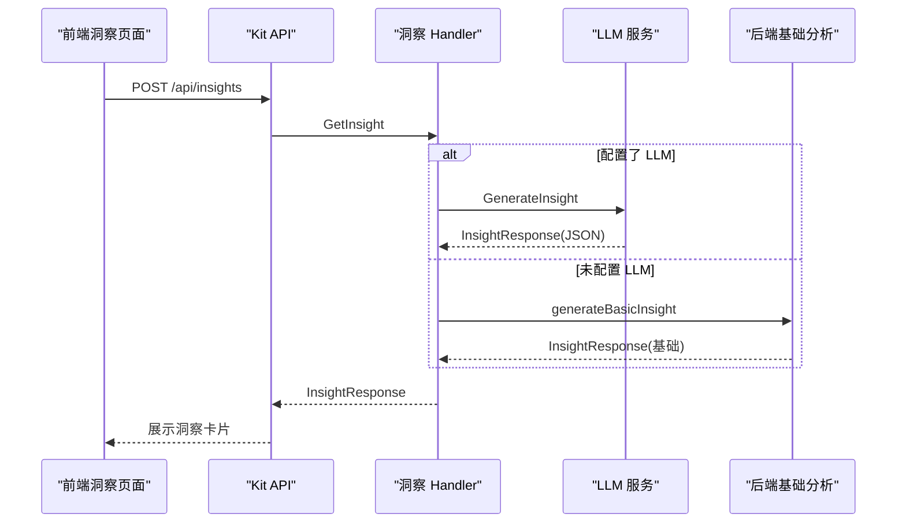
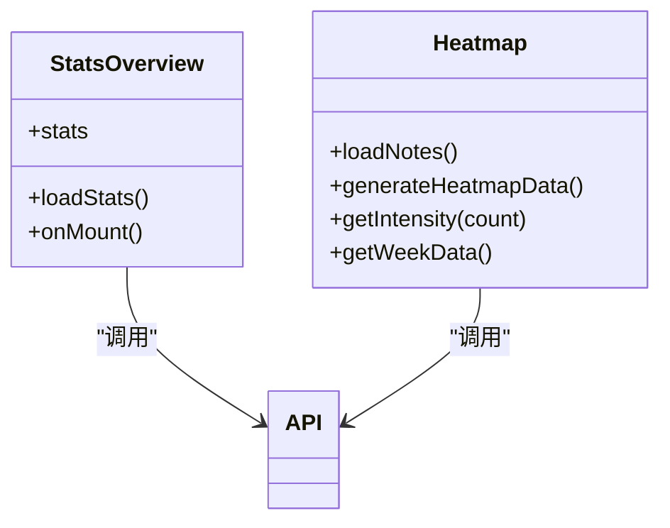
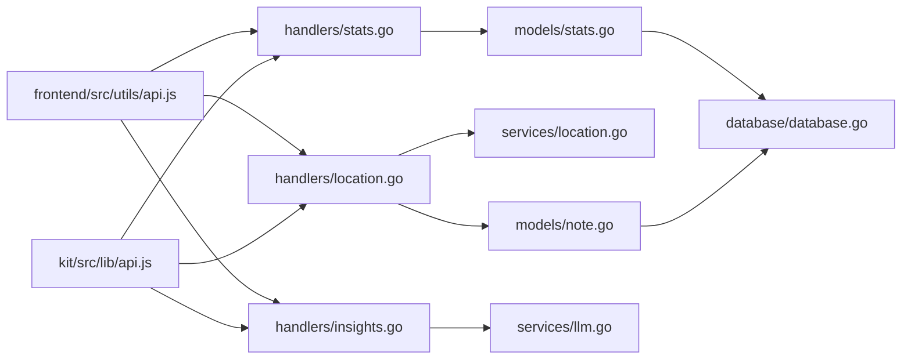

# 统计与分析

<cite>
**本文引用的文件**
- [backend/handlers/stats.go](file://backend/handlers/stats.go)
- [backend/models/stats.go](file://backend/models/stats.go)
- [backend/handlers/location.go](file://backend/handlers/location.go)
- [backend/services/location.go](file://backend/services/location.go)
- [backend/models/note.go](file://backend/models/note.go)
- [backend/database/database.go](file://backend/database/database.go)
- [backend/handlers/insights.go](file://backend/handlers/insights.go)
- [backend/services/llm.go](file://backend/services/llm.go)
- [frontend/src/components/StatsOverview.svelte](file://frontend/src/components/StatsOverview.svelte)
- [frontend/src/components/Heatmap.svelte](file://frontend/src/components/Heatmap.svelte)
- [kit/src/routes/stats/+page.svelte](file://kit/src/routes/stats/+page.svelte)
- [kit/src/routes/insights/+page.svelte](file://kit/src/routes/insights/+page.svelte)
- [frontend/src/utils/api.js](file://frontend/src/utils/api.js)
- [kit/src/lib/api.js](file://kit/src/lib/api.js)
- [kit/src/lib/heatmap.js](file://kit/src/lib/heatmap.js)
</cite>

## 目录
1. [简介](#简介)
2. [项目结构](#项目结构)
3. [核心组件](#核心组件)
4. [架构总览](#架构总览)
5. [详细组件分析](#详细组件分析)
6. [依赖关系分析](#依赖关系分析)
7. [性能考量](#性能考量)
8. [故障排查指南](#故障排查指南)
9. [结论](#结论)
10. [附录](#附录)

## 简介
本文件面向 Memo Studio 的统计与分析系统，系统性梳理统计与分析能力的实现，包括：
- 笔记统计与概览：创建数量、活跃度、近七日新增等
- 时间分析：笔记热力图、时间分布、周期性与趋势识别
- 位置统计：地理数据采集、坐标解析、位置统计与筛选
- 数据可视化：热力图组件与统计概览组件
- 统计计算与优化：SQL 聚合、缓存与性能调优
- API 与前端展示：接口定义与前端组件联动
- 隐私与脱敏：认证授权、敏感信息处理与安全实践

## 项目结构
统计与分析涉及后端 Handler/Model、服务层、数据库迁移、以及前端 Svelte 组件与 Kit 路由页面。

图表来源
- [backend/handlers/stats.go](file://backend/handlers/stats.go#L11-L23)
- [backend/models/stats.go](file://backend/models/stats.go#L18-L65)
- [backend/handlers/location.go](file://backend/handlers/location.go#L13-L167)
- [backend/services/location.go](file://backend/services/location.go#L65-L221)
- [backend/models/note.go](file://backend/models/note.go#L818-L845)
- [backend/database/database.go](file://backend/database/database.go#L211-L241)
- [backend/handlers/insights.go](file://backend/handlers/insights.go#L68-L119)
- [backend/services/llm.go](file://backend/services/llm.go#L377-L591)
- [frontend/src/utils/api.js](file://frontend/src/utils/api.js#L115-L310)
- [frontend/src/components/StatsOverview.svelte](file://frontend/src/components/StatsOverview.svelte#L1-L134)
- [frontend/src/components/Heatmap.svelte](file://frontend/src/components/Heatmap.svelte#L1-L155)
- [kit/src/routes/stats/+page.svelte](file://kit/src/routes/stats/+page.svelte#L1-L79)
- [kit/src/routes/insights/+page.svelte](file://kit/src/routes/insights/+page.svelte#L1-L140)
- [kit/src/lib/api.js](file://kit/src/lib/api.js#L35-L270)
- [kit/src/lib/heatmap.js](file://kit/src/lib/heatmap.js#L1-L38)

章节来源
- [backend/handlers/stats.go](file://backend/handlers/stats.go#L11-L23)
- [backend/models/stats.go](file://backend/models/stats.go#L18-L65)
- [backend/handlers/location.go](file://backend/handlers/location.go#L13-L167)
- [backend/services/location.go](file://backend/services/location.go#L65-L221)
- [backend/models/note.go](file://backend/models/note.go#L818-L845)
- [backend/database/database.go](file://backend/database/database.go#L211-L241)
- [backend/handlers/insights.go](file://backend/handlers/insights.go#L68-L119)
- [backend/services/llm.go](file://backend/services/llm.go#L377-L591)
- [frontend/src/utils/api.js](file://frontend/src/utils/api.js#L115-L310)
- [frontend/src/components/StatsOverview.svelte](file://frontend/src/components/StatsOverview.svelte#L1-L134)
- [frontend/src/components/Heatmap.svelte](file://frontend/src/components/Heatmap.svelte#L1-L155)
- [kit/src/routes/stats/+page.svelte](file://kit/src/routes/stats/+page.svelte#L1-L79)
- [kit/src/routes/insights/+page.svelte](file://kit/src/routes/insights/+page.svelte#L1-L140)
- [kit/src/lib/api.js](file://kit/src/lib/api.js#L35-L270)
- [kit/src/lib/heatmap.js](file://kit/src/lib/heatmap.js#L1-L38)

## 核心组件
- 用户统计聚合：后端 Handler 调用 Model，聚合笔记、标签、资源、笔记本、置顶与近七日新增等指标。
- 位置统计与提取：Handler 提供位置更新、检测、批量检测与位置筛选；服务层负责地点提取与坐标映射；Model 提供位置统计查询。
- 时间分析与热力图：前端组件按年维度生成热力图，后端提供基础统计接口；Kit 路由页面集成洞察与总结。
- 洞察与总结：后端提供多视角洞察与总结接口，支持云端/本地 LLM，降级为基础分析。
- API 与前端：统一 API 封装与拦截器，Kit 路由 API 适配后端接口。

章节来源
- [backend/handlers/stats.go](file://backend/handlers/stats.go#L11-L23)
- [backend/models/stats.go](file://backend/models/stats.go#L18-L65)
- [backend/handlers/location.go](file://backend/handlers/location.go#L13-L167)
- [backend/services/location.go](file://backend/services/location.go#L65-L221)
- [backend/models/note.go](file://backend/models/note.go#L818-L845)
- [backend/handlers/insights.go](file://backend/handlers/insights.go#L68-L119)
- [backend/services/llm.go](file://backend/services/llm.go#L377-L591)
- [frontend/src/utils/api.js](file://frontend/src/utils/api.js#L115-L310)
- [kit/src/lib/api.js](file://kit/src/lib/api.js#L35-L270)

## 架构总览
后端采用 Gin 路由分发，Handler 调用 Model，Model 通过数据库连接执行 SQL；服务层封装第三方能力（如 LLM）。前端通过统一 API 封装发起请求，Kit 路由页面负责业务页面与组件组合。

图表来源
- [frontend/src/utils/api.js](file://frontend/src/utils/api.js#L115-L310)
- [kit/src/lib/api.js](file://kit/src/lib/api.js#L35-L270)
- [backend/handlers/stats.go](file://backend/handlers/stats.go#L11-L23)
- [backend/models/stats.go](file://backend/models/stats.go#L18-L65)
- [backend/models/note.go](file://backend/models/note.go#L268-L327)

## 详细组件分析

### 用户统计与概览
- 后端接口：GET /api/stats，返回笔记总数、标签数、资源数、笔记本数、置顶数、近七日新建与更新数。
- 数据库聚合：通过 COUNT 聚合与时间窗口筛选实现。
- 前端展示：Kit 页面与通用组件均消费该接口，Kit 页面以卡片形式展示，通用组件在仪表盘中使用。

图表来源
- [backend/models/stats.go](file://backend/models/stats.go#L7-L16)
- [backend/models/stats.go](file://backend/models/stats.go#L18-L65)
- [backend/handlers/stats.go](file://backend/handlers/stats.go#L11-L23)

章节来源
- [backend/handlers/stats.go](file://backend/handlers/stats.go#L11-L23)
- [backend/models/stats.go](file://backend/models/stats.go#L18-L65)
- [kit/src/routes/stats/+page.svelte](file://kit/src/routes/stats/+page.svelte#L40-L74)
- [frontend/src/components/StatsOverview.svelte](file://frontend/src/components/StatsOverview.svelte#L17-L42)

### 时间分析与热力图
- 热力图数据：前端按自然日聚合，生成过去一年的日期网格与计数；Kit 提供独立热力图构建工具。
- 时间分布：按日粒度统计笔记数量，支持强度映射。
- 趋势识别：洞察模块提供多视角分析，结合 LLM 生成关键词、情感、趋势与建议。

图表来源
- [frontend/src/components/Heatmap.svelte](file://frontend/src/components/Heatmap.svelte#L29-L54)
- [kit/src/lib/heatmap.js](file://kit/src/lib/heatmap.js#L1-L38)
- [backend/handlers/insights.go](file://backend/handlers/insights.go#L297-L314)

章节来源
- [frontend/src/components/Heatmap.svelte](file://frontend/src/components/Heatmap.svelte#L29-L107)
- [kit/src/lib/heatmap.js](file://kit/src/lib/heatmap.js#L1-L38)
- [backend/handlers/insights.go](file://backend/handlers/insights.go#L297-L314)

### 位置统计与地理分析
- 位置采集：支持手动更新笔记位置与 AI 自动检测位置；批量检测多个笔记。
- 地点提取：服务层内置常见地点变体映射，提供提取与坐标查询；若无坐标则返回地点名。
- 位置统计：按地点分组统计出现次数，支持按地点筛选笔记。

图表来源
- [backend/handlers/location.go](file://backend/handlers/location.go#L13-L89)
- [backend/services/location.go](file://backend/services/location.go#L204-L221)
- [backend/models/note.go](file://backend/models/note.go#L751-L758)
- [backend/models/note.go](file://backend/models/note.go#L818-L845)

章节来源
- [backend/handlers/location.go](file://backend/handlers/location.go#L13-L167)
- [backend/services/location.go](file://backend/services/location.go#L65-L221)
- [backend/models/note.go](file://backend/models/note.go#L818-L845)
- [backend/database/database.go](file://backend/database/database.go#L211-L241)

### 洞察与总结（AI 驱动）
- 多视角洞察：概览、主题、情感、行动等视角；支持对比分析。
- 总结与批量总结：单条与多条笔记总结，支持云端/本地 LLM。
- 降级策略：当未配置 LLM 时，返回基础分析结果。

图表来源
- [kit/src/routes/insights/+page.svelte](file://kit/src/routes/insights/+page.svelte#L43-L58)
- [backend/handlers/insights.go](file://backend/handlers/insights.go#L68-L119)
- [backend/services/llm.go](file://backend/services/llm.go#L549-L591)

章节来源
- [kit/src/routes/insights/+page.svelte](file://kit/src/routes/insights/+page.svelte#L1-L140)
- [backend/handlers/insights.go](file://backend/handlers/insights.go#L68-L263)
- [backend/services/llm.go](file://backend/services/llm.go#L377-L591)

### 数据可视化组件
- 统计概览组件：在仪表盘中展示总笔记、今日新增、本周新增、标签数等关键指标。
- 热力图组件：按自然日渲染强度，支持对齐到周与今日高亮。

图表来源
- [frontend/src/components/StatsOverview.svelte](file://frontend/src/components/StatsOverview.svelte#L1-L134)
- [frontend/src/components/Heatmap.svelte](file://frontend/src/components/Heatmap.svelte#L1-L155)
- [frontend/src/utils/api.js](file://frontend/src/utils/api.js#L155-L174)

章节来源
- [frontend/src/components/StatsOverview.svelte](file://frontend/src/components/StatsOverview.svelte#L1-L134)
- [frontend/src/components/Heatmap.svelte](file://frontend/src/components/Heatmap.svelte#L1-L155)

## 依赖关系分析
- Handler 依赖 Model 进行数据聚合与查询；Model 依赖数据库连接执行 SQL。
- 位置相关 Handler 依赖服务层进行地点提取与坐标映射；Model 提供位置统计查询。
- 洞察 Handler 依赖 LLM 服务；若未配置则回退至基础分析。
- 前端统一 API 封装负责认证拦截、错误处理与请求转发；Kit 路由 API 适配后端接口。

图表来源
- [backend/handlers/stats.go](file://backend/handlers/stats.go#L11-L23)
- [backend/models/stats.go](file://backend/models/stats.go#L18-L65)
- [backend/handlers/location.go](file://backend/handlers/location.go#L13-L167)
- [backend/services/location.go](file://backend/services/location.go#L65-L221)
- [backend/models/note.go](file://backend/models/note.go#L818-L845)
- [backend/handlers/insights.go](file://backend/handlers/insights.go#L68-L119)
- [backend/services/llm.go](file://backend/services/llm.go#L377-L591)
- [frontend/src/utils/api.js](file://frontend/src/utils/api.js#L115-L310)
- [kit/src/lib/api.js](file://kit/src/lib/api.js#L35-L270)

章节来源
- [backend/database/database.go](file://backend/database/database.go#L211-L241)
- [backend/models/note.go](file://backend/models/note.go#L818-L845)

## 性能考量
- SQL 聚合与索引：统计查询使用 COUNT 聚合与时间范围筛选，建议在 created_at、updated_at、location 等列建立合适索引（当前迁移脚本包含常用索引创建逻辑）。
- 批量操作：位置批量检测与笔记批量删除减少网络往返，提升吞吐。
- 缓存与降级：未配置 LLM 时自动降级为基础分析，避免阻塞；前端组件在加载期间提供占位与提示。
- 大数据量处理：前端热力图按自然日聚合，避免一次性渲染过多节点；后端聚合在数据库层面完成，降低内存压力。

[本节为通用指导，不直接分析具体文件]

## 故障排查指南
- 认证错误：统一 API 封装在 401 时清除本地 token 并触发重新登录事件；Kit 路由页面在加载统计时捕获 401 并跳转登录。
- 请求失败：统一 API 封装对 404、429、4xx 等状态码进行统一错误处理与提示。
- 位置检测：若未检测到地点，返回 detected=false 与提示；批量检测返回检测到的数量与结果映射。
- 洞察与总结：未配置 LLM 时返回基础分析；若 LLM 调用失败，回退到基础总结。

章节来源
- [frontend/src/utils/api.js](file://frontend/src/utils/api.js#L34-L50)
- [kit/src/routes/stats/+page.svelte](file://kit/src/routes/stats/+page.svelte#L17-L22)
- [backend/handlers/location.go](file://backend/handlers/location.go#L73-L88)
- [backend/handlers/insights.go](file://backend/handlers/insights.go#L188-L206)

## 结论
Memo Studio 的统计与分析系统以“后端聚合 + 前端可视化”的方式实现，具备用户统计、时间热力图、位置统计与洞察总结等能力。通过数据库层的聚合与前端组件的高效渲染，系统在中小规模数据下具备良好的性能与可维护性。未来可在热点字段建立索引、引入轻量缓存与异步批处理进一步优化大规模数据场景。

[本节为总结性内容，不直接分析具体文件]

## 附录

### API 接口清单（后端）
- GET /api/stats：获取用户统计概览
- PUT /api/memos/:id/location：更新笔记位置
- POST /api/memos/:id/detect-location：检测笔记中的位置
- POST /api/memos/:id/detect-and-save：检测并保存位置
- GET /api/notes?location=...：按地点筛选笔记
- GET /api/locations/stats：获取位置统计
- POST /api/locations/batch-detect：批量检测位置
- POST /api/insights：获取多视角洞察
- POST /api/insights/:type：获取特定视角洞察
- POST /api/summarize：单条笔记总结
- POST /api/summarize/batch：批量总结

章节来源
- [backend/handlers/stats.go](file://backend/handlers/stats.go#L11-L23)
- [backend/handlers/location.go](file://backend/handlers/location.go#L13-L203)
- [backend/handlers/insights.go](file://backend/handlers/insights.go#L68-L263)

### 前端组件与页面
- 统计概览组件：StatsOverview.svelte
- 热力图组件：Heatmap.svelte
- 统计页面：kit/src/routes/stats/+page.svelte
- 洞察页面：kit/src/routes/insights/+page.svelte
- 统一 API 封装：frontend/src/utils/api.js
- Kit 路由 API：kit/src/lib/api.js
- 热力图工具：kit/src/lib/heatmap.js

章节来源
- [frontend/src/components/StatsOverview.svelte](file://frontend/src/components/StatsOverview.svelte#L1-L134)
- [frontend/src/components/Heatmap.svelte](file://frontend/src/components/Heatmap.svelte#L1-L155)
- [kit/src/routes/stats/+page.svelte](file://kit/src/routes/stats/+page.svelte#L1-L79)
- [kit/src/routes/insights/+page.svelte](file://kit/src/routes/insights/+page.svelte#L1-L140)
- [frontend/src/utils/api.js](file://frontend/src/utils/api.js#L115-L310)
- [kit/src/lib/api.js](file://kit/src/lib/api.js#L35-L270)
- [kit/src/lib/heatmap.js](file://kit/src/lib/heatmap.js#L1-L38)