# CI/CD 工作流

<cite>
**本文引用的文件**
- [.github/workflows/ci.yml](file://.github/workflows/ci.yml)
- [.github/workflows/ci-frontend.yml](file://.github/workflows/ci-frontend.yml)
- [.github/workflows/ci-server.yml](file://.github/workflows/ci-server.yml)
- [.github/workflows/node.js.yml](file://.github/workflows/node.js.yml)
- [.github/workflows/docker-image.yml](file://.github/workflows/docker-image.yml)
- [.github/workflows/changelog.yml](file://.github/workflows/changelog.yml)
- [.github/workflows/ai-pr-review.yml](file://.github/workflows/ai-pr-review.yml)
- [.github/workflows/dependabot-auto-merge.yml](file://.github/workflows/dependabot-auto-merge.yml)
- [.github/workflows/dependabot-update-branch.yml](file://.github/workflows/dependabot-update-branch.yml)
- [.github/dependabot.yml](file://.github/dependabot.yml)
- [Dockerfile](file://Dockerfile)
- [docker-compose.yml](file://docker-compose.yml)
- [build-prod.sh](file://build-prod.sh)
- [deploy-docker.sh](file://deploy-docker.sh)
</cite>

## 目录
1. [简介](#简介)
2. [项目结构](#项目结构)
3. [核心组件](#核心组件)
4. [架构总览](#架构总览)
5. [详细组件分析](#详细组件分析)
6. [依赖分析](#依赖分析)
7. [性能考虑](#性能考虑)
8. [故障排除指南](#故障排除指南)
9. [结论](#结论)
10. [附录](#附录)

## 简介
本文件面向 Memo Studio 的 CI/CD 团队与运维人员，系统化梳理并说明仓库中的自动化构建与发布流程，涵盖以下方面：
- GitHub Actions 工作流设计与实现：代码质量检查、单元测试执行、构建流程、镜像构建与发布。
- 自动化测试策略：测试覆盖范围、跨平台与跨框架测试（Go、SvelteKit、前端、服务端 Node.js）。
- 依赖管理与安全更新：Dependabot 配置、自动合并与分支同步策略。
- 部署策略：本地开发与一键部署脚本、Docker 多阶段构建与健康检查、环境变量与持久化卷。
- 工作流自定义与扩展：如何按需裁剪或增强现有流水线。
- 故障排除与监控最佳实践：日志定位、健康检查、回滚与恢复。

## 项目结构
本项目采用多模块并行 CI 的组织方式，分别对后端 Go、SvelteKit 前端、独立前端、服务端 Node.js 以及变更日志生成进行独立流水线管理；同时提供 Docker 镜像构建与发布流水线，并通过 Dependabot 实现依赖自动更新与合并。

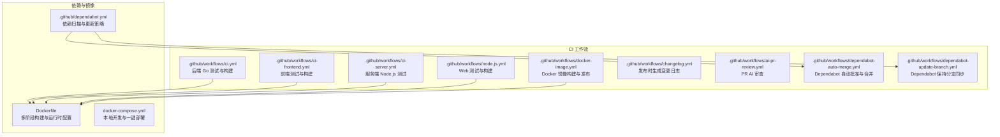

图表来源
- [.github/workflows/ci.yml](file://.github/workflows/ci.yml#L1-L60)
- [.github/workflows/ci-frontend.yml](file://.github/workflows/ci-frontend.yml#L1-L42)
- [.github/workflows/ci-server.yml](file://.github/workflows/ci-server.yml#L1-L41)
- [.github/workflows/node.js.yml](file://.github/workflows/node.js.yml#L1-L45)
- [.github/workflows/docker-image.yml](file://.github/workflows/docker-image.yml#L1-L103)
- [.github/workflows/changelog.yml](file://.github/workflows/changelog.yml#L1-L40)
- [.github/workflows/ai-pr-review.yml](file://.github/workflows/ai-pr-review.yml#L1-L82)
- [.github/workflows/dependabot-auto-merge.yml](file://.github/workflows/dependabot-auto-merge.yml#L1-L36)
- [.github/workflows/dependabot-update-branch.yml](file://.github/workflows/dependabot-update-branch.yml#L1-L49)
- [.github/dependabot.yml](file://.github/dependabot.yml#L1-L106)
- [Dockerfile](file://Dockerfile#L1-L81)
- [docker-compose.yml](file://docker-compose.yml#L1-L25)

章节来源
- [.github/workflows/ci.yml](file://.github/workflows/ci.yml#L1-L60)
- [.github/workflows/ci-frontend.yml](file://.github/workflows/ci-frontend.yml#L1-L42)
- [.github/workflows/ci-server.yml](file://.github/workflows/ci-server.yml#L1-L41)
- [.github/workflows/node.js.yml](file://.github/workflows/node.js.yml#L1-L45)
- [.github/workflows/docker-image.yml](file://.github/workflows/docker-image.yml#L1-L103)
- [.github/workflows/changelog.yml](file://.github/workflows/changelog.yml#L1-L40)
- [.github/workflows/ai-pr-review.yml](file://.github/workflows/ai-pr-review.yml#L1-L82)
- [.github/workflows/dependabot-auto-merge.yml](file://.github/workflows/dependabot-auto-merge.yml#L1-L36)
- [.github/workflows/dependabot-update-branch.yml](file://.github/workflows/dependabot-update-branch.yml#L1-L49)
- [.github/dependabot.yml](file://.github/dependabot.yml#L1-L106)
- [Dockerfile](file://Dockerfile#L1-L81)
- [docker-compose.yml](file://docker-compose.yml#L1-L25)

## 核心组件
- 后端 Go 测试与构建：在受控环境中安装 CGO 依赖，启用 SQLite FTS5 标签，执行全量测试。
- SvelteKit 前端测试与构建：使用 Node 20，缓存 npm 依赖，执行测试与静态构建。
- 前端独立测试与构建：针对独立前端工程，执行测试与构建。
- 服务端 Node.js 测试：安装原生依赖（python3、make、g++），执行测试。
- Docker 镜像构建与发布：支持多平台（amd64/arm64），推送至 GHCR 与 Docker Hub，带语义化标签与缓存。
- 变更日志生成：在发布时自动生成并推回主分支。
- AI PR 审查：基于外部模型对 PR 进行审查，支持自动触发与手动触发。
- Dependabot 自动化：自动批准补丁/小版本更新，开启自动合并（squash），并保持分支与基线同步。

章节来源
- [.github/workflows/ci.yml](file://.github/workflows/ci.yml#L13-L33)
- [.github/workflows/ci.yml](file://.github/workflows/ci.yml#L34-L59)
- [.github/workflows/ci-frontend.yml](file://.github/workflows/ci-frontend.yml#L17-L41)
- [.github/workflows/ci-server.yml](file://.github/workflows/ci-server.yml#L17-L40)
- [.github/workflows/node.js.yml](file://.github/workflows/node.js.yml#L18-L44)
- [.github/workflows/docker-image.yml](file://.github/workflows/docker-image.yml#L14-L101)
- [.github/workflows/changelog.yml](file://.github/workflows/changelog.yml#L11-L39)
- [.github/workflows/ai-pr-review.yml](file://.github/workflows/ai-pr-review.yml#L23-L81)
- [.github/workflows/dependabot-auto-merge.yml](file://.github/workflows/dependabot-auto-merge.yml#L12-L35)
- [.github/workflows/dependabot-update-branch.yml](file://.github/workflows/dependabot-update-branch.yml#L16-L48)

## 架构总览
下图展示了从代码提交到镜像发布的整体流程，以及各工作流之间的协作关系。

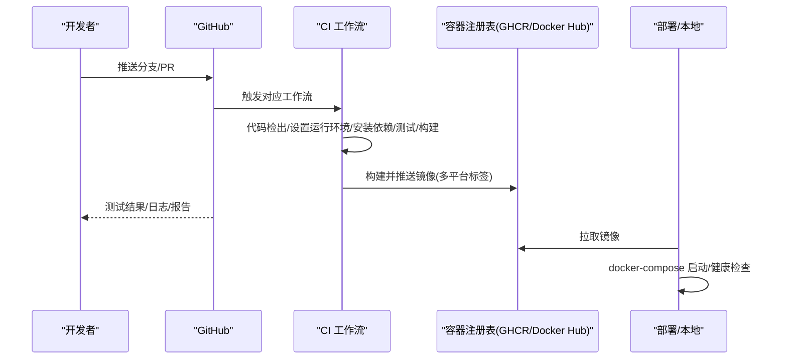

图表来源
- [.github/workflows/ci.yml](file://.github/workflows/ci.yml#L1-L60)
- [.github/workflows/ci-frontend.yml](file://.github/workflows/ci-frontend.yml#L1-L42)
- [.github/workflows/ci-server.yml](file://.github/workflows/ci-server.yml#L1-L41)
- [.github/workflows/node.js.yml](file://.github/workflows/node.js.yml#L1-L45)
- [.github/workflows/docker-image.yml](file://.github/workflows/docker-image.yml#L1-L103)
- [Dockerfile](file://Dockerfile#L1-L81)
- [docker-compose.yml](file://docker-compose.yml#L1-L25)

## 详细组件分析

### 后端 Go 流水线（ci.yml）
- 触发条件：主分支推送与拉取请求。
- 步骤要点：
  - 检出代码。
  - 设置 Go 1.21 并启用 go.sum 缓存。
  - 安装 CGO 构建依赖（用于 sqlite_fts5）。
  - 在 backend 目录执行 go test，启用 sqlite_fts5 标签。
- 复杂度与性能：单作业串行，Go 测试覆盖数据库与查询逻辑，建议结合覆盖率工具进一步完善（见“性能考虑”）。

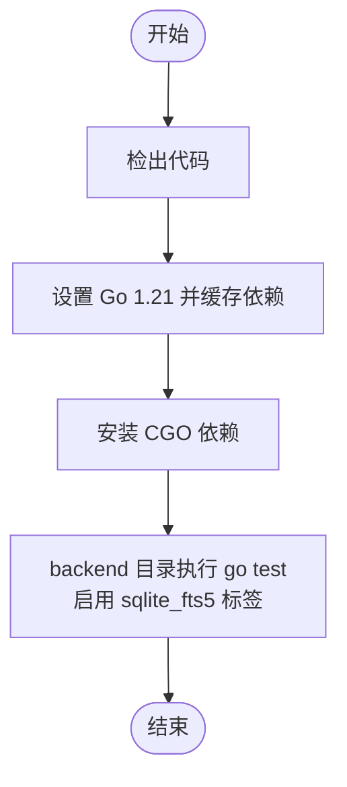

图表来源
- [.github/workflows/ci.yml](file://.github/workflows/ci.yml#L16-L33)

章节来源
- [.github/workflows/ci.yml](file://.github/workflows/ci.yml#L1-L60)

### SvelteKit 前端流水线（ci-frontend.yml）
- 触发条件：仅匹配 frontend 目录变更。
- 步骤要点：
  - 检出代码。
  - 设置 Node.js 20，缓存 npm 依赖（kit/package-lock.json）。
  - 在 kit 目录执行 npm ci、npm test、npm run build。
- 复杂度与性能：独立模块流水线，减少无关变更带来的重复执行。

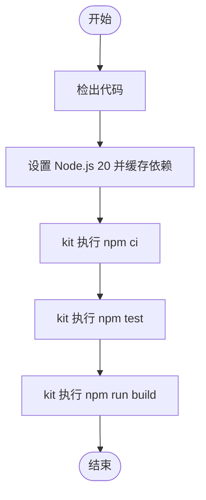

图表来源
- [.github/workflows/ci-frontend.yml](file://.github/workflows/ci-frontend.yml#L17-L58)

章节来源
- [.github/workflows/ci-frontend.yml](file://.github/workflows/ci-frontend.yml#L1-L42)

### 前端独立流水线（ci-server.yml）
- 触发条件：仅匹配 server 目录变更。
- 步骤要点：
  - 检出代码。
  - 设置 Node.js 20，缓存 npm 依赖（server/package-lock.json）。
  - 安装原生依赖（python3、make、g++）。
  - 在 server 目录执行 npm ci 与 npm test。
- 复杂度与性能：原生依赖安装成本较高，建议在变更路径上做精准匹配。

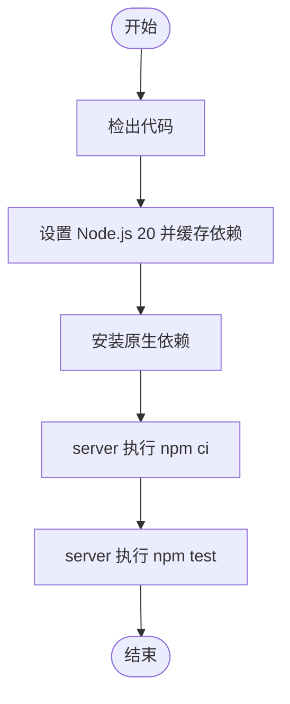

图表来源
- [.github/workflows/ci-server.yml](file://.github/workflows/ci-server.yml#L17-L40)

章节来源
- [.github/workflows/ci-server.yml](file://.github/workflows/ci-server.yml#L1-L41)

### Web 测试与构建（node.js.yml）
- 触发条件：仅匹配 web 目录变更。
- 步骤要点：
  - 检出代码。
  - 设置 Node.js 16，缓存 npm 依赖（web/package-lock.json）。
  - 执行 npm test（指定 jest 配置），通过后执行 npm run build。
- 复杂度与性能：Node.js 16 与 20 的差异需关注兼容性，建议统一版本或在矩阵中并行测试。

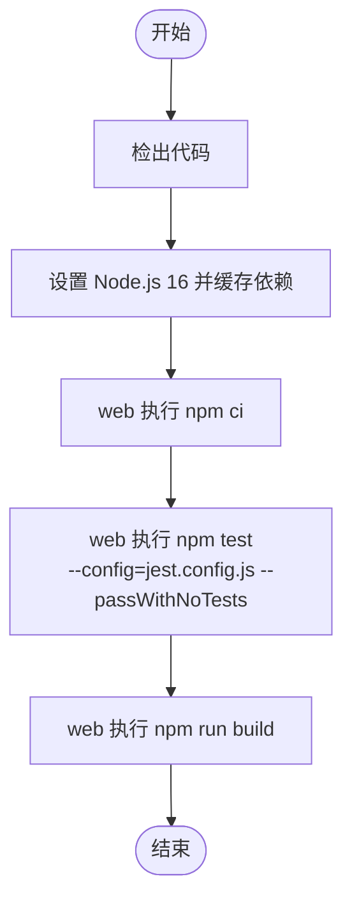

图表来源
- [.github/workflows/node.js.yml](file://.github/workflows/node.js.yml#L18-L44)

章节来源
- [.github/workflows/node.js.yml](file://.github/workflows/node.js.yml#L1-L45)

### Docker 镜像构建与发布（docker-image.yml）
- 触发条件：手动触发或打标签（v*）推送。
- 步骤要点：
  - 多阶段构建：Node 构建 SvelteKit 静态资源，Go 构建二进制，最终合并到 Debian slim 运行时。
  - 多平台：linux/amd64, linux/arm64。
  - 标签策略：语义化版本、主次版本、latest。
  - 注册表：GHCR 与 Docker Hub（可选凭据）。
- 安全与健壮性：Debian 更新、非 root 用户、健康检查、环境变量默认值与挂载卷。

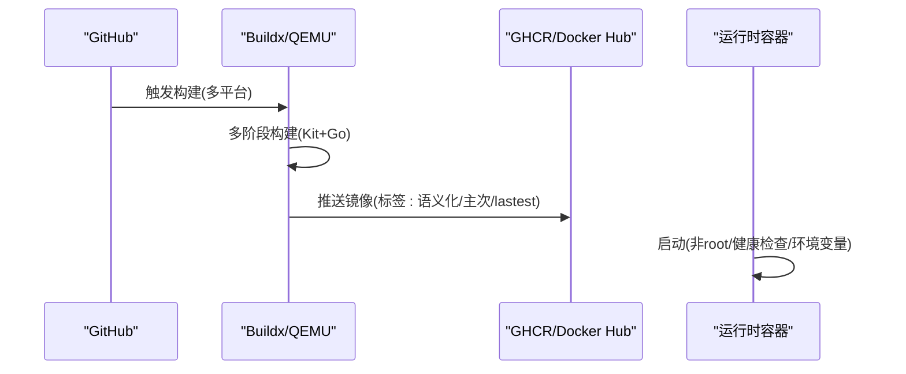

图表来源
- [.github/workflows/docker-image.yml](file://.github/workflows/docker-image.yml#L14-L101)
- [Dockerfile](file://Dockerfile#L1-L81)
- [docker-compose.yml](file://docker-compose.yml#L1-L25)

章节来源
- [.github/workflows/docker-image.yml](file://.github/workflows/docker-image.yml#L1-L103)
- [Dockerfile](file://Dockerfile#L1-L81)
- [docker-compose.yml](file://docker-compose.yml#L1-L25)

### 变更日志生成（changelog.yml）
- 触发条件：发布类型 published。
- 步骤要点：
  - 检出默认分支。
  - 使用 auto-changelog 生成 CHANGELOG.md。
  - 提交并推回默认分支。
- 复杂度与性能：轻量级脚本，仅在发布时触发。

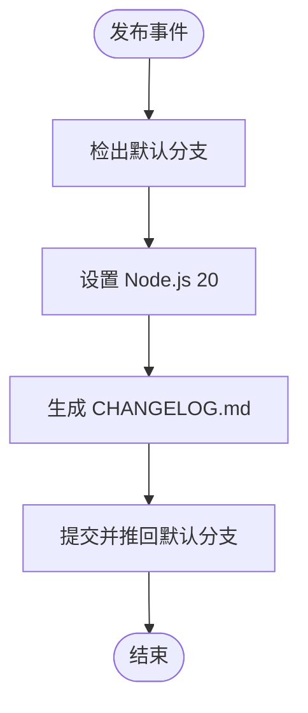

图表来源
- [.github/workflows/changelog.yml](file://.github/workflows/changelog.yml#L11-L39)

章节来源
- [.github/workflows/changelog.yml](file://.github/workflows/changelog.yml#L1-L40)

### AI PR 审查（ai-pr-review.yml）
- 触发条件：手动触发或满足特定标签/来源（Dependabot 或含 ai-review 标签的 PR）。
- 步骤要点：
  - 仅检出 base 分支，避免执行 PR 代码。
  - 通过外部模型生成审查意见，支持 OpenAI 兼容接口。
- 复杂度与性能：按并发组控制，避免重复与刷屏。

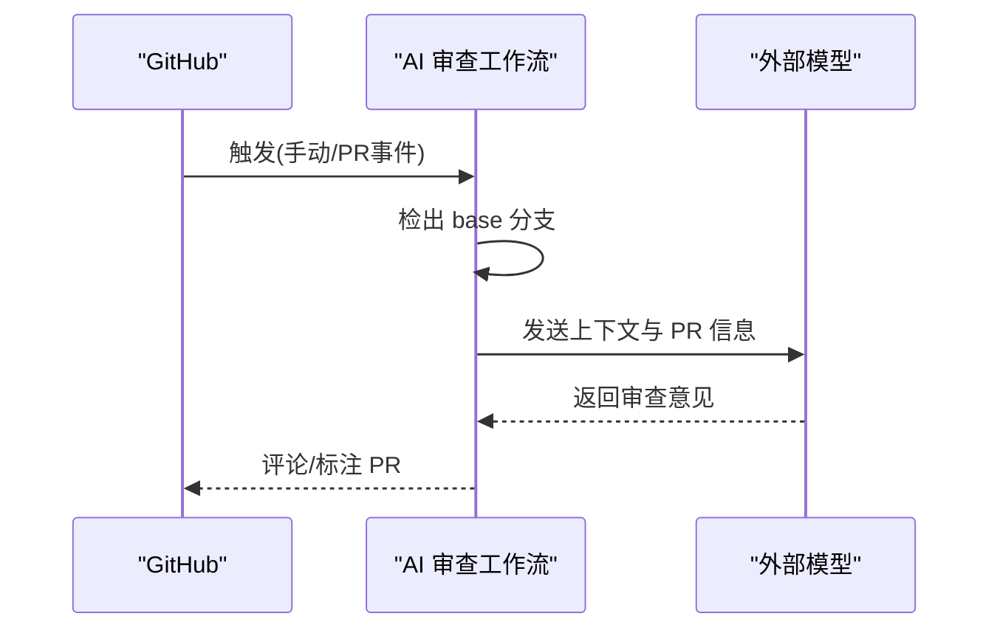

图表来源
- [.github/workflows/ai-pr-review.yml](file://.github/workflows/ai-pr-review.yml#L23-L81)

章节来源
- [.github/workflows/ai-pr-review.yml](file://.github/workflows/ai-pr-review.yml#L1-L82)

### Dependabot 自动化（dependabot-auto-merge.yml、dependabot-update-branch.yml）
- 自动批准与合并：对补丁/小版本更新自动批准并启用 squash 合并。
- 保持分支同步：检测 PR 是否落后于基线，如是则触发“Update branch”。

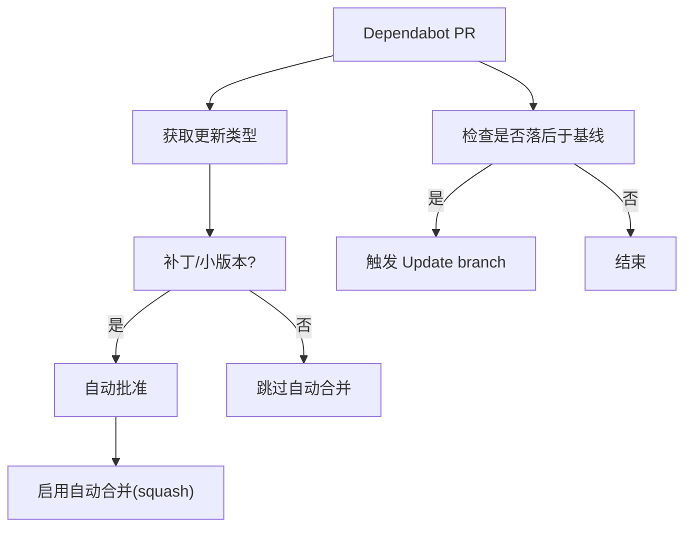

图表来源
- [.github/workflows/dependabot-auto-merge.yml](file://.github/workflows/dependabot-auto-merge.yml#L12-L35)
- [.github/workflows/dependabot-update-branch.yml](file://.github/workflows/dependabot-update-branch.yml#L20-L48)

章节来源
- [.github/workflows/dependabot-auto-merge.yml](file://.github/workflows/dependabot-auto-merge.yml#L1-L36)
- [.github/workflows/dependabot-update-branch.yml](file://.github/workflows/dependabot-update-branch.yml#L1-L49)

## 依赖分析
- Dependabot 配置：按模块（backend/gomod、frontend/kit、frontend、server、web、根目录）分别设定每周扫描、自动 rebase、分组 patch/minor。
- 自动化策略：配合自动批准/合并与保持分支同步，降低维护成本并提升安全性。

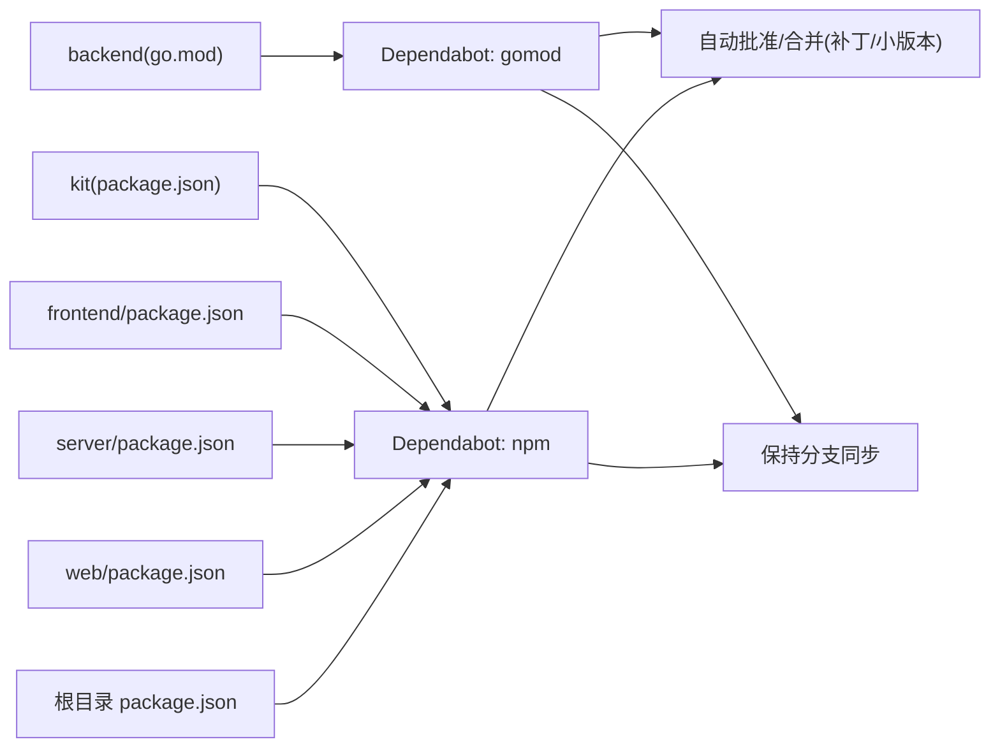

图表来源
- [.github/dependabot.yml](file://.github/dependabot.yml#L4-L104)
- [.github/workflows/dependabot-auto-merge.yml](file://.github/workflows/dependabot-auto-merge.yml#L12-L35)
- [.github/workflows/dependabot-update-branch.yml](file://.github/workflows/dependabot-update-branch.yml#L20-L48)

章节来源
- [.github/dependabot.yml](file://.github/dependabot.yml#L1-L106)
- [.github/workflows/dependabot-auto-merge.yml](file://.github/workflows/dependabot-auto-merge.yml#L1-L36)
- [.github/workflows/dependabot-update-branch.yml](file://.github/workflows/dependabot-update-branch.yml#L1-L49)

## 性能考虑
- 缓存策略：Go 与 npm 依赖缓存路径明确，有助于缩短流水线时间。
- 并行与拆分：按模块拆分流水线，避免无关变更触发不必要步骤。
- 构建优化：Docker 多阶段构建与分层缓存，减少镜像体积与构建时间。
- 测试覆盖：建议在 Go 与前端增加覆盖率统计与阈值控制，确保质量门禁。
- Node 版本：web 使用 Node 16，建议评估与前端/Kit 统一版本，减少矩阵复杂度。

## 故障排除指南
- 健康检查失败
  - 现象：容器启动后无法通过健康检查。
  - 排查：确认端口、环境变量、数据库路径与存储目录权限。
  - 参考：Dockerfile 中 HEALTHCHECK 与 docker-compose 环境变量。
- JWT 密钥问题
  - 现象：登录异常或会话无效。
  - 排查：检查 .env 中 MEMO_JWT_SECRET 是否设置且强度足够。
- 依赖安装失败
  - 现象：npm ci 或 go mod download 失败。
  - 排查：网络代理、缓存层、锁文件一致性；必要时清理缓存重试。
- CI 并发冲突
  - 现象：多个工作流竞争资源或重复执行。
  - 排查：使用 concurrency 控制组，合理拆分路径触发。
- 本地一键部署
  - 使用 deploy-docker.sh 自动检查环境、构建镜像、启动服务并等待健康检查。
  - 如启动超时，查看容器日志并核对端口占用与环境变量。

章节来源
- [Dockerfile](file://Dockerfile#L68-L77)
- [docker-compose.yml](file://docker-compose.yml#L7-L18)
- [deploy-docker.sh](file://deploy-docker.sh#L32-L82)

## 结论
本仓库的 CI/CD 体系通过多模块流水线、Docker 多阶段构建与 Dependabot 自动化，实现了高效、可维护的交付流程。建议后续在测试覆盖率、统一 Node.js 版本、发布矩阵与监控告警方面持续优化，以进一步提升稳定性与可观测性。

## 附录
- 本地开发与一键部署
  - 使用 docker-compose.yml 快速启动本地服务，设置必要的环境变量与持久化卷。
  - 使用 deploy-docker.sh 自动完成环境检查、镜像构建、服务启动与健康检查等待。
- 生产部署建议
  - 配置域名与 HTTPS，设置更强的 JWT 密钥与 CORS 白名单。
  - 使用外部数据库与对象存储，避免单点故障。
- 工作流自定义与扩展
  - 可按需新增矩阵测试（不同 Node/Go 版本）、添加覆盖率报告、集成安全扫描（SAST/SBOM）。
  - 将发布流程与部署策略解耦，支持蓝绿/金丝雀发布与自动回滚。

章节来源
- [docker-compose.yml](file://docker-compose.yml#L1-L25)
- [deploy-docker.sh](file://deploy-docker.sh#L1-L92)
- [build-prod.sh](file://build-prod.sh#L1-L33)