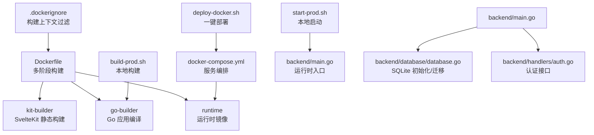
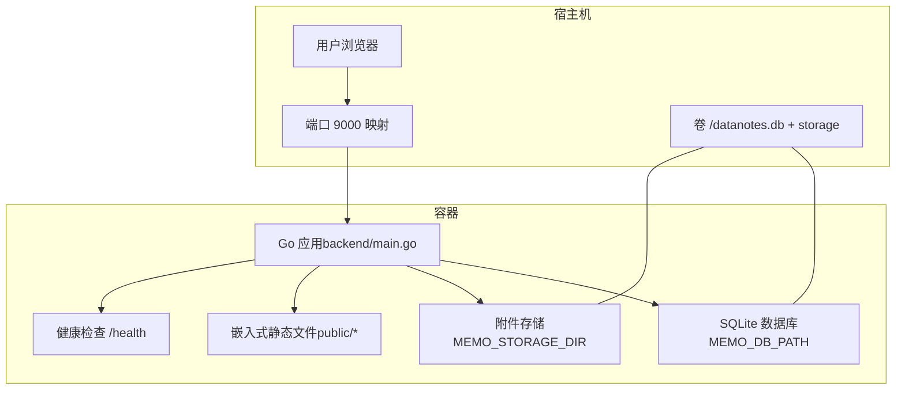
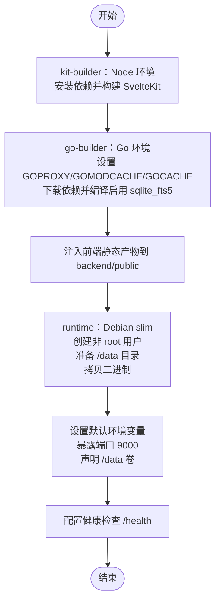
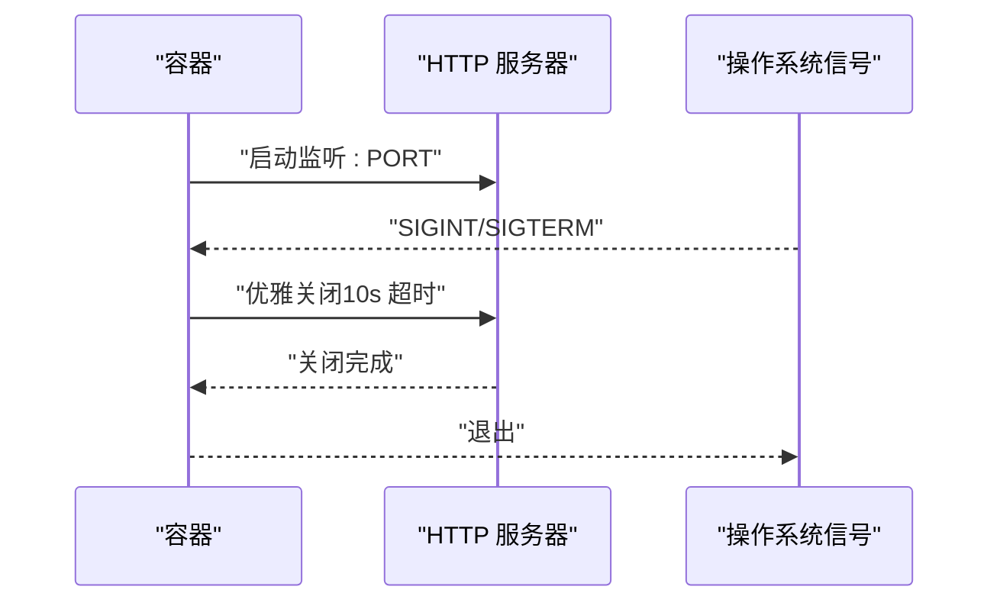
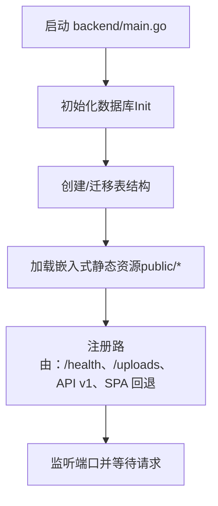
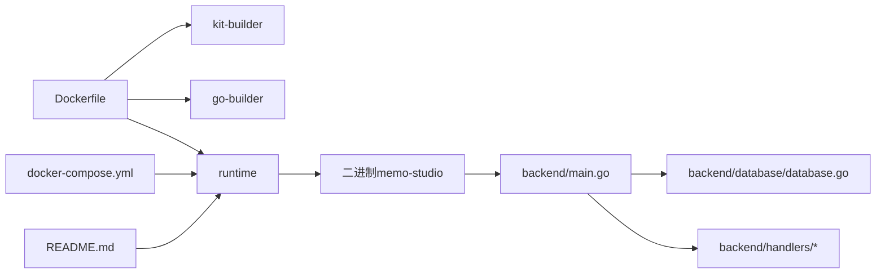

# Docker 容器化

<cite>
**本文引用的文件**
- [Dockerfile](file://Dockerfile)
- [.dockerignore](file://.dockerignore)
- [docker-compose.yml](file://docker-compose.yml)
- [deploy-docker.sh](file://deploy-docker.sh)
- [build-prod.sh](file://build-prod.sh)
- [start-prod.sh](file://start-prod.sh)
- [check.sh](file://check.sh)
- [.env.example](file://.env.example)
- [README.md](file://README.md)
- [backend/main.go](file://backend/main.go)
- [backend/database/database.go](file://backend/database/database.go)
- [backend/handlers/auth.go](file://backend/handlers/auth.go)
</cite>

## 目录
1. [简介](#简介)
2. [项目结构](#项目结构)
3. [核心组件](#核心组件)
4. [架构总览](#架构总览)
5. [详细组件分析](#详细组件分析)
6. [依赖关系分析](#依赖关系分析)
7. [性能考量](#性能考量)
8. [故障排查指南](#故障排查指南)
9. [结论](#结论)
10. [附录](#附录)

## 简介
本文件面向 Memo Studio 的 Docker 容器化部署，系统性解析多阶段 Docker 构建流程、Go 应用编译与 SvelteKit 静态资源集成、运行时镜像优化与安全加固、容器配置与健康检查、以及生产部署最佳实践。文档同时提供构建命令示例、常见问题定位方法与排错建议，帮助用户在 NAS/服务器等环境中稳定、安全地运行 Memo Studio。

## 项目结构
围绕容器化，本项目的关键文件与职责如下：
- Dockerfile：定义三阶段构建（SvelteKit 静态构建、Go 编译、运行时镜像），并设置运行时环境变量、端口、卷与健康检查。
- docker-compose.yml：定义服务、环境变量、端口映射、卷与重启策略，便于一键部署。
- .dockerignore：排除不必要的构建上下文文件，减少镜像体积与构建时间。
- 部署脚本：deploy-docker.sh、build-prod.sh、start-prod.sh、check.sh 提供自动化构建、启动与诊断能力。
- README.md：提供环境变量、端口、数据目录、健康检查等官方说明，便于理解容器行为。
- backend/*：Go 后端逻辑，负责 API、静态文件托管、数据库初始化、CORS、健康检查端点等。

图表来源
- [Dockerfile](file://Dockerfile#L1-L81)
- [docker-compose.yml](file://docker-compose.yml#L1-L25)
- [.dockerignore](file://.dockerignore#L1-L14)
- [deploy-docker.sh](file://deploy-docker.sh#L1-L92)
- [build-prod.sh](file://build-prod.sh#L1-L33)
- [start-prod.sh](file://start-prod.sh#L1-L63)
- [backend/main.go](file://backend/main.go#L1-L353)
- [backend/database/database.go](file://backend/database/database.go#L1-L677)
- [backend/handlers/auth.go](file://backend/handlers/auth.go#L1-L111)

章节来源
- [Dockerfile](file://Dockerfile#L1-L81)
- [docker-compose.yml](file://docker-compose.yml#L1-L25)
- [.dockerignore](file://.dockerignore#L1-L14)
- [deploy-docker.sh](file://deploy-docker.sh#L1-L92)
- [build-prod.sh](file://build-prod.sh#L1-L33)
- [start-prod.sh](file://start-prod.sh#L1-L63)
- [README.md](file://README.md#L61-L128)

## 核心组件
- 多阶段构建
  - kit-builder：基于 Node.js，安装依赖并构建 SvelteKit 静态产物。
  - go-builder：基于 Go，设置 GOPROXY、GOMODCACHE、GOCACHE，下载依赖并编译启用 sqlite_fts5 的二进制，同时注入前端静态产物。
  - runtime：基于 Debian slim，安装 CA 证书与时区数据，创建非 root 用户，设置数据目录与权限，拷贝二进制，暴露端口，配置健康检查与默认环境变量。
- 容器配置
  - 环境变量：GIN_MODE、PORT、MEMO_DB_PATH、MEMO_STORAGE_DIR、MEMO_CORS_ORIGINS、MEMO_JWT_SECRET、MEMO_ENV 等。
  - 端口：9000。
  - 卷：/data（持久化 SQLite 与附件）。
- 健康检查：通过 /health 公开端点进行探测。
- 进程管理：容器内以非 root 用户运行，优雅关闭信号处理。

章节来源
- [Dockerfile](file://Dockerfile#L1-L81)
- [docker-compose.yml](file://docker-compose.yml#L1-L25)
- [backend/main.go](file://backend/main.go#L82-L85)
- [backend/database/database.go](file://backend/database/database.go#L20-L60)

## 架构总览
下图展示了容器化部署的整体架构与数据流。

图表来源
- [backend/main.go](file://backend/main.go#L82-L85)
- [backend/database/database.go](file://backend/database/database.go#L20-L60)
- [docker-compose.yml](file://docker-compose.yml#L19-L21)

## 详细组件分析

### 多阶段构建详解
- SvelteKit 静态构建阶段（kit-builder）
  - 基于 node:20-bookworm，更新系统修复安全漏洞，安装 kit/package.json 与 package-lock.json 后执行 npm ci，随后构建静态产物。
  - 作用：产出前端静态资源，供 Go 运行时托管。
- Go 应用编译阶段（go-builder）
  - 基于 golang:1.23-bookworm，设置 GOPROXY、GOMODCACHE、GOCACHE 以优化依赖下载与缓存。
  - 先复制 go.mod/go.sum，执行 go mod download 与 go mod verify，再复制源码，注入 kit/build 到 backend/public，最终 CGO_ENABLED=1 以启用 sqlite_fts5 构建标签，生成二进制。
  - 优化点：依赖层缓存、构建标签启用全文检索能力。
- 运行时镜像（runtime）
  - 基于 debian:bookworm-slim，更新系统修复安全漏洞，安装 CA 证书与时区数据，创建非 root 用户（UID 10001），创建 /data 目录并赋予 appuser 权限。
  - 拷贝二进制，设置非 root 用户运行，配置默认环境变量（GIN_MODE、PORT、MEMO_DB_PATH、MEMO_STORAGE_DIR），暴露 9000 端口，声明 /data 卷，配置健康检查。
  - 优化点：精简基础镜像、非 root 运行、最小化安装包。

图表来源
- [Dockerfile](file://Dockerfile#L1-L81)

章节来源
- [Dockerfile](file://Dockerfile#L1-L81)

### 运行时镜像优化策略
- 基础镜像选择：debian:bookworm-slim，减少镜像体积与攻击面。
- 安全更新：apt-get update/upgrade 清理缓存，仅安装必要包（ca-certificates、tzdata、wget）。
- 非 root 用户：useradd -m -u 10001 appuser，降低权限风险。
- 数据持久化：/data 目录提前创建并 chown，确保容器重启后数据不丢失。
- 健康检查：通过 wget -qO- "http://127.0.0.1:${PORT:-9000}/health" 检测 /health 端点，避免误判。

章节来源
- [Dockerfile](file://Dockerfile#L47-L81)

### 容器配置选项
- 环境变量
  - GIN_MODE：生产默认 release，可通过环境变量覆盖。
  - PORT：监听端口，默认 9000。
  - MEMO_DB_PATH：SQLite 路径，默认 ./notes.db；容器建议 /data/notes.db。
  - MEMO_STORAGE_DIR：附件目录，默认 ./storage；容器建议 /data/storage。
  - MEMO_CORS_ORIGINS：CORS 白名单（逗号分隔），生产建议显式配置。
  - MEMO_JWT_SECRET：JWT 密钥（生产必须设置）。
  - MEMO_ENV：环境标识，影响日志与安全策略。
- 端口与卷
  - 端口：9000。
  - 卷：/data（持久化数据库与附件）。
- 健康检查
  - 周期：30s；超时：3s；启动期：10s；重试次数：3。
  - 命令：wget -qO- "http://127.0.0.1:${PORT:-9000}/health" >/dev/null 2>&1 || exit 1。

章节来源
- [Dockerfile](file://Dockerfile#L68-L77)
- [docker-compose.yml](file://docker-compose.yml#L7-L18)
- [README.md](file://README.md#L121-L128)

### 进程管理与优雅关闭
- 进程模型：容器内以非 root 用户运行，避免特权提升带来的安全风险。
- 优雅关闭：监听 SIGINT/SIGTERM，10 秒超时优雅关闭 HTTP 服务器，确保请求处理完成。
- 健康检查：/health 端点公开，便于容器编排系统进行探活。

图表来源
- [backend/main.go](file://backend/main.go#L342-L352)

章节来源
- [backend/main.go](file://backend/main.go#L318-L352)

### 数据库与静态资源集成
- 数据库初始化：根据 MEMO_DB_PATH 初始化 SQLite，创建表与迁移版本，启用外键、WAL、busy_timeout 等推荐参数。
- 静态资源：通过 go:embed 将 backend/public/* 嵌入二进制，运行时作为静态文件服务，并对未命中 API 的路由回退到 index.html，实现 SPA。
- 附件存储：/uploads 静态服务指向 MEMO_STORAGE_DIR。

图表来源
- [backend/main.go](file://backend/main.go#L28-L316)
- [backend/database/database.go](file://backend/database/database.go#L20-L178)

章节来源
- [backend/main.go](file://backend/main.go#L28-L316)
- [backend/database/database.go](file://backend/database/database.go#L20-L178)

### 部署与运维脚本
- deploy-docker.sh：检查 Docker 与 Compose、生成/校验 .env、构建镜像、启动服务、等待健康检查、输出提示信息。
- build-prod.sh：本地构建前端静态与 Go 二进制，便于离线验证。
- start-prod.sh：本地启动生产模式，自动等待健康检查后打开浏览器。
- check.sh：诊断 Go/Node/npm、端口占用、依赖完整性与日志文件。

章节来源
- [deploy-docker.sh](file://deploy-docker.sh#L1-L92)
- [build-prod.sh](file://build-prod.sh#L1-L33)
- [start-prod.sh](file://start-prod.sh#L1-L63)
- [check.sh](file://check.sh#L1-L126)

## 依赖关系分析
- Dockerfile 依赖
  - kit-builder 依赖 kit/package.json 与 package-lock.json。
  - go-builder 依赖 backend/go.mod/go.sum 与源码，并注入 kit/build。
  - runtime 依赖 go-builder 产出的二进制。
- Compose 依赖
  - docker-compose.yml 依赖 Dockerfile 构建镜像，映射端口 9000，挂载 /data 卷。
- 运行时依赖
  - backend/main.go 依赖 backend/database/database.go 初始化数据库，依赖 backend/handlers/* 提供 API。
  - README.md 提供环境变量与端口说明，指导容器配置。

图表来源
- [Dockerfile](file://Dockerfile#L1-L81)
- [docker-compose.yml](file://docker-compose.yml#L1-L25)
- [backend/main.go](file://backend/main.go#L1-L353)
- [backend/database/database.go](file://backend/database/database.go#L1-L677)
- [README.md](file://README.md#L61-L128)

章节来源
- [Dockerfile](file://Dockerfile#L1-L81)
- [docker-compose.yml](file://docker-compose.yml#L1-L25)
- [backend/main.go](file://backend/main.go#L1-L353)
- [backend/database/database.go](file://backend/database/database.go#L1-L677)
- [README.md](file://README.md#L61-L128)

## 性能考量
- 构建缓存
  - Go 依赖层缓存：先复制 go.mod/go.sum，再执行 go mod download，避免源码变更导致重复下载。
  - Node 依赖层缓存：先复制 kit/package.json 与 package-lock.json，再执行 npm ci。
- 依赖下载加速
  - GOPROXY 指向官方代理，结合 GOMODCACHE/GOCACHE 缓存，缩短二次构建时间。
- 镜像瘦身
  - 使用 debian:bookworm-slim 与最小安装包，apt-get clean 与清理缓存目录。
  - .dockerignore 排除 node_modules、.svelte-kit、build/dist、日志与敏感文件。
- 运行时性能
  - SQLite WAL 模式、foreign_keys 开启、busy_timeout 设置提升并发稳定性。
  - Gin Release 模式与可选 Logger 控制日志开销。

章节来源
- [Dockerfile](file://Dockerfile#L18-L45)
- [.dockerignore](file://.dockerignore#L1-L14)
- [backend/database/database.go](file://backend/database/database.go#L45-L52)

## 故障排查指南
- 环境变量缺失
  - MEMO_JWT_SECRET 未设置：生产环境会发出警告，建议通过 .env 或 docker-compose.yml 设置。
  - MEMO_CORS_ORIGINS 未设置：生产建议显式配置，避免跨域风险。
- 端口占用
  - 9000/9001 被占用：使用 check.sh 检查并终止占用进程，或调整映射端口。
- 依赖问题
  - Go 依赖：go mod download、go mod tidy。
  - npm 依赖：删除 node_modules 与 package-lock.json 后重新安装。
- 数据库问题
  - 删除 notes.db 后重启会自动重建；若迁移异常，检查日志并确认 SQLite 版本与 FTS5 支持。
- 健康检查失败
  - 使用 curl -s -f "http://localhost:9000/health" 验证；查看 docker compose logs 获取详细日志。

章节来源
- [README.md](file://README.md#L115-L128)
- [check.sh](file://check.sh#L1-L126)
- [backend/main.go](file://backend/main.go#L82-L85)

## 结论
本容器化方案通过多阶段构建将 SvelteKit 静态资源与 Go 应用无缝集成，运行时采用非 root 用户与最小化基础镜像，配合健康检查与持久化卷，满足生产环境的安全性与稳定性需求。结合一键部署脚本与诊断工具，可快速完成从构建到上线的全流程。

## 附录

### 常用构建与部署命令
- 使用 Compose 一键部署（推荐）
  - 生成强 JWT Secret 并启动：参考 README 中 docker compose 示例。
  - 或使用 deploy-docker.sh：自动检查环境、构建镜像、启动服务并等待健康检查。
- 本地构建与启动
  - 构建前端与 Go 二进制：./build-prod.sh
  - 本地启动并打开浏览器：./start-prod.sh
- 健康检查验证
  - curl -s -f "http://localhost:9000/health"

章节来源
- [README.md](file://README.md#L96-L106)
- [deploy-docker.sh](file://deploy-docker.sh#L64-L82)
- [build-prod.sh](file://build-prod.sh#L13-L30)
- [start-prod.sh](file://start-prod.sh#L43-L61)

### 容器配置清单
- 环境变量
  - 必填：MEMO_JWT_SECRET（生产）
  - 推荐：MEMO_ADMIN_PASSWORD、MEMO_CORS_ORIGINS
  - 可选：GIN_MODE、PORT、MEMO_DB_PATH、MEMO_STORAGE_DIR、MEMO_ENV
- 端口：9000
- 卷：/data（notes.db、storage）

章节来源
- [docker-compose.yml](file://docker-compose.yml#L7-L18)
- [Dockerfile](file://Dockerfile#L68-L71)
- [README.md](file://README.md#L121-L128)