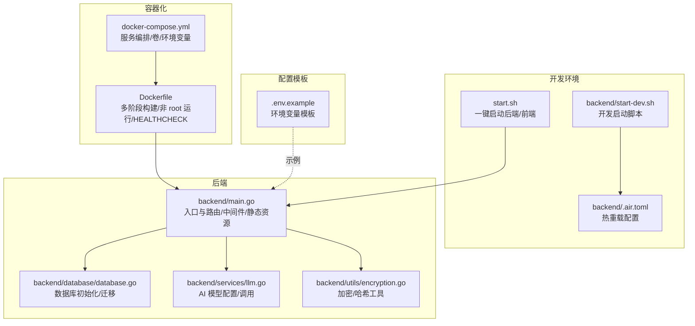
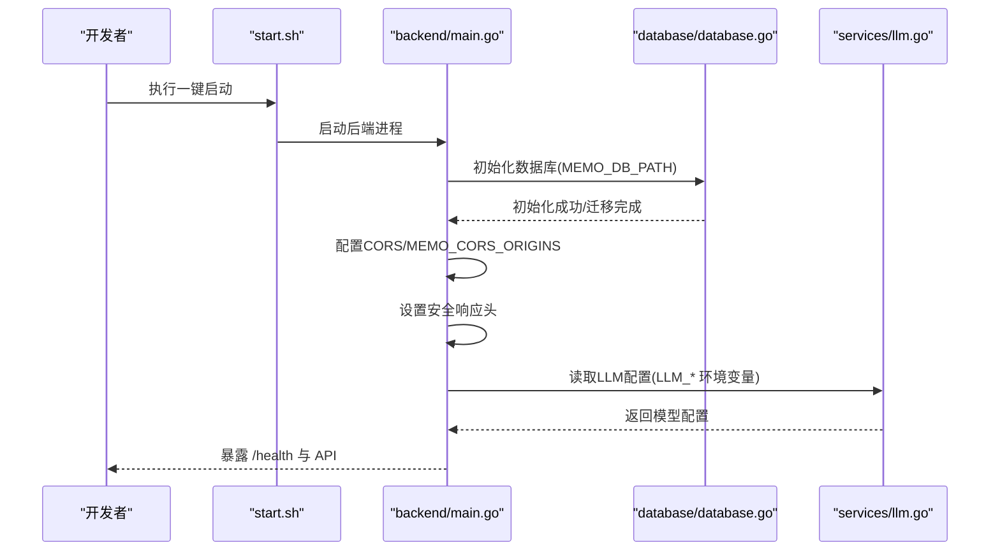
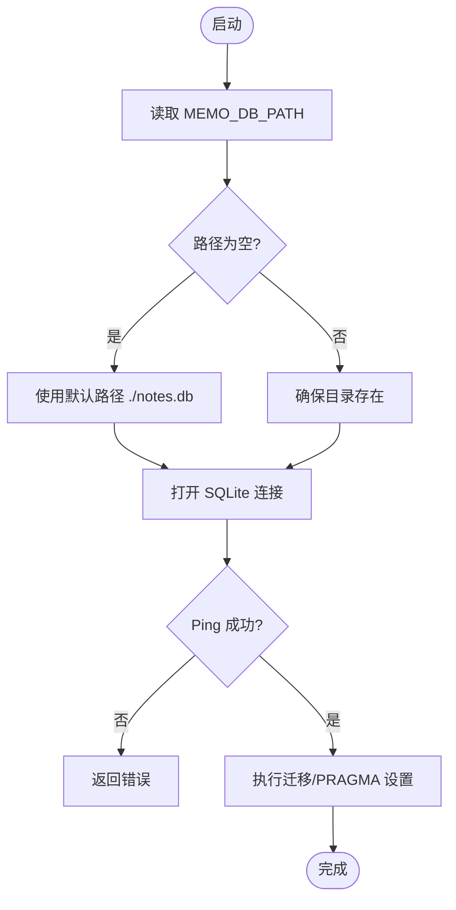
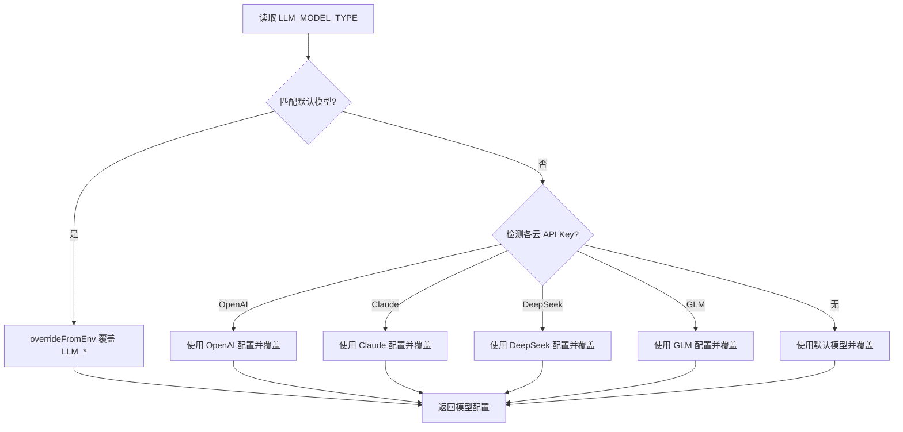
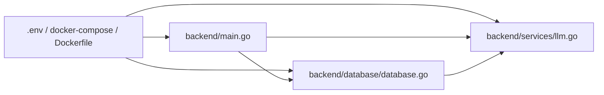

# 环境配置管理

<cite>
**本文引用的文件**
- [.env.example](file://.env.example)
- [docker-compose.yml](file://docker-compose.yml)
- [Dockerfile](file://Dockerfile)
- [backend/main.go](file://backend/main.go)
- [backend/database/database.go](file://backend/database/database.go)
- [backend/services/llm.go](file://backend/services/llm.go)
- [backend/utils/encryption.go](file://backend/utils/encryption.go)
- [backend/handlers/auth.go](file://backend/handlers/auth.go)
- [backend/.air.toml](file://backend/.air.toml)
- [backend/start-dev.sh](file://backend/start-dev.sh)
- [start.sh](file://start.sh)
- [build-prod.sh](file://build-prod.sh)
- [start-prod.sh](file://start-prod.sh)
</cite>

## 目录
1. [简介](#简介)
2. [项目结构](#项目结构)
3. [核心组件](#核心组件)
4. [架构总览](#架构总览)
5. [详细组件分析](#详细组件分析)
6. [依赖关系分析](#依赖关系分析)
7. [性能考量](#性能考量)
8. [故障排查指南](#故障排查指南)
9. [结论](#结论)
10. [附录](#附录)

## 简介
本指南面向 Memo Studio 的环境配置管理，围绕数据库连接、AI 服务密钥、存储路径等关键配置展开，系统说明开发、测试、生产三类环境的配置差异与最佳实践，解释配置文件的组织与优先级规则，阐述敏感信息的安全管理策略（密钥轮换、环境隔离、访问控制），并提供配置验证与错误处理机制、实际配置示例、常见问题与解决方案，以及配置变更的影响评估与回滚策略。

## 项目结构
Memo Studio 采用前后端分离与容器化部署的结构：
- 前端产物由 SvelteKit 构建后嵌入后端，后端以静态资源方式提供
- 后端通过环境变量驱动数据库路径、存储目录、CORS、端口、运行模式等
- Dockerfile 与 docker-compose.yml 提供生产级打包与编排
- 开发阶段提供一键启动脚本与热重载配置

**图表来源**
- [start.sh](file://start.sh#L1-L238)
- [backend/.air.toml](file://backend/.air.toml#L1-L48)
- [backend/start-dev.sh](file://backend/start-dev.sh#L1-L45)
- [backend/main.go](file://backend/main.go#L1-L353)
- [backend/database/database.go](file://backend/database/database.go#L1-L677)
- [backend/services/llm.go](file://backend/services/llm.go#L1-L641)
- [backend/utils/encryption.go](file://backend/utils/encryption.go#L1-L107)
- [Dockerfile](file://Dockerfile#L1-L81)
- [docker-compose.yml](file://docker-compose.yml#L1-L25)
- [.env.example](file://.env.example#L1-L16)

**章节来源**
- [start.sh](file://start.sh#L1-L238)
- [backend/.air.toml](file://backend/.air.toml#L1-L48)
- [backend/start-dev.sh](file://backend/start-dev.sh#L1-L45)
- [backend/main.go](file://backend/main.go#L1-L353)
- [backend/database/database.go](file://backend/database/database.go#L1-L677)
- [backend/services/llm.go](file://backend/services/llm.go#L1-L641)
- [backend/utils/encryption.go](file://backend/utils/encryption.go#L1-L107)
- [Dockerfile](file://Dockerfile#L1-L81)
- [docker-compose.yml](file://docker-compose.yml#L1-L25)
- [.env.example](file://.env.example#L1-L16)

## 核心组件
- 数据库配置
  - 数据库文件路径通过环境变量 MEMO_DB_PATH 控制，默认 ./notes.db
  - 启动时自动创建目录并初始化 SQLite 连接与迁移
- 存储配置
  - 附件上传目录通过 MEMO_STORAGE_DIR 控制，默认 ./storage
  - 通过 /uploads 静态映射对外提供访问
- CORS 配置
  - MEMO_CORS_ORIGINS 支持逗号分隔的多个域名
  - 开发默认放开，生产建议显式配置以提升安全性
- JWT 与安全
  - MEMO_JWT_SECRET 用于签发与验证令牌，生产必须设置
  - 后端设置安全响应头（X-Content-Type-Options、X-Frame-Options、X-XSS-Protection、X-Robots-Tag）
- 运行模式与端口
  - GIN_MODE 控制日志与调试输出；MEMO_ENV=production 时默认 release
  - PORT 控制监听端口，默认 9000
- AI 服务配置
  - LLM 模型类型、BaseURL、模型名、API Key 通过环境变量覆盖
  - 支持统一 LLM_API_KEY 或各云厂商专用 API Key
- 管理员密码引导
  - MEMO_ADMIN_PASSWORD 可用于初始化/重置管理员密码；未设置时首次启动随机生成并提示

**章节来源**
- [backend/main.go](file://backend/main.go#L28-L92)
- [backend/main.go](file://backend/main.go#L55-L80)
- [backend/main.go](file://backend/main.go#L319-L329)
- [backend/database/database.go](file://backend/database/database.go#L21-L60)
- [backend/database/database.go](file://backend/database/database.go#L464-L539)
- [backend/services/llm.go](file://backend/services/llm.go#L289-L336)
- [docker-compose.yml](file://docker-compose.yml#L7-L18)
- [.env.example](file://.env.example#L1-L16)

## 架构总览
后端通过环境变量驱动运行时行为，容器化部署时由 Dockerfile 与 docker-compose.yml 提供默认值与持久化卷，开发阶段通过一键启动脚本与热重载工具快速迭代。

**图表来源**
- [start.sh](file://start.sh#L124-L165)
- [backend/main.go](file://backend/main.go#L34-L92)
- [backend/database/database.go](file://backend/database/database.go#L21-L60)
- [backend/services/llm.go](file://backend/services/llm.go#L289-L336)

## 详细组件分析

### 数据库配置组件
- 配置项
  - MEMO_DB_PATH：数据库文件路径（默认 ./notes.db）
- 初始化流程
  - 若路径为相对路径，自动创建目录
  - 打开 SQLite 连接并执行迁移（含外键、WAL、busy_timeout 等推荐参数）
  - 首次运行根据环境变量初始化/重置管理员账户
- 安全与隔离
  - 使用绝对路径与受控目录（容器场景建议挂载卷）

**图表来源**
- [backend/database/database.go](file://backend/database/database.go#L21-L60)

**章节来源**
- [backend/database/database.go](file://backend/database/database.go#L21-L60)
- [backend/database/database.go](file://backend/database/database.go#L464-L539)

### 存储配置组件
- 配置项
  - MEMO_STORAGE_DIR：附件存储根目录（默认 ./storage）
- 静态映射
  - /uploads -> MEMO_STORAGE_DIR，便于前端上传资源访问
- 容器化建议
  - 将 /data/storage 挂载为持久卷，避免容器重启丢失

**章节来源**
- [backend/main.go](file://backend/main.go#L87-L92)
- [docker-compose.yml](file://docker-compose.yml#L15-L16)

### CORS 与安全响应头
- CORS
  - MEMO_CORS_ORIGINS 支持逗号分隔的多个来源
  - 开发默认放开，生产建议显式配置
- 安全响应头
  - X-Content-Type-Options、X-Frame-Options、X-XSS-Protection、X-Robots-Tag
- 生产告警
  - 未设置 MEMO_CORS_ORIGINS 时生产环境打印告警

**章节来源**
- [backend/main.go](file://backend/main.go#L55-L80)
- [backend/main.go](file://backend/main.go#L72-L76)

### JWT 与认证
- 配置项
  - MEMO_JWT_SECRET：JWT 密钥（生产必须设置）
- 使用
  - 登录/注册成功后签发令牌，后续接口需携带认证头
- 安全建议
  - 使用强密钥（建议 32+ 字符），定期轮换

**章节来源**
- [.env.example](file://.env.example#L4-L6)
- [backend/main.go](file://backend/main.go#L324-L329)
- [backend/handlers/auth.go](file://backend/handlers/auth.go#L27-L53)

### 运行模式与端口
- GIN_MODE
  - release：关闭日志与调试输出
  - 非 release：开启日志
- MEMO_ENV=production
  - 默认使用 release 模式
- PORT
  - 监听端口，默认 9000

**章节来源**
- [backend/main.go](file://backend/main.go#L28-L44)
- [backend/main.go](file://backend/main.go#L319-L322)

### AI 服务配置组件
- 模型选择与覆盖
  - LLM_MODEL_TYPE：指定模型类型
  - LLM_API_KEY：统一 API Key
  - LLM_BASE_URL：统一 BaseURL
  - LLM_MODEL：统一模型名
- 云端模型识别
  - 若检测到 OPENAI_API_KEY、ANTHROPIC_API_KEY、DEEPSEEK_API_KEY、ZHIPU_API_KEY 等，自动匹配对应模型
- 本地模型
  - 默认本地模型 BaseURL 与模型名可在代码中查看，可通过环境变量覆盖

**图表来源**
- [backend/services/llm.go](file://backend/services/llm.go#L289-L336)

**章节来源**
- [backend/services/llm.go](file://backend/services/llm.go#L289-L336)

### 管理员密码引导
- MEMO_ADMIN_PASSWORD
  - 存在：初始化/重置管理员密码，并强制修改
  - 不存在：首次启动随机生成并打印日志，提示尽快修改
  - 检测到默认密码 admin123：记录安全告警并强制修改

**章节来源**
- [backend/database/database.go](file://backend/database/database.go#L464-L539)

## 依赖关系分析
- 环境变量依赖链
  - backend/main.go 依赖 MEMO_DB_PATH、MEMO_STORAGE_DIR、MEMO_CORS_ORIGINS、MEMO_ENV、GIN_MODE、PORT、MEMO_JWT_SECRET
  - backend/database/database.go 依赖 MEMO_DB_PATH、MEMO_ADMIN_PASSWORD
  - backend/services/llm.go 依赖 LLM_MODEL_TYPE、LLM_API_KEY、LLM_BASE_URL、LLM_MODEL、OPENAI_API_KEY、ANTHROPIC_API_KEY、DEEPSEEK_API_KEY、ZHIPU_API_KEY
- 容器化默认值
  - Dockerfile 与 docker-compose.yml 为 MEMO_DB_PATH、MEMO_STORAGE_DIR、GIN_MODE、PORT、MEMO_ENV 提供默认值，并通过卷持久化数据

**图表来源**
- [backend/main.go](file://backend/main.go#L28-L92)
- [backend/database/database.go](file://backend/database/database.go#L21-L60)
- [backend/services/llm.go](file://backend/services/llm.go#L289-L336)
- [docker-compose.yml](file://docker-compose.yml#L7-L18)
- [Dockerfile](file://Dockerfile#L68-L74)

**章节来源**
- [backend/main.go](file://backend/main.go#L28-L92)
- [backend/database/database.go](file://backend/database/database.go#L21-L60)
- [backend/services/llm.go](file://backend/services/llm.go#L289-L336)
- [docker-compose.yml](file://docker-compose.yml#L7-L18)
- [Dockerfile](file://Dockerfile#L68-L74)

## 性能考量
- SQLite 参数
  - 外键约束、WAL 模式、busy_timeout 已在初始化时设置，有助于并发与一致性
- CORS
  - 生产建议明确配置允许来源，减少预检请求开销
- 日志与调试
  - release 模式关闭日志，降低 I/O 压力
- 本地模型
  - 本地推理延迟与吞吐取决于硬件与模型大小，建议在容器内合理分配资源

[本节为通用指导，不涉及具体文件分析]

## 故障排查指南
- 启动超时
  - 使用 start.sh 的健康检查端点 /health 排查后端是否就绪
  - 查看 backend.log 与 frontend.log 定位错误
- 数据库初始化失败
  - 检查 MEMO_DB_PATH 权限与磁盘空间
  - 确认 SQLite 文件未被其他进程占用
- CORS 问题
  - 生产环境未设置 MEMO_CORS_ORIGINS 会打印告警，建议补齐
- JWT 未设置
  - 生产环境未设置 MEMO_JWT_SECRET 会打印告警，建议补上
- AI 服务调用失败
  - 检查 LLM_API_KEY、LLM_BASE_URL、LLM_MODEL 是否正确
  - 云端模型需按平台要求设置请求头（如 Anthropic 的版本头）
- 管理员密码
  - 首次启动若未设置 MEMO_ADMIN_PASSWORD，系统会随机生成并打印日志，注意及时修改

**章节来源**
- [start.sh](file://start.sh#L134-L165)
- [backend/main.go](file://backend/main.go#L72-L76)
- [backend/main.go](file://backend/main.go#L324-L329)
- [backend/services/llm.go](file://backend/services/llm.go#L484-L500)
- [backend/database/database.go](file://backend/database/database.go#L514-L539)

## 结论
Memo Studio 的环境配置以环境变量为核心，贯穿数据库、存储、CORS、安全、运行模式与 AI 服务等关键环节。生产环境应严格设置敏感变量并明确 CORS 来源，开发与测试环境可适度放宽但需保持最小暴露面。通过容器化默认值与一键启动脚本，可快速落地不同环境。建议建立密钥轮换与变更评审流程，配合健康检查与日志监控，确保配置变更的可控与可回滚。

[本节为总结，不涉及具体文件分析]

## 附录

### 环境变量清单与优先级
- 优先级顺序
  - 运行时环境变量 > docker-compose 环境变量 > Dockerfile 默认值 > 应用内置默认值
- 关键变量
  - MEMO_DB_PATH：数据库文件路径（默认 ./notes.db）
  - MEMO_STORAGE_DIR：存储目录（默认 ./storage）
  - MEMO_CORS_ORIGINS：CORS 允许来源（逗号分隔）
  - MEMO_ENV：运行环境（production 时默认 release）
  - GIN_MODE：日志与调试模式
  - PORT：监听端口（默认 9000）
  - MEMO_JWT_SECRET：JWT 密钥（生产必须）
  - MEMO_ADMIN_PASSWORD：管理员密码（可选，未设置时随机生成）
  - LLM_MODEL_TYPE：模型类型
  - LLM_API_KEY：统一 API Key
  - LLM_BASE_URL：统一 BaseURL
  - LLM_MODEL：统一模型名
  - OPENAI_API_KEY / ANTHROPIC_API_KEY / DEEPSEEK_API_KEY / ZHIPU_API_KEY：各云厂商专用 Key

**章节来源**
- [backend/main.go](file://backend/main.go#L28-L92)
- [backend/database/database.go](file://backend/database/database.go#L21-L60)
- [backend/services/llm.go](file://backend/services/llm.go#L289-L336)
- [docker-compose.yml](file://docker-compose.yml#L7-L18)
- [Dockerfile](file://Dockerfile#L68-L74)
- [.env.example](file://.env.example#L1-L16)

### 开发/测试/生产最佳实践
- 开发环境
  - 使用一键启动脚本 start.sh，自动安装依赖并启动后端/前端
  - CORS 可默认放开，便于联调
  - 可使用本地模型（如 Ollama/LM Studio）进行离线测试
- 测试环境
  - 明确 CORS 来源，模拟生产网络拓扑
  - 使用独立数据库与存储目录，避免污染
- 生产环境
  - 必须设置 MEMO_JWT_SECRET、MEMO_CORS_ORIGINS
  - 使用 release 模式，关闭调试日志
  - 将数据库与存储挂载为持久卷，确保数据不丢失
  - 严格限制 AI API Key 的访问范围与轮换周期

**章节来源**
- [start.sh](file://start.sh#L1-L238)
- [backend/main.go](file://backend/main.go#L55-L80)
- [backend/main.go](file://backend/main.go#L28-L44)
- [docker-compose.yml](file://docker-compose.yml#L15-L16)
- [Dockerfile](file://Dockerfile#L68-L74)

### 敏感信息安全管理
- 密钥轮换
  - 通过环境变量动态更新（如 MEMO_JWT_SECRET、LLM_API_KEY），避免硬编码
  - 使用容器编排工具（如 docker-compose）管理密钥注入与滚动更新
- 环境隔离
  - 不同环境使用独立的 .env 或 secrets 管理
  - 前端私有变量仅在构建期注入，运行时通过后端接口传递
- 访问控制
  - 限制对 /health 与管理接口的访问范围
  - 严格控制存储目录权限，避免未授权访问

**章节来源**
- [backend/utils/encryption.go](file://backend/utils/encryption.go#L16-L106)
- [backend/services/llm.go](file://backend/services/llm.go#L484-L500)
- [backend/main.go](file://backend/main.go#L46-L53)

### 配置验证与错误处理
- 健康检查
  - /health 端点用于服务就绪探测，一键启动脚本会轮询该端点
- 启动日志
  - start.sh 会在超时时输出后端/前端日志尾部，辅助定位问题
- 生产告警
  - 未设置 MEMO_JWT_SECRET、MEMO_CORS_ORIGINS 时打印告警

**章节来源**
- [backend/main.go](file://backend/main.go#L82-L85)
- [start.sh](file://start.sh#L134-L165)
- [backend/main.go](file://backend/main.go#L72-L76)
- [backend/main.go](file://backend/main.go#L324-L329)

### 实际配置示例
- 开发环境（本地）
  - 使用 start.sh 一键启动，无需额外配置
  - 如需自定义端口：设置 PORT
- 测试环境（容器）
  - docker-compose 中设置 MEMO_DB_PATH、MEMO_STORAGE_DIR、GIN_MODE、MEMO_ENV
  - 通过 volumes 将 /data 挂载为持久卷
- 生产环境（容器）
  - 通过环境变量注入 MEMO_JWT_SECRET、MEMO_ADMIN_PASSWORD、MEMO_CORS_ORIGINS
  - 使用 HEALTHCHECK 与 restart 策略保障可用性

**章节来源**
- [start.sh](file://start.sh#L1-L238)
- [docker-compose.yml](file://docker-compose.yml#L7-L18)
- [Dockerfile](file://Dockerfile#L76-L78)

### 配置变更的影响评估与回滚策略
- 影响评估
  - 数据库路径变更：需评估迁移与备份策略
  - CORS 变更：影响跨域访问，需测试前端与后端交互
  - JWT 密钥变更：会导致现有令牌失效，需通知用户重新登录
  - AI 密钥变更：影响洞察与总结功能，需验证可用性
- 回滚策略
  - 使用版本化环境变量与容器镜像，回滚至上一个稳定版本
  - 对数据库与存储目录进行快照，回滚时恢复
  - 逐步回滚：先回滚非关键配置，再回滚关键配置

**章节来源**
- [backend/database/database.go](file://backend/database/database.go#L21-L60)
- [backend/main.go](file://backend/main.go#L55-L80)
- [backend/main.go](file://backend/main.go#L324-L329)
- [backend/services/llm.go](file://backend/services/llm.go#L289-L336)