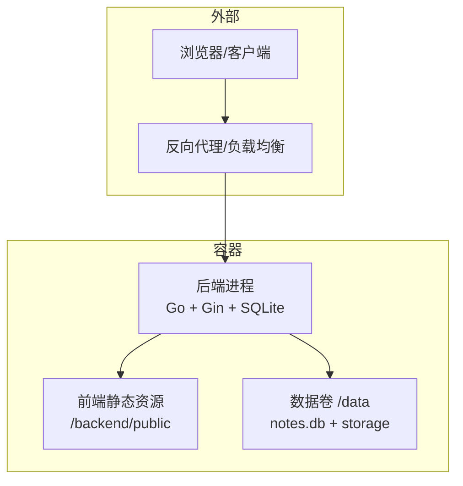
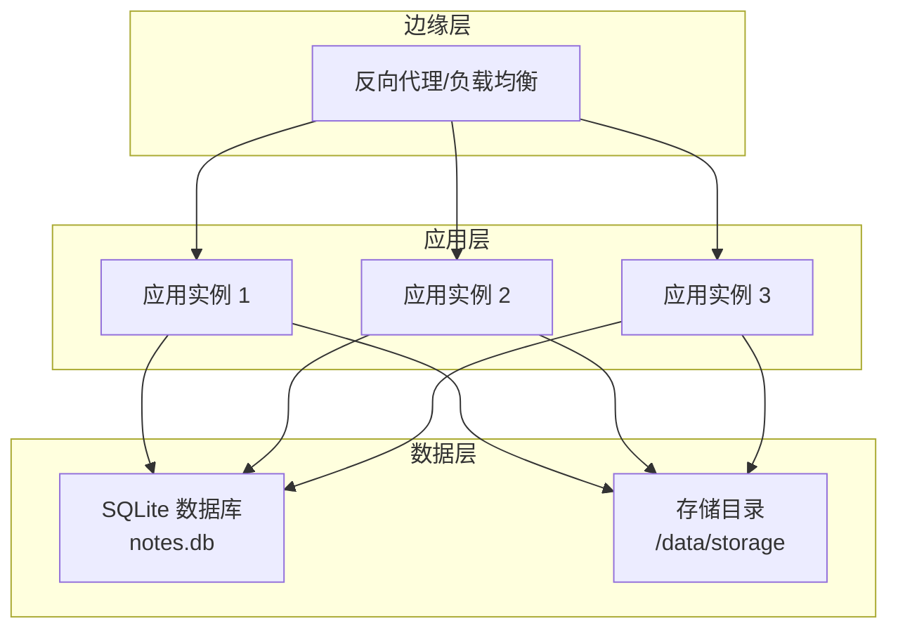
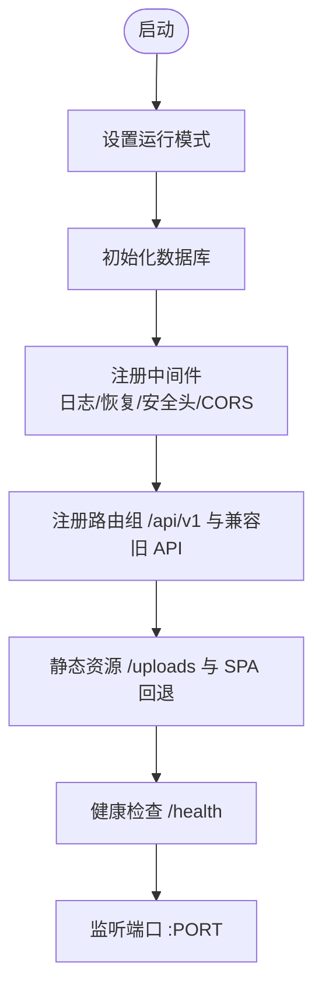
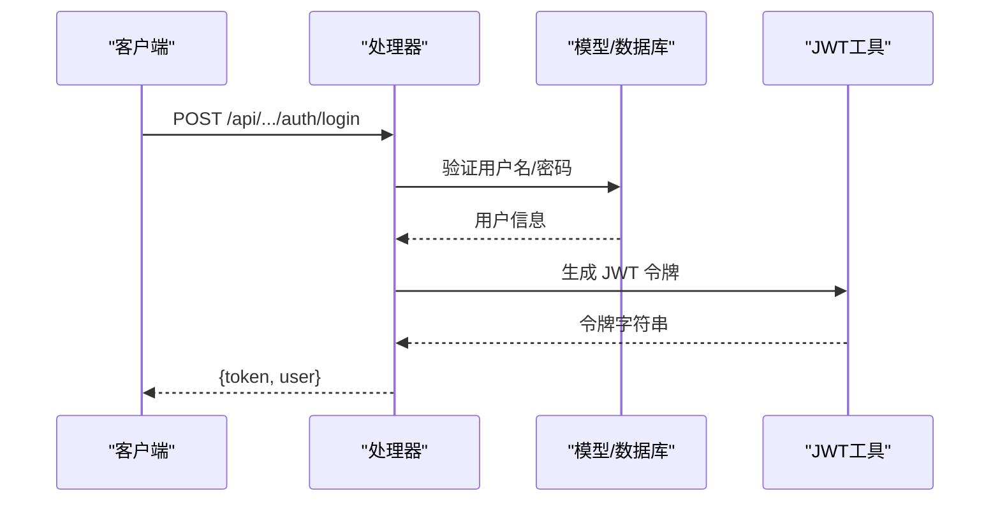
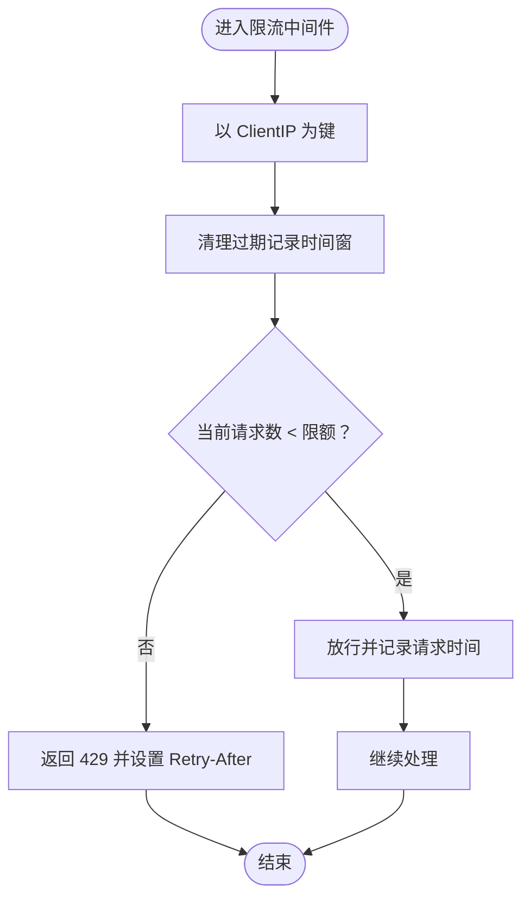
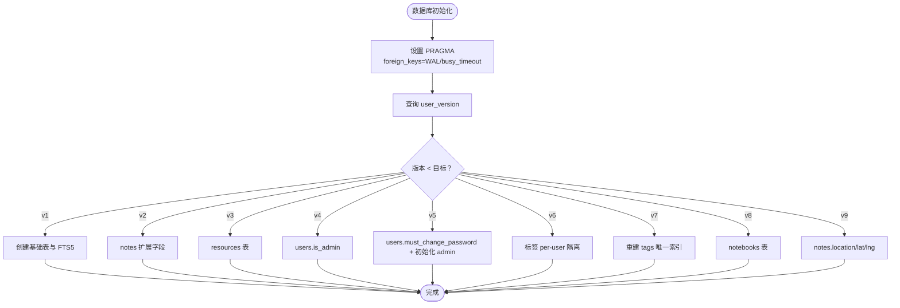
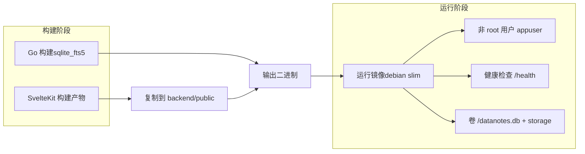
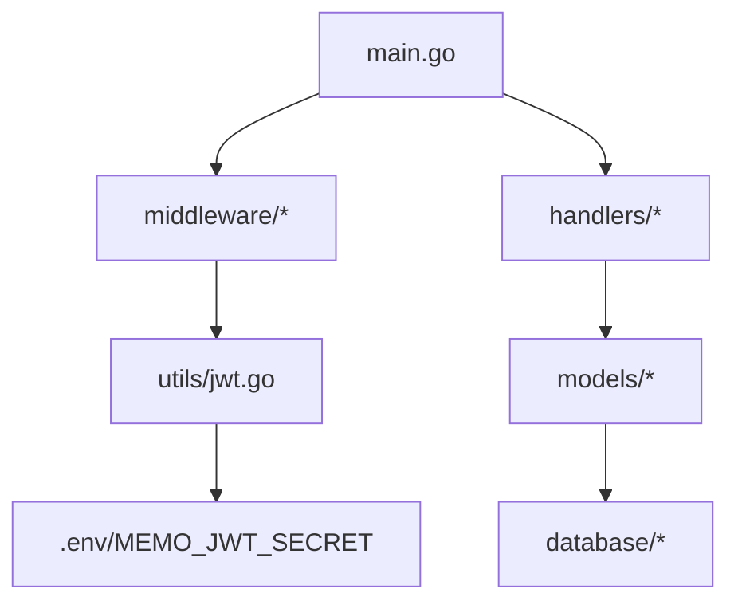

# 生产环境部署

<cite>
**本文引用的文件**
- [README.md](file://README.md)
- [backend/main.go](file://backend/main.go)
- [backend/database/database.go](file://backend/database/database.go)
- [backend/middleware/auth.go](file://backend/middleware/auth.go)
- [backend/middleware/ratelimit.go](file://backend/middleware/ratelimit.go)
- [backend/utils/jwt.go](file://backend/utils/jwt.go)
- [backend/handlers/auth.go](file://backend/handlers/auth.go)
- [Dockerfile](file://Dockerfile)
- [docker-compose.yml](file://docker-compose.yml)
- [start-prod.sh](file://start-prod.sh)
- [build-prod.sh](file://build-prod.sh)
- [deploy-docker.sh](file://deploy-docker.sh)
- [.env.example](file://.env.example)
- [check.sh](file://check.sh)
</cite>

## 目录
1. [简介](#简介)
2. [项目结构](#项目结构)
3. [核心组件](#核心组件)
4. [架构总览](#架构总览)
5. [详细组件分析](#详细组件分析)
6. [依赖关系分析](#依赖关系分析)
7. [性能考虑](#性能考虑)
8. [故障排查指南](#故障排查指南)
9. [结论](#结论)
10. [附录](#附录)

## 简介
本指南面向生产环境部署 Memo Studio，覆盖单机与集群部署方案、负载均衡与高可用、数据库配置与备份策略、网络安全与访问控制、容量规划与性能调优、上线流程与检查清单、以及运维监控与应急响应机制。Memo Studio 后端基于 Go + Gin + SQLite，采用 Docker 化交付，前端静态资源由后端托管，适合在单机或容器编排平台进行部署。

## 项目结构
- 后端（Go + Gin + SQLite）：入口文件负责路由、中间件、静态资源托管与健康检查。
- 前端（SvelteKit）：构建产物同步至后端 public 目录，由后端统一托管。
- 容器化：Dockerfile 分阶段构建前端与后端，运行时以非 root 用户执行，具备健康检查。
- 编排：docker-compose.yml 提供一键部署与数据卷挂载。

图表来源
- [Dockerfile](file://Dockerfile#L48-L79)
- [backend/main.go](file://backend/main.go#L285-L316)
- [docker-compose.yml](file://docker-compose.yml#L1-L25)

章节来源
- [README.md](file://README.md#L61-L128)
- [Dockerfile](file://Dockerfile#L1-L81)
- [docker-compose.yml](file://docker-compose.yml#L1-L25)

## 核心组件
- 应用服务器：基于 Gin 的 HTTP 服务，提供 /api/v1 与兼容旧 API，静态资源托管与 SPA 回退。
- 认证与授权：JWT 令牌签发与解析，中间件校验与管理员权限控制。
- 速率限制：基于内存的滑动窗口限流，保护公共接口。
- 数据库：SQLite（WAL 模式、外键开启、FTS5 支持），自动迁移与多版本 schema 升级。
- 容器与编排：多阶段构建、非 root 运行、健康检查、数据持久化卷。

章节来源
- [backend/main.go](file://backend/main.go#L28-L353)
- [backend/middleware/auth.go](file://backend/middleware/auth.go#L12-L71)
- [backend/middleware/ratelimit.go](file://backend/middleware/ratelimit.go#L11-L143)
- [backend/database/database.go](file://backend/database/database.go#L20-L178)
- [backend/utils/jwt.go](file://backend/utils/jwt.go#L11-L76)
- [Dockerfile](file://Dockerfile#L48-L79)

## 架构总览
生产部署推荐方案：
- 单机部署：使用 docker-compose 在单主机运行，数据通过卷持久化。
- 集群部署：在 Kubernetes 等编排平台部署，使用 Headless Service/Ingress 暴露服务，多副本横向扩展（注意 SQLite 的单实例限制）。
- 高可用与负载均衡：通过反向代理（Nginx/Traefik/Caddy）或云负载均衡器分发流量，结合健康检查与故障转移。
- 数据库与备份：SQLite 适合中小规模，建议定期备份 notes.db 与 storage 目录；若需高可用，需评估迁移到外部数据库或使用共享存储 + 主从复制方案。
- 网络安全：启用 HTTPS、合理配置 CORS、限制来源、使用强 JWT 密钥与短有效期令牌。

图表来源
- [backend/main.go](file://backend/main.go#L318-L353)
- [docker-compose.yml](file://docker-compose.yml#L1-L25)

## 详细组件分析

### 应用服务器与路由
- 启动逻辑：根据环境变量设置运行模式（release）、初始化数据库、注册中间件与路由组。
- 安全响应头：统一注入安全相关响应头。
- CORS：支持白名单配置，默认开发放开，生产建议明确配置。
- 静态资源与 SPA 回退：/uploads 挂载存储目录；/ 路由回退到 index.html。
- 健康检查：/health 公开端点，便于探活。
- 端口：默认 9000，可通过 PORT 环境变量调整。

图表来源
- [backend/main.go](file://backend/main.go#L28-L353)

章节来源
- [backend/main.go](file://backend/main.go#L28-L353)

### 认证与授权
- JWT 密钥：MEMO_JWT_SECRET 必须在生产环境设置，否则启动即终止。
- 登录/注册：验证凭据后签发令牌，返回用户信息。
- 中间件：鉴权中间件从 Authorization 提取 Bearer 令牌并解析；管理员中间件校验 is_admin。
- 令牌刷新：提供刷新逻辑以延长有效期。

图表来源
- [backend/handlers/auth.go](file://backend/handlers/auth.go#L27-L53)
- [backend/middleware/auth.go](file://backend/middleware/auth.go#L12-L52)
- [backend/utils/jwt.go](file://backend/utils/jwt.go#L29-L49)

章节来源
- [backend/utils/jwt.go](file://backend/utils/jwt.go#L11-L76)
- [backend/middleware/auth.go](file://backend/middleware/auth.go#L12-L71)
- [backend/handlers/auth.go](file://backend/handlers/auth.go#L27-L93)

### 速率限制
- 全局限流：默认每分钟 50 次，基于客户端 IP 的滑动窗口计数。
- 严格限流：特定端点可使用更严格的 30 次/分钟。
- 响应头：X-RateLimit-Limit 与 X-RateLimit-Remaining 用于告知剩余配额。

图表来源
- [backend/middleware/ratelimit.go](file://backend/middleware/ratelimit.go#L28-L121)

章节来源
- [backend/middleware/ratelimit.go](file://backend/middleware/ratelimit.go#L11-L143)

### 数据库与迁移
- SQLite 参数：外键开启、WAL 模式、忙等待超时。
- FTS5：通过构建标签启用全文检索，触发器维护一致性。
- 迁移：基于 user_version 的增量迁移，覆盖 v1-v9。
- 多用户隔离：v6-v7 迁移将标签唯一约束改为 per-user，避免全局冲突。
- 管理员初始化：v5 迁移引入 must_change_password，支持通过环境变量初始化 admin。

图表来源
- [backend/database/database.go](file://backend/database/database.go#L20-L178)

章节来源
- [backend/database/database.go](file://backend/database/database.go#L20-L178)

### 容器与编排
- 多阶段构建：前端构建产物复制到后端 public，后端以 sqlite_fts5 标签编译。
- 运行时：非 root 用户 appuser，设置 GIN_MODE、PORT、DB 路径与存储目录。
- 健康检查：通过 /health 探针。
- 数据持久化：/data 卷，包含 notes.db 与 storage。
- docker-compose：暴露 9000 端口，设置 MEMO_JWT_SECRET、管理员密码、CORS、GIN_MODE、MEMO_ENV 等。

图表来源
- [Dockerfile](file://Dockerfile#L1-L81)
- [docker-compose.yml](file://docker-compose.yml#L1-L25)

章节来源
- [Dockerfile](file://Dockerfile#L1-L81)
- [docker-compose.yml](file://docker-compose.yml#L1-L25)

## 依赖关系分析
- 组件耦合：路由层依赖中间件与处理器；处理器依赖模型与工具；模型依赖数据库层；JWT 工具依赖环境变量。
- 外部依赖：SQLite、gin、gin-cors、gin-jwt、bcrypt、go-sqlite3。
- 配置契约：MEMO_JWT_SECRET、MEMO_DB_PATH、MEMO_STORAGE_DIR、MEMO_CORS_ORIGINS、GIN_MODE、PORT、MEMO_ENV。

图表来源
- [backend/main.go](file://backend/main.go#L3-L21)
- [backend/utils/jwt.go](file://backend/utils/jwt.go#L11-L20)

章节来源
- [backend/main.go](file://backend/main.go#L3-L21)
- [backend/utils/jwt.go](file://backend/utils/jwt.go#L11-L20)

## 性能考虑
- 运行模式：生产设置 GIN_MODE=release，减少日志开销。
- 数据库参数：WAL 模式提升并发读写；busy_timeout 减少锁等待失败。
- 前端静态资源：构建后一次性托管，减少动态渲染压力。
- 速率限制：默认 50 次/分钟，可根据业务峰值调整。
- 扩展策略：
  - 单机：垂直扩容（CPU/内存/磁盘 IOPS）。
  - 集群：水平扩展应用实例，但需注意 SQLite 的单实例限制；可采用共享存储 + 主从或迁移到外部数据库。
- 缓存：可考虑在反向代理层增加静态资源缓存与压缩（gzip/br）。

章节来源
- [backend/main.go](file://backend/main.go#L29-L44)
- [backend/database/database.go](file://backend/database/database.go#L45-L52)
- [backend/middleware/ratelimit.go](file://backend/middleware/ratelimit.go#L88-L94)

## 故障排查指南
- 端口占用：9000/9001 被占用时，先释放再启动。
- 依赖缺失：Go 与 Node.js 版本不满足要求，或依赖未安装。
- 数据库问题：notes.db 损坏可删除后重启自动重建。
- 热更新：前端支持 HMR，后端可使用 Air 实现热重载。
- 健康检查：通过 /health 探针确认服务状态。
- 一键诊断：使用 check.sh 检查环境与端口占用情况。

章节来源
- [README.md](file://README.md#L446-L498)
- [check.sh](file://check.sh#L1-L126)

## 结论
Memo Studio 的生产部署以 Docker 化为核心，结合 Gin 的轻量与 SQLite 的易用性，适合中小规模与单机场景。对于高可用与大规模并发，建议在应用层采用反向代理与多副本，在数据层评估共享存储或外部数据库方案。务必配置强 JWT 密钥、HTTPS、CORS 白名单与定期备份策略，确保安全与稳定性。

## 附录

### 生产环境部署检查清单
- 环境变量
  - MEMO_JWT_SECRET：强密钥（32+ 字符）
  - MEMO_ADMIN_PASSWORD：初始化/重置管理员密码
  - MEMO_CORS_ORIGINS：生产环境建议显式配置
  - GIN_MODE=release
  - MEMO_ENV=production
  - PORT=9000
  - MEMO_DB_PATH=/data/notes.db
  - MEMO_STORAGE_DIR=/data/storage
- 安全加固
  - 启用 HTTPS（Nginx/Traefik/Caddy）
  - 配置防火墙仅开放 80/443 与 9000
  - 限制来源域名与方法头
- 数据备份
  - 备份 notes.db 与 /data/storage
  - 建议每日增量 + 周/月全量
- 监控与告警
  - 健康检查 /health
  - 日志采集与聚合
  - CPU/内存/磁盘/网络指标
- 上线流程
  - 生成强 JWT 密钥并写入 .env
  - docker compose build --no-cache
  - docker compose up -d
  - 等待 /health 就绪
  - 访问 http://host:9000 登录并修改默认密码

章节来源
- [README.md](file://README.md#L61-L128)
- [docker-compose.yml](file://docker-compose.yml#L7-L18)
- [deploy-docker.sh](file://deploy-docker.sh#L32-L92)
- [start-prod.sh](file://start-prod.sh#L13-L63)

### 单机部署（docker-compose）
- 生成 MEMO_JWT_SECRET 并写入 .env
- docker compose up -d
- 访问 http://host:9000

章节来源
- [deploy-docker.sh](file://deploy-docker.sh#L32-L92)
- [docker-compose.yml](file://docker-compose.yml#L1-L25)

### 集群部署（Kubernetes）
- 使用 docker-compose.yml 生成镜像并在集群中拉起
- 配置 Service/Ingress 暴露 9000 端口
- 使用 PVC 挂载 /data，确保数据持久化
- 配置探针：/health
- 注意：SQLite 为单实例，若需高可用，建议迁移到外部数据库或使用共享存储 + 主从复制

章节来源
- [Dockerfile](file://Dockerfile#L48-L79)
- [docker-compose.yml](file://docker-compose.yml#L1-L25)

### 负载均衡与高可用
- 反向代理：Nginx/Traefik/Caddy，开启 HTTPS、压缩与缓存
- 健康检查：/health
- 故障转移：多副本 + 健康检查失败自动摘除
- 会话：无状态应用，无需会话粘性

章节来源
- [backend/main.go](file://backend/main.go#L82-L85)
- [Dockerfile](file://Dockerfile#L76-L78)

### 数据库生产级配置
- SQLite 参数：WAL、外键、busy_timeout
- FTS5：启用全文检索
- 迁移：自动按版本升级
- 备份：定期备份 notes.db 与 storage 目录
- 主从复制/读写分离：SQLite 不支持原生复制，建议迁移到外部数据库或使用共享存储 + 主从

章节来源
- [backend/database/database.go](file://backend/database/database.go#L45-L52)
- [backend/database/database.go](file://backend/database/database.go#L243-L374)

### 网络安全配置
- CORS：生产环境显式配置允许来源
- JWT：强密钥，短有效期，支持刷新
- TLS：反向代理启用 HTTPS
- 访问控制：限制来源域名、方法与头

章节来源
- [backend/main.go](file://backend/main.go#L55-L80)
- [backend/utils/jwt.go](file://backend/utils/jwt.go#L11-L20)
- [backend/middleware/auth.go](file://backend/middleware/auth.go#L12-L52)

### 容量规划与性能调优
- 硬件：CPU/内存/磁盘 IOPS 根据并发与数据量评估
- 资源分配：容器设置 CPU/内存限制与请求
- 扩展策略：单机垂直扩容；集群水平扩展（注意 SQLite 单实例）
- 调优：WAL 模式、限流参数、静态资源缓存与压缩

章节来源
- [backend/database/database.go](file://backend/database/database.go#L45-L52)
- [backend/middleware/ratelimit.go](file://backend/middleware/ratelimit.go#L88-L94)
- [Dockerfile](file://Dockerfile#L50-L55)

### 上线流程与应急响应
- 上线流程：生成密钥 → 构建镜像 → 启动服务 → 健康检查 → 登录修改默认密码
- 应急响应：快速回滚、日志分析、备份恢复、临时降级

章节来源
- [deploy-docker.sh](file://deploy-docker.sh#L63-L92)
- [README.md](file://README.md#L115-L120)