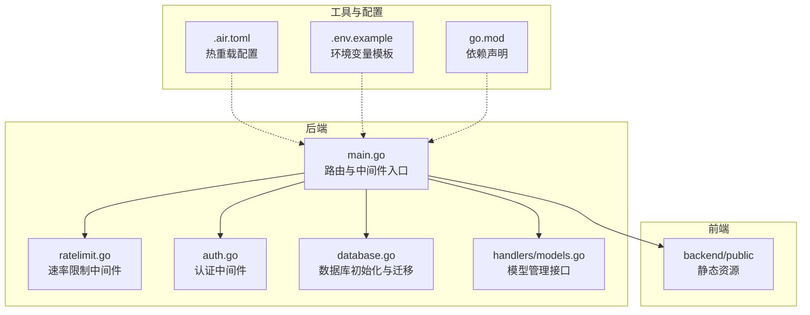
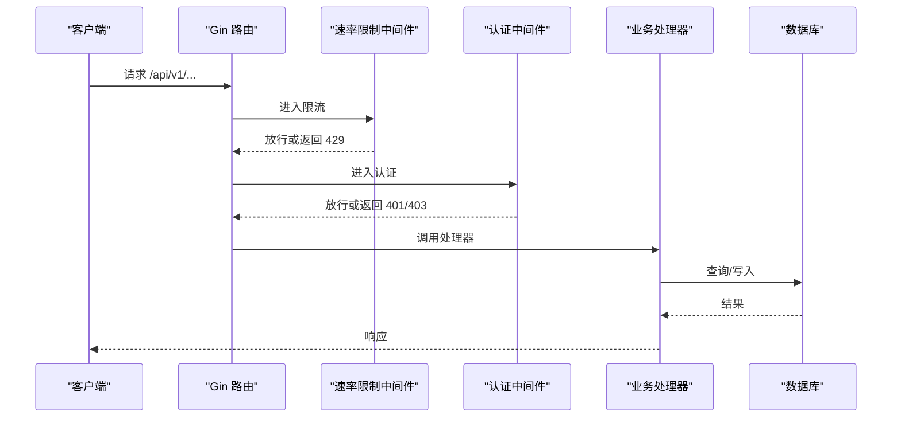
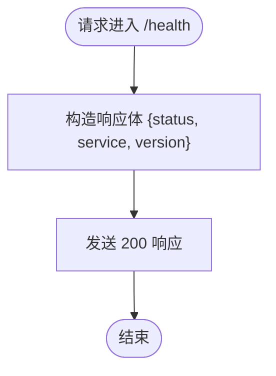
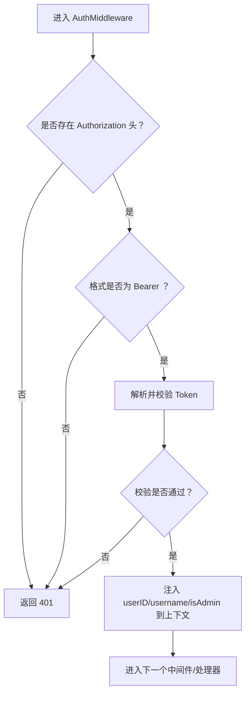
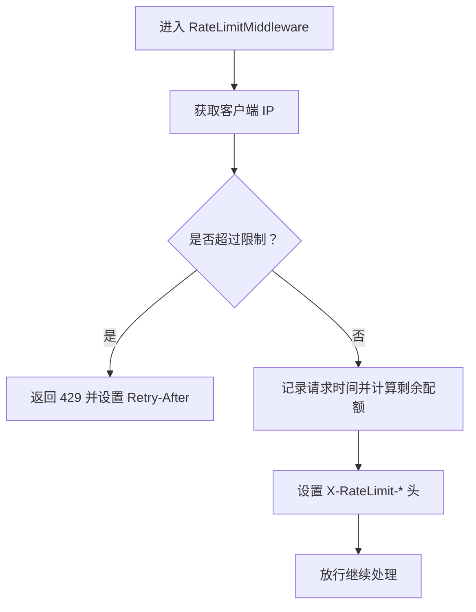
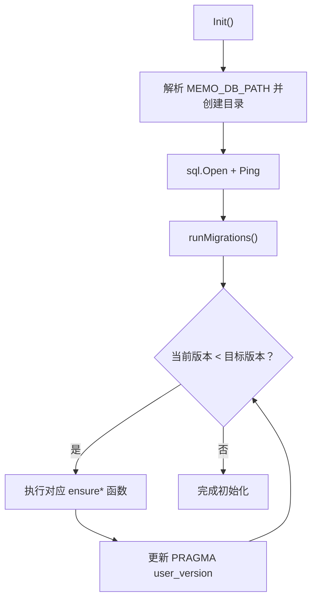
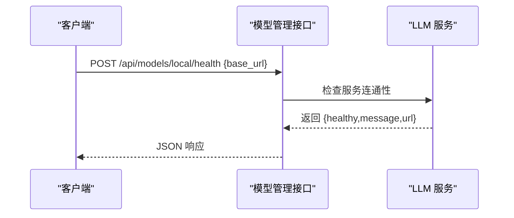
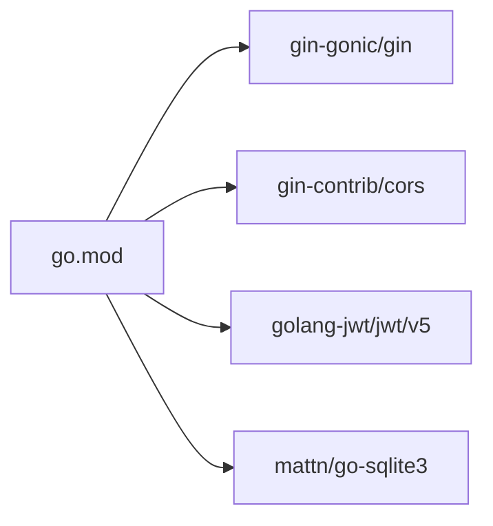

# 监控与日志

<cite>
**本文引用的文件**
- [backend/main.go](file://backend/main.go)
- [backend/middleware/auth.go](file://backend/middleware/auth.go)
- [backend/middleware/ratelimit.go](file://backend/middleware/ratelimit.go)
- [backend/database/database.go](file://backend/database/database.go)
- [backend/handlers/models.go](file://backend/handlers/models.go)
- [backend/log 文件](file://backend.log)
- [.env.example](file://.env.example)
- [backend/.air.toml](file://backend/.air.toml)
- [go.mod](file://backend/go.mod)
</cite>

## 目录
1. [简介](#简介)
2. [项目结构](#项目结构)
3. [核心组件](#核心组件)
4. [架构总览](#架构总览)
5. [详细组件分析](#详细组件分析)
6. [依赖关系分析](#依赖关系分析)
7. [性能考虑](#性能考虑)
8. [故障排查指南](#故障排查指南)
9. [结论](#结论)
10. [附录](#附录)

## 简介
本文件面向 Memo Studio 的运维团队，提供一套完整的监控与日志运维文档。内容覆盖应用日志结构与格式、健康检查机制、监控指标采集、性能监控关键指标、错误追踪与异常处理策略、日志分析工具与仪表板配置、告警与运维响应流程，以及日志轮转与长期存储策略。目标是帮助团队建立稳定、可观测、可诊断、可持续的运行体系。

## 项目结构
后端采用 Go + Gin 构建，提供 REST API 与静态资源服务；前端为 SvelteKit 构建产物，由后端统一托管。开发与热重载通过 air 工具配置。日志方面，后端在开发模式下输出 Gin 日志，在生产模式下可通过环境变量控制日志级别与行为。

图表来源
- [backend/main.go](file://backend/main.go#L28-L352)
- [backend/middleware/ratelimit.go](file://backend/middleware/ratelimit.go#L96-L121)
- [backend/middleware/auth.go](file://backend/middleware/auth.go#L12-L51)
- [backend/database/database.go](file://backend/database/database.go#L20-L60)
- [backend/handlers/models.go](file://backend/handlers/models.go#L164-L233)
- [backend/.air.toml](file://backend/.air.toml#L1-L48)
- [.env.example](file://.env.example#L1-L16)
- [go.mod](file://backend/go.mod#L1-L45)

章节来源
- [backend/main.go](file://backend/main.go#L28-L352)
- [backend/.air.toml](file://backend/.air.toml#L1-L48)
- [.env.example](file://.env.example#L1-L16)
- [go.mod](file://backend/go.mod#L1-L45)

## 核心组件
- 应用日志与健康检查
  - Gin Logger/Recovery 中间件在非 release 模式下输出访问日志；生产模式下可通过 GIN_MODE 控制。
  - 健康检查端点 /health 返回服务状态与版本信息。
- 认证与授权
  - Authorization 头解析与 JWT 校验；管理员权限兜底逻辑。
- 速率限制
  - 基于内存的滑动窗口限流，按客户端 IP 维度统计，支持全局与严格两种策略。
- 数据库初始化与迁移
  - SQLite 连接、PRAGMA 优化、多版本迁移与 FTS5 支持。
- 模型管理接口
  - 提供模型列表、可用性检测、本地模型健康检查等能力。
- 环境变量与配置
  - JWT 密钥、管理员密码、CORS 来源、端口、数据库路径等。

章节来源
- [backend/main.go](file://backend/main.go#L39-L85)
- [backend/middleware/auth.go](file://backend/middleware/auth.go#L12-L51)
- [backend/middleware/ratelimit.go](file://backend/middleware/ratelimit.go#L96-L142)
- [backend/database/database.go](file://backend/database/database.go#L20-L60)
- [backend/handlers/models.go](file://backend/handlers/models.go#L164-L233)
- [.env.example](file://.env.example#L1-L16)

## 架构总览
后端启动时完成数据库初始化、中间件注册、路由挂载与静态资源托管。健康检查端点对运维与容器编排非常友好。认证中间件负责鉴权，速率限制中间件在公开路由上生效，降低滥用风险。

图表来源
- [backend/main.go](file://backend/main.go#L94-L196)
- [backend/middleware/ratelimit.go](file://backend/middleware/ratelimit.go#L96-L121)
- [backend/middleware/auth.go](file://backend/middleware/auth.go#L12-L51)
- [backend/database/database.go](file://backend/database/database.go#L20-L60)

## 详细组件分析

### 访问日志与健康检查
- 访问日志
  - 开发模式下 Gin.Logger 输出请求耗时、客户端 IP、方法与路径等信息；生产模式下可通过 GIN_MODE=release 关闭调试日志。
  - 建议在生产环境统一接入外部日志系统（如 stdout/stderr + 容器日志驱动），并结合 JSON 格式化便于结构化采集。
- 健康检查
  - /health 返回状态码 200 与服务标识、版本信息，可用于容器探针与负载均衡健康检查。

图表来源
- [backend/main.go](file://backend/main.go#L82-L85)

章节来源
- [backend/main.go](file://backend/main.go#L39-L85)
- [backend/log 文件](file://backend.log#L1-L222)

### 错误日志与审计日志
- 错误日志
  - Gin.Recovery 中间件捕获 panic 并返回 500；数据库初始化失败会通过 log.Fatal 输出致命错误。
  - 建议将所有 log.Printf/log.Fatal 输出重定向至结构化日志系统，统一采集与告警。
- 审计日志
  - 当前代码未内置统一审计日志模块。建议在认证中间件与关键业务处理器中增加审计事件（如用户登录、模型切换、管理员操作等），并以结构化字段记录用户 ID、操作类型、结果、时间戳等。

章节来源
- [backend/main.go](file://backend/main.go#L35-L44)
- [backend/database/database.go](file://backend/database/database.go#L35-L37)

### 认证与授权中间件
- 认证中间件
  - 解析 Authorization 头，校验 Bearer Token；将用户信息注入上下文；管理员权限通过兜底查询用户表确认。
- 管理员权限
  - AdminOnly 中间件读取上下文中的 isAdmin 标记，拒绝非管理员访问。

图表来源
- [backend/middleware/auth.go](file://backend/middleware/auth.go#L12-L51)

章节来源
- [backend/middleware/auth.go](file://backend/middleware/auth.go#L12-L71)

### 速率限制中间件
- 实现要点
  - 基于内存 map + RWMutex 的滑动窗口限流，按客户端 IP 维度统计。
  - 提供全局限流（每分钟 50 次）与严格限流（每分钟 30 次）两种策略。
  - 在响应头中返回 X-RateLimit-Limit 与 X-RateLimit-Remaining，便于客户端与监控侧观察。
- 建议
  - 在高并发场景建议替换为基于 Redis 的分布式限流，或集成第三方限流组件（如 go-resiliency、gofiber 的限流器等）。

图表来源
- [backend/middleware/ratelimit.go](file://backend/middleware/ratelimit.go#L96-L121)

章节来源
- [backend/middleware/ratelimit.go](file://backend/middleware/ratelimit.go#L11-L143)

### 数据库初始化与迁移
- 初始化
  - 支持通过 MEMO_DB_PATH 指定数据库文件路径；自动创建目录；Ping 成功后执行迁移。
- 迁移
  - 通过 PRAGMA user_version 升级版本，逐步添加 notes 扩展字段、resources 表、users.admin、multi-user 隔离、tags 唯一约束、notebooks 表、location 字段等。
- 建议
  - 在生产环境开启 WAL 模式与合理的 busy_timeout；对迁移脚本进行幂等与回滚演练。

图表来源
- [backend/database/database.go](file://backend/database/database.go#L20-L60)
- [backend/database/database.go](file://backend/database/database.go#L62-L178)

章节来源
- [backend/database/database.go](file://backend/database/database.go#L20-L677)

### 模型管理接口与健康检查
- 模型管理
  - 提供模型列表、可用性检测、本地模型健康检查、设置当前模型等接口。
- 健康检查
  - 本地模型健康检查接口返回健康状态与消息，便于集成到探针或监控面板。

图表来源
- [backend/handlers/models.go](file://backend/handlers/models.go#L140-L162)

章节来源
- [backend/handlers/models.go](file://backend/handlers/models.go#L164-L233)
- [backend/handlers/models.go](file://backend/handlers/models.go#L140-L162)

## 依赖关系分析
- 运行时依赖
  - Gin、CORS、JWT、SQLite 驱动等。
- 开发与热重载
  - air 配置了构建命令、排除规则与日志输出，便于快速迭代。
- 环境变量
  - JWT 密钥、管理员密码、CORS 来源、端口、数据库路径等。

图表来源
- [go.mod](file://backend/go.mod#L5-L11)

章节来源
- [go.mod](file://backend/go.mod#L1-L45)
- [backend/.air.toml](file://backend/.air.toml#L8-L29)
- [.env.example](file://.env.example#L1-L16)

## 性能考虑
- 响应时间
  - Gin Logger 已记录单请求耗时；建议在网关或反向代理层补充 P95/P99 延迟指标，并结合业务处理器埋点细化端到端耗时。
- 吞吐量
  - 速率限制中间件可有效防止突发流量；建议配合水平扩展与连接池参数调优。
- 资源利用率
  - SQLite 在单实例下具备良好性价比；若并发写入较高，建议评估分片或读写分离策略。
- 数据库优化
  - 已启用 WAL 模式与 busy_timeout；可进一步评估索引与查询计划，避免全表扫描。

章节来源
- [backend/main.go](file://backend/main.go#L39-L44)
- [backend/database/database.go](file://backend/database/database.go#L45-L52)

## 故障排查指南
- 健康检查失败
  - 检查 /health 是否返回 200；若失败，查看后端日志定位初始化阶段错误（如数据库连接失败）。
- 认证失败
  - 确认 Authorization 头格式为 Bearer <token>；核对 JWT 密钥配置；检查用户是否存在且未被禁用。
- 速率限制触发
  - 查看响应头 X-RateLimit-Remaining；确认客户端是否超过阈值；必要时调整限流策略。
- 数据库异常
  - 检查 MEMO_DB_PATH 权限与磁盘空间；关注迁移过程中的版本号变化；必要时回滚到上一个版本。
- 日志采集
  - 确认 Gin 日志输出路径；在容器环境中将 stdout/stderr 重定向至日志系统；对敏感字段脱敏。

章节来源
- [backend/main.go](file://backend/main.go#L82-L85)
- [backend/middleware/auth.go](file://backend/middleware/auth.go#L12-L51)
- [backend/middleware/ratelimit.go](file://backend/middleware/ratelimit.go#L96-L121)
- [backend/database/database.go](file://backend/database/database.go#L20-L60)
- [backend/log 文件](file://backend.log#L1-L222)

## 结论
Memo Studio 的监控与日志体系以 Gin 中间件与 SQLite 为基础，具备基本的健康检查、访问日志、认证与限流能力。建议在生产环境中完善结构化日志、审计事件、指标采集与告警闭环，并针对数据库与模型服务引入更稳健的可观测性与弹性策略，以满足长期运维需求。

## 附录

### 日志结构与格式建议
- 访问日志
  - 建议统一输出 JSON 字段：timestamp、level、method、path、ip、latency_ms、status、user_agent、trace_id 等。
- 错误日志
  - 包含 error、stack_trace、request_id、component、severity 等字段，便于检索与告警。
- 审计日志
  - 字段示例：timestamp、user_id、operation、target、result、details、ip、ua、timestamp。

### 监控指标建议
- 基础指标
  - QPS、成功率、P50/P90/P95 延迟、错误率、速率限制触发次数。
- 资源指标
  - CPU、内存、文件句柄、磁盘 IO、数据库连接数、队列长度。
- 业务指标
  - 模型调用成功率、平均耗时、失败原因分布；用户活跃度、导入导出任务数。

### 日志分析工具与仪表板配置
- 工具
  - 日志采集：Fluent Bit/Fluentd/Vector；存储：ELK/S3/对象存储；可视化：Grafana/Kibana。
- 仪表板
  - 请求趋势、错误分布、慢查询 TopN、速率限制告警、数据库健康状态、模型服务可用性。

### 告警与运维响应流程
- 告警
  - 基于阈值与异常模式（如错误率突增、延迟超阈、健康检查失败）触发告警。
- 响应
  - 一线：快速核对健康检查与关键日志；二线：深入分析数据库与模型服务；三线：容量与架构评审。

### 日志轮转与存储策略
- 轮转
  - 使用 logrotate 或容器日志驱动的滚动策略；按大小与时间轮转，保留周期视合规要求而定。
- 存储
  - 本地短期保留，远期归档至对象存储；对敏感日志进行加密与脱敏。