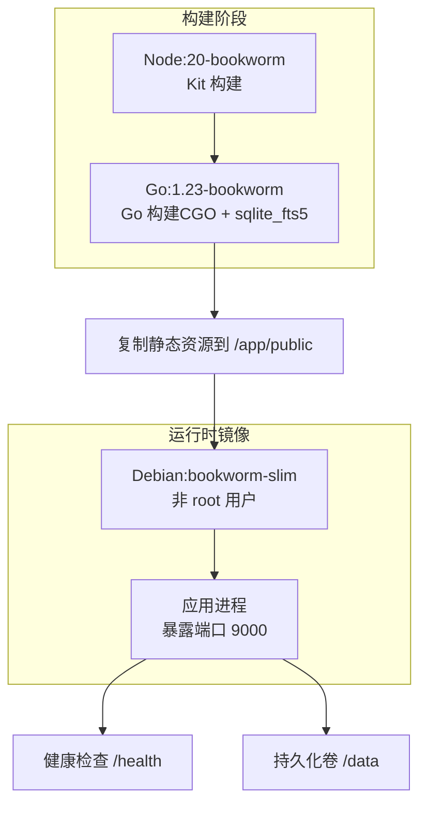
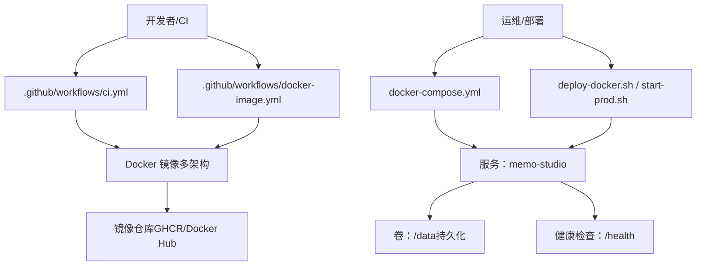
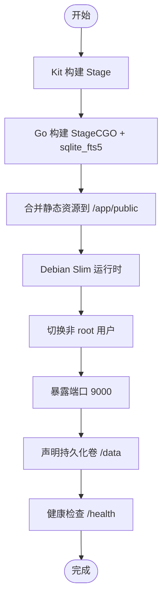
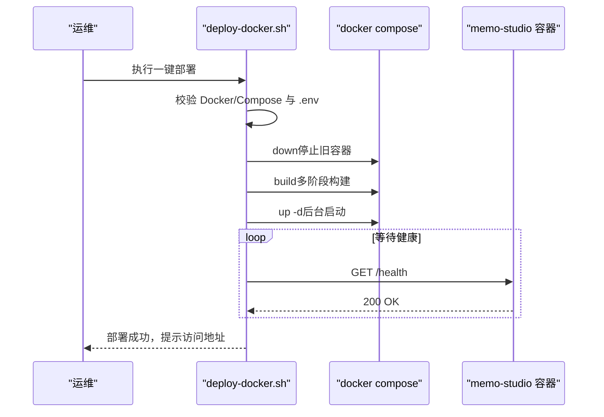
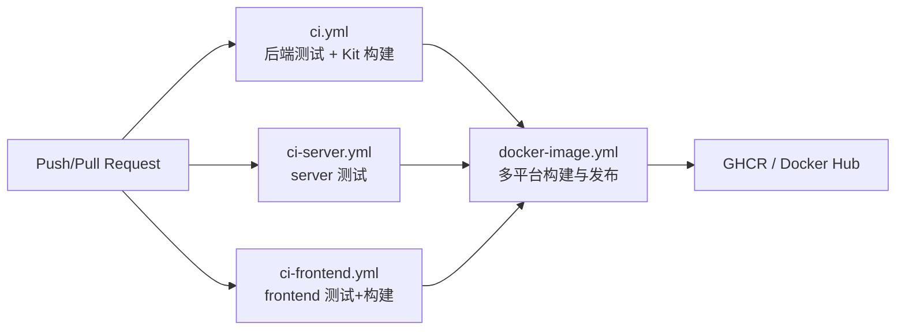
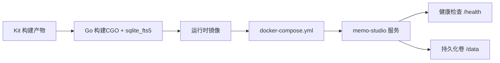

# 部署与运维

<cite>
**本文引用的文件**
- [Dockerfile](file://Dockerfile)
- [docker-compose.yml](file://docker-compose.yml)
- [.dockerignore](file://.dockerignore)
- [.env.example](file://.env.example)
- [build-prod.sh](file://build-prod.sh)
- [deploy-docker.sh](file://deploy-docker.sh)
- [start-prod.sh](file://start-prod.sh)
- [check.sh](file://check.sh)
- [.github/workflows/ci.yml](file://.github/workflows/ci.yml)
- [.github/workflows/docker-image.yml](file://.github/workflows/docker-image.yml)
- [.github/workflows/ci-server.yml](file://.github/workflows/ci-server.yml)
- [.github/workflows/ci-frontend.yml](file://.github/workflows/ci-frontend.yml)
- [.github/dependabot.yml](file://.github/dependabot.yml)
</cite>

## 目录
1. [简介](#简介)
2. [项目结构](#项目结构)
3. [核心组件](#核心组件)
4. [架构总览](#架构总览)
5. [详细组件分析](#详细组件分析)
6. [依赖关系分析](#依赖关系分析)
7. [性能考量](#性能考量)
8. [故障排查指南](#故障排查指南)
9. [结论](#结论)
10. [附录](#附录)

## 简介
本文件面向 Memo Studio 的部署与运维团队，系统化阐述容器化部署、CI/CD 流程、环境配置管理、监控与日志、生产级高可用策略、运维最佳实践以及扩展与容量规划。内容基于仓库中的 Dockerfile、docker-compose.yml、Shell 脚本与 GitHub Actions 工作流，确保可操作、可验证、可复现。

## 项目结构
Memo Studio 采用“后端 Go + 前端 SvelteKit”的双栈架构，并通过多阶段 Dockerfile 将前端静态资源内嵌至 Go 二进制中，最终以 Debian Slim 运行时镜像交付。开发与生产均提供一键脚本与 Compose 编排，便于快速部署与验证。

图表来源
- [Dockerfile](file://Dockerfile#L1-L81)

章节来源
- [Dockerfile](file://Dockerfile#L1-L81)
- [docker-compose.yml](file://docker-compose.yml#L1-L25)

## 核心组件
- 多阶段构建：前端 SvelteKit 在独立 Stage 构建，后端 Go 在另一 Stage 构建并启用 sqlite_fts5；最终合并至精简运行时镜像。
- 运行时安全：非 root 用户执行，设置时区与证书，声明健康检查与持久化卷。
- 一键部署：提供 Docker Compose 本地编排与一键部署脚本，自动校验环境、生成密钥、等待健康状态。
- CI/CD：按模块拆分流水线，分别覆盖后端、Kit、前端与 Docker 镜像发布；支持多平台构建与缓存加速。
- 环境配置：.env.example 提供关键变量模板，Compose 注入运行时环境变量并挂载数据卷。

章节来源
- [Dockerfile](file://Dockerfile#L1-L81)
- [docker-compose.yml](file://docker-compose.yml#L1-L25)
- [.env.example](file://.env.example#L1-L16)
- [deploy-docker.sh](file://deploy-docker.sh#L1-L92)

## 架构总览
下图展示从代码到生产运行的整体路径：开发者在本地或 CI 中触发构建，生成多架构 Docker 镜像并推送至镜像仓库；运维通过 Compose 或单机脚本在目标主机上拉起服务，持久化数据卷，对外提供健康检查与访问入口。

图表来源
- [.github/workflows/ci.yml](file://.github/workflows/ci.yml#L1-L60)
- [.github/workflows/docker-image.yml](file://.github/workflows/docker-image.yml#L1-L103)
- [docker-compose.yml](file://docker-compose.yml#L1-L25)
- [deploy-docker.sh](file://deploy-docker.sh#L1-L92)
- [start-prod.sh](file://start-prod.sh#L1-L63)

## 详细组件分析

### 容器化与多阶段构建
- 前端构建：使用 Node:20-bookworm Stage，安装依赖并执行构建，产物输出至 kit/build。
- 后端构建：使用 golang:1.23-bookworm Stage，启用 CGO 与 sqlite_fts5 标签，下载依赖后编译出二进制。
- 镜像优化：最终运行时采用 debian:bookworm-slim，仅包含必要运行时库；设置非 root 用户、时区与证书；声明健康检查与持久化卷。
- 静态资源内嵌：将 kit/build 复制到 backend/public，由后端作为静态资源提供。

图表来源
- [Dockerfile](file://Dockerfile#L1-L81)

章节来源
- [Dockerfile](file://Dockerfile#L1-L81)

### 卷挂载与持久化
- 数据库与存储：通过 /data 挂载持久化 notes.db 与 storage 目录，避免容器重建丢失数据。
- .dockerignore：排除 node_modules、构建产物与敏感文件，减少镜像体积与泄露风险。
- 运行时目录：在切换用户前创建 /data 并赋予 appuser 权限，确保写入能力。

章节来源
- [Dockerfile](file://Dockerfile#L60-L74)
- [.dockerignore](file://.dockerignore#L1-L14)
- [docker-compose.yml](file://docker-compose.yml#L19-L21)

### 环境变量与配置管理
- 关键变量（.env.example）：JWT 密钥、管理员密码、CORS 域名、环境模式等。
- Compose 注入：在服务环境块中注入 MEMO_JWT_SECRET、MEMO_ADMIN_PASSWORD、MEMO_CORS_ORIGINS、GIN_MODE、MEMO_ENV 等。
- 默认值与覆盖：Compose 为端口、数据库路径、存储目录提供默认值，便于快速启动。

章节来源
- [.env.example](file://.env.example#L1-L16)
- [docker-compose.yml](file://docker-compose.yml#L7-L18)

### 健康检查与运行时行为
- 健康检查：每 30 秒探测一次 /health，启动期 10 秒宽限，最多重试 3 次。
- 进程模型：CMD 直接启动二进制；生产脚本在后台启动并等待健康后再打开浏览器。
- 端口暴露：容器内监听 9000，Compose 映射至宿主 9000。

章节来源
- [Dockerfile](file://Dockerfile#L76-L79)
- [start-prod.sh](file://start-prod.sh#L43-L59)
- [docker-compose.yml](file://docker-compose.yml#L5-L6)

### 一键部署与启动脚本
- deploy-docker.sh：检查 Docker/Compose、生成/校验 .env、停止旧容器、构建镜像、启动服务、轮询健康检查、输出访问提示。
- start-prod.sh：若无 dist/memo-studio 则先构建，再以后台方式启动并等待健康检查，随后尝试打开浏览器。

图表来源
- [deploy-docker.sh](file://deploy-docker.sh#L1-L92)
- [docker-compose.yml](file://docker-compose.yml#L1-L25)

章节来源
- [deploy-docker.sh](file://deploy-docker.sh#L1-L92)
- [start-prod.sh](file://start-prod.sh#L1-L63)

### CI/CD 工作流设计
- 统一 CI（ci.yml）：后端 Go（sqlite_fts5）、Kit 前端（测试+构建）。
- 模块化 CI：server 与 frontend 分别进行测试与构建，限定触发路径，提升效率。
- 镜像发布（docker-image.yml）：支持 GHCR 与 Docker Hub，多平台（amd64/arm64）构建，启用 Buildx 与缓存。

图表来源
- [.github/workflows/ci.yml](file://.github/workflows/ci.yml#L1-L60)
- [.github/workflows/ci-server.yml](file://.github/workflows/ci-server.yml#L1-L41)
- [.github/workflows/ci-frontend.yml](file://.github/workflows/ci-frontend.yml#L1-L42)
- [.github/workflows/docker-image.yml](file://.github/workflows/docker-image.yml#L1-L103)

章节来源
- [.github/workflows/ci.yml](file://.github/workflows/ci.yml#L1-L60)
- [.github/workflows/ci-server.yml](file://.github/workflows/ci-server.yml#L1-L41)
- [.github/workflows/ci-frontend.yml](file://.github/workflows/ci-frontend.yml#L1-L42)
- [.github/workflows/docker-image.yml](file://.github/workflows/docker-image.yml#L1-L103)

### 依赖更新与安全基线
- Dependabot：针对 backend/gomod、kit/frontend/server/web 与根目录 npm，每周自动发起补丁/小版本更新 PR，并限制并发数量。
- 仓库安全：.dockerignore 排除敏感文件与构建产物，降低泄露面。

章节来源
- [.github/dependabot.yml](file://.github/dependabot.yml#L1-L106)
- [.dockerignore](file://.dockerignore#L1-L14)

### 生产部署策略（高可用、负载均衡、故障转移）
- 负载均衡：通过反向代理（如 Nginx/Traefik/Caddy）对多个 memo-studio 实例进行轮询或会话亲和。
- 高可用：多副本部署，结合健康检查与自动重启策略；使用外部数据库（如 PostgreSQL）替代 SQLite 以满足多实例共享。
- 故障转移：结合外部负载均衡器与健康探针，异常节点自动摘除；持久化卷与配置中心保障滚动升级。
- 证书与域名：在反向代理层配置 TLS 与域名解析，确保 HTTPS 与安全传输。

[本节为通用生产建议，不直接分析具体文件，故无章节来源]

### 监控与日志
- 应用日志：容器标准输出即应用日志，建议接入集中式日志系统（如 ELK/Fluent Bit/Loki）采集与聚合。
- 错误追踪：结合健康检查失败与容器重启次数统计，建立告警阈值；对 5xx 与异常响应码进行告警。
- 性能监控：采集 CPU、内存、磁盘 IO、连接数与请求延迟；结合业务指标（搜索命中率、LLM 调用耗时）进行容量评估。

[本节为通用监控建议，不直接分析具体文件，故无章节来源]

### 运维最佳实践
- 备份策略：定期导出 notes.db 与 storage 目录；对关键配置（JWT 密钥、管理员密码）进行加密备份。
- 安全加固：最小权限原则（非 root）、只读根文件系统、禁用不必要的网络端口、启用 HTTPS、定期更新镜像与系统补丁。
- 性能调优：合理设置 GOMAXPROCS、连接池大小、查询索引与 FTS5 搜索参数；对静态资源启用 CDN 与缓存头。

[本节为通用运维建议，不直接分析具体文件，故无章节来源]

## 依赖关系分析
- 构建链路：Kit 构建产物 → Go 构建（CGO + sqlite_fts5）→ 运行时镜像。
- 运行链路：Compose/脚本启动 → 健康检查 → 对外提供服务 → 持久化卷。
- CI 链路：PR/Push 触发 → 多工作流并行 → 镜像构建与发布。

图表来源
- [Dockerfile](file://Dockerfile#L1-L81)
- [docker-compose.yml](file://docker-compose.yml#L1-L25)

章节来源
- [Dockerfile](file://Dockerfile#L1-L81)
- [docker-compose.yml](file://docker-compose.yml#L1-L25)

## 性能考量
- 镜像体积：多阶段构建与 slim 基础镜像显著减小镜像体积，缩短拉取时间。
- 构建缓存：Go 与 npm 依赖分层缓存，减少重复下载；Buildx 多平台缓存提升效率。
- 运行时优化：非 root 用户与最小权限；健康检查与重启策略保障稳定性。
- 前端静态内嵌：减少后端静态资源分发复杂度，降低跨域与缓存配置成本。

章节来源
- [Dockerfile](file://Dockerfile#L18-L45)
- [.github/workflows/docker-image.yml](file://.github/workflows/docker-image.yml#L44-L53)

## 故障排查指南
- 环境检查：使用诊断脚本检查 Go/Node/npm 版本、端口占用、依赖存在性与日志文件。
- 日志定位：查看容器日志与后端日志文件；关注健康检查失败与启动超时。
- 配置核对：确认 .env 中 JWT 密钥、管理员密码、CORS 域名与运行模式；核对 Compose 环境变量覆盖顺序。
- 端口与卷：确认宿主机端口未被占用；确认 /data 卷权限与持久化生效。

章节来源
- [check.sh](file://check.sh#L1-L126)
- [deploy-docker.sh](file://deploy-docker.sh#L70-L82)
- [.env.example](file://.env.example#L1-L16)
- [docker-compose.yml](file://docker-compose.yml#L7-L18)

## 结论
Memo Studio 的部署体系以多阶段 Docker 构建为核心，配合模块化 CI/CD 与一键部署脚本，实现了从开发到生产的高效闭环。通过健康检查、持久化卷与 Compose 编排，可快速搭建稳定的服务实例。建议在生产环境中引入反向代理、外部数据库与集中式监控，进一步提升可用性与可观测性。

## 附录

### 关键变量清单（来自 .env.example 与 docker-compose.yml）
- MEMO_JWT_SECRET：必需，用于签发与校验 JWT。
- MEMO_ADMIN_PASSWORD：可选，初始化/重置管理员密码。
- MEMO_CORS_ORIGINS：可选，前端域名列表（逗号分隔）。
- GIN_MODE：运行模式（release/test/debug）。
- MEMO_ENV：环境标识（如 production）。
- PORT：服务监听端口（默认 9000）。
- MEMO_DB_PATH：SQLite 数据库存储路径（默认 /data/notes.db）。
- MEMO_STORAGE_DIR：资源存储目录（默认 /data/storage）。

章节来源
- [.env.example](file://.env.example#L1-L16)
- [docker-compose.yml](file://docker-compose.yml#L7-L18)

### 一键脚本与职责
- build-prod.sh：本地构建前端产物并同步至 backend/public，随后编译 Go 二进制至 dist。
- deploy-docker.sh：自动化部署，含环境校验、镜像构建、服务启动与健康检查等待。
- start-prod.sh：生产启动脚本，自动构建与后台启动，等待健康后打开浏览器。

章节来源
- [build-prod.sh](file://build-prod.sh#L1-L33)
- [deploy-docker.sh](file://deploy-docker.sh#L1-L92)
- [start-prod.sh](file://start-prod.sh#L1-L63)