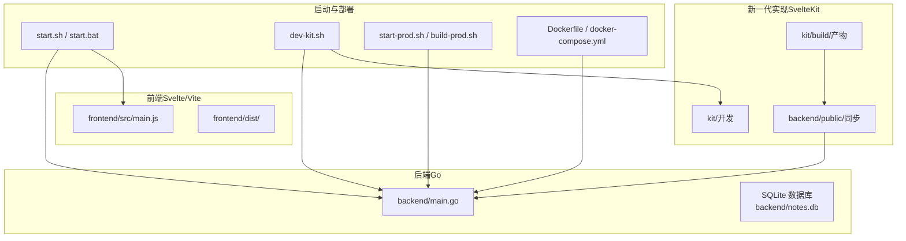
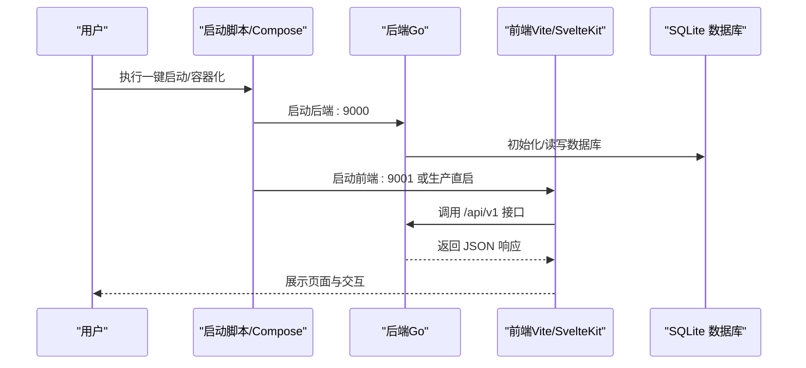
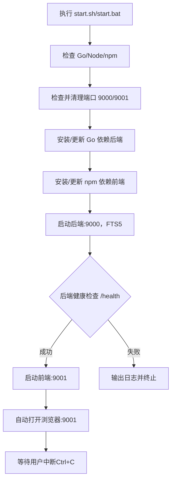
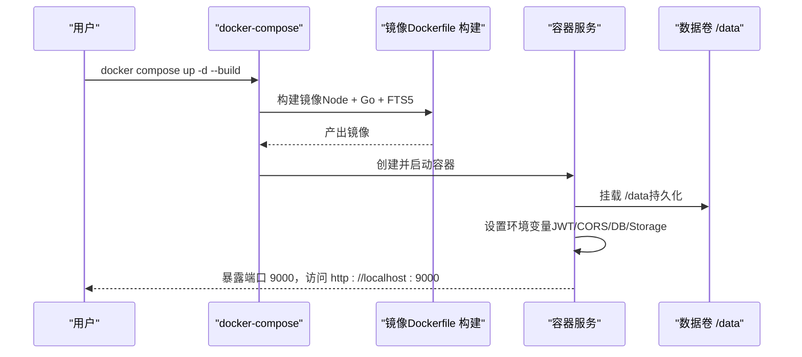
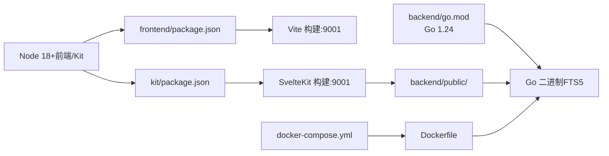

# 快速开始指南

<cite>
**本文引用的文件**
- [README.md](file://README.md)
- [start.sh](file://start.sh)
- [start.bat](file://start.bat)
- [dev-kit.sh](file://dev-kit.sh)
- [start-prod.sh](file://start-prod.sh)
- [build-prod.sh](file://build-prod.sh)
- [Dockerfile](file://Dockerfile)
- [docker-compose.yml](file://docker-compose.yml)
- [.env.example](file://.env.example)
- [backend/go.mod](file://backend/go.mod)
- [frontend/package.json](file://frontend/package.json)
- [kit/package.json](file://kit/package.json)
- [backend/main.go](file://backend/main.go)
- [backend/.air.toml](file://backend/.air.toml)
- [frontend/src/main.js](file://frontend/src/main.js)
</cite>

## 目录
1. [简介](#简介)
2. [项目结构](#项目结构)
3. [核心组件](#核心组件)
4. [架构总览](#架构总览)
5. [详细组件分析](#详细组件分析)
6. [依赖关系分析](#依赖关系分析)
7. [性能注意事项](#性能注意事项)
8. [故障排除指南](#故障排除指南)
9. [结论](#结论)
10. [附录](#附录)

## 简介
Memo Studio 是一款简洁美观的跨端笔记应用，支持 H5 与 Web 端，具备响应式设计、明暗主题、标签系统、用户认证与 AI 辅助能力。本指南面向新用户，提供从零开始的开发环境搭建、三种启动方式（一键脚本、Docker 容器化、手动开发环境）与平台差异说明，并给出首次使用流程、常见问题排查与最佳实践，帮助你在约 30 分钟内成功运行项目。

## 项目结构
项目采用前后端分离与多入口的组织方式：
- 后端（Go + Gin + SQLite）位于 backend/，提供 REST API 与静态资源托管
- 前端（Svelte + Vite）位于 frontend/，用于传统 SPA
- 新一代实现（Go 托管 SvelteKit 静态文件）位于 kit/，通过构建脚本同步至 backend/public
- 一键启动脚本与 Docker 配置位于仓库根目录

图表来源
- [backend/main.go](file://backend/main.go#L28-L200)
- [frontend/src/main.js](file://frontend/src/main.js#L1-L20)
- [kit/package.json](file://kit/package.json#L1-L20)
- [build-prod.sh](file://build-prod.sh#L1-L33)
- [start.sh](file://start.sh#L1-L238)
- [dev-kit.sh](file://dev-kit.sh#L1-L133)
- [start-prod.sh](file://start-prod.sh#L1-L63)
- [Dockerfile](file://Dockerfile#L1-L81)
- [docker-compose.yml](file://docker-compose.yml#L1-L25)

章节来源
- [README.md](file://README.md#L254-L273)

## 核心组件
- 后端服务（Go + Gin）
  - 提供健康检查、CORS、鉴权中间件、静态资源托管与完整 API v1
  - 支持 SQLite FTS5（全文检索）与附件上传
- 前端应用（Svelte + Vite）
  - SPA 应用，负责用户界面与交互
- 新一代实现（SvelteKit）
  - 通过构建脚本将静态产物同步到 backend/public，由后端统一托管
- 启动脚本与容器化
  - start.sh/start.bat：一键安装依赖、检查端口、启动后端与前端
  - dev-kit.sh：Go + SvelteKit 开发模式（:9000 API，:9001 前端）
  - start-prod.sh/build-prod.sh：生产构建 + 一键启动
  - Dockerfile/docker-compose.yml：容器化部署与数据持久化

章节来源
- [backend/main.go](file://backend/main.go#L28-L200)
- [frontend/src/main.js](file://frontend/src/main.js#L1-L20)
- [kit/package.json](file://kit/package.json#L1-L20)
- [build-prod.sh](file://build-prod.sh#L1-L33)
- [start.sh](file://start.sh#L1-L238)
- [dev-kit.sh](file://dev-kit.sh#L1-L133)
- [start-prod.sh](file://start-prod.sh#L1-L63)
- [Dockerfile](file://Dockerfile#L1-L81)
- [docker-compose.yml](file://docker-compose.yml#L1-L25)

## 架构总览
下图展示了三种启动方式的端到端流程与组件交互：

图表来源
- [start.sh](file://start.sh#L124-L218)
- [dev-kit.sh](file://dev-kit.sh#L70-L119)
- [start-prod.sh](file://start-prod.sh#L43-L61)
- [backend/main.go](file://backend/main.go#L82-L196)
- [Dockerfile](file://Dockerfile#L48-L79)

## 详细组件分析

### 一键启动脚本（推荐）
- 适用场景
  - 快速体验与本地开发
  - 自动检查 Go/Node/npm、安装依赖、端口占用处理、健康检查与浏览器自动打开
- 平台差异
  - macOS/Linux：使用 start.sh，自动打开浏览器、后台启动、日志输出到 backend.log/frontend.log
  - Windows：使用 start.bat，后台启动后端，前台运行前端，关闭窗口停止服务
- 启动流程概览

图表来源
- [start.sh](file://start.sh#L29-L238)
- [start.bat](file://start.bat#L7-L77)

章节来源
- [start.sh](file://start.sh#L13-L32)
- [start.bat](file://start.bat#L5-L31)

### Docker 容器化部署（推荐）
- 适用场景
  - NAS/服务器自部署、数据持久化、多架构镜像
- 配置要点
  - 必填：MEMO_JWT_SECRET（生产必须设置）
  - 推荐：MEMO_ADMIN_PASSWORD（初始化/重置管理员密码）
  - 环境变量：PORT、MEMO_DB_PATH、MEMO_STORAGE_DIR、MEMO_CORS_ORIGINS、GIN_MODE、MEMO_ENV
- 启动方式
  - docker run：最小可运行示例
  - docker compose：推荐，使用 docker-compose.yml 与 .env
- 容器特性
  - 非 root 用户运行、健康检查、数据卷 /data（notes.db 与 storage）

图表来源
- [Dockerfile](file://Dockerfile#L1-L81)
- [docker-compose.yml](file://docker-compose.yml#L1-L25)
- [README.md](file://README.md#L61-L128)

章节来源
- [README.md](file://README.md#L61-L128)
- [Dockerfile](file://Dockerfile#L48-L79)
- [docker-compose.yml](file://docker-compose.yml#L1-L25)
- [.env.example](file://.env.example#L1-L16)

### 手动开发环境搭建
- 后端（Go）
  - 进入 backend/，安装依赖并运行主程序
  - 端口：:9000
- 前端（Svelte + Vite）
  - 进入 frontend/，安装依赖并启动开发服务器
  - 端口：:9001
- 热更新
  - 前端：Vite HMR，默认支持
  - 后端：可选 Air 实现热重载，或手动重启

章节来源
- [README.md](file://README.md#L226-L246)
- [backend/.air.toml](file://backend/.air.toml#L1-L48)

### 新一代实现（Go + SvelteKit）
- 开发模式
  - dev-kit.sh：启动后端（:9000，FTS5）与 SvelteKit 前端（:9001）
  - 适合需要 SvelteKit 能力（路由、适配器等）的开发者
- 生产模式
  - build-prod.sh：构建 SvelteKit 静态产物并同步到 backend/public
  - start-prod.sh：直接运行 Go 二进制，前端静态由后端托管
  - 适合希望以单一二进制提供服务的部署场景

章节来源
- [dev-kit.sh](file://dev-kit.sh#L1-L133)
- [start-prod.sh](file://start-prod.sh#L1-L63)
- [build-prod.sh](file://build-prod.sh#L1-L33)
- [backend/main.go](file://backend/main.go#L23-L26)

## 依赖关系分析
- 运行时依赖
  - Go 1.21+（go.mod 指定 1.24）
  - Node.js 18+（前端/Kit 使用 Vite/Svelte）
  - npm/yarn（任选其一）
- 构建与运行
  - Dockerfile 使用多阶段构建：Node 构建 SvelteKit 静态，Go 编译带 sqlite_fts5 的二进制
  - docker-compose.yml 定义服务、环境变量与数据卷
- 版本与兼容性
  - Go 版本：backend/go.mod 指定 1.24
  - Node 版本：Dockerfile 使用 node:20-bookworm；kit/package.json 使用 @sveltejs/kit^2.50.2

图表来源
- [backend/go.mod](file://backend/go.mod#L1-L45)
- [frontend/package.json](file://frontend/package.json#L1-L25)
- [kit/package.json](file://kit/package.json#L1-L20)
- [Dockerfile](file://Dockerfile#L1-L81)
- [docker-compose.yml](file://docker-compose.yml#L1-L25)

章节来源
- [backend/go.mod](file://backend/go.mod#L3-L11)
- [frontend/package.json](file://frontend/package.json#L1-L25)
- [kit/package.json](file://kit/package.json#L1-L20)
- [Dockerfile](file://Dockerfile#L1-L81)
- [docker-compose.yml](file://docker-compose.yml#L1-L25)

## 性能注意事项
- 端口占用与健康检查
  - 一键脚本会在启动前后检查并清理端口 9000/9001，等待后端 /health 就绪再启动前端
- Go 代理与依赖下载
  - start.sh/dev-kit.sh 内置 GOPROXY 国内镜像与备用代理，加速依赖拉取
- 生产构建
  - build-prod.sh 使用 rsync 或 cp 同步静态产物，减少不必要的文件操作
- Docker 安全与健康检查
  - 非 root 用户运行、健康检查、数据卷持久化，提升稳定性与安全性

章节来源
- [start.sh](file://start.sh#L71-L165)
- [dev-kit.sh](file://dev-kit.sh#L43-L95)
- [build-prod.sh](file://build-prod.sh#L19-L24)
- [Dockerfile](file://Dockerfile#L48-L79)

## 故障排除指南
- 端口被占用
  - 现象：启动超时或失败
  - 处理：脚本会尝试清理，若失败请手动查询并结束占用进程
- 依赖安装失败
  - Go 依赖：进入 backend/ 执行 go mod download 与 go mod tidy
  - npm 依赖：进入 frontend/ 或 kit/ 删除 node_modules 与 lockfile 后重新安装
- 数据库问题
  - 删除 backend/notes.db 后重启服务，数据库将自动重建
- 热更新不工作
  - 前端：检查浏览器控制台、强制刷新、确认 Vite 开发服务器运行
  - 后端：安装 Air 并检查 .air.toml 配置

章节来源
- [README.md](file://README.md#L446-L498)
- [start.sh](file://start.sh#L102-L117)
- [start.sh](file://start.sh#L179-L186)
- [start.sh](file://start.sh#L456-L485)
- [backend/.air.toml](file://backend/.air.toml#L1-L48)

## 结论
通过一键启动脚本（推荐）、Docker 容器化与手动开发环境三种方式，你可以快速在不同平台上运行 Memo Studio。建议新用户优先使用一键启动脚本进行首次体验，熟悉后再根据场景选择 Docker 或手动开发模式。遇到问题时，结合日志与本指南的故障排除部分可高效定位与解决。

## 附录

### 首次使用全流程（注册到创建第一条笔记）
- 启动服务后，打开浏览器访问前端地址
- 点击“立即注册”创建账号并登录
- 在笔记列表中点击“新建”，输入标题与内容，添加标签，保存即完成第一条笔记

章节来源
- [README.md](file://README.md#L248-L253)

### 三类启动方式对比与适用场景
- 一键启动脚本（start.sh/start.bat）
  - 优点：自动化程度高、端口检查、健康检查、自动打开浏览器
  - 适用：本地开发与快速体验
- Docker 容器化（docker-compose）
  - 优点：环境隔离、数据持久化、多架构镜像、易于运维
  - 适用：NAS/服务器部署、CI/CD 集成
- 手动开发环境
  - 优点：灵活、可控、便于调试
  - 适用：深入定制与二次开发

章节来源
- [README.md](file://README.md#L11-L60)
- [README.md](file://README.md#L61-L128)
- [README.md](file://README.md#L226-L246)

### 环境变量清单（Docker/Compose）
- 必填
  - MEMO_JWT_SECRET：JWT 密钥（生产必须设置）
- 推荐
  - MEMO_ADMIN_PASSWORD：初始化/重置管理员密码
  - MEMO_CORS_ORIGINS：允许的前端域名（逗号分隔）
- 可选
  - PORT：监听端口（默认 9000）
  - MEMO_DB_PATH：SQLite 路径（默认 ./notes.db）
  - MEMO_STORAGE_DIR：附件目录（默认 ./storage）
  - GIN_MODE：运行模式（release 等）
  - MEMO_ENV：环境（production 等）

章节来源
- [README.md](file://README.md#L121-L128)
- [.env.example](file://.env.example#L1-L16)