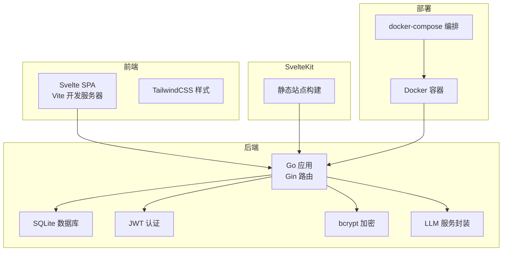
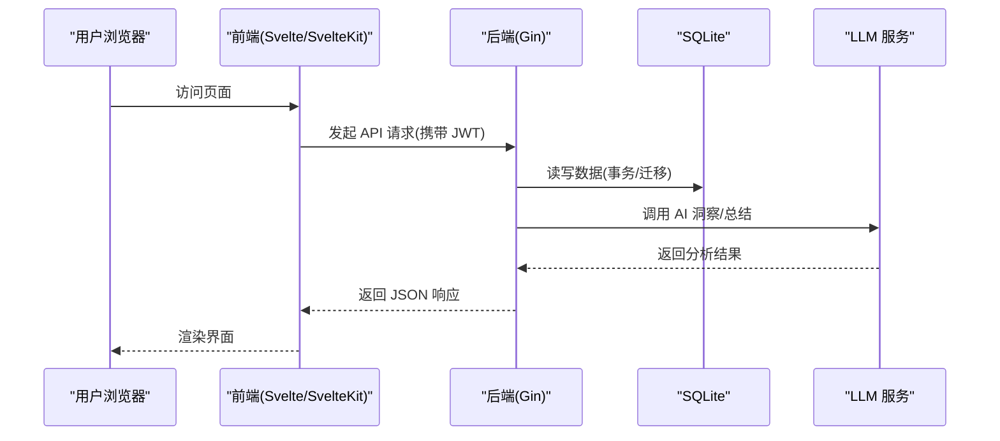
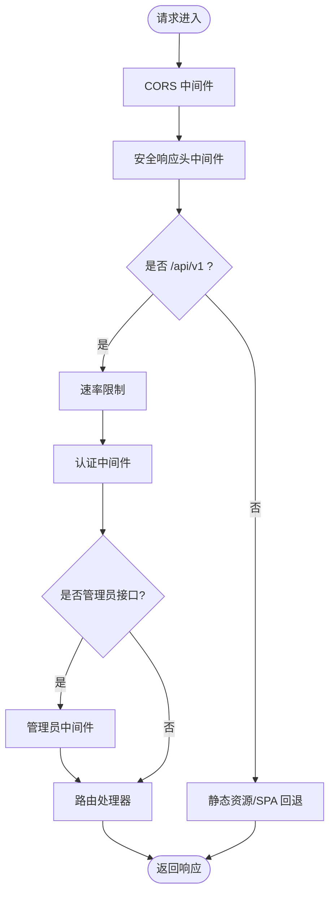
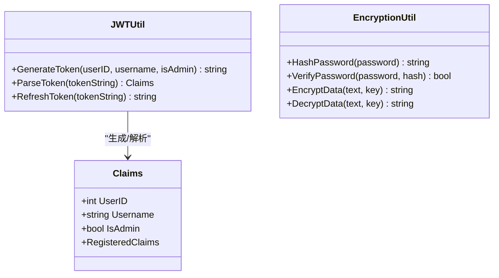
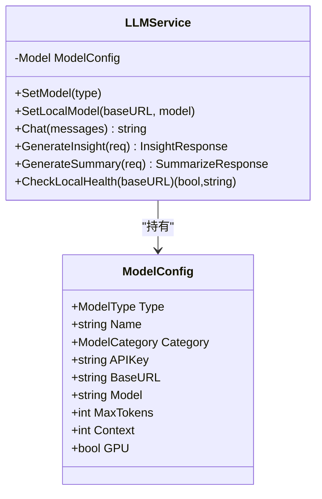
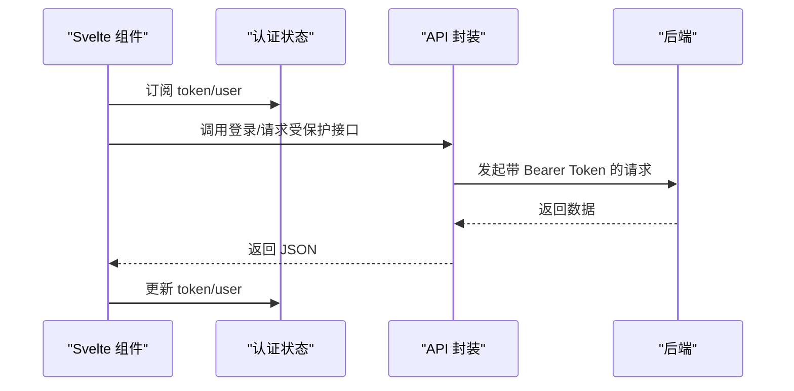
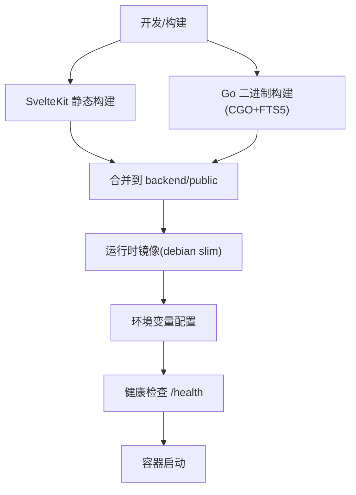
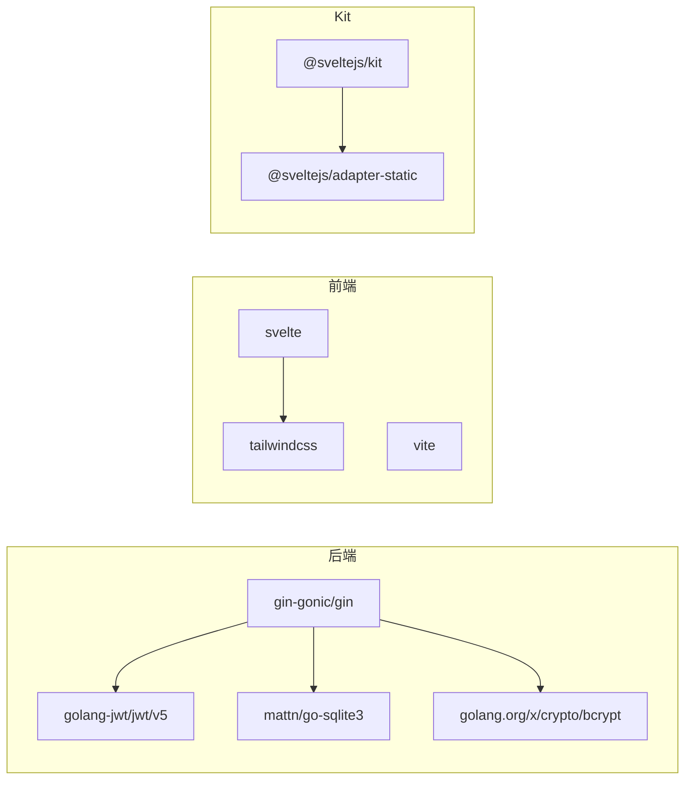

# 技术栈概览

<cite>
**本文档引用的文件**
- [backend/go.mod](file://backend/go.mod)
- [backend/main.go](file://backend/main.go)
- [backend/database/database.go](file://backend/database/database.go)
- [backend/utils/jwt.go](file://backend/utils/jwt.go)
- [backend/utils/encryption.go](file://backend/utils/encryption.go)
- [backend/services/llm.go](file://backend/services/llm.go)
- [frontend/package.json](file://frontend/package.json)
- [frontend/vite.config.js](file://frontend/vite.config.js)
- [frontend/src/stores/auth.js](file://frontend/src/stores/auth.js)
- [kit/package.json](file://kit/package.json)
- [kit/svelte.config.js](file://kit/svelte.config.js)
- [kit/src/lib/api.js](file://kit/src/lib/api.js)
- [Dockerfile](file://Dockerfile)
- [docker-compose.yml](file://docker-compose.yml)
- [docs/LLM_MODELS.md](file://docs/LLM_MODELS.md)
</cite>

## 目录
1. [简介](#简介)
2. [项目结构](#项目结构)
3. [核心组件](#核心组件)
4. [架构总览](#架构总览)
5. [详细组件分析](#详细组件分析)
6. [依赖关系分析](#依赖关系分析)
7. [性能考量](#性能考量)
8. [故障排查指南](#故障排查指南)
9. [结论](#结论)
10. [附录](#附录)

## 简介
Memo Studio 是一个集笔记管理、全文检索、AI 洞察与总结、资源管理、位置与股票分析于一体的全栈应用。后端采用 Go + Gin + SQLite，前端采用 Svelte + Vite + TailwindCSS，AI 服务支持 OpenAI、Claude、国内多家大模型以及本地 LLM（Ollama/LM Studio/LocalAI/AnythingLLM）。部署采用 Docker 容器化，结合 docker-compose 管理服务与持久化。

## 项目结构
项目采用多模块组织方式：
- backend：Go 后端，包含路由、中间件、数据库、业务处理、AI 服务封装
- frontend：基于 Svelte 的传统 SPA（开发时使用）
- kit：基于 SvelteKit 的静态站点（构建产物被嵌入后端）
- docs：技术文档与模型配置说明
- 根目录：Dockerfile、docker-compose.yml、CI/CD 相关脚本等

**图表来源**
- [backend/main.go](file://backend/main.go#L28-L353)
- [frontend/vite.config.js](file://frontend/vite.config.js#L1-L25)
- [kit/svelte.config.js](file://kit/svelte.config.js#L1-L22)
- [Dockerfile](file://Dockerfile#L1-L81)
- [docker-compose.yml](file://docker-compose.yml#L1-L25)

**章节来源**
- [backend/main.go](file://backend/main.go#L28-L353)
- [frontend/package.json](file://frontend/package.json#L1-L25)
- [kit/package.json](file://kit/package.json#L1-L20)
- [Dockerfile](file://Dockerfile#L1-L81)
- [docker-compose.yml](file://docker-compose.yml#L1-L25)

## 核心组件
- 后端技术栈
  - 语言与框架：Go 1.24 + Gin Web 框架
  - 数据库：SQLite（WAL 模式、外键开启、FTS5 支持）
  - 安全：JWT（HS256）+ bcrypt 密码哈希
  - AI 集成：OpenAI、Claude、国内多家云模型、本地 Ollama/LM Studio/LocalAI/AnythingLLM
- 前端技术栈
  - Svelte 5 + Vite 开发体验 + TailwindCSS 样式
  - SvelteKit 静态站点（适配 Go 侧 SPA 回退）
- 部署方案
  - Docker 多阶段构建 + 运行时镜像
  - docker-compose 编排与环境变量配置

**章节来源**
- [backend/go.mod](file://backend/go.mod#L1-L45)
- [backend/database/database.go](file://backend/database/database.go#L20-L60)
- [backend/utils/jwt.go](file://backend/utils/jwt.go#L1-L76)
- [backend/utils/encryption.go](file://backend/utils/encryption.go#L1-L107)
- [backend/services/llm.go](file://backend/services/llm.go#L1-L641)
- [frontend/package.json](file://frontend/package.json#L1-L25)
- [kit/package.json](file://kit/package.json#L1-L20)
- [Dockerfile](file://Dockerfile#L1-L81)

## 架构总览
后端以 Gin 为核心，提供 RESTful API 与静态资源托管；SQLite 负责数据持久化；JWT 实现认证授权；bcrypt 保障密码安全；LLM 服务封装统一调用云端与本地模型；前端通过 Vite 开发，Kit 生成静态站点并被 Go 嵌入发布。

**图表来源**
- [backend/main.go](file://backend/main.go#L94-L196)
- [backend/database/database.go](file://backend/database/database.go#L20-L60)
- [backend/services/llm.go](file://backend/services/llm.go#L418-L515)
- [kit/src/lib/api.js](file://kit/src/lib/api.js#L17-L33)

**章节来源**
- [backend/main.go](file://backend/main.go#L94-L196)
- [backend/database/database.go](file://backend/database/database.go#L20-L60)
- [backend/services/llm.go](file://backend/services/llm.go#L418-L515)
- [kit/src/lib/api.js](file://kit/src/lib/api.js#L17-L33)

## 详细组件分析

### 后端：Gin 路由与中间件
- 路由分组与权限控制
  - /api/v1 下的公开登录/注册接口（带限流）
  - /api/v1 下的认证接口（AuthMiddleware）
  - 管理员专用 /api/v1/users 管理接口（AdminOnly）
- 安全中间件
  - CORS：支持动态配置 AllowOrigins，生产建议明确白名单
  - 安全响应头：X-Content-Type-Options、X-Frame-Options、X-XSS-Protection、X-Robots-Tag
  - Recovery + Logger（非 release 模式）
- 静态资源与 SPA 回退
  - /uploads 附件静态目录
  - 嵌入式前端静态资源（SvelteKit 产物）
  - NoRoute 回退至 index.html，支持 SPA

**图表来源**
- [backend/main.go](file://backend/main.go#L55-L80)
- [backend/main.go](file://backend/main.go#L94-L196)
- [backend/main.go](file://backend/main.go#L285-L316)

**章节来源**
- [backend/main.go](file://backend/main.go#L55-L80)
- [backend/main.go](file://backend/main.go#L94-L196)
- [backend/main.go](file://backend/main.go#L285-L316)

### 数据库：SQLite 与迁移
- 初始化与连接
  - 支持自定义数据库路径（MEMO_DB_PATH）
  - WAL 模式、外键开启、busy_timeout 设置
  - FTS5 全文检索（需 sqlite_fts5 构建标签）
- 迁移策略
  - user_version 控制版本演进
  - 逐步添加列、表与索引，支持多用户隔离与标签唯一性变更
  - 历史数据迁移（如 notes.tags.user_id 迁移）

```mermaid
flowchart TD
Init["初始化数据库"] --> Ping["Ping 连接"]
Ping --> Pragmas["设置 PRAGMA(WAL/foreign_keys/busy_timeout)"]
Pragmas --> Version{"当前 user_version ?"}
Version --> |<1| V1["创建基础表/FTS5 触发器"]
V1 --> SetVer1["设置 user_version=1"]
Version --> |<2| V2["notes 扩展字段"]
V2 --> SetVer2["设置 user_version=2"]
Version --> |<3| V3["resources 与关联表"]
V3 --> SetVer3["设置 user_version=3"]
Version --> |<4| V4["users 增加 is_admin"]
V4 --> SetVer4["设置 user_version=4"]
Version --> |<5| V5["users 增加 must_change_password"]
V5 --> SetVer5["设置 user_version=5"]
Version --> |<6| V6["多用户隔离(tags.user_id)"]
V6 --> SetVer6["设置 user_version=6"]
Version --> |<7| V7["标签唯一性变更"]
V7 --> SetVer7["设置 user_version=7"]
Version --> |<8| V8["notebooks 与关联表"]
V8 --> SetVer8["设置 user_version=8"]
Version --> |<9| V9["notes 位置字段"]
V9 --> SetVer9["设置 user_version=9"]
SetVer1 --> Done(["完成"])
SetVer2 --> Done
SetVer3 --> Done
SetVer4 --> Done
SetVer5 --> Done
SetVer6 --> Done
SetVer7 --> Done
SetVer8 --> Done
SetVer9 --> Done
```

**图表来源**
- [backend/database/database.go](file://backend/database/database.go#L20-L60)
- [backend/database/database.go](file://backend/database/database.go#L62-L178)
- [backend/database/database.go](file://backend/database/database.go#L243-L374)
- [backend/database/database.go](file://backend/database/database.go#L376-L406)
- [backend/database/database.go](file://backend/database/database.go#L408-L438)
- [backend/database/database.go](file://backend/database/database.go#L440-L452)
- [backend/database/database.go](file://backend/database/database.go#L454-L540)
- [backend/database/database.go](file://backend/database/database.go#L564-L591)
- [backend/database/database.go](file://backend/database/database.go#L593-L647)
- [backend/database/database.go](file://backend/database/database.go#L180-L209)
- [backend/database/database.go](file://backend/database/database.go#L211-L241)

**章节来源**
- [backend/database/database.go](file://backend/database/database.go#L20-L60)
- [backend/database/database.go](file://backend/database/database.go#L62-L178)
- [backend/database/database.go](file://backend/database/database.go#L243-L374)
- [backend/database/database.go](file://backend/database/database.go#L376-L406)
- [backend/database/database.go](file://backend/database/database.go#L408-L438)
- [backend/database/database.go](file://backend/database/database.go#L440-L452)
- [backend/database/database.go](file://backend/database/database.go#L454-L540)
- [backend/database/database.go](file://backend/database/database.go#L564-L591)
- [backend/database/database.go](file://backend/database/database.go#L593-L647)
- [backend/database/database.go](file://backend/database/database.go#L180-L209)
- [backend/database/database.go](file://backend/database/database.go#L211-L241)

### 安全：JWT 与密码加密
- JWT
  - HS256 签名，默认 24 小时有效期
  - 支持刷新（RefreshToken）
  - 生产环境必须设置 MEMO_JWT_SECRET
- 密码与数据加密
  - bcrypt 哈希与验证
  - AES-256-GCM 对称加密（可选密钥派生）

**图表来源**
- [backend/utils/jwt.go](file://backend/utils/jwt.go#L22-L66)
- [backend/utils/encryption.go](file://backend/utils/encryption.go#L93-L106)

**章节来源**
- [backend/utils/jwt.go](file://backend/utils/jwt.go#L1-L76)
- [backend/utils/encryption.go](file://backend/utils/encryption.go#L1-L107)

### AI 服务：多模型统一接入
- 支持模型类型
  - 云端：OpenAI、Claude、DeepSeek、智谱、零一万物、通义、Kimi、讯飞
  - 本地：Ollama、LM Studio、LocalAI、AnythingLLM
- 配置与发现
  - 默认模型清单与分类
  - 环境变量优先级：LLM_API_KEY > 各云厂商专属 KEY > LLM_MODEL_TYPE
  - 提供 /models/* 接口查询与切换
- 能力
  - 洞察生成（主题/情感/行动）
  - 内容总结（单条/批量）
  - 本地健康检查与自定义模型添加

**图表来源**
- [backend/services/llm.go](file://backend/services/llm.go#L43-L71)
- [backend/services/llm.go](file://backend/services/llm.go#L377-L404)
- [backend/services/llm.go](file://backend/services/llm.go#L418-L435)
- [backend/services/llm.go](file://backend/services/llm.go#L549-L591)
- [backend/services/llm.go](file://backend/services/llm.go#L605-L640)

**章节来源**
- [backend/services/llm.go](file://backend/services/llm.go#L1-L641)
- [docs/LLM_MODELS.md](file://docs/LLM_MODELS.md#L1-L277)

### 前端：Svelte + Vite + TailwindCSS
- 开发体验
  - Vite HMR、代理 /api -> http://localhost:9000
  - Svelte 5 + TailwindCSS + PostCSS
- 状态与认证
  - localStorage 存储 token 与用户信息
  - 订阅者模式通知 UI 更新
- API 封装
  - 统一 fetch 封装，自动注入 Authorization
  - 登录、用户、笔记、标签、资源、统计、导入导出等接口

**图表来源**
- [frontend/src/stores/auth.js](file://frontend/src/stores/auth.js#L20-L75)
- [kit/src/lib/api.js](file://kit/src/lib/api.js#L17-L33)
- [kit/src/lib/api.js](file://kit/src/lib/api.js#L35-L270)

**章节来源**
- [frontend/package.json](file://frontend/package.json#L1-L25)
- [frontend/vite.config.js](file://frontend/vite.config.js#L1-L25)
- [frontend/src/stores/auth.js](file://frontend/src/stores/auth.js#L1-L80)
- [kit/package.json](file://kit/package.json#L1-L20)
- [kit/svelte.config.js](file://kit/svelte.config.js#L1-L22)
- [kit/src/lib/api.js](file://kit/src/lib/api.js#L1-L271)

### 部署：Docker 与 docker-compose
- 多阶段构建
  - SvelteKit 静态构建（node:20-bookworm）
  - Go 构建（golang:1.23-bookworm，CGO + sqlite_fts5）
  - 运行时（debian:bookworm-slim，非 root 用户）
- 环境变量
  - MEMO_JWT_SECRET、MEMO_ADMIN_PASSWORD、MEMO_CORS_ORIGINS、PORT、MEMO_DB_PATH、MEMO_STORAGE_DIR、GIN_MODE
- 健康检查与卷挂载
  - /health 探针
  - /data 卷用于持久化数据库与存储

**图表来源**
- [Dockerfile](file://Dockerfile#L1-L81)
- [docker-compose.yml](file://docker-compose.yml#L7-L18)

**章节来源**
- [Dockerfile](file://Dockerfile#L1-L81)
- [docker-compose.yml](file://docker-compose.yml#L1-L25)

## 依赖关系分析
- 后端依赖
  - Gin、CORS、JWT、SQLite 驱动、bcrypt、json/yaml 工具等
- 前端依赖
  - Svelte 5、Vite、TailwindCSS、PostCSS、autoprefixer
- SvelteKit 依赖
  - @sveltejs/adapter-static、@sveltejs/kit、@sveltejs/vite-plugin-svelte

**图表来源**
- [backend/go.mod](file://backend/go.mod#L5-L11)
- [frontend/package.json](file://frontend/package.json#L11-L15)
- [frontend/package.json](file://frontend/package.json#L16-L23)
- [kit/package.json](file://kit/package.json#L11-L16)

**章节来源**
- [backend/go.mod](file://backend/go.mod#L1-L45)
- [frontend/package.json](file://frontend/package.json#L1-L25)
- [kit/package.json](file://kit/package.json#L1-L20)

## 性能考量
- 数据库
  - WAL 模式提升并发写入；FTS5 提供全文检索能力；外键约束保障一致性
  - 建议在高并发场景下评估连接池与索引策略
- API
  - Gin Release 模式减少日志开销；CORS 白名单避免通配符带来的跨域风险
- LLM
  - 云端模型延迟与费用；本地模型显存与吞吐权衡；合理设置 max_tokens 与温度
- 前端
  - Vite HMR 提升开发效率；TailwindCSS 减少打包体积；SvelteKit 静态输出利于 CDN 分发

## 故障排查指南
- 数据库初始化失败
  - 检查 MEMO_DB_PATH 权限与磁盘空间；确认 SQLite 文件可写
- JWT 无效或过期
  - 确认 MEMO_JWT_SECRET 设置；检查客户端 token 是否正确传递
- CORS 跨域问题
  - 生产环境设置 MEMO_CORS_ORIGINS；避免使用通配符
- LLM 连接失败
  - 检查 API Key 与 BaseURL；本地模型服务健康检查；查看 /models/local/health
- 健康检查失败
  - 查看容器日志与 /health 端点；确认端口映射与卷挂载

**章节来源**
- [backend/database/database.go](file://backend/database/database.go#L20-L60)
- [backend/utils/jwt.go](file://backend/utils/jwt.go#L13-L20)
- [backend/main.go](file://backend/main.go#L55-L80)
- [backend/services/llm.go](file://backend/services/llm.go#L517-L531)
- [Dockerfile](file://Dockerfile#L76-L78)

## 结论
Memo Studio 的技术栈围绕“轻量、易部署、可扩展”设计：后端以 Go + Gin + SQLite 实现高性能与低运维成本；前端采用现代工具链保证开发体验；AI 服务统一抽象，兼顾云端与本地场景；Docker 化部署简化交付流程。该组合适合个人与小团队使用，同时具备良好的扩展性与安全性基线。

## 附录
- 学习路径与参考资料
  - Go 与 Gin：官方文档、实战教程
  - SQLite 与 FTS5：官方文档、迁移最佳实践
  - JWT 与 bcrypt：安全指南、密钥管理
  - Svelte 与 Vite：官方文档、生态插件
  - SvelteKit 静态部署：官方适配器文档
  - LLM 模型配置：各平台 API 文档与 SDK
  - Docker 与 docker-compose：官方文档、最佳实践