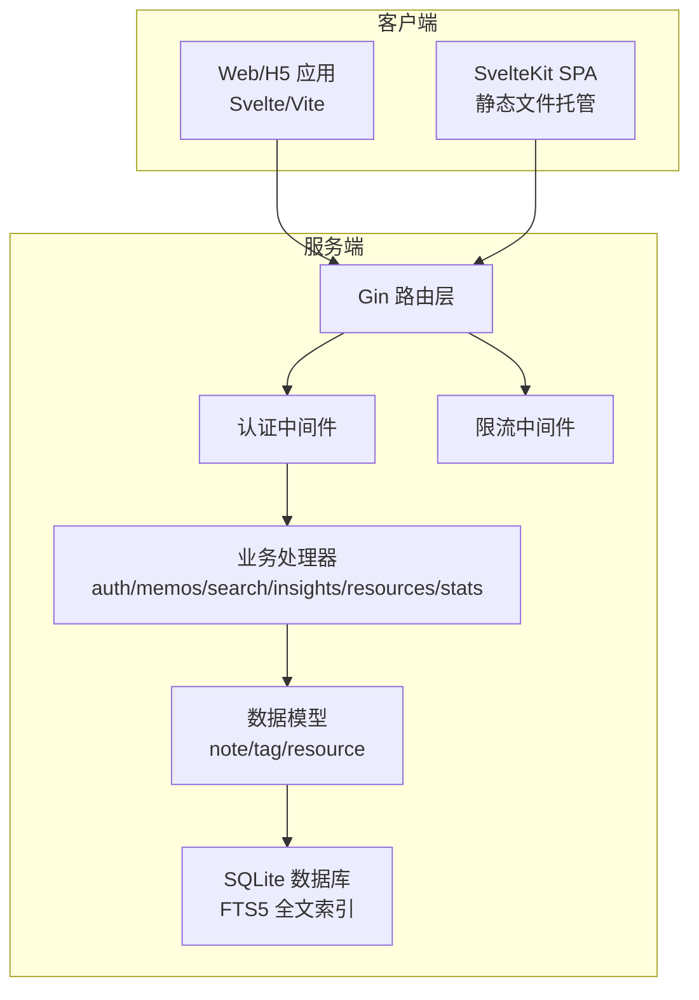
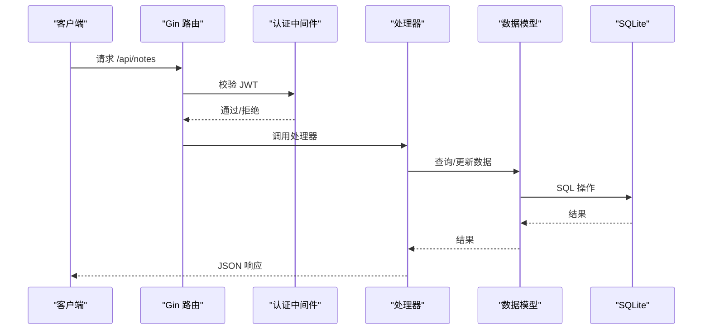
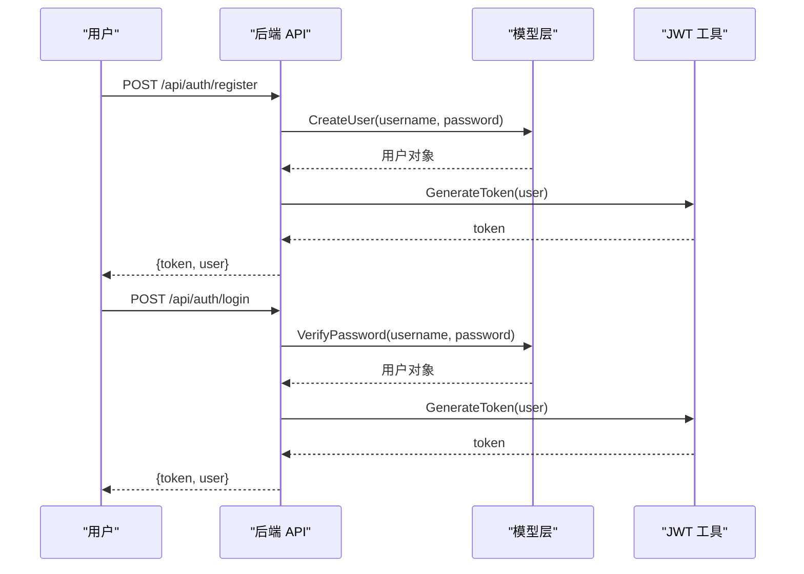
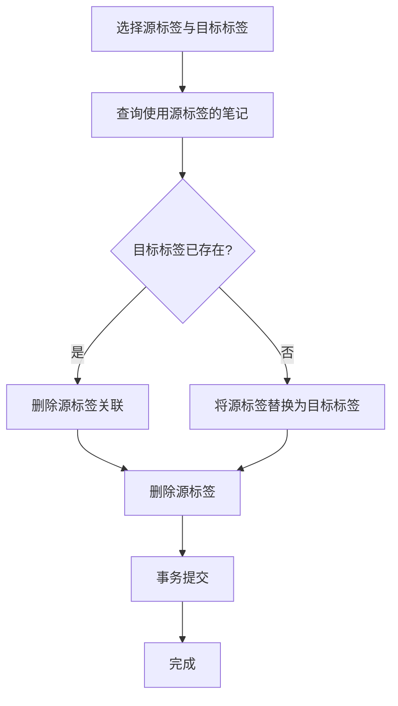
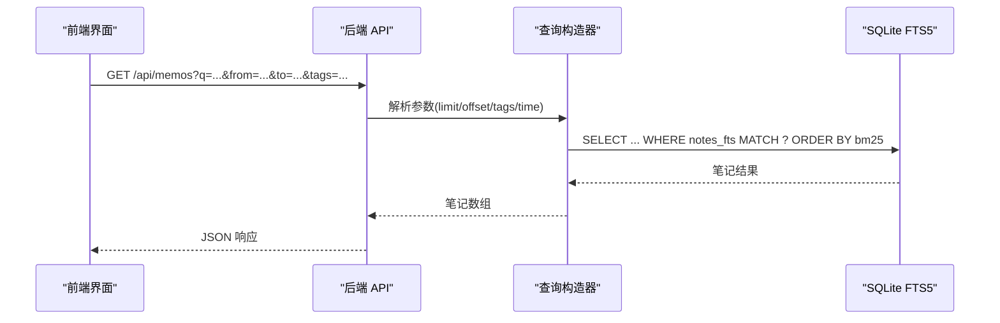
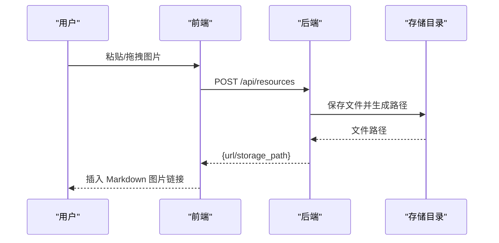
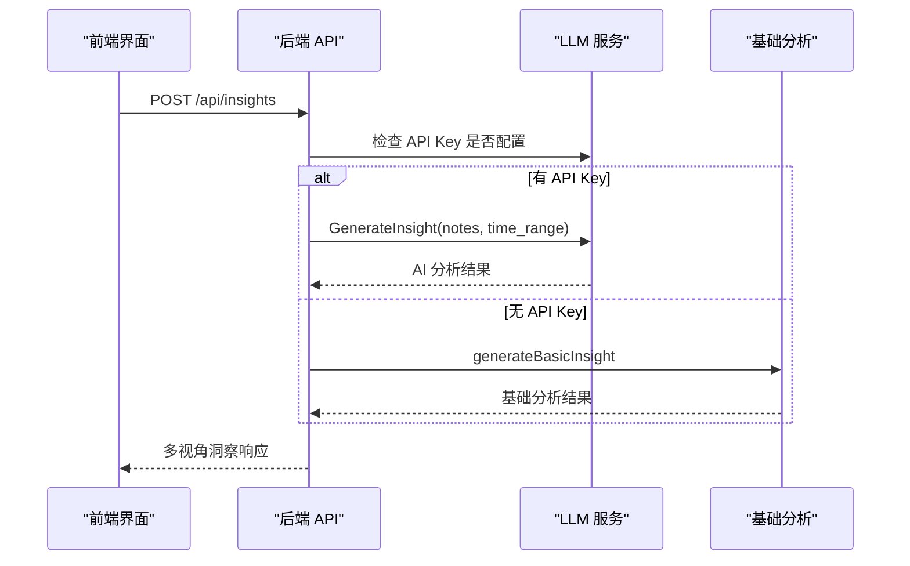
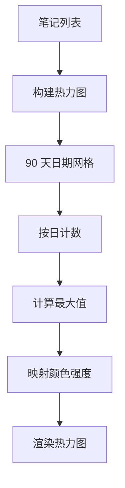
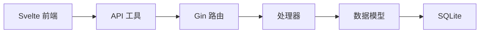

# 核心功能特性

<cite>
**本文档引用的文件**
- [README.md](file://README.md)
- [backend/main.go](file://backend/main.go)
- [backend/handlers/auth.go](file://backend/handlers/auth.go)
- [backend/handlers/memos.go](file://backend/handlers/memos.go)
- [backend/handlers/search.go](file://backend/handlers/search.go)
- [backend/handlers/insights.go](file://backend/handlers/insights.go)
- [backend/handlers/resources.go](file://backend/handlers/resources.go)
- [backend/handlers/stats.go](file://backend/handlers/stats.go)
- [backend/models/note.go](file://backend/models/note.go)
- [frontend/src/App.svelte](file://frontend/src/App.svelte)
- [kit/src/routes/+page.svelte](file://kit/src/routes/+page.svelte)
- [frontend/src/components/RichTextEditor.svelte](file://frontend/src/components/RichTextEditor.svelte)
- [frontend/src/components/AdvancedSearch.svelte](file://frontend/src/components/AdvancedSearch.svelte)
- [kit/src/lib/heatmap.js](file://kit/src/lib/heatmap.js)
</cite>

## 目录
1. [简介](#简介)
2. [项目结构](#项目结构)
3. [核心组件](#核心组件)
4. [架构总览](#架构总览)
5. [详细组件分析](#详细组件分析)
6. [依赖关系分析](#依赖关系分析)
7. [性能考量](#性能考量)
8. [故障排查指南](#故障排查指南)
9. [结论](#结论)
10. [附录](#附录)

## 简介
Memo Studio 是一款简洁美观的跨端笔记应用，采用 Go + Gin + SQLite 后端与 Svelte/Vite 前端技术栈，支持 H5 与 Web 端，具备响应式设计与明暗主题切换。项目提供完整的用户认证体系、笔记 CRUD、富文本编辑、标签系统、高级搜索、多媒体支持（图片上传、语音输入）、AI 智能分析（洞察分析、内容总结、多模型支持）、统计分析（使用统计、时间分析、位置统计）等功能。

## 项目结构
项目采用前后端分离与一体化部署的混合架构：
- 后端：Go + Gin + SQLite，提供 RESTful API 与静态资源托管
- 前端：Svelte + Vite，提供 Web 端体验
- SvelteKit：作为新一代实现，支持 SPA 与静态文件托管
- 数据库：SQLite，使用 FTS5 支持全文检索



图表来源
- [backend/main.go](file://backend/main.go#L95-L196)
- [backend/handlers/auth.go](file://backend/handlers/auth.go#L27-L53)
- [backend/handlers/memos.go](file://backend/handlers/memos.go#L78-L137)
- [backend/models/note.go](file://backend/models/note.go#L46-L105)

章节来源
- [README.md](file://README.md#L1-L502)
- [backend/main.go](file://backend/main.go#L28-L353)

## 核心组件
- 用户认证系统：支持注册、登录与 JWT 认证，提供速率限制与安全响应头
- 笔记管理：支持笔记的创建、读取、更新、删除与批量删除，支持富文本编辑与草稿保存
- 标签系统：支持标签的创建、编辑、删除与合并，提供标签计数与筛选
- 高级搜索：支持关键词、时间范围、标签筛选与排序
- 多媒体支持：支持图片上传与粘贴/拖拽，支持语音转文本
- AI 智能分析：支持洞察分析、内容总结与多模型支持
- 统计分析：提供使用统计、时间分析（热力图）、位置统计
- 响应式设计：适配移动端与桌面端

章节来源
- [README.md](file://README.md#L275-L296)
- [backend/handlers/auth.go](file://backend/handlers/auth.go#L27-L111)
- [backend/handlers/memos.go](file://backend/handlers/memos.go#L78-L280)
- [backend/handlers/search.go](file://backend/handlers/search.go#L13-L45)
- [backend/handlers/insights.go](file://backend/handlers/insights.go#L68-L119)
- [backend/handlers/resources.go](file://backend/handlers/resources.go#L91-L155)
- [backend/handlers/stats.go](file://backend/handlers/stats.go#L11-L24)
- [frontend/src/components/RichTextEditor.svelte](file://frontend/src/components/RichTextEditor.svelte#L75-L129)
- [kit/src/lib/heatmap.js](file://kit/src/lib/heatmap.js#L1-L38)

## 架构总览
后端通过 Gin 路由层统一暴露 API，认证中间件负责鉴权，限流中间件保障安全，处理器调用数据模型层访问 SQLite 数据库。前端通过 API 与后端交互，支持富文本编辑、标签建议、高级搜索、热力图统计与多媒体上传。



图表来源
- [backend/main.go](file://backend/main.go#L95-L196)
- [backend/handlers/memos.go](file://backend/handlers/memos.go#L78-L137)
- [backend/models/note.go](file://backend/models/note.go#L268-L327)

## 详细组件分析

### 用户认证系统
- 注册与登录：验证用户名与密码，生成 JWT 令牌
- 当前用户信息：通过认证中间件获取用户信息
- 安全措施：速率限制、CORS 配置、安全响应头



图表来源
- [backend/handlers/auth.go](file://backend/handlers/auth.go#L27-L93)
- [backend/models/note.go](file://backend/models/note.go#L46-L105)

章节来源
- [backend/handlers/auth.go](file://backend/handlers/auth.go#L27-L111)
- [backend/main.go](file://backend/main.go#L55-L81)

### 笔记管理功能（CRUD、富文本编辑、草稿保存）
- CRUD 操作：支持创建、读取、更新、删除与批量删除
- 富文本编辑：支持标签建议与笔记引用建议
- 草稿保存：本地草稿与后端持久化结合
- 权限控制：基于用户 ID 的笔记所有权校验

```mermaid
flowchart TD
Start(["进入笔记页面"]) --> Load["加载笔记与标签"]
Load --> Edit["富文本编辑器"]
Edit --> Suggest{"触发建议?"}
Suggest --> |标签建议|# --> InsertTag["插入标签"]
Suggest --> |笔记建议|@ --> InsertNote["插入笔记引用"]
InsertTag --> Save["保存草稿/提交"]
InsertNote --> Save
Save --> Persist["持久化到数据库"]
Persist --> Reload["刷新列表"]
Reload --> End(["完成"])
```

图表来源
- [frontend/src/components/RichTextEditor.svelte](file://frontend/src/components/RichTextEditor.svelte#L75-L187)
- [kit/src/routes/+page.svelte](file://kit/src/routes/+page.svelte#L48-L92)

章节来源
- [backend/handlers/memos.go](file://backend/handlers/memos.go#L78-L280)
- [backend/models/note.go](file://backend/models/note.go#L46-L168)
- [frontend/src/components/RichTextEditor.svelte](file://frontend/src/components/RichTextEditor.svelte#L75-L247)

### 标签系统（创建、编辑、删除、合并）
- 标签创建：按需创建标签并分配颜色
- 标签编辑：更新标签名称与颜色
- 标签删除：删除标签及其关联关系
- 标签合并：将多个标签合并为一个，迁移笔记关联



图表来源
- [backend/models/note.go](file://backend/models/note.go#L670-L729)

章节来源
- [backend/models/note.go](file://backend/models/note.go#L594-L729)

### 高级搜索功能（全文搜索、时间范围查询、标签筛选）
- 全文搜索：基于 SQLite FTS5 的 bm25 排序
- 时间范围：支持 from/to 参数解析
- 标签筛选：支持多标签过滤
- 排序：支持创建时间、更新时间、标题排序



图表来源
- [backend/handlers/memos.go](file://backend/handlers/memos.go#L78-L137)
- [backend/models/note.go](file://backend/models/note.go#L329-L392)

章节来源
- [backend/handlers/search.go](file://backend/handlers/search.go#L13-L45)
- [backend/models/note.go](file://backend/models/note.go#L329-L392)

### 多媒体支持（图片上传、语音输入）
- 图片上传：支持粘贴/拖拽，自动保存至存储目录并返回 Markdown 链接
- 语音转文本：支持独立端点与上传即转录



图表来源
- [kit/src/routes/+page.svelte](file://kit/src/routes/+page.svelte#L124-L180)
- [backend/handlers/resources.go](file://backend/handlers/resources.go#L91-L155)

章节来源
- [backend/handlers/resources.go](file://backend/handlers/resources.go#L91-L225)
- [kit/src/routes/+page.svelte](file://kit/src/routes/+page.svelte#L121-L180)

### AI 智能分析（洞察分析、内容总结、多模型支持）
- 洞察分析：支持概览、主题、情感、行动等多视角分析
- 内容总结：支持单条与批量总结
- 多模型支持：通过环境变量配置不同大模型 API



图表来源
- [backend/handlers/insights.go](file://backend/handlers/insights.go#L68-L119)

章节来源
- [backend/handlers/insights.go](file://backend/handlers/insights.go#L68-L527)

### 统计分析功能（使用统计、时间分析、位置统计）
- 使用统计：提供用户维度的统计信息
- 时间分析：基于热力图展示笔记创作密度
- 位置统计：支持位置信息标注与查询



图表来源
- [kit/src/lib/heatmap.js](file://kit/src/lib/heatmap.js#L1-L38)

章节来源
- [backend/handlers/stats.go](file://backend/handlers/stats.go#L11-L24)
- [kit/src/lib/heatmap.js](file://kit/src/lib/heatmap.js#L1-L38)

### 响应式设计
- 适配移动端与桌面端，支持明暗主题切换
- 支持键盘快捷键与无障碍交互

章节来源
- [frontend/src/App.svelte](file://frontend/src/App.svelte#L222-L328)
- [kit/src/routes/+page.svelte](file://kit/src/routes/+page.svelte#L596-L720)

## 依赖关系分析
- 后端依赖：Gin 路由、SQLite 数据库、JWT 工具、CORS 中间件、速率限制中间件
- 前端依赖：Svelte 组件、API 工具、状态管理、键盘管理器、主题切换
- 数据模型：笔记、标签、资源、统计等实体与关联关系



图表来源
- [backend/main.go](file://backend/main.go#L95-L196)
- [backend/models/note.go](file://backend/models/note.go#L46-L105)

章节来源
- [backend/main.go](file://backend/main.go#L95-L196)
- [backend/models/note.go](file://backend/models/note.go#L46-L105)

## 性能考量
- 全文搜索：使用 SQLite FTS5 与 bm25 排序，限制每页数量以控制查询成本
- N+1 查询：列表场景下对标签与资源的查询可考虑聚合优化
- 上传限制：对文件大小进行限制，避免过大资源影响性能
- 缓存与草稿：前端本地草稿减少网络往返，提升用户体验

## 故障排查指南
- 端口占用：启动脚本会尝试清理，若失败可通过 lsof/kill 处理
- 依赖安装：Go 与 npm 依赖分别执行下载与安装
- 数据库问题：删除数据库文件后重启可重建
- 热更新：前端默认支持 HMR，后端可使用 Air 实现热重载

章节来源
- [README.md](file://README.md#L446-L498)

## 结论
Memo Studio 提供了从认证、笔记管理到 AI 分析与统计的完整能力，具备良好的扩展性与可维护性。通过 SQLite FTS5 与 SvelteKit 的结合，实现了高性能与现代化的用户体验。建议在生产环境中配置 CORS、JWT 密钥与存储目录，以确保安全性与稳定性。

## 附录
- 快速开始：参考 README 的一键启动与开发说明
- API 接口：参考 README 的 API 定义与示例
- 环境变量：参考 README 的环境变量配置说明

章节来源
- [README.md](file://README.md#L11-L502)