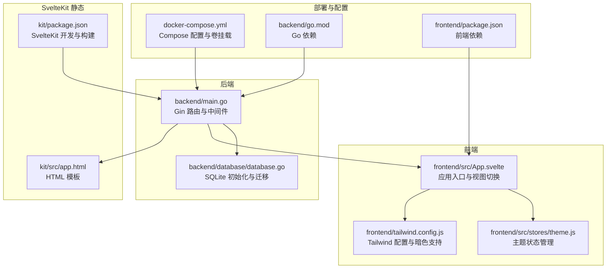
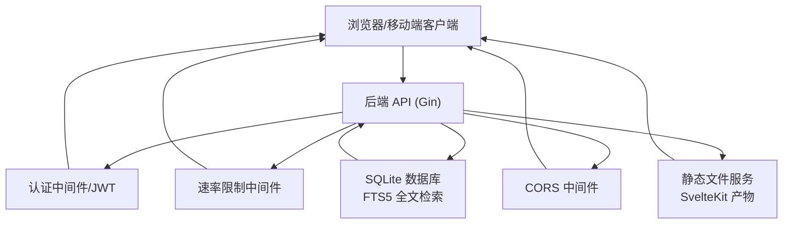
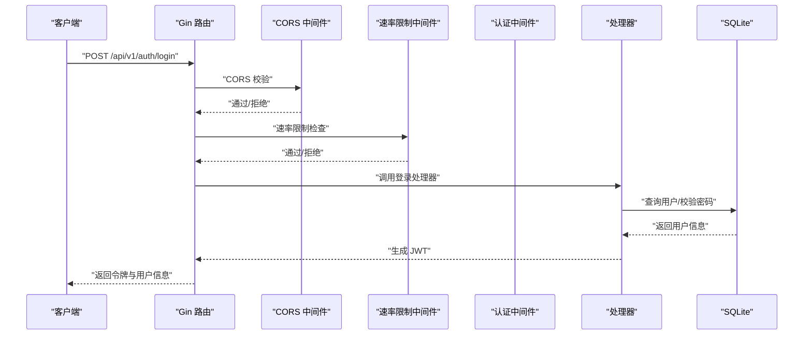
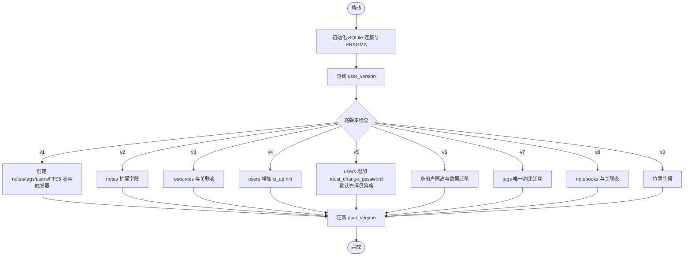
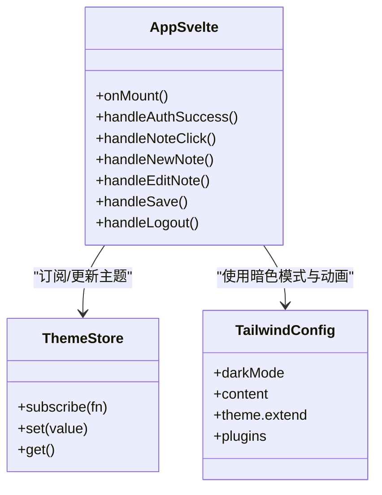
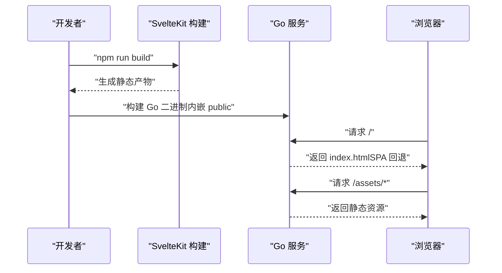
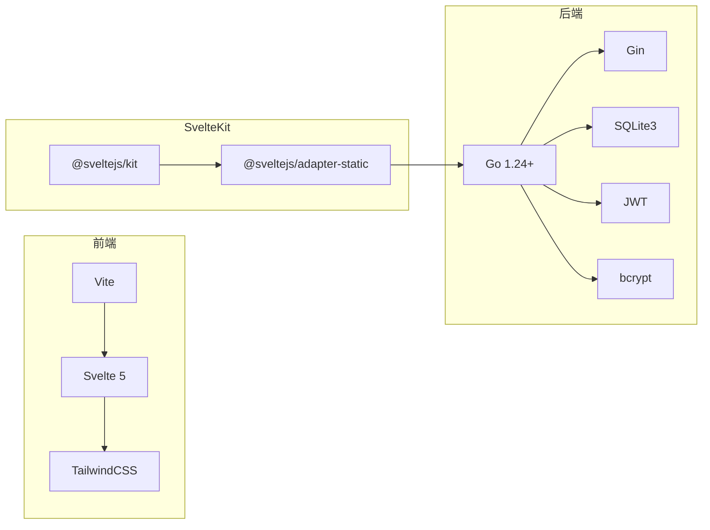

# 项目介绍与定位

<cite>
**本文引用的文件**
- [README.md](file://README.md)
- [backend/README.md](file://backend/README.md)
- [frontend/README.md](file://frontend/README.md)
- [kit/README.md](file://kit/README.md)
- [docs/README_CN.md](file://docs/README_CN.md)
- [backend/main.go](file://backend/main.go)
- [backend/database/database.go](file://backend/database/database.go)
- [frontend/src/App.svelte](file://frontend/src/App.svelte)
- [frontend/src/stores/theme.js](file://frontend/src/stores/theme.js)
- [frontend/tailwind.config.js](file://frontend/tailwind.config.js)
- [frontend/package.json](file://frontend/package.json)
- [backend/go.mod](file://backend/go.mod)
- [kit/package.json](file://kit/package.json)
- [docker-compose.yml](file://docker-compose.yml)
</cite>

## 目录
1. [引言](#引言)
2. [项目结构](#项目结构)
3. [核心组件](#核心组件)
4. [架构总览](#架构总览)
5. [详细组件分析](#详细组件分析)
6. [依赖关系分析](#依赖关系分析)
7. [性能考量](#性能考量)
8. [故障排查指南](#故障排查指南)
9. [结论](#结论)
10. [附录](#附录)

## 引言
Memo Studio 是一款现代化的个人知识管理工具，采用前后端分离架构，提供简洁美观、响应式设计的笔记应用体验。项目以 Flomo 风格为核心设计语言，强调“轻记录、重沉淀”的使用哲学：通过极简的入口与自然的记录方式，帮助用户在碎片时间中捕捉灵感；借助标签体系、全文检索与 AI 洞察，实现知识的结构化整理与深度复用。

- 设计理念
  - Flomo 风格：强调“随时记录、稍后整理”，编辑器采用底部浮动入口与简洁交互，降低认知负担。
  - 明暗主题：支持系统联动与手动切换，兼顾长时间使用与夜间场景。
  - 响应式布局：同时覆盖 Web 与移动端，适配不同设备的使用习惯。
  - 安全与隐私：内置 JWT 认证、CORS 白名单、速率限制与安全响应头，保障生产环境安全。
  - 可扩展性：后端以 SQLite 为基础，结合 FTS5 全文检索与多版本迁移，满足从小规模到中等规模的知识体量。

- 技术愿景
  - 以“Go + Gin + SQLite + Svelte/SvelteKit”构建高可用、低门槛、易部署的个人知识平台。
  - 通过前后端分离与容器化，实现一键部署、数据持久化与跨平台运行。
  - 逐步完善 AI 能力（语音转写、洞察分析、总结提炼、股票分析等），提升知识生产的效率与质量。

- 开源理念
  - MIT 许可证，鼓励社区贡献与二次开发。
  - 提供 Docker 与一键脚本，降低部署与运维成本。
  - 通过文档与示例，帮助不同技术背景的用户快速上手。

**章节来源**
- file://README.md#L1-L502
- file://docs/README_CN.md#L17-L40

## 项目结构
项目采用前后端分离的组织方式，包含后端 Go 服务、前端 Svelte 应用与 SvelteKit 静态产物托管三种形态，同时提供 Docker Compose 一键部署能力。

**图表来源**
- [backend/main.go](file://backend/main.go#L28-L353)
- [backend/database/database.go](file://backend/database/database.go#L21-L178)
- [frontend/src/App.svelte](file://frontend/src/App.svelte#L1-L328)
- [frontend/src/stores/theme.js](file://frontend/src/stores/theme.js#L1-L40)
- [frontend/tailwind.config.js](file://frontend/tailwind.config.js#L1-L100)
- [kit/package.json](file://kit/package.json#L1-L20)
- [docker-compose.yml](file://docker-compose.yml#L1-L25)

**章节来源**
- file://README.md#L254-L273
- file://docs/README_CN.md#L565-L586

## 核心组件
- 后端服务（Go + Gin）
  - 路由与中间件：统一处理 CORS、速率限制、认证与安全响应头。
  - API v1：覆盖用户、笔记、标签、资源、位置、统计、导出导入、AI 洞察与模型管理等。
  - 静态文件托管：内嵌 SvelteKit 构建产物，支持 SPA 回退。
  - 数据库：SQLite 初始化、PRAGMA 优化、FTS5 全文检索与多版本迁移。
- 前端应用（Svelte + Vite）
  - 视图与交互：登录页、笔记列表、详情、编辑器、个人资料、主题切换、键盘快捷键等。
  - 主题系统：基于 Tailwind CSS 的暗色模式与本地存储同步。
  - 响应式设计：移动端友好的浮动编辑入口与无障碍焦点管理。
- SvelteKit 静态托管
  - 通过 adapter-static 产出静态资源，由 Go 服务内嵌托管，实现单端口部署。
- 部署与运维
  - Docker Compose：一键构建与运行，支持数据卷持久化与环境变量配置。
  - 一键脚本：start.sh/start.bat，自动检查环境、安装依赖并启动前后端。

**章节来源**
- file://backend/README.md#L1-L40
- file://frontend/README.md#L1-L26
- file://kit/README.md#L1-L22
- file://backend/main.go#L94-L196
- file://backend/database/database.go#L21-L178
- file://frontend/src/App.svelte#L1-L328
- file://frontend/src/stores/theme.js#L1-L40
- file://frontend/tailwind.config.js#L1-L100
- file://docker-compose.yml#L1-L25

## 架构总览
Memo Studio 采用前后端分离架构，后端提供 RESTful API 与静态资源托管，前端负责视图渲染与交互逻辑。SvelteKit 作为可选的静态构建层，将产物内嵌至 Go 服务，实现统一端口对外提供服务。

**图表来源**
- [backend/main.go](file://backend/main.go#L46-L81)
- [backend/main.go](file://backend/main.go#L285-L316)
- [backend/database/database.go](file://backend/database/database.go#L21-L60)

**章节来源**
- file://README.md#L37-L60
- file://backend/main.go#L94-L196

## 详细组件分析

### 后端路由与中间件
- 安全与合规
  - 安全响应头：X-Content-Type-Options、X-Frame-Options、X-XSS-Protection、X-Robots-Tag。
  - CORS：支持白名单配置，生产环境建议明确设置以增强安全性。
  - 速率限制：对公开认证接口启用，防止暴力破解与滥用。
  - 认证：JWT 令牌验证，支持管理员专用接口。
- API 分层
  - /api/v1：当前稳定版本，涵盖用户、笔记、标签、资源、位置、统计、导出导入、AI 洞察与模型管理。
  - 兼容层：/api（旧版）向后兼容，建议迁移至 /api/v1。
- 静态文件与 SPA 回退
  - 内嵌 SvelteKit 构建产物，统一由 Go 服务托管。
  - 对非 /api 请求进行 SPA 回退，确保路由友好。

**图表来源**
- [backend/main.go](file://backend/main.go#L94-L102)
- [backend/main.go](file://backend/main.go#L104-L196)

**章节来源**
- file://backend/main.go#L46-L81
- file://backend/main.go#L94-L196

### 数据库与迁移
- 初始化与优化
  - SQLite 连接、Ping 检查、PRAGMA 设置（外键、WAL、busy_timeout）。
  - FTS5 全文检索虚拟表与触发器维护一致性。
- 多版本迁移
  - 从 v1 到 v9 的演进：基础表、扩展字段、资源表、多用户隔离、笔记本、位置字段等。
  - 通过 user_version 与事务保证迁移原子性与幂等性。
- 默认管理员策略
  - 支持通过环境变量初始化/重置管理员密码，首次启动可生成随机密码并提示修改。

**图表来源**
- [backend/database/database.go](file://backend/database/database.go#L62-L178)
- [backend/database/database.go](file://backend/database/database.go#L243-L374)
- [backend/database/database.go](file://backend/database/database.go#L440-L540)

**章节来源**
- file://backend/database/database.go#L21-L60
- file://backend/database/database.go#L62-L178
- file://backend/database/database.go#L243-L374
- file://backend/database/database.go#L440-L540

### 前端应用与主题系统
- 应用入口与视图切换
  - 登录态管理：认证成功后进入应用，支持登出与返回列表。
  - 视图：列表、详情、个人资料；编辑器采用 Flomo 风格底部浮动入口。
  - 键盘快捷键：聚焦搜索、保存编辑器、新建笔记、编辑/删除、导航等。
- 主题系统
  - 本地存储：主题偏好持久化。
  - DOM 类：通过为 html 根元素添加/移除 dark 类实现 Tailwind 暗色模式。
  - 动画与过渡：配合 Tailwind 自定义动画类，提供流畅的切换体验。
- 响应式设计
  - 移动端优化：浮动按钮、焦点管理、无障碍可达性。
  - Tailwind 配置：支持暗色模式、圆角、阴影、渐变与动画。

**图表来源**
- [frontend/src/stores/theme.js](file://frontend/src/stores/theme.js#L1-L40)
- [frontend/src/App.svelte](file://frontend/src/App.svelte#L1-L328)
- [frontend/tailwind.config.js](file://frontend/tailwind.config.js#L1-L100)

**章节来源**
- file://frontend/src/App.svelte#L1-L328
- file://frontend/src/stores/theme.js#L1-L40
- file://frontend/tailwind.config.js#L1-L100

### SvelteKit 静态托管与 Go 内嵌
- SvelteKit 作为可选的静态构建层，使用 adapter-static 产出静态资源。
- Go 服务通过嵌入文件系统（embed）将静态资源内嵌，统一由 Gin 路由托管。
- SPA 回退：对非 API 请求回退到 index.html，确保前端路由正常工作。

**图表来源**
- [kit/package.json](file://kit/package.json#L1-L20)
- [backend/main.go](file://backend/main.go#L23-L27)
- [backend/main.go](file://backend/main.go#L285-L316)

**章节来源**
- file://kit/README.md#L13-L21
- file://backend/main.go#L23-L27
- file://backend/main.go#L285-L316

## 依赖关系分析
- 技术栈与版本
  - 后端：Go 1.24+，Gin，SQLite3，JWT，bcrypt。
  - 前端：Svelte 5，Vite，TailwindCSS，PostCSS。
  - SvelteKit：@sveltejs/kit，@sveltejs/adapter-static。
- 依赖与耦合
  - 后端对 Gin、SQLite3、JWT、bcrypt 的直接依赖，保证认证、存储与安全。
  - 前端对 Svelte、Tailwind 的直接依赖，支撑视图与主题系统。
  - SvelteKit 与后端通过静态产物内嵌形成松耦合集成。
- 外部集成点
  - AI 功能：通过环境变量配置 OpenAI/Anthropic/Ollama 等模型服务。
  - 部署：Docker Compose 与一键脚本，降低运维复杂度。

**图表来源**
- [backend/go.mod](file://backend/go.mod#L1-L45)
- [frontend/package.json](file://frontend/package.json#L1-L25)
- [kit/package.json](file://kit/package.json#L1-L20)

**章节来源**
- file://backend/go.mod#L1-L45
- file://frontend/package.json#L1-L25
- file://kit/package.json#L1-L20

## 性能考量
- 数据库性能
  - WAL 模式与 busy_timeout 优化并发写入与锁等待。
  - FTS5 全文检索与触发器维护一致性，适合中等规模全文搜索需求。
- 服务端性能
  - Gin Release 模式与日志控制，减少生产环境开销。
  - 速率限制与 CORS 白名单，降低恶意请求与跨域风险。
- 前端性能
  - Svelte 组件化与细粒度状态管理，减少不必要的重渲染。
  - Tailwind 原子化样式与动画，避免冗余 CSS。
- 部署性能
  - Docker 卷挂载与单端口暴露，简化网络与存储配置。
  - 一键脚本自动处理环境与依赖，缩短启动时间。

[本节为通用指导，无需特定文件分析]

## 故障排查指南
- 端口占用
  - 启动脚本会尝试清理，若失败可通过 lsof/kill 定位并终止进程。
- 依赖安装失败
  - 后端：go mod download/tidy；前端：清理 node_modules 后重新安装。
- 数据库问题
  - 删除 notes.db 后重启服务，数据库将自动重建。
- 热更新不工作
  - 前端：检查 Vite 日志与浏览器控制台；后端：安装 Air 并使用 dev 脚本。
- Docker 部署
  - 确保 MEMO_JWT_SECRET、MEMO_ADMIN_PASSWORD、MEMO_CORS_ORIGINS 等环境变量正确设置；检查卷挂载与端口映射。

**章节来源**
- file://README.md#L446-L498
- file://docs/README_CN.md#L509-L559

## 结论
Memo Studio 以 Flomo 风格为核心，结合简洁的界面与强大的功能，为个人知识管理提供了从“记录灵感”到“沉淀知识”的完整路径。前后端分离与容器化部署降低了使用门槛，SQLite 与 FTS5 的组合满足中小规模知识体量的高效检索与管理。随着 AI 能力的持续增强与社区贡献的不断加入，Memo Studio 将成为更易用、更智能、更开放的个人知识平台。

[本节为总结，无需特定文件分析]

## 附录
- 快速开始
  - 一键启动：./start.sh（macOS/Linux）或 start.bat（Windows）。
  - Docker Compose：生成强 JWT Secret 后 docker compose up -d。
- API 一览
  - 认证：登录、注册、获取当前用户。
  - 笔记：列表、详情、创建、更新、删除、批量删除、搜索。
  - 标签：列表、创建、更新、删除、合并。
  - 资源：上传、转写、删除。
  - 统计与导出：统计数据、导出数据。
  - AI：洞察分析、总结、语音转文本、模型管理。
- 配置参考
  - 环境变量：PORT、MEMO_DB_PATH、MEMO_STORAGE_DIR、MEMO_JWT_SECRET、MEMO_ADMIN_PASSWORD、MEMO_CORS_ORIGINS、MEMO_ENV。
  - AI 配置：LLM_API_KEY、OPENAI_API_KEY、ANTHROPIC_API_KEY、LLM_BASE_URL、LLM_MODEL、LLM_MODEL_TYPE。

**章节来源**
- file://README.md#L11-L36
- file://README.md#L297-L368
- file://docs/README_CN.md#L460-L505