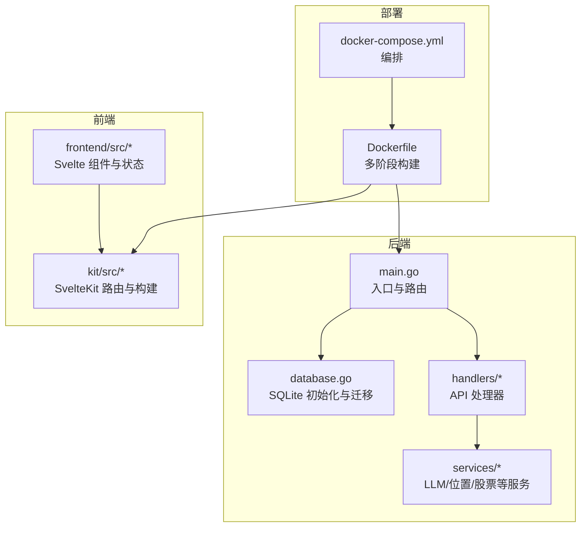
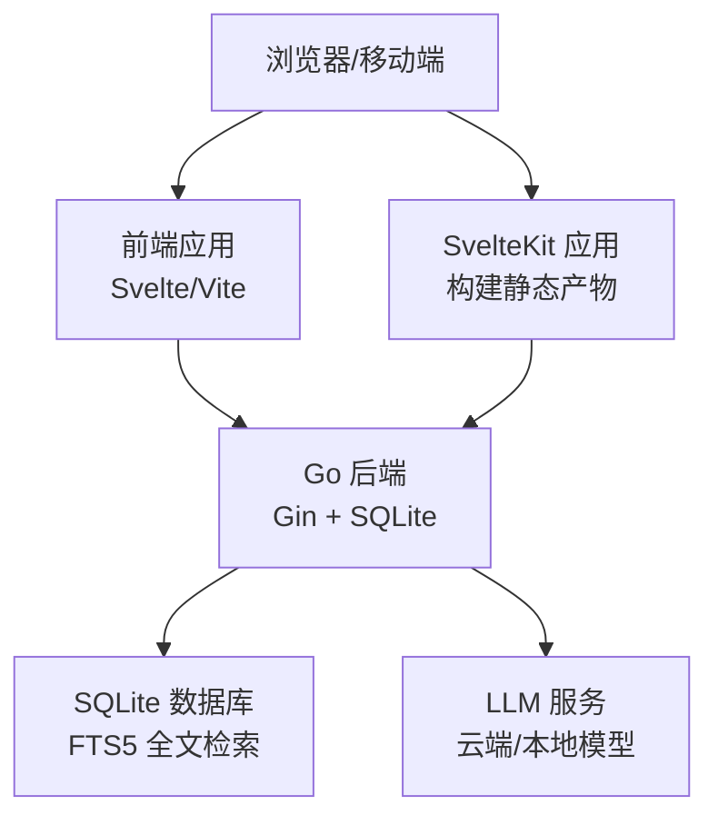
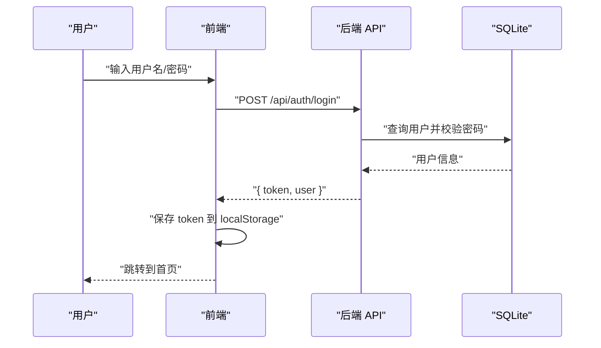
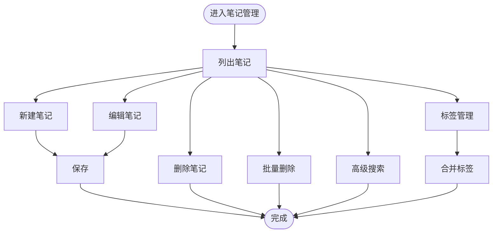
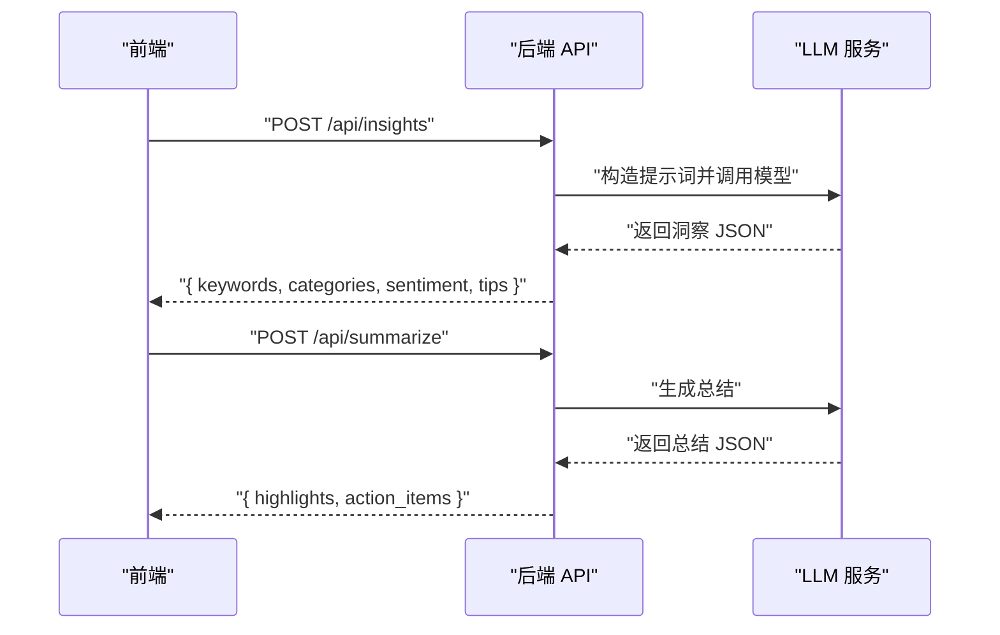
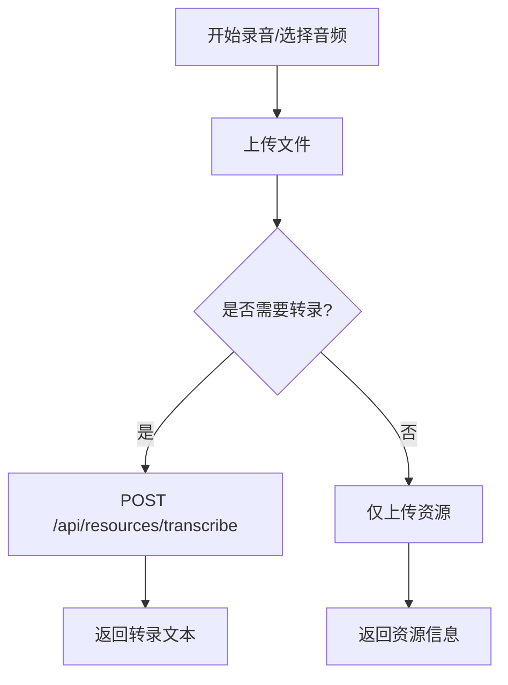
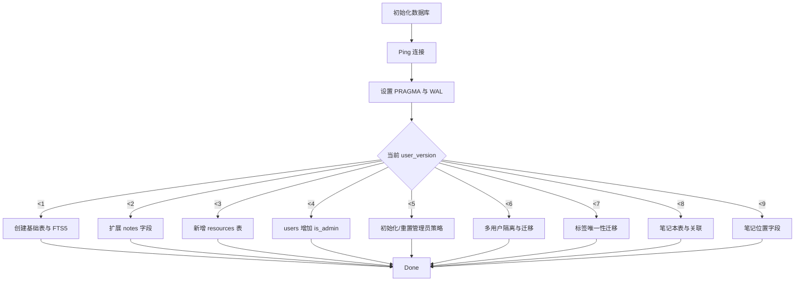
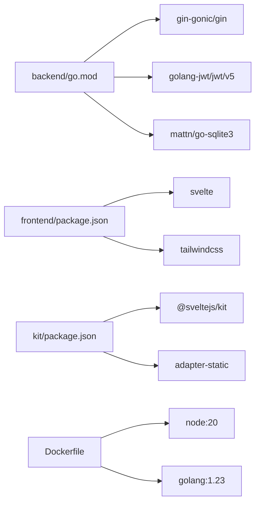

# 项目概述

<cite>
**本文引用的文件**
- [README.md](file://README.md)
- [backend/README.md](file://backend/README.md)
- [frontend/README.md](file://frontend/README.md)
- [docs/README_CN.md](file://docs/README_CN.md)
- [backend/main.go](file://backend/main.go)
- [backend/go.mod](file://backend/go.mod)
- [frontend/package.json](file://frontend/package.json)
- [kit/package.json](file://kit/package.json)
- [Dockerfile](file://Dockerfile)
- [docker-compose.yml](file://docker-compose.yml)
- [backend/database/database.go](file://backend/database/database.go)
- [backend/handlers/models.go](file://backend/handlers/models.go)
- [backend/services/llm.go](file://backend/services/llm.go)
- [backend/handlers/auth.go](file://backend/handlers/auth.go)
- [frontend/src/main.js](file://frontend/src/main.js)
- [frontend/src/stores/auth.js](file://frontend/src/stores/auth.js)
- [kit/src/lib/api.js](file://kit/src/lib/api.js)
</cite>

## 目录
1. [引言](#引言)
2. [项目结构](#项目结构)
3. [核心组件](#核心组件)
4. [架构总览](#架构总览)
5. [详细组件分析](#详细组件分析)
6. [依赖关系分析](#依赖关系分析)
7. [性能考量](#性能考量)
8. [故障排查指南](#故障排查指南)
9. [结论](#结论)
10. [附录](#附录)

## 引言
Memo Studio 是一款现代化的个人笔记应用，采用前后端分离架构，提供简洁美观的界面与强大的 AI 辅助能力。项目以 Flomo 风格的即时记录为核心体验，结合 AI 智能分析、多媒体资源管理、标签体系、位置识别与股票分析等功能，满足从日常记录到知识沉淀的多样化需求。

- 设计理念：以“轻记录、强分析、易分享”为目标，强调即刻输入与持续洞察的结合。
- 核心特性：Flomo 风格记录、AI 洞察与总结、语音转文本、多媒体资源、标签与笔记本组织、位置与股票分析、导出与导入、明暗主题与响应式设计。
- 技术选型：后端 Go + Gin + SQLite（含 FTS5 全文检索），前端 Svelte + Vite（Kit 适配静态产物），Docker 一键部署。

**章节来源**
- file://README.md#L1-L502
- file://docs/README_CN.md#L17-L40

## 项目结构
项目采用清晰的分层结构：
- backend：Go 后端服务，包含路由、中间件、处理器、数据库与业务服务。
- frontend：传统 Svelte 应用，提供笔记列表、编辑、搜索、导出等交互。
- kit：SvelteKit 应用，负责构建静态产物并由 Go 服务托管。
- docs：中文使用文档与设计说明。
- docker-compose 与 Dockerfile：统一打包与部署。

**图表来源**
- [backend/main.go](file://backend/main.go#L28-L196)
- [backend/database/database.go](file://backend/database/database.go#L20-L60)
- [frontend/src/main.js](file://frontend/src/main.js#L1-L20)
- [kit/package.json](file://kit/package.json#L1-L20)
- [Dockerfile](file://Dockerfile#L1-L81)
- [docker-compose.yml](file://docker-compose.yml#L1-L25)

**章节来源**
- file://README.md#L254-L273
- file://docs/README_CN.md#L565-L586

## 核心组件
- 后端服务（Go + Gin）
  - 路由分组：/api/v1 与兼容的 /api（旧版）。
  - 中间件：CORS、速率限制、鉴权、安全头。
  - 静态资源：/uploads 附件目录；SPA 回退至 index.html。
  - 数据库：SQLite + FTS5，自动迁移与多用户隔离。
- 前端应用（Svelte + Vite）
  - 组件化笔记管理、标签、搜索、导出、主题切换。
  - 状态管理：localStorage + 认证状态订阅。
- SvelteKit（可选新一代实现）
  - 构建静态产物并由 Go 服务托管，统一端口对外提供。
- AI 能力（LLM 服务）
  - 支持云端与本地模型，统一模型管理与切换。
  - 提供洞察分析、笔记总结、语音转文本、股票分析等能力。

**章节来源**
- file://backend/main.go#L55-L81
- file://backend/database/database.go#L20-L60
- file://backend/handlers/models.go#L164-L233
- file://backend/services/llm.go#L73-L192
- file://frontend/src/stores/auth.js#L1-L80
- file://kit/src/lib/api.js#L1-L35

## 架构总览
Memo Studio 采用前后端分离架构，后端提供 RESTful API 与静态资源托管，前端通过 AJAX 与后端交互。SvelteKit 构建产物可由 Go 直接托管，形成一体化的服务形态。

**图表来源**
- [backend/main.go](file://backend/main.go#L285-L316)
- [backend/database/database.go](file://backend/database/database.go#L243-L374)
- [backend/services/llm.go](file://backend/services/llm.go#L377-L387)
- [kit/package.json](file://kit/package.json#L1-L20)

**章节来源**
- file://README.md#L5-L9
- file://backend/README.md#L1-L40

## 详细组件分析

### 认证与用户管理
- 登录/注册：验证凭据后签发 JWT，前端保存 token 并在后续请求中携带。
- 当前用户：通过鉴权中间件获取用户信息。
- 管理员能力：仅限管理员访问用户管理接口。

**图表来源**
- [backend/handlers/auth.go](file://backend/handlers/auth.go#L27-L53)
- [frontend/src/stores/auth.js](file://frontend/src/stores/auth.js#L26-L56)
- [kit/src/lib/api.js](file://kit/src/lib/api.js#L35-L52)

**章节来源**
- file://backend/handlers/auth.go#L11-L111
- file://frontend/src/stores/auth.js#L1-L80
- file://kit/src/lib/api.js#L35-L52

### 笔记与标签管理
- 笔记：创建、读取、更新、删除、批量删除、搜索。
- 标签：创建、更新、删除、合并，支持按用户隔离。
- 笔记本：组织与归档笔记，支持关联查询。

**图表来源**
- [backend/main.go](file://backend/main.go#L113-L131)
- [backend/database/database.go](file://backend/database/database.go#L243-L374)

**章节来源**
- file://backend/main.go#L113-L131
- file://backend/database/database.go#L243-L374

### AI 洞察与总结
- 洞察分析：多维度统计与趋势分析，支持时间范围选择。
- 笔记总结：提取要点与行动项，支持批量总结。
- 模型管理：统一云端与本地模型配置，动态切换与健康检查。

**图表来源**
- [backend/handlers/models.go](file://backend/handlers/models.go#L164-L233)
- [backend/services/llm.go](file://backend/services/llm.go#L549-L591)
- [backend/services/llm.go](file://backend/services/llm.go#L605-L640)

**章节来源**
- file://backend/handlers/models.go#L164-L233
- file://backend/services/llm.go#L73-L192
- file://backend/services/llm.go#L549-L591
- file://backend/services/llm.go#L605-L640

### 语音转文本与多媒体
- 语音转文本：浏览器原生识别与录音上传，支持独立端点与上传即转。
- 资源管理：上传、列表、删除，支持附件目录与静态托管。

**图表来源**
- [backend/main.go](file://backend/main.go#L134-L140)
- [backend/main.go](file://backend/main.go#L135-L137)

**章节来源**
- file://backend/main.go#L134-L140

### 数据库与迁移
- SQLite + FTS5：全文检索与触发器维护，支持多用户隔离与标签唯一约束迁移。
- 迁移策略：基于 user_version 的增量迁移，保障向后兼容。

**图表来源**
- [backend/database/database.go](file://backend/database/database.go#L20-L60)
- [backend/database/database.go](file://backend/database/database.go#L62-L178)

**章节来源**
- file://backend/database/database.go#L20-L60
- file://backend/database/database.go#L62-L178

## 依赖关系分析
- 后端依赖
  - Gin：Web 框架与路由。
  - Gin-CORS：跨域配置。
  - JWT：令牌签发与校验。
  - SQLite3：数据库驱动。
- 前端依赖
  - Svelte：组件框架。
  - TailwindCSS：样式工具。
  - Vite：构建工具。
- SvelteKit 依赖
  - @sveltejs/kit：SSR/静态适配。
  - @sveltejs/adapter-static：静态产物适配。
- 部署依赖
  - Docker 多阶段构建：Node 构建 SvelteKit，Go 构建二进制并嵌入静态资源。
  - docker-compose：一键编排与数据卷挂载。

**图表来源**
- [backend/go.mod](file://backend/go.mod#L5-L11)
- [frontend/package.json](file://frontend/package.json#L11-L23)
- [kit/package.json](file://kit/package.json#L11-L17)
- [Dockerfile](file://Dockerfile#L1-L81)

**章节来源**
- file://backend/go.mod#L1-L45
- file://frontend/package.json#L1-L25
- file://kit/package.json#L1-L20
- file://Dockerfile#L1-L81

## 性能考量
- 后端
  - SQLite WAL 模式提升并发写入性能。
  - FTS5 全文检索加速关键词搜索。
  - Gin Release 模式与安全头减少不必要的开销。
- 前端
  - Vite HMR 提升开发效率。
  - SvelteKit 静态产物由 Go 直接托管，减少额外反向代理层级。
- 部署
  - 多阶段构建减少镜像体积。
  - 健康检查与非 root 用户运行提升稳定性与安全性。

[本节为通用指导，无需特定文件引用]

## 故障排查指南
- 端口占用
  - 9000/9001 被占用时，启动脚本会尝试清理；若失败，使用 lsof/kill 停止进程。
- 依赖安装失败
  - Go：go mod download/verify。
  - npm：删除 node_modules 重新安装。
- 数据库问题
  - 删除 notes.db 后重启服务，自动重建表结构。
- 热更新不工作
  - 前端：检查浏览器控制台与 Vite 日志。
  - 后端：安装 Air 实现热重载。

**章节来源**
- file://README.md#L446-L498
- file://docs/README_CN.md#L509-L559

## 结论
Memo Studio 以简洁的设计与强大的 AI 能力为核心，结合 Go + Gin + SQLite 的高可用后端与 Svelte/Vite 的现代前端技术栈，提供了从开发到部署的一体化体验。通过 Docker 与 SvelteKit 的集成，项目实现了“一次构建，多端复用”的高效交付模式。未来可进一步扩展模型生态、增强离线能力与多端同步，持续提升用户体验与可运维性。

[本节为总结性内容，无需特定文件引用]

## 附录

### 快速开始
- 一键启动（推荐）
  - macOS/Linux：./start.sh
  - Windows：start.bat
- 开发模式（SvelteKit）
  - ./dev-kit.sh（前端开发服务器在 :9001，API 代理到 :9000）
- 生产构建
  - ./start-prod.sh（Go 直接提供前端静态文件）

**章节来源**
- file://README.md#L11-L56

### 系统要求与环境准备
- 后端：Go 1.21+，SQLite3。
- 前端：Node.js 18+，npm/yarn。
- Docker：可选，用于一键部署与数据持久化。

**章节来源**
- file://README.md#L381-L386
- file://docs/README_CN.md#L44-L51

### API 接口概览
- 认证：POST /api/auth/login、POST /api/auth/register、GET /api/auth/me。
- 笔记：GET/POST/PUT/DELETE /api/notes、/api/memos。
- 标签：GET/POST/PUT/DELETE /api/tags、POST /api/tags/merge。
- AI：POST /api/insights、POST /api/summarize、POST /api/summarize/batch。
- 资源：GET/POST/DELETE /api/resources、POST /api/resources/transcribe。
- 模型：GET/POST /api/models、GET/POST /api/models/active、POST /api/models/test。

**章节来源**
- file://README.md#L297-L368
- file://docs/README_CN.md#L394-L457

### 部署与配置
- Docker 运行：docker run，指定 MEMO_JWT_SECRET、MEMO_ADMIN_PASSWORD、CORS 白名单等。
- docker-compose：一键编排，数据卷挂载至 /data。
- 环境变量：PORT、MEMO_DB_PATH、MEMO_STORAGE_DIR、MEMO_JWT_SECRET、MEMO_ENV 等。

**章节来源**
- file://README.md#L61-L128
- file://docker-compose.yml#L1-L25
- file://Dockerfile#L47-L81